# 📊 Complete Software Design Diagrams Guide

## 🎯 **Overview**

This comprehensive guide covers all essential diagram types for SDE2+ level software engineering, including UML diagrams, system architecture diagrams, database diagrams, and specialized technical diagrams. Each diagram type includes detailed explanations, practical examples, and hands-on projects.

## 📋 **Table of Contents**

1. [UML Behavioral Diagrams](#uml-behavioral-diagrams)
2. [UML Structural Diagrams](#uml-structural-diagrams)
3. [System Architecture Diagrams](#system-architecture-diagrams)
4. [Database Design Diagrams](#database-design-diagrams)
5. [Network & Infrastructure Diagrams](#network--infrastructure-diagrams)
6. [Process & Workflow Diagrams](#process--workflow-diagrams)
7. [Specialized Technical Diagrams](#specialized-technical-diagrams)
8. [Tools & Best Practices](#tools--best-practices)

---

## 🔄 **UML Behavioral Diagrams**

Behavioral diagrams show the dynamic behavior of objects and their interactions over time.

### **1. Sequence Diagrams**

**Purpose**: Show object interactions arranged in time sequence

**When to Use**:

- API call flows
- User authentication processes
- Database transaction flows
- Microservice communication

**Key Components**:

- **Actors**: External entities (users, systems)
- **Objects**: System components or classes
- **Lifelines**: Vertical lines showing object existence
- **Messages**: Arrows showing method calls or communications
- **Activation Boxes**: Rectangles showing when object is active

**Example: User Authentication Flow**


**Real-world Application**:


**Best Practices**:

- Keep diagrams focused (max 7-10 objects)
- Use descriptive message names
- Show error conditions with dashed lines
- Include timing constraints when relevant
- Group related interactions with frames

### **2. Activity Diagrams**

**Purpose**: Show workflow and business process flows

**When to Use**:

- Business process modeling
- Algorithm flowcharts
- User journey mapping
- System workflow documentation

**Key Components**:

- **Start/End Nodes**: Black circles
- **Activities**: Rounded rectangles
- **Decision Points**: Diamonds
- **Forks/Joins**: Black bars for parallel processing
- **Swimlanes**: Vertical/horizontal partitions for responsibilities

**Example: E-commerce Order Processing**


**Complex Business Process with Swimlanes**:

```mermaid
flowchart TD
    subgraph Customer
        A[Browse Products]
        B[Add to Cart]
        C[Checkout]
        M[Receive Order]
    end

    subgraph "Order System"
        D[Validate Order]
        E[Process Payment]
        F[Generate Order ID]
    end

    subgraph "Inventory System"
        G[Check Stock]
        H[Reserve Items]
        I[Update Inventory]
    end

    subgraph "Fulfillment"
        J[Pick Items]
        K[Pack Order]
        L[Ship Order]
    end

    A --> B --> C --> D
    D --> E --> F
    F --> G --> H --> I
    I --> J --> K --> L
    L --> M

    style Customer fill:#E1F5FE
    style "Order System" fill:#F3E5F5
    style "Inventory System" fill:#E8F5E8
    style "Fulfillment" fill:#FFF3E0
```

### **3. State Diagrams**

**Purpose**: Show object states and transitions between states

**When to Use**:

- Object lifecycle modeling
- System state management
- UI component states
- Protocol state machines

**Key Components**:

- **States**: Rounded rectangles
- **Transitions**: Arrows with triggers/conditions
- **Initial State**: Black circle
- **Final State**: Black circle with ring
- **Guard Conditions**: Conditions in square brackets
- **Actions**: Activities triggered by transitions

**Example: Order State Machine**


**User Session State Machine**:


### **4. Use Case Diagrams**

**Purpose**: Show system functionality from user perspective

**When to Use**:

- Requirements gathering
- System scope definition
- Actor identification
- Feature documentation

**Key Components**:

- **Actors**: Stick figures (users) or rectangles (systems)
- **Use Cases**: Ovals representing functionality
- **System Boundary**: Rectangle containing use cases
- **Relationships**: Include, extend, generalization

**Example: E-commerce System**


### **5. Communication Diagrams**

**Purpose**: Show object interactions emphasizing relationships

**When to Use**:

- Alternative to sequence diagrams
- Emphasizing object relationships
- Complex interaction patterns
- Architecture communication

**Example: MVC Pattern Communication**


---

## 🏗️ **UML Structural Diagrams**

Structural diagrams show static structure and relationships between system components.

### **1. Class Diagrams** _(Already covered in patterns)_

**Enhanced Example: Complete E-commerce Domain Model**

```mermaid
classDiagram
    class User {
        -String userId
        -String email
        -String password
        -UserProfile profile
        +login() boolean
        +register() void
        +updateProfile() void
    }

    class Customer {
        -List~Order~ orders
        -ShoppingCart cart
        +placeOrder() Order
        +viewOrderHistory() List~Order~
    }

    class Admin {
        -List~Permission~ permissions
        +manageInventory() void
        +viewReports() Report
    }

    class Order {
        -String orderId
        -Date orderDate
        -OrderStatus status
        -BigDecimal totalAmount
        +calculateTotal() BigDecimal
        +updateStatus() void
    }

    class OrderItem {
        -Product product
        -int quantity
        -BigDecimal price
        +getSubtotal() BigDecimal
    }

    class Product {
        -String productId
        -String name
        -BigDecimal price
        -int stockQuantity
        -Category category
        +updateStock() void
        +getPrice() BigDecimal
    }

    class Category {
        -String categoryId
        -String name
        -List~Product~ products
    }

    class ShoppingCart {
        -List~CartItem~ items
        +addItem() void
        +removeItem() void
        +getTotal() BigDecimal
    }

    User <|-- Customer
    User <|-- Admin
    Customer ||--o{ Order
    Order ||--o{ OrderItem
    OrderItem }o--|| Product
    Product }o--|| Category
    Customer ||--|| ShoppingCart
```

### **2. Component Diagrams**

**Purpose**: Show system architecture and component relationships

**When to Use**:

- System architecture documentation
- Module dependencies
- Deployment planning
- Integration points

**Example: Microservices Architecture**


### **3. Package Diagrams**

**Purpose**: Show package dependencies and organization

**Example: Java Application Structure**


### **4. Deployment Diagrams**

**Purpose**: Show physical deployment of software components

**Example: Cloud Deployment Architecture**


---

## 🏛️ **System Architecture Diagrams**

### **1. System Context Diagrams**

**Purpose**: Show system boundaries and external interactions

**Example: E-commerce System Context**


### **2. Layered Architecture Diagrams**

**Purpose**: Show architectural layers and their responsibilities

**Example: Enterprise Application Architecture**

```mermaid
graph TB
    subgraph "Presentation Layer"
        WebUI[Web UI<br/>React/Angular]
        MobileUI[Mobile UI<br/>React Native]
        AdminUI[Admin Portal<br/>Vue.js]
        API[REST API<br/>Controllers]
    end

    subgraph "Business Logic Layer"
        UserService[User Service]
        ProductService[Product Service]
        OrderService[Order Service]
        PaymentService[Payment Service]
        InventoryService[Inventory Service]
    end

    subgraph "Data Access Layer"
        UserRepo[User Repository]
        ProductRepo[Product Repository]
        OrderRepo[Order Repository]
        CacheRepo[Cache Repository]
    end

    subgraph "Infrastructure Layer"
        Database[Database<br/>PostgreSQL]
        Cache[Cache<br/>Redis]
        MessageQueue[Message Queue<br/>RabbitMQ]
        FileStorage[File Storage<br/>AWS S3]
    end

    subgraph "Cross-Cutting Concerns"
        Security[Security<br/>Authentication/Authorization]
        Logging[Logging<br/>ELK Stack]
        Monitoring[Monitoring<br/>Prometheus]
        Config[Configuration<br/>Management]
    end

    WebUI --> API
    MobileUI --> API
    AdminUI --> API

    API --> UserService
    API --> ProductService
    API --> OrderService

    UserService --> UserRepo
    ProductService --> ProductRepo
    OrderService --> OrderRepo

    UserRepo --> Database
    ProductRepo --> Database
    OrderRepo --> Database
    CacheRepo --> Cache

    Security -.-> API
    Logging -.-> UserService
    Logging -.-> ProductService
    Logging -.-> OrderService
    Monitoring -.-> Database
    Monitoring -.-> Cache
```



### **3. Service-Oriented Architecture (SOA)**

**Example: Enterprise SOA**


---

## 🗄️ **Database Design Diagrams**

### **1. Entity Relationship Diagrams (ERD)**

**Purpose**: Show database structure and relationships

**Example: E-commerce Database ERD**


### **2. Database Schema Diagrams**

**Purpose**: Show detailed database implementation

**Example: User Management Schema**

```mermaid
graph TB
    subgraph "User Management Schema"
        subgraph "users table"
            users[users<br/>- user_id (PK)<br/>- email (UNIQUE)<br/>- password_hash<br/>- first_name<br/>- last_name<br/>- phone<br/>- is_active<br/>- created_at<br/>- updated_at]
        end

        subgraph "user_profiles table"
            profiles[user_profiles<br/>- profile_id (PK)<br/>- user_id (FK)<br/>- date_of_birth<br/>- gender<br/>- avatar_url<br/>- bio<br/>- preferences (JSON)<br/>- updated_at]
        end

        subgraph "user_roles table"
            roles[user_roles<br/>- role_id (PK)<br/>- role_name (UNIQUE)<br/>- description<br/>- permissions (JSON)<br/>- created_at]
        end

        subgraph "user_role_assignments table"
            assignments[user_role_assignments<br/>- assignment_id (PK)<br/>- user_id (FK)<br/>- role_id (FK)<br/>- assigned_at<br/>- assigned_by<br/>- is_active]
        end

        subgraph "user_sessions table"
            sessions[user_sessions<br/>- session_id (PK)<br/>- user_id (FK)<br/>- session_token<br/>- ip_address<br/>- user_agent<br/>- created_at<br/>- expires_at<br/>- is_active]
        end

        subgraph "audit_logs table"
            audit[audit_logs<br/>- log_id (PK)<br/>- user_id (FK)<br/>- action<br/>- entity_type<br/>- entity_id<br/>- old_values (JSON)<br/>- new_values (JSON)<br/>- ip_address<br/>- timestamp]
        end
    end

    users -->|1:1| profiles
    users -->|1:M| assignments
    roles -->|1:M| assignments
    users -->|1:M| sessions
    users -->|1:M| audit

    style users fill:#e1f5fe
    style profiles fill:#f3e5f5
    style roles fill:#e8f5e8
    style assignments fill:#fff3e0
    style sessions fill:#fce4ec
    style audit fill:#f1f8e9
```

### **3. Data Flow Diagrams**

**Purpose**: Show how data moves through system

**Example: Order Processing Data Flow**


---

## 🌐 **Network & Infrastructure Diagrams**

### **1. Network Architecture Diagrams**

**Purpose**: Show network topology and connections

**Example: Enterprise Network Architecture**

```mermaid
graph TB
    subgraph "Internet"
        Internet[Internet]
    end

    subgraph "DMZ (Demilitarized Zone)"
        Firewall1[External Firewall]
        LoadBalancer[Load Balancer]
        WebServers[Web Servers<br/>10.1.1.10-12]
        Firewall2[Internal Firewall]
    end

    subgraph "Internal Network"
        subgraph "Application Tier"
            AppServers[Application Servers<br/>10.2.1.10-15]
        end

        subgraph "Database Tier"
            DBServers[Database Servers<br/>10.3.1.10-12]
            BackupServer[Backup Server<br/>10.3.1.20]
        end

        subgraph "Management Network"
            MonitoringServer[Monitoring Server<br/>10.4.1.10]
            LogServer[Log Server<br/>10.4.1.11]
            ADServer[Active Directory<br/>10.4.1.12]
        end
    end

    Internet --> Firewall1
    Firewall1 --> LoadBalancer
    LoadBalancer --> WebServers
    WebServers --> Firewall2
    Firewall2 --> AppServers
    AppServers --> DBServers
    DBServers --> BackupServer

    MonitoringServer -.-> WebServers
    MonitoringServer -.-> AppServers
    MonitoringServer -.-> DBServers
    LogServer -.-> WebServers
    LogServer -.-> AppServers
```

### **2. Cloud Infrastructure Diagrams**

**Example: AWS Multi-Region Architecture**

```mermaid
graph TB
    subgraph "Route 53"
        DNS[DNS & Health Checks]
    end

    subgraph "US-East-1 (Primary)"
        subgraph "VPC-East"
            subgraph "Public Subnet East"
                ALB_East[Application Load Balancer]
                NAT_East[NAT Gateway]
            end

            subgraph "Private Subnet East"
                EC2_East[EC2 Instances<br/>Auto Scaling Group]
            end

            subgraph "Database Subnet East"
                RDS_East[RDS Multi-AZ<br/>Primary]
            end
        end

        CloudFront[CloudFront CDN]
        S3_East[S3 Bucket<br/>Primary]
    end

    subgraph "US-West-2 (DR)"
        subgraph "VPC-West"
            subgraph "Public Subnet West"
                ALB_West[Application Load Balancer]
                NAT_West[NAT Gateway]
            end

            subgraph "Private Subnet West"
                EC2_West[EC2 Instances<br/>Auto Scaling Group]
            end

            subgraph "Database Subnet West"
                RDS_West[RDS Cross-Region<br/>Read Replica]
            end
        end

        S3_West[S3 Bucket<br/>Cross-Region Replication]
    end

    Users[Users] --> DNS
    DNS --> CloudFront
    CloudFront --> S3_East
    DNS --> ALB_East
    DNS -.->|Failover| ALB_West

    ALB_East --> EC2_East
    ALB_West --> EC2_West
    EC2_East --> RDS_East
    EC2_West --> RDS_West

    RDS_East -.->|Replication| RDS_West
    S3_East -.->|Replication| S3_West
```

### **3. Security Architecture Diagrams**

**Example: Zero Trust Security Model**

```mermaid
graph TB
    subgraph "External"
        Users[Users/Devices]
        Threats[Threats/Attackers]
    end

    subgraph "Security Perimeter"
        subgraph "Identity & Access Management"
            IAM[Identity Provider<br/>Azure AD/Okta]
            MFA[Multi-Factor Authentication]
            RBAC[Role-Based Access Control]
        end

        subgraph "Network Security"
            Firewall[Next-Gen Firewall]
            IPS[Intrusion Prevention System]
            VPN[VPN Gateway]
            ZeroTrust[Zero Trust Network Access]
        end

        subgraph "Data Protection"
            DLP[Data Loss Prevention]
            Encryption[Encryption at Rest/Transit]
            KeyManagement[Key Management Service]
        end

        subgraph "Monitoring & Analytics"
            SIEM[SIEM System]
            SOC[Security Operations Center]
            ThreatIntel[Threat Intelligence]
        end
    end

    subgraph "Protected Resources"
        Applications[Applications]
        Databases[Databases]
        FileServers[File Servers]
        APIs[APIs]
    end

    Users --> IAM
    IAM --> MFA
    MFA --> RBAC
    RBAC --> ZeroTrust
    ZeroTrust --> Applications

    Users --> VPN
    VPN --> Firewall
    Firewall --> IPS
    IPS --> Applications

    Applications --> DLP
    Applications --> Encryption
    Databases --> Encryption
    Encryption --> KeyManagement

    Applications -.-> SIEM
    Databases -.-> SIEM
    SIEM --> SOC
    SOC --> ThreatIntel

    Threats -.->|Blocked| Firewall
    Threats -.->|Detected| IPS
    Threats -.->|Monitored| SIEM
```

---

## ⚙️ **Process & Workflow Diagrams**

### **1. Business Process Model and Notation (BPMN)**

**Purpose**: Model business processes with standard notation

**Example: Customer Onboarding Process**

```mermaid
flowchart LR
    A([Start: New Customer]) --> B[Collect Customer Information]
    B --> C{Information Complete?}
    C -->|No| D[Request Missing Information]
    D --> B
    C -->|Yes| E[Verify Identity]
    E --> F{Identity Verified?}
    F -->|No| G[Request Additional Documents]
    G --> E
    F -->|Yes| H[Perform Credit Check]
    H --> I{Credit Approved?}
    I -->|No| J[Send Rejection Notice]
    I -->|Yes| K[Create Customer Account]
    K --> L[Send Welcome Package]
    L --> M[Setup Online Access]
    M --> N[Schedule Follow-up Call]
    N --> O([End: Customer Onboarded])
    J --> P([End: Application Rejected])

    style A fill:#90EE90
    style O fill:#90EE90
    style P fill:#FFB6C1
    style J fill:#FFB6C1
```

### **2. Swimlane Diagrams**

**Purpose**: Show process flow across different responsibilities

**Example: Software Development Lifecycle**

```mermaid
flowchart TD
    subgraph "Product Manager"
        A[Define Requirements]
        B[Create User Stories]
        L[Review & Accept]
    end

    subgraph "Developer"
        C[Design Solution]
        D[Implement Features]
        E[Unit Testing]
        F[Code Review]
    end

    subgraph "QA Engineer"
        G[Create Test Cases]
        H[Execute Tests]
        I[Report Bugs]
        M[Regression Testing]
    end

    subgraph "DevOps Engineer"
        J[Setup CI/CD]
        K[Deploy to Staging]
        N[Deploy to Production]
        O[Monitor Performance]
    end

    A --> B --> C
    C --> D --> E
    E --> F --> G
    G --> H --> I
    I -->|Bugs Found| D
    F --> J --> K
    H -->|Tests Pass| L
    L --> M --> N --> O

    style A fill:#E3F2FD
    style C fill:#E8F5E8
    style G fill:#FFF3E0
    style J fill:#F3E5F5
```

### **3. Value Stream Mapping**

**Purpose**: Visualize entire process flow with metrics

**Example: Software Delivery Value Stream**

```mermaid
flowchart LR
    subgraph "Development"
        A[Feature Request<br/>Lead Time: 2 days<br/>Process Time: 30 min]
        B[Development<br/>Lead Time: 5 days<br/>Process Time: 3 days]
        C[Code Review<br/>Lead Time: 1 day<br/>Process Time: 2 hours]
    end

    subgraph "Testing"
        D[QA Testing<br/>Lead Time: 3 days<br/>Process Time: 1 day]
        E[User Acceptance<br/>Lead Time: 2 days<br/>Process Time: 4 hours]
    end

    subgraph "Deployment"
        F[Staging Deploy<br/>Lead Time: 30 min<br/>Process Time: 15 min]
        G[Production Deploy<br/>Lead Time: 1 day<br/>Process Time: 30 min]
    end

    Customer[Customer Request] --> A
    A --> B --> C --> D --> E --> F --> G
    G --> CustomerValue[Customer Value]

    A -.->|Wait: 1.5 days| B
    B -.->|Wait: 2 days| C
    C -.->|Wait: 22 hours| D
    D -.->|Wait: 2 days| E
    E -.->|Wait: 1.5 days| F
    F -.->|Wait: 23.5 hours| G

    TotalLead[Total Lead Time: 14.5 days<br/>Total Process Time: 5.75 days<br/>Efficiency: 40%]
```

---

## 🔧 **Specialized Technical Diagrams**

### **1. API Documentation Diagrams**

**Purpose**: Document API structure and interactions

**Example: REST API Architecture**

```mermaid
graph TB
    subgraph "API Gateway"
        Gateway[API Gateway<br/>- Rate Limiting<br/>- Authentication<br/>- Routing<br/>- Monitoring]
    end

    subgraph "Authentication Service"
        Auth[Auth API<br/>/auth/login<br/>/auth/refresh<br/>/auth/logout]
    end

    subgraph "User Service"
        UserAPI[User API<br/>/users<br/>/users/{id}<br/>/users/{id}/profile]
    end

    subgraph "Product Service"
        ProductAPI[Product API<br/>/products<br/>/products/{id}<br/>/products/search<br/>/categories]
    end

    subgraph "Order Service"
        OrderAPI[Order API<br/>/orders<br/>/orders/{id}<br/>/orders/{id}/items<br/>/orders/{id}/status]
    end

    Client[Client Applications] --> Gateway
    Gateway --> Auth
    Gateway --> UserAPI
    Gateway --> ProductAPI
    Gateway --> OrderAPI

    Gateway -.->|JWT Validation| Auth
```

### **2. Event-Driven Architecture Diagrams**

**Purpose**: Show event flows and message patterns

**Example: Event Sourcing Pattern**

```mermaid
sequenceDiagram
    participant C as Client
    participant API as Command API
    participant ES as Event Store
    participant P as Event Processor
    participant R as Read Model
    participant Q as Query API

    C->>API: Send Command
    API->>API: Validate Command
    API->>ES: Store Event
    ES-->>API: Event Stored
    API-->>C: Command Accepted

    ES->>P: Publish Event
    P->>P: Process Event
    P->>R: Update Read Model

    Note over ES,P: Async Event Processing

    C->>Q: Query Data
    Q->>R: Fetch from Read Model
    R-->>Q: Return Data
    Q-->>C: Query Response
```

### **3. Monitoring & Observability Diagrams**

**Purpose**: Show monitoring architecture and data flows

**Example: Comprehensive Monitoring Stack**

```mermaid
graph TB
    subgraph "Application Layer"
        App1[Application 1]
        App2[Application 2]
        App3[Application 3]
    end

    subgraph "Infrastructure Layer"
        K8s[Kubernetes Cluster]
        DB[(Database)]
        Cache[(Redis)]
    end

    subgraph "Data Collection"
        Prometheus[Prometheus<br/>Metrics Collection]
        Jaeger[Jaeger<br/>Distributed Tracing]
        Fluentd[Fluentd<br/>Log Aggregation]
    end

    subgraph "Data Processing"
        AlertManager[Alert Manager<br/>Alert Processing]
        Elasticsearch[Elasticsearch<br/>Log Storage & Search]
    end

    subgraph "Visualization"
        Grafana[Grafana<br/>Metrics Dashboard]
        Kibana[Kibana<br/>Log Analysis]
    end

    subgraph "Alerting"
        Slack[Slack Notifications]
        Email[Email Alerts]
        PagerDuty[PagerDuty Integration]
    end

    App1 --> Prometheus
    App2 --> Prometheus
    App3 --> Prometheus

    App1 --> Jaeger
    App2 --> Jaeger
    App3 --> Jaeger

    App1 --> Fluentd
    App2 --> Fluentd
    App3 --> Fluentd
    K8s --> Fluentd

    Prometheus --> AlertManager
    Prometheus --> Grafana

    Fluentd --> Elasticsearch
    Elasticsearch --> Kibana

    AlertManager --> Slack
    AlertManager --> Email
    AlertManager --> PagerDuty
```

---

## 🛠️ **Tools & Best Practices**

### **Recommended Diagramming Tools**

#### **1. Free/Open Source Tools**

**Draw.io (diagrams.net)**

- Web-based, no installation required
- Supports all diagram types
- Good for: Architecture, flowcharts, network diagrams
- Export formats: PNG, SVG, PDF, XML

**PlantUML**

- Text-based diagramming
- Version control friendly
- Good for: UML diagrams, sequence diagrams
- Integration with IDEs and documentation

**Mermaid**

- Markdown-like syntax
- GitHub integration
- Good for: Flowcharts, sequence diagrams, class diagrams
- Embedded in documentation

**Example PlantUML Sequence Diagram:**

```plantuml
@startuml
actor User
participant "Web App" as Web
participant "API Gateway" as Gateway
participant "Auth Service" as Auth
participant "User Service" as UserSvc
database "Database" as DB

User -> Web: Login request
Web -> Gateway: POST /auth/login
Gateway -> Auth: Validate credentials
Auth -> DB: Query user
DB --> Auth: User data
Auth --> Gateway: JWT token
Gateway --> Web: Authentication response
Web --> User: Login success
@enduml
```

#### **2. Commercial Tools**

**Lucidchart**

- Collaborative diagramming
- Templates and shapes libraries
- Good for: All diagram types, team collaboration
- Integration with Google Workspace, Microsoft 365

**Visio (Microsoft)**

- Professional diagramming
- Extensive shape libraries
- Good for: Network diagrams, floor plans, org charts
- Integration with Microsoft ecosystem

**OmniGraffle (Mac)**

- Mac-native diagramming
- Beautiful aesthetics
- Good for: Wireframes, flowcharts, presentations

#### **3. Architecture-Specific Tools**

**AWS Architecture Diagrams**

- AWS Architecture Icons
- Cloudcraft (3D cloud architecture)
- Lucidchart AWS templates

**Database Design**

- MySQL Workbench
- PostgreSQL pgAdmin
- dbdiagram.io

**Network Diagrams**

- Cisco Packet Tracer
- GNS3
- Network Notepad

### **Best Practices for Technical Diagrams**

#### **1. General Design Principles**

**Clarity and Simplicity**

- One diagram, one purpose
- Use consistent notation
- Avoid clutter and excessive detail
- Group related elements

**Proper Labeling**

- Clear, descriptive names
- Consistent naming conventions
- Include version and date
- Add legends when necessary

**Visual Hierarchy**

- Use size, color, and positioning to show importance
- Group related elements with containers
- Use consistent spacing and alignment
- Highlight critical paths or components

#### **2. Audience-Specific Guidelines**

**For Developers**

- Include technical details
- Show implementation specifics
- Use accurate technical terminology
- Include code snippets or APIs

**For Stakeholders**

- Focus on business value
- Use business terminology
- Hide technical complexity
- Show user journeys and outcomes

**For Operations**

- Include deployment details
- Show monitoring and alerting
- Include capacity and scaling information
- Document failure scenarios

#### **3. Maintenance and Version Control**

**Living Documentation**

- Update diagrams with code changes
- Include diagrams in code reviews
- Automate diagram generation where possible
- Regular review and cleanup

**Version Control**

- Store diagrams in source control
- Use text-based formats when possible
- Track changes and approval process
- Maintain change log

### **Integration with Development Workflow**

#### **1. Documentation as Code**

**Markdown Integration**

````markdown
## System Architecture

The following diagram shows our microservices architecture:

```mermaid
graph TB
    A[API Gateway] --> B[User Service]
    A --> C[Order Service]
    B --> D[(User DB)]
    C --> E[(Order DB)]
```
````

This architecture supports horizontal scaling...

```

**Automated Generation**
- Generate diagrams from code annotations
- Update documentation automatically
- Validate diagram consistency
- Include in CI/CD pipeline

#### **2. Collaborative Review Process**

**Diagram Reviews**
- Include diagrams in design reviews
- Validate against implementation
- Gather feedback from stakeholders
- Document decisions and rationale

**Change Management**
- Require approval for architectural changes
- Update diagrams before implementation
- Communicate changes to team
- Archive old versions

---

## 🎯 **Hands-on Projects**

### **Project 1: E-commerce System Complete Modeling**

**Objective**: Create a complete set of diagrams for an e-commerce system

**Deliverables**:
1. **Use Case Diagram** - System functionality
2. **Class Diagram** - Domain model
3. **Sequence Diagrams** - Key user flows (login, purchase, checkout)
4. **Activity Diagram** - Order processing workflow
5. **Component Diagram** - System architecture
6. **Deployment Diagram** - Production deployment
7. **ERD** - Database design
8. **Network Diagram** - Infrastructure layout

**Skills Practiced**:
- Complete system modeling
- Different diagram types integration
- Business and technical perspectives
- Documentation standards

### **Project 2: Microservices Migration Planning**

**Objective**: Document migration from monolith to microservices

**Deliverables**:
1. **Current State Architecture** - Monolithic system
2. **Future State Architecture** - Microservices design
3. **Migration Roadmap** - Step-by-step process
4. **Service Boundary Analysis** - Domain-driven design
5. **Data Migration Strategy** - Database decomposition
6. **Communication Patterns** - Inter-service communication

### **Project 3: Security Architecture Documentation**

**Objective**: Design comprehensive security architecture

**Deliverables**:
1. **Threat Model Diagram** - Security threats and mitigations
2. **Network Security Diagram** - Firewalls, VPNs, zones
3. **Identity and Access Management** - Authentication flows
4. **Data Flow Diagram** - Sensitive data handling
5. **Incident Response Process** - Security incident workflow

---

## 📚 **Study Plan: 4-Week Diagram Mastery**

### **Week 1: UML Behavioral Diagrams**
- **Day 1-2**: Sequence Diagrams theory and practice
- **Day 3-4**: Activity Diagrams and BPMN
- **Day 5-6**: State Diagrams and Use Case Diagrams
- **Day 7**: Project: Model user authentication system

### **Week 2: UML Structural & Architecture Diagrams**
- **Day 1-2**: Class Diagrams advanced patterns
- **Day 3-4**: Component and Package Diagrams
- **Day 5-6**: Deployment and System Architecture
- **Day 7**: Project: Design microservices architecture

### **Week 3: Database & Infrastructure Diagrams**
- **Day 1-2**: ERD and Database Schema Design
- **Day 3-4**: Network and Cloud Architecture
- **Day 5-6**: Security and Monitoring Diagrams
- **Day 7**: Project: Complete infrastructure documentation

### **Week 4: Process & Integration**
- **Day 1-2**: Business Process Modeling
- **Day 3-4**: Integration with development workflow
- **Day 5-6**: Tools mastery and automation
- **Day 7**: Final project: Complete system documentation

---

## 🏆 **Assessment & Certification**

### **Skill Assessment Criteria**

**Beginner Level (25%)**
- [ ] Can create basic flowcharts and simple diagrams
- [ ] Understands diagram purposes and basic notation
- [ ] Uses appropriate tools for simple diagrams

**Intermediate Level (50%)**
- [ ] Creates accurate UML diagrams for software systems
- [ ] Documents system architecture effectively
- [ ] Integrates diagrams into development process

**Advanced Level (75%)**
- [ ] Designs complex system architectures
- [ ] Creates comprehensive documentation sets
- [ ] Mentors others on diagramming best practices

**Expert Level (100%)**
- [ ] Leads architectural design and documentation
- [ ] Innovates diagramming practices and standards
- [ ] Communicates complex systems to diverse audiences

### **Portfolio Requirements**

**Minimum Deliverables**:
- 3 complete system documentation sets
- Examples of each major diagram type
- Integration with real development projects
- Documentation of design decisions and rationale

---

This comprehensive guide provides everything needed to master all types of software design diagrams for SDE2+ level engineering. Practice with real projects and integrate diagramming into your daily development workflow for maximum benefit.

**Next Steps**: Choose a current project and begin documenting it using the diagram types most relevant to your work. Start with high-level architecture and progressively add detail.
```
