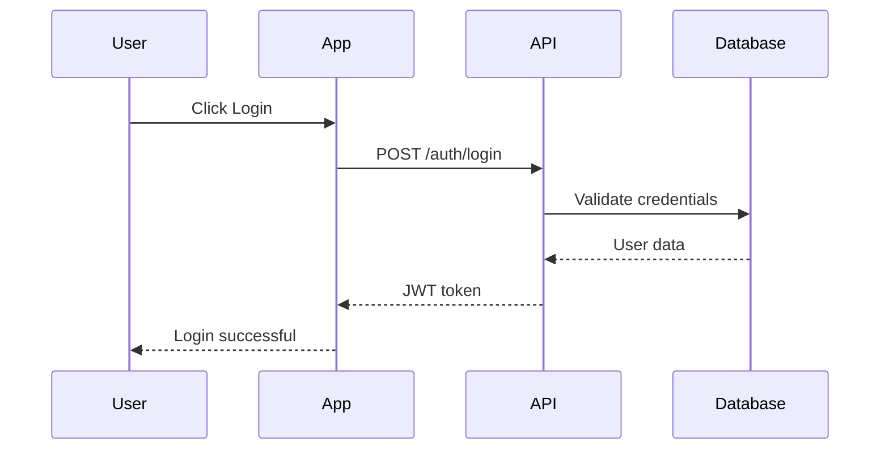

# 🚀 START YOUR DIAGRAM MASTERY TODAY!

## ⚡ **IMMEDIATE ACTION PLAN (Next 30 Minutes)**

### **Step 1: Tool Setup (5 minutes)**

```bash
# Install Mermaid VS Code Extension
# 1. Open VS Code
# 2. Go to Extensions (Ctrl+Shift+X)
# 3. Search "Mermaid"
# 4. Install "Mermaid Preview" by vstirbu
```

### **Step 2: Create Your First Diagram (10 minutes)**

Create a new file: `my-first-sequence-diagram.md`

````markdown
# My First Sequence Diagram


````

```

### **Step 3: Read Foundation Material (15 minutes)**
- [ ] Open `uml-behavioral/01-sequence-diagrams.md`
- [ ] Read sections: Overview, Key Components, Example 1
- [ ] Bookmark for detailed study later

## 📅 **TODAY'S SCHEDULE (Day 1)**

### **🌅 Morning (45 minutes) - Foundation Setup**
**Time**: Before work or during lunch

- [ ] **Setup Tools** (10 min): Mermaid VS Code extension + Draw.io account
- [ ] **Read Guide** (25 min): `uml-behavioral/01-sequence-diagrams.md` (sections 1-3)
- [ ] **First Practice** (10 min): Create login sequence diagram

### **🌙 Evening (30 minutes) - Apply to Real Work**
**Time**: After work

- [ ] **Identify Current Project Flow** (10 min): Pick one API/feature you work with
- [ ] **Create Diagram** (15 min): Document that flow as sequence diagram
- [ ] **Reflect** (5 min): What was challenging? What did you learn?

## 🎯 **THIS WEEK'S GOALS (Week 1: Behavioral Diagrams)**

### **Daily Objectives**
- **Day 1** (Today): ✅ Sequence diagrams basics + first real diagram
- **Day 2**: 🔄 Advanced sequence diagrams + error handling
- **Day 3**: ⚙️ Activity diagrams + team process mapping
- **Day 4**: 🔄 State diagrams + object lifecycle modeling
- **Day 5**: 👥 Use case + communication diagrams
- **Day 6-7**: 🏗️ Weekend project: Complete chat application design

### **Week 1 Success Criteria**
- [ ] Created 10+ sequence diagrams (3 from real work)
- [ ] Documented team development process with activity diagram
- [ ] Modeled user authentication with state diagram
- [ ] Completed weekend integration project

## 📊 **Daily Tracking Template**

### **Day 1 Progress Tracker**
```

Date: ****\_\_\_****

Morning Session (45 min):
□ Tool setup complete
□ Read sequence diagrams guide (sections 1-3)
□ Created first practice diagram

Evening Session (30 min):
□ Identified real project flow: ******\_\_\_\_******
□ Created sequence diagram for: ******\_\_\_******
□ Documented challenges/learnings: ****\_\_\_\_****

Tomorrow's Focus: Advanced sequence diagrams + error handling

```

## 🛠️ **Essential Tools for This Week**

### **Primary Tools (Choose One)**
- **Mermaid** (Recommended): Text-based, version control friendly
- **Draw.io** (Beginner-friendly): Visual editor, easy to start

### **Setup Links**
- **Mermaid VS Code**: Extensions → Search "Mermaid Preview"
- **Draw.io**: https://app.diagrams.net (no account needed)
- **Mermaid Online**: https://mermaid.live (for quick testing)

## 📚 **Study Resources Ready**

### **Your Learning Path**
1. **Main Study Plan**: `DIAGRAM_MASTERY_STUDY_PLAN.md` (complete 4-week guide)
2. **Week 1 Content**: `uml-behavioral/` folder (5 detailed guides)
3. **Quick Reference**: `README.md` (navigation and overview)

### **Study Order for Week 1**
```

Day 1-2: uml-behavioral/01-sequence-diagrams.md (11KB guide)
Day 3: uml-behavioral/02-activity-diagrams.md
Day 4: uml-behavioral/03-state-diagrams.md
Day 5: uml-behavioral/04-use-case-diagrams.md + 05-communication-diagrams.md

```

## 🏆 **Motivation & Benefits**

### **Why Start Today?**
- **Immediate Impact**: Use sequence diagrams in tomorrow's work
- **Career Boost**: Visual communication is a senior engineer skill
- **Interview Prep**: System design interviews require diagram fluency
- **Team Leadership**: Document and improve team processes

### **Week 1 Outcomes**
By next Friday, you'll be able to:
✅ **Document any API flow** with professional sequence diagrams
✅ **Model business processes** with activity diagrams
✅ **Design state machines** for complex objects
✅ **Communicate system behavior** to any audience

## 🚀 **Ready to Start?**

### **Right Now (Next 5 minutes)**
1. [ ] Install Mermaid VS Code extension
2. [ ] Create folder `my-diagram-practice/`
3. [ ] Open `uml-behavioral/01-sequence-diagrams.md`
4. [ ] Set daily study reminder on phone

### **Today's Commitment**
- [ ] I commit to 45 minutes of study today
- [ ] I will create at least 2 sequence diagrams
- [ ] I will apply this to one real project flow
- [ ] I will track my progress

---

## 📞 **Quick Help**

**Stuck on Setup?**
- Mermaid not working? Try the online editor: https://mermaid.live
- Need visual tool? Go to https://app.diagrams.net

**Don't Understand Something?**
- Start with the examples in the guides
- Create simple versions first
- Practice with familiar systems (login, shopping cart)

**No Time Today?**
- Minimum viable day: 15 minutes reading + 1 simple diagram
- Weekend catch-up available in study plan
- Consistency matters more than perfection

---

**🎯 Your diagram mastery journey starts NOW! Open that first guide and create your first sequence diagram in the next 15 minutes!** 🚀

**Remember: Every expert was once a beginner. Your first diagram doesn't need to be perfect - it just needs to exist!** 💪
```
