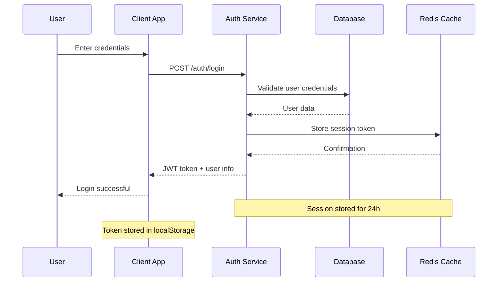
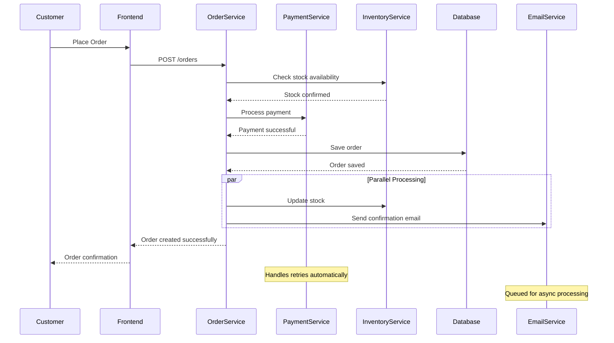
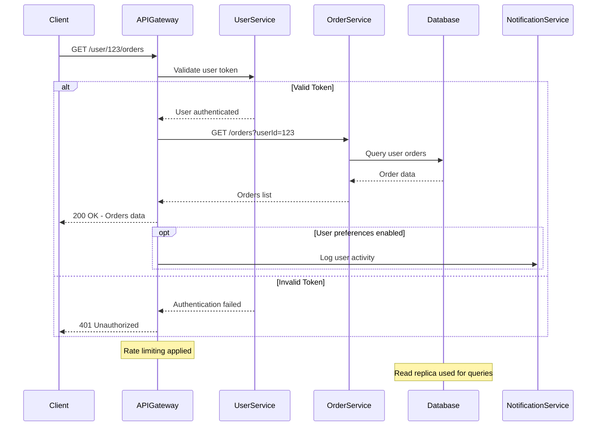
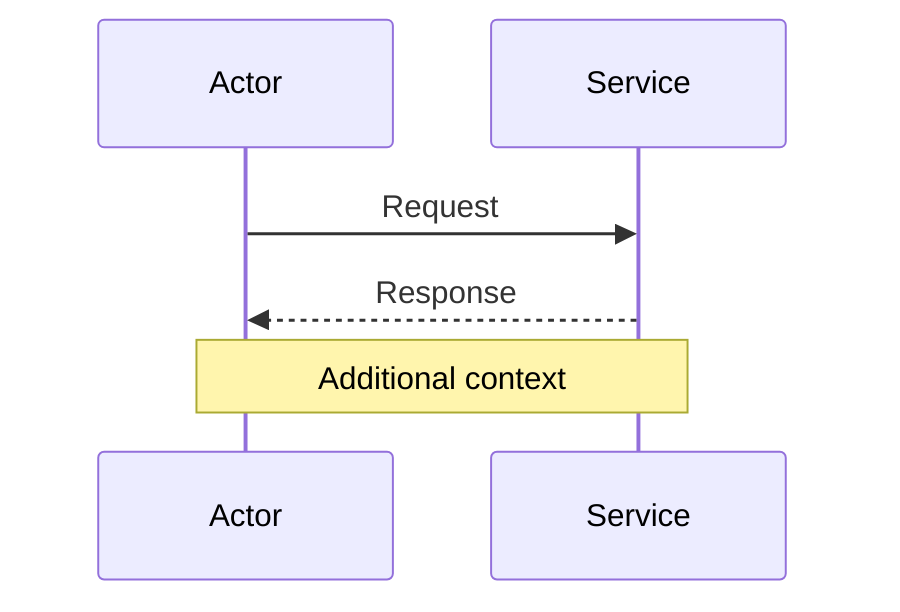
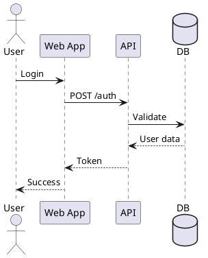
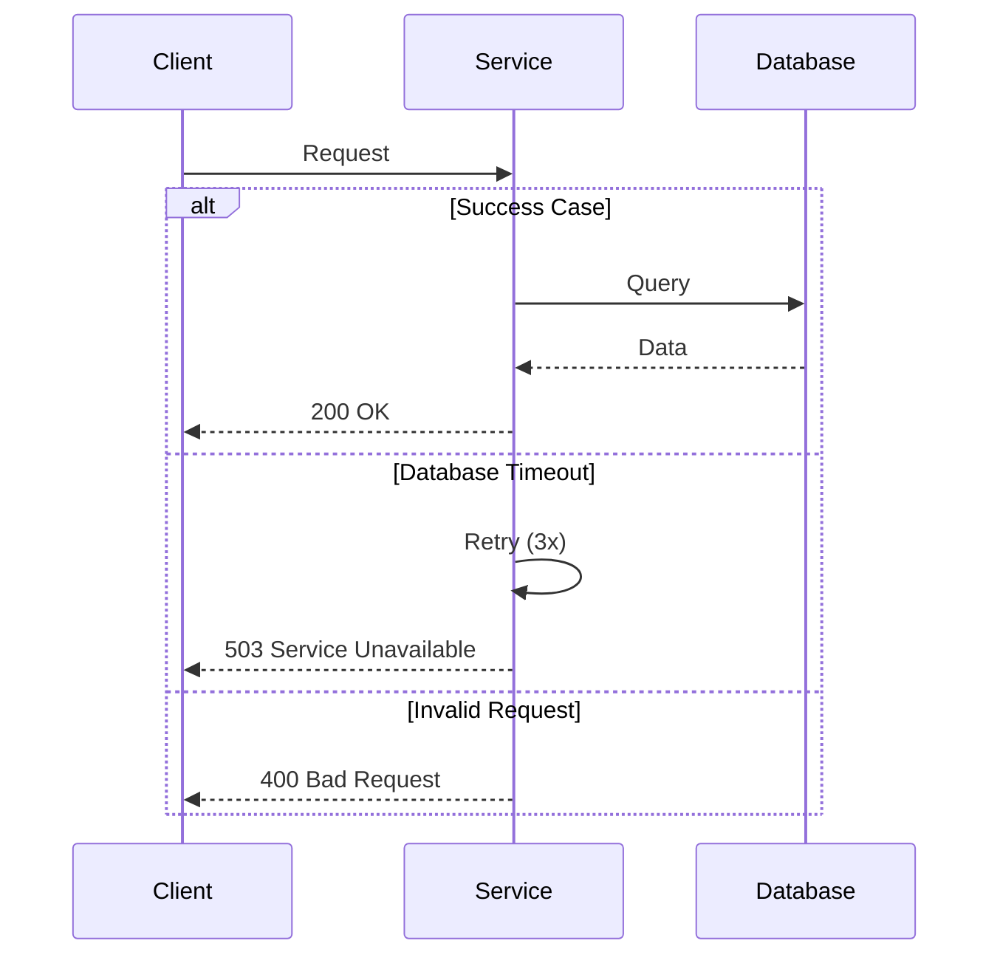
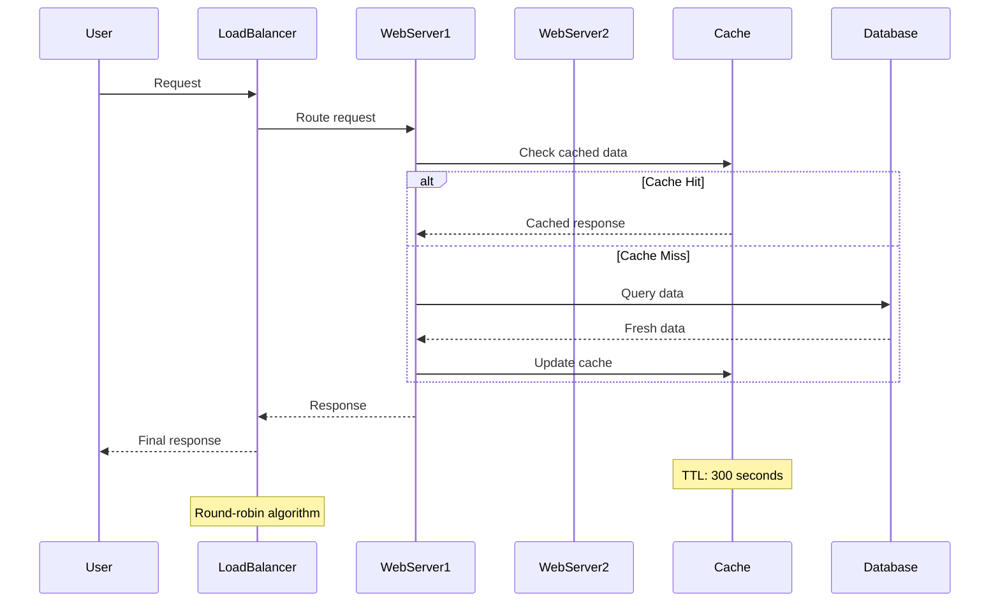

# 🔄 Sequence Diagrams - Complete Guide

## 🎯 **Overview**

Sequence diagrams are the **most important behavioral diagrams** for SDE2+ engineers. They show object interactions arranged in time sequence, making them essential for documenting API flows, microservice communication, and system integrations.

## 📚 **What You'll Learn**

- ✅ **Core Concepts**: Actors, objects, lifelines, messages, activation boxes
- ✅ **Real-World Examples**: Authentication, payment processing, microservice flows
- ✅ **Best Practices**: Professional diagramming standards
- ✅ **Tool Usage**: Mermaid, PlantUML, Draw.io implementations
- ✅ **Interview Prep**: System design sequence modeling

## 🧩 **Key Components**

### **1. Actors & Objects**

- **Actors**: External entities (users, systems) - represented as stick figures
- **Objects**: System components or classes - represented as rectangles
- **Naming**: Use clear, descriptive names (User, AuthService, Database)

### **2. Lifelines**

- **Purpose**: Vertical lines showing object existence over time
- **Style**: Dashed lines extending downward from objects
- **Duration**: Show entire interaction timeline

### **3. Messages**

- **Synchronous**: Solid arrows (→) - wait for response
- **Asynchronous**: Open arrows (-->) - no wait for response
- **Return**: Dashed arrows (←--) - response messages
- **Self-calls**: Loop arrows to same object

### **4. Activation Boxes**

- **Purpose**: Rectangles showing when object is actively processing
- **Placement**: On lifelines during method execution
- **Nesting**: Can be nested for sub-method calls

### **5. Fragments**

- **Alt**: Alternative flows (if-else conditions)
- **Opt**: Optional flows (if conditions)
- **Loop**: Repetitive flows (for/while loops)
- **Par**: Parallel execution

## 💡 **Real-World Examples**

### **Example 1: User Authentication Flow**

**Key Learning Points:**

- Shows clear request/response flow
- Includes both database and cache interactions
- Documents token storage locations
- Uses notes for important details

### **Example 2: E-commerce Order Processing**

**Advanced Features Demonstrated:**

- Multiple service interactions
- Parallel processing with `par` fragment
- Clear error handling implications
- Async processing documentation

### **Example 3: Microservices Communication with Error Handling**

**Professional Techniques:**

- Error handling with `alt/else`
- Optional flows with `opt`
- Clear HTTP status codes
- Performance considerations in notes

## 🛠️ **Tool Implementation**

### **1. Mermaid (Recommended for SDE2+)**

**Advantages:**

- Text-based (version control friendly)
- GitHub integration
- Easy to maintain and update
- No special software required

**Basic Syntax:**

### **2. PlantUML (IDE Integration)**

**Advantages:**

- IDE plugins available
- Extensive customization
- Professional output quality

**Example:**

### **3. Draw.io (Visual Editor)**

**Advantages:**

- Drag-and-drop interface
- No coding required
- Good for beginners
- Collaborative editing

## 📋 **Best Practices for SDE2+ Engineers**

### **1. Professional Standards**

**Naming Conventions:**

- Use PascalCase for services: `UserService`, `PaymentGateway`
- Use descriptive names: `AuthenticationService` not `AS`
- Include HTTP methods: `POST /users`, `GET /orders/{id}`

**Message Descriptions:**

- Be specific: `Validate JWT token` not `Check`
- Include important parameters: `Query orders (userId=123, limit=10)`
- Show error codes: `400 Bad Request - Invalid email format`

### **2. Diagram Organization**

**Keep Focused:**

- Maximum 7-10 participants per diagram
- Break complex flows into multiple diagrams
- Use consistent spacing and alignment

**Show Critical Information:**

- Include timeout values for external services
- Document retry mechanisms
- Show async vs sync operations clearly

### **3. Error Handling & Edge Cases**

**Always Include:**

### **4. Performance Considerations**

**Document:**

- Caching strategies
- Database query optimization
- Async processing
- Load balancing

## 🎯 **Interview Preparation**

### **Common System Design Questions**

**1. Design a Chat Application**

- Show message sending flow
- Include online presence updates
- Document message persistence

**2. Design a URL Shortener**

- Show URL encoding process
- Include analytics tracking
- Document cache strategies

**3. Design a Payment System**

- Show transaction processing
- Include fraud detection
- Document rollback mechanisms

### **Key Interview Tips**

1. **Start Simple**: Begin with basic happy path flow
2. **Add Complexity Gradually**: Include error handling, then optimization
3. **Explain Your Choices**: Justify sync vs async decisions
4. **Show Scalability**: Include load balancers, caches, replicas
5. **Handle Edge Cases**: Always discuss failure scenarios

## 🏋️ **Practice Exercises**

### **Exercise 1: Document Your Current Project**

Create sequence diagrams for:

- User registration flow
- Main business process
- Payment/transaction flow
- Error handling scenarios

### **Exercise 2: Reverse Engineering**

Pick a popular API (GitHub, Stripe, Slack) and create sequence diagrams for:

- Authentication flow
- Main API operations
- Webhook processing

### **Exercise 3: System Design Practice**

Create sequence diagrams for:

- Social media post creation
- Video streaming service
- Ride-sharing request
- Food delivery order

## 📊 **Self-Assessment Checklist**

### **Beginner (25%)**

- [ ] Can create basic sequence diagrams with 3-4 participants
- [ ] Understands synchronous vs asynchronous messages
- [ ] Uses proper notation and symbols

### **Intermediate (50%)**

- [ ] Creates complex diagrams with error handling
- [ ] Documents microservice interactions effectively
- [ ] Includes performance and scalability considerations

### **Advanced (75%)**

- [ ] Designs comprehensive flows for complex systems
- [ ] Optimizes diagrams for different audiences
- [ ] Integrates sequence diagrams into development workflow

### **Expert (100%)**

- [ ] Leads system design sessions using sequence diagrams
- [ ] Mentors others on behavioral modeling
- [ ] Innovates diagramming practices for team

## 🔗 **Integration with Other Topics**

### **Enhances Your Existing Knowledge:**

- **API Design**: Document request/response flows
- **Microservices**: Show service communication patterns
- **Security**: Model authentication and authorization flows
- **System Design**: Visualize data flow and processing
- **Design Patterns**: Show pattern implementations in action

## 🚀 **Next Steps**

1. **Practice Daily**: Create at least one sequence diagram for current work
2. **Get Feedback**: Share diagrams in code reviews
3. **Build Library**: Create reusable templates for common flows
4. **Advance Skills**: Move to [Activity Diagrams](./02-activity-diagrams.md)

---

**Master sequence diagrams and you'll have the most powerful tool for documenting and communicating system behavior! 🎯**
