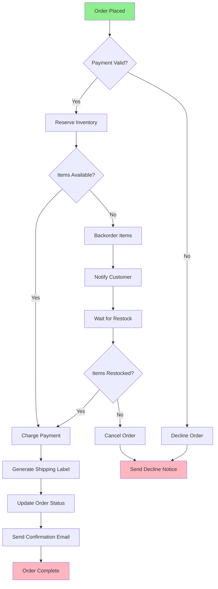
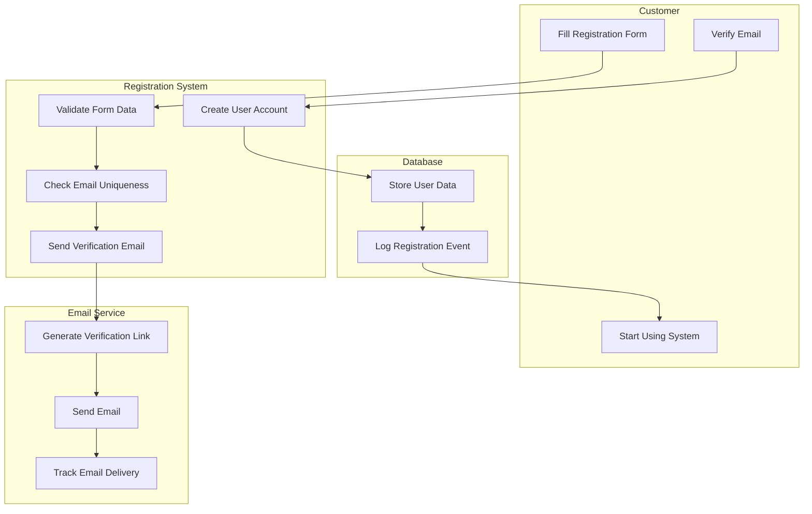

# ⚙️ Activity Diagrams - Workflow & Process Guide

## 🎯 **Overview**

Activity diagrams show workflow and business process flows, making them essential for documenting algorithms, business processes, and user journeys. They're particularly valuable for understanding complex decision-making processes and parallel activities.

## 🧩 **Key Components**

### **Essential Elements**

- **Start/End Nodes**: Black circles (●) and circles with rings (⊙)
- **Activities**: Rounded rectangles representing actions
- **Decision Points**: Diamonds (◆) for if/else logic
- **Forks/Joins**: Black bars (▬) for parallel processing
- **Swimlanes**: Vertical/horizontal partitions for responsibilities

## 💡 **Real-World Examples**

### **Example 1: E-commerce Order Processing**

### **Example 2: User Registration with Swimlanes**

## 🛠️ **Best Practices**

### **1. Keep It Focused**

- One main process per diagram
- Maximum 15-20 activities
- Use sub-processes for complex flows

### **2. Clear Decision Points**

- Use yes/no questions
- Show all possible paths
- Include error conditions

### **3. Swimlane Organization**

- Group by responsibility/role
- Keep related activities together
- Show clear handoffs between lanes

## 🏋️ **Practice Exercises**

1. **Model your team's code review process**
2. **Document a CI/CD pipeline**
3. **Map customer onboarding flow**
4. **Design algorithm flowchart**

## 🚀 **Next Steps**

Master activity diagrams, then advance to [State Diagrams](./03-state-diagrams.md) for object lifecycle modeling.
