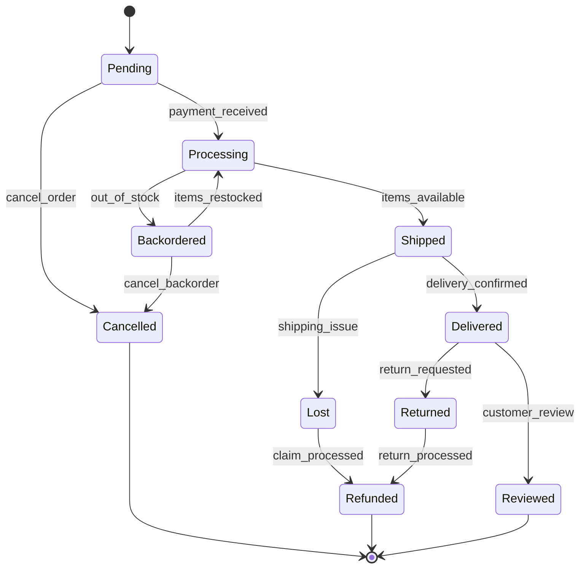
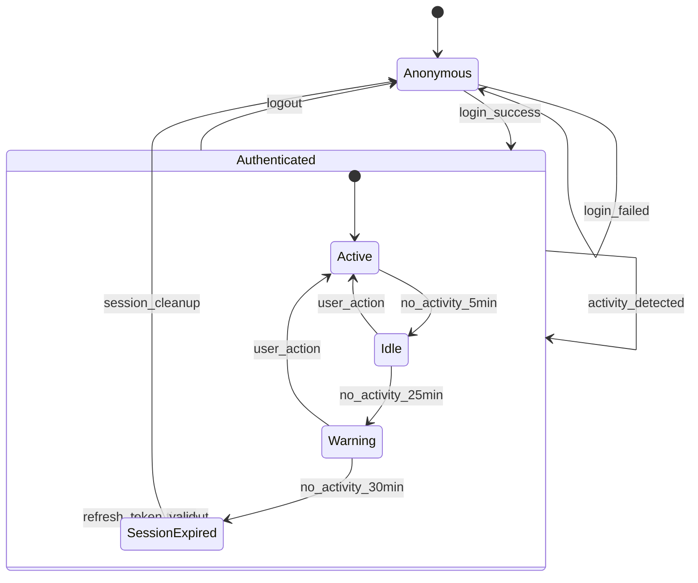

# 🔄 State Diagrams - Object Lifecycle Guide

## 🎯 **Overview**

State diagrams show object states and transitions between states over time. Essential for modeling object lifecycle, system state management, and UI component behavior.

## 🧩 **Key Components**

- **States**: Rounded rectangles showing object conditions
- **Transitions**: Arrows with triggers/conditions
- **Initial State**: Black circle (●)
- **Final State**: Black circle with ring (⊙)
- **Guard Conditions**: Conditions in square brackets [condition]
- **Actions**: Activities triggered by transitions

## 💡 **Real-World Examples**

### **Example 1: Order State Machine**

### **Example 2: User Session State**

## 🛠️ **Best Practices**

1. **Clear State Names**: Use descriptive, unambiguous state names
2. **Complete Transitions**: Show all possible state changes
3. **Guard Conditions**: Use brackets for conditional transitions
4. **Nested States**: Use composite states for complex behavior
5. **Actions**: Document entry/exit actions when relevant

## 🏋️ **Practice Exercises**

1. **Model a file upload process** (uploading, processing, completed, failed)
2. **Design user authentication states** (anonymous, authenticated, locked)
3. **Document CI/CD pipeline states** (pending, building, testing, deployed)

## 🚀 **Next Steps**

Complete state modeling skills, then learn [Use Case Diagrams](./04-use-case-diagrams.md) for requirements gathering.
