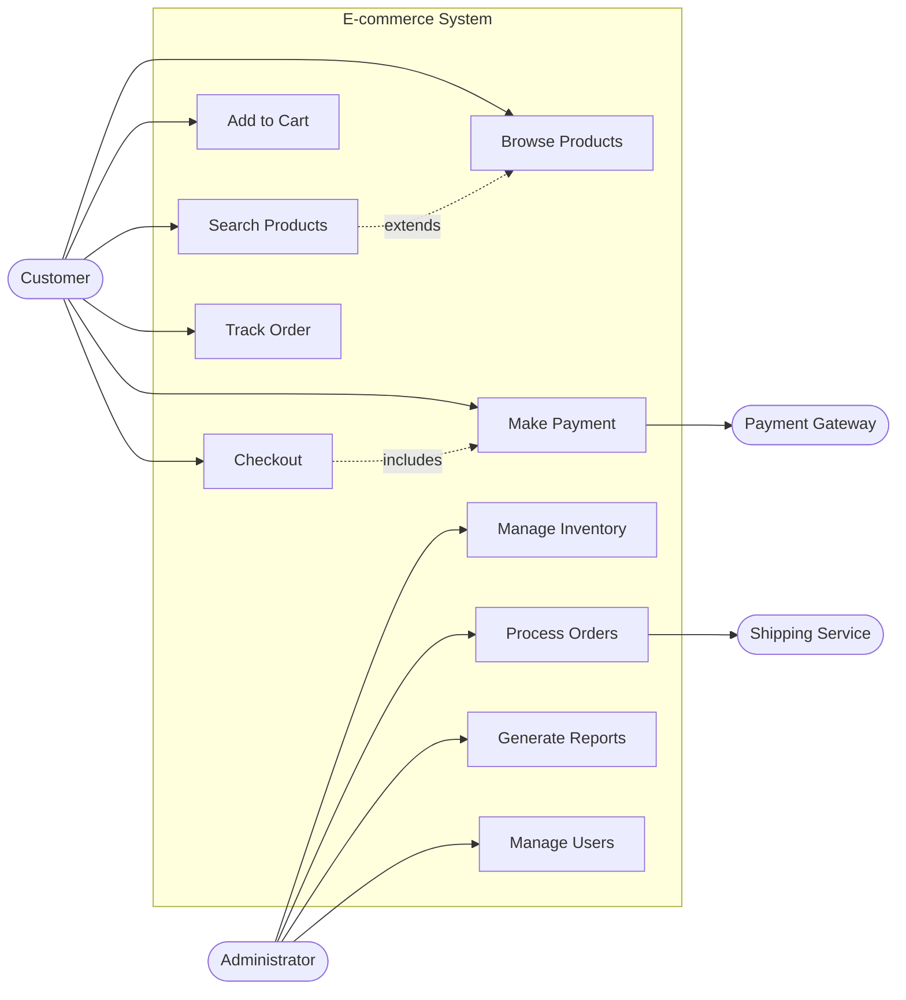

# 👥 Use Case Diagrams - Requirements & System Scope

## 🎯 **Overview**

Use case diagrams show system functionality from the user's perspective. Essential for requirements gathering, defining system scope, and communicating features to stakeholders.

## 🧩 **Key Components**

- **Actors**: External entities (users/systems) - stick figures or rectangles
- **Use Cases**: System functionality - ovals
- **System Boundary**: Rectangle containing use cases
- **Relationships**: Include, extend, generalization arrows

## 💡 **Real-World Example: E-commerce System**

## 🛠️ **Best Practices**

1. **Focus on Goals**: Use cases represent user goals, not system functions
2. **External Perspective**: Write from actor's viewpoint
3. **Include vs Extend**: Include = always happens, Extend = sometimes happens
4. **Clear Boundaries**: Define what's inside/outside the system
5. **Actor Types**: Distinguish primary vs secondary actors

## 🏋️ **Practice Exercises**

1. **ATM System**: Model cash withdrawal, balance inquiry, deposit
2. **Library Management**: Book borrowing, returning, searching
3. **Online Banking**: Account management, transfers, bill payment

## 🚀 **Next Steps**

Master requirements gathering, then learn [Communication Diagrams](./05-communication-diagrams.md) for relationship-focused interactions.
