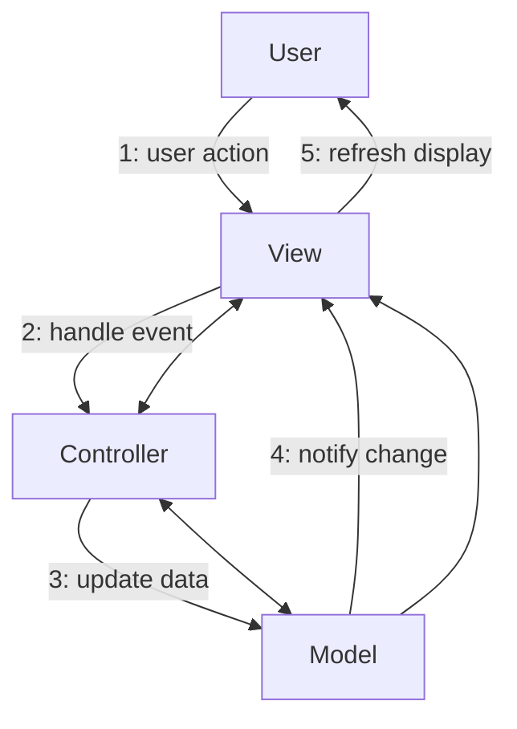

# 🔗 Communication Diagrams - Relationship-Focused Interactions

## 🎯 **Overview**

Communication diagrams show object interactions emphasizing relationships rather than time sequence. They're an alternative to sequence diagrams when you want to highlight object connections and collaboration patterns.

## 🧩 **Key Components**

- **Objects**: Rectangles representing system components
- **Links**: Lines showing relationships between objects
- **Messages**: Numbered arrows showing method calls
- **Sequence Numbers**: Show chronological order (1, 2, 3...)

## 💡 **Real-World Example: MVC Pattern**

## 💼 **When to Use**

### **Choose Communication Diagrams When:**

- Emphasizing object relationships is more important than timing
- Showing system structure and collaboration patterns
- Creating high-level architecture overviews
- Documenting design patterns implementations

### **Choose Sequence Diagrams When:**

- Timing and message ordering is critical
- Documenting detailed API flows
- Showing complex conditional logic
- Creating detailed system interactions

## 🛠️ **Best Practices**

1. **Clear Numbering**: Use consistent sequence numbering (1, 2, 3...)
2. **Relationship Focus**: Highlight important object relationships
3. **Simplified Flow**: Keep message flows easy to follow
4. **Pattern Documentation**: Excellent for design pattern visualization

## 🏋️ **Practice Exercises**

1. **Document Observer Pattern**: Show subject-observer relationships
2. **Model Three-Tier Architecture**: Show layer interactions
3. **Design Payment Processing**: Show service collaborations

## 🚀 **Completion**

You've mastered all UML Behavioral Diagrams! Now advance to [UML Structural Diagrams](../uml-structural/) for static system modeling.
