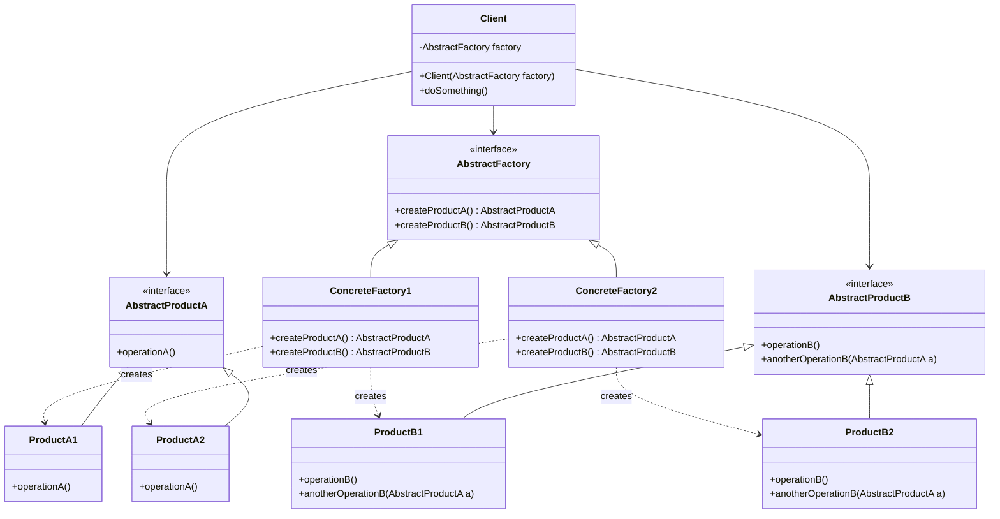

# Abstract Factory Pattern - Creating Related Object Families

In software development, we often need to create families of related objects that work together, while ensuring these objects are compatible and consistent.

**Example:** UI components for different platforms (Windows, Mac, Linux), database drivers (MySQL, PostgreSQL, Oracle), theme components (Dark, Light, High Contrast), etc.

Creating individual objects directly violates the Dependency Inversion Principle and makes it difficult to maintain consistency across object families.

This is where the **Abstract Factory Design Pattern** comes into play.

It's a fundamental creational pattern that provides an interface for creating families of related objects and is essential for cross-platform applications.

## What is Abstract Factory Pattern?

Abstract Factory Pattern is a creational design pattern that provides an interface for creating families of related or dependent objects without specifying their concrete classes.

It encapsulates object creation logic and ensures that created objects are compatible with each other, following the same theme or platform requirements.

The pattern promotes loose coupling by eliminating the need for client code to know about specific concrete classes.

## Class Diagram



## Implementation

### 1. Cross-Platform UI Framework

```java
// Abstract Products - UI Components
interface Button {
    void paint();
    void onClick();
    String getStyle();
}

interface Checkbox {
    void paint();
    void onCheck();
    String getStyle();
}

interface TextField {
    void paint();
    void onTextChange(String text);
    String getStyle();
    void setText(String text);
    String getText();
}

interface ScrollBar {
    void paint();
    void onScroll(int position);
    String getStyle();
    void setPosition(int position);
    int getPosition();
}

// Windows Products
class WindowsButton implements Button {
    private boolean isPressed = false;

    @Override
    public void paint() {
        System.out.println("Rendering Windows-style button with 3D border");
    }

    @Override
    public void onClick() {
        isPressed = !isPressed;
        System.out.println("Windows button clicked - State: " + (isPressed ? "pressed" : "released"));
    }

    @Override
    public String getStyle() {
        return "Windows";
    }
}

class WindowsCheckbox implements Checkbox {
    private boolean isChecked = false;

    @Override
    public void paint() {
        System.out.println("Rendering Windows-style checkbox with square design");
    }

    @Override
    public void onCheck() {
        isChecked = !isChecked;
        System.out.println("Windows checkbox " + (isChecked ? "checked" : "unchecked"));
    }

    @Override
    public String getStyle() {
        return "Windows";
    }
}

class WindowsTextField implements TextField {
    private String text = "";

    @Override
    public void paint() {
        System.out.println("Rendering Windows-style text field with sunken border");
    }

    @Override
    public void onTextChange(String text) {
        this.text = text;
        System.out.println("Windows text field changed to: " + text);
    }

    @Override
    public String getStyle() {
        return "Windows";
    }

    @Override
    public void setText(String text) {
        this.text = text;
    }

    @Override
    public String getText() {
        return text;
    }
}

class WindowsScrollBar implements ScrollBar {
    private int position = 0;

    @Override
    public void paint() {
        System.out.println("Rendering Windows-style scroll bar with arrow buttons");
    }

    @Override
    public void onScroll(int position) {
        this.position = position;
        System.out.println("Windows scroll bar moved to position: " + position);
    }

    @Override
    public String getStyle() {
        return "Windows";
    }

    @Override
    public void setPosition(int position) {
        this.position = position;
    }

    @Override
    public int getPosition() {
        return position;
    }
}

// macOS Products
class MacButton implements Button {
    private boolean isPressed = false;

    @Override
    public void paint() {
        System.out.println("Rendering macOS-style button with rounded corners");
    }

    @Override
    public void onClick() {
        isPressed = !isPressed;
        System.out.println("macOS button clicked - State: " + (isPressed ? "pressed" : "released"));
    }

    @Override
    public String getStyle() {
        return "macOS";
    }
}

class MacCheckbox implements Checkbox {
    private boolean isChecked = false;

    @Override
    public void paint() {
        System.out.println("Rendering macOS-style checkbox with rounded design");
    }

    @Override
    public void onCheck() {
        isChecked = !isChecked;
        System.out.println("macOS checkbox " + (isChecked ? "checked" : "unchecked"));
    }

    @Override
    public String getStyle() {
        return "macOS";
    }
}

class MacTextField implements TextField {
    private String text = "";

    @Override
    public void paint() {
        System.out.println("Rendering macOS-style text field with subtle border");
    }

    @Override
    public void onTextChange(String text) {
        this.text = text;
        System.out.println("macOS text field changed to: " + text);
    }

    @Override
    public String getStyle() {
        return "macOS";
    }

    @Override
    public void setText(String text) {
        this.text = text;
    }

    @Override
    public String getText() {
        return text;
    }
}

class MacScrollBar implements ScrollBar {
    private int position = 0;

    @Override
    public void paint() {
        System.out.println("Rendering macOS-style scroll bar with thin overlay design");
    }

    @Override
    public void onScroll(int position) {
        this.position = position;
        System.out.println("macOS scroll bar moved to position: " + position);
    }

    @Override
    public String getStyle() {
        return "macOS";
    }

    @Override
    public void setPosition(int position) {
        this.position = position;
    }

    @Override
    public int getPosition() {
        return position;
    }
}

// Linux Products
class LinuxButton implements Button {
    private boolean isPressed = false;

    @Override
    public void paint() {
        System.out.println("Rendering Linux-style button with flat design");
    }

    @Override
    public void onClick() {
        isPressed = !isPressed;
        System.out.println("Linux button clicked - State: " + (isPressed ? "pressed" : "released"));
    }

    @Override
    public String getStyle() {
        return "Linux";
    }
}

class LinuxCheckbox implements Checkbox {
    private boolean isChecked = false;

    @Override
    public void paint() {
        System.out.println("Rendering Linux-style checkbox with clean design");
    }

    @Override
    public void onCheck() {
        isChecked = !isChecked;
        System.out.println("Linux checkbox " + (isChecked ? "checked" : "unchecked"));
    }

    @Override
    public String getStyle() {
        return "Linux";
    }
}

class LinuxTextField implements TextField {
    private String text = "";

    @Override
    public void paint() {
        System.out.println("Rendering Linux-style text field with simple border");
    }

    @Override
    public void onTextChange(String text) {
        this.text = text;
        System.out.println("Linux text field changed to: " + text);
    }

    @Override
    public String getStyle() {
        return "Linux";
    }

    @Override
    public void setText(String text) {
        this.text = text;
    }

    @Override
    public String getText() {
        return text;
    }
}

class LinuxScrollBar implements ScrollBar {
    private int position = 0;

    @Override
    public void paint() {
        System.out.println("Rendering Linux-style scroll bar with customizable theme");
    }

    @Override
    public void onScroll(int position) {
        this.position = position;
        System.out.println("Linux scroll bar moved to position: " + position);
    }

    @Override
    public String getStyle() {
        return "Linux";
    }

    @Override
    public void setPosition(int position) {
        this.position = position;
    }

    @Override
    public int getPosition() {
        return position;
    }
}

// Abstract Factory
interface UIFactory {
    Button createButton();
    Checkbox createCheckbox();
    TextField createTextField();
    ScrollBar createScrollBar();
    String getTheme();
}

// Concrete Factories
class WindowsFactory implements UIFactory {
    @Override
    public Button createButton() {
        return new WindowsButton();
    }

    @Override
    public Checkbox createCheckbox() {
        return new WindowsCheckbox();
    }

    @Override
    public TextField createTextField() {
        return new WindowsTextField();
    }

    @Override
    public ScrollBar createScrollBar() {
        return new WindowsScrollBar();
    }

    @Override
    public String getTheme() {
        return "Windows Theme";
    }
}

class MacFactory implements UIFactory {
    @Override
    public Button createButton() {
        return new MacButton();
    }

    @Override
    public Checkbox createCheckbox() {
        return new MacCheckbox();
    }

    @Override
    public TextField createTextField() {
        return new MacTextField();
    }

    @Override
    public ScrollBar createScrollBar() {
        return new MacScrollBar();
    }

    @Override
    public String getTheme() {
        return "macOS Theme";
    }
}

class LinuxFactory implements UIFactory {
    @Override
    public Button createButton() {
        return new LinuxButton();
    }

    @Override
    public Checkbox createCheckbox() {
        return new LinuxCheckbox();
    }

    @Override
    public TextField createTextField() {
        return new LinuxTextField();
    }

    @Override
    public ScrollBar createScrollBar() {
        return new LinuxScrollBar();
    }

    @Override
    public String getTheme() {
        return "Linux Theme";
    }
}

// Client code
class Application {
    private UIFactory factory;
    private Button button;
    private Checkbox checkbox;
    private TextField textField;
    private ScrollBar scrollBar;

    public Application(UIFactory factory) {
        this.factory = factory;
        createUI();
    }

    private void createUI() {
        button = factory.createButton();
        checkbox = factory.createCheckbox();
        textField = factory.createTextField();
        scrollBar = factory.createScrollBar();

        System.out.println("Created UI with " + factory.getTheme());
    }

    public void renderUI() {
        System.out.println("\n=== Rendering UI ===");
        button.paint();
        checkbox.paint();
        textField.paint();
        scrollBar.paint();
    }

    public void simulateUserInteraction() {
        System.out.println("\n=== User Interactions ===");
        button.onClick();
        checkbox.onCheck();
        textField.onTextChange("Hello World");
        scrollBar.onScroll(50);
    }

    public void displayUIInfo() {
        System.out.println("\n=== UI Component Info ===");
        System.out.println("Button style: " + button.getStyle());
        System.out.println("Checkbox style: " + checkbox.getStyle());
        System.out.println("TextField style: " + textField.getStyle());
        System.out.println("ScrollBar style: " + scrollBar.getStyle());
    }
}

// Factory Provider - Abstract Factory of Factories
class UIFactoryProvider {
    public static UIFactory getFactory(String osType) {
        switch (osType.toLowerCase()) {
            case "windows":
                return new WindowsFactory();
            case "macos":
            case "mac":
                return new MacFactory();
            case "linux":
                return new LinuxFactory();
            default:
                throw new IllegalArgumentException("Unsupported OS type: " + osType);
        }
    }

    public static UIFactory getFactory() {
        String osName = System.getProperty("os.name").toLowerCase();
        if (osName.contains("win")) {
            return new WindowsFactory();
        } else if (osName.contains("mac")) {
            return new MacFactory();
        } else if (osName.contains("nix") || osName.contains("nux")) {
            return new LinuxFactory();
        } else {
            return new LinuxFactory(); // Default
        }
    }
}

// Usage Example
class CrossPlatformUIExample {
    public static void main(String[] args) {
        System.out.println("=== Cross-Platform UI Application ===");

        // Test Windows UI
        System.out.println("\n" + "=".repeat(40));
        System.out.println("Testing Windows UI");
        System.out.println("=".repeat(40));
        UIFactory windowsFactory = UIFactoryProvider.getFactory("windows");
        Application windowsApp = new Application(windowsFactory);
        windowsApp.renderUI();
        windowsApp.simulateUserInteraction();
        windowsApp.displayUIInfo();

        // Test macOS UI
        System.out.println("\n" + "=".repeat(40));
        System.out.println("Testing macOS UI");
        System.out.println("=".repeat(40));
        UIFactory macFactory = UIFactoryProvider.getFactory("macos");
        Application macApp = new Application(macFactory);
        macApp.renderUI();
        macApp.simulateUserInteraction();
        macApp.displayUIInfo();

        // Test Linux UI
        System.out.println("\n" + "=".repeat(40));
        System.out.println("Testing Linux UI");
        System.out.println("=".repeat(40));
        UIFactory linuxFactory = UIFactoryProvider.getFactory("linux");
        Application linuxApp = new Application(linuxFactory);
        linuxApp.renderUI();
        linuxApp.simulateUserInteraction();
        linuxApp.displayUIInfo();

        // Test auto-detection
        System.out.println("\n" + "=".repeat(40));
        System.out.println("Testing Auto-Detection");
        System.out.println("=".repeat(40));
        UIFactory autoFactory = UIFactoryProvider.getFactory();
        Application autoApp = new Application(autoFactory);
        autoApp.renderUI();
    }
}
```

### 2. Database Connection Factory

```java
import java.util.*;
import java.sql.*;

// Abstract Products - Database Components
interface DatabaseConnection {
    void connect();
    void disconnect();
    String executeQuery(String query);
    boolean executeUpdate(String query);
    String getConnectionString();
    String getDatabaseType();
}

interface DatabaseCommand {
    void setConnection(DatabaseConnection connection);
    String execute(String sql);
    String getDialect();
}

interface DatabaseTransaction {
    void begin();
    void commit();
    void rollback();
    String getIsolationLevel();
}

interface DatabaseMetadata {
    String getDatabaseVersion();
    List<String> getTableNames();
    List<String> getColumnNames(String tableName);
    String getDatabaseName();
}

// MySQL Products
class MySQLConnection implements DatabaseConnection {
    private String host;
    private int port;
    private String database;
    private boolean connected = false;

    public MySQLConnection(String host, int port, String database) {
        this.host = host;
        this.port = port;
        this.database = database;
    }

    @Override
    public void connect() {
        connected = true;
        System.out.println("Connected to MySQL database: " + database + " at " + host + ":" + port);
    }

    @Override
    public void disconnect() {
        connected = false;
        System.out.println("Disconnected from MySQL database");
    }

    @Override
    public String executeQuery(String query) {
        if (!connected) {
            throw new IllegalStateException("Not connected to database");
        }
        System.out.println("Executing MySQL query: " + query);
        return "MySQL result set for: " + query;
    }

    @Override
    public boolean executeUpdate(String query) {
        if (!connected) {
            throw new IllegalStateException("Not connected to database");
        }
        System.out.println("Executing MySQL update: " + query);
        return true;
    }

    @Override
    public String getConnectionString() {
        return "jdbc:mysql://" + host + ":" + port + "/" + database;
    }

    @Override
    public String getDatabaseType() {
        return "MySQL";
    }
}

class MySQLCommand implements DatabaseCommand {
    private DatabaseConnection connection;

    @Override
    public void setConnection(DatabaseConnection connection) {
        this.connection = connection;
    }

    @Override
    public String execute(String sql) {
        if (connection == null) {
            throw new IllegalStateException("No connection set");
        }
        // Convert to MySQL-specific SQL
        String mysqlSql = convertToMySQLSyntax(sql);
        return connection.executeQuery(mysqlSql);
    }

    private String convertToMySQLSyntax(String sql) {
        // Convert generic SQL to MySQL-specific syntax
        return sql.replace("LIMIT ?", "LIMIT ?")
                 .replace("AUTOINCREMENT", "AUTO_INCREMENT")
                 .replace("DATETIME", "TIMESTAMP");
    }

    @Override
    public String getDialect() {
        return "MySQL";
    }
}

class MySQLTransaction implements DatabaseTransaction {
    private boolean inTransaction = false;

    @Override
    public void begin() {
        inTransaction = true;
        System.out.println("MySQL transaction started");
    }

    @Override
    public void commit() {
        if (inTransaction) {
            inTransaction = false;
            System.out.println("MySQL transaction committed");
        }
    }

    @Override
    public void rollback() {
        if (inTransaction) {
            inTransaction = false;
            System.out.println("MySQL transaction rolled back");
        }
    }

    @Override
    public String getIsolationLevel() {
        return "READ_COMMITTED";
    }
}

class MySQLMetadata implements DatabaseMetadata {
    @Override
    public String getDatabaseVersion() {
        return "MySQL 8.0.25";
    }

    @Override
    public List<String> getTableNames() {
        return Arrays.asList("users", "orders", "products", "categories");
    }

    @Override
    public List<String> getColumnNames(String tableName) {
        switch (tableName.toLowerCase()) {
            case "users":
                return Arrays.asList("id", "username", "email", "created_at");
            case "orders":
                return Arrays.asList("id", "user_id", "total", "order_date");
            default:
                return Arrays.asList("id", "name");
        }
    }

    @Override
    public String getDatabaseName() {
        return "MySQL Database";
    }
}

// PostgreSQL Products
class PostgreSQLConnection implements DatabaseConnection {
    private String host;
    private int port;
    private String database;
    private boolean connected = false;

    public PostgreSQLConnection(String host, int port, String database) {
        this.host = host;
        this.port = port;
        this.database = database;
    }

    @Override
    public void connect() {
        connected = true;
        System.out.println("Connected to PostgreSQL database: " + database + " at " + host + ":" + port);
    }

    @Override
    public void disconnect() {
        connected = false;
        System.out.println("Disconnected from PostgreSQL database");
    }

    @Override
    public String executeQuery(String query) {
        if (!connected) {
            throw new IllegalStateException("Not connected to database");
        }
        System.out.println("Executing PostgreSQL query: " + query);
        return "PostgreSQL result set for: " + query;
    }

    @Override
    public boolean executeUpdate(String query) {
        if (!connected) {
            throw new IllegalStateException("Not connected to database");
        }
        System.out.println("Executing PostgreSQL update: " + query);
        return true;
    }

    @Override
    public String getConnectionString() {
        return "jdbc:postgresql://" + host + ":" + port + "/" + database;
    }

    @Override
    public String getDatabaseType() {
        return "PostgreSQL";
    }
}

class PostgreSQLCommand implements DatabaseCommand {
    private DatabaseConnection connection;

    @Override
    public void setConnection(DatabaseConnection connection) {
        this.connection = connection;
    }

    @Override
    public String execute(String sql) {
        if (connection == null) {
            throw new IllegalStateException("No connection set");
        }
        // Convert to PostgreSQL-specific SQL
        String postgreSql = convertToPostgreSQLSyntax(sql);
        return connection.executeQuery(postgreSql);
    }

    private String convertToPostgreSQLSyntax(String sql) {
        // Convert generic SQL to PostgreSQL-specific syntax
        return sql.replace("AUTOINCREMENT", "SERIAL")
                 .replace("DATETIME", "TIMESTAMP")
                 .replace("LIMIT ?", "LIMIT ?");
    }

    @Override
    public String getDialect() {
        return "PostgreSQL";
    }
}

class PostgreSQLTransaction implements DatabaseTransaction {
    private boolean inTransaction = false;

    @Override
    public void begin() {
        inTransaction = true;
        System.out.println("PostgreSQL transaction started");
    }

    @Override
    public void commit() {
        if (inTransaction) {
            inTransaction = false;
            System.out.println("PostgreSQL transaction committed");
        }
    }

    @Override
    public void rollback() {
        if (inTransaction) {
            inTransaction = false;
            System.out.println("PostgreSQL transaction rolled back");
        }
    }

    @Override
    public String getIsolationLevel() {
        return "SERIALIZABLE";
    }
}

class PostgreSQLMetadata implements DatabaseMetadata {
    @Override
    public String getDatabaseVersion() {
        return "PostgreSQL 13.4";
    }

    @Override
    public List<String> getTableNames() {
        return Arrays.asList("users", "orders", "products", "categories", "audit_log");
    }

    @Override
    public List<String> getColumnNames(String tableName) {
        switch (tableName.toLowerCase()) {
            case "users":
                return Arrays.asList("id", "username", "email", "created_at", "updated_at");
            case "orders":
                return Arrays.asList("id", "user_id", "total", "order_date", "status");
            default:
                return Arrays.asList("id", "name", "created_at");
        }
    }

    @Override
    public String getDatabaseName() {
        return "PostgreSQL Database";
    }
}

// Abstract Factory
interface DatabaseFactory {
    DatabaseConnection createConnection(String host, int port, String database);
    DatabaseCommand createCommand();
    DatabaseTransaction createTransaction();
    DatabaseMetadata createMetadata();
    String getDriverName();
}

// Concrete Factories
class MySQLFactory implements DatabaseFactory {
    @Override
    public DatabaseConnection createConnection(String host, int port, String database) {
        return new MySQLConnection(host, port, database);
    }

    @Override
    public DatabaseCommand createCommand() {
        return new MySQLCommand();
    }

    @Override
    public DatabaseTransaction createTransaction() {
        return new MySQLTransaction();
    }

    @Override
    public DatabaseMetadata createMetadata() {
        return new MySQLMetadata();
    }

    @Override
    public String getDriverName() {
        return "com.mysql.cj.jdbc.Driver";
    }
}

class PostgreSQLFactory implements DatabaseFactory {
    @Override
    public DatabaseConnection createConnection(String host, int port, String database) {
        return new PostgreSQLConnection(host, port, database);
    }

    @Override
    public DatabaseCommand createCommand() {
        return new PostgreSQLCommand();
    }

    @Override
    public DatabaseTransaction createTransaction() {
        return new PostgreSQLTransaction();
    }

    @Override
    public DatabaseMetadata createMetadata() {
        return new PostgreSQLMetadata();
    }

    @Override
    public String getDriverName() {
        return "org.postgresql.Driver";
    }
}

// Database Abstraction Layer
class DatabaseManager {
    private DatabaseFactory factory;
    private DatabaseConnection connection;
    private DatabaseCommand command;
    private DatabaseTransaction transaction;
    private DatabaseMetadata metadata;

    public DatabaseManager(DatabaseFactory factory) {
        this.factory = factory;
        this.command = factory.createCommand();
        this.transaction = factory.createTransaction();
        this.metadata = factory.createMetadata();
    }

    public void connect(String host, int port, String database) {
        this.connection = factory.createConnection(host, port, database);
        this.command.setConnection(connection);
        connection.connect();

        System.out.println("Using driver: " + factory.getDriverName());
        System.out.println("Connection string: " + connection.getConnectionString());
    }

    public void disconnect() {
        if (connection != null) {
            connection.disconnect();
        }
    }

    public String executeQuery(String sql) {
        return command.execute(sql);
    }

    public void executeInTransaction(List<String> queries) {
        transaction.begin();
        try {
            for (String query : queries) {
                connection.executeUpdate(query);
            }
            transaction.commit();
            System.out.println("All queries executed successfully");
        } catch (Exception e) {
            transaction.rollback();
            System.out.println("Transaction failed, rolled back: " + e.getMessage());
        }
    }

    public void displayDatabaseInfo() {
        System.out.println("\n=== Database Information ===");
        System.out.println("Database: " + metadata.getDatabaseName());
        System.out.println("Version: " + metadata.getDatabaseVersion());
        System.out.println("Dialect: " + command.getDialect());
        System.out.println("Isolation Level: " + transaction.getIsolationLevel());
        System.out.println("Tables: " + metadata.getTableNames());
    }
}

// Factory Provider
class DatabaseFactoryProvider {
    public static DatabaseFactory getFactory(String databaseType) {
        switch (databaseType.toLowerCase()) {
            case "mysql":
                return new MySQLFactory();
            case "postgresql":
            case "postgres":
                return new PostgreSQLFactory();
            default:
                throw new IllegalArgumentException("Unsupported database type: " + databaseType);
        }
    }
}

// Usage Example
class DatabaseExample {
    public static void main(String[] args) {
        System.out.println("=== Database Abstract Factory Example ===");

        // Test MySQL
        System.out.println("\n" + "=".repeat(40));
        System.out.println("Testing MySQL Database");
        System.out.println("=".repeat(40));

        DatabaseFactory mysqlFactory = DatabaseFactoryProvider.getFactory("mysql");
        DatabaseManager mysqlManager = new DatabaseManager(mysqlFactory);
        mysqlManager.connect("localhost", 3306, "testdb");
        mysqlManager.displayDatabaseInfo();

        String result1 = mysqlManager.executeQuery("SELECT * FROM users WHERE age > 25");
        System.out.println("Query result: " + result1);

        mysqlManager.executeInTransaction(Arrays.asList(
            "INSERT INTO users (name, email) VALUES ('John', 'john@email.com')",
            "UPDATE users SET status = 'active' WHERE id = 1"
        ));

        mysqlManager.disconnect();

        // Test PostgreSQL
        System.out.println("\n" + "=".repeat(40));
        System.out.println("Testing PostgreSQL Database");
        System.out.println("=".repeat(40));

        DatabaseFactory postgresFactory = DatabaseFactoryProvider.getFactory("postgresql");
        DatabaseManager postgresManager = new DatabaseManager(postgresFactory);
        postgresManager.connect("localhost", 5432, "testdb");
        postgresManager.displayDatabaseInfo();

        String result2 = postgresManager.executeQuery("SELECT * FROM orders WHERE total > 100");
        System.out.println("Query result: " + result2);

        postgresManager.executeInTransaction(Arrays.asList(
            "INSERT INTO orders (user_id, total) VALUES (1, 150.00)",
            "UPDATE inventory SET quantity = quantity - 1 WHERE product_id = 1"
        ));

        postgresManager.disconnect();
    }
}
```

### 3. Theme System Factory

```java
// Abstract Products - Theme Components
interface ThemeColor {
    String getPrimary();
    String getSecondary();
    String getBackground();
    String getTextColor();
    String getAccentColor();
}

interface ThemeFont {
    String getFontFamily();
    int getBaseFontSize();
    String getHeaderFont();
    String getBodyFont();
    String getCodeFont();
}

interface ThemeIcon {
    String getIconSet();
    int getDefaultSize();
    String getFormat();
    String getIconPath(String iconName);
}

interface ThemeLayout {
    int getMargin();
    int getPadding();
    int getBorderRadius();
    String getContainerStyle();
    String getGridSystem();
}

// Dark Theme Products
class DarkThemeColor implements ThemeColor {
    @Override
    public String getPrimary() { return "#BB86FC"; }

    @Override
    public String getSecondary() { return "#03DAC6"; }

    @Override
    public String getBackground() { return "#121212"; }

    @Override
    public String getTextColor() { return "#FFFFFF"; }

    @Override
    public String getAccentColor() { return "#CF6679"; }
}

class DarkThemeFont implements ThemeFont {
    @Override
    public String getFontFamily() { return "Roboto, sans-serif"; }

    @Override
    public int getBaseFontSize() { return 14; }

    @Override
    public String getHeaderFont() { return "Roboto, bold"; }

    @Override
    public String getBodyFont() { return "Roboto, regular"; }

    @Override
    public String getCodeFont() { return "JetBrains Mono, monospace"; }
}

class DarkThemeIcon implements ThemeIcon {
    @Override
    public String getIconSet() { return "Material Icons Dark"; }

    @Override
    public int getDefaultSize() { return 24; }

    @Override
    public String getFormat() { return "SVG"; }

    @Override
    public String getIconPath(String iconName) {
        return "/icons/dark/" + iconName + ".svg";
    }
}

class DarkThemeLayout implements ThemeLayout {
    @Override
    public int getMargin() { return 16; }

    @Override
    public int getPadding() { return 12; }

    @Override
    public int getBorderRadius() { return 8; }

    @Override
    public String getContainerStyle() { return "dark-container"; }

    @Override
    public String getGridSystem() { return "dark-grid"; }
}

// Light Theme Products
class LightThemeColor implements ThemeColor {
    @Override
    public String getPrimary() { return "#6200EE"; }

    @Override
    public String getSecondary() { return "#018786"; }

    @Override
    public String getBackground() { return "#FFFFFF"; }

    @Override
    public String getTextColor() { return "#000000"; }

    @Override
    public String getAccentColor() { return "#B00020"; }
}

class LightThemeFont implements ThemeFont {
    @Override
    public String getFontFamily() { return "Open Sans, sans-serif"; }

    @Override
    public int getBaseFontSize() { return 16; }

    @Override
    public String getHeaderFont() { return "Open Sans, bold"; }

    @Override
    public String getBodyFont() { return "Open Sans, regular"; }

    @Override
    public String getCodeFont() { return "Source Code Pro, monospace"; }
}

class LightThemeIcon implements ThemeIcon {
    @Override
    public String getIconSet() { return "Material Icons Light"; }

    @Override
    public int getDefaultSize() { return 20; }

    @Override
    public String getFormat() { return "SVG"; }

    @Override
    public String getIconPath(String iconName) {
        return "/icons/light/" + iconName + ".svg";
    }
}

class LightThemeLayout implements ThemeLayout {
    @Override
    public int getMargin() { return 20; }

    @Override
    public int getPadding() { return 16; }

    @Override
    public int getBorderRadius() { return 4; }

    @Override
    public String getContainerStyle() { return "light-container"; }

    @Override
    public String getGridSystem() { return "light-grid"; }
}

// High Contrast Theme Products
class HighContrastThemeColor implements ThemeColor {
    @Override
    public String getPrimary() { return "#FFFF00"; }

    @Override
    public String getSecondary() { return "#00FFFF"; }

    @Override
    public String getBackground() { return "#000000"; }

    @Override
    public String getTextColor() { return "#FFFFFF"; }

    @Override
    public String getAccentColor() { return "#FF0000"; }
}

class HighContrastThemeFont implements ThemeFont {
    @Override
    public String getFontFamily() { return "Arial, sans-serif"; }

    @Override
    public int getBaseFontSize() { return 18; }

    @Override
    public String getHeaderFont() { return "Arial, bold"; }

    @Override
    public String getBodyFont() { return "Arial, regular"; }

    @Override
    public String getCodeFont() { return "Courier New, monospace"; }
}

class HighContrastThemeIcon implements ThemeIcon {
    @Override
    public String getIconSet() { return "High Contrast Icons"; }

    @Override
    public int getDefaultSize() { return 28; }

    @Override
    public String getFormat() { return "PNG"; }

    @Override
    public String getIconPath(String iconName) {
        return "/icons/high-contrast/" + iconName + ".png";
    }
}

class HighContrastThemeLayout implements ThemeLayout {
    @Override
    public int getMargin() { return 24; }

    @Override
    public int getPadding() { return 20; }

    @Override
    public int getBorderRadius() { return 0; }

    @Override
    public String getContainerStyle() { return "high-contrast-container"; }

    @Override
    public String getGridSystem() { return "high-contrast-grid"; }
}

// Abstract Factory
interface ThemeFactory {
    ThemeColor createColor();
    ThemeFont createFont();
    ThemeIcon createIcon();
    ThemeLayout createLayout();
    String getThemeName();
}

// Concrete Factories
class DarkThemeFactory implements ThemeFactory {
    @Override
    public ThemeColor createColor() { return new DarkThemeColor(); }

    @Override
    public ThemeFont createFont() { return new DarkThemeFont(); }

    @Override
    public ThemeIcon createIcon() { return new DarkThemeIcon(); }

    @Override
    public ThemeLayout createLayout() { return new DarkThemeLayout(); }

    @Override
    public String getThemeName() { return "Dark Theme"; }
}

class LightThemeFactory implements ThemeFactory {
    @Override
    public ThemeColor createColor() { return new LightThemeColor(); }

    @Override
    public ThemeFont createFont() { return new LightThemeFont(); }

    @Override
    public ThemeIcon createIcon() { return new LightThemeIcon(); }

    @Override
    public ThemeLayout createLayout() { return new LightThemeLayout(); }

    @Override
    public String getThemeName() { return "Light Theme"; }
}

class HighContrastThemeFactory implements ThemeFactory {
    @Override
    public ThemeColor createColor() { return new HighContrastThemeColor(); }

    @Override
    public ThemeFont createFont() { return new HighContrastThemeFont(); }

    @Override
    public ThemeIcon createIcon() { return new HighContrastThemeIcon(); }

    @Override
    public ThemeLayout createLayout() { return new HighContrastThemeLayout(); }

    @Override
    public String getThemeName() { return "High Contrast Theme"; }
}

// Theme Manager
class ThemeManager {
    private ThemeFactory currentThemeFactory;
    private ThemeColor colors;
    private ThemeFont fonts;
    private ThemeIcon icons;
    private ThemeLayout layout;

    public void setTheme(ThemeFactory themeFactory) {
        this.currentThemeFactory = themeFactory;
        this.colors = themeFactory.createColor();
        this.fonts = themeFactory.createFont();
        this.icons = themeFactory.createIcon();
        this.layout = themeFactory.createLayout();

        System.out.println("Theme switched to: " + themeFactory.getThemeName());
    }

    public String generateCSS() {
        if (currentThemeFactory == null) {
            throw new IllegalStateException("No theme set");
        }

        StringBuilder css = new StringBuilder();
        css.append("/* ").append(currentThemeFactory.getThemeName()).append(" */\n");
        css.append(":root {\n");
        css.append("  --primary-color: ").append(colors.getPrimary()).append(";\n");
        css.append("  --secondary-color: ").append(colors.getSecondary()).append(";\n");
        css.append("  --background-color: ").append(colors.getBackground()).append(";\n");
        css.append("  --text-color: ").append(colors.getTextColor()).append(";\n");
        css.append("  --accent-color: ").append(colors.getAccentColor()).append(";\n");
        css.append("  --font-family: ").append(fonts.getFontFamily()).append(";\n");
        css.append("  --base-font-size: ").append(fonts.getBaseFontSize()).append("px;\n");
        css.append("  --margin: ").append(layout.getMargin()).append("px;\n");
        css.append("  --padding: ").append(layout.getPadding()).append("px;\n");
        css.append("  --border-radius: ").append(layout.getBorderRadius()).append("px;\n");
        css.append("}\n");

        return css.toString();
    }

    public void displayThemeInfo() {
        if (currentThemeFactory == null) {
            System.out.println("No theme currently set");
            return;
        }

        System.out.println("\n=== Theme Information ===");
        System.out.println("Theme: " + currentThemeFactory.getThemeName());
        System.out.println("Primary Color: " + colors.getPrimary());
        System.out.println("Background: " + colors.getBackground());
        System.out.println("Text Color: " + colors.getTextColor());
        System.out.println("Font Family: " + fonts.getFontFamily());
        System.out.println("Base Font Size: " + fonts.getBaseFontSize() + "px");
        System.out.println("Icon Set: " + icons.getIconSet());
        System.out.println("Icon Size: " + icons.getDefaultSize() + "px");
        System.out.println("Container Style: " + layout.getContainerStyle());
        System.out.println("Grid System: " + layout.getGridSystem());
    }

    public String getIconPath(String iconName) {
        return icons.getIconPath(iconName);
    }

    public ThemeColor getColors() { return colors; }
    public ThemeFont getFonts() { return fonts; }
    public ThemeIcon getIcons() { return icons; }
    public ThemeLayout getLayout() { return layout; }
}

// Theme Factory Provider
class ThemeFactoryProvider {
    public static ThemeFactory getFactory(String themeName) {
        switch (themeName.toLowerCase()) {
            case "dark":
                return new DarkThemeFactory();
            case "light":
                return new LightThemeFactory();
            case "high-contrast":
            case "highcontrast":
                return new HighContrastThemeFactory();
            default:
                throw new IllegalArgumentException("Unsupported theme: " + themeName);
        }
    }

    public static List<String> getAvailableThemes() {
        return Arrays.asList("dark", "light", "high-contrast");
    }
}

// Usage Example
class ThemeSystemExample {
    public static void main(String[] args) {
        System.out.println("=== Theme System Example ===");
        ThemeManager themeManager = new ThemeManager();

        // Test all themes
        for (String themeName : ThemeFactoryProvider.getAvailableThemes()) {
            System.out.println("\n" + "=".repeat(50));
            System.out.println("Testing " + themeName.toUpperCase() + " theme");
            System.out.println("=".repeat(50));

            ThemeFactory factory = ThemeFactoryProvider.getFactory(themeName);
            themeManager.setTheme(factory);
            themeManager.displayThemeInfo();

            System.out.println("\nGenerated CSS:");
            System.out.println(themeManager.generateCSS());

            System.out.println("Sample icon paths:");
            System.out.println("Home icon: " + themeManager.getIconPath("home"));
            System.out.println("User icon: " + themeManager.getIconPath("user"));
            System.out.println("Settings icon: " + themeManager.getIconPath("settings"));
        }
    }
}
```

## Test Code

```java
import org.junit.jupiter.api.Test;
import org.junit.jupiter.api.BeforeEach;
import static org.junit.jupiter.api.Assertions.*;
import java.util.Arrays;

class AbstractFactoryPatternTest {

    @Test
    void testUIFactoryCreatesConsistentComponents() {
        UIFactory windowsFactory = new WindowsFactory();

        Button button = windowsFactory.createButton();
        Checkbox checkbox = windowsFactory.createCheckbox();
        TextField textField = windowsFactory.createTextField();
        ScrollBar scrollBar = windowsFactory.createScrollBar();

        // All components should have the same style
        assertEquals("Windows", button.getStyle());
        assertEquals("Windows", checkbox.getStyle());
        assertEquals("Windows", textField.getStyle());
        assertEquals("Windows", scrollBar.getStyle());
        assertEquals("Windows Theme", windowsFactory.getTheme());
    }

    @Test
    void testUIFactoryProvider() {
        UIFactory windowsFactory = UIFactoryProvider.getFactory("windows");
        UIFactory macFactory = UIFactoryProvider.getFactory("macos");
        UIFactory linuxFactory = UIFactoryProvider.getFactory("linux");

        assertNotNull(windowsFactory);
        assertNotNull(macFactory);
        assertNotNull(linuxFactory);

        assertTrue(windowsFactory instanceof WindowsFactory);
        assertTrue(macFactory instanceof MacFactory);
        assertTrue(linuxFactory instanceof LinuxFactory);

        // Test invalid OS
        assertThrows(IllegalArgumentException.class, () ->
            UIFactoryProvider.getFactory("invalid"));
    }

    @Test
    void testApplicationWithDifferentFactories() {
        // Test Windows application
        UIFactory windowsFactory = new WindowsFactory();
        Application windowsApp = new Application(windowsFactory);
        assertDoesNotThrow(() -> {
            windowsApp.renderUI();
            windowsApp.simulateUserInteraction();
            windowsApp.displayUIInfo();
        });

        // Test Mac application
        UIFactory macFactory = new MacFactory();
        Application macApp = new Application(macFactory);
        assertDoesNotThrow(() -> {
            macApp.renderUI();
            macApp.simulateUserInteraction();
            macApp.displayUIInfo();
        });
    }

    @Test
    void testDatabaseFactoryCreatesConsistentComponents() {
        DatabaseFactory mysqlFactory = new MySQLFactory();

        DatabaseConnection connection = mysqlFactory.createConnection("localhost", 3306, "test");
        DatabaseCommand command = mysqlFactory.createCommand();
        DatabaseTransaction transaction = mysqlFactory.createTransaction();
        DatabaseMetadata metadata = mysqlFactory.createMetadata();

        assertEquals("MySQL", connection.getDatabaseType());
        assertEquals("MySQL", command.getDialect());
        assertEquals("MySQL Database", metadata.getDatabaseName());
        assertEquals("com.mysql.cj.jdbc.Driver", mysqlFactory.getDriverName());
    }

    @Test
    void testDatabaseManager() {
        DatabaseFactory mysqlFactory = new MySQLFactory();
        DatabaseManager manager = new DatabaseManager(mysqlFactory);

        assertDoesNotThrow(() -> {
            manager.connect("localhost", 3306, "testdb");
            String result = manager.executeQuery("SELECT * FROM users");
            assertNotNull(result);
            assertTrue(result.contains("MySQL result set"));
            manager.disconnect();
        });

        // Test transaction execution
        assertDoesNotThrow(() -> {
            manager.connect("localhost", 3306, "testdb");
            manager.executeInTransaction(Arrays.asList(
                "INSERT INTO users (name) VALUES ('Test')",
                "UPDATE users SET active = 1"
            ));
            manager.disconnect();
        });
    }

    @Test
    void testThemeFactoryCreatesConsistentComponents() {
        ThemeFactory darkFactory = new DarkThemeFactory();

        ThemeColor colors = darkFactory.createColor();
        ThemeFont fonts = darkFactory.createFont();
        ThemeIcon icons = darkFactory.createIcon();
        ThemeLayout layout = darkFactory.createLayout();

        assertEquals("#121212", colors.getBackground());
        assertEquals("#FFFFFF", colors.getTextColor());
        assertEquals("Material Icons Dark", icons.getIconSet());
        assertEquals("dark-container", layout.getContainerStyle());
        assertEquals("Dark Theme", darkFactory.getThemeName());
    }

    @Test
    void testThemeManager() {
        ThemeManager themeManager = new ThemeManager();
        ThemeFactory darkFactory = new DarkThemeFactory();

        themeManager.setTheme(darkFactory);

        // Test CSS generation
        String css = themeManager.generateCSS();
        assertNotNull(css);
        assertTrue(css.contains("Dark Theme"));
        assertTrue(css.contains("--primary-color: #BB86FC"));
        assertTrue(css.contains("--background-color: #121212"));

        // Test icon paths
        String iconPath = themeManager.getIconPath("home");
        assertEquals("/icons/dark/home.svg", iconPath);

        // Test theme info display
        assertDoesNotThrow(() -> themeManager.displayThemeInfo());
    }

    @Test
    void testThemeFactoryProvider() {
        ThemeFactory darkFactory = ThemeFactoryProvider.getFactory("dark");
        ThemeFactory lightFactory = ThemeFactoryProvider.getFactory("light");
        ThemeFactory contrastFactory = ThemeFactoryProvider.getFactory("high-contrast");

        assertNotNull(darkFactory);
        assertNotNull(lightFactory);
        assertNotNull(contrastFactory);

        assertTrue(darkFactory instanceof DarkThemeFactory);
        assertTrue(lightFactory instanceof LightThemeFactory);
        assertTrue(contrastFactory instanceof HighContrastThemeFactory);

        // Test available themes
        assertEquals(3, ThemeFactoryProvider.getAvailableThemes().size());

        // Test invalid theme
        assertThrows(IllegalArgumentException.class, () ->
            ThemeFactoryProvider.getFactory("invalid"));
    }

    @Test
    void testFactoryFamilyConsistency() {
        // Test that all products from same factory are consistent
        UIFactory[] factories = {
            new WindowsFactory(),
            new MacFactory(),
            new LinuxFactory()
        };

        for (UIFactory factory : factories) {
            Button button = factory.createButton();
            Checkbox checkbox = factory.createCheckbox();

            // Components from same factory should have consistent styling
            assertEquals(button.getStyle(), checkbox.getStyle());
        }
    }

    @Test
    void testAbstractFactoryPolymorphism() {
        // Test that client code works with any factory implementation
        UIFactory[] factories = {
            UIFactoryProvider.getFactory("windows"),
            UIFactoryProvider.getFactory("macos"),
            UIFactoryProvider.getFactory("linux")
        };

        for (UIFactory factory : factories) {
            // Client code should work identically regardless of concrete factory
            Button button = factory.createButton();
            assertNotNull(button);
            assertDoesNotThrow(() -> {
                button.paint();
                button.onClick();
            });

            TextField textField = factory.createTextField();
            assertNotNull(textField);
            assertDoesNotThrow(() -> {
                textField.paint();
                textField.onTextChange("test");
            });
        }
    }

    @Test
    void testDifferentFactoryFamiliesProduceDifferentProducts() {
        ThemeFactory darkFactory = new DarkThemeFactory();
        ThemeFactory lightFactory = new LightThemeFactory();

        ThemeColor darkColors = darkFactory.createColor();
        ThemeColor lightColors = lightFactory.createColor();

        // Products from different factories should be different
        assertNotEquals(darkColors.getBackground(), lightColors.getBackground());
        assertNotEquals(darkColors.getPrimary(), lightColors.getPrimary());

        ThemeFont darkFonts = darkFactory.createFont();
        ThemeFont lightFonts = lightFactory.createFont();

        // May have different font sizes or families
        // At minimum, they should be different objects
        assertNotSame(darkFonts, lightFonts);
    }
}
```

## Real-World Examples of Abstract Factory Pattern

### 1. **Cross-Platform Development**

- **GUI Frameworks**: Swing, JavaFX, Qt - platform-specific UI components
- **Mobile Development**: iOS vs Android UI component factories
- **Game Development**: DirectX vs OpenGL rendering component families
- **Web Frameworks**: Theme systems with consistent component families

### 2. **Database Abstraction**

- **ORM Frameworks**: Hibernate dialect factories for different databases
- **JDBC Drivers**: Database-specific connection and statement factories
- **Cloud Providers**: AWS vs Azure vs GCP service client factories
- **Caching Systems**: Redis vs Memcached vs Hazelcast client families

### 3. **Document Processing**

- **Office Suites**: PDF vs Word vs Excel document component factories
- **Report Generation**: Different output format families (PDF, HTML, Excel)
- **Template Engines**: Mustache vs Thymeleaf vs Freemarker component families
- **Content Management**: Different CMS platform component factories

### 4. **Enterprise Integration**

- **Messaging Systems**: JMS vs AMQP vs Kafka client families
- **Security Providers**: Different authentication/authorization component sets
- **Payment Processing**: PayPal vs Stripe vs Square component families
- **Logging Frameworks**: Log4j vs Logback vs JUL component factories

## Specific Examples:

**javax.xml.parsers.DocumentBuilderFactory**: Creates XML parser families for different implementations.

**java.sql.DriverManager**: Manages database driver families for different databases.

**javax.swing.LookAndFeel**: Creates consistent UI component families for different themes.

**Spring Framework**: Bean factories create related object families.

**Apache Commons Configuration**: Configuration reader factories for different formats.

## Pros and Cons of Abstract Factory Pattern

| **Pros**                                                              | **Cons**                                                              |
| --------------------------------------------------------------------- | --------------------------------------------------------------------- |
| ✅ **Family Consistency**: Ensures related objects work together      | ❌ **Complexity**: Adds multiple layers of abstraction                |
| ✅ **Platform Independence**: Easy to switch between product families | ❌ **Rigid Structure**: Hard to add new products to existing families |
| ✅ **Loose Coupling**: Client code independent of concrete classes    | ❌ **Code Duplication**: Similar code across different factories      |
| ✅ **Single Responsibility**: Each factory creates one family         | ❌ **Interface Explosion**: Many interfaces for complex families      |
| ✅ **Open/Closed Principle**: Easy to add new families                | ❌ **Learning Curve**: Complex pattern for simple scenarios           |

## Best Practices

### ⚠️ **Warnings & Considerations**

1. **Interface Design**: Keep product interfaces focused and cohesive
2. **Factory Scope**: Don't make factories too large or complex
3. **Product Dependencies**: Ensure products from same factory work together
4. **Performance**: Consider object creation overhead for frequently used products
5. **Configuration**: Provide clear ways to select and configure factories

### 🏆 **Modern Alternatives & Enhancements**

- **Dependency Injection**: Spring, Guice for managing object families
- **Service Locator**: Alternative to direct factory usage
- **Plugin Architecture**: Dynamic factory registration and discovery
- **Configuration-Driven**: External configuration for factory selection
- **Builder Pattern**: For complex product family construction

### 💡 **When to Use Abstract Factory Pattern**

✅ **Use When:**

- You need to create families of related objects
- Your system should be independent of product creation and representation
- You want to enforce that related products are used together
- You need to switch between different product families

❌ **Avoid When:**

- You only need to create single objects (use Factory Method instead)
- Product families are unlikely to change or expand
- The added complexity isn't justified by flexibility needs
- You're dealing with simple, unrelated object creation

The Abstract Factory pattern is essential for building flexible, maintainable systems that can work with different families of related objects, making it a cornerstone pattern for cross-platform applications and enterprise software.
