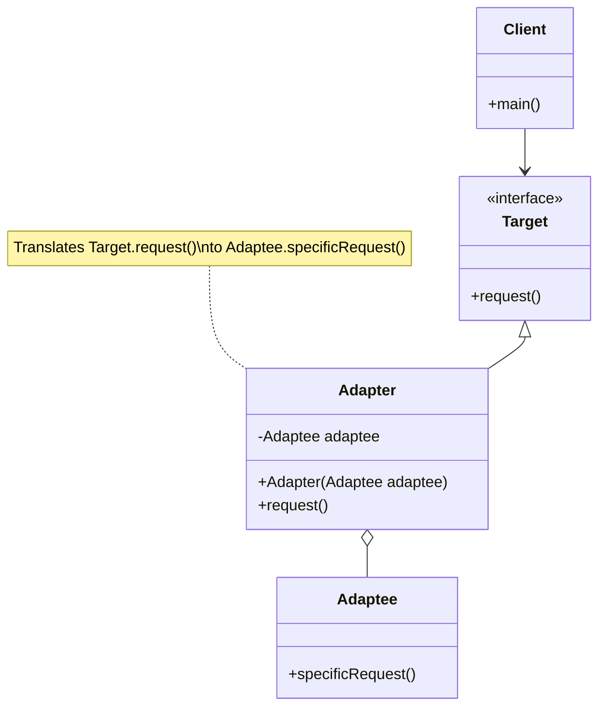

# Adapter Pattern - Interface Conversion

In software development, we often need to make incompatible interfaces work together without modifying existing code.

**Example:** Integrating third-party libraries, legacy systems, different data formats (XML to JSON), database connections, payment gateways, etc.

Direct modification of existing classes violates the Open/Closed principle and may not be possible when working with third-party code or legacy systems.

This is where the **Adapter Design Pattern** comes into play.

It's a fundamental structural pattern that enables interface conversion and has practical daily use in enterprise applications.

## What is Adapter Pattern?

Adapter Pattern is a structural design pattern that allows objects with incompatible interfaces to collaborate. It acts as a bridge between two incompatible interfaces.

The adapter wraps one of the objects to hide the complexity of conversion happening behind the scenes. The wrapped object isn't even aware of the adapter.

The pattern follows the principle of composition over inheritance and provides a way to use existing classes with incompatible interfaces.

## Class Diagram



## Implementation

There are several ways to implement the Adapter Pattern in Java. Let's explore various approaches with real-world examples.

### 1. Classic Adapter Implementation - Media Player

```java
// Target interface that client expects
interface MediaPlayer {
    void play(String audioType, String fileName);
}

// Adaptee classes with incompatible interfaces
class Mp3Player {
    public void playMp3(String fileName) {
        System.out.println("Playing MP3 file: " + fileName);
    }
}

class Mp4Player {
    public void playMp4(String fileName) {
        System.out.println("Playing MP4 file: " + fileName);
    }
}

class VlcPlayer {
    public void playVlc(String fileName) {
        System.out.println("Playing VLC file: " + fileName);
    }
}

// Adapter interface for different media types
interface AdvancedMediaPlayer {
    void playVlc(String fileName);
    void playMp4(String fileName);
}

// Concrete adapters for different media players
class MediaAdapter implements AdvancedMediaPlayer {
    private Mp4Player mp4Player;
    private VlcPlayer vlcPlayer;

    public MediaAdapter() {
        this.mp4Player = new Mp4Player();
        this.vlcPlayer = new VlcPlayer();
    }

    @Override
    public void playVlc(String fileName) {
        vlcPlayer.playVlc(fileName);
    }

    @Override
    public void playMp4(String fileName) {
        mp4Player.playMp4(fileName);
    }
}

// Main adapter that implements target interface
class AudioPlayer implements MediaPlayer {
    private MediaAdapter mediaAdapter;
    private Mp3Player mp3Player;

    public AudioPlayer() {
        this.mp3Player = new Mp3Player();
    }

    @Override
    public void play(String audioType, String fileName) {
        switch (audioType.toLowerCase()) {
            case "mp3":
                mp3Player.playMp3(fileName);
                break;
            case "vlc":
            case "mp4":
                mediaAdapter = new MediaAdapter();
                if (audioType.equalsIgnoreCase("vlc")) {
                    mediaAdapter.playVlc(fileName);
                } else if (audioType.equalsIgnoreCase("mp4")) {
                    mediaAdapter.playMp4(fileName);
                }
                break;
            default:
                System.out.println("Invalid media. " + audioType + " format not supported");
        }
    }
}

// Client code
class MediaPlayerClient {
    public static void main(String[] args) {
        AudioPlayer audioPlayer = new AudioPlayer();

        audioPlayer.play("mp3", "beyond_the_horizon.mp3");
        audioPlayer.play("mp4", "alone.mp4");
        audioPlayer.play("vlc", "far_far_away.vlc");
        audioPlayer.play("avi", "mind_me.avi");
    }
}
```

### 2. Database Connection Adapter

```java
import java.sql.Connection;
import java.sql.SQLException;
import java.util.List;
import java.util.Map;

// Target interface that our application expects
interface DatabaseConnection {
    void connect(String connectionString);
    void disconnect();
    List<Map<String, Object>> executeQuery(String query);
    int executeUpdate(String query);
    boolean isConnected();
}

// Legacy database system (Adaptee)
class LegacyDatabase {
    private boolean connected = false;

    public void openConnection(String host, int port, String database, String user, String password) {
        System.out.println("Opening legacy connection to " + host + ":" + port + "/" + database);
        this.connected = true;
    }

    public void closeConnection() {
        System.out.println("Closing legacy connection");
        this.connected = false;
    }

    public String[] runQuery(String sql) {
        if (!connected) {
            throw new RuntimeException("Database not connected");
        }
        System.out.println("Executing legacy query: " + sql);
        // Simulate query results
        return new String[]{"row1_col1", "row1_col2", "row2_col1", "row2_col2"};
    }

    public int runUpdate(String sql) {
        if (!connected) {
            throw new RuntimeException("Database not connected");
        }
        System.out.println("Executing legacy update: " + sql);
        return 1; // Simulate affected rows
    }

    public boolean isActive() {
        return connected;
    }
}

// Modern NoSQL database system (Another Adaptee)
class NoSQLDatabase {
    private boolean active = false;

    public void initialize(String endpoint, String apiKey) {
        System.out.println("Initializing NoSQL connection to " + endpoint);
        this.active = true;
    }

    public void shutdown() {
        System.out.println("Shutting down NoSQL connection");
        this.active = false;
    }

    public Map<String, Object> find(String collection, String query) {
        if (!active) {
            throw new RuntimeException("NoSQL database not active");
        }
        System.out.println("Finding documents in " + collection + " with query: " + query);
        return Map.of("_id", "12345", "name", "John", "age", 30);
    }

    public boolean insert(String collection, Map<String, Object> document) {
        if (!active) {
            throw new RuntimeException("NoSQL database not active");
        }
        System.out.println("Inserting document into " + collection + ": " + document);
        return true;
    }

    public boolean isRunning() {
        return active;
    }
}

// Adapter for Legacy Database
class LegacyDatabaseAdapter implements DatabaseConnection {
    private LegacyDatabase legacyDb;
    private String currentHost;
    private int currentPort;
    private String currentDatabase;
    private String currentUser;
    private String currentPassword;

    public LegacyDatabaseAdapter(LegacyDatabase legacyDb) {
        this.legacyDb = legacyDb;
    }

    @Override
    public void connect(String connectionString) {
        // Parse connection string: "host:port/database?user=xxx&password=yyy"
        String[] parts = connectionString.split("/");
        String[] hostPort = parts[0].split(":");
        this.currentHost = hostPort[0];
        this.currentPort = Integer.parseInt(hostPort[1]);

        String[] dbAndParams = parts[1].split("\\?");
        this.currentDatabase = dbAndParams[0];

        if (dbAndParams.length > 1) {
            String[] params = dbAndParams[1].split("&");
            for (String param : params) {
                String[] keyValue = param.split("=");
                if ("user".equals(keyValue[0])) {
                    this.currentUser = keyValue[1];
                } else if ("password".equals(keyValue[0])) {
                    this.currentPassword = keyValue[1];
                }
            }
        }

        legacyDb.openConnection(currentHost, currentPort, currentDatabase, currentUser, currentPassword);
    }

    @Override
    public void disconnect() {
        legacyDb.closeConnection();
    }

    @Override
    public List<Map<String, Object>> executeQuery(String query) {
        String[] results = legacyDb.runQuery(query);
        List<Map<String, Object>> convertedResults = new java.util.ArrayList<>();

        // Convert array results to List<Map> format
        for (int i = 0; i < results.length; i += 2) {
            Map<String, Object> row = new java.util.HashMap<>();
            row.put("col1", results[i]);
            if (i + 1 < results.length) {
                row.put("col2", results[i + 1]);
            }
            convertedResults.add(row);
        }

        return convertedResults;
    }

    @Override
    public int executeUpdate(String query) {
        return legacyDb.runUpdate(query);
    }

    @Override
    public boolean isConnected() {
        return legacyDb.isActive();
    }
}

// Adapter for NoSQL Database
class NoSQLDatabaseAdapter implements DatabaseConnection {
    private NoSQLDatabase noSqlDb;
    private String currentEndpoint;
    private String currentApiKey;

    public NoSQLDatabaseAdapter(NoSQLDatabase noSqlDb) {
        this.noSqlDb = noSqlDb;
    }

    @Override
    public void connect(String connectionString) {
        // Parse connection string: "endpoint?apiKey=xxx"
        String[] parts = connectionString.split("\\?");
        this.currentEndpoint = parts[0];

        if (parts.length > 1) {
            String[] params = parts[1].split("&");
            for (String param : params) {
                String[] keyValue = param.split("=");
                if ("apiKey".equals(keyValue[0])) {
                    this.currentApiKey = keyValue[1];
                }
            }
        }

        noSqlDb.initialize(currentEndpoint, currentApiKey);
    }

    @Override
    public void disconnect() {
        noSqlDb.shutdown();
    }

    @Override
    public List<Map<String, Object>> executeQuery(String query) {
        // Convert SQL-like query to NoSQL collection and filter
        String collection = extractCollection(query);
        String filter = extractFilter(query);

        Map<String, Object> result = noSqlDb.find(collection, filter);
        return List.of(result);
    }

    @Override
    public int executeUpdate(String query) {
        // Convert SQL INSERT to NoSQL insert
        String collection = extractCollection(query);
        Map<String, Object> document = extractDocument(query);

        boolean success = noSqlDb.insert(collection, document);
        return success ? 1 : 0;
    }

    @Override
    public boolean isConnected() {
        return noSqlDb.isRunning();
    }

    private String extractCollection(String query) {
        // Simple parser for demo purposes
        if (query.toLowerCase().contains("from")) {
            String[] parts = query.toLowerCase().split("from");
            return parts[1].trim().split(" ")[0];
        }
        return "default_collection";
    }

    private String extractFilter(String query) {
        // Simple parser for demo purposes
        if (query.toLowerCase().contains("where")) {
            String[] parts = query.toLowerCase().split("where");
            return parts[1].trim();
        }
        return "{}";
    }

    private Map<String, Object> extractDocument(String query) {
        // Simple parser for demo purposes
        return Map.of("data", "extracted from: " + query);
    }
}

// Database factory that returns appropriate adapter
class DatabaseFactory {
    public static DatabaseConnection createConnection(String type) {
        switch (type.toLowerCase()) {
            case "legacy":
                return new LegacyDatabaseAdapter(new LegacyDatabase());
            case "nosql":
                return new NoSQLDatabaseAdapter(new NoSQLDatabase());
            default:
                throw new IllegalArgumentException("Unsupported database type: " + type);
        }
    }
}
```

### 3. Payment Gateway Adapter

```java
import java.math.BigDecimal;
import java.time.LocalDateTime;
import java.util.Map;

// Target interface for payment processing
interface PaymentProcessor {
    PaymentResult processPayment(PaymentRequest request);
    PaymentResult refundPayment(String transactionId, BigDecimal amount);
    PaymentStatus getPaymentStatus(String transactionId);
}

// Common payment data structures
class PaymentRequest {
    private BigDecimal amount;
    private String currency;
    private String merchantId;
    private String customerInfo;
    private Map<String, String> metadata;

    // Constructor and getters
    public PaymentRequest(BigDecimal amount, String currency, String merchantId, String customerInfo) {
        this.amount = amount;
        this.currency = currency;
        this.merchantId = merchantId;
        this.customerInfo = customerInfo;
    }

    // Getters
    public BigDecimal getAmount() { return amount; }
    public String getCurrency() { return currency; }
    public String getMerchantId() { return merchantId; }
    public String getCustomerInfo() { return customerInfo; }
    public Map<String, String> getMetadata() { return metadata; }
    public void setMetadata(Map<String, String> metadata) { this.metadata = metadata; }
}

class PaymentResult {
    private boolean success;
    private String transactionId;
    private String message;
    private LocalDateTime timestamp;

    public PaymentResult(boolean success, String transactionId, String message) {
        this.success = success;
        this.transactionId = transactionId;
        this.message = message;
        this.timestamp = LocalDateTime.now();
    }

    // Getters
    public boolean isSuccess() { return success; }
    public String getTransactionId() { return transactionId; }
    public String getMessage() { return message; }
    public LocalDateTime getTimestamp() { return timestamp; }
}

enum PaymentStatus {
    PENDING, COMPLETED, FAILED, REFUNDED, CANCELLED
}

// Legacy PayPal API (Adaptee)
class PayPalLegacyAPI {
    public String makePayment(double amount, String from, String to) {
        System.out.println("PayPal Legacy: Processing $" + amount + " from " + from + " to " + to);
        return "PP_" + System.currentTimeMillis();
    }

    public boolean refund(String paymentId, double amount) {
        System.out.println("PayPal Legacy: Refunding $" + amount + " for payment " + paymentId);
        return true;
    }

    public String checkStatus(String paymentId) {
        System.out.println("PayPal Legacy: Checking status for " + paymentId);
        return "COMPLETED";
    }
}

// Stripe API (Another Adaptee)
class StripeAPI {
    public StripePaymentResponse charge(StripeChargeRequest request) {
        System.out.println("Stripe: Charging " + request.getAmountInCents() + " cents to " + request.getSource());
        return new StripePaymentResponse("ch_" + System.currentTimeMillis(), "succeeded");
    }

    public StripeRefundResponse refund(String chargeId, int amountInCents) {
        System.out.println("Stripe: Refunding " + amountInCents + " cents for charge " + chargeId);
        return new StripeRefundResponse("re_" + System.currentTimeMillis(), "succeeded");
    }

    public StripePaymentResponse retrieveCharge(String chargeId) {
        System.out.println("Stripe: Retrieving charge " + chargeId);
        return new StripePaymentResponse(chargeId, "succeeded");
    }
}

// Stripe API data classes
class StripeChargeRequest {
    private int amountInCents;
    private String currency;
    private String source;

    public StripeChargeRequest(int amountInCents, String currency, String source) {
        this.amountInCents = amountInCents;
        this.currency = currency;
        this.source = source;
    }

    public int getAmountInCents() { return amountInCents; }
    public String getCurrency() { return currency; }
    public String getSource() { return source; }
}

class StripePaymentResponse {
    private String id;
    private String status;

    public StripePaymentResponse(String id, String status) {
        this.id = id;
        this.status = status;
    }

    public String getId() { return id; }
    public String getStatus() { return status; }
}

class StripeRefundResponse {
    private String id;
    private String status;

    public StripeRefundResponse(String id, String status) {
        this.id = id;
        this.status = status;
    }

    public String getId() { return id; }
    public String getStatus() { return status; }
}

// PayPal Adapter
class PayPalAdapter implements PaymentProcessor {
    private PayPalLegacyAPI paypalAPI;

    public PayPalAdapter() {
        this.paypalAPI = new PayPalLegacyAPI();
    }

    @Override
    public PaymentResult processPayment(PaymentRequest request) {
        try {
            String transactionId = paypalAPI.makePayment(
                request.getAmount().doubleValue(),
                request.getCustomerInfo(),
                request.getMerchantId()
            );

            return new PaymentResult(true, transactionId, "Payment processed successfully via PayPal");
        } catch (Exception e) {
            return new PaymentResult(false, null, "PayPal payment failed: " + e.getMessage());
        }
    }

    @Override
    public PaymentResult refundPayment(String transactionId, BigDecimal amount) {
        try {
            boolean success = paypalAPI.refund(transactionId, amount.doubleValue());
            String message = success ? "Refund processed successfully" : "Refund failed";
            return new PaymentResult(success, transactionId, message);
        } catch (Exception e) {
            return new PaymentResult(false, transactionId, "PayPal refund failed: " + e.getMessage());
        }
    }

    @Override
    public PaymentStatus getPaymentStatus(String transactionId) {
        try {
            String status = paypalAPI.checkStatus(transactionId);
            return convertPayPalStatus(status);
        } catch (Exception e) {
            return PaymentStatus.FAILED;
        }
    }

    private PaymentStatus convertPayPalStatus(String paypalStatus) {
        switch (paypalStatus.toUpperCase()) {
            case "COMPLETED": return PaymentStatus.COMPLETED;
            case "PENDING": return PaymentStatus.PENDING;
            case "FAILED": return PaymentStatus.FAILED;
            case "REFUNDED": return PaymentStatus.REFUNDED;
            default: return PaymentStatus.FAILED;
        }
    }
}

// Stripe Adapter
class StripeAdapter implements PaymentProcessor {
    private StripeAPI stripeAPI;

    public StripeAdapter() {
        this.stripeAPI = new StripeAPI();
    }

    @Override
    public PaymentResult processPayment(PaymentRequest request) {
        try {
            StripeChargeRequest stripeRequest = new StripeChargeRequest(
                request.getAmount().multiply(BigDecimal.valueOf(100)).intValue(), // Convert to cents
                request.getCurrency(),
                request.getCustomerInfo()
            );

            StripePaymentResponse response = stripeAPI.charge(stripeRequest);
            boolean success = "succeeded".equals(response.getStatus());
            String message = success ? "Payment processed successfully via Stripe" : "Stripe payment failed";

            return new PaymentResult(success, response.getId(), message);
        } catch (Exception e) {
            return new PaymentResult(false, null, "Stripe payment failed: " + e.getMessage());
        }
    }

    @Override
    public PaymentResult refundPayment(String transactionId, BigDecimal amount) {
        try {
            int amountInCents = amount.multiply(BigDecimal.valueOf(100)).intValue();
            StripeRefundResponse response = stripeAPI.refund(transactionId, amountInCents);

            boolean success = "succeeded".equals(response.getStatus());
            String message = success ? "Refund processed successfully" : "Refund failed";

            return new PaymentResult(success, response.getId(), message);
        } catch (Exception e) {
            return new PaymentResult(false, transactionId, "Stripe refund failed: " + e.getMessage());
        }
    }

    @Override
    public PaymentStatus getPaymentStatus(String transactionId) {
        try {
            StripePaymentResponse response = stripeAPI.retrieveCharge(transactionId);
            return convertStripeStatus(response.getStatus());
        } catch (Exception e) {
            return PaymentStatus.FAILED;
        }
    }

    private PaymentStatus convertStripeStatus(String stripeStatus) {
        switch (stripeStatus.toLowerCase()) {
            case "succeeded": return PaymentStatus.COMPLETED;
            case "pending": return PaymentStatus.PENDING;
            case "failed": return PaymentStatus.FAILED;
            case "refunded": return PaymentStatus.REFUNDED;
            default: return PaymentStatus.FAILED;
        }
    }
}

// Payment Gateway Factory
class PaymentGatewayFactory {
    public static PaymentProcessor createProcessor(String gateway) {
        switch (gateway.toLowerCase()) {
            case "paypal":
                return new PayPalAdapter();
            case "stripe":
                return new StripeAdapter();
            default:
                throw new IllegalArgumentException("Unsupported payment gateway: " + gateway);
        }
    }
}
```

### 4. Object-to-Object Adapter (Two-way Adapter)

```java
// Modern interface
interface ModernPrinter {
    void printDocument(String document, String format);
    boolean isReady();
    String getStatus();
}

// Legacy interface
interface LegacyPrinter {
    void print(String text);
    boolean available();
    int statusCode();
}

// Two-way adapter that implements both interfaces
class PrinterAdapter implements ModernPrinter, LegacyPrinter {
    private ModernPrinter modernPrinter;
    private LegacyPrinter legacyPrinter;

    // Adapter for modern to legacy
    public PrinterAdapter(ModernPrinter modernPrinter) {
        this.modernPrinter = modernPrinter;
    }

    // Adapter for legacy to modern
    public PrinterAdapter(LegacyPrinter legacyPrinter) {
        this.legacyPrinter = legacyPrinter;
    }

    // Modern interface implementation (adapting legacy)
    @Override
    public void printDocument(String document, String format) {
        if (legacyPrinter != null) {
            // Convert modern format to legacy
            String legacyText = convertToLegacyFormat(document, format);
            legacyPrinter.print(legacyText);
        } else if (modernPrinter != null) {
            modernPrinter.printDocument(document, format);
        }
    }

    @Override
    public boolean isReady() {
        if (legacyPrinter != null) {
            return legacyPrinter.available();
        } else if (modernPrinter != null) {
            return modernPrinter.isReady();
        }
        return false;
    }

    @Override
    public String getStatus() {
        if (legacyPrinter != null) {
            return convertStatusCodeToString(legacyPrinter.statusCode());
        } else if (modernPrinter != null) {
            return modernPrinter.getStatus();
        }
        return "Unknown";
    }

    // Legacy interface implementation (adapting modern)
    @Override
    public void print(String text) {
        if (modernPrinter != null) {
            modernPrinter.printDocument(text, "plain");
        } else if (legacyPrinter != null) {
            legacyPrinter.print(text);
        }
    }

    @Override
    public boolean available() {
        if (modernPrinter != null) {
            return modernPrinter.isReady();
        } else if (legacyPrinter != null) {
            return legacyPrinter.available();
        }
        return false;
    }

    @Override
    public int statusCode() {
        if (modernPrinter != null) {
            return convertStatusStringToCode(modernPrinter.getStatus());
        } else if (legacyPrinter != null) {
            return legacyPrinter.statusCode();
        }
        return -1;
    }

    // Helper methods for conversion
    private String convertToLegacyFormat(String document, String format) {
        // Remove formatting for legacy printer
        return document.replaceAll("<[^>]*>", ""); // Remove HTML tags
    }

    private String convertStatusCodeToString(int code) {
        switch (code) {
            case 0: return "Ready";
            case 1: return "Busy";
            case 2: return "Error";
            case 3: return "Out of Paper";
            default: return "Unknown";
        }
    }

    private int convertStatusStringToCode(String status) {
        switch (status.toLowerCase()) {
            case "ready": return 0;
            case "busy": return 1;
            case "error": return 2;
            case "out of paper": return 3;
            default: return -1;
        }
    }
}

// Concrete implementations for testing
class HPLegacyPrinter implements LegacyPrinter {
    private boolean isAvailable = true;

    @Override
    public void print(String text) {
        System.out.println("HP Legacy Printer: " + text);
    }

    @Override
    public boolean available() {
        return isAvailable;
    }

    @Override
    public int statusCode() {
        return 0; // Ready
    }
}

class CanonModernPrinter implements ModernPrinter {
    @Override
    public void printDocument(String document, String format) {
        System.out.println("Canon Modern Printer [" + format + "]: " + document);
    }

    @Override
    public boolean isReady() {
        return true;
    }

    @Override
    public String getStatus() {
        return "Ready";
    }
}
```

## Test Code

```java
import org.junit.jupiter.api.Test;
import org.junit.jupiter.api.BeforeEach;
import static org.junit.jupiter.api.Assertions.*;
import java.math.BigDecimal;

class AdapterPatternTest {

    @Test
    void testMediaPlayerAdapter() {
        AudioPlayer audioPlayer = new AudioPlayer();

        // Test should not throw exceptions
        assertDoesNotThrow(() -> {
            audioPlayer.play("mp3", "test.mp3");
            audioPlayer.play("mp4", "test.mp4");
            audioPlayer.play("vlc", "test.vlc");
        });
    }

    @Test
    void testDatabaseAdapters() {
        // Test Legacy Database Adapter
        DatabaseConnection legacyDb = DatabaseFactory.createConnection("legacy");
        assertNotNull(legacyDb);

        legacyDb.connect("localhost:5432/testdb?user=admin&password=secret");
        assertTrue(legacyDb.isConnected());

        int updateResult = legacyDb.executeUpdate("INSERT INTO users VALUES (1, 'John')");
        assertEquals(1, updateResult);

        List<Map<String, Object>> queryResult = legacyDb.executeQuery("SELECT * FROM users");
        assertNotNull(queryResult);
        assertFalse(queryResult.isEmpty());

        legacyDb.disconnect();
        assertFalse(legacyDb.isConnected());

        // Test NoSQL Database Adapter
        DatabaseConnection noSqlDb = DatabaseFactory.createConnection("nosql");
        assertNotNull(noSqlDb);

        noSqlDb.connect("https://api.nosql.com?apiKey=abc123");
        assertTrue(noSqlDb.isConnected());

        List<Map<String, Object>> noSqlResult = noSqlDb.executeQuery("SELECT * FROM users");
        assertNotNull(noSqlResult);

        noSqlDb.disconnect();
        assertFalse(noSqlDb.isConnected());
    }

    @Test
    void testPaymentAdapters() {
        // Test PayPal Adapter
        PaymentProcessor paypalProcessor = PaymentGatewayFactory.createProcessor("paypal");
        assertNotNull(paypalProcessor);

        PaymentRequest request = new PaymentRequest(
            new BigDecimal("100.00"),
            "USD",
            "merchant123",
            "customer@example.com"
        );

        PaymentResult result = paypalProcessor.processPayment(request);
        assertNotNull(result);
        assertTrue(result.isSuccess());
        assertNotNull(result.getTransactionId());
        assertTrue(result.getTransactionId().startsWith("PP_"));

        // Test refund
        PaymentResult refundResult = paypalProcessor.refundPayment(result.getTransactionId(), new BigDecimal("50.00"));
        assertTrue(refundResult.isSuccess());

        // Test status check
        PaymentStatus status = paypalProcessor.getPaymentStatus(result.getTransactionId());
        assertEquals(PaymentStatus.COMPLETED, status);

        // Test Stripe Adapter
        PaymentProcessor stripeProcessor = PaymentGatewayFactory.createProcessor("stripe");
        assertNotNull(stripeProcessor);

        PaymentResult stripeResult = stripeProcessor.processPayment(request);
        assertNotNull(stripeResult);
        assertTrue(stripeResult.isSuccess());
        assertNotNull(stripeResult.getTransactionId());
        assertTrue(stripeResult.getTransactionId().startsWith("ch_"));
    }

    @Test
    void testTwoWayAdapter() {
        // Test modern printer through adapter
        ModernPrinter modernPrinter = new CanonModernPrinter();
        PrinterAdapter adapter1 = new PrinterAdapter(modernPrinter);

        // Use as legacy printer
        assertTrue(adapter1.available());
        assertEquals(0, adapter1.statusCode());
        assertDoesNotThrow(() -> adapter1.print("Hello World"));

        // Test legacy printer through adapter
        LegacyPrinter legacyPrinter = new HPLegacyPrinter();
        PrinterAdapter adapter2 = new PrinterAdapter(legacyPrinter);

        // Use as modern printer
        assertTrue(adapter2.isReady());
        assertEquals("Ready", adapter2.getStatus());
        assertDoesNotThrow(() -> adapter2.printDocument("Hello World", "html"));
    }

    @Test
    void testAdapterWithInvalidInputs() {
        AudioPlayer audioPlayer = new AudioPlayer();

        // Should handle unsupported format gracefully
        assertDoesNotThrow(() -> {
            audioPlayer.play("avi", "unsupported.avi");
        });

        // Test invalid payment gateway
        assertThrows(IllegalArgumentException.class, () -> {
            PaymentGatewayFactory.createProcessor("bitcoin");
        });

        // Test invalid database type
        assertThrows(IllegalArgumentException.class, () -> {
            DatabaseFactory.createConnection("invaliddb");
        });
    }

    @Test
    void testAdapterChaining() {
        // Test that adapters can be chained
        PaymentProcessor paypalProcessor = PaymentGatewayFactory.createProcessor("paypal");
        PaymentProcessor stripeProcessor = PaymentGatewayFactory.createProcessor("stripe");

        PaymentRequest request = new PaymentRequest(
            new BigDecimal("50.00"),
            "USD",
            "merchant456",
            "test@example.com"
        );

        // Process same payment through different adapters
        PaymentResult paypalResult = paypalProcessor.processPayment(request);
        PaymentResult stripeResult = stripeProcessor.processPayment(request);

        assertTrue(paypalResult.isSuccess());
        assertTrue(stripeResult.isSuccess());
        assertNotEquals(paypalResult.getTransactionId(), stripeResult.getTransactionId());
    }
}
```

## Real-World Examples of Adapter Pattern

### 1. **System Integration**

- **API Integration**: REST to SOAP, XML to JSON converters
- **Legacy System Integration**: Mainframe to modern web services
- **Database Migration**: Oracle to PostgreSQL, SQL to NoSQL adapters
- **Cloud Migration**: On-premise to AWS/Azure service adapters

### 2. **Third-Party Libraries**

- **Payment Gateways**: PayPal, Stripe, Square API unification
- **Logging Frameworks**: SLF4J adapters for Log4j, Logback
- **ORM Frameworks**: Hibernate to JPA adapter layers
- **Testing Frameworks**: JUnit 4 to JUnit 5 migration adapters

### 3. **Framework Applications**

- **Spring Framework**: Multiple data source adapters, JMS adapters
- **Java I/O**: `InputStreamReader` adapts `InputStream` to `Reader`
- **Collections Framework**: `Arrays.asList()` adapts arrays to List interface
- **JDBC**: Database driver adapters for different database vendors

### 4. **Enterprise Applications**

- **Message Queues**: RabbitMQ to Kafka adapters
- **Authentication**: LDAP to OAuth adapters
- **File Systems**: Cloud storage to local file system adapters
- **Monitoring**: Different metrics systems unified through adapters

## Specific Examples:

**java.io.InputStreamReader**: Adapts `InputStream` (byte stream) to `Reader` (character stream).

**java.util.Collections.list()**: Adapts `Enumeration` to `List` interface.

**Spring JPA**: Adapts different JPA implementations (Hibernate, EclipseLink) to a common interface.

**JDBC Drivers**: Database-specific drivers adapt to the common JDBC interface.

**Jackson ObjectMapper**: Adapts different data formats (JSON, XML, YAML) to Java objects.

## Pros and Cons of Adapter Pattern

| **Pros**                                                                                | **Cons**                                                                    |
| --------------------------------------------------------------------------------------- | --------------------------------------------------------------------------- |
| ✅ **Legacy Integration**: Enables use of existing classes with incompatible interfaces | ❌ **Code Complexity**: Additional layer of abstraction                     |
| ✅ **Open/Closed Principle**: Can add new adapters without modifying existing code      | ❌ **Performance Overhead**: Extra method calls and object creation         |
| ✅ **Separation of Concerns**: Business logic separated from interface conversion       | ❌ **Maintenance Overhead**: Multiple adapters to maintain                  |
| ✅ **Reusability**: Adapters can be reused across different parts of application        | ❌ **Interface Limitation**: Can only adapt interfaces, not implementations |
| ✅ **Third-Party Integration**: Easy integration with external libraries                | ❌ **Two-Way Conversion**: Complex when bidirectional adaptation is needed  |

## Best Practices

### ⚠️ **Warnings & Considerations**

1. **Interface Design**: Keep adapter interfaces simple and focused
2. **Error Handling**: Properly handle exceptions during adaptation
3. **Performance**: Be aware of performance implications in high-throughput scenarios
4. **Memory Management**: Avoid memory leaks when adapting resource-intensive objects
5. **Testing**: Thoroughly test both direct usage and adapted usage

### 🏆 **Modern Alternatives & Enhancements**

- **Dependency Injection**: Use DI containers to manage adapter instances
- **Strategy Pattern**: For runtime selection of different adapters
- **Facade Pattern**: For simplifying complex adapter interactions
- **Proxy Pattern**: For lazy loading and caching in adapters
- **Builder Pattern**: For complex adapter configuration

### 💡 **When to Use Adapter Pattern**

✅ **Use When:**

- You need to use an existing class with an incompatible interface
- You want to create a reusable class that cooperates with unrelated classes
- You need to adapt several existing subclasses with different interfaces
- You're integrating third-party libraries or legacy systems

❌ **Avoid When:**

- You can modify the source code of the classes you're trying to adapt
- The interface differences are minimal and can be resolved with simple wrapper methods
- You're designing new systems from scratch (design compatible interfaces instead)
- The adaptation logic is too complex and error-prone

### 🔧 **Implementation Tips**

1. **Use Composition**: Prefer composition over inheritance for adapters
2. **Interface Segregation**: Create focused adapter interfaces
3. **Factory Pattern**: Use factories to create appropriate adapters
4. **Configuration-Based**: Make adapter selection configurable
5. **Documentation**: Clearly document the adaptation logic and limitations

The Adapter pattern is essential for system integration and legacy modernization, making it one of the most practical patterns in enterprise software development where systems need to work together despite having incompatible interfaces.
