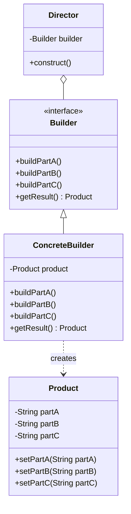

# Builder Pattern - Complex Object Construction

In software development, we often need to create complex objects with many optional parameters or configurations.

**Example:** Creating SQL queries, HTTP requests, configuration objects, domain entities with many fields, etc.

Using constructors with many parameters leads to issues such as telescoping constructor anti-pattern, unclear parameter meaning, and inflexible object creation.

This is where the **Builder Design Pattern** comes into play.

It's a fundamental creational pattern that enables clean object construction and is essential for modern clean code practices.

## What is Builder Pattern?

Builder Pattern is a creational design pattern that constructs complex objects step by step. The pattern allows you to produce different types and representations of an object using the same construction code.

It separates the construction of a complex object from its representation so that the same construction process can create different representations.

The pattern is particularly useful when an object needs to be created with many optional parameters or when the construction process is complex.

## Class Diagram



## Implementation

There are several ways to implement the Builder Pattern in Java. Let's explore various approaches with real-world examples.

### 1. Classic Builder Implementation - Computer Builder

```java
// Product class
class Computer {
    // Required parameters
    private String CPU;
    private String RAM;

    // Optional parameters
    private boolean isGraphicsCardEnabled;
    private boolean isBluetoothEnabled;
    private String storage;
    private String operatingSystem;
    private String monitor;
    private String keyboard;
    private String mouse;

    // Private constructor
    private Computer(ComputerBuilder builder) {
        this.CPU = builder.CPU;
        this.RAM = builder.RAM;
        this.isGraphicsCardEnabled = builder.isGraphicsCardEnabled;
        this.isBluetoothEnabled = builder.isBluetoothEnabled;
        this.storage = builder.storage;
        this.operatingSystem = builder.operatingSystem;
        this.monitor = builder.monitor;
        this.keyboard = builder.keyboard;
        this.mouse = builder.mouse;
    }

    // Getters
    public String getCPU() { return CPU; }
    public String getRAM() { return RAM; }
    public boolean isGraphicsCardEnabled() { return isGraphicsCardEnabled; }
    public boolean isBluetoothEnabled() { return isBluetoothEnabled; }
    public String getStorage() { return storage; }
    public String getOperatingSystem() { return operatingSystem; }
    public String getMonitor() { return monitor; }
    public String getKeyboard() { return keyboard; }
    public String getMouse() { return mouse; }

    @Override
    public String toString() {
        return String.format(
            "Computer{CPU='%s', RAM='%s', Graphics=%s, Bluetooth=%s, Storage='%s', OS='%s', Monitor='%s', Keyboard='%s', Mouse='%s'}",
            CPU, RAM, isGraphicsCardEnabled, isBluetoothEnabled, storage, operatingSystem, monitor, keyboard, mouse
        );
    }

    // Static nested Builder class
    public static class ComputerBuilder {
        // Required parameters
        private String CPU;
        private String RAM;

        // Optional parameters - initialized to default values
        private boolean isGraphicsCardEnabled = false;
        private boolean isBluetoothEnabled = false;
        private String storage = "256GB SSD";
        private String operatingSystem = "Windows 11";
        private String monitor = "No Monitor";
        private String keyboard = "Standard Keyboard";
        private String mouse = "Standard Mouse";

        // Constructor with required parameters
        public ComputerBuilder(String CPU, String RAM) {
            this.CPU = CPU;
            this.RAM = RAM;
        }

        // Methods to set optional parameters
        public ComputerBuilder setGraphicsCardEnabled(boolean isGraphicsCardEnabled) {
            this.isGraphicsCardEnabled = isGraphicsCardEnabled;
            return this;
        }

        public ComputerBuilder setBluetoothEnabled(boolean isBluetoothEnabled) {
            this.isBluetoothEnabled = isBluetoothEnabled;
            return this;
        }

        public ComputerBuilder setStorage(String storage) {
            this.storage = storage;
            return this;
        }

        public ComputerBuilder setOperatingSystem(String operatingSystem) {
            this.operatingSystem = operatingSystem;
            return this;
        }

        public ComputerBuilder setMonitor(String monitor) {
            this.monitor = monitor;
            return this;
        }

        public ComputerBuilder setKeyboard(String keyboard) {
            this.keyboard = keyboard;
            return this;
        }

        public ComputerBuilder setMouse(String mouse) {
            this.mouse = mouse;
            return this;
        }

        // Build method to create Computer object
        public Computer build() {
            return new Computer(this);
        }
    }
}

// Usage example
class ComputerBuilderExample {
    public static void main(String[] args) {
        // Creating different computer configurations

        // Basic computer
        Computer basicComputer = new Computer.ComputerBuilder("Intel i5", "8GB")
            .build();

        // Gaming computer
        Computer gamingComputer = new Computer.ComputerBuilder("Intel i9", "32GB")
            .setGraphicsCardEnabled(true)
            .setStorage("1TB NVMe SSD")
            .setMonitor("4K Gaming Monitor")
            .setKeyboard("Mechanical Gaming Keyboard")
            .setMouse("Gaming Mouse")
            .build();

        // Office computer
        Computer officeComputer = new Computer.ComputerBuilder("Intel i7", "16GB")
            .setBluetoothEnabled(true)
            .setStorage("512GB SSD")
            .setOperatingSystem("Windows 11 Pro")
            .setMonitor("24-inch Monitor")
            .build();

        System.out.println("Basic: " + basicComputer);
        System.out.println("Gaming: " + gamingComputer);
        System.out.println("Office: " + officeComputer);
    }
}
```

### 2. SQL Query Builder

```java
// SQL Query product
class SQLQuery {
    private String query;
    private java.util.List<Object> parameters;

    public SQLQuery(String query, java.util.List<Object> parameters) {
        this.query = query;
        this.parameters = parameters;
    }

    public String getQuery() { return query; }
    public java.util.List<Object> getParameters() { return parameters; }

    @Override
    public String toString() {
        return String.format("SQLQuery{query='%s', parameters=%s}", query, parameters);
    }
}

// SQL Query Builder
class SQLQueryBuilder {
    private StringBuilder query;
    private java.util.List<String> selectFields;
    private String fromTable;
    private java.util.List<String> joinClauses;
    private java.util.List<String> whereConditions;
    private java.util.List<String> groupByFields;
    private java.util.List<String> havingConditions;
    private java.util.List<String> orderByFields;
    private Integer limitValue;
    private Integer offsetValue;
    private java.util.List<Object> parameters;

    public SQLQueryBuilder() {
        this.query = new StringBuilder();
        this.selectFields = new java.util.ArrayList<>();
        this.joinClauses = new java.util.ArrayList<>();
        this.whereConditions = new java.util.ArrayList<>();
        this.groupByFields = new java.util.ArrayList<>();
        this.havingConditions = new java.util.ArrayList<>();
        this.orderByFields = new java.util.ArrayList<>();
        this.parameters = new java.util.ArrayList<>();
    }

    public SQLQueryBuilder select(String... fields) {
        for (String field : fields) {
            this.selectFields.add(field);
        }
        return this;
    }

    public SQLQueryBuilder from(String table) {
        this.fromTable = table;
        return this;
    }

    public SQLQueryBuilder innerJoin(String table, String condition) {
        this.joinClauses.add("INNER JOIN " + table + " ON " + condition);
        return this;
    }

    public SQLQueryBuilder leftJoin(String table, String condition) {
        this.joinClauses.add("LEFT JOIN " + table + " ON " + condition);
        return this;
    }

    public SQLQueryBuilder where(String condition) {
        this.whereConditions.add(condition);
        return this;
    }

    public SQLQueryBuilder where(String condition, Object parameter) {
        this.whereConditions.add(condition);
        this.parameters.add(parameter);
        return this;
    }

    public SQLQueryBuilder and(String condition) {
        return where(condition);
    }

    public SQLQueryBuilder and(String condition, Object parameter) {
        return where(condition, parameter);
    }

    public SQLQueryBuilder or(String condition) {
        if (!whereConditions.isEmpty()) {
            int lastIndex = whereConditions.size() - 1;
            String lastCondition = whereConditions.get(lastIndex);
            whereConditions.set(lastIndex, lastCondition + " OR " + condition);
        } else {
            where(condition);
        }
        return this;
    }

    public SQLQueryBuilder groupBy(String... fields) {
        for (String field : fields) {
            this.groupByFields.add(field);
        }
        return this;
    }

    public SQLQueryBuilder having(String condition) {
        this.havingConditions.add(condition);
        return this;
    }

    public SQLQueryBuilder orderBy(String field) {
        this.orderByFields.add(field + " ASC");
        return this;
    }

    public SQLQueryBuilder orderBy(String field, String direction) {
        this.orderByFields.add(field + " " + direction);
        return this;
    }

    public SQLQueryBuilder limit(int limit) {
        this.limitValue = limit;
        return this;
    }

    public SQLQueryBuilder offset(int offset) {
        this.offsetValue = offset;
        return this;
    }

    public SQLQuery build() {
        if (selectFields.isEmpty()) {
            throw new IllegalStateException("SELECT fields are required");
        }
        if (fromTable == null) {
            throw new IllegalStateException("FROM table is required");
        }

        query.setLength(0); // Reset query

        // SELECT clause
        query.append("SELECT ").append(String.join(", ", selectFields));

        // FROM clause
        query.append(" FROM ").append(fromTable);

        // JOIN clauses
        for (String join : joinClauses) {
            query.append(" ").append(join);
        }

        // WHERE clause
        if (!whereConditions.isEmpty()) {
            query.append(" WHERE ").append(String.join(" AND ", whereConditions));
        }

        // GROUP BY clause
        if (!groupByFields.isEmpty()) {
            query.append(" GROUP BY ").append(String.join(", ", groupByFields));
        }

        // HAVING clause
        if (!havingConditions.isEmpty()) {
            query.append(" HAVING ").append(String.join(" AND ", havingConditions));
        }

        // ORDER BY clause
        if (!orderByFields.isEmpty()) {
            query.append(" ORDER BY ").append(String.join(", ", orderByFields));
        }

        // LIMIT clause
        if (limitValue != null) {
            query.append(" LIMIT ").append(limitValue);
        }

        // OFFSET clause
        if (offsetValue != null) {
            query.append(" OFFSET ").append(offsetValue);
        }

        return new SQLQuery(query.toString(), new java.util.ArrayList<>(parameters));
    }
}

// Usage example
class SQLQueryBuilderExample {
    public static void main(String[] args) {
        // Simple query
        SQLQuery simpleQuery = new SQLQueryBuilder()
            .select("name", "email")
            .from("users")
            .where("active = ?", true)
            .orderBy("name")
            .build();

        // Complex query with joins
        SQLQuery complexQuery = new SQLQueryBuilder()
            .select("u.name", "u.email", "p.title", "c.name as category")
            .from("users u")
            .innerJoin("posts p", "p.user_id = u.id")
            .leftJoin("categories c", "c.id = p.category_id")
            .where("u.active = ?", true)
            .and("p.published_date > ?", "2023-01-01")
            .groupBy("u.id", "p.id")
            .having("COUNT(p.id) > 0")
            .orderBy("u.name", "ASC")
            .orderBy("p.published_date", "DESC")
            .limit(10)
            .offset(20)
            .build();

        System.out.println("Simple Query: " + simpleQuery);
        System.out.println("Complex Query: " + complexQuery);
    }
}
```

### 3. HTTP Request Builder

```java
import java.util.*;

// HTTP Request product
class HttpRequest {
    private String method;
    private String url;
    private Map<String, String> headers;
    private Map<String, String> queryParams;
    private String body;
    private int timeout;
    private boolean followRedirects;

    // Package-private constructor (only builder can create)
    HttpRequest(HttpRequestBuilder builder) {
        this.method = builder.method;
        this.url = builder.url;
        this.headers = new HashMap<>(builder.headers);
        this.queryParams = new HashMap<>(builder.queryParams);
        this.body = builder.body;
        this.timeout = builder.timeout;
        this.followRedirects = builder.followRedirects;
    }

    // Getters
    public String getMethod() { return method; }
    public String getUrl() { return url; }
    public Map<String, String> getHeaders() { return headers; }
    public Map<String, String> getQueryParams() { return queryParams; }
    public String getBody() { return body; }
    public int getTimeout() { return timeout; }
    public boolean isFollowRedirects() { return followRedirects; }

    public String getFullUrl() {
        if (queryParams.isEmpty()) {
            return url;
        }

        StringBuilder fullUrl = new StringBuilder(url);
        fullUrl.append("?");

        StringJoiner joiner = new StringJoiner("&");
        for (Map.Entry<String, String> entry : queryParams.entrySet()) {
            joiner.add(entry.getKey() + "=" + entry.getValue());
        }
        fullUrl.append(joiner.toString());

        return fullUrl.toString();
    }

    @Override
    public String toString() {
        return String.format("HttpRequest{method='%s', url='%s', headers=%s, queryParams=%s, body='%s', timeout=%d, followRedirects=%s}",
            method, getFullUrl(), headers, queryParams, body, timeout, followRedirects);
    }
}

// HTTP Request Builder
class HttpRequestBuilder {
    // Required
    String method;
    String url;

    // Optional with defaults
    Map<String, String> headers = new HashMap<>();
    Map<String, String> queryParams = new HashMap<>();
    String body = null;
    int timeout = 30000; // 30 seconds default
    boolean followRedirects = true;

    // Private constructor to enforce factory methods
    private HttpRequestBuilder(String method, String url) {
        this.method = method;
        this.url = url;
    }

    // Factory methods for different HTTP methods
    public static HttpRequestBuilder get(String url) {
        return new HttpRequestBuilder("GET", url);
    }

    public static HttpRequestBuilder post(String url) {
        return new HttpRequestBuilder("POST", url);
    }

    public static HttpRequestBuilder put(String url) {
        return new HttpRequestBuilder("PUT", url);
    }

    public static HttpRequestBuilder delete(String url) {
        return new HttpRequestBuilder("DELETE", url);
    }

    public static HttpRequestBuilder patch(String url) {
        return new HttpRequestBuilder("PATCH", url);
    }

    // Header methods
    public HttpRequestBuilder header(String name, String value) {
        this.headers.put(name, value);
        return this;
    }

    public HttpRequestBuilder headers(Map<String, String> headers) {
        this.headers.putAll(headers);
        return this;
    }

    public HttpRequestBuilder contentType(String contentType) {
        return header("Content-Type", contentType);
    }

    public HttpRequestBuilder authorization(String authorization) {
        return header("Authorization", authorization);
    }

    public HttpRequestBuilder bearerToken(String token) {
        return header("Authorization", "Bearer " + token);
    }

    public HttpRequestBuilder userAgent(String userAgent) {
        return header("User-Agent", userAgent);
    }

    // Query parameter methods
    public HttpRequestBuilder queryParam(String name, String value) {
        this.queryParams.put(name, value);
        return this;
    }

    public HttpRequestBuilder queryParam(String name, Object value) {
        this.queryParams.put(name, String.valueOf(value));
        return this;
    }

    public HttpRequestBuilder queryParams(Map<String, String> params) {
        this.queryParams.putAll(params);
        return this;
    }

    // Body methods
    public HttpRequestBuilder body(String body) {
        this.body = body;
        return this;
    }

    public HttpRequestBuilder jsonBody(String json) {
        this.body = json;
        return contentType("application/json");
    }

    public HttpRequestBuilder formBody(Map<String, String> formData) {
        StringJoiner joiner = new StringJoiner("&");
        for (Map.Entry<String, String> entry : formData.entrySet()) {
            joiner.add(entry.getKey() + "=" + entry.getValue());
        }
        this.body = joiner.toString();
        return contentType("application/x-www-form-urlencoded");
    }

    // Configuration methods
    public HttpRequestBuilder timeout(int timeoutMs) {
        this.timeout = timeoutMs;
        return this;
    }

    public HttpRequestBuilder followRedirects(boolean follow) {
        this.followRedirects = follow;
        return this;
    }

    // Build method
    public HttpRequest build() {
        // Validation
        if (method == null || method.trim().isEmpty()) {
            throw new IllegalStateException("HTTP method is required");
        }
        if (url == null || url.trim().isEmpty()) {
            throw new IllegalStateException("URL is required");
        }
        if (timeout < 0) {
            throw new IllegalStateException("Timeout cannot be negative");
        }

        return new HttpRequest(this);
    }
}

// Usage example
class HttpRequestBuilderExample {
    public static void main(String[] args) {
        // Simple GET request
        HttpRequest getRequest = HttpRequestBuilder.get("https://api.example.com/users")
            .header("Accept", "application/json")
            .queryParam("page", 1)
            .queryParam("limit", 10)
            .timeout(5000)
            .build();

        // POST request with JSON body
        HttpRequest postRequest = HttpRequestBuilder.post("https://api.example.com/users")
            .bearerToken("abc123")
            .jsonBody("{\"name\":\"John\",\"email\":\"john@example.com\"}")
            .build();

        // Complex request with multiple headers and query params
        HttpRequest complexRequest = HttpRequestBuilder.get("https://api.example.com/search")
            .header("Accept", "application/json")
            .header("X-Custom-Header", "custom-value")
            .userAgent("MyApp/1.0")
            .queryParam("q", "java")
            .queryParam("sort", "relevance")
            .queryParam("page", 1)
            .timeout(10000)
            .followRedirects(false)
            .build();

        // Form POST request
        Map<String, String> formData = new HashMap<>();
        formData.put("username", "john");
        formData.put("password", "secret");

        HttpRequest formRequest = HttpRequestBuilder.post("https://example.com/login")
            .formBody(formData)
            .build();

        System.out.println("GET Request: " + getRequest);
        System.out.println("POST Request: " + postRequest);
        System.out.println("Complex Request: " + complexRequest);
        System.out.println("Form Request: " + formRequest);
    }
}
```

### 4. Configuration Builder with Validation

```java
import java.util.*;

// Configuration product with validation
class ApplicationConfig {
    // Required fields
    private final String applicationName;
    private final String environment;

    // Optional fields with defaults
    private final String databaseUrl;
    private final int maxConnections;
    private final boolean debugMode;
    private final Set<String> features;
    private final Map<String, String> properties;
    private final int serverPort;
    private final String logLevel;

    private ApplicationConfig(Builder builder) {
        // Validation in constructor
        if (builder.applicationName == null || builder.applicationName.trim().isEmpty()) {
            throw new IllegalArgumentException("Application name is required");
        }
        if (builder.environment == null || builder.environment.trim().isEmpty()) {
            throw new IllegalArgumentException("Environment is required");
        }
        if (builder.maxConnections <= 0) {
            throw new IllegalArgumentException("Max connections must be positive");
        }
        if (builder.serverPort < 1 || builder.serverPort > 65535) {
            throw new IllegalArgumentException("Server port must be between 1 and 65535");
        }

        this.applicationName = builder.applicationName;
        this.environment = builder.environment;
        this.databaseUrl = builder.databaseUrl;
        this.maxConnections = builder.maxConnections;
        this.debugMode = builder.debugMode;
        this.features = new HashSet<>(builder.features);
        this.properties = new HashMap<>(builder.properties);
        this.serverPort = builder.serverPort;
        this.logLevel = builder.logLevel;
    }

    // Getters
    public String getApplicationName() { return applicationName; }
    public String getEnvironment() { return environment; }
    public String getDatabaseUrl() { return databaseUrl; }
    public int getMaxConnections() { return maxConnections; }
    public boolean isDebugMode() { return debugMode; }
    public Set<String> getFeatures() { return new HashSet<>(features); }
    public Map<String, String> getProperties() { return new HashMap<>(properties); }
    public int getServerPort() { return serverPort; }
    public String getLogLevel() { return logLevel; }

    @Override
    public String toString() {
        return String.format("ApplicationConfig{name='%s', env='%s', dbUrl='%s', maxConn=%d, debug=%s, features=%s, port=%d, logLevel='%s'}",
            applicationName, environment, databaseUrl, maxConnections, debugMode, features, serverPort, logLevel);
    }

    // Builder class
    public static class Builder {
        // Required fields
        private String applicationName;
        private String environment;

        // Optional fields with defaults
        private String databaseUrl = "jdbc:h2:mem:testdb";
        private int maxConnections = 10;
        private boolean debugMode = false;
        private Set<String> features = new HashSet<>();
        private Map<String, String> properties = new HashMap<>();
        private int serverPort = 8080;
        private String logLevel = "INFO";

        public Builder(String applicationName, String environment) {
            this.applicationName = applicationName;
            this.environment = environment;
        }

        public Builder databaseUrl(String databaseUrl) {
            this.databaseUrl = databaseUrl;
            return this;
        }

        public Builder maxConnections(int maxConnections) {
            this.maxConnections = maxConnections;
            return this;
        }

        public Builder debugMode(boolean debugMode) {
            this.debugMode = debugMode;
            return this;
        }

        public Builder addFeature(String feature) {
            this.features.add(feature);
            return this;
        }

        public Builder features(String... features) {
            this.features.addAll(Arrays.asList(features));
            return this;
        }

        public Builder property(String key, String value) {
            this.properties.put(key, value);
            return this;
        }

        public Builder properties(Map<String, String> properties) {
            this.properties.putAll(properties);
            return this;
        }

        public Builder serverPort(int serverPort) {
            this.serverPort = serverPort;
            return this;
        }

        public Builder logLevel(String logLevel) {
            Set<String> validLevels = Set.of("TRACE", "DEBUG", "INFO", "WARN", "ERROR");
            if (!validLevels.contains(logLevel.toUpperCase())) {
                throw new IllegalArgumentException("Invalid log level: " + logLevel);
            }
            this.logLevel = logLevel.toUpperCase();
            return this;
        }

        // Convenience methods for environments
        public Builder development() {
            return debugMode(true)
                .logLevel("DEBUG")
                .addFeature("hot-reload")
                .addFeature("debug-toolbar");
        }

        public Builder production() {
            return debugMode(false)
                .logLevel("WARN")
                .addFeature("monitoring")
                .addFeature("caching");
        }

        public Builder testing() {
            return debugMode(true)
                .logLevel("DEBUG")
                .databaseUrl("jdbc:h2:mem:testdb")
                .addFeature("test-data");
        }

        public ApplicationConfig build() {
            return new ApplicationConfig(this);
        }
    }
}

// Configuration factory for common setups
class ConfigurationFactory {
    public static ApplicationConfig.Builder webApplication(String name) {
        return new ApplicationConfig.Builder(name, "web")
            .serverPort(8080)
            .addFeature("web-ui")
            .addFeature("rest-api");
    }

    public static ApplicationConfig.Builder microservice(String name) {
        return new ApplicationConfig.Builder(name, "microservice")
            .serverPort(8080)
            .addFeature("health-check")
            .addFeature("metrics")
            .addFeature("circuit-breaker");
    }

    public static ApplicationConfig.Builder batchJob(String name) {
        return new ApplicationConfig.Builder(name, "batch")
            .serverPort(0) // No server for batch jobs
            .addFeature("job-scheduling")
            .addFeature("file-processing");
    }
}
```

## Test Code

```java
import org.junit.jupiter.api.Test;
import org.junit.jupiter.api.BeforeEach;
import static org.junit.jupiter.api.Assertions.*;
import java.util.Map;
import java.util.HashMap;

class BuilderPatternTest {

    @Test
    void testComputerBuilder() {
        Computer basicComputer = new Computer.ComputerBuilder("Intel i5", "8GB")
            .build();

        assertEquals("Intel i5", basicComputer.getCPU());
        assertEquals("8GB", basicComputer.getRAM());
        assertFalse(basicComputer.isGraphicsCardEnabled());
        assertEquals("256GB SSD", basicComputer.getStorage());

        Computer gamingComputer = new Computer.ComputerBuilder("Intel i9", "32GB")
            .setGraphicsCardEnabled(true)
            .setStorage("1TB NVMe SSD")
            .setBluetoothEnabled(true)
            .build();

        assertEquals("Intel i9", gamingComputer.getCPU());
        assertEquals("32GB", gamingComputer.getRAM());
        assertTrue(gamingComputer.isGraphicsCardEnabled());
        assertTrue(gamingComputer.isBluetoothEnabled());
        assertEquals("1TB NVMe SSD", gamingComputer.getStorage());
    }

    @Test
    void testSQLQueryBuilder() {
        SQLQuery simpleQuery = new SQLQueryBuilder()
            .select("name", "email")
            .from("users")
            .where("active = ?", true)
            .build();

        assertNotNull(simpleQuery.getQuery());
        assertTrue(simpleQuery.getQuery().contains("SELECT name, email"));
        assertTrue(simpleQuery.getQuery().contains("FROM users"));
        assertTrue(simpleQuery.getQuery().contains("WHERE active = ?"));
        assertEquals(1, simpleQuery.getParameters().size());
        assertEquals(true, simpleQuery.getParameters().get(0));

        SQLQuery complexQuery = new SQLQueryBuilder()
            .select("u.name", "p.title")
            .from("users u")
            .innerJoin("posts p", "p.user_id = u.id")
            .where("u.active = ?", true)
            .and("p.published_date > ?", "2023-01-01")
            .orderBy("u.name")
            .limit(10)
            .build();

        assertTrue(complexQuery.getQuery().contains("INNER JOIN"));
        assertTrue(complexQuery.getQuery().contains("ORDER BY"));
        assertTrue(complexQuery.getQuery().contains("LIMIT 10"));
        assertEquals(2, complexQuery.getParameters().size());
    }

    @Test
    void testSQLQueryBuilderValidation() {
        // Should throw exception when SELECT is missing
        assertThrows(IllegalStateException.class, () -> {
            new SQLQueryBuilder()
                .from("users")
                .build();
        });

        // Should throw exception when FROM is missing
        assertThrows(IllegalStateException.class, () -> {
            new SQLQueryBuilder()
                .select("name")
                .build();
        });
    }

    @Test
    void testHttpRequestBuilder() {
        HttpRequest getRequest = HttpRequestBuilder.get("https://api.example.com/users")
            .header("Accept", "application/json")
            .queryParam("page", 1)
            .timeout(5000)
            .build();

        assertEquals("GET", getRequest.getMethod());
        assertEquals("https://api.example.com/users", getRequest.getUrl());
        assertEquals("https://api.example.com/users?page=1", getRequest.getFullUrl());
        assertEquals("application/json", getRequest.getHeaders().get("Accept"));
        assertEquals("1", getRequest.getQueryParams().get("page"));
        assertEquals(5000, getRequest.getTimeout());

        HttpRequest postRequest = HttpRequestBuilder.post("https://api.example.com/users")
            .bearerToken("abc123")
            .jsonBody("{\"name\":\"John\"}")
            .build();

        assertEquals("POST", postRequest.getMethod());
        assertEquals("Bearer abc123", postRequest.getHeaders().get("Authorization"));
        assertEquals("application/json", postRequest.getHeaders().get("Content-Type"));
        assertEquals("{\"name\":\"John\"}", postRequest.getBody());

        // Test form body
        Map<String, String> formData = new HashMap<>();
        formData.put("username", "john");
        formData.put("password", "secret");

        HttpRequest formRequest = HttpRequestBuilder.post("https://example.com/login")
            .formBody(formData)
            .build();

        assertEquals("application/x-www-form-urlencoded", formRequest.getHeaders().get("Content-Type"));
        assertTrue(formRequest.getBody().contains("username=john"));
        assertTrue(formRequest.getBody().contains("password=secret"));
    }

    @Test
    void testApplicationConfigBuilder() {
        ApplicationConfig devConfig = new ApplicationConfig.Builder("MyApp", "development")
            .development()
            .databaseUrl("jdbc:mysql://localhost/myapp_dev")
            .serverPort(3000)
            .build();

        assertEquals("MyApp", devConfig.getApplicationName());
        assertEquals("development", devConfig.getEnvironment());
        assertTrue(devConfig.isDebugMode());
        assertEquals("DEBUG", devConfig.getLogLevel());
        assertEquals(3000, devConfig.getServerPort());
        assertTrue(devConfig.getFeatures().contains("hot-reload"));

        ApplicationConfig prodConfig = new ApplicationConfig.Builder("MyApp", "production")
            .production()
            .maxConnections(100)
            .property("cache.enabled", "true")
            .build();

        assertFalse(prodConfig.isDebugMode());
        assertEquals("WARN", prodConfig.getLogLevel());
        assertEquals(100, prodConfig.getMaxConnections());
        assertTrue(prodConfig.getFeatures().contains("monitoring"));
        assertEquals("true", prodConfig.getProperties().get("cache.enabled"));
    }

    @Test
    void testConfigurationValidation() {
        // Should throw exception for invalid application name
        assertThrows(IllegalArgumentException.class, () -> {
            new ApplicationConfig.Builder("", "production").build();
        });

        // Should throw exception for invalid environment
        assertThrows(IllegalArgumentException.class, () -> {
            new ApplicationConfig.Builder("MyApp", "").build();
        });

        // Should throw exception for invalid max connections
        assertThrows(IllegalArgumentException.class, () -> {
            new ApplicationConfig.Builder("MyApp", "production")
                .maxConnections(0)
                .build();
        });

        // Should throw exception for invalid server port
        assertThrows(IllegalArgumentException.class, () -> {
            new ApplicationConfig.Builder("MyApp", "production")
                .serverPort(70000)
                .build();
        });

        // Should throw exception for invalid log level
        assertThrows(IllegalArgumentException.class, () -> {
            new ApplicationConfig.Builder("MyApp", "production")
                .logLevel("INVALID")
                .build();
        });
    }

    @Test
    void testConfigurationFactory() {
        ApplicationConfig webApp = ConfigurationFactory.webApplication("WebApp")
            .development()
            .build();

        assertEquals("WebApp", webApp.getApplicationName());
        assertEquals("web", webApp.getEnvironment());
        assertTrue(webApp.getFeatures().contains("web-ui"));
        assertTrue(webApp.getFeatures().contains("rest-api"));

        ApplicationConfig microservice = ConfigurationFactory.microservice("UserService")
            .production()
            .build();

        assertEquals("UserService", microservice.getApplicationName());
        assertEquals("microservice", microservice.getEnvironment());
        assertTrue(microservice.getFeatures().contains("health-check"));
        assertTrue(microservice.getFeatures().contains("metrics"));
    }

    @Test
    void testBuilderReusability() {
        // Test that builder can be reused to create similar objects
        Computer.ComputerBuilder builder = new Computer.ComputerBuilder("Intel i7", "16GB")
            .setBluetoothEnabled(true)
            .setStorage("512GB SSD");

        Computer officeComputer = builder
            .setOperatingSystem("Windows 11 Pro")
            .build();

        Computer homeComputer = builder
            .setGraphicsCardEnabled(true)
            .setOperatingSystem("Windows 11 Home")
            .build();

        assertEquals("Intel i7", officeComputer.getCPU());
        assertEquals("Intel i7", homeComputer.getCPU());
        assertEquals("Windows 11 Pro", officeComputer.getOperatingSystem());
        assertEquals("Windows 11 Home", homeComputer.getOperatingSystem());
        assertFalse(officeComputer.isGraphicsCardEnabled());
        assertTrue(homeComputer.isGraphicsCardEnabled());
    }
}
```

## Real-World Examples of Builder Pattern

### 1. **Framework Applications**

- **StringBuilder/StringBuffer**: Java's built-in string building
- **Spring Framework**: ApplicationContext builders, security configuration
- **Retrofit**: HTTP client request builders
- **OkHttp**: Request and response builders

### 2. **Configuration Management**

- **Apache Commons Configuration**: Configuration builders
- **Spring Boot**: Application configuration builders
- **Hibernate**: SessionFactory builders
- **Maven/Gradle**: Build configuration objects

### 3. **Data Processing**

- **SQL Query Builders**: jOOQ, QueryDSL, Criteria API
- **JSON Builders**: Jackson JsonNodeFactory, Gson JsonObjectBuilder
- **Stream Builders**: Java 8 Stream.Builder
- **Test Data Builders**: Factory patterns for test objects

### 4. **UI Frameworks**

- **Swing**: Dialog builders, layout builders
- **Android**: AlertDialog.Builder, Notification.Builder
- **JavaFX**: Scene and stage builders
- **Web Frameworks**: HTML/XML builders

## Specific Examples:

**StringBuilder**: Java's built-in class for efficiently building strings.

**Calendar.Builder**: Java 8+ builder for creating Calendar instances with complex configurations.

**ProcessBuilder**: Java's class for building and starting operating system processes.

**AlertDialog.Builder**: Android's builder for creating alert dialogs with various options.

**OkHttp Request.Builder**: Popular HTTP client library's request builder.

## Pros and Cons of Builder Pattern

| **Pros**                                                                       | **Cons**                                                                          |
| ------------------------------------------------------------------------------ | --------------------------------------------------------------------------------- |
| ✅ **Readable Code**: Method chaining creates readable, fluent APIs            | ❌ **Code Verbosity**: Requires more code than simple constructors                |
| ✅ **Flexible Construction**: Can create objects with different configurations | ❌ **Memory Overhead**: Additional builder objects consume memory                 |
| ✅ **Immutable Objects**: Enables creation of immutable objects easily         | ❌ **Complexity**: Can be overkill for simple objects                             |
| ✅ **Parameter Validation**: Centralized validation in build() method          | ❌ **Partial Construction**: Objects can be in inconsistent state during building |
| ✅ **Default Values**: Easy to provide default values for optional parameters  | ❌ **Learning Curve**: Developers need to understand the builder API              |

## Best Practices

### ⚠️ **Warnings & Considerations**

1. **Thread Safety**: Builders are typically not thread-safe; create new instances for each thread
2. **Validation**: Perform validation in the build() method, not in individual setters
3. **Immutability**: Make the built objects immutable when possible
4. **Required Parameters**: Use constructor parameters for required fields
5. **Method Naming**: Use consistent naming conventions for builder methods

### 🏆 **Modern Alternatives & Enhancements**

- **Record Classes (Java 14+)**: For simple immutable data classes
- **Lombok @Builder**: Annotation-based builder generation
- **Data Classes**: Kotlin data classes with copy() method
- **Factory Methods**: For simple object creation scenarios
- **Fluent Interfaces**: Combined with other patterns for domain-specific languages

### 💡 **When to Use Builder Pattern**

✅ **Use When:**

- Objects have many optional parameters (more than 4-5)
- Object construction is complex or requires validation
- You want to create immutable objects
- You need different representations of the same object
- Construction process should be independent of the parts

❌ **Avoid When:**

- Objects are simple with few parameters
- All parameters are required
- Object construction is straightforward
- Memory usage is a critical concern
- The API is used infrequently

### 🔧 **Implementation Tips**

1. **Static Nested Class**: Use static nested builder class for better organization
2. **Copy Constructor**: Provide a way to create builder from existing object
3. **Factory Methods**: Use factory methods for common configurations
4. **Validation**: Implement comprehensive validation in build() method
5. **Documentation**: Clearly document required vs optional parameters

The Builder pattern is essential for creating complex objects with clean, readable code, making it a cornerstone pattern in modern software development where object construction needs to be flexible and maintainable.
