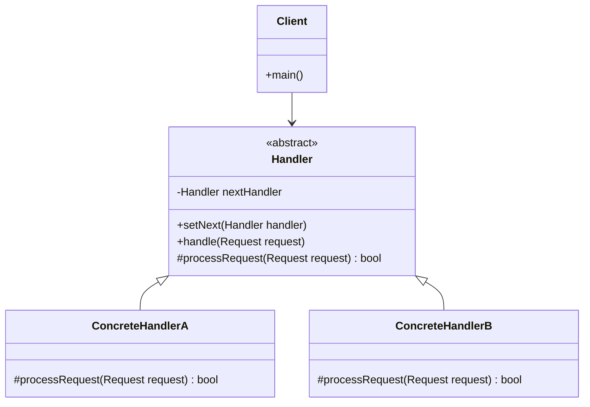

# Chain of Responsibility Pattern - Request Handling Pipelines

In software development, we often need to process requests through a series of handlers, where each handler decides whether to process the request or pass it to the next handler.

**Example:** Authentication systems, logging frameworks, middleware pipelines, approval workflows, etc.

## What is Chain of Responsibility Pattern?

Chain of Responsibility Pattern is a behavioral design pattern that passes requests along a chain of handlers. Each handler decides either to process the request or pass it to the next handler in the chain.

It decouples sender from receiver and allows multiple objects to handle the request without the sender knowing which object will handle it.

## Class Diagram



## Implementation

### 1. Web Request Processing Pipeline

```java
// Request class
class HttpRequest {
    private String method;
    private String path;
    private Map<String, String> headers;
    private String body;
    private Map<String, Object> attributes;

    public HttpRequest(String method, String path) {
        this.method = method;
        this.path = path;
        this.headers = new HashMap<>();
        this.attributes = new HashMap<>();
    }

    // Getters and setters
    public String getMethod() { return method; }
    public String getPath() { return path; }
    public Map<String, String> getHeaders() { return headers; }
    public String getBody() { return body; }
    public void setBody(String body) { this.body = body; }
    public void setAttribute(String key, Object value) { attributes.put(key, value); }
    public Object getAttribute(String key) { return attributes.get(key); }

    public void addHeader(String name, String value) {
        headers.put(name, value);
    }
}

// Response class
class HttpResponse {
    private int status = 200;
    private Map<String, String> headers = new HashMap<>();
    private String body;

    public void setStatus(int status) { this.status = status; }
    public int getStatus() { return status; }
    public void addHeader(String name, String value) { headers.put(name, value); }
    public void setBody(String body) { this.body = body; }
    public String getBody() { return body; }
}

// Abstract handler
abstract class RequestHandler {
    protected RequestHandler nextHandler;

    public RequestHandler setNext(RequestHandler handler) {
        this.nextHandler = handler;
        return handler; // Return for chaining
    }

    public HttpResponse handle(HttpRequest request) {
        HttpResponse response = processRequest(request);

        if (response != null) {
            return response; // Request was handled
        }

        if (nextHandler != null) {
            return nextHandler.handle(request);
        }

        // No handler could process the request
        HttpResponse notFoundResponse = new HttpResponse();
        notFoundResponse.setStatus(404);
        notFoundResponse.setBody("Not Found");
        return notFoundResponse;
    }

    protected abstract HttpResponse processRequest(HttpRequest request);
}

// Concrete handlers
class AuthenticationHandler extends RequestHandler {
    @Override
    protected HttpResponse processRequest(HttpRequest request) {
        String authHeader = request.getHeaders().get("Authorization");

        if (authHeader == null || authHeader.isEmpty()) {
            System.out.println("Authentication failed: No auth header");
            HttpResponse response = new HttpResponse();
            response.setStatus(401);
            response.setBody("Authentication required");
            return response;
        }

        // Simple token validation
        if (!authHeader.startsWith("Bearer valid-token")) {
            System.out.println("Authentication failed: Invalid token");
            HttpResponse response = new HttpResponse();
            response.setStatus(401);
            response.setBody("Invalid token");
            return response;
        }

        System.out.println("Authentication successful");
        request.setAttribute("user", "authenticated-user");
        return null; // Continue to next handler
    }
}

class AuthorizationHandler extends RequestHandler {
    @Override
    protected HttpResponse processRequest(HttpRequest request) {
        Object user = request.getAttribute("user");

        if (user == null) {
            System.out.println("Authorization failed: No authenticated user");
            HttpResponse response = new HttpResponse();
            response.setStatus(403);
            response.setBody("Forbidden");
            return response;
        }

        // Check if user has permission for this path
        if (request.getPath().startsWith("/admin/") && !"admin-user".equals(user)) {
            System.out.println("Authorization failed: Insufficient permissions");
            HttpResponse response = new HttpResponse();
            response.setStatus(403);
            response.setBody("Insufficient permissions");
            return response;
        }

        System.out.println("Authorization successful");
        return null; // Continue to next handler
    }
}

class RateLimitHandler extends RequestHandler {
    private Map<String, Integer> requestCounts = new HashMap<>();
    private static final int MAX_REQUESTS = 5;

    @Override
    protected HttpResponse processRequest(HttpRequest request) {
        String clientId = request.getHeaders().getOrDefault("Client-ID", "anonymous");

        int count = requestCounts.getOrDefault(clientId, 0) + 1;
        requestCounts.put(clientId, count);

        if (count > MAX_REQUESTS) {
            System.out.println("Rate limit exceeded for client: " + clientId);
            HttpResponse response = new HttpResponse();
            response.setStatus(429);
            response.setBody("Too Many Requests");
            return response;
        }

        System.out.println("Rate limit check passed for client: " + clientId);
        return null; // Continue to next handler
    }
}

class BusinessLogicHandler extends RequestHandler {
    @Override
    protected HttpResponse processRequest(HttpRequest request) {
        System.out.println("Processing business logic for: " + request.getPath());

        HttpResponse response = new HttpResponse();
        response.setBody("Success: Processed " + request.getPath());
        return response;
    }
}

// Usage Example
class WebRequestExample {
    public static void main(String[] args) {
        // Build the chain
        RequestHandler chain = new AuthenticationHandler();
        chain.setNext(new AuthorizationHandler())
             .setNext(new RateLimitHandler())
             .setNext(new BusinessLogicHandler());

        // Test successful request
        System.out.println("=== Test 1: Valid Request ===");
        HttpRequest request1 = new HttpRequest("GET", "/api/data");
        request1.addHeader("Authorization", "Bearer valid-token-123");
        request1.addHeader("Client-ID", "client-1");

        HttpResponse response1 = chain.handle(request1);
        System.out.println("Response: " + response1.getStatus() + " - " + response1.getBody());

        // Test authentication failure
        System.out.println("\n=== Test 2: No Auth Header ===");
        HttpRequest request2 = new HttpRequest("GET", "/api/data");

        HttpResponse response2 = chain.handle(request2);
        System.out.println("Response: " + response2.getStatus() + " - " + response2.getBody());

        // Test rate limiting
        System.out.println("\n=== Test 3: Rate Limiting ===");
        for (int i = 1; i <= 7; i++) {
            HttpRequest request = new HttpRequest("GET", "/api/data");
            request.addHeader("Authorization", "Bearer valid-token-123");
            request.addHeader("Client-ID", "client-2");

            HttpResponse response = chain.handle(request);
            System.out.println("Request " + i + ": " + response.getStatus());
        }
    }
}
```

### 2. Support Ticket System

```java
// Support ticket
class SupportTicket {
    private int id;
    private String type;
    private int priority;
    private String description;
    private String status;

    public SupportTicket(int id, String type, int priority, String description) {
        this.id = id;
        this.type = type;
        this.priority = priority;
        this.description = description;
        this.status = "NEW";
    }

    // Getters and setters
    public int getId() { return id; }
    public String getType() { return type; }
    public int getPriority() { return priority; }
    public String getDescription() { return description; }
    public String getStatus() { return status; }
    public void setStatus(String status) { this.status = status; }
}

// Abstract support handler
abstract class SupportHandler {
    protected SupportHandler nextHandler;

    public SupportHandler setNext(SupportHandler handler) {
        this.nextHandler = handler;
        return handler;
    }

    public void handleTicket(SupportTicket ticket) {
        if (canHandle(ticket)) {
            process(ticket);
        } else if (nextHandler != null) {
            nextHandler.handleTicket(ticket);
        } else {
            System.out.println("No handler available for ticket: " + ticket.getId());
            ticket.setStatus("UNHANDLED");
        }
    }

    protected abstract boolean canHandle(SupportTicket ticket);
    protected abstract void process(SupportTicket ticket);
}

// Concrete handlers
class Level1SupportHandler extends SupportHandler {
    @Override
    protected boolean canHandle(SupportTicket ticket) {
        return ticket.getPriority() <= 2 && "GENERAL".equals(ticket.getType());
    }

    @Override
    protected void process(SupportTicket ticket) {
        System.out.println("Level 1 Support handling ticket: " + ticket.getId());
        ticket.setStatus("RESOLVED_L1");
    }
}

class Level2SupportHandler extends SupportHandler {
    @Override
    protected boolean canHandle(SupportTicket ticket) {
        return ticket.getPriority() <= 4 &&
               ("TECHNICAL".equals(ticket.getType()) || "BILLING".equals(ticket.getType()));
    }

    @Override
    protected void process(SupportTicket ticket) {
        System.out.println("Level 2 Support handling ticket: " + ticket.getId());
        ticket.setStatus("RESOLVED_L2");
    }
}

class Level3SupportHandler extends SupportHandler {
    @Override
    protected boolean canHandle(SupportTicket ticket) {
        return ticket.getPriority() == 5 || "CRITICAL".equals(ticket.getType());
    }

    @Override
    protected void process(SupportTicket ticket) {
        System.out.println("Level 3 Support handling ticket: " + ticket.getId());
        ticket.setStatus("RESOLVED_L3");
    }
}

// Usage
class SupportTicketExample {
    public static void main(String[] args) {
        // Build support chain
        SupportHandler supportChain = new Level1SupportHandler();
        supportChain.setNext(new Level2SupportHandler())
                   .setNext(new Level3SupportHandler());

        // Test different tickets
        SupportTicket[] tickets = {
            new SupportTicket(1, "GENERAL", 1, "Password reset"),
            new SupportTicket(2, "TECHNICAL", 3, "Server issues"),
            new SupportTicket(3, "CRITICAL", 5, "System down"),
            new SupportTicket(4, "UNKNOWN", 2, "Strange issue")
        };

        for (SupportTicket ticket : tickets) {
            System.out.println("Processing ticket: " + ticket.getId() +
                             " (" + ticket.getType() + ", Priority: " + ticket.getPriority() + ")");
            supportChain.handleTicket(ticket);
            System.out.println("Final status: " + ticket.getStatus() + "\n");
        }
    }
}
```

## Test Code

```java
import org.junit.jupiter.api.Test;
import static org.junit.jupiter.api.Assertions.*;

class ChainOfResponsibilityPatternTest {

    @Test
    void testSuccessfulAuthentication() {
        RequestHandler chain = new AuthenticationHandler();
        chain.setNext(new BusinessLogicHandler());

        HttpRequest request = new HttpRequest("GET", "/api/test");
        request.addHeader("Authorization", "Bearer valid-token-123");

        HttpResponse response = chain.handle(request);
        assertEquals(200, response.getStatus());
        assertTrue(response.getBody().contains("Success"));
    }

    @Test
    void testAuthenticationFailure() {
        RequestHandler chain = new AuthenticationHandler();
        chain.setNext(new BusinessLogicHandler());

        HttpRequest request = new HttpRequest("GET", "/api/test");
        // No authorization header

        HttpResponse response = chain.handle(request);
        assertEquals(401, response.getStatus());
        assertEquals("Authentication required", response.getBody());
    }

    @Test
    void testSupportTicketRouting() {
        SupportHandler chain = new Level1SupportHandler();
        chain.setNext(new Level2SupportHandler())
             .setNext(new Level3SupportHandler());

        // Level 1 ticket
        SupportTicket ticket1 = new SupportTicket(1, "GENERAL", 1, "Simple question");
        chain.handleTicket(ticket1);
        assertEquals("RESOLVED_L1", ticket1.getStatus());

        // Level 2 ticket
        SupportTicket ticket2 = new SupportTicket(2, "TECHNICAL", 3, "Technical issue");
        chain.handleTicket(ticket2);
        assertEquals("RESOLVED_L2", ticket2.getStatus());

        // Level 3 ticket
        SupportTicket ticket3 = new SupportTicket(3, "CRITICAL", 5, "Critical issue");
        chain.handleTicket(ticket3);
        assertEquals("RESOLVED_L3", ticket3.getStatus());
    }

    @Test
    void testUnhandledRequest() {
        SupportHandler chain = new Level1SupportHandler();

        SupportTicket ticket = new SupportTicket(1, "UNKNOWN", 10, "Weird issue");
        chain.handleTicket(ticket);
        assertEquals("UNHANDLED", ticket.getStatus());
    }

    @Test
    void testChainOrdering() {
        // Test that handlers are called in order
        StringBuilder callOrder = new StringBuilder();

        RequestHandler handler1 = new RequestHandler() {
            @Override
            protected HttpResponse processRequest(HttpRequest request) {
                callOrder.append("1");
                return null; // Continue chain
            }
        };

        RequestHandler handler2 = new RequestHandler() {
            @Override
            protected HttpResponse processRequest(HttpRequest request) {
                callOrder.append("2");
                HttpResponse response = new HttpResponse();
                response.setBody("Handled by 2");
                return response; // Stop chain
            }
        };

        RequestHandler handler3 = new RequestHandler() {
            @Override
            protected HttpResponse processRequest(HttpRequest request) {
                callOrder.append("3");
                return null;
            }
        };

        handler1.setNext(handler2).setNext(handler3);

        HttpRequest request = new HttpRequest("GET", "/test");
        HttpResponse response = handler1.handle(request);

        assertEquals("12", callOrder.toString()); // Handler 3 should not be called
        assertEquals("Handled by 2", response.getBody());
    }
}
```

## Real-World Examples

### 1. **Web Frameworks**

- **Servlet Filters**: Java EE filter chains
- **Express.js Middleware**: Node.js request processing
- **Spring Security**: Authentication and authorization chains
- **ASP.NET Core Middleware**: Request pipeline processing

### 2. **Enterprise Applications**

- **Approval Workflows**: Multi-level approval systems
- **Exception Handling**: Error processing hierarchies
- **Message Processing**: Event handling chains
- **Validation**: Input validation pipelines

### 3. **System Software**

- **Operating Systems**: System call handling
- **Network Protocols**: Packet processing layers
- **Compilers**: Parse tree processing
- **Database Systems**: Query optimization phases

## Pros and Cons

| **Pros**                                                                     | **Cons**                                                     |
| ---------------------------------------------------------------------------- | ------------------------------------------------------------ |
| ✅ **Decoupling**: Sender doesn't know which handler will process request    | ❌ **Performance**: Long chains can impact performance       |
| ✅ **Flexibility**: Easy to add/remove handlers dynamically                  | ❌ **Debugging**: Hard to track request flow through chain   |
| ✅ **Single Responsibility**: Each handler has one responsibility            | ❌ **No Guarantee**: Request might not be handled            |
| ✅ **Open/Closed**: Easy to add new handlers without modifying existing code | ❌ **Chain Management**: Need to maintain proper chain order |

## Best Practices

### ⚠️ **Warnings & Considerations**

1. **Chain Order**: Order of handlers matters - place most specific first
2. **Performance**: Long chains can cause performance issues
3. **Error Handling**: Handle cases where no handler can process the request
4. **Testing**: Test each handler individually and the complete chain
5. **Documentation**: Clearly document the chain structure and flow

### 💡 **When to Use Chain of Responsibility Pattern**

✅ **Use When:**

- Multiple objects can handle a request
- You want to decouple sender from receiver
- The set of handlers can change dynamically
- You want to specify handlers at runtime

❌ **Avoid When:**

- Only one object can handle the request
- Performance is critical and chains are long
- The handling logic is simple and doesn't warrant the complexity
- The chain structure rarely changes

The Chain of Responsibility pattern is essential for building flexible request processing systems where multiple handlers need to process requests in a decoupled manner.
