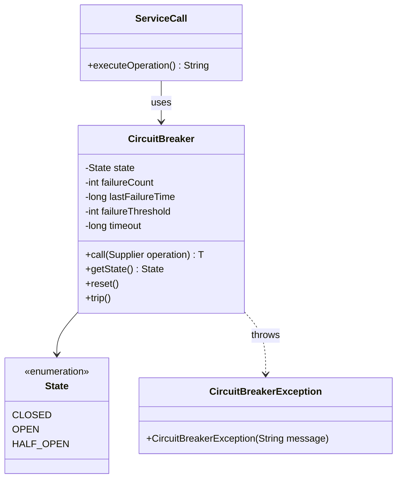

# Circuit Breaker Pattern - Preventing Cascading Failures

In distributed systems, we often need to protect services from cascading failures when external dependencies become unavailable or slow.

**Example:** Microservices calling other services, database connections, third-party APIs, external web services, etc.

Direct calls to failing services can cause timeouts, resource exhaustion, and cascading failures throughout the system.

This is where the **Circuit Breaker Design Pattern** comes into play.

It's a fundamental resilience pattern that prevents cascading failures and is essential for building robust distributed systems.

## What is Circuit Breaker Pattern?

Circuit Breaker Pattern is a design pattern that prevents an application from repeatedly trying to execute an operation that's likely to fail, allowing it to continue without waiting for the fault to be fixed or wasting CPU cycles.

It acts like an electrical circuit breaker, monitoring calls to external services and "tripping" when failure rates exceed a threshold.

The pattern promotes system resilience by failing fast and providing fallback mechanisms during service degradation.

## Class Diagram



## Implementation

### 1. Basic Circuit Breaker Implementation

```java
import java.util.concurrent.*;
import java.util.concurrent.atomic.*;
import java.util.function.Supplier;
import java.time.Instant;
import java.time.Duration;

// Circuit Breaker Exception
class CircuitBreakerException extends RuntimeException {
    public CircuitBreakerException(String message) {
        super(message);
    }

    public CircuitBreakerException(String message, Throwable cause) {
        super(message, cause);
    }
}

// Circuit Breaker States
enum CircuitBreakerState {
    CLOSED,    // Normal operation
    OPEN,      // Failing, reject all calls
    HALF_OPEN  // Testing if service recovered
}

// Basic Circuit Breaker Implementation
class CircuitBreaker {
    private final String name;
    private final int failureThreshold;
    private final long timeoutDuration;
    private final int maxRetryAttempts;

    private volatile CircuitBreakerState state = CircuitBreakerState.CLOSED;
    private final AtomicInteger failureCount = new AtomicInteger(0);
    private final AtomicInteger successCount = new AtomicInteger(0);
    private volatile long lastFailureTime = 0;
    private final AtomicInteger halfOpenAttempts = new AtomicInteger(0);

    // Metrics
    private final AtomicLong totalCalls = new AtomicLong(0);
    private final AtomicLong totalFailures = new AtomicLong(0);
    private final AtomicLong totalSuccesses = new AtomicLong(0);
    private final AtomicLong rejectedCalls = new AtomicLong(0);

    public CircuitBreaker(String name, int failureThreshold, long timeoutDuration, int maxRetryAttempts) {
        this.name = name;
        this.failureThreshold = failureThreshold;
        this.timeoutDuration = timeoutDuration;
        this.maxRetryAttempts = maxRetryAttempts;
    }

    public <T> T call(Supplier<T> operation) throws CircuitBreakerException {
        totalCalls.incrementAndGet();

        if (state == CircuitBreakerState.OPEN) {
            if (shouldAttemptReset()) {
                setState(CircuitBreakerState.HALF_OPEN);
                System.out.println("Circuit breaker " + name + " transitioning to HALF_OPEN");
            } else {
                rejectedCalls.incrementAndGet();
                throw new CircuitBreakerException("Circuit breaker " + name + " is OPEN - rejecting call");
            }
        }

        try {
            T result = operation.get();
            onSuccess();
            return result;
        } catch (Exception e) {
            onFailure();
            throw new CircuitBreakerException("Operation failed in circuit breaker " + name, e);
        }
    }

    private void onSuccess() {
        successCount.incrementAndGet();
        totalSuccesses.incrementAndGet();

        if (state == CircuitBreakerState.HALF_OPEN) {
            if (successCount.get() >= maxRetryAttempts) {
                setState(CircuitBreakerState.CLOSED);
                reset();
                System.out.println("Circuit breaker " + name + " recovered - transitioning to CLOSED");
            }
        } else if (state == CircuitBreakerState.CLOSED) {
            failureCount.set(0);
        }
    }

    private void onFailure() {
        failureCount.incrementAndGet();
        totalFailures.incrementAndGet();
        lastFailureTime = System.currentTimeMillis();

        if (state == CircuitBreakerState.HALF_OPEN) {
            setState(CircuitBreakerState.OPEN);
            System.out.println("Circuit breaker " + name + " failed during HALF_OPEN - back to OPEN");
        } else if (state == CircuitBreakerState.CLOSED && failureCount.get() >= failureThreshold) {
            setState(CircuitBreakerState.OPEN);
            System.out.println("Circuit breaker " + name + " tripped - transitioning to OPEN");
        }
    }

    private boolean shouldAttemptReset() {
        return (System.currentTimeMillis() - lastFailureTime) >= timeoutDuration;
    }

    private void setState(CircuitBreakerState newState) {
        this.state = newState;
        if (newState == CircuitBreakerState.HALF_OPEN) {
            halfOpenAttempts.set(0);
            successCount.set(0);
        }
    }

    public void reset() {
        setState(CircuitBreakerState.CLOSED);
        failureCount.set(0);
        successCount.set(0);
        lastFailureTime = 0;
        System.out.println("Circuit breaker " + name + " manually reset");
    }

    public void trip() {
        setState(CircuitBreakerState.OPEN);
        lastFailureTime = System.currentTimeMillis();
        System.out.println("Circuit breaker " + name + " manually tripped");
    }

    // Getters
    public CircuitBreakerState getState() { return state; }
    public String getName() { return name; }
    public int getFailureCount() { return failureCount.get(); }
    public int getSuccessCount() { return successCount.get(); }
    public long getLastFailureTime() { return lastFailureTime; }

    // Metrics
    public CircuitBreakerMetrics getMetrics() {
        return new CircuitBreakerMetrics(
            name,
            state,
            totalCalls.get(),
            totalSuccesses.get(),
            totalFailures.get(),
            rejectedCalls.get(),
            failureCount.get()
        );
    }
}

// Metrics class
class CircuitBreakerMetrics {
    private final String name;
    private final CircuitBreakerState state;
    private final long totalCalls;
    private final long totalSuccesses;
    private final long totalFailures;
    private final long rejectedCalls;
    private final int currentFailureCount;

    public CircuitBreakerMetrics(String name, CircuitBreakerState state, long totalCalls,
                               long totalSuccesses, long totalFailures, long rejectedCalls,
                               int currentFailureCount) {
        this.name = name;
        this.state = state;
        this.totalCalls = totalCalls;
        this.totalSuccesses = totalSuccesses;
        this.totalFailures = totalFailures;
        this.rejectedCalls = rejectedCalls;
        this.currentFailureCount = currentFailureCount;
    }

    public double getFailureRate() {
        if (totalCalls == 0) return 0.0;
        return (double) totalFailures / totalCalls * 100.0;
    }

    public double getSuccessRate() {
        if (totalCalls == 0) return 0.0;
        return (double) totalSuccesses / totalCalls * 100.0;
    }

    @Override
    public String toString() {
        return String.format(
            "CircuitBreaker[%s] State=%s, Calls=%d, Success=%.1f%%, Failures=%.1f%%, Rejected=%d, CurrentFailures=%d",
            name, state, totalCalls, getSuccessRate(), getFailureRate(), rejectedCalls, currentFailureCount
        );
    }

    // Getters
    public String getName() { return name; }
    public CircuitBreakerState getState() { return state; }
    public long getTotalCalls() { return totalCalls; }
    public long getTotalSuccesses() { return totalSuccesses; }
    public long getTotalFailures() { return totalFailures; }
    public long getRejectedCalls() { return rejectedCalls; }
    public int getCurrentFailureCount() { return currentFailureCount; }
}

// Service interfaces for demonstration
interface ExternalService {
    String callService(String request);
    boolean isHealthy();
    void simulateFailure(boolean shouldFail);
}

// Mock external service
class MockExternalService implements ExternalService {
    private volatile boolean shouldFail = false;
    private final AtomicInteger callCount = new AtomicInteger(0);
    private final Random random = new Random();

    @Override
    public String callService(String request) {
        int count = callCount.incrementAndGet();

        // Simulate random latency
        try {
            Thread.sleep(random.nextInt(100) + 50);
        } catch (InterruptedException e) {
            Thread.currentThread().interrupt();
        }

        if (shouldFail) {
            throw new RuntimeException("External service is down (call #" + count + ")");
        }

        return "Response for request: " + request + " (call #" + count + ")";
    }

    @Override
    public boolean isHealthy() {
        return !shouldFail;
    }

    @Override
    public void simulateFailure(boolean shouldFail) {
        this.shouldFail = shouldFail;
        System.out.println("External service failure simulation: " + (shouldFail ? "ON" : "OFF"));
    }
}

// Protected service with circuit breaker
class ProtectedExternalService {
    private final ExternalService externalService;
    private final CircuitBreaker circuitBreaker;

    public ProtectedExternalService(ExternalService externalService, CircuitBreaker circuitBreaker) {
        this.externalService = externalService;
        this.circuitBreaker = circuitBreaker;
    }

    public String callWithProtection(String request) {
        try {
            return circuitBreaker.call(() -> externalService.callService(request));
        } catch (CircuitBreakerException e) {
            // Fallback logic
            return getFallbackResponse(request, e);
        }
    }

    private String getFallbackResponse(String request, CircuitBreakerException e) {
        String fallback = "FALLBACK: Service temporarily unavailable for request: " + request;
        System.out.println("Using fallback: " + e.getMessage());
        return fallback;
    }

    public CircuitBreakerMetrics getMetrics() {
        return circuitBreaker.getMetrics();
    }

    public void resetCircuitBreaker() {
        circuitBreaker.reset();
    }

    public void tripCircuitBreaker() {
        circuitBreaker.trip();
    }
}

// Usage Example
class CircuitBreakerExample {
    public static void main(String[] args) throws InterruptedException {
        System.out.println("=== Circuit Breaker Pattern Example ===");

        // Create mock service and circuit breaker
        MockExternalService externalService = new MockExternalService();
        CircuitBreaker circuitBreaker = new CircuitBreaker(
            "ExternalServiceCB",
            3,      // failure threshold
            5000,   // timeout duration (5 seconds)
            2       // max retry attempts in half-open
        );

        ProtectedExternalService protectedService = new ProtectedExternalService(
            externalService, circuitBreaker);

        // Test normal operation
        System.out.println("\n=== Normal Operation ===");
        testServiceCalls(protectedService, 5, false);

        // Simulate service failure
        System.out.println("\n=== Service Failure Simulation ===");
        externalService.simulateFailure(true);
        testServiceCalls(protectedService, 8, true);

        // Wait for circuit breaker timeout
        System.out.println("\n=== Waiting for Circuit Breaker Timeout ===");
        Thread.sleep(6000);

        // Service recovery
        System.out.println("\n=== Service Recovery ===");
        externalService.simulateFailure(false);
        testServiceCalls(protectedService, 5, false);

        // Final metrics
        System.out.println("\n=== Final Metrics ===");
        System.out.println(protectedService.getMetrics());
    }

    private static void testServiceCalls(ProtectedExternalService service, int numCalls, boolean expectFailures) {
        for (int i = 1; i <= numCalls; i++) {
            try {
                String response = service.callWithProtection("Request-" + i);
                System.out.println("Call " + i + ": " + response);
            } catch (Exception e) {
                System.out.println("Call " + i + " failed: " + e.getMessage());
            }

            // Small delay between calls
            try {
                Thread.sleep(200);
            } catch (InterruptedException e) {
                Thread.currentThread().interrupt();
                break;
            }
        }

        System.out.println("Current metrics: " + service.getMetrics());
    }
}
```

### 2. Advanced Circuit Breaker with Bulkhead Pattern

```java
// Advanced Circuit Breaker with configuration
class AdvancedCircuitBreaker {
    public static class Configuration {
        private int failureThreshold = 5;
        private long timeoutDuration = 60000; // 1 minute
        private int maxRetryAttempts = 3;
        private double slowCallDurationThreshold = 1000; // 1 second
        private int slowCallRateThreshold = 50; // 50%
        private int minimumNumberOfCalls = 10;
        private int slidingWindowSize = 100;

        // Builder pattern for configuration
        public Configuration failureThreshold(int threshold) {
            this.failureThreshold = threshold;
            return this;
        }

        public Configuration timeout(long duration) {
            this.timeoutDuration = duration;
            return this;
        }

        public Configuration maxRetries(int retries) {
            this.maxRetryAttempts = retries;
            return this;
        }

        public Configuration slowCallThreshold(double threshold) {
            this.slowCallDurationThreshold = threshold;
            return this;
        }

        public Configuration slowCallRateThreshold(int threshold) {
            this.slowCallRateThreshold = threshold;
            return this;
        }

        public Configuration minimumCalls(int calls) {
            this.minimumNumberOfCalls = calls;
            return this;
        }

        public Configuration slidingWindow(int size) {
            this.slidingWindowSize = size;
            return this;
        }

        // Getters
        public int getFailureThreshold() { return failureThreshold; }
        public long getTimeoutDuration() { return timeoutDuration; }
        public int getMaxRetryAttempts() { return maxRetryAttempts; }
        public double getSlowCallDurationThreshold() { return slowCallDurationThreshold; }
        public int getSlowCallRateThreshold() { return slowCallRateThreshold; }
        public int getMinimumNumberOfCalls() { return minimumNumberOfCalls; }
        public int getSlidingWindowSize() { return slidingWindowSize; }
    }

    // Call result tracking
    static class CallResult {
        private final boolean success;
        private final long duration;
        private final Instant timestamp;
        private final Throwable exception;

        public CallResult(boolean success, long duration, Throwable exception) {
            this.success = success;
            this.duration = duration;
            this.timestamp = Instant.now();
            this.exception = exception;
        }

        public boolean isSuccess() { return success; }
        public long getDuration() { return duration; }
        public Instant getTimestamp() { return timestamp; }
        public boolean isSlowCall(double threshold) { return duration > threshold; }
    }

    private final String name;
    private final Configuration config;
    private volatile CircuitBreakerState state = CircuitBreakerState.CLOSED;
    private volatile long lastFailureTime = 0;

    // Sliding window for call results
    private final CircularBuffer<CallResult> slidingWindow;
    private final AtomicInteger halfOpenSuccessCount = new AtomicInteger(0);

    public AdvancedCircuitBreaker(String name, Configuration config) {
        this.name = name;
        this.config = config;
        this.slidingWindow = new CircularBuffer<>(config.getSlidingWindowSize());
    }

    public <T> T call(Supplier<T> operation) throws CircuitBreakerException {
        if (state == CircuitBreakerState.OPEN) {
            if (shouldAttemptReset()) {
                transitionToHalfOpen();
            } else {
                throw new CircuitBreakerException("Circuit breaker " + name + " is OPEN");
            }
        }

        long startTime = System.currentTimeMillis();
        try {
            T result = operation.get();
            long duration = System.currentTimeMillis() - startTime;
            recordSuccess(duration);
            return result;
        } catch (Exception e) {
            long duration = System.currentTimeMillis() - startTime;
            recordFailure(duration, e);
            throw new CircuitBreakerException("Circuit breaker call failed", e);
        }
    }

    private void recordSuccess(long duration) {
        CallResult result = new CallResult(true, duration, null);
        slidingWindow.add(result);

        if (state == CircuitBreakerState.HALF_OPEN) {
            if (halfOpenSuccessCount.incrementAndGet() >= config.getMaxRetryAttempts()) {
                transitionToClosed();
            }
        } else if (state == CircuitBreakerState.CLOSED) {
            evaluateState();
        }
    }

    private void recordFailure(long duration, Throwable exception) {
        CallResult result = new CallResult(false, duration, exception);
        slidingWindow.add(result);
        lastFailureTime = System.currentTimeMillis();

        if (state == CircuitBreakerState.HALF_OPEN) {
            transitionToOpen();
        } else if (state == CircuitBreakerState.CLOSED) {
            evaluateState();
        }
    }

    private void evaluateState() {
        List<CallResult> recentCalls = slidingWindow.getAll();

        if (recentCalls.size() < config.getMinimumNumberOfCalls()) {
            return; // Not enough data
        }

        long failureCount = recentCalls.stream()
                .mapToLong(call -> call.isSuccess() ? 0 : 1)
                .sum();

        long slowCallCount = recentCalls.stream()
                .mapToLong(call -> call.isSlowCall(config.getSlowCallDurationThreshold()) ? 1 : 0)
                .sum();

        double failureRate = (double) failureCount / recentCalls.size() * 100;
        double slowCallRate = (double) slowCallCount / recentCalls.size() * 100;

        if (failureRate >= config.getFailureThreshold() ||
            slowCallRate >= config.getSlowCallRateThreshold()) {
            transitionToOpen();
        }
    }

    private boolean shouldAttemptReset() {
        return (System.currentTimeMillis() - lastFailureTime) >= config.getTimeoutDuration();
    }

    private void transitionToOpen() {
        state = CircuitBreakerState.OPEN;
        System.out.println("Circuit breaker " + name + " transitioned to OPEN");
    }

    private void transitionToHalfOpen() {
        state = CircuitBreakerState.HALF_OPEN;
        halfOpenSuccessCount.set(0);
        System.out.println("Circuit breaker " + name + " transitioned to HALF_OPEN");
    }

    private void transitionToClosed() {
        state = CircuitBreakerState.CLOSED;
        System.out.println("Circuit breaker " + name + " transitioned to CLOSED");
    }

    // Metrics
    public AdvancedMetrics getMetrics() {
        List<CallResult> recentCalls = slidingWindow.getAll();
        return new AdvancedMetrics(name, state, recentCalls, config);
    }

    // Getters
    public CircuitBreakerState getState() { return state; }
    public String getName() { return name; }
}

// Advanced metrics
class AdvancedMetrics {
    private final String name;
    private final CircuitBreakerState state;
    private final List<CallResult> recentCalls;
    private final AdvancedCircuitBreaker.Configuration config;

    public AdvancedMetrics(String name, CircuitBreakerState state,
                          List<CallResult> recentCalls,
                          AdvancedCircuitBreaker.Configuration config) {
        this.name = name;
        this.state = state;
        this.recentCalls = new ArrayList<>(recentCalls);
        this.config = config;
    }

    public double getFailureRate() {
        if (recentCalls.isEmpty()) return 0.0;
        long failures = recentCalls.stream().mapToLong(call -> call.isSuccess() ? 0 : 1).sum();
        return (double) failures / recentCalls.size() * 100.0;
    }

    public double getSlowCallRate() {
        if (recentCalls.isEmpty()) return 0.0;
        long slowCalls = recentCalls.stream()
                .mapToLong(call -> call.isSlowCall(config.getSlowCallDurationThreshold()) ? 1 : 0)
                .sum();
        return (double) slowCalls / recentCalls.size() * 100.0;
    }

    public double getAverageResponseTime() {
        if (recentCalls.isEmpty()) return 0.0;
        return recentCalls.stream().mapToLong(CallResult::getDuration).average().orElse(0.0);
    }

    public long getTotalCalls() {
        return recentCalls.size();
    }

    @Override
    public String toString() {
        return String.format(
            "AdvancedCircuitBreaker[%s] State=%s, Calls=%d, FailureRate=%.1f%%, SlowCallRate=%.1f%%, AvgResponseTime=%.1fms",
            name, state, getTotalCalls(), getFailureRate(), getSlowCallRate(), getAverageResponseTime()
        );
    }
}

// Circular buffer for sliding window
class CircularBuffer<T> {
    private final Object[] buffer;
    private final int capacity;
    private volatile int head = 0;
    private volatile int size = 0;

    public CircularBuffer(int capacity) {
        this.capacity = capacity;
        this.buffer = new Object[capacity];
    }

    public synchronized void add(T item) {
        buffer[head] = item;
        head = (head + 1) % capacity;
        if (size < capacity) {
            size++;
        }
    }

    @SuppressWarnings("unchecked")
    public synchronized List<T> getAll() {
        List<T> result = new ArrayList<>(size);
        for (int i = 0; i < size; i++) {
            int index = (head - size + i + capacity) % capacity;
            result.add((T) buffer[index]);
        }
        return result;
    }

    public int size() {
        return size;
    }
}

// Circuit Breaker Registry
class CircuitBreakerRegistry {
    private final Map<String, AdvancedCircuitBreaker> circuitBreakers = new ConcurrentHashMap<>();

    public AdvancedCircuitBreaker getOrCreate(String name, AdvancedCircuitBreaker.Configuration config) {
        return circuitBreakers.computeIfAbsent(name,
            n -> new AdvancedCircuitBreaker(n, config));
    }

    public AdvancedCircuitBreaker get(String name) {
        return circuitBreakers.get(name);
    }

    public Map<String, AdvancedMetrics> getAllMetrics() {
        return circuitBreakers.entrySet().stream()
                .collect(Collectors.toMap(
                    Map.Entry::getKey,
                    entry -> entry.getValue().getMetrics()
                ));
    }

    public void printAllMetrics() {
        System.out.println("\n=== Circuit Breaker Registry Metrics ===");
        getAllMetrics().forEach((name, metrics) ->
            System.out.println(metrics));
    }
}

// Service with multiple circuit breakers (Bulkhead pattern)
class ResilientService {
    private final CircuitBreakerRegistry registry;

    public ResilientService() {
        this.registry = new CircuitBreakerRegistry();
    }

    public String callDatabaseService(String query) {
        AdvancedCircuitBreaker cb = registry.getOrCreate("database",
            new AdvancedCircuitBreaker.Configuration()
                .failureThreshold(5)
                .timeout(30000)
                .slowCallThreshold(1000));

        return cb.call(() -> {
            // Simulate database call
            simulateLatency(500, 2000);
            return "Database result for: " + query;
        });
    }

    public String callPaymentService(String paymentInfo) {
        AdvancedCircuitBreaker cb = registry.getOrCreate("payment",
            new AdvancedCircuitBreaker.Configuration()
                .failureThreshold(3)
                .timeout(60000)
                .slowCallThreshold(2000));

        return cb.call(() -> {
            // Simulate payment service call
            simulateLatency(200, 1500);
            return "Payment processed: " + paymentInfo;
        });
    }

    public String callNotificationService(String message) {
        AdvancedCircuitBreaker cb = registry.getOrCreate("notification",
            new AdvancedCircuitBreaker.Configuration()
                .failureThreshold(10)
                .timeout(10000)
                .slowCallThreshold(500));

        return cb.call(() -> {
            // Simulate notification service call
            simulateLatency(100, 300);
            return "Notification sent: " + message;
        });
    }

    private void simulateLatency(int minMs, int maxMs) {
        try {
            int delay = new Random().nextInt(maxMs - minMs) + minMs;
            Thread.sleep(delay);
        } catch (InterruptedException e) {
            Thread.currentThread().interrupt();
        }
    }

    public void printMetrics() {
        registry.printAllMetrics();
    }
}

// Advanced Circuit Breaker Example
class AdvancedCircuitBreakerExample {
    public static void main(String[] args) throws InterruptedException {
        System.out.println("=== Advanced Circuit Breaker Pattern Example ===");

        ResilientService service = new ResilientService();

        // Test multiple services concurrently
        ExecutorService executor = Executors.newFixedThreadPool(10);

        System.out.println("\n=== Testing Multiple Services ===");

        // Submit various service calls
        for (int i = 0; i < 50; i++) {
            final int callId = i;

            executor.submit(() -> {
                try {
                    if (callId % 3 == 0) {
                        service.callDatabaseService("Query-" + callId);
                    } else if (callId % 3 == 1) {
                        service.callPaymentService("Payment-" + callId);
                    } else {
                        service.callNotificationService("Message-" + callId);
                    }
                } catch (Exception e) {
                    System.out.println("Call " + callId + " failed: " + e.getMessage());
                }
            });

            Thread.sleep(100); // Space out calls
        }

        Thread.sleep(5000); // Wait for calls to complete

        service.printMetrics();

        executor.shutdown();
    }
}
```

## Test Code

```java
import org.junit.jupiter.api.Test;
import org.junit.jupiter.api.BeforeEach;
import static org.junit.jupiter.api.Assertions.*;

class CircuitBreakerPatternTest {
    private MockExternalService externalService;
    private CircuitBreaker circuitBreaker;
    private ProtectedExternalService protectedService;

    @BeforeEach
    void setUp() {
        externalService = new MockExternalService();
        circuitBreaker = new CircuitBreaker("TestCB", 3, 1000, 2);
        protectedService = new ProtectedExternalService(externalService, circuitBreaker);
    }

    @Test
    void testNormalOperation() {
        // Test successful calls
        String result = protectedService.callWithProtection("test");
        assertTrue(result.contains("Response for request: test"));
        assertEquals(CircuitBreakerState.CLOSED, circuitBreaker.getState());
    }

    @Test
    void testCircuitBreakerTripping() {
        // Simulate service failures
        externalService.simulateFailure(true);

        // Make enough calls to trip the circuit breaker
        for (int i = 0; i < 5; i++) {
            String result = protectedService.callWithProtection("test" + i);
            assertTrue(result.contains("FALLBACK") || result.contains("Response"));
        }

        // Circuit breaker should be open
        assertEquals(CircuitBreakerState.OPEN, circuitBreaker.getState());
    }

    @Test
    void testCircuitBreakerRecovery() throws InterruptedException {
        // Trip the circuit breaker
        externalService.simulateFailure(true);
        for (int i = 0; i < 4; i++) {
            protectedService.callWithProtection("test" + i);
        }

        assertEquals(CircuitBreakerState.OPEN, circuitBreaker.getState());

        // Wait for timeout
        Thread.sleep(1100);

        // Service recovery
        externalService.simulateFailure(false);

        // Next calls should transition to half-open and then closed
        protectedService.callWithProtection("recovery1");
        protectedService.callWithProtection("recovery2");

        assertEquals(CircuitBreakerState.CLOSED, circuitBreaker.getState());
    }

    @Test
    void testManualReset() {
        // Trip the circuit breaker
        externalService.simulateFailure(true);
        for (int i = 0; i < 4; i++) {
            protectedService.callWithProtection("test" + i);
        }

        assertEquals(CircuitBreakerState.OPEN, circuitBreaker.getState());

        // Manual reset
        protectedService.resetCircuitBreaker();
        assertEquals(CircuitBreakerState.CLOSED, circuitBreaker.getState());
    }

    @Test
    void testManualTrip() {
        assertEquals(CircuitBreakerState.CLOSED, circuitBreaker.getState());

        // Manual trip
        protectedService.tripCircuitBreaker();
        assertEquals(CircuitBreakerState.OPEN, circuitBreaker.getState());

        // Should reject calls
        String result = protectedService.callWithProtection("test");
        assertTrue(result.contains("FALLBACK"));
    }

    @Test
    void testMetrics() {
        // Make some successful calls
        for (int i = 0; i < 3; i++) {
            protectedService.callWithProtection("success" + i);
        }

        // Make some failed calls
        externalService.simulateFailure(true);
        for (int i = 0; i < 2; i++) {
            protectedService.callWithProtection("failure" + i);
        }

        CircuitBreakerMetrics metrics = protectedService.getMetrics();
        assertEquals(5, metrics.getTotalCalls());
        assertEquals(3, metrics.getTotalSuccesses());
        assertEquals(2, metrics.getTotalFailures());
        assertEquals(40.0, metrics.getFailureRate(), 0.1);
        assertEquals(60.0, metrics.getSuccessRate(), 0.1);
    }

    @Test
    void testAdvancedCircuitBreaker() {
        AdvancedCircuitBreaker.Configuration config = new AdvancedCircuitBreaker.Configuration()
                .failureThreshold(50) // 50% failure rate
                .minimumCalls(5)
                .timeout(1000);

        AdvancedCircuitBreaker advancedCB = new AdvancedCircuitBreaker("TestAdvanced", config);

        // Test with mixed success/failure calls
        for (int i = 0; i < 10; i++) {
            try {
                if (i < 3) {
                    // Successful calls
                    advancedCB.call(() -> "Success " + i);
                } else {
                    // Failed calls
                    advancedCB.call(() -> {
                        throw new RuntimeException("Failure " + i);
                    });
                }
            } catch (CircuitBreakerException e) {
                // Expected for failures
            }
        }

        AdvancedMetrics metrics = advancedCB.getMetrics();
        assertTrue(metrics.getFailureRate() > 50.0);
        assertEquals(CircuitBreakerState.OPEN, advancedCB.getState());
    }

    @Test
    void testCircularBuffer() {
        CircularBuffer<String> buffer = new CircularBuffer<>(3);

        // Add items
        buffer.add("A");
        buffer.add("B");
        buffer.add("C");

        List<String> items = buffer.getAll();
        assertEquals(3, items.size());
        assertTrue(items.contains("A"));
        assertTrue(items.contains("B"));
        assertTrue(items.contains("C"));

        // Add more items (should overwrite oldest)
        buffer.add("D");
        items = buffer.getAll();
        assertEquals(3, items.size());
        assertFalse(items.contains("A")); // Should be overwritten
        assertTrue(items.contains("D"));
    }

    @Test
    void testCircuitBreakerRegistry() {
        CircuitBreakerRegistry registry = new CircuitBreakerRegistry();

        AdvancedCircuitBreaker.Configuration config = new AdvancedCircuitBreaker.Configuration();

        // Get or create circuit breakers
        AdvancedCircuitBreaker cb1 = registry.getOrCreate("service1", config);
        AdvancedCircuitBreaker cb2 = registry.getOrCreate("service2", config);
        AdvancedCircuitBreaker cb1Again = registry.getOrCreate("service1", config);

        assertNotNull(cb1);
        assertNotNull(cb2);
        assertSame(cb1, cb1Again); // Should return same instance
        assertNotSame(cb1, cb2);

        // Test metrics collection
        Map<String, AdvancedMetrics> allMetrics = registry.getAllMetrics();
        assertEquals(2, allMetrics.size());
        assertTrue(allMetrics.containsKey("service1"));
        assertTrue(allMetrics.containsKey("service2"));
    }

    @Test
    void testResilientService() {
        ResilientService service = new ResilientService();

        // Test different service calls
        assertDoesNotThrow(() -> {
            service.callDatabaseService("SELECT * FROM users");
            service.callPaymentService("payment-123");
            service.callNotificationService("Hello World");
        });

        // Verify metrics are collected
        assertDoesNotThrow(() -> service.printMetrics());
    }

    @Test
    void testSlowCallDetection() {
        AdvancedCircuitBreaker.Configuration config = new AdvancedCircuitBreaker.Configuration()
                .slowCallThreshold(100) // 100ms threshold
                .slowCallRateThreshold(50) // 50% slow call rate
                .minimumCalls(3);

        AdvancedCircuitBreaker cb = new AdvancedCircuitBreaker("SlowTest", config);

        // Make slow calls
        for (int i = 0; i < 5; i++) {
            try {
                cb.call(() -> {
                    try {
                        Thread.sleep(200); // Slow call
                    } catch (InterruptedException e) {
                        Thread.currentThread().interrupt();
                    }
                    return "Slow response";
                });
            } catch (Exception e) {
                // May fail due to slow calls
            }
        }

        AdvancedMetrics metrics = cb.getMetrics();
        assertTrue(metrics.getSlowCallRate() > 0);
        assertTrue(metrics.getAverageResponseTime() > 100);
    }
}
```

## Real-World Examples of Circuit Breaker Pattern

### 1. **Microservices Architecture**

- **Netflix Hystrix**: Circuit breaker library for distributed systems
- **Spring Cloud Circuit Breaker**: Integration with Resilience4j
- **Istio Service Mesh**: Circuit breakers at infrastructure level
- **Kong Gateway**: API gateway with circuit breaker policies

### 2. **Cloud Platforms**

- **AWS Application Load Balancer**: Circuit breaker for unhealthy targets
- **Google Cloud Endpoints**: Rate limiting and circuit breaking
- **Azure Service Fabric**: Resilience patterns for microservices
- **Kubernetes**: Circuit breaker implementations in ingress controllers

### 3. **Database Access**

- **Connection Pool Circuit Breakers**: Protect against database failures
- **Cache Circuit Breakers**: Fallback when cache services fail
- **Message Queue Circuit Breakers**: Prevent message broker overload
- **Search Service Circuit Breakers**: Elasticsearch/Solr protection

### 4. **Third-Party Integration**

- **Payment Gateway Circuit Breakers**: Handle payment service failures
- **Social Media API Circuit Breakers**: Rate limiting and fallbacks
- **Email Service Circuit Breakers**: SMTP service protection
- **Notification Service Circuit Breakers**: Push notification resilience

## Specific Examples:

**Netflix Hystrix**: Pioneer circuit breaker library for Java microservices.

**Resilience4j**: Modern fault tolerance library with circuit breaker.

**Spring Cloud Gateway**: Circuit breaker filters for API gateway.

**Akka Circuit Breaker**: Actor-based circuit breaker for Scala/Java.

**Polly (.NET)**: Resilience and transient-fault-handling library.

## Pros and Cons of Circuit Breaker Pattern

| **Pros**                                                      | **Cons**                                                      |
| ------------------------------------------------------------- | ------------------------------------------------------------- |
| ✅ **Prevents Cascading Failures**: Stops failure propagation | ❌ **Complexity**: Adds operational complexity to system      |
| ✅ **Fast Failure**: Immediate failure instead of waiting     | ❌ **Configuration**: Requires careful tuning of thresholds   |
| ✅ **Resource Protection**: Prevents resource exhaustion      | ❌ **False Positives**: May trip during temporary issues      |
| ✅ **Automatic Recovery**: Self-healing when service recovers | ❌ **Monitoring Overhead**: Requires comprehensive monitoring |
| ✅ **Graceful Degradation**: Enables fallback mechanisms      | ❌ **State Management**: Complex state transitions to handle  |

## Best Practices

### ⚠️ **Warnings & Considerations**

1. **Threshold Tuning**: Carefully tune failure thresholds based on service characteristics
2. **Timeout Configuration**: Set appropriate timeouts for different service types
3. **Fallback Strategy**: Always implement meaningful fallback responses
4. **Monitoring**: Monitor circuit breaker metrics and alerts
5. **Testing**: Test circuit breaker behavior under various failure scenarios

### 🏆 **Modern Alternatives & Enhancements**

- **Service Mesh**: Istio, Linkerd for infrastructure-level circuit breaking
- **Bulkhead Pattern**: Resource isolation with separate circuit breakers
- **Retry with Backoff**: Combine with exponential backoff strategies
- **Health Checks**: Integration with service health monitoring
- **Rate Limiting**: Combine with rate limiting for comprehensive protection

### 💡 **When to Use Circuit Breaker Pattern**

✅ **Use When:**

- Building distributed systems with external dependencies
- Need to prevent cascading failures across services
- Have services with varying reliability characteristics
- Want to implement graceful degradation strategies
- Need to protect against resource exhaustion

❌ **Avoid When:**

- Building simple monolithic applications
- External dependencies are highly reliable
- Failure rate tolerance is very low
- Monitoring and alerting infrastructure is insufficient
- Team lacks experience with distributed system patterns

The Circuit Breaker pattern is essential for building resilient distributed systems that can handle failures gracefully and prevent cascade effects across service boundaries.
