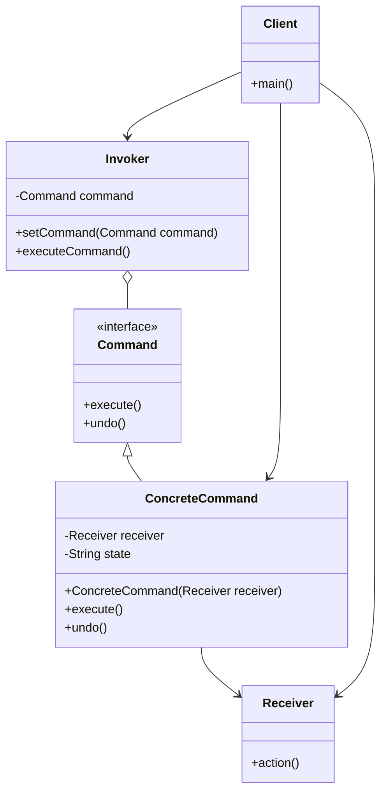

# Command Pattern - Request Encapsulation & Undo/Redo

In software development, we often need to parameterize objects with operations, queue operations, log requests, and support undo operations.

**Example:** GUI button actions, macro recording, undo/redo functionality, job queues, transaction processing, etc.

Direct coupling between invokers and receivers makes it difficult to parameterize, queue, log, or undo operations.

This is where the **Command Design Pattern** comes into play.

It's a fundamental behavioral pattern that encapsulates requests as objects and is essential for implementing undo/redo functionality and request queuing.

## What is Command Pattern?

Command Pattern is a behavioral design pattern that turns a request into a stand-alone object containing all information about the request. This transformation allows you to parameterize methods with different requests, delay or queue a request's execution, and support undoable operations.

The pattern encapsulates a request as an object, thereby letting you parameterize clients with different requests, queue or log requests, and support undoable operations.

It decouples the object that invokes the operation from the object that performs the operation.

## Class Diagram



## Implementation

### 1. Classic Command Implementation - Text Editor

```java
import java.util.*;

// Command interface
interface Command {
    void execute();
    void undo();
}

// Receiver - Text Editor
class TextEditor {
    private StringBuilder content = new StringBuilder();

    public void insertText(String text, int position) {
        content.insert(position, text);
        System.out.println("Inserted: '" + text + "' at position " + position);
    }

    public void deleteText(int position, int length) {
        if (position >= 0 && position + length <= content.length()) {
            content.delete(position, position + length);
            System.out.println("Deleted " + length + " characters from position " + position);
        }
    }

    public String getContent() {
        return content.toString();
    }

    public void clear() {
        content.setLength(0);
    }

    @Override
    public String toString() {
        return "Content: '" + content.toString() + "'";
    }
}

// Concrete Commands
class InsertTextCommand implements Command {
    private TextEditor editor;
    private String text;
    private int position;

    public InsertTextCommand(TextEditor editor, String text, int position) {
        this.editor = editor;
        this.text = text;
        this.position = position;
    }

    @Override
    public void execute() {
        editor.insertText(text, position);
    }

    @Override
    public void undo() {
        editor.deleteText(position, text.length());
    }
}

class DeleteTextCommand implements Command {
    private TextEditor editor;
    private int position;
    private int length;
    private String deletedText;

    public DeleteTextCommand(TextEditor editor, int position, int length) {
        this.editor = editor;
        this.position = position;
        this.length = length;
        // Store the text that will be deleted for undo
        String content = editor.getContent();
        if (position >= 0 && position + length <= content.length()) {
            this.deletedText = content.substring(position, position + length);
        }
    }

    @Override
    public void execute() {
        editor.deleteText(position, length);
    }

    @Override
    public void undo() {
        if (deletedText != null) {
            editor.insertText(deletedText, position);
        }
    }
}

// Invoker with Undo/Redo functionality
class EditorInvoker {
    private Stack<Command> undoStack = new Stack<>();
    private Stack<Command> redoStack = new Stack<>();

    public void executeCommand(Command command) {
        command.execute();
        undoStack.push(command);
        redoStack.clear(); // Clear redo stack when new command is executed
    }

    public void undo() {
        if (!undoStack.isEmpty()) {
            Command command = undoStack.pop();
            command.undo();
            redoStack.push(command);
            System.out.println("Undo performed");
        } else {
            System.out.println("Nothing to undo");
        }
    }

    public void redo() {
        if (!redoStack.isEmpty()) {
            Command command = redoStack.pop();
            command.execute();
            undoStack.push(command);
            System.out.println("Redo performed");
        } else {
            System.out.println("Nothing to redo");
        }
    }

    public boolean canUndo() {
        return !undoStack.isEmpty();
    }

    public boolean canRedo() {
        return !redoStack.isEmpty();
    }
}

// Usage Example
class TextEditorExample {
    public static void main(String[] args) {
        TextEditor editor = new TextEditor();
        EditorInvoker invoker = new EditorInvoker();

        // Execute commands
        invoker.executeCommand(new InsertTextCommand(editor, "Hello", 0));
        System.out.println(editor);

        invoker.executeCommand(new InsertTextCommand(editor, " World", 5));
        System.out.println(editor);

        invoker.executeCommand(new DeleteTextCommand(editor, 5, 6));
        System.out.println(editor);

        // Undo operations
        invoker.undo(); // Undo delete
        System.out.println(editor);

        invoker.undo(); // Undo second insert
        System.out.println(editor);

        // Redo operations
        invoker.redo(); // Redo second insert
        System.out.println(editor);
    }
}
```

### 2. Home Automation System

```java
// Receiver interfaces and implementations
interface Light {
    void turnOn();
    void turnOff();
    void dim(int level);
    boolean isOn();
    int getBrightness();
}

class LivingRoomLight implements Light {
    private boolean isOn = false;
    private int brightness = 0;

    @Override
    public void turnOn() {
        isOn = true;
        brightness = 100;
        System.out.println("Living room light turned ON");
    }

    @Override
    public void turnOff() {
        isOn = false;
        brightness = 0;
        System.out.println("Living room light turned OFF");
    }

    @Override
    public void dim(int level) {
        brightness = Math.max(0, Math.min(100, level));
        isOn = brightness > 0;
        System.out.println("Living room light dimmed to " + brightness + "%");
    }

    @Override
    public boolean isOn() { return isOn; }

    @Override
    public int getBrightness() { return brightness; }
}

interface Stereo {
    void turnOn();
    void turnOff();
    void setVolume(int volume);
    void setStation(String station);
}

class LivingRoomStereo implements Stereo {
    private boolean isOn = false;
    private int volume = 0;
    private String station = "";

    @Override
    public void turnOn() {
        isOn = true;
        System.out.println("Stereo turned ON");
    }

    @Override
    public void turnOff() {
        isOn = false;
        System.out.println("Stereo turned OFF");
    }

    @Override
    public void setVolume(int volume) {
        this.volume = Math.max(0, Math.min(100, volume));
        System.out.println("Stereo volume set to " + this.volume);
    }

    @Override
    public void setStation(String station) {
        this.station = station;
        System.out.println("Stereo tuned to " + station);
    }
}

// Command implementations for home automation
class LightOnCommand implements Command {
    private Light light;
    private int previousBrightness;

    public LightOnCommand(Light light) {
        this.light = light;
    }

    @Override
    public void execute() {
        previousBrightness = light.getBrightness();
        light.turnOn();
    }

    @Override
    public void undo() {
        if (previousBrightness == 0) {
            light.turnOff();
        } else {
            light.dim(previousBrightness);
        }
    }
}

class LightOffCommand implements Command {
    private Light light;
    private int previousBrightness;

    public LightOffCommand(Light light) {
        this.light = light;
    }

    @Override
    public void execute() {
        previousBrightness = light.getBrightness();
        light.turnOff();
    }

    @Override
    public void undo() {
        if (previousBrightness > 0) {
            light.dim(previousBrightness);
        }
    }
}

class LightDimCommand implements Command {
    private Light light;
    private int dimLevel;
    private int previousBrightness;

    public LightDimCommand(Light light, int dimLevel) {
        this.light = light;
        this.dimLevel = dimLevel;
    }

    @Override
    public void execute() {
        previousBrightness = light.getBrightness();
        light.dim(dimLevel);
    }

    @Override
    public void undo() {
        light.dim(previousBrightness);
    }
}

class StereoOnWithStationCommand implements Command {
    private Stereo stereo;
    private String station;
    private int volume;

    public StereoOnWithStationCommand(Stereo stereo, String station, int volume) {
        this.stereo = stereo;
        this.station = station;
        this.volume = volume;
    }

    @Override
    public void execute() {
        stereo.turnOn();
        stereo.setStation(station);
        stereo.setVolume(volume);
    }

    @Override
    public void undo() {
        stereo.turnOff();
    }
}

// Null Object Pattern for empty slots
class NoCommand implements Command {
    @Override
    public void execute() {
        // Do nothing
    }

    @Override
    public void undo() {
        // Do nothing
    }
}

// Macro Command - executes multiple commands
class MacroCommand implements Command {
    private Command[] commands;

    public MacroCommand(Command[] commands) {
        this.commands = commands;
    }

    @Override
    public void execute() {
        for (Command command : commands) {
            command.execute();
        }
    }

    @Override
    public void undo() {
        // Undo in reverse order
        for (int i = commands.length - 1; i >= 0; i--) {
            commands[i].undo();
        }
    }
}

// Remote Control Invoker
class RemoteControl {
    private Command[] onCommands;
    private Command[] offCommands;
    private Command undoCommand;

    public RemoteControl() {
        onCommands = new Command[7]; // 7 slots
        offCommands = new Command[7];

        Command noCommand = new NoCommand();
        for (int i = 0; i < 7; i++) {
            onCommands[i] = noCommand;
            offCommands[i] = noCommand;
        }
        undoCommand = noCommand;
    }

    public void setCommand(int slot, Command onCommand, Command offCommand) {
        onCommands[slot] = onCommand;
        offCommands[slot] = offCommand;
    }

    public void onButtonPressed(int slot) {
        onCommands[slot].execute();
        undoCommand = onCommands[slot];
    }

    public void offButtonPressed(int slot) {
        offCommands[slot].execute();
        undoCommand = offCommands[slot];
    }

    public void undoButtonPressed() {
        undoCommand.undo();
    }

    @Override
    public String toString() {
        StringBuilder sb = new StringBuilder();
        sb.append("\n------ Remote Control ------\n");
        for (int i = 0; i < onCommands.length; i++) {
            sb.append("[slot ").append(i).append("] ")
              .append(onCommands[i].getClass().getSimpleName())
              .append("    ")
              .append(offCommands[i].getClass().getSimpleName())
              .append("\n");
        }
        sb.append("[undo] ").append(undoCommand.getClass().getSimpleName()).append("\n");
        return sb.toString();
    }
}

// Usage Example
class HomeAutomationExample {
    public static void main(String[] args) {
        RemoteControl remote = new RemoteControl();

        // Create devices
        Light livingRoomLight = new LivingRoomLight();
        Stereo stereo = new LivingRoomStereo();

        // Create commands
        LightOnCommand livingRoomLightOn = new LightOnCommand(livingRoomLight);
        LightOffCommand livingRoomLightOff = new LightOffCommand(livingRoomLight);
        LightDimCommand livingRoomLightDim = new LightDimCommand(livingRoomLight, 50);

        StereoOnWithStationCommand stereoOnWithStation =
            new StereoOnWithStationCommand(stereo, "Classic Rock FM", 15);
        Command stereoOff = () -> { stereo.turnOff(); }; // Lambda command

        // Set up remote
        remote.setCommand(0, livingRoomLightOn, livingRoomLightOff);
        remote.setCommand(1, stereoOnWithStation, stereoOff);
        remote.setCommand(2, livingRoomLightDim, livingRoomLightOff);

        // Create party macro
        Command[] partyOn = {livingRoomLightDim, stereoOnWithStation};
        Command[] partyOff = {livingRoomLightOff, stereoOff};
        MacroCommand partyOnMacro = new MacroCommand(partyOn);
        MacroCommand partyOffMacro = new MacroCommand(partyOff);
        remote.setCommand(3, partyOnMacro, partyOffMacro);

        System.out.println(remote);

        // Test commands
        remote.onButtonPressed(0); // Turn on light
        remote.offButtonPressed(0); // Turn off light
        remote.undoButtonPressed(); // Undo (turn on light)

        remote.onButtonPressed(1); // Turn on stereo
        remote.undoButtonPressed(); // Undo (turn off stereo)

        remote.onButtonPressed(3); // Party mode on
        remote.undoButtonPressed(); // Undo party mode
    }
}
```

### 3. Transaction Processing System

```java
import java.util.*;
import java.util.concurrent.*;

// Transaction Command with compensation
interface TransactionCommand extends Command {
    boolean execute();
    void compensate(); // For distributed transactions
    String getTransactionId();
}

// Account class for banking operations
class Account {
    private String accountId;
    private double balance;
    private List<String> transactionHistory = new ArrayList<>();

    public Account(String accountId, double initialBalance) {
        this.accountId = accountId;
        this.balance = initialBalance;
    }

    public synchronized boolean debit(double amount, String transactionId) {
        if (balance >= amount) {
            balance -= amount;
            transactionHistory.add("DEBIT: " + amount + " (Tx: " + transactionId + ")");
            return true;
        }
        return false;
    }

    public synchronized void credit(double amount, String transactionId) {
        balance += amount;
        transactionHistory.add("CREDIT: " + amount + " (Tx: " + transactionId + ")");
    }

    public double getBalance() { return balance; }
    public String getAccountId() { return accountId; }
    public List<String> getTransactionHistory() { return new ArrayList<>(transactionHistory); }
}

// Concrete transaction commands
class DebitCommand implements TransactionCommand {
    private Account account;
    private double amount;
    private String transactionId;
    private boolean executed = false;

    public DebitCommand(Account account, double amount, String transactionId) {
        this.account = account;
        this.amount = amount;
        this.transactionId = transactionId;
    }

    @Override
    public boolean execute() {
        executed = account.debit(amount, transactionId);
        System.out.println("Debit " + amount + " from " + account.getAccountId() +
                          ": " + (executed ? "SUCCESS" : "FAILED"));
        return executed;
    }

    @Override
    public void undo() {
        if (executed) {
            account.credit(amount, transactionId + "-UNDO");
            System.out.println("Undo debit: Credited " + amount + " to " + account.getAccountId());
        }
    }

    @Override
    public void compensate() {
        undo(); // In this case, compensation is the same as undo
    }

    @Override
    public String getTransactionId() {
        return transactionId;
    }
}

class CreditCommand implements TransactionCommand {
    private Account account;
    private double amount;
    private String transactionId;
    private boolean executed = false;

    public CreditCommand(Account account, double amount, String transactionId) {
        this.account = account;
        this.amount = amount;
        this.transactionId = transactionId;
    }

    @Override
    public boolean execute() {
        account.credit(amount, transactionId);
        executed = true;
        System.out.println("Credit " + amount + " to " + account.getAccountId() + ": SUCCESS");
        return true;
    }

    @Override
    public void undo() {
        if (executed) {
            account.debit(amount, transactionId + "-UNDO");
            System.out.println("Undo credit: Debited " + amount + " from " + account.getAccountId());
        }
    }

    @Override
    public void compensate() {
        undo(); // In this case, compensation is the same as undo
    }

    @Override
    public String getTransactionId() {
        return transactionId;
    }
}

// Composite transaction for transfers
class TransferCommand implements TransactionCommand {
    private DebitCommand debitCommand;
    private CreditCommand creditCommand;
    private String transactionId;
    private boolean debitExecuted = false;
    private boolean creditExecuted = false;

    public TransferCommand(Account fromAccount, Account toAccount, double amount, String transactionId) {
        this.transactionId = transactionId;
        this.debitCommand = new DebitCommand(fromAccount, amount, transactionId);
        this.creditCommand = new CreditCommand(toAccount, amount, transactionId);
    }

    @Override
    public boolean execute() {
        System.out.println("Starting transfer transaction: " + transactionId);

        // Execute debit first
        debitExecuted = debitCommand.execute();
        if (!debitExecuted) {
            System.out.println("Transfer failed: Insufficient funds");
            return false;
        }

        // Execute credit
        creditExecuted = creditCommand.execute();

        System.out.println("Transfer transaction completed: " + transactionId);
        return true;
    }

    @Override
    public void undo() {
        System.out.println("Rolling back transfer transaction: " + transactionId);
        if (creditExecuted) {
            creditCommand.undo();
        }
        if (debitExecuted) {
            debitCommand.undo();
        }
    }

    @Override
    public void compensate() {
        undo(); // In this case, compensation is the same as undo
    }

    @Override
    public String getTransactionId() {
        return transactionId;
    }
}

// Transaction Manager (Invoker)
class TransactionManager {
    private Queue<TransactionCommand> pendingTransactions = new LinkedList<>();
    private List<TransactionCommand> completedTransactions = new ArrayList<>();
    private List<TransactionCommand> failedTransactions = new ArrayList<>();

    public void submitTransaction(TransactionCommand transaction) {
        pendingTransactions.offer(transaction);
        System.out.println("Transaction queued: " + transaction.getTransactionId());
    }

    public void processTransactions() {
        while (!pendingTransactions.isEmpty()) {
            TransactionCommand transaction = pendingTransactions.poll();

            try {
                boolean success = transaction.execute();
                if (success) {
                    completedTransactions.add(transaction);
                } else {
                    failedTransactions.add(transaction);
                }
            } catch (Exception e) {
                System.err.println("Transaction failed with exception: " + e.getMessage());
                failedTransactions.add(transaction);
            }
        }
    }

    public void rollbackTransaction(String transactionId) {
        completedTransactions.stream()
            .filter(tx -> tx.getTransactionId().equals(transactionId))
            .findFirst()
            .ifPresent(TransactionCommand::undo);
    }

    public void rollbackAllTransactions() {
        System.out.println("Rolling back all completed transactions");
        // Rollback in reverse order
        for (int i = completedTransactions.size() - 1; i >= 0; i--) {
            completedTransactions.get(i).undo();
        }
        completedTransactions.clear();
    }

    public void printStatus() {
        System.out.println("\n--- Transaction Manager Status ---");
        System.out.println("Pending: " + pendingTransactions.size());
        System.out.println("Completed: " + completedTransactions.size());
        System.out.println("Failed: " + failedTransactions.size());
    }
}

// Usage Example
class TransactionExample {
    public static void main(String[] args) {
        // Create accounts
        Account alice = new Account("ALICE", 1000.0);
        Account bob = new Account("BOB", 500.0);
        Account charlie = new Account("CHARLIE", 0.0);

        TransactionManager manager = new TransactionManager();

        // Submit various transactions
        manager.submitTransaction(new DebitCommand(alice, 100.0, "TX001"));
        manager.submitTransaction(new CreditCommand(bob, 200.0, "TX002"));
        manager.submitTransaction(new TransferCommand(alice, charlie, 300.0, "TX003"));
        manager.submitTransaction(new TransferCommand(bob, alice, 1000.0, "TX004")); // Should fail

        // Process all transactions
        manager.processTransactions();
        manager.printStatus();

        // Print account balances
        System.out.println("\nAccount Balances:");
        System.out.println("Alice: $" + alice.getBalance());
        System.out.println("Bob: $" + bob.getBalance());
        System.out.println("Charlie: $" + charlie.getBalance());

        // Rollback a specific transaction
        manager.rollbackTransaction("TX003");

        System.out.println("\nAfter rollback of TX003:");
        System.out.println("Alice: $" + alice.getBalance());
        System.out.println("Charlie: $" + charlie.getBalance());
    }
}
```

## Test Code

```java
import org.junit.jupiter.api.Test;
import org.junit.jupiter.api.BeforeEach;
import static org.junit.jupiter.api.Assertions.*;

class CommandPatternTest {
    private TextEditor editor;
    private EditorInvoker invoker;

    @BeforeEach
    void setUp() {
        editor = new TextEditor();
        invoker = new EditorInvoker();
    }

    @Test
    void testInsertCommand() {
        Command insertCommand = new InsertTextCommand(editor, "Hello", 0);
        invoker.executeCommand(insertCommand);

        assertEquals("Hello", editor.getContent());
        assertTrue(invoker.canUndo());
        assertFalse(invoker.canRedo());
    }

    @Test
    void testUndoRedo() {
        // Execute commands
        invoker.executeCommand(new InsertTextCommand(editor, "Hello", 0));
        invoker.executeCommand(new InsertTextCommand(editor, " World", 5));
        assertEquals("Hello World", editor.getContent());

        // Test undo
        invoker.undo();
        assertEquals("Hello", editor.getContent());
        assertTrue(invoker.canRedo());

        // Test redo
        invoker.redo();
        assertEquals("Hello World", editor.getContent());
        assertFalse(invoker.canRedo());

        // Test multiple undo
        invoker.undo();
        invoker.undo();
        assertEquals("", editor.getContent());
        assertFalse(invoker.canUndo());
    }

    @Test
    void testDeleteCommand() {
        editor.insertText("Hello World", 0);
        invoker.executeCommand(new DeleteTextCommand(editor, 5, 6));

        assertEquals("Hello", editor.getContent());

        // Test undo delete
        invoker.undo();
        assertEquals("Hello World", editor.getContent());
    }

    @Test
    void testHomeAutomation() {
        RemoteControl remote = new RemoteControl();
        Light light = new LivingRoomLight();

        LightOnCommand lightOn = new LightOnCommand(light);
        LightOffCommand lightOff = new LightOffCommand(light);

        remote.setCommand(0, lightOn, lightOff);

        // Test light on
        remote.onButtonPressed(0);
        assertTrue(light.isOn());
        assertEquals(100, light.getBrightness());

        // Test undo
        remote.undoButtonPressed();
        assertFalse(light.isOn());
        assertEquals(0, light.getBrightness());

        // Test light off after turning on
        remote.onButtonPressed(0);
        remote.offButtonPressed(0);
        assertFalse(light.isOn());

        // Test undo off command
        remote.undoButtonPressed();
        assertTrue(light.isOn());
    }

    @Test
    void testMacroCommand() {
        Light light = new LivingRoomLight();
        Stereo stereo = new LivingRoomStereo();

        Command[] commands = {
            new LightOnCommand(light),
            new StereoOnWithStationCommand(stereo, "Rock FM", 20)
        };

        MacroCommand macro = new MacroCommand(commands);

        // Execute macro
        macro.execute();
        assertTrue(light.isOn());

        // Undo macro
        macro.undo();
        assertFalse(light.isOn());
    }

    @Test
    void testTransactionCommands() {
        Account alice = new Account("ALICE", 1000.0);
        Account bob = new Account("BOB", 500.0);

        TransactionManager manager = new TransactionManager();

        // Test successful transfer
        TransferCommand transfer = new TransferCommand(alice, bob, 200.0, "TX001");
        manager.submitTransaction(transfer);
        manager.processTransactions();

        assertEquals(800.0, alice.getBalance(), 0.01);
        assertEquals(700.0, bob.getBalance(), 0.01);

        // Test rollback
        manager.rollbackTransaction("TX001");
        assertEquals(1000.0, alice.getBalance(), 0.01);
        assertEquals(500.0, bob.getBalance(), 0.01);
    }

    @Test
    void testFailedTransaction() {
        Account alice = new Account("ALICE", 100.0);
        Account bob = new Account("BOB", 0.0);

        // Try to transfer more than available
        TransferCommand transfer = new TransferCommand(alice, bob, 200.0, "TX002");
        boolean result = transfer.execute();

        assertFalse(result);
        assertEquals(100.0, alice.getBalance(), 0.01);
        assertEquals(0.0, bob.getBalance(), 0.01);
    }

    @Test
    void testNoCommand() {
        Command noCommand = new NoCommand();

        // Should not throw exception
        assertDoesNotThrow(() -> {
            noCommand.execute();
            noCommand.undo();
        });
    }

    @Test
    void testCommandChaining() {
        // Test that commands maintain state properly
        invoker.executeCommand(new InsertTextCommand(editor, "A", 0));
        invoker.executeCommand(new InsertTextCommand(editor, "B", 1));
        invoker.executeCommand(new InsertTextCommand(editor, "C", 2));

        assertEquals("ABC", editor.getContent());

        // Undo all
        invoker.undo(); // Remove C
        assertEquals("AB", editor.getContent());
        invoker.undo(); // Remove B
        assertEquals("A", editor.getContent());
        invoker.undo(); // Remove A
        assertEquals("", editor.getContent());

        // Redo all
        invoker.redo(); // Add A
        assertEquals("A", editor.getContent());
        invoker.redo(); // Add B
        assertEquals("AB", editor.getContent());
        invoker.redo(); // Add C
        assertEquals("ABC", editor.getContent());
    }
}
```

## Real-World Examples of Command Pattern

### 1. **GUI Applications**

- **Menu Items and Buttons**: Each action encapsulated as a command
- **Toolbar Actions**: Copy, paste, cut operations
- **Undo/Redo Systems**: Text editors, image editors, IDEs
- **Macro Recording**: Automation of repetitive tasks

### 2. **Enterprise Applications**

- **Transaction Processing**: Banking systems, e-commerce platforms
- **Job Queues**: Background task processing, message queues
- **Workflow Systems**: Business process automation
- **Audit Logging**: Tracking user actions for compliance

### 3. **System Administration**

- **Script Execution**: Bash scripts, PowerShell commands
- **Database Operations**: SQL command execution with rollback
- **Network Operations**: Configuration changes with undo
- **Deployment Scripts**: Infrastructure as code with rollback

### 4. **Gaming and Entertainment**

- **Game Actions**: Player moves, spell casting, item usage
- **AI Behavior**: NPC decision making and action execution
- **Replay Systems**: Recording and replaying game sessions
- **Turn-based Games**: Command queuing and execution

## Specific Examples:

**java.lang.Runnable**: Encapsulates a task that can be executed by threads.

**javax.swing.Action**: Swing's command interface for UI actions.

**Spring Framework**: `@Transactional` methods can be seen as commands with rollback capability.

**Apache Camel**: Route definitions act as commands for message processing.

**JUnit**: Test methods are commands that can be executed by the test runner.

## Pros and Cons of Command Pattern

| **Pros**                                                    | **Cons**                                                                    |
| ----------------------------------------------------------- | --------------------------------------------------------------------------- |
| ✅ **Decoupling**: Separates invoker from receiver          | ❌ **Code Complexity**: Increases number of classes                         |
| ✅ **Undo/Redo**: Easy to implement undo/redo functionality | ❌ **Memory Usage**: Commands store state for undo operations               |
| ✅ **Macro Commands**: Can combine multiple commands        | ❌ **Performance**: Additional objects and method calls                     |
| ✅ **Queuing**: Commands can be queued and executed later   | ❌ **State Management**: Complex state management for long-running commands |
| ✅ **Logging**: Easy to log and audit operations            | ❌ **Interface Proliferation**: Many small command classes                  |

## Best Practices

### ⚠️ **Warnings & Considerations**

1. **Memory Management**: Be careful with undo history size to prevent memory leaks
2. **State Consistency**: Ensure commands properly save and restore state
3. **Error Handling**: Implement proper error handling and compensation logic
4. **Thread Safety**: Make commands thread-safe for concurrent execution
5. **Performance**: Consider command pooling for frequently used commands

### 🏆 **Modern Alternatives & Enhancements**

- **Lambda Expressions**: Use functional interfaces for simple commands
- **Event Sourcing**: Store commands as events for audit and replay
- **CQRS Pattern**: Separate command and query responsibilities
- **Saga Pattern**: For distributed transaction management
- **Reactive Programming**: RxJava, Project Reactor for command streams

### 💡 **When to Use Command Pattern**

✅ **Use When:**

- You need to parameterize objects with operations
- You want to queue, schedule, or log requests
- You need undo/redo functionality
- You want to support macro commands
- You need transactional behavior with rollback

❌ **Avoid When:**

- Simple method calls are sufficient
- No need for undo/queuing/logging functionality
- Memory usage is a critical concern
- The command execution is trivial
- Performance overhead is unacceptable

### 🔧 **Implementation Tips**

1. **Use Functional Interfaces**: For simple commands, consider using Java 8+ functional interfaces
2. **Command Factory**: Use factory pattern for command creation
3. **Command Registry**: Maintain a registry of available commands
4. **Asynchronous Execution**: Consider CompletableFuture for async command execution
5. **Command Validation**: Validate commands before execution

The Command pattern is essential for building flexible, maintainable applications where operations need to be decoupled, queued, logged, or undone, making it a cornerstone pattern in enterprise applications and interactive systems.
