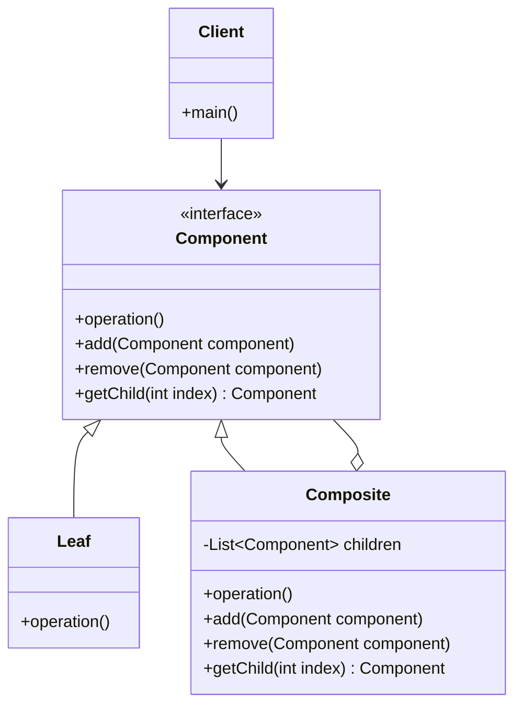

# Composite Pattern - Tree Structures

In software development, we often need to work with tree-like hierarchical structures where individual objects and compositions of objects should be treated uniformly.

**Example:** File systems (files and folders), UI components (buttons and panels), organizational charts, menu systems, etc.

Treating individual objects and compositions differently leads to complex client code and violates the principle of uniform treatment.

This is where the **Composite Design Pattern** comes into play.

It's a fundamental structural pattern that enables tree structures and is common in system design interviews.

## What is Composite Pattern?

Composite Pattern is a structural design pattern that composes objects into tree structures to represent part-whole hierarchies. It lets clients treat individual objects and compositions of objects uniformly.

The pattern defines a class hierarchy consisting of primitive objects and composite objects. Composite objects are built from primitive objects and other composites.

It follows the principle that clients should be able to ignore the difference between compositions of objects and individual objects.

## Class Diagram



## Implementation

### 1. File System Example

```java
import java.util.*;
import java.time.LocalDateTime;
import java.time.format.DateTimeFormatter;

// Component interface
interface FileSystemComponent {
    String getName();
    long getSize();
    void display(String indent);
    void add(FileSystemComponent component);
    void remove(FileSystemComponent component);
    List<FileSystemComponent> getChildren();
    boolean isComposite();
    String getPath();
    LocalDateTime getCreatedDate();
}

// Leaf - File
class File implements FileSystemComponent {
    private String name;
    private long size;
    private String content;
    private String path;
    private LocalDateTime createdDate;

    public File(String name, long size, String path) {
        this.name = name;
        this.size = size;
        this.path = path;
        this.content = "";
        this.createdDate = LocalDateTime.now();
    }

    public File(String name, String content, String path) {
        this.name = name;
        this.content = content;
        this.size = content.length();
        this.path = path;
        this.createdDate = LocalDateTime.now();
    }

    @Override
    public String getName() {
        return name;
    }

    @Override
    public long getSize() {
        return size;
    }

    @Override
    public void display(String indent) {
        System.out.println(indent + "📄 " + name + " (" + size + " bytes)");
    }

    @Override
    public void add(FileSystemComponent component) {
        throw new UnsupportedOperationException("Cannot add to a file");
    }

    @Override
    public void remove(FileSystemComponent component) {
        throw new UnsupportedOperationException("Cannot remove from a file");
    }

    @Override
    public List<FileSystemComponent> getChildren() {
        throw new UnsupportedOperationException("File has no children");
    }

    @Override
    public boolean isComposite() {
        return false;
    }

    @Override
    public String getPath() {
        return path;
    }

    @Override
    public LocalDateTime getCreatedDate() {
        return createdDate;
    }

    public String getContent() {
        return content;
    }

    public void setContent(String content) {
        this.content = content;
        this.size = content.length();
    }
}

// Composite - Directory
class Directory implements FileSystemComponent {
    private String name;
    private List<FileSystemComponent> children;
    private String path;
    private LocalDateTime createdDate;

    public Directory(String name, String path) {
        this.name = name;
        this.path = path;
        this.children = new ArrayList<>();
        this.createdDate = LocalDateTime.now();
    }

    @Override
    public String getName() {
        return name;
    }

    @Override
    public long getSize() {
        return children.stream()
                .mapToLong(FileSystemComponent::getSize)
                .sum();
    }

    @Override
    public void display(String indent) {
        System.out.println(indent + "📁 " + name + "/ (" + getSize() + " bytes total)");
        for (FileSystemComponent child : children) {
            child.display(indent + "  ");
        }
    }

    @Override
    public void add(FileSystemComponent component) {
        children.add(component);
    }

    @Override
    public void remove(FileSystemComponent component) {
        children.remove(component);
    }

    @Override
    public List<FileSystemComponent> getChildren() {
        return new ArrayList<>(children);
    }

    @Override
    public boolean isComposite() {
        return true;
    }

    @Override
    public String getPath() {
        return path;
    }

    @Override
    public LocalDateTime getCreatedDate() {
        return createdDate;
    }

    // Additional directory operations
    public FileSystemComponent findByName(String name) {
        if (this.name.equals(name)) {
            return this;
        }

        for (FileSystemComponent child : children) {
            if (child.getName().equals(name)) {
                return child;
            }
            if (child.isComposite()) {
                FileSystemComponent found = ((Directory) child).findByName(name);
                if (found != null) {
                    return found;
                }
            }
        }
        return null;
    }

    public List<File> getAllFiles() {
        List<File> files = new ArrayList<>();
        for (FileSystemComponent child : children) {
            if (!child.isComposite()) {
                files.add((File) child);
            } else {
                files.addAll(((Directory) child).getAllFiles());
            }
        }
        return files;
    }

    public int getFileCount() {
        int count = 0;
        for (FileSystemComponent child : children) {
            if (!child.isComposite()) {
                count++;
            } else {
                count += ((Directory) child).getFileCount();
            }
        }
        return count;
    }

    public int getDirectoryCount() {
        int count = 0;
        for (FileSystemComponent child : children) {
            if (child.isComposite()) {
                count++;
                count += ((Directory) child).getDirectoryCount();
            }
        }
        return count;
    }
}

// File System Manager
class FileSystem {
    private Directory root;

    public FileSystem() {
        this.root = new Directory("root", "/");
    }

    public Directory getRoot() {
        return root;
    }

    public void displayStructure() {
        System.out.println("File System Structure:");
        root.display("");
    }

    public FileSystemComponent find(String name) {
        return root.findByName(name);
    }

    public void printStatistics() {
        System.out.println("\n=== File System Statistics ===");
        System.out.println("Total Size: " + root.getSize() + " bytes");
        System.out.println("Total Files: " + root.getFileCount());
        System.out.println("Total Directories: " + (root.getDirectoryCount() + 1)); // +1 for root
    }

    public List<File> searchFilesByExtension(String extension) {
        return root.getAllFiles().stream()
                .filter(file -> file.getName().endsWith("." + extension))
                .collect(ArrayList::new, ArrayList::add, ArrayList::addAll);
    }
}

// Usage Example
class FileSystemExample {
    public static void main(String[] args) {
        FileSystem fs = new FileSystem();
        Directory root = fs.getRoot();

        // Create directory structure
        Directory documents = new Directory("Documents", "/Documents");
        Directory pictures = new Directory("Pictures", "/Pictures");
        Directory projects = new Directory("Projects", "/Projects");

        root.add(documents);
        root.add(pictures);
        root.add(projects);

        // Add files to Documents
        documents.add(new File("resume.pdf", 1024 * 50, "/Documents/resume.pdf"));
        documents.add(new File("letter.docx", 1024 * 25, "/Documents/letter.docx"));

        // Add subdirectory to Documents
        Directory personal = new Directory("Personal", "/Documents/Personal");
        personal.add(new File("diary.txt", "Dear diary...", "/Documents/Personal/diary.txt"));
        documents.add(personal);

        // Add files to Pictures
        pictures.add(new File("vacation.jpg", 1024 * 500, "/Pictures/vacation.jpg"));
        pictures.add(new File("family.png", 1024 * 300, "/Pictures/family.png"));

        // Add project structure
        Directory javaProject = new Directory("JavaProject", "/Projects/JavaProject");
        Directory srcDir = new Directory("src", "/Projects/JavaProject/src");
        srcDir.add(new File("Main.java", "public class Main { }", "/Projects/JavaProject/src/Main.java"));
        srcDir.add(new File("Utils.java", "public class Utils { }", "/Projects/JavaProject/src/Utils.java"));
        javaProject.add(srcDir);
        javaProject.add(new File("README.md", "# Java Project", "/Projects/JavaProject/README.md"));
        projects.add(javaProject);

        // Display file system
        fs.displayStructure();
        fs.printStatistics();

        // Search for Java files
        System.out.println("\n=== Java Files ===");
        List<File> javaFiles = fs.searchFilesByExtension("java");
        javaFiles.forEach(file -> System.out.println("Found: " + file.getPath()));

        // Find specific component
        System.out.println("\n=== Search Results ===");
        FileSystemComponent found = fs.find("Personal");
        if (found != null) {
            System.out.println("Found: " + found.getName() + " at " + found.getPath());
        }
    }
}
```

### 2. UI Component Hierarchy

```java
// Component interface
interface UIComponent {
    void render();
    void addChild(UIComponent component);
    void removeChild(UIComponent component);
    List<UIComponent> getChildren();
    String getName();
    boolean isComposite();
    void setProperty(String key, Object value);
    Object getProperty(String key);
}

// Base component with common functionality
abstract class BaseUIComponent implements UIComponent {
    protected String name;
    protected Map<String, Object> properties;

    public BaseUIComponent(String name) {
        this.name = name;
        this.properties = new HashMap<>();
    }

    @Override
    public String getName() {
        return name;
    }

    @Override
    public void setProperty(String key, Object value) {
        properties.put(key, value);
    }

    @Override
    public Object getProperty(String key) {
        return properties.get(key);
    }

    @Override
    public void addChild(UIComponent component) {
        throw new UnsupportedOperationException("Cannot add child to " + getClass().getSimpleName());
    }

    @Override
    public void removeChild(UIComponent component) {
        throw new UnsupportedOperationException("Cannot remove child from " + getClass().getSimpleName());
    }

    @Override
    public List<UIComponent> getChildren() {
        return Collections.emptyList();
    }

    @Override
    public boolean isComposite() {
        return false;
    }
}

// Leaf components
class Button extends BaseUIComponent {
    private String text;

    public Button(String name, String text) {
        super(name);
        this.text = text;
    }

    @Override
    public void render() {
        String style = (String) getProperty("style");
        System.out.println("Rendering Button: " + text +
                          (style != null ? " [Style: " + style + "]" : ""));
    }

    public void setText(String text) {
        this.text = text;
    }

    public String getText() {
        return text;
    }
}

class Label extends BaseUIComponent {
    private String text;

    public Label(String name, String text) {
        super(name);
        this.text = text;
    }

    @Override
    public void render() {
        String color = (String) getProperty("color");
        System.out.println("Rendering Label: " + text +
                          (color != null ? " [Color: " + color + "]" : ""));
    }

    public void setText(String text) {
        this.text = text;
    }
}

class TextBox extends BaseUIComponent {
    private String placeholder;
    private String value;

    public TextBox(String name, String placeholder) {
        super(name);
        this.placeholder = placeholder;
        this.value = "";
    }

    @Override
    public void render() {
        Boolean readOnly = (Boolean) getProperty("readOnly");
        System.out.println("Rendering TextBox: " + placeholder +
                          " [Value: '" + value + "']" +
                          (Boolean.TRUE.equals(readOnly) ? " (Read-only)" : ""));
    }

    public void setValue(String value) {
        this.value = value;
    }

    public String getValue() {
        return value;
    }
}

// Composite components
class Panel extends BaseUIComponent {
    protected List<UIComponent> children;

    public Panel(String name) {
        super(name);
        this.children = new ArrayList<>();
    }

    @Override
    public void render() {
        String border = (String) getProperty("border");
        System.out.println("Rendering Panel: " + name +
                          (border != null ? " [Border: " + border + "]" : ""));
        System.out.println("  Panel Contents:");
        for (UIComponent child : children) {
            System.out.print("    ");
            child.render();
        }
    }

    @Override
    public void addChild(UIComponent component) {
        children.add(component);
    }

    @Override
    public void removeChild(UIComponent component) {
        children.remove(component);
    }

    @Override
    public List<UIComponent> getChildren() {
        return new ArrayList<>(children);
    }

    @Override
    public boolean isComposite() {
        return true;
    }
}

class Form extends BaseUIComponent {
    private List<UIComponent> children;
    private String action;
    private String method;

    public Form(String name, String action, String method) {
        super(name);
        this.action = action;
        this.method = method;
        this.children = new ArrayList<>();
    }

    @Override
    public void render() {
        System.out.println("Rendering Form: " + name + " [Action: " + action + ", Method: " + method + "]");
        for (UIComponent child : children) {
            System.out.print("  ");
            child.render();
        }
    }

    @Override
    public void addChild(UIComponent component) {
        children.add(component);
    }

    @Override
    public void removeChild(UIComponent component) {
        children.remove(component);
    }

    @Override
    public List<UIComponent> getChildren() {
        return new ArrayList<>(children);
    }

    @Override
    public boolean isComposite() {
        return true;
    }

    public void submit() {
        System.out.println("Submitting form: " + name);
        // Collect form data
        Map<String, String> formData = new HashMap<>();
        collectFormData(this, formData);
        formData.forEach((key, value) ->
            System.out.println("  " + key + ": " + value));
    }

    private void collectFormData(UIComponent component, Map<String, String> data) {
        if (component instanceof TextBox) {
            TextBox textBox = (TextBox) component;
            data.put(textBox.getName(), textBox.getValue());
        } else if (component.isComposite()) {
            for (UIComponent child : component.getChildren()) {
                collectFormData(child, data);
            }
        }
    }
}

class Window extends BaseUIComponent {
    private List<UIComponent> children;
    private String title;
    private int width;
    private int height;

    public Window(String name, String title, int width, int height) {
        super(name);
        this.title = title;
        this.width = width;
        this.height = height;
        this.children = new ArrayList<>();
    }

    @Override
    public void render() {
        System.out.println("=".repeat(50));
        System.out.println("Window: " + title + " (" + width + "x" + height + ")");
        System.out.println("=".repeat(50));
        for (UIComponent child : children) {
            child.render();
        }
        System.out.println("=".repeat(50));
    }

    @Override
    public void addChild(UIComponent component) {
        children.add(component);
    }

    @Override
    public void removeChild(UIComponent component) {
        children.remove(component);
    }

    @Override
    public List<UIComponent> getChildren() {
        return new ArrayList<>(children);
    }

    @Override
    public boolean isComposite() {
        return true;
    }
}

// UI Framework utility
class UIBuilder {

    public static UIComponent createLoginForm() {
        Form loginForm = new Form("loginForm", "/login", "POST");

        Label usernameLabel = new Label("usernameLabel", "Username:");
        TextBox usernameInput = new TextBox("username", "Enter username");

        Label passwordLabel = new Label("passwordLabel", "Password:");
        TextBox passwordInput = new TextBox("password", "Enter password");
        passwordInput.setProperty("type", "password");

        Button submitButton = new Button("submitBtn", "Login");
        submitButton.setProperty("style", "primary");

        Button cancelButton = new Button("cancelBtn", "Cancel");
        cancelButton.setProperty("style", "secondary");

        Panel buttonPanel = new Panel("buttonPanel");
        buttonPanel.addChild(submitButton);
        buttonPanel.addChild(cancelButton);
        buttonPanel.setProperty("border", "none");

        loginForm.addChild(usernameLabel);
        loginForm.addChild(usernameInput);
        loginForm.addChild(passwordLabel);
        loginForm.addChild(passwordInput);
        loginForm.addChild(buttonPanel);

        return loginForm;
    }

    public static UIComponent createDashboard() {
        Panel dashboard = new Panel("dashboard");
        dashboard.setProperty("border", "solid");

        Label titleLabel = new Label("title", "Dashboard");
        titleLabel.setProperty("color", "blue");

        Panel statsPanel = new Panel("statsPanel");
        statsPanel.setProperty("border", "dashed");
        statsPanel.addChild(new Label("users", "Users: 1,234"));
        statsPanel.addChild(new Label("orders", "Orders: 5,678"));
        statsPanel.addChild(new Label("revenue", "Revenue: $12,345"));

        Button refreshButton = new Button("refresh", "Refresh Data");
        refreshButton.setProperty("style", "outline");

        dashboard.addChild(titleLabel);
        dashboard.addChild(statsPanel);
        dashboard.addChild(refreshButton);

        return dashboard;
    }
}

// Usage Example
class UIExample {
    public static void main(String[] args) {
        // Create main window
        Window mainWindow = new Window("mainWindow", "Application", 800, 600);

        // Add login form
        UIComponent loginForm = UIBuilder.createLoginForm();
        mainWindow.addChild(loginForm);

        // Add dashboard
        UIComponent dashboard = UIBuilder.createDashboard();
        mainWindow.addChild(dashboard);

        // Render the entire UI
        mainWindow.render();

        // Simulate form interaction
        System.out.println("\n" + "=".repeat(30));
        System.out.println("Simulating form submission:");

        // Find and populate form fields
        Form form = (Form) findComponentByName(mainWindow, "loginForm");
        if (form != null) {
            TextBox usernameField = (TextBox) findComponentByName(form, "username");
            TextBox passwordField = (TextBox) findComponentByName(form, "password");

            if (usernameField != null) usernameField.setValue("john_doe");
            if (passwordField != null) passwordField.setValue("secret123");

            form.submit();
        }
    }

    private static UIComponent findComponentByName(UIComponent root, String name) {
        if (root.getName().equals(name)) {
            return root;
        }

        if (root.isComposite()) {
            for (UIComponent child : root.getChildren()) {
                UIComponent found = findComponentByName(child, name);
                if (found != null) {
                    return found;
                }
            }
        }

        return null;
    }
}
```

### 3. Organization Structure

```java
// Employee component interface
interface OrganizationComponent {
    String getName();
    String getPosition();
    double getSalary();
    void displayStructure(String indent);
    void addSubordinate(OrganizationComponent component);
    void removeSubordinate(OrganizationComponent component);
    List<OrganizationComponent> getSubordinates();
    boolean isManager();
    int getTeamSize();
    double getTotalSalaryCost();
}

// Leaf - Individual Employee
class Employee implements OrganizationComponent {
    private String name;
    private String position;
    private double salary;
    private String department;
    private String email;

    public Employee(String name, String position, double salary, String department) {
        this.name = name;
        this.position = position;
        this.salary = salary;
        this.department = department;
        this.email = name.toLowerCase().replace(" ", ".") + "@company.com";
    }

    @Override
    public String getName() {
        return name;
    }

    @Override
    public String getPosition() {
        return position;
    }

    @Override
    public double getSalary() {
        return salary;
    }

    @Override
    public void displayStructure(String indent) {
        System.out.println(indent + "👤 " + name + " - " + position +
                          " ($" + String.format("%.0f", salary) + ")");
    }

    @Override
    public void addSubordinate(OrganizationComponent component) {
        throw new UnsupportedOperationException("Cannot add subordinates to individual employee");
    }

    @Override
    public void removeSubordinate(OrganizationComponent component) {
        throw new UnsupportedOperationException("Cannot remove subordinates from individual employee");
    }

    @Override
    public List<OrganizationComponent> getSubordinates() {
        return Collections.emptyList();
    }

    @Override
    public boolean isManager() {
        return false;
    }

    @Override
    public int getTeamSize() {
        return 1; // Just themselves
    }

    @Override
    public double getTotalSalaryCost() {
        return salary;
    }

    public String getDepartment() {
        return department;
    }

    public String getEmail() {
        return email;
    }
}

// Composite - Manager with subordinates
class Manager implements OrganizationComponent {
    private String name;
    private String position;
    private double salary;
    private String department;
    private List<OrganizationComponent> subordinates;

    public Manager(String name, String position, double salary, String department) {
        this.name = name;
        this.position = position;
        this.salary = salary;
        this.department = department;
        this.subordinates = new ArrayList<>();
    }

    @Override
    public String getName() {
        return name;
    }

    @Override
    public String getPosition() {
        return position;
    }

    @Override
    public double getSalary() {
        return salary;
    }

    @Override
    public void displayStructure(String indent) {
        System.out.println(indent + "👔 " + name + " - " + position +
                          " ($" + String.format("%.0f", salary) + ") [Team: " + getTeamSize() + "]");
        for (OrganizationComponent subordinate : subordinates) {
            subordinate.displayStructure(indent + "  ");
        }
    }

    @Override
    public void addSubordinate(OrganizationComponent component) {
        subordinates.add(component);
    }

    @Override
    public void removeSubordinate(OrganizationComponent component) {
        subordinates.remove(component);
    }

    @Override
    public List<OrganizationComponent> getSubordinates() {
        return new ArrayList<>(subordinates);
    }

    @Override
    public boolean isManager() {
        return true;
    }

    @Override
    public int getTeamSize() {
        return 1 + subordinates.stream()
                .mapToInt(OrganizationComponent::getTeamSize)
                .sum();
    }

    @Override
    public double getTotalSalaryCost() {
        return salary + subordinates.stream()
                .mapToDouble(OrganizationComponent::getTotalSalaryCost)
                .sum();
    }

    public String getDepartment() {
        return department;
    }

    public List<OrganizationComponent> getAllTeamMembers() {
        List<OrganizationComponent> allMembers = new ArrayList<>();
        allMembers.add(this);

        for (OrganizationComponent subordinate : subordinates) {
            if (subordinate.isManager()) {
                allMembers.addAll(((Manager) subordinate).getAllTeamMembers());
            } else {
                allMembers.add(subordinate);
            }
        }

        return allMembers;
    }
}

// Organization utility class
class Organization {
    private OrganizationComponent ceo;
    private String companyName;

    public Organization(String companyName, OrganizationComponent ceo) {
        this.companyName = companyName;
        this.ceo = ceo;
    }

    public void displayOrganizationChart() {
        System.out.println("🏢 " + companyName + " - Organization Chart");
        System.out.println("=".repeat(50));
        ceo.displayStructure("");
        System.out.println("=".repeat(50));
        System.out.println("Total Employees: " + ceo.getTeamSize());
        System.out.println("Total Salary Cost: $" + String.format("%.0f", ceo.getTotalSalaryCost()));
    }

    public List<OrganizationComponent> findByPosition(String position) {
        List<OrganizationComponent> results = new ArrayList<>();
        findByPositionRecursive(ceo, position, results);
        return results;
    }

    private void findByPositionRecursive(OrganizationComponent component, String position,
                                       List<OrganizationComponent> results) {
        if (component.getPosition().toLowerCase().contains(position.toLowerCase())) {
            results.add(component);
        }

        if (component.isManager()) {
            for (OrganizationComponent subordinate : component.getSubordinates()) {
                findByPositionRecursive(subordinate, position, results);
            }
        }
    }

    public double getAverageSalary() {
        List<OrganizationComponent> allEmployees = getAllEmployees();
        return allEmployees.stream()
                .mapToDouble(OrganizationComponent::getSalary)
                .average()
                .orElse(0.0);
    }

    public List<OrganizationComponent> getAllEmployees() {
        List<OrganizationComponent> allEmployees = new ArrayList<>();
        collectAllEmployees(ceo, allEmployees);
        return allEmployees;
    }

    private void collectAllEmployees(OrganizationComponent component,
                                   List<OrganizationComponent> allEmployees) {
        allEmployees.add(component);
        if (component.isManager()) {
            for (OrganizationComponent subordinate : component.getSubordinates()) {
                collectAllEmployees(subordinate, allEmployees);
            }
        }
    }
}

// Usage Example
class OrganizationExample {
    public static void main(String[] args) {
        // Create CEO
        Manager ceo = new Manager("John Smith", "CEO", 250000, "Executive");

        // Create VPs
        Manager vpEngineering = new Manager("Alice Johnson", "VP Engineering", 180000, "Engineering");
        Manager vpSales = new Manager("Bob Wilson", "VP Sales", 160000, "Sales");
        Manager vpMarketing = new Manager("Carol Brown", "VP Marketing", 150000, "Marketing");

        ceo.addSubordinate(vpEngineering);
        ceo.addSubordinate(vpSales);
        ceo.addSubordinate(vpMarketing);

        // Engineering team
        Manager engineeringManager = new Manager("David Lee", "Engineering Manager", 120000, "Engineering");
        vpEngineering.addSubordinate(engineeringManager);

        engineeringManager.addSubordinate(new Employee("Emily Chen", "Senior Developer", 95000, "Engineering"));
        engineeringManager.addSubordinate(new Employee("Frank Garcia", "Developer", 80000, "Engineering"));
        engineeringManager.addSubordinate(new Employee("Grace Kim", "Junior Developer", 65000, "Engineering"));

        Manager qaManager = new Manager("Henry Martinez", "QA Manager", 100000, "Engineering");
        vpEngineering.addSubordinate(qaManager);
        qaManager.addSubordinate(new Employee("Ivy Rodriguez", "QA Engineer", 75000, "Engineering"));
        qaManager.addSubordinate(new Employee("Jack Thompson", "QA Engineer", 70000, "Engineering"));

        // Sales team
        Manager salesManager = new Manager("Kate Davis", "Sales Manager", 110000, "Sales");
        vpSales.addSubordinate(salesManager);

        salesManager.addSubordinate(new Employee("Liam Anderson", "Senior Sales Rep", 85000, "Sales"));
        salesManager.addSubordinate(new Employee("Mia Taylor", "Sales Rep", 70000, "Sales"));
        salesManager.addSubordinate(new Employee("Noah White", "Sales Rep", 68000, "Sales"));

        // Marketing team
        vpMarketing.addSubordinate(new Employee("Olivia Harris", "Marketing Specialist", 65000, "Marketing"));
        vpMarketing.addSubordinate(new Employee("Paul Clark", "Content Creator", 60000, "Marketing"));

        // Create organization
        Organization company = new Organization("TechCorp Inc.", ceo);

        // Display organization chart
        company.displayOrganizationChart();

        // Search functionality
        System.out.println("\n=== Search Results ===");
        List<OrganizationComponent> managers = company.findByPosition("Manager");
        System.out.println("Managers found: " + managers.size());
        managers.forEach(manager -> System.out.println("- " + manager.getName() + " (" + manager.getPosition() + ")"));

        System.out.println("\nDevelopers found:");
        List<OrganizationComponent> developers = company.findByPosition("Developer");
        developers.forEach(dev -> System.out.println("- " + dev.getName() + " (" + dev.getPosition() + ")"));

        // Statistics
        System.out.println("\n=== Company Statistics ===");
        System.out.println("Average Salary: $" + String.format("%.0f", company.getAverageSalary()));
        System.out.println("Engineering Team Size: " + vpEngineering.getTeamSize());
        System.out.println("Engineering Team Cost: $" + String.format("%.0f", vpEngineering.getTotalSalaryCost()));
    }
}
```

## Test Code

```java
import org.junit.jupiter.api.Test;
import org.junit.jupiter.api.BeforeEach;
import static org.junit.jupiter.api.Assertions.*;
import java.util.List;

class CompositePatternTest {

    @Test
    void testFileSystem() {
        FileSystem fs = new FileSystem();
        Directory root = fs.getRoot();

        // Create structure
        Directory docs = new Directory("Documents", "/Documents");
        File file1 = new File("test.txt", "Hello World", "/Documents/test.txt");
        File file2 = new File("data.csv", 1024, "/Documents/data.csv");

        docs.add(file1);
        docs.add(file2);
        root.add(docs);

        // Test size calculation
        assertEquals(1024 + "Hello World".length(), root.getSize());
        assertEquals(2, docs.getChildren().size());
        assertTrue(docs.isComposite());
        assertFalse(file1.isComposite());

        // Test search
        FileSystemComponent found = fs.find("Documents");
        assertNotNull(found);
        assertEquals("Documents", found.getName());

        // Test file operations
        assertThrows(UnsupportedOperationException.class, () -> file1.add(file2));
    }

    @Test
    void testUIComponents() {
        Window window = new Window("testWindow", "Test Window", 800, 600);
        Panel panel = new Panel("testPanel");
        Button button = new Button("testButton", "Click Me");
        Label label = new Label("testLabel", "Hello");

        panel.addChild(button);
        panel.addChild(label);
        window.addChild(panel);

        assertEquals(1, window.getChildren().size());
        assertEquals(2, panel.getChildren().size());
        assertTrue(window.isComposite());
        assertTrue(panel.isComposite());
        assertFalse(button.isComposite());

        // Test properties
        button.setProperty("style", "primary");
        assertEquals("primary", button.getProperty("style"));

        // Test form data collection
        Form form = new Form("testForm", "/submit", "POST");
        TextBox textBox = new TextBox("username", "Enter username");
        textBox.setValue("john_doe");
        form.addChild(textBox);

        // This would normally collect form data during submission
        assertDoesNotThrow(() -> form.submit());
    }

    @Test
    void testOrganization() {
        Manager ceo = new Manager("John CEO", "CEO", 200000, "Executive");
        Manager vp = new Manager("Jane VP", "VP", 150000, "Sales");
        Employee emp1 = new Employee("Bob Employee", "Developer", 80000, "Engineering");
        Employee emp2 = new Employee("Alice Employee", "Designer", 75000, "Design");

        vp.addSubordinate(emp1);
        vp.addSubordinate(emp2);
        ceo.addSubordinate(vp);

        // Test hierarchy
        assertEquals(4, ceo.getTeamSize()); // CEO + VP + 2 employees
        assertEquals(200000 + 150000 + 80000 + 75000, ceo.getTotalSalaryCost());
        assertTrue(ceo.isManager());
        assertFalse(emp1.isManager());

        // Test subordinates
        assertEquals(1, ceo.getSubordinates().size());
        assertEquals(2, vp.getSubordinates().size());
        assertEquals(0, emp1.getSubordinates().size());

        // Test organization search
        Organization org = new Organization("TestCorp", ceo);
        List<OrganizationComponent> developers = org.findByPosition("Developer");
        assertEquals(1, developers.size());
        assertEquals("Bob Employee", developers.get(0).getName());

        // Test average salary
        double expectedAverage = (200000 + 150000 + 80000 + 75000) / 4.0;
        assertEquals(expectedAverage, org.getAverageSalary(), 0.01);
    }

    @Test
    void testCompositeOperations() {
        // Test that leaf nodes properly reject composite operations
        File file = new File("test.txt", "content", "/test.txt");

        assertThrows(UnsupportedOperationException.class, () -> file.add(new File("other.txt", "content", "/other.txt")));
        assertThrows(UnsupportedOperationException.class, () -> file.remove(new File("other.txt", "content", "/other.txt")));
        assertThrows(UnsupportedOperationException.class, () -> file.getChildren());

        // Test that composite nodes properly support operations
        Directory dir = new Directory("testDir", "/testDir");
        File file1 = new File("file1.txt", "content1", "/testDir/file1.txt");
        File file2 = new File("file2.txt", "content2", "/testDir/file2.txt");

        assertDoesNotThrow(() -> dir.add(file1));
        assertDoesNotThrow(() -> dir.add(file2));
        assertEquals(2, dir.getChildren().size());

        assertDoesNotThrow(() -> dir.remove(file1));
        assertEquals(1, dir.getChildren().size());
    }

    @Test
    void testFileSystemStatistics() {
        FileSystem fs = new FileSystem();
        Directory root = fs.getRoot();

        Directory dir1 = new Directory("Dir1", "/Dir1");
        Directory dir2 = new Directory("Dir2", "/Dir1/Dir2");

        dir1.add(new File("file1.txt", 100, "/Dir1/file1.txt"));
        dir2.add(new File("file2.txt", 200, "/Dir1/Dir2/file2.txt"));
        dir1.add(dir2);
        root.add(dir1);

        assertEquals(2, root.getFileCount());
        assertEquals(2, root.getDirectoryCount()); // dir1 + dir2
        assertEquals(300, root.getSize());

        // Test file search by extension
        root.add(new File("test.java", 50, "/test.java"));
        root.add(new File("script.js", 75, "/script.js"));

        List<File> javaFiles = fs.searchFilesByExtension("java");
        assertEquals(1, javaFiles.size());
        assertEquals("test.java", javaFiles.get(0).getName());
    }

    @Test
    void testNestedComposites() {
        // Test deeply nested composite structure
        Panel rootPanel = new Panel("root");
        Panel level1Panel = new Panel("level1");
        Panel level2Panel = new Panel("level2");
        Button deepButton = new Button("deepButton", "Deep Button");

        level2Panel.addChild(deepButton);
        level1Panel.addChild(level2Panel);
        rootPanel.addChild(level1Panel);

        // Test that we can traverse the hierarchy
        assertDoesNotThrow(() -> rootPanel.render());

        // Test finding nested components
        UIComponent found = findComponentInHierarchy(rootPanel, "deepButton");
        assertNotNull(found);
        assertEquals("Deep Button", ((Button) found).getText());
    }

    private UIComponent findComponentInHierarchy(UIComponent root, String name) {
        if (root.getName().equals(name)) {
            return root;
        }

        if (root.isComposite()) {
            for (UIComponent child : root.getChildren()) {
                UIComponent found = findComponentInHierarchy(child, name);
                if (found != null) {
                    return found;
                }
            }
        }

        return null;
    }
}
```

## Real-World Examples of Composite Pattern

### 1. **File Systems**

- **Operating Systems**: Files and directories in Windows, macOS, Linux
- **Version Control**: Git repositories with files and folders
- **Cloud Storage**: Google Drive, Dropbox folder structures
- **Archive Formats**: ZIP, TAR files containing nested structures

### 2. **User Interfaces**

- **GUI Frameworks**: Swing, JavaFX, React component trees
- **Web Development**: HTML DOM tree, React/Vue component hierarchies
- **Game Development**: Scene graphs, UI widget hierarchies
- **Graphics**: Vector graphics with grouped objects

### 3. **Organizational Structures**

- **Company Hierarchies**: Employees, managers, departments
- **Military**: Chain of command structures
- **Government**: Administrative hierarchies
- **Academic**: University departments and faculty

### 4. **Document Processing**

- **Text Editors**: Document elements (paragraphs, sections, chapters)
- **Spreadsheets**: Cells, rows, sheets, workbooks
- **Presentations**: Slides, sections, presentations
- **CAD Systems**: Drawing objects and assemblies

## Specific Examples:

**java.awt.Container**: Swing/AWT component hierarchy where containers can hold other components.

**javax.swing.JComponent**: Base class for Swing components that can contain other components.

**org.w3c.dom.Node**: XML DOM tree structure where nodes can contain other nodes.

**java.io.File**: Represents both files and directories in the file system.

**Apache Commons VFS**: Virtual file system that treats files and folders uniformly.

## Pros and Cons of Composite Pattern

| **Pros**                                                               | **Cons**                                                               |
| ---------------------------------------------------------------------- | ---------------------------------------------------------------------- |
| ✅ **Uniform Treatment**: Treats individual and composite objects same | ❌ **Overly General**: Interface might be too general for some leafs   |
| ✅ **Flexible Hierarchy**: Easy to add new types of components         | ❌ **Type Safety**: Harder to restrict types of children in composites |
| ✅ **Recursive Operations**: Operations work on entire tree structures | ❌ **Performance**: Recursive operations can be expensive              |
| ✅ **Open/Closed Principle**: Easy to add new component types          | ❌ **Complexity**: Can make design overly complex for simple cases     |
| ✅ **Simplified Client Code**: Clients don't need to distinguish types | ❌ **Memory Overhead**: Additional objects and references              |

## Best Practices

### ⚠️ **Warnings & Considerations**

1. **Interface Design**: Keep component interface focused and not too general
2. **Type Safety**: Consider using generics or type constraints where possible
3. **Memory Management**: Be careful with circular references in tree structures
4. **Performance**: Optimize recursive operations for large hierarchies
5. **Error Handling**: Handle operations that don't make sense for leaf nodes

### 🏆 **Modern Alternatives & Enhancements**

- **Visitor Pattern**: For operations on composite structures without modifying classes
- **Iterator Pattern**: For traversing composite structures systematically
- **Flyweight Pattern**: For memory optimization in large composite structures
- **Observer Pattern**: For change notifications in hierarchical structures
- **Command Pattern**: For operations that can be undone on composite structures

### 💡 **When to Use Composite Pattern**

✅ **Use When:**

- You need to represent part-whole hierarchies
- You want clients to treat individual and composite objects uniformly
- The structure can be represented as a tree
- You need recursive operations on hierarchical structures

❌ **Avoid When:**

- The hierarchy is very simple and unlikely to change
- Type safety is more important than uniform treatment
- Performance of recursive operations is critical
- The composite interface would be too constraining for leaf objects

The Composite pattern is essential for building hierarchical structures where individual objects and compositions need to be treated uniformly, making it a cornerstone pattern in UI frameworks, file systems, and organizational modeling.
