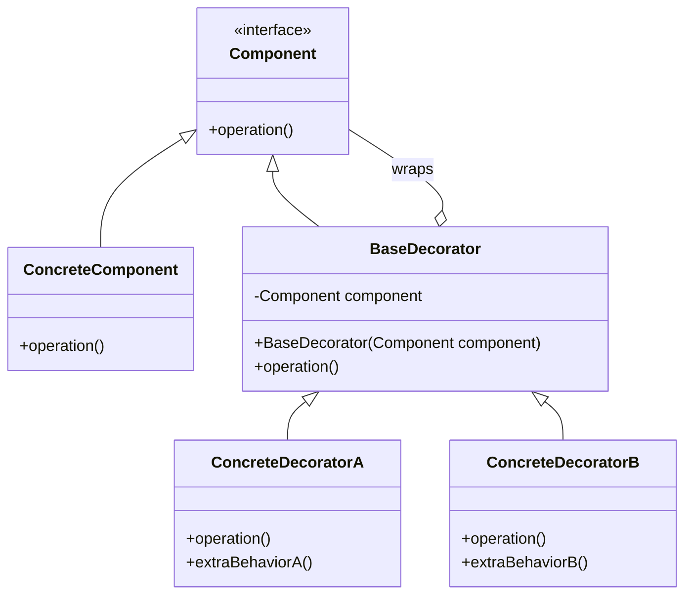

# Decorator Pattern - Adding Behavior Dynamically

In software development, we often need to add functionality to objects without altering their structure or modifying existing code.

**Example:** Adding features to text (bold, italic, underline), enhancing coffee orders (milk, sugar, whipped cream), applying filters to images, adding middleware to web requests, etc.

Using inheritance for every possible combination leads to issues such as class explosion, inflexibility, and violation of the Open/Closed principle.

This is where the **Decorator Design Pattern** comes into play.

It's a fundamental structural pattern that enables adding behavior dynamically and is commonly used in frameworks and enterprise applications.

## What is Decorator Pattern?

Decorator Pattern is a structural design pattern that allows behavior to be added to objects dynamically without altering their structure. It acts as a wrapper around the original object.

It provides a flexible alternative to subclassing for extending functionality by creating decorator classes that wrap the original class.

The pattern follows the composition over inheritance principle and maintains the interface of the component being decorated.

## Class Diagram



## Implementation

There are several ways to implement the Decorator Pattern in Java. Let's explore various approaches with real-world examples.

### 1. Classic Decorator Implementation - Text Formatting

```java
// Component interface
interface Text {
    String getContent();
    int getLength();
}

// Concrete Component
class PlainText implements Text {
    private String content;

    public PlainText(String content) {
        this.content = content;
    }

    @Override
    public String getContent() {
        return content;
    }

    @Override
    public int getLength() {
        return content.length();
    }
}

// Base Decorator
abstract class TextDecorator implements Text {
    protected Text text;

    public TextDecorator(Text text) {
        this.text = text;
    }

    @Override
    public String getContent() {
        return text.getContent();
    }

    @Override
    public int getLength() {
        return text.getLength();
    }
}

// Concrete Decorators
class BoldDecorator extends TextDecorator {

    public BoldDecorator(Text text) {
        super(text);
    }

    @Override
    public String getContent() {
        return "<b>" + text.getContent() + "</b>";
    }

    @Override
    public int getLength() {
        return text.getLength() + 7; // Adding <b></b> tags
    }
}

class ItalicDecorator extends TextDecorator {

    public ItalicDecorator(Text text) {
        super(text);
    }

    @Override
    public String getContent() {
        return "<i>" + text.getContent() + "</i>";
    }

    @Override
    public int getLength() {
        return text.getLength() + 7; // Adding <i></i> tags
    }
}

class UnderlineDecorator extends TextDecorator {

    public UnderlineDecorator(Text text) {
        super(text);
    }

    @Override
    public String getContent() {
        return "<u>" + text.getContent() + "</u>";
    }

    @Override
    public int getLength() {
        return text.getLength() + 7; // Adding <u></u> tags
    }
}

class ColorDecorator extends TextDecorator {
    private String color;

    public ColorDecorator(Text text, String color) {
        super(text);
        this.color = color;
    }

    @Override
    public String getContent() {
        return String.format("<span style=\"color:%s\">%s</span>", color, text.getContent());
    }

    @Override
    public int getLength() {
        return text.getLength() + 30 + color.length(); // Approximate tag length
    }
}

// Usage Example
class TextFormattingExample {
    public static void main(String[] args) {
        // Start with plain text
        Text text = new PlainText("Hello World");
        System.out.println("Plain: " + text.getContent());

        // Add bold formatting
        text = new BoldDecorator(text);
        System.out.println("Bold: " + text.getContent());

        // Add italic formatting
        text = new ItalicDecorator(text);
        System.out.println("Bold + Italic: " + text.getContent());

        // Add underline formatting
        text = new UnderlineDecorator(text);
        System.out.println("Bold + Italic + Underline: " + text.getContent());

        // Add color
        text = new ColorDecorator(text, "red");
        System.out.println("All Formatting: " + text.getContent());

        System.out.println("Final length: " + text.getLength());
    }
}
```

### 2. Coffee Shop Example - Beverage Decorator

```java
// Component interface
interface Beverage {
    String getDescription();
    double getCost();
    int getCalories();
}

// Concrete Component
class Espresso implements Beverage {
    @Override
    public String getDescription() {
        return "Espresso";
    }

    @Override
    public double getCost() {
        return 1.99;
    }

    @Override
    public int getCalories() {
        return 5;
    }
}

class HouseBlend implements Beverage {
    @Override
    public String getDescription() {
        return "House Blend Coffee";
    }

    @Override
    public double getCost() {
        return 0.89;
    }

    @Override
    public int getCalories() {
        return 10;
    }
}

class DarkRoast implements Beverage {
    @Override
    public String getDescription() {
        return "Dark Roast Coffee";
    }

    @Override
    public double getCost() {
        return 0.99;
    }

    @Override
    public int getCalories() {
        return 8;
    }
}

// Base Decorator
abstract class CondimentDecorator implements Beverage {
    protected Beverage beverage;

    public CondimentDecorator(Beverage beverage) {
        this.beverage = beverage;
    }

    @Override
    public String getDescription() {
        return beverage.getDescription();
    }

    @Override
    public double getCost() {
        return beverage.getCost();
    }

    @Override
    public int getCalories() {
        return beverage.getCalories();
    }
}

// Concrete Decorators
class Milk extends CondimentDecorator {

    public Milk(Beverage beverage) {
        super(beverage);
    }

    @Override
    public String getDescription() {
        return beverage.getDescription() + ", Milk";
    }

    @Override
    public double getCost() {
        return beverage.getCost() + 0.10;
    }

    @Override
    public int getCalories() {
        return beverage.getCalories() + 20;
    }
}

class Mocha extends CondimentDecorator {

    public Mocha(Beverage beverage) {
        super(beverage);
    }

    @Override
    public String getDescription() {
        return beverage.getDescription() + ", Mocha";
    }

    @Override
    public double getCost() {
        return beverage.getCost() + 0.20;
    }

    @Override
    public int getCalories() {
        return beverage.getCalories() + 30;
    }
}

class Whip extends CondimentDecorator {

    public Whip(Beverage beverage) {
        super(beverage);
    }

    @Override
    public String getDescription() {
        return beverage.getDescription() + ", Whipped Cream";
    }

    @Override
    public double getCost() {
        return beverage.getCost() + 0.15;
    }

    @Override
    public int getCalories() {
        return beverage.getCalories() + 50;
    }
}

class Soy extends CondimentDecorator {

    public Soy(Beverage beverage) {
        super(beverage);
    }

    @Override
    public String getDescription() {
        return beverage.getDescription() + ", Soy Milk";
    }

    @Override
    public double getCost() {
        return beverage.getCost() + 0.15;
    }

    @Override
    public int getCalories() {
        return beverage.getCalories() + 25;
    }
}

// Size-based decorator
class SizeDecorator extends CondimentDecorator {
    public enum Size { SMALL, MEDIUM, LARGE }

    private Size size;

    public SizeDecorator(Beverage beverage, Size size) {
        super(beverage);
        this.size = size;
    }

    @Override
    public String getDescription() {
        return size.name() + " " + beverage.getDescription();
    }

    @Override
    public double getCost() {
        double baseCost = beverage.getCost();
        switch (size) {
            case SMALL: return baseCost * 0.8;
            case MEDIUM: return baseCost;
            case LARGE: return baseCost * 1.2;
            default: return baseCost;
        }
    }

    @Override
    public int getCalories() {
        int baseCalories = beverage.getCalories();
        switch (size) {
            case SMALL: return (int)(baseCalories * 0.8);
            case MEDIUM: return baseCalories;
            case LARGE: return (int)(baseCalories * 1.2);
            default: return baseCalories;
        }
    }
}

// Coffee Shop Order System
class CoffeeShop {
    public static void main(String[] args) {
        // Order 1: Simple Espresso
        Beverage beverage1 = new Espresso();
        System.out.println(beverage1.getDescription() + " $" + beverage1.getCost() + " (" + beverage1.getCalories() + " cal)");

        // Order 2: Dark Roast with Mocha and Whip
        Beverage beverage2 = new DarkRoast();
        beverage2 = new Mocha(beverage2);
        beverage2 = new Whip(beverage2);
        System.out.println(beverage2.getDescription() + " $" + String.format("%.2f", beverage2.getCost()) + " (" + beverage2.getCalories() + " cal)");

        // Order 3: Large House Blend with Soy, Mocha, and double Whip
        Beverage beverage3 = new HouseBlend();
        beverage3 = new SizeDecorator(beverage3, SizeDecorator.Size.LARGE);
        beverage3 = new Soy(beverage3);
        beverage3 = new Mocha(beverage3);
        beverage3 = new Whip(beverage3);
        beverage3 = new Whip(beverage3); // Double whip
        System.out.println(beverage3.getDescription() + " $" + String.format("%.2f", beverage3.getCost()) + " (" + beverage3.getCalories() + " cal)");
    }
}
```

### 3. Data Stream Decorator - I/O Operations

```java
import java.io.*;
import java.util.zip.GZIPInputStream;
import java.util.zip.GZIPOutputStream;

// Component interface
interface DataSource {
    void writeData(String data) throws IOException;
    String readData() throws IOException;
    String getName();
}

// Concrete Component
class FileDataSource implements DataSource {
    private String fileName;

    public FileDataSource(String fileName) {
        this.fileName = fileName;
    }

    @Override
    public void writeData(String data) throws IOException {
        try (FileWriter writer = new FileWriter(fileName)) {
            writer.write(data);
        }
    }

    @Override
    public String readData() throws IOException {
        StringBuilder result = new StringBuilder();
        try (BufferedReader reader = new BufferedReader(new FileReader(fileName))) {
            String line;
            while ((line = reader.readLine()) != null) {
                result.append(line).append("\n");
            }
        }
        return result.toString().trim();
    }

    @Override
    public String getName() {
        return fileName;
    }
}

// Base Decorator
abstract class DataSourceDecorator implements DataSource {
    protected DataSource dataSource;

    public DataSourceDecorator(DataSource dataSource) {
        this.dataSource = dataSource;
    }

    @Override
    public void writeData(String data) throws IOException {
        dataSource.writeData(data);
    }

    @Override
    public String readData() throws IOException {
        return dataSource.readData();
    }

    @Override
    public String getName() {
        return dataSource.getName();
    }
}

// Encryption Decorator
class EncryptionDecorator extends DataSourceDecorator {

    public EncryptionDecorator(DataSource dataSource) {
        super(dataSource);
    }

    @Override
    public void writeData(String data) throws IOException {
        String encryptedData = encode(data);
        super.writeData(encryptedData);
    }

    @Override
    public String readData() throws IOException {
        String encryptedData = super.readData();
        return decode(encryptedData);
    }

    @Override
    public String getName() {
        return super.getName() + " (Encrypted)";
    }

    private String encode(String data) {
        // Simple Caesar cipher for demonstration
        StringBuilder result = new StringBuilder();
        for (char c : data.toCharArray()) {
            if (Character.isLetter(c)) {
                char shifted = (char) (c + 3);
                if ((Character.isLowerCase(c) && shifted > 'z') ||
                    (Character.isUpperCase(c) && shifted > 'Z')) {
                    shifted = (char) (shifted - 26);
                }
                result.append(shifted);
            } else {
                result.append(c);
            }
        }
        return result.toString();
    }

    private String decode(String data) {
        // Reverse Caesar cipher
        StringBuilder result = new StringBuilder();
        for (char c : data.toCharArray()) {
            if (Character.isLetter(c)) {
                char shifted = (char) (c - 3);
                if ((Character.isLowerCase(c) && shifted < 'a') ||
                    (Character.isUpperCase(c) && shifted < 'A')) {
                    shifted = (char) (shifted + 26);
                }
                result.append(shifted);
            } else {
                result.append(c);
            }
        }
        return result.toString();
    }
}

// Compression Decorator
class CompressionDecorator extends DataSourceDecorator {

    public CompressionDecorator(DataSource dataSource) {
        super(dataSource);
    }

    @Override
    public void writeData(String data) throws IOException {
        String compressedData = compress(data);
        super.writeData(compressedData);
    }

    @Override
    public String readData() throws IOException {
        String compressedData = super.readData();
        return decompress(compressedData);
    }

    @Override
    public String getName() {
        return super.getName() + " (Compressed)";
    }

    private String compress(String data) throws IOException {
        ByteArrayOutputStream bos = new ByteArrayOutputStream();
        try (GZIPOutputStream gzipOut = new GZIPOutputStream(bos)) {
            gzipOut.write(data.getBytes());
        }
        return java.util.Base64.getEncoder().encodeToString(bos.toByteArray());
    }

    private String decompress(String compressedData) throws IOException {
        byte[] compressed = java.util.Base64.getDecoder().decode(compressedData);
        ByteArrayInputStream bis = new ByteArrayInputStream(compressed);
        try (GZIPInputStream gzipIn = new GZIPInputStream(bis)) {
            return new String(gzipIn.readAllBytes());
        }
    }
}

// Logging Decorator
class LoggingDecorator extends DataSourceDecorator {

    public LoggingDecorator(DataSource dataSource) {
        super(dataSource);
    }

    @Override
    public void writeData(String data) throws IOException {
        System.out.println("LOG: Writing " + data.length() + " characters to " + getName());
        long startTime = System.currentTimeMillis();
        super.writeData(data);
        long endTime = System.currentTimeMillis();
        System.out.println("LOG: Write operation completed in " + (endTime - startTime) + " ms");
    }

    @Override
    public String readData() throws IOException {
        System.out.println("LOG: Reading data from " + getName());
        long startTime = System.currentTimeMillis();
        String data = super.readData();
        long endTime = System.currentTimeMillis();
        System.out.println("LOG: Read " + data.length() + " characters in " + (endTime - startTime) + " ms");
        return data;
    }

    @Override
    public String getName() {
        return super.getName() + " (Logged)";
    }
}

// Data Processing Example
class DataProcessingExample {
    public static void main(String[] args) {
        try {
            // Create a basic file data source
            DataSource dataSource = new FileDataSource("test_data.txt");

            // Add logging
            dataSource = new LoggingDecorator(dataSource);

            // Add encryption
            dataSource = new EncryptionDecorator(dataSource);

            // Add compression
            dataSource = new CompressionDecorator(dataSource);

            String testData = "This is a test message that will be compressed, encrypted, and logged!";

            System.out.println("Data Source: " + dataSource.getName());
            System.out.println("Original data: " + testData);

            // Write data (will be compressed, encrypted, and logged)
            dataSource.writeData(testData);

            // Read data (will be decompressed, decrypted, and logged)
            String retrievedData = dataSource.readData();
            System.out.println("Retrieved data: " + retrievedData);

            System.out.println("Data integrity: " + testData.equals(retrievedData));

        } catch (IOException e) {
            System.err.println("Error: " + e.getMessage());
        }
    }
}
```

### 4. Functional Decorator Pattern (Java 8+)

```java
import java.util.function.Function;
import java.util.function.UnaryOperator;

// Functional approach to decorator pattern
class FunctionalDecorator {

    // Base function type
    @FunctionalInterface
    interface StringProcessor extends UnaryOperator<String> {
    }

    // Decorator functions
    public static StringProcessor uppercase() {
        return String::toUpperCase;
    }

    public static StringProcessor lowercase() {
        return String::toLowerCase;
    }

    public static StringProcessor trim() {
        return String::trim;
    }

    public static StringProcessor addPrefix(String prefix) {
        return text -> prefix + text;
    }

    public static StringProcessor addSuffix(String suffix) {
        return text -> text + suffix;
    }

    public static StringProcessor removeSpaces() {
        return text -> text.replaceAll("\\s", "");
    }

    public static StringProcessor reverse() {
        return text -> new StringBuilder(text).reverse().toString();
    }

    // Decorator combiner
    public static StringProcessor combine(StringProcessor... processors) {
        return text -> {
            String result = text;
            for (StringProcessor processor : processors) {
                result = processor.apply(result);
            }
            return result;
        };
    }

    // Fluent API for chaining decorators
    static class TextProcessor {
        private StringProcessor processor = Function.identity();

        public TextProcessor uppercase() {
            processor = processor.andThen(FunctionalDecorator.uppercase());
            return this;
        }

        public TextProcessor lowercase() {
            processor = processor.andThen(FunctionalDecorator.lowercase());
            return this;
        }

        public TextProcessor trim() {
            processor = processor.andThen(FunctionalDecorator.trim());
            return this;
        }

        public TextProcessor addPrefix(String prefix) {
            processor = processor.andThen(FunctionalDecorator.addPrefix(prefix));
            return this;
        }

        public TextProcessor addSuffix(String suffix) {
            processor = processor.andThen(FunctionalDecorator.addSuffix(suffix));
            return this;
        }

        public TextProcessor removeSpaces() {
            processor = processor.andThen(FunctionalDecorator.removeSpaces());
            return this;
        }

        public TextProcessor reverse() {
            processor = processor.andThen(FunctionalDecorator.reverse());
            return this;
        }

        public String process(String text) {
            return processor.apply(text);
        }
    }

    public static void main(String[] args) {
        String text = "  Hello World  ";

        // Using function composition
        StringProcessor complexProcessor = combine(
            trim(),
            uppercase(),
            addPrefix(">>> "),
            addSuffix(" <<<")
        );

        System.out.println("Original: '" + text + "'");
        System.out.println("Processed: '" + complexProcessor.apply(text) + "'");

        // Using fluent API
        String result = new TextProcessor()
            .trim()
            .lowercase()
            .addPrefix("processed: ")
            .addSuffix("!")
            .process(text);

        System.out.println("Fluent result: '" + result + "'");

        // Chain multiple operations
        String reversed = new TextProcessor()
            .trim()
            .removeSpaces()
            .uppercase()
            .reverse()
            .addPrefix("[ ")
            .addSuffix(" ]")
            .process(text);

        System.out.println("Complex chain: '" + reversed + "'");
    }
}
```

## Test Code

```java
import org.junit.jupiter.api.Test;
import org.junit.jupiter.api.BeforeEach;
import org.junit.jupiter.api.io.TempDir;
import static org.junit.jupiter.api.Assertions.*;
import java.io.IOException;
import java.nio.file.Path;

class DecoratorPatternTest {

    @Test
    void testTextDecorators() {
        Text text = new PlainText("Hello");

        assertEquals("Hello", text.getContent());
        assertEquals(5, text.getLength());

        // Add bold
        text = new BoldDecorator(text);
        assertEquals("<b>Hello</b>", text.getContent());
        assertEquals(12, text.getLength());

        // Add italic
        text = new ItalicDecorator(text);
        assertEquals("<i><b>Hello</b></i>", text.getContent());

        // Add color
        text = new ColorDecorator(text, "red");
        assertTrue(text.getContent().contains("color:red"));
        assertTrue(text.getContent().contains("<i><b>Hello</b></i>"));
    }

    @Test
    void testBeverageDecorators() {
        Beverage beverage = new Espresso();

        assertEquals("Espresso", beverage.getDescription());
        assertEquals(1.99, beverage.getCost(), 0.01);
        assertEquals(5, beverage.getCalories());

        // Add milk
        beverage = new Milk(beverage);
        assertEquals("Espresso, Milk", beverage.getDescription());
        assertEquals(2.09, beverage.getCost(), 0.01);
        assertEquals(25, beverage.getCalories());

        // Add mocha
        beverage = new Mocha(beverage);
        assertEquals("Espresso, Milk, Mocha", beverage.getDescription());
        assertEquals(2.29, beverage.getCost(), 0.01);
        assertEquals(55, beverage.getCalories());

        // Add whip
        beverage = new Whip(beverage);
        assertEquals("Espresso, Milk, Mocha, Whipped Cream", beverage.getDescription());
        assertEquals(2.44, beverage.getCost(), 0.01);
        assertEquals(105, beverage.getCalories());
    }

    @Test
    void testSizeDecorator() {
        Beverage beverage = new HouseBlend();
        double originalCost = beverage.getCost();
        int originalCalories = beverage.getCalories();

        // Small size
        beverage = new SizeDecorator(beverage, SizeDecorator.Size.SMALL);
        assertEquals(originalCost * 0.8, beverage.getCost(), 0.01);
        assertEquals((int)(originalCalories * 0.8), beverage.getCalories());
        assertTrue(beverage.getDescription().startsWith("SMALL"));

        // Reset and test large size
        beverage = new HouseBlend();
        beverage = new SizeDecorator(beverage, SizeDecorator.Size.LARGE);
        assertEquals(originalCost * 1.2, beverage.getCost(), 0.01);
        assertEquals((int)(originalCalories * 1.2), beverage.getCalories());
        assertTrue(beverage.getDescription().startsWith("LARGE"));
    }

    @Test
    void testDataSourceDecorators(@TempDir Path tempDir) throws IOException {
        Path testFile = tempDir.resolve("test.txt");
        DataSource dataSource = new FileDataSource(testFile.toString());

        String testData = "Test data for decorator pattern";

        // Test basic functionality
        dataSource.writeData(testData);
        assertEquals(testData, dataSource.readData());

        // Test with encryption
        dataSource = new EncryptionDecorator(dataSource);
        dataSource.writeData(testData);
        String decryptedData = dataSource.readData();
        assertEquals(testData, decryptedData);
        assertTrue(dataSource.getName().contains("Encrypted"));

        // Test with compression
        dataSource = new CompressionDecorator(dataSource);
        dataSource.writeData(testData);
        String decompressedData = dataSource.readData();
        assertEquals(testData, decompressedData);
        assertTrue(dataSource.getName().contains("Compressed"));

        // Test with logging
        dataSource = new LoggingDecorator(dataSource);
        assertTrue(dataSource.getName().contains("Logged"));
    }

    @Test
    void testFunctionalDecorators() {
        String text = "  Hello World  ";

        // Test individual decorators
        assertEquals("HELLO WORLD", FunctionalDecorator.uppercase().apply("hello world"));
        assertEquals("hello world", FunctionalDecorator.lowercase().apply("HELLO WORLD"));
        assertEquals("Hello World", FunctionalDecorator.trim().apply(text));
        assertEquals(">>> Hello", FunctionalDecorator.addPrefix(">>> ").apply("Hello"));
        assertEquals("Hello <<<", FunctionalDecorator.addSuffix(" <<<").apply("Hello"));

        // Test combined decorators
        FunctionalDecorator.StringProcessor processor = FunctionalDecorator.combine(
            FunctionalDecorator.trim(),
            FunctionalDecorator.uppercase(),
            FunctionalDecorator.addPrefix(">>> ")
        );

        assertEquals(">>> HELLO WORLD", processor.apply(text));

        // Test fluent API
        String result = new FunctionalDecorator.TextProcessor()
            .trim()
            .lowercase()
            .addPrefix("processed: ")
            .process(text);

        assertEquals("processed: hello world", result);
    }

    @Test
    void testDecoratorChaining() {
        // Test that decorators can be chained in any order
        Beverage beverage1 = new Espresso();
        beverage1 = new Milk(beverage1);
        beverage1 = new Mocha(beverage1);

        Beverage beverage2 = new Espresso();
        beverage2 = new Mocha(beverage2);
        beverage2 = new Milk(beverage2);

        // Both should have the same cost and calories
        assertEquals(beverage1.getCost(), beverage2.getCost(), 0.01);
        assertEquals(beverage1.getCalories(), beverage2.getCalories());

        // But different descriptions due to order
        assertNotEquals(beverage1.getDescription(), beverage2.getDescription());
    }
}
```

## Real-World Examples of Decorator Pattern

### 1. **Framework Applications**

- **Java I/O**: `BufferedInputStream`, `DataInputStream` wrapping `FileInputStream`
- **Spring Framework**: AOP proxies, transaction decorators, security wrappers
- **Servlet Filters**: HTTP request/response decoration in web applications
- **Middleware**: Express.js middleware, ASP.NET Core middleware pipeline

### 2. **UI Frameworks**

- **GUI Components**: Border decorators, scroll decorators in Swing/JavaFX
- **Web Development**: CSS decorators, HTML wrapper components
- **React/Angular**: Higher-order components, wrapper components
- **Android**: View decorators, drawable wrappers

### 3. **Data Processing**

- **Stream Processing**: Kafka streams, RxJava operators
- **Image Processing**: Filters, transformations, effects in image editors
- **Text Processing**: Formatting, validation, transformation decorators
- **Database**: Connection pool decorators, caching decorators

### 4. **Enterprise Applications**

- **Logging**: MDC decorators, structured logging wrappers
- **Security**: Authentication decorators, authorization wrappers
- **Caching**: Cache-aside decorators, write-through wrappers
- **Monitoring**: Metrics decorators, tracing wrappers

## Specific Examples:

**Java Collections Framework**: `Collections.synchronizedList()` returns a thread-safe decorator around the original list.

**Spring Security**: `@PreAuthorize` annotations create security decorators around methods.

**Apache Commons Collections**: Various decorator classes for collections with additional behavior.

**Jackson JSON**: Custom serializers and deserializers act as decorators for JSON processing.

**Apache HTTP Client**: Request/response interceptors function as decorators for HTTP operations.

## Pros and Cons of Decorator Pattern

| **Pros**                                                                  | **Cons**                                                              |
| ------------------------------------------------------------------------- | --------------------------------------------------------------------- |
| ✅ **Flexible Extension**: Add behavior without modifying existing code   | ❌ **Complexity**: Many small objects and classes can be confusing    |
| ✅ **Runtime Composition**: Combine behaviors dynamically at runtime      | ❌ **Object Identity**: Decorated object != original object           |
| ✅ **Single Responsibility**: Each decorator has one responsibility       | ❌ **Order Dependency**: Order of decoration may matter               |
| ✅ **Open/Closed Principle**: Open for extension, closed for modification | ❌ **Performance Overhead**: Multiple method calls through decorators |
| ✅ **Alternative to Inheritance**: More flexible than static inheritance  | ❌ **Debugging Difficulty**: Hard to trace through decorator chains   |

## Best Practices

### ⚠️ **Warnings & Considerations**

1. **Interface Consistency**: Ensure decorators maintain the same interface as the component
2. **Order Matters**: Be careful about the order of decoration, especially with non-commutative operations
3. **Performance**: Consider performance impact of long decorator chains
4. **Memory Usage**: Each decorator creates a new object wrapper
5. **Debugging**: Long decorator chains can make debugging and tracing difficult

### 🏆 **Modern Alternatives & Enhancements**

- **Functional Composition**: Use Java 8+ functional interfaces for simple decorations
- **Aspect-Oriented Programming**: Use AOP for cross-cutting concerns
- **Proxy Pattern**: For method interception and enhancement
- **Builder Pattern**: For complex object construction with optional features
- **Strategy Pattern**: When behavior selection is more important than combination

### 💡 **When to Use Decorator Pattern**

✅ **Use When:**

- You want to add responsibilities to objects dynamically
- Extension by subclassing is impractical or impossible
- You need to combine multiple optional features
- You want to wrap objects with additional behavior

❌ **Avoid When:**

- Simple inheritance would suffice
- You need to change the interface of the component
- Performance is critical and object creation is expensive
- The decoration hierarchy becomes too complex

### 🔧 **Implementation Tips**

1. **Keep Decorators Lightweight**: Each decorator should have minimal overhead
2. **Use Abstract Base Decorator**: Provide default implementations for common behavior
3. **Consider Fluent APIs**: Make decorator chaining more readable
4. **Implement Null Object Pattern**: Handle null components gracefully
5. **Use Functional Interfaces**: For simple decorations, consider functional composition

The Decorator pattern is essential for creating flexible, extensible applications where object behavior needs to be enhanced dynamically without modifying existing code, making it a cornerstone pattern in framework development and enterprise applications.
