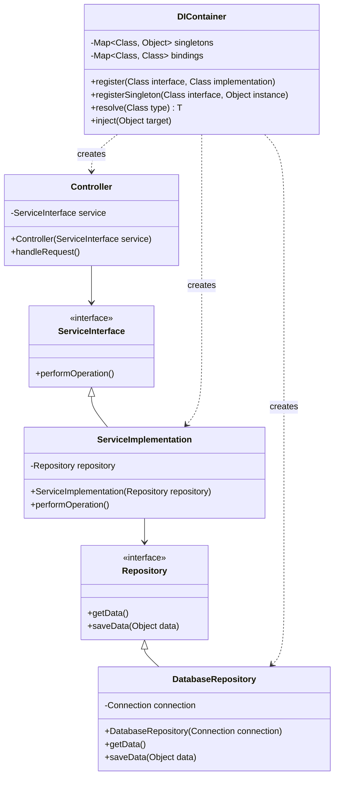

# Dependency Injection Pattern - Modern Enterprise Development

In software development, we often have objects that depend on other objects to perform their work, creating tight coupling and making testing and maintenance difficult.

**Example:** Services depending on repositories, controllers depending on services, components depending on external APIs, etc.

Direct object instantiation creates tight coupling, makes unit testing difficult, and violates the Dependency Inversion Principle.

This is where the **Dependency Injection Design Pattern** comes into play.

It's a fundamental pattern in modern enterprise development that promotes loose coupling and is essential for testable, maintainable applications.

## What is Dependency Injection Pattern?

Dependency Injection (DI) is a design pattern that implements Inversion of Control (IoC) for resolving dependencies. Instead of objects creating their dependencies directly, dependencies are provided (injected) from external sources.

It separates object creation from business logic, making code more modular, testable, and maintainable.

The pattern follows the Dependency Inversion Principle by depending on abstractions rather than concrete implementations.

## Class Diagram



## Implementation

### 1. Simple Dependency Injection Container

```java
import java.lang.annotation.*;
import java.lang.reflect.*;
import java.util.*;
import java.util.concurrent.ConcurrentHashMap;

// Annotations for DI
@Retention(RetentionPolicy.RUNTIME)
@Target(ElementType.CONSTRUCTOR)
@interface Inject {
}

@Retention(RetentionPolicy.RUNTIME)
@Target(ElementType.TYPE)
@interface Component {
    String value() default "";
}

@Retention(RetentionPolicy.RUNTIME)
@Target(ElementType.TYPE)
@interface Service {
    String value() default "";
}

@Retention(RetentionPolicy.RUNTIME)
@Target(ElementType.TYPE)
@interface Repository {
    String value() default "";
}

@Retention(RetentionPolicy.RUNTIME)
@Target(ElementType.TYPE)
@interface Singleton {
}

// Simple DI Container
class DIContainer {
    private final Map<Class<?>, Class<?>> interfaceToImplementation = new ConcurrentHashMap<>();
    private final Map<Class<?>, Object> singletonInstances = new ConcurrentHashMap<>();
    private final Map<String, Object> namedInstances = new ConcurrentHashMap<>();
    private final Set<Class<?>> singletonClasses = ConcurrentHashMap.newKeySet();

    // Register interface to implementation mapping
    public <T> DIContainer register(Class<T> interfaceClass, Class<? extends T> implementationClass) {
        interfaceToImplementation.put(interfaceClass, implementationClass);

        // Check if implementation is singleton
        if (implementationClass.isAnnotationPresent(Singleton.class)) {
            singletonClasses.add(implementationClass);
        }

        System.out.println("Registered: " + interfaceClass.getSimpleName() +
                          " -> " + implementationClass.getSimpleName());
        return this;
    }

    // Register singleton instance
    public <T> DIContainer registerSingleton(Class<T> clazz, T instance) {
        singletonInstances.put(clazz, instance);
        System.out.println("Registered singleton: " + clazz.getSimpleName());
        return this;
    }

    // Register named instance
    public <T> DIContainer registerNamed(String name, T instance) {
        namedInstances.put(name, instance);
        System.out.println("Registered named instance: " + name);
        return this;
    }

    // Resolve dependency
    @SuppressWarnings("unchecked")
    public <T> T resolve(Class<T> clazz) {
        try {
            // Check if it's already a singleton instance
            if (singletonInstances.containsKey(clazz)) {
                return (T) singletonInstances.get(clazz);
            }

            // Get implementation class
            Class<?> implementationClass = interfaceToImplementation.getOrDefault(clazz, clazz);

            // Check if we need to create singleton
            if (singletonClasses.contains(implementationClass)) {
                if (singletonInstances.containsKey(implementationClass)) {
                    return (T) singletonInstances.get(implementationClass);
                } else {
                    T instance = (T) createInstance(implementationClass);
                    singletonInstances.put(implementationClass, instance);
                    return instance;
                }
            }

            // Create new instance
            return (T) createInstance(implementationClass);

        } catch (Exception e) {
            throw new RuntimeException("Failed to resolve: " + clazz.getName(), e);
        }
    }

    // Get named instance
    @SuppressWarnings("unchecked")
    public <T> T resolveNamed(String name, Class<T> clazz) {
        Object instance = namedInstances.get(name);
        if (instance == null) {
            throw new RuntimeException("No named instance found: " + name);
        }
        return (T) instance;
    }

    // Create instance with dependency injection
    private Object createInstance(Class<?> clazz) throws Exception {
        // Find constructor with @Inject annotation
        Constructor<?>[] constructors = clazz.getConstructors();
        Constructor<?> injectConstructor = null;

        for (Constructor<?> constructor : constructors) {
            if (constructor.isAnnotationPresent(Inject.class)) {
                injectConstructor = constructor;
                break;
            }
        }

        // If no @Inject constructor, use default constructor
        if (injectConstructor == null) {
            injectConstructor = clazz.getConstructor();
        }

        // Resolve constructor parameters
        Class<?>[] parameterTypes = injectConstructor.getParameterTypes();
        Object[] parameters = new Object[parameterTypes.length];

        for (int i = 0; i < parameterTypes.length; i++) {
            parameters[i] = resolve(parameterTypes[i]);
        }

        Object instance = injectConstructor.newInstance(parameters);
        System.out.println("Created instance: " + clazz.getSimpleName());
        return instance;
    }

    // Auto-wire existing object
    public void inject(Object target) {
        Class<?> clazz = target.getClass();
        Field[] fields = clazz.getDeclaredFields();

        for (Field field : fields) {
            if (field.isAnnotationPresent(Inject.class)) {
                try {
                    field.setAccessible(true);
                    Object dependency = resolve(field.getType());
                    field.set(target, dependency);
                    System.out.println("Injected " + field.getType().getSimpleName() +
                                     " into " + clazz.getSimpleName());
                } catch (Exception e) {
                    throw new RuntimeException("Failed to inject field: " + field.getName(), e);
                }
            }
        }
    }

    // Auto-scan and register components
    public void scanAndRegister(String packageName) {
        // In a real implementation, this would scan classpath
        // For demo purposes, we'll manually register some classes
        System.out.println("Scanning package: " + packageName);
    }

    // Get all registered interfaces
    public Set<Class<?>> getRegisteredInterfaces() {
        return new HashSet<>(interfaceToImplementation.keySet());
    }

    // Clear all registrations
    public void clear() {
        interfaceToImplementation.clear();
        singletonInstances.clear();
        namedInstances.clear();
        singletonClasses.clear();
        System.out.println("Container cleared");
    }
}

// Example Domain Classes
interface UserRepository {
    User findById(Long id);
    void save(User user);
    List<User> findAll();
}

interface EmailService {
    void sendEmail(String to, String subject, String body);
    boolean isConfigured();
}

interface NotificationService {
    void sendNotification(String userId, String message);
    void sendBulkNotification(List<String> userIds, String message);
}

// Domain Entity
class User {
    private Long id;
    private String username;
    private String email;
    private boolean active;

    public User(Long id, String username, String email) {
        this.id = id;
        this.username = username;
        this.email = email;
        this.active = true;
    }

    // Getters and setters
    public Long getId() { return id; }
    public String getUsername() { return username; }
    public String getEmail() { return email; }
    public boolean isActive() { return active; }
    public void setActive(boolean active) { this.active = active; }

    @Override
    public String toString() {
        return String.format("User{id=%d, username='%s', email='%s', active=%s}",
                            id, username, email, active);
    }
}

// Repository Implementation
@Repository
@Singleton
class DatabaseUserRepository implements UserRepository {
    private final Map<Long, User> database = new HashMap<>();
    private Long nextId = 1L;

    public DatabaseUserRepository() {
        // Initialize with some test data
        database.put(1L, new User(1L, "john_doe", "john@example.com"));
        database.put(2L, new User(2L, "jane_smith", "jane@example.com"));
        nextId = 3L;
        System.out.println("DatabaseUserRepository initialized");
    }

    @Override
    public User findById(Long id) {
        System.out.println("Finding user by ID: " + id);
        return database.get(id);
    }

    @Override
    public void save(User user) {
        if (user.getId() == null) {
            user = new User(nextId++, user.getUsername(), user.getEmail());
        }
        database.put(user.getId(), user);
        System.out.println("Saved user: " + user);
    }

    @Override
    public List<User> findAll() {
        System.out.println("Finding all users");
        return new ArrayList<>(database.values());
    }
}

// Email Service Implementation
@Service
@Singleton
class SMTPEmailService implements EmailService {
    private boolean configured = true;

    public SMTPEmailService() {
        System.out.println("SMTPEmailService initialized");
    }

    @Override
    public void sendEmail(String to, String subject, String body) {
        if (!configured) {
            throw new RuntimeException("Email service not configured");
        }
        System.out.println("Sending email to: " + to);
        System.out.println("Subject: " + subject);
        System.out.println("Body: " + body);
    }

    @Override
    public boolean isConfigured() {
        return configured;
    }
}

// Notification Service Implementation
@Service
class DefaultNotificationService implements NotificationService {
    private final UserRepository userRepository;
    private final EmailService emailService;

    @Inject
    public DefaultNotificationService(UserRepository userRepository, EmailService emailService) {
        this.userRepository = userRepository;
        this.emailService = emailService;
        System.out.println("DefaultNotificationService initialized with dependencies");
    }

    @Override
    public void sendNotification(String userId, String message) {
        try {
            Long id = Long.parseLong(userId);
            User user = userRepository.findById(id);

            if (user != null && user.isActive()) {
                emailService.sendEmail(user.getEmail(), "Notification", message);
                System.out.println("Notification sent to user: " + user.getUsername());
            } else {
                System.out.println("User not found or inactive: " + userId);
            }
        } catch (NumberFormatException e) {
            System.out.println("Invalid user ID: " + userId);
        }
    }

    @Override
    public void sendBulkNotification(List<String> userIds, String message) {
        System.out.println("Sending bulk notification to " + userIds.size() + " users");
        for (String userId : userIds) {
            sendNotification(userId, message);
        }
    }
}

// Business Service
@Service
class UserService {
    private final UserRepository userRepository;
    private final NotificationService notificationService;

    @Inject
    public UserService(UserRepository userRepository, NotificationService notificationService) {
        this.userRepository = userRepository;
        this.notificationService = notificationService;
        System.out.println("UserService initialized with dependencies");
    }

    public User createUser(String username, String email) {
        User user = new User(null, username, email);
        userRepository.save(user);

        notificationService.sendNotification(user.getId().toString(),
                                           "Welcome to our platform, " + username + "!");

        return user;
    }

    public User getUserById(Long id) {
        return userRepository.findById(id);
    }

    public List<User> getAllUsers() {
        return userRepository.findAll();
    }

    public void deactivateUser(Long id) {
        User user = userRepository.findById(id);
        if (user != null) {
            user.setActive(false);
            userRepository.save(user);
            notificationService.sendNotification(id.toString(),
                                               "Your account has been deactivated.");
        }
    }

    public void sendWelcomeNotifications() {
        List<User> users = userRepository.findAll();
        List<String> activeUserIds = users.stream()
                .filter(User::isActive)
                .map(user -> user.getId().toString())
                .collect(ArrayList::new, ArrayList::add, ArrayList::addAll);

        notificationService.sendBulkNotification(activeUserIds,
                                               "Welcome to our updated platform!");
    }
}

// Controller/Facade
@Component
class UserController {
    private final UserService userService;

    @Inject
    public UserController(UserService userService) {
        this.userService = userService;
        System.out.println("UserController initialized with UserService");
    }

    public void handleCreateUser(String username, String email) {
        System.out.println("\n=== Creating New User ===");
        try {
            User user = userService.createUser(username, email);
            System.out.println("User created successfully: " + user);
        } catch (Exception e) {
            System.out.println("Failed to create user: " + e.getMessage());
        }
    }

    public void handleGetUser(Long id) {
        System.out.println("\n=== Getting User ===");
        User user = userService.getUserById(id);
        if (user != null) {
            System.out.println("Found user: " + user);
        } else {
            System.out.println("User not found with ID: " + id);
        }
    }

    public void handleListUsers() {
        System.out.println("\n=== Listing All Users ===");
        List<User> users = userService.getAllUsers();
        users.forEach(user -> System.out.println("  " + user));
    }

    public void handleDeactivateUser(Long id) {
        System.out.println("\n=== Deactivating User ===");
        userService.deactivateUser(id);
        System.out.println("User deactivation request processed for ID: " + id);
    }

    public void handleSendWelcomeNotifications() {
        System.out.println("\n=== Sending Welcome Notifications ===");
        userService.sendWelcomeNotifications();
    }
}

// Configuration and Bootstrap
class ApplicationConfig {
    public static DIContainer configureDI() {
        DIContainer container = new DIContainer();

        // Register dependencies
        container.register(UserRepository.class, DatabaseUserRepository.class)
                .register(EmailService.class, SMTPEmailService.class)
                .register(NotificationService.class, DefaultNotificationService.class);

        System.out.println("DI Container configured successfully");
        return container;
    }

    public static DIContainer configureTestDI() {
        DIContainer container = new DIContainer();

        // Register mock implementations for testing
        container.register(UserRepository.class, MockUserRepository.class)
                .register(EmailService.class, MockEmailService.class)
                .register(NotificationService.class, DefaultNotificationService.class);

        System.out.println("Test DI Container configured successfully");
        return container;
    }
}

// Mock implementations for testing
class MockUserRepository implements UserRepository {
    private final Map<Long, User> mockData = new HashMap<>();

    public MockUserRepository() {
        mockData.put(1L, new User(1L, "test_user", "test@example.com"));
        System.out.println("MockUserRepository initialized");
    }

    @Override
    public User findById(Long id) {
        System.out.println("Mock: Finding user by ID: " + id);
        return mockData.get(id);
    }

    @Override
    public void save(User user) {
        System.out.println("Mock: Saving user: " + user.getUsername());
        mockData.put(user.getId(), user);
    }

    @Override
    public List<User> findAll() {
        System.out.println("Mock: Finding all users");
        return new ArrayList<>(mockData.values());
    }
}

class MockEmailService implements EmailService {
    private List<String> sentEmails = new ArrayList<>();

    public MockEmailService() {
        System.out.println("MockEmailService initialized");
    }

    @Override
    public void sendEmail(String to, String subject, String body) {
        String email = "To: " + to + ", Subject: " + subject;
        sentEmails.add(email);
        System.out.println("Mock: Email sent - " + email);
    }

    @Override
    public boolean isConfigured() {
        return true;
    }

    public List<String> getSentEmails() {
        return new ArrayList<>(sentEmails);
    }
}

// Application Entry Point
class DIApplication {
    private final DIContainer container;
    private final UserController userController;

    public DIApplication(DIContainer container) {
        this.container = container;
        this.userController = container.resolve(UserController.class);
    }

    public void run() {
        System.out.println("=== DI Application Started ===");

        // Demonstrate application functionality
        userController.handleListUsers();
        userController.handleGetUser(1L);
        userController.handleCreateUser("alice_wonder", "alice@wonderland.com");
        userController.handleDeactivateUser(2L);
        userController.handleSendWelcomeNotifications();

        System.out.println("\n=== Application Finished ===");
    }

    public UserController getUserController() {
        return userController;
    }
}

// Usage Example
class DependencyInjectionExample {
    public static void main(String[] args) {
        System.out.println("=== Dependency Injection Pattern Example ===");

        // Production configuration
        System.out.println("\n" + "=".repeat(50));
        System.out.println("PRODUCTION CONFIGURATION");
        System.out.println("=".repeat(50));

        DIContainer productionContainer = ApplicationConfig.configureDI();
        DIApplication productionApp = new DIApplication(productionContainer);
        productionApp.run();

        // Test configuration
        System.out.println("\n" + "=".repeat(50));
        System.out.println("TEST CONFIGURATION");
        System.out.println("=".repeat(50));

        DIContainer testContainer = ApplicationConfig.configureTestDI();
        DIApplication testApp = new DIApplication(testContainer);
        testApp.run();

        // Manual dependency injection example
        System.out.println("\n" + "=".repeat(50));
        System.out.println("MANUAL INJECTION EXAMPLE");
        System.out.println("=".repeat(50));

        manualInjectionExample(productionContainer);
    }

    private static void manualInjectionExample(DIContainer container) {
        // Create object without DI first
        class ManualService {
            @Inject
            private UserRepository userRepository;

            public void performOperation() {
                if (userRepository != null) {
                    List<User> users = userRepository.findAll();
                    System.out.println("Manual service found " + users.size() + " users");
                } else {
                    System.out.println("UserRepository not injected!");
                }
            }
        }

        ManualService service = new ManualService();
        System.out.println("Before injection:");
        service.performOperation();

        // Inject dependencies
        container.inject(service);
        System.out.println("After injection:");
        service.performOperation();
    }
}
```

### 2. Spring-Style Dependency Injection

```java
import java.lang.annotation.*;
import java.util.*;

// Spring-style annotations
@Retention(RetentionPolicy.RUNTIME)
@Target(ElementType.TYPE)
@interface Configuration {
}

@Retention(RetentionPolicy.RUNTIME)
@Target(ElementType.METHOD)
@interface Bean {
    String name() default "";
}

@Retention(RetentionPolicy.RUNTIME)
@Target({ElementType.FIELD, ElementType.PARAMETER, ElementType.METHOD})
@interface Autowired {
    boolean required() default true;
}

@Retention(RetentionPolicy.RUNTIME)
@Target({ElementType.FIELD, ElementType.PARAMETER})
@interface Qualifier {
    String value();
}

@Retention(RetentionPolicy.RUNTIME)
@Target(ElementType.TYPE)
@interface Profile {
    String[] value();
}

// Application Context (Spring-like container)
class ApplicationContext {
    private final Map<String, Object> beans = new HashMap<>();
    private final Map<Class<?>, String> typeToName = new HashMap<>();
    private final Map<String, Class<?>> nameToType = new HashMap<>();
    private String activeProfile = "default";

    public void setActiveProfile(String profile) {
        this.activeProfile = profile;
        System.out.println("Active profile set to: " + profile);
    }

    public String getActiveProfile() {
        return activeProfile;
    }

    // Register bean
    public <T> void registerBean(String name, T bean) {
        beans.put(name, bean);
        typeToName.put(bean.getClass(), name);
        nameToType.put(name, bean.getClass());
        System.out.println("Registered bean: " + name + " of type " + bean.getClass().getSimpleName());
    }

    // Get bean by name
    @SuppressWarnings("unchecked")
    public <T> T getBean(String name) {
        Object bean = beans.get(name);
        if (bean == null) {
            throw new RuntimeException("Bean not found: " + name);
        }
        return (T) bean;
    }

    // Get bean by type
    @SuppressWarnings("unchecked")
    public <T> T getBean(Class<T> type) {
        String name = typeToName.get(type);
        if (name == null) {
            // Look for beans that implement the interface
            for (Map.Entry<String, Object> entry : beans.entrySet()) {
                if (type.isAssignableFrom(entry.getValue().getClass())) {
                    return (T) entry.getValue();
                }
            }
            throw new RuntimeException("Bean not found for type: " + type.getName());
        }
        return getBean(name);
    }

    // Get bean by name and type
    @SuppressWarnings("unchecked")
    public <T> T getBean(String name, Class<T> type) {
        Object bean = beans.get(name);
        if (bean == null) {
            throw new RuntimeException("Bean not found: " + name);
        }
        if (!type.isAssignableFrom(bean.getClass())) {
            throw new RuntimeException("Bean " + name + " is not of type " + type.getName());
        }
        return (T) bean;
    }

    // Check if bean exists
    public boolean containsBean(String name) {
        return beans.containsKey(name);
    }

    // Get all bean names of a specific type
    public String[] getBeanNamesForType(Class<?> type) {
        return beans.entrySet().stream()
                .filter(entry -> type.isAssignableFrom(entry.getValue().getClass()))
                .map(Map.Entry::getKey)
                .toArray(String[]::new);
    }

    // Get all beans of a specific type
    @SuppressWarnings("unchecked")
    public <T> Map<String, T> getBeansOfType(Class<T> type) {
        Map<String, T> result = new HashMap<>();
        for (Map.Entry<String, Object> entry : beans.entrySet()) {
            if (type.isAssignableFrom(entry.getValue().getClass())) {
                result.put(entry.getKey(), (T) entry.getValue());
            }
        }
        return result;
    }

    // Auto-wire dependencies
    public void autowire(Object target) {
        Class<?> clazz = target.getClass();

        // Autowire fields
        for (Field field : clazz.getDeclaredFields()) {
            if (field.isAnnotationPresent(Autowired.class)) {
                autowireField(target, field);
            }
        }

        // Autowire setter methods
        for (Method method : clazz.getDeclaredMethods()) {
            if (method.isAnnotationPresent(Autowired.class) &&
                method.getName().startsWith("set") &&
                method.getParameterCount() == 1) {
                autowireMethod(target, method);
            }
        }
    }

    private void autowireField(Object target, Field field) {
        try {
            field.setAccessible(true);
            Class<?> fieldType = field.getType();
            Object dependency;

            // Check for @Qualifier
            if (field.isAnnotationPresent(Qualifier.class)) {
                String beanName = field.getAnnotation(Qualifier.class).value();
                dependency = getBean(beanName, fieldType);
            } else {
                dependency = getBean(fieldType);
            }

            field.set(target, dependency);
            System.out.println("Autowired field: " + field.getName() + " in " + target.getClass().getSimpleName());

        } catch (Exception e) {
            Autowired autowired = field.getAnnotation(Autowired.class);
            if (autowired.required()) {
                throw new RuntimeException("Failed to autowire field: " + field.getName(), e);
            } else {
                System.out.println("Optional autowire failed for field: " + field.getName());
            }
        }
    }

    private void autowireMethod(Object target, Method method) {
        try {
            Class<?>[] paramTypes = method.getParameterTypes();
            Object[] args = new Object[paramTypes.length];

            for (int i = 0; i < paramTypes.length; i++) {
                args[i] = getBean(paramTypes[i]);
            }

            method.setAccessible(true);
            method.invoke(target, args);
            System.out.println("Autowired method: " + method.getName() + " in " + target.getClass().getSimpleName());

        } catch (Exception e) {
            throw new RuntimeException("Failed to autowire method: " + method.getName(), e);
        }
    }

    // Process @Configuration classes
    public void processConfiguration(Object configObject) {
        Class<?> configClass = configObject.getClass();

        if (!configClass.isAnnotationPresent(Configuration.class)) {
            throw new IllegalArgumentException("Class is not annotated with @Configuration");
        }

        // Check profile
        if (configClass.isAnnotationPresent(Profile.class)) {
            Profile profile = configClass.getAnnotation(Profile.class);
            boolean profileMatches = Arrays.asList(profile.value()).contains(activeProfile);
            if (!profileMatches) {
                System.out.println("Skipping configuration " + configClass.getSimpleName() +
                                 " - profile mismatch");
                return;
            }
        }

        // Process @Bean methods
        for (Method method : configClass.getDeclaredMethods()) {
            if (method.isAnnotationPresent(Bean.class)) {
                processBeanMethod(configObject, method);
            }
        }
    }

    private void processBeanMethod(Object configObject, Method method) {
        try {
            Bean beanAnnotation = method.getAnnotation(Bean.class);
            String beanName = beanAnnotation.name().isEmpty() ?
                             method.getName() : beanAnnotation.name();

            // Resolve method parameters
            Class<?>[] paramTypes = method.getParameterTypes();
            Object[] args = new Object[paramTypes.length];

            for (int i = 0; i < paramTypes.length; i++) {
                args[i] = getBean(paramTypes[i]);
            }

            // Invoke bean method
            method.setAccessible(true);
            Object bean = method.invoke(configObject, args);

            // Register the bean
            registerBean(beanName, bean);

        } catch (Exception e) {
            throw new RuntimeException("Failed to process bean method: " + method.getName(), e);
        }
    }

    // Shutdown context
    public void close() {
        beans.clear();
        typeToName.clear();
        nameToType.clear();
        System.out.println("Application context closed");
    }
}

// Example Services for Spring-style DI
interface PaymentProcessor {
    boolean processPayment(double amount, String cardNumber);
    String getProcessorName();
}

interface AuditLogger {
    void logTransaction(String transactionId, double amount, String status);
    List<String> getAuditTrail();
}

// Implementations
class CreditCardProcessor implements PaymentProcessor {
    @Override
    public boolean processPayment(double amount, String cardNumber) {
        System.out.println("Processing credit card payment: $" + amount);
        // Simulate processing
        return amount > 0 && cardNumber != null && cardNumber.length() >= 16;
    }

    @Override
    public String getProcessorName() {
        return "Credit Card Processor";
    }
}

class PayPalProcessor implements PaymentProcessor {
    @Override
    public boolean processPayment(double amount, String cardNumber) {
        System.out.println("Processing PayPal payment: $" + amount);
        // Simulate processing
        return amount > 0;
    }

    @Override
    public String getProcessorName() {
        return "PayPal Processor";
    }
}

class DatabaseAuditLogger implements AuditLogger {
    private final List<String> auditTrail = new ArrayList<>();

    @Override
    public void logTransaction(String transactionId, double amount, String status) {
        String logEntry = String.format("Transaction %s: $%.2f - %s",
                                       transactionId, amount, status);
        auditTrail.add(logEntry);
        System.out.println("DB Audit: " + logEntry);
    }

    @Override
    public List<String> getAuditTrail() {
        return new ArrayList<>(auditTrail);
    }
}

class FileAuditLogger implements AuditLogger {
    private final List<String> auditTrail = new ArrayList<>();

    @Override
    public void logTransaction(String transactionId, double amount, String status) {
        String logEntry = String.format("File Log - Transaction %s: $%.2f - %s",
                                       transactionId, amount, status);
        auditTrail.add(logEntry);
        System.out.println("File Audit: " + logEntry);
    }

    @Override
    public List<String> getAuditTrail() {
        return new ArrayList<>(auditTrail);
    }
}

// Service that uses DI
class PaymentService {
    @Autowired
    @Qualifier("primaryProcessor")
    private PaymentProcessor primaryProcessor;

    @Autowired
    @Qualifier("secondaryProcessor")
    private PaymentProcessor secondaryProcessor;

    @Autowired
    private AuditLogger auditLogger;

    private int transactionCounter = 1000;

    public boolean processPayment(double amount, String cardNumber) {
        String transactionId = "TXN" + (++transactionCounter);

        System.out.println("\n=== Processing Payment ===");
        System.out.println("Transaction ID: " + transactionId);
        System.out.println("Amount: $" + amount);

        // Try primary processor first
        boolean success = primaryProcessor.processPayment(amount, cardNumber);

        if (!success) {
            System.out.println("Primary processor failed, trying secondary...");
            success = secondaryProcessor.processPayment(amount, cardNumber);
        }

        String status = success ? "SUCCESS" : "FAILED";
        auditLogger.logTransaction(transactionId, amount, status);

        System.out.println("Payment " + status);
        return success;
    }

    public void displayProcessorInfo() {
        System.out.println("Primary: " + primaryProcessor.getProcessorName());
        System.out.println("Secondary: " + secondaryProcessor.getProcessorName());
    }

    public List<String> getAuditTrail() {
        return auditLogger.getAuditTrail();
    }
}

// Configuration classes
@Configuration
@Profile({"default", "production"})
class ProductionConfig {

    @Bean(name = "primaryProcessor")
    public PaymentProcessor primaryPaymentProcessor() {
        return new CreditCardProcessor();
    }

    @Bean(name = "secondaryProcessor")
    public PaymentProcessor secondaryPaymentProcessor() {
        return new PayPalProcessor();
    }

    @Bean
    public AuditLogger auditLogger() {
        return new DatabaseAuditLogger();
    }

    @Bean
    public PaymentService paymentService() {
        return new PaymentService();
    }
}

@Configuration
@Profile("test")
class TestConfig {

    @Bean(name = "primaryProcessor")
    public PaymentProcessor primaryPaymentProcessor() {
        return new PayPalProcessor(); // Different primary in test
    }

    @Bean(name = "secondaryProcessor")
    public PaymentProcessor secondaryPaymentProcessor() {
        return new CreditCardProcessor();
    }

    @Bean
    public AuditLogger auditLogger() {
        return new FileAuditLogger(); // File logging for tests
    }

    @Bean
    public PaymentService paymentService() {
        return new PaymentService();
    }
}

// Usage Example
class SpringStyleDIExample {
    public static void main(String[] args) {
        System.out.println("=== Spring-Style Dependency Injection Example ===");

        // Production configuration
        System.out.println("\n" + "=".repeat(50));
        System.out.println("PRODUCTION CONFIGURATION");
        System.out.println("=".repeat(50));

        runWithProfile("production");

        // Test configuration
        System.out.println("\n" + "=".repeat(50));
        System.out.println("TEST CONFIGURATION");
        System.out.println("=".repeat(50));

        runWithProfile("test");
    }

    private static void runWithProfile(String profile) {
        ApplicationContext context = new ApplicationContext();
        context.setActiveProfile(profile);

        try {
            // Process configuration
            if ("production".equals(profile)) {
                context.processConfiguration(new ProductionConfig());
            } else {
                context.processConfiguration(new TestConfig());
            }

            // Get payment service and autowire its dependencies
            PaymentService paymentService = context.getBean("paymentService", PaymentService.class);
            context.autowire(paymentService);

            // Test the service
            paymentService.displayProcessorInfo();

            paymentService.processPayment(100.0, "1234567890123456");
            paymentService.processPayment(50.0, null); // This should fail and fallback
            paymentService.processPayment(-10.0, "1234567890123456"); // This should fail

            // Display audit trail
            System.out.println("\n=== Audit Trail ===");
            paymentService.getAuditTrail().forEach(System.out::println);

        } finally {
            context.close();
        }
    }
}
```

## Test Code

```java
import org.junit.jupiter.api.Test;
import org.junit.jupiter.api.BeforeEach;
import org.junit.jupiter.api.AfterEach;
import static org.junit.jupiter.api.Assertions.*;

class DependencyInjectionPatternTest {
    private DIContainer container;

    @BeforeEach
    void setUp() {
        container = new DIContainer();
    }

    @AfterEach
    void tearDown() {
        container.clear();
    }

    @Test
    void testBasicDependencyInjection() {
        // Register dependencies
        container.register(UserRepository.class, DatabaseUserRepository.class)
                .register(EmailService.class, SMTPEmailService.class)
                .register(NotificationService.class, DefaultNotificationService.class);

        // Resolve UserService
        UserService userService = container.resolve(UserService.class);
        assertNotNull(userService);

        // Test functionality
        User user = userService.createUser("test_user", "test@example.com");
        assertNotNull(user);
        assertEquals("test_user", user.getUsername());
        assertEquals("test@example.com", user.getEmail());
    }

    @Test
    void testSingletonBehavior() {
        container.register(UserRepository.class, DatabaseUserRepository.class);

        // Should get same instance for singleton
        UserRepository repo1 = container.resolve(UserRepository.class);
        UserRepository repo2 = container.resolve(UserRepository.class);

        assertSame(repo1, repo2);
    }

    @Test
    void testNonSingletonBehavior() {
        container.register(NotificationService.class, DefaultNotificationService.class)
                .register(UserRepository.class, DatabaseUserRepository.class)
                .register(EmailService.class, SMTPEmailService.class);

        // Should get different instances for non-singleton
        NotificationService service1 = container.resolve(NotificationService.class);
        NotificationService service2 = container.resolve(NotificationService.class);

        assertNotSame(service1, service2);
    }

    @Test
    void testNamedRegistration() {
        EmailService emailService = new SMTPEmailService();
        container.registerNamed("testEmailService", emailService);

        EmailService resolved = container.resolveNamed("testEmailService", EmailService.class);
        assertSame(emailService, resolved);
    }

    @Test
    void testFieldInjection() {
        container.register(UserRepository.class, MockUserRepository.class);

        class TestService {
            @Inject
            private UserRepository userRepository;

            public UserRepository getRepository() {
                return userRepository;
            }
        }

        TestService service = new TestService();
        assertNull(service.getRepository()); // Before injection

        container.inject(service);
        assertNotNull(service.getRepository()); // After injection
    }

    @Test
    void testDependencyResolutionFailure() {
        // Try to resolve unregistered dependency
        assertThrows(RuntimeException.class, () -> {
            container.resolve(UserRepository.class);
        });
    }

    @Test
    void testCircularDependencyHandling() {
        // This test demonstrates that our simple container doesn't handle
        // circular dependencies, which is expected behavior

        interface ServiceA {
            void doSomething();
        }

        interface ServiceB {
            void doSomethingElse();
        }

        class ServiceAImpl implements ServiceA {
            @Inject
            public ServiceAImpl(ServiceB serviceB) {}

            @Override
            public void doSomething() {}
        }

        class ServiceBImpl implements ServiceB {
            @Inject
            public ServiceBImpl(ServiceA serviceA) {}

            @Override
            public void doSomethingElse() {}
        }

        container.register(ServiceA.class, ServiceAImpl.class)
                .register(ServiceB.class, ServiceBImpl.class);

        // This should fail with circular dependency
        assertThrows(Exception.class, () -> {
            container.resolve(ServiceA.class);
        });
    }

    @Test
    void testSpringStyleDI() {
        ApplicationContext context = new ApplicationContext();

        // Test bean registration
        PaymentProcessor processor = new CreditCardProcessor();
        context.registerBean("processor", processor);

        assertTrue(context.containsBean("processor"));
        PaymentProcessor resolved = context.getBean("processor", PaymentProcessor.class);
        assertSame(processor, resolved);

        // Test type-based resolution
        PaymentProcessor byType = context.getBean(PaymentProcessor.class);
        assertSame(processor, byType);

        context.close();
    }

    @Test
    void testApplicationContextAutowiring() {
        ApplicationContext context = new ApplicationContext();

        // Register beans manually
        context.registerBean("primaryProcessor", new CreditCardProcessor());
        context.registerBean("secondaryProcessor", new PayPalProcessor());
        context.registerBean("auditLogger", new DatabaseAuditLogger());

        // Create service and autowire
        PaymentService service = new PaymentService();
        context.autowire(service);

        // Test that autowiring worked
        assertDoesNotThrow(() -> {
            service.displayProcessorInfo();
            service.processPayment(100.0, "1234567890123456");
        });

        context.close();
    }

    @Test
    void testConfigurationProcessing() {
        ApplicationContext context = new ApplicationContext();
        context.setActiveProfile("production");

        ProductionConfig config = new ProductionConfig();
        context.processConfiguration(config);

        // Verify beans were created
        assertTrue(context.containsBean("primaryProcessor"));
        assertTrue(context.containsBean("secondaryProcessor"));
        assertTrue(context.containsBean("auditLogger"));
        assertTrue(context.containsBean("paymentService"));

        // Verify types
        PaymentProcessor primary = context.getBean("primaryProcessor", PaymentProcessor.class);
        assertTrue(primary instanceof CreditCardProcessor);

        AuditLogger logger = context.getBean(AuditLogger.class);
        assertTrue(logger instanceof DatabaseAuditLogger);

        context.close();
    }

    @Test
    void testProfileBasedConfiguration() {
        // Test production profile
        ApplicationContext prodContext = new ApplicationContext();
        prodContext.setActiveProfile("production");
        prodContext.processConfiguration(new ProductionConfig());

        AuditLogger prodLogger = prodContext.getBean(AuditLogger.class);
        assertTrue(prodLogger instanceof DatabaseAuditLogger);
        prodContext.close();

        // Test test profile
        ApplicationContext testContext = new ApplicationContext();
        testContext.setActiveProfile("test");
        testContext.processConfiguration(new TestConfig());

        AuditLogger testLogger = testContext.getBean(AuditLogger.class);
        assertTrue(testLogger instanceof FileAuditLogger);
        testContext.close();
    }

    @Test
    void testMockDependencies() {
        // Configure with mock dependencies
        DIContainer mockContainer = ApplicationConfig.configureTestDI();

        UserService userService = mockContainer.resolve(UserService.class);
        assertNotNull(userService);

        // Test with mocks
        User user = userService.createUser("mock_user", "mock@example.com");
        assertNotNull(user);
        assertEquals("mock_user", user.getUsername());

        mockContainer.clear();
    }
}
```

## Real-World Examples of Dependency Injection Pattern

### 1. **Enterprise Frameworks**

- **Spring Framework**: Comprehensive DI container with annotations and XML configuration
- **Google Guice**: Lightweight DI framework with binding DSL
- **CDI (Java EE)**: Context and Dependency Injection specification
- **Dagger**: Compile-time DI framework for Android and Java

### 2. **Web Applications**

- **Spring Boot**: Auto-configuration with dependency injection
- **Play Framework**: DI for controllers and services
- **Dropwizard**: Lightweight framework with built-in DI
- **Quarkus**: Cloud-native framework with CDI

### 3. **Testing Frameworks**

- **JUnit 5**: Extension model with dependency injection
- **TestNG**: Built-in dependency injection for test methods
- **Mockito**: Mock injection for unit testing
- **Spring Test**: Integration testing with DI

### 4. **Mobile Development**

- **Android**: Dagger/Hilt for dependency injection
- **iOS**: Swinject, Typhoon for Swift dependency injection
- **React Native**: Dependency injection containers
- **Flutter**: GetIt, Injectable for Dart DI

## Specific Examples:

**@Autowired in Spring**: Automatic dependency injection using annotations.

**@Inject in CDI**: Java EE standard dependency injection annotation.

**Provider<T> in Guice**: Lazy dependency resolution and scoping.

**Component in Angular**: Dependency injection in TypeScript frontend frameworks.

**Container in .NET**: Built-in dependency injection in ASP.NET Core.

## Pros and Cons of Dependency Injection Pattern

| **Pros**                                                             | **Cons**                                                           |
| -------------------------------------------------------------------- | ------------------------------------------------------------------ |
| ✅ **Loose Coupling**: Objects don't create their dependencies       | ❌ **Complexity**: Can make simple applications overly complex     |
| ✅ **Testability**: Easy to inject mocks and test doubles            | ❌ **Learning Curve**: Requires understanding of DI concepts       |
| ✅ **Maintainability**: Changes to dependencies don't affect clients | ❌ **Runtime Errors**: Dependency resolution failures at runtime   |
| ✅ **Flexibility**: Easy to swap implementations                     | ❌ **Performance**: Reflection-based injection can be slower       |
| ✅ **Single Responsibility**: Objects focus on business logic        | ❌ **Magic**: Can hide dependencies and make code harder to follow |

## Best Practices

### ⚠️ **Warnings & Considerations**

1. **Constructor Injection**: Prefer constructor injection over field injection for immutability
2. **Interface Segregation**: Use specific interfaces rather than large, general ones
3. **Circular Dependencies**: Design to avoid circular dependencies
4. **Scoping**: Understand singleton vs prototype scoping implications
5. **Configuration**: Keep DI configuration close to the code that uses it

### 🏆 **Modern Alternatives & Enhancements**

- **Annotation Processors**: Compile-time DI code generation (Dagger)
- **Reactive DI**: Dependency injection for reactive programming
- **Cloud-Native DI**: Integration with cloud configuration systems
- **Microservices DI**: Service discovery and injection across services
- **Function-based DI**: Functional programming approaches to dependency management

### 💡 **When to Use Dependency Injection Pattern**

✅ **Use When:**

- Building enterprise applications with multiple layers
- You need to support multiple implementations of interfaces
- Testing with mocks and test doubles is important
- You want to decouple object creation from business logic
- Configuration needs to be externalized

❌ **Avoid When:**

- Building simple scripts or utilities
- Performance is critical and reflection overhead matters
- Team lacks experience with DI concepts
- Dependencies are stable and unlikely to change
- Application has very few objects and relationships

The Dependency Injection pattern is fundamental to modern enterprise development, enabling loose coupling, testability, and maintainability in complex applications.
