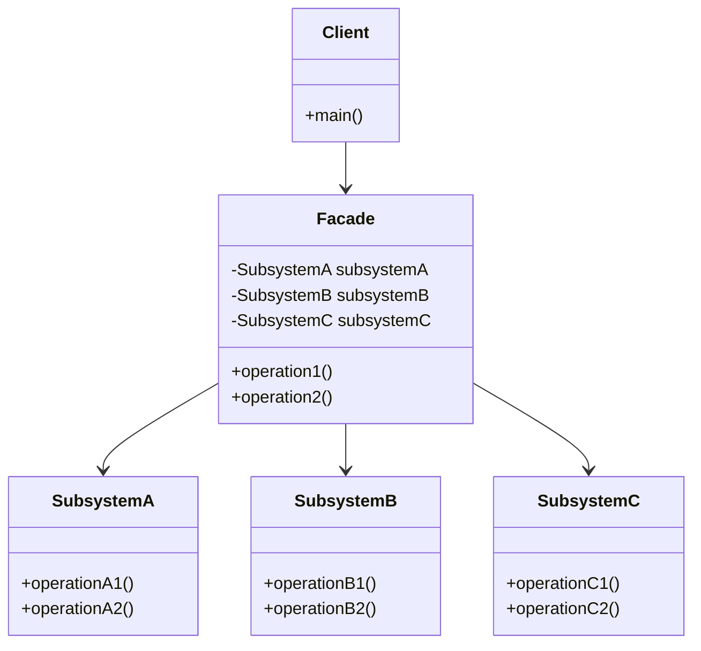

# Facade Pattern - Simplifying Complex Subsystems

In software development, we often work with complex subsystems that have many interdependent classes and intricate APIs.

**Example:** Third-party libraries, legacy systems, complex frameworks, multi-step workflows, etc.

Direct interaction with complex subsystems leads to tight coupling, difficult maintenance, and steep learning curves for clients.

This is where the **Facade Design Pattern** comes into play.

It's a fundamental structural pattern that provides a simplified interface to complex subsystems and is essential for enterprise applications.

## What is Facade Pattern?

Facade Pattern is a structural design pattern that provides a simplified interface to a complex subsystem. It defines a higher-level interface that makes the subsystem easier to use.

The facade doesn't encapsulate the subsystem but provides a convenient entry point to the most commonly used functionality.

It promotes loose coupling between clients and complex subsystems while still allowing direct access to subsystem classes when needed.

## Class Diagram



## Implementation

### 1. Home Theater System

```java
// Subsystem classes - Complex components
class DVDPlayer {
    private String movie;

    public void on() {
        System.out.println("DVD Player turned on");
    }

    public void off() {
        System.out.println("DVD Player turned off");
    }

    public void play(String movie) {
        this.movie = movie;
        System.out.println("DVD Player playing: " + movie);
    }

    public void stop() {
        System.out.println("DVD Player stopped");
        this.movie = null;
    }

    public void eject() {
        if (movie != null) {
            System.out.println("DVD Player ejecting: " + movie);
            this.movie = null;
        } else {
            System.out.println("No DVD to eject");
        }
    }
}

class Amplifier {
    private DVDPlayer dvdPlayer;
    private int volume = 5;

    public void on() {
        System.out.println("Amplifier turned on");
    }

    public void off() {
        System.out.println("Amplifier turned off");
    }

    public void setDVD(DVDPlayer dvdPlayer) {
        this.dvdPlayer = dvdPlayer;
        System.out.println("Amplifier setting DVD player");
    }

    public void setStereoSound() {
        System.out.println("Amplifier set to stereo mode");
    }

    public void setSurroundSound() {
        System.out.println("Amplifier set to surround sound (7.1)");
    }

    public void setVolume(int level) {
        this.volume = level;
        System.out.println("Amplifier volume set to " + level);
    }

    public int getVolume() {
        return volume;
    }
}

class Projector {
    private DVDPlayer dvdPlayer;
    private boolean isOn = false;

    public void on() {
        isOn = true;
        System.out.println("Projector turned on");
    }

    public void off() {
        isOn = false;
        System.out.println("Projector turned off");
    }

    public void setInput(DVDPlayer dvdPlayer) {
        this.dvdPlayer = dvdPlayer;
        System.out.println("Projector input set to DVD player");
    }

    public void wideScreenMode() {
        System.out.println("Projector set to widescreen mode (16:9)");
    }

    public void tvMode() {
        System.out.println("Projector set to TV mode (4:3)");
    }
}

class TheaterLights {
    private int brightness = 100;

    public void on() {
        brightness = 100;
        System.out.println("Theater lights on (100%)");
    }

    public void off() {
        brightness = 0;
        System.out.println("Theater lights off");
    }

    public void dim(int level) {
        brightness = level;
        System.out.println("Theater lights dimmed to " + level + "%");
    }

    public int getBrightness() {
        return brightness;
    }
}

class Screen {
    private boolean isDown = false;

    public void up() {
        isDown = false;
        System.out.println("Theater screen going up");
    }

    public void down() {
        isDown = true;
        System.out.println("Theater screen going down");
    }

    public boolean isDown() {
        return isDown;
    }
}

class PopcornPopper {
    private boolean isOn = false;

    public void on() {
        isOn = true;
        System.out.println("Popcorn popper turned on");
    }

    public void off() {
        isOn = false;
        System.out.println("Popcorn popper turned off");
    }

    public void pop() {
        if (isOn) {
            System.out.println("Popcorn popper popping corn!");
        } else {
            System.out.println("Popcorn popper is off, cannot pop");
        }
    }
}

// Facade - Simplified interface
class HomeTheaterFacade {
    private Amplifier amplifier;
    private DVDPlayer dvdPlayer;
    private Projector projector;
    private TheaterLights lights;
    private Screen screen;
    private PopcornPopper popper;

    public HomeTheaterFacade(Amplifier amplifier, DVDPlayer dvdPlayer,
                           Projector projector, TheaterLights lights,
                           Screen screen, PopcornPopper popper) {
        this.amplifier = amplifier;
        this.dvdPlayer = dvdPlayer;
        this.projector = projector;
        this.lights = lights;
        this.screen = screen;
        this.popper = popper;
    }

    public void watchMovie(String movie) {
        System.out.println("Get ready to watch a movie...");

        // Turn everything on and set up
        popper.on();
        popper.pop();
        lights.dim(10);
        screen.down();
        projector.on();
        projector.wideScreenMode();
        amplifier.on();
        amplifier.setDVD(dvdPlayer);
        amplifier.setSurroundSound();
        amplifier.setVolume(5);
        dvdPlayer.on();
        dvdPlayer.play(movie);

        System.out.println("Movie setup complete! Enjoy " + movie);
    }

    public void endMovie() {
        System.out.println("Shutting movie theater down...");

        popper.off();
        lights.on();
        screen.up();
        projector.off();
        amplifier.off();
        dvdPlayer.stop();
        dvdPlayer.eject();
        dvdPlayer.off();

        System.out.println("Movie theater shut down complete");
    }

    public void listenToMusic() {
        System.out.println("Setting up for music listening...");

        lights.dim(30);
        amplifier.on();
        amplifier.setStereoSound();
        amplifier.setVolume(7);

        System.out.println("Music setup complete!");
    }

    public void pauseMovie() {
        System.out.println("Pausing movie...");
        dvdPlayer.stop();
        lights.dim(50);
    }

    public void resumeMovie() {
        System.out.println("Resuming movie...");
        lights.dim(10);
        // Note: In real implementation, DVD player would resume from pause
        System.out.println("Movie resumed");
    }
}

// Usage Example
class HomeTheaterExample {
    public static void main(String[] args) {
        // Create all subsystem components
        Amplifier amplifier = new Amplifier();
        DVDPlayer dvdPlayer = new DVDPlayer();
        Projector projector = new Projector();
        TheaterLights lights = new TheaterLights();
        Screen screen = new Screen();
        PopcornPopper popper = new PopcornPopper();

        // Create facade
        HomeTheaterFacade homeTheater = new HomeTheaterFacade(
            amplifier, dvdPlayer, projector, lights, screen, popper);

        // Simple operations through facade
        System.out.println("=== Starting Movie Night ===");
        homeTheater.watchMovie("The Matrix");

        System.out.println("\n=== Taking a Break ===");
        homeTheater.pauseMovie();

        System.out.println("\n=== Resuming Movie ===");
        homeTheater.resumeMovie();

        System.out.println("\n=== Ending Movie Night ===");
        homeTheater.endMovie();

        System.out.println("\n=== Listening to Music ===");
        homeTheater.listenToMusic();
    }
}
```

### 2. Banking System Facade

```java
import java.math.BigDecimal;
import java.time.LocalDateTime;
import java.util.*;

// Subsystem classes - Complex banking components
class AccountService {
    private Map<String, BigDecimal> accounts = new HashMap<>();

    public AccountService() {
        // Initialize some accounts
        accounts.put("123456789", new BigDecimal("1000.00"));
        accounts.put("987654321", new BigDecimal("2500.00"));
        accounts.put("555666777", new BigDecimal("750.00"));
    }

    public boolean accountExists(String accountNumber) {
        boolean exists = accounts.containsKey(accountNumber);
        System.out.println("Account " + accountNumber + " exists: " + exists);
        return exists;
    }

    public BigDecimal getBalance(String accountNumber) {
        BigDecimal balance = accounts.getOrDefault(accountNumber, BigDecimal.ZERO);
        System.out.println("Account " + accountNumber + " balance: $" + balance);
        return balance;
    }

    public boolean hasSufficientFunds(String accountNumber, BigDecimal amount) {
        BigDecimal balance = getBalance(accountNumber);
        boolean sufficient = balance.compareTo(amount) >= 0;
        System.out.println("Account " + accountNumber + " has sufficient funds for $" + amount + ": " + sufficient);
        return sufficient;
    }

    public void debit(String accountNumber, BigDecimal amount) {
        if (accountExists(accountNumber)) {
            BigDecimal currentBalance = accounts.get(accountNumber);
            accounts.put(accountNumber, currentBalance.subtract(amount));
            System.out.println("Debited $" + amount + " from account " + accountNumber);
        }
    }

    public void credit(String accountNumber, BigDecimal amount) {
        if (accountExists(accountNumber)) {
            BigDecimal currentBalance = accounts.get(accountNumber);
            accounts.put(accountNumber, currentBalance.add(amount));
            System.out.println("Credited $" + amount + " to account " + accountNumber);
        }
    }
}

class SecurityService {
    private Map<String, String> customerPins = new HashMap<>();
    private Set<String> blockedAccounts = new HashSet<>();

    public SecurityService() {
        customerPins.put("123456789", "1234");
        customerPins.put("987654321", "5678");
        customerPins.put("555666777", "9999");
    }

    public boolean authenticateUser(String accountNumber, String pin) {
        if (blockedAccounts.contains(accountNumber)) {
            System.out.println("Account " + accountNumber + " is blocked");
            return false;
        }

        boolean authenticated = customerPins.get(accountNumber) != null &&
                              customerPins.get(accountNumber).equals(pin);
        System.out.println("Authentication for account " + accountNumber + ": " +
                          (authenticated ? "SUCCESS" : "FAILED"));
        return authenticated;
    }

    public void blockAccount(String accountNumber) {
        blockedAccounts.add(accountNumber);
        System.out.println("Account " + accountNumber + " has been blocked");
    }

    public void unblockAccount(String accountNumber) {
        blockedAccounts.remove(accountNumber);
        System.out.println("Account " + accountNumber + " has been unblocked");
    }

    public boolean isAccountBlocked(String accountNumber) {
        return blockedAccounts.contains(accountNumber);
    }
}

class TransactionService {
    private List<Transaction> transactions = new ArrayList<>();
    private int transactionCounter = 1000;

    public String createTransaction(String fromAccount, String toAccount,
                                  BigDecimal amount, String type) {
        String transactionId = "TXN" + (++transactionCounter);
        Transaction transaction = new Transaction(transactionId, fromAccount,
                                                toAccount, amount, type);
        transactions.add(transaction);
        System.out.println("Created transaction: " + transactionId + " for $" + amount);
        return transactionId;
    }

    public boolean processTransaction(String transactionId) {
        Transaction transaction = findTransaction(transactionId);
        if (transaction != null && transaction.getStatus().equals("PENDING")) {
            transaction.setStatus("COMPLETED");
            transaction.setCompletedTime(LocalDateTime.now());
            System.out.println("Transaction " + transactionId + " processed successfully");
            return true;
        }
        System.out.println("Failed to process transaction " + transactionId);
        return false;
    }

    public Transaction findTransaction(String transactionId) {
        return transactions.stream()
                .filter(t -> t.getTransactionId().equals(transactionId))
                .findFirst()
                .orElse(null);
    }

    public List<Transaction> getTransactionHistory(String accountNumber) {
        return transactions.stream()
                .filter(t -> t.getFromAccount().equals(accountNumber) ||
                           t.getToAccount().equals(accountNumber))
                .collect(ArrayList::new, ArrayList::add, ArrayList::addAll);
    }
}

class NotificationService {
    public void sendSMSNotification(String accountNumber, String message) {
        System.out.println("SMS to account " + accountNumber + ": " + message);
    }

    public void sendEmailNotification(String accountNumber, String message) {
        System.out.println("Email to account " + accountNumber + ": " + message);
    }

    public void sendTransactionAlert(String accountNumber, String transactionId,
                                   BigDecimal amount) {
        String message = "Transaction " + transactionId + " for $" + amount + " completed";
        sendSMSNotification(accountNumber, message);
        sendEmailNotification(accountNumber, message);
    }
}

class AuditService {
    private List<String> auditLog = new ArrayList<>();

    public void logTransaction(String accountNumber, String operation, BigDecimal amount) {
        String logEntry = LocalDateTime.now() + ": Account " + accountNumber +
                         " - " + operation + " $" + amount;
        auditLog.add(logEntry);
        System.out.println("AUDIT: " + logEntry);
    }

    public void logSecurity(String accountNumber, String operation) {
        String logEntry = LocalDateTime.now() + ": Account " + accountNumber +
                         " - " + operation;
        auditLog.add(logEntry);
        System.out.println("AUDIT: " + logEntry);
    }

    public List<String> getAuditLog() {
        return new ArrayList<>(auditLog);
    }
}

// Transaction data class
class Transaction {
    private String transactionId;
    private String fromAccount;
    private String toAccount;
    private BigDecimal amount;
    private String type;
    private String status;
    private LocalDateTime createdTime;
    private LocalDateTime completedTime;

    public Transaction(String transactionId, String fromAccount, String toAccount,
                      BigDecimal amount, String type) {
        this.transactionId = transactionId;
        this.fromAccount = fromAccount;
        this.toAccount = toAccount;
        this.amount = amount;
        this.type = type;
        this.status = "PENDING";
        this.createdTime = LocalDateTime.now();
    }

    // Getters and setters
    public String getTransactionId() { return transactionId; }
    public String getFromAccount() { return fromAccount; }
    public String getToAccount() { return toAccount; }
    public BigDecimal getAmount() { return amount; }
    public String getType() { return type; }
    public String getStatus() { return status; }
    public LocalDateTime getCreatedTime() { return createdTime; }
    public LocalDateTime getCompletedTime() { return completedTime; }

    public void setStatus(String status) { this.status = status; }
    public void setCompletedTime(LocalDateTime completedTime) { this.completedTime = completedTime; }
}

// Banking Facade - Simplified interface
class BankingFacade {
    private AccountService accountService;
    private SecurityService securityService;
    private TransactionService transactionService;
    private NotificationService notificationService;
    private AuditService auditService;

    public BankingFacade() {
        this.accountService = new AccountService();
        this.securityService = new SecurityService();
        this.transactionService = new TransactionService();
        this.notificationService = new NotificationService();
        this.auditService = new AuditService();
    }

    public boolean authenticateAndCheckBalance(String accountNumber, String pin) {
        System.out.println("\n=== Balance Inquiry ===");

        if (!securityService.authenticateUser(accountNumber, pin)) {
            auditService.logSecurity(accountNumber, "FAILED_AUTHENTICATION");
            return false;
        }

        if (!accountService.accountExists(accountNumber)) {
            return false;
        }

        BigDecimal balance = accountService.getBalance(accountNumber);
        auditService.logTransaction(accountNumber, "BALANCE_INQUIRY", balance);

        return true;
    }

    public boolean transferMoney(String fromAccount, String fromPin,
                               String toAccount, BigDecimal amount) {
        System.out.println("\n=== Money Transfer ===");

        // Authenticate user
        if (!securityService.authenticateUser(fromAccount, fromPin)) {
            auditService.logSecurity(fromAccount, "FAILED_TRANSFER_AUTHENTICATION");
            return false;
        }

        // Validate accounts
        if (!accountService.accountExists(fromAccount) || !accountService.accountExists(toAccount)) {
            System.out.println("One or both accounts do not exist");
            return false;
        }

        // Check funds
        if (!accountService.hasSufficientFunds(fromAccount, amount)) {
            System.out.println("Insufficient funds for transfer");
            auditService.logTransaction(fromAccount, "INSUFFICIENT_FUNDS", amount);
            return false;
        }

        // Create and process transaction
        String transactionId = transactionService.createTransaction(fromAccount, toAccount, amount, "TRANSFER");

        // Perform transfer
        accountService.debit(fromAccount, amount);
        accountService.credit(toAccount, amount);

        // Complete transaction
        transactionService.processTransaction(transactionId);

        // Send notifications
        notificationService.sendTransactionAlert(fromAccount, transactionId, amount);
        notificationService.sendTransactionAlert(toAccount, transactionId, amount);

        // Audit logging
        auditService.logTransaction(fromAccount, "TRANSFER_OUT", amount);
        auditService.logTransaction(toAccount, "TRANSFER_IN", amount);

        System.out.println("Transfer completed successfully!");
        return true;
    }

    public boolean withdrawMoney(String accountNumber, String pin, BigDecimal amount) {
        System.out.println("\n=== Cash Withdrawal ===");

        if (!securityService.authenticateUser(accountNumber, pin)) {
            auditService.logSecurity(accountNumber, "FAILED_WITHDRAWAL_AUTHENTICATION");
            return false;
        }

        if (!accountService.hasSufficientFunds(accountNumber, amount)) {
            System.out.println("Insufficient funds for withdrawal");
            auditService.logTransaction(accountNumber, "INSUFFICIENT_FUNDS", amount);
            return false;
        }

        String transactionId = transactionService.createTransaction(accountNumber, null, amount, "WITHDRAWAL");

        accountService.debit(accountNumber, amount);
        transactionService.processTransaction(transactionId);

        notificationService.sendTransactionAlert(accountNumber, transactionId, amount);
        auditService.logTransaction(accountNumber, "WITHDRAWAL", amount);

        System.out.println("Withdrawal completed successfully!");
        return true;
    }

    public void getTransactionHistory(String accountNumber, String pin) {
        System.out.println("\n=== Transaction History ===");

        if (!securityService.authenticateUser(accountNumber, pin)) {
            return;
        }

        List<Transaction> history = transactionService.getTransactionHistory(accountNumber);

        if (history.isEmpty()) {
            System.out.println("No transactions found for account " + accountNumber);
        } else {
            System.out.println("Transaction history for account " + accountNumber + ":");
            for (Transaction transaction : history) {
                System.out.println("  " + transaction.getTransactionId() +
                                 " - " + transaction.getType() +
                                 " - $" + transaction.getAmount() +
                                 " - " + transaction.getStatus());
            }
        }

        auditService.logTransaction(accountNumber, "HISTORY_INQUIRY", BigDecimal.ZERO);
    }
}

// Usage Example
class BankingExample {
    public static void main(String[] args) {
        BankingFacade bank = new BankingFacade();

        // Check balance
        bank.authenticateAndCheckBalance("123456789", "1234");

        // Transfer money
        bank.transferMoney("123456789", "1234", "987654321", new BigDecimal("100.00"));

        // Withdraw money
        bank.withdrawMoney("987654321", "5678", new BigDecimal("50.00"));

        // Failed withdrawal (insufficient funds)
        bank.withdrawMoney("555666777", "9999", new BigDecimal("1000.00"));

        // Check transaction history
        bank.getTransactionHistory("123456789", "1234");

        // Failed authentication
        bank.authenticateAndCheckBalance("123456789", "wrong_pin");
    }
}
```

### 3. Email System Facade

```java
import java.util.*;
import java.time.LocalDateTime;

// Subsystem classes
class SMTPService {
    public boolean connect(String server, int port) {
        System.out.println("Connecting to SMTP server: " + server + ":" + port);
        return true;
    }

    public boolean authenticate(String username, String password) {
        System.out.println("Authenticating with SMTP server");
        return true;
    }

    public boolean sendEmail(String from, String to, String subject, String body) {
        System.out.println("Sending email via SMTP:");
        System.out.println("  From: " + from);
        System.out.println("  To: " + to);
        System.out.println("  Subject: " + subject);
        return true;
    }

    public void disconnect() {
        System.out.println("Disconnecting from SMTP server");
    }
}

class EmailTemplate {
    private Map<String, String> templates = new HashMap<>();

    public EmailTemplate() {
        templates.put("welcome", "Welcome {{name}}! Thanks for joining us.");
        templates.put("password_reset", "Hi {{name}}, click this link to reset your password: {{link}}");
        templates.put("notification", "Hello {{name}}, you have a new notification: {{message}}");
    }

    public String getTemplate(String templateName) {
        return templates.get(templateName);
    }

    public String processTemplate(String templateName, Map<String, String> variables) {
        String template = getTemplate(templateName);
        if (template == null) {
            return null;
        }

        String processed = template;
        for (Map.Entry<String, String> entry : variables.entrySet()) {
            processed = processed.replace("{{" + entry.getKey() + "}}", entry.getValue());
        }

        System.out.println("Processed template: " + templateName);
        return processed;
    }
}

class EmailValidation {
    public boolean isValidEmail(String email) {
        boolean valid = email != null && email.contains("@") && email.contains(".");
        System.out.println("Email validation for " + email + ": " + valid);
        return valid;
    }

    public boolean isValidSubject(String subject) {
        boolean valid = subject != null && !subject.trim().isEmpty() && subject.length() <= 100;
        System.out.println("Subject validation: " + valid);
        return valid;
    }

    public String sanitizeContent(String content) {
        if (content == null) return "";
        // Remove potentially harmful content
        String sanitized = content.replaceAll("<script[^>]*>.*?</script>", "");
        System.out.println("Content sanitized");
        return sanitized;
    }
}

class EmailQueue {
    private Queue<EmailMessage> queue = new LinkedList<>();
    private boolean isProcessing = false;

    public void addToQueue(EmailMessage message) {
        queue.offer(message);
        System.out.println("Email added to queue. Queue size: " + queue.size());
    }

    public EmailMessage getNextEmail() {
        return queue.poll();
    }

    public int getQueueSize() {
        return queue.size();
    }

    public void startProcessing() {
        isProcessing = true;
        System.out.println("Email queue processing started");
    }

    public void stopProcessing() {
        isProcessing = false;
        System.out.println("Email queue processing stopped");
    }

    public boolean isProcessing() {
        return isProcessing;
    }
}

class EmailLogger {
    private List<String> logs = new ArrayList<>();

    public void logEmailSent(String to, String subject, boolean success) {
        String logEntry = LocalDateTime.now() + " - Email to " + to +
                         " with subject '" + subject + "' - " +
                         (success ? "SUCCESS" : "FAILED");
        logs.add(logEntry);
        System.out.println("LOG: " + logEntry);
    }

    public void logError(String message) {
        String logEntry = LocalDateTime.now() + " - ERROR: " + message;
        logs.add(logEntry);
        System.out.println("LOG: " + logEntry);
    }

    public List<String> getLogs() {
        return new ArrayList<>(logs);
    }
}

// Email message data class
class EmailMessage {
    private String from;
    private String to;
    private String subject;
    private String body;
    private LocalDateTime createdTime;

    public EmailMessage(String from, String to, String subject, String body) {
        this.from = from;
        this.to = to;
        this.subject = subject;
        this.body = body;
        this.createdTime = LocalDateTime.now();
    }

    // Getters
    public String getFrom() { return from; }
    public String getTo() { return to; }
    public String getSubject() { return subject; }
    public String getBody() { return body; }
    public LocalDateTime getCreatedTime() { return createdTime; }
}

// Email System Facade
class EmailSystemFacade {
    private SMTPService smtpService;
    private EmailTemplate templateService;
    private EmailValidation validationService;
    private EmailQueue queueService;
    private EmailLogger logger;

    public EmailSystemFacade() {
        this.smtpService = new SMTPService();
        this.templateService = new EmailTemplate();
        this.validationService = new EmailValidation();
        this.queueService = new EmailQueue();
        this.logger = new EmailLogger();
    }

    public boolean sendSimpleEmail(String to, String subject, String body) {
        System.out.println("\n=== Sending Simple Email ===");

        try {
            // Validate
            if (!validationService.isValidEmail(to) || !validationService.isValidSubject(subject)) {
                logger.logError("Email validation failed for " + to);
                return false;
            }

            // Sanitize content
            String sanitizedBody = validationService.sanitizeContent(body);

            // Connect and send
            if (smtpService.connect("smtp.company.com", 587)) {
                smtpService.authenticate("system@company.com", "password");
                boolean success = smtpService.sendEmail("system@company.com", to, subject, sanitizedBody);
                smtpService.disconnect();

                logger.logEmailSent(to, subject, success);
                return success;
            }

            return false;

        } catch (Exception e) {
            logger.logError("Failed to send email: " + e.getMessage());
            return false;
        }
    }

    public boolean sendTemplateEmail(String to, String templateName, Map<String, String> variables) {
        System.out.println("\n=== Sending Template Email ===");

        try {
            // Validate email
            if (!validationService.isValidEmail(to)) {
                logger.logError("Invalid email address: " + to);
                return false;
            }

            // Process template
            String body = templateService.processTemplate(templateName, variables);
            if (body == null) {
                logger.logError("Template not found: " + templateName);
                return false;
            }

            // Generate subject based on template
            String subject = "Notification from " + templateName.replace("_", " ");

            return sendSimpleEmail(to, subject, body);

        } catch (Exception e) {
            logger.logError("Failed to send template email: " + e.getMessage());
            return false;
        }
    }

    public void sendBulkEmails(List<String> recipients, String subject, String body) {
        System.out.println("\n=== Sending Bulk Emails ===");

        // Add all emails to queue
        for (String recipient : recipients) {
            if (validationService.isValidEmail(recipient)) {
                EmailMessage message = new EmailMessage("system@company.com", recipient, subject, body);
                queueService.addToQueue(message);
            } else {
                logger.logError("Skipping invalid email: " + recipient);
            }
        }

        // Process queue
        processBulkEmailQueue();
    }

    private void processBulkEmailQueue() {
        queueService.startProcessing();

        System.out.println("Processing " + queueService.getQueueSize() + " emails in queue");

        if (smtpService.connect("smtp.company.com", 587)) {
            smtpService.authenticate("system@company.com", "password");

            EmailMessage message;
            while ((message = queueService.getNextEmail()) != null) {
                String sanitizedBody = validationService.sanitizeContent(message.getBody());
                boolean success = smtpService.sendEmail(message.getFrom(), message.getTo(),
                                                       message.getSubject(), sanitizedBody);
                logger.logEmailSent(message.getTo(), message.getSubject(), success);

                // Small delay to avoid overwhelming the server
                try {
                    Thread.sleep(100);
                } catch (InterruptedException e) {
                    Thread.currentThread().interrupt();
                    break;
                }
            }

            smtpService.disconnect();
        }

        queueService.stopProcessing();
        System.out.println("Bulk email processing completed");
    }

    public void sendWelcomeEmail(String newUserEmail, String userName) {
        Map<String, String> variables = new HashMap<>();
        variables.put("name", userName);
        sendTemplateEmail(newUserEmail, "welcome", variables);
    }

    public void sendPasswordResetEmail(String userEmail, String userName, String resetLink) {
        Map<String, String> variables = new HashMap<>();
        variables.put("name", userName);
        variables.put("link", resetLink);
        sendTemplateEmail(userEmail, "password_reset", variables);
    }

    public List<String> getEmailLogs() {
        return logger.getLogs();
    }
}

// Usage Example
class EmailSystemExample {
    public static void main(String[] args) {
        EmailSystemFacade emailSystem = new EmailSystemFacade();

        // Send simple email
        emailSystem.sendSimpleEmail("user@example.com", "Test Subject", "This is a test email body.");

        // Send welcome email
        emailSystem.sendWelcomeEmail("newuser@example.com", "John Doe");

        // Send password reset email
        emailSystem.sendPasswordResetEmail("user@example.com", "Jane Smith", "https://company.com/reset?token=abc123");

        // Send bulk emails
        List<String> recipients = Arrays.asList(
            "user1@example.com",
            "user2@example.com",
            "invalid-email",
            "user3@example.com"
        );
        emailSystem.sendBulkEmails(recipients, "Newsletter", "This is our monthly newsletter!");

        // Print logs
        System.out.println("\n=== Email System Logs ===");
        emailSystem.getEmailLogs().forEach(System.out::println);
    }
}
```

## Test Code

```java
import org.junit.jupiter.api.Test;
import org.junit.jupiter.api.BeforeEach;
import static org.junit.jupiter.api.Assertions.*;
import java.math.BigDecimal;
import java.util.*;

class FacadePatternTest {

    @Test
    void testHomeTheaterFacade() {
        // Create subsystem components
        Amplifier amplifier = new Amplifier();
        DVDPlayer dvdPlayer = new DVDPlayer();
        Projector projector = new Projector();
        TheaterLights lights = new TheaterLights();
        Screen screen = new Screen();
        PopcornPopper popper = new PopcornPopper();

        // Create facade
        HomeTheaterFacade homeTheater = new HomeTheaterFacade(
            amplifier, dvdPlayer, projector, lights, screen, popper);

        // Test that facade operations work without exceptions
        assertDoesNotThrow(() -> homeTheater.watchMovie("Test Movie"));
        assertDoesNotThrow(() -> homeTheater.pauseMovie());
        assertDoesNotThrow(() -> homeTheater.resumeMovie());
        assertDoesNotThrow(() -> homeTheater.endMovie());
        assertDoesNotThrow(() -> homeTheater.listenToMusic());
    }

    @Test
    void testBankingFacade() {
        BankingFacade bank = new BankingFacade();

        // Test successful authentication and balance check
        assertTrue(bank.authenticateAndCheckBalance("123456789", "1234"));

        // Test failed authentication
        assertFalse(bank.authenticateAndCheckBalance("123456789", "wrong_pin"));

        // Test successful money transfer
        assertTrue(bank.transferMoney("123456789", "1234", "987654321", new BigDecimal("50.00")));

        // Test failed transfer (insufficient funds)
        assertFalse(bank.transferMoney("555666777", "9999", "123456789", new BigDecimal("1000.00")));

        // Test successful withdrawal
        assertTrue(bank.withdrawMoney("987654321", "5678", new BigDecimal("25.00")));

        // Test failed withdrawal (insufficient funds)
        assertFalse(bank.withdrawMoney("555666777", "9999", new BigDecimal("1000.00")));

        // Test transaction history (should not throw exceptions)
        assertDoesNotThrow(() -> bank.getTransactionHistory("123456789", "1234"));
    }

    @Test
    void testEmailSystemFacade() {
        EmailSystemFacade emailSystem = new EmailSystemFacade();

        // Test simple email sending
        assertTrue(emailSystem.sendSimpleEmail("test@example.com", "Test Subject", "Test Body"));

        // Test invalid email
        assertFalse(emailSystem.sendSimpleEmail("invalid-email", "Test Subject", "Test Body"));

        // Test template email
        Map<String, String> variables = new HashMap<>();
        variables.put("name", "John Doe");
        assertTrue(emailSystem.sendTemplateEmail("test@example.com", "welcome", variables));

        // Test invalid template
        assertFalse(emailSystem.sendTemplateEmail("test@example.com", "nonexistent", variables));

        // Test welcome email convenience method
        assertDoesNotThrow(() -> emailSystem.sendWelcomeEmail("user@example.com", "Test User"));

        // Test password reset email convenience method
        assertDoesNotThrow(() -> emailSystem.sendPasswordResetEmail("user@example.com", "Test User", "http://reset.link"));

        // Test bulk emails
        List<String> recipients = Arrays.asList("user1@example.com", "user2@example.com", "invalid-email");
        assertDoesNotThrow(() -> emailSystem.sendBulkEmails(recipients, "Bulk Subject", "Bulk Body"));

        // Test that logs are being generated
        List<String> logs = emailSystem.getEmailLogs();
        assertFalse(logs.isEmpty());
    }

    @Test
    void testSubsystemComponentsIndependently() {
        // Test that subsystem components can still be used directly
        DVDPlayer dvdPlayer = new DVDPlayer();

        assertDoesNotThrow(() -> {
            dvdPlayer.on();
            dvdPlayer.play("Direct Movie");
            dvdPlayer.stop();
            dvdPlayer.eject();
            dvdPlayer.off();
        });

        // Test amplifier independently
        Amplifier amplifier = new Amplifier();
        assertDoesNotThrow(() -> {
            amplifier.on();
            amplifier.setVolume(8);
            amplifier.setSurroundSound();
            amplifier.off();
        });

        assertEquals(8, amplifier.getVolume());
    }

    @Test
    void testEmailValidationSubsystem() {
        EmailValidation validator = new EmailValidation();

        // Test email validation
        assertTrue(validator.isValidEmail("test@example.com"));
        assertFalse(validator.isValidEmail("invalid-email"));
        assertFalse(validator.isValidEmail(null));

        // Test subject validation
        assertTrue(validator.isValidSubject("Valid Subject"));
        assertFalse(validator.isValidSubject(""));
        assertFalse(validator.isValidSubject(null));

        // Test content sanitization
        String dangerous = "<script>alert('hack')</script>Normal content";
        String sanitized = validator.sanitizeContent(dangerous);
        assertFalse(sanitized.contains("<script>"));
        assertTrue(sanitized.contains("Normal content"));
    }

    @Test
    void testAccountServiceDirectly() {
        AccountService accountService = new AccountService();

        // Test account existence
        assertTrue(accountService.accountExists("123456789"));
        assertFalse(accountService.accountExists("999999999"));

        // Test balance operations
        BigDecimal initialBalance = accountService.getBalance("123456789");
        assertTrue(initialBalance.compareTo(BigDecimal.ZERO) > 0);

        // Test sufficient funds check
        assertTrue(accountService.hasSufficientFunds("123456789", new BigDecimal("100.00")));
        assertFalse(accountService.hasSufficientFunds("123456789", new BigDecimal("10000.00")));

        // Test debit operation
        BigDecimal debitAmount = new BigDecimal("50.00");
        accountService.debit("123456789", debitAmount);
        BigDecimal newBalance = accountService.getBalance("123456789");
        assertEquals(initialBalance.subtract(debitAmount), newBalance);

        // Test credit operation
        BigDecimal creditAmount = new BigDecimal("25.00");
        accountService.credit("123456789", creditAmount);
        BigDecimal finalBalance = accountService.getBalance("123456789");
        assertEquals(newBalance.add(creditAmount), finalBalance);
    }

    @Test
    void testFacadeSimplification() {
        // Demonstrate that facade simplifies complex operations

        // Without facade - complex setup for home theater
        Amplifier amplifier = new Amplifier();
        DVDPlayer dvdPlayer = new DVDPlayer();
        Projector projector = new Projector();
        TheaterLights lights = new TheaterLights();
        Screen screen = new Screen();
        PopcornPopper popper = new PopcornPopper();

        // Manual setup would require many steps
        assertDoesNotThrow(() -> {
            popper.on();
            popper.pop();
            lights.dim(10);
            screen.down();
            projector.on();
            projector.wideScreenMode();
            amplifier.on();
            amplifier.setDVD(dvdPlayer);
            amplifier.setSurroundSound();
            amplifier.setVolume(5);
            dvdPlayer.on();
            dvdPlayer.play("Manual Movie");
        });

        // With facade - single method call
        HomeTheaterFacade facade = new HomeTheaterFacade(amplifier, dvdPlayer, projector, lights, screen, popper);
        assertDoesNotThrow(() -> facade.watchMovie("Facade Movie"));

        // The facade provides the same functionality with much simpler interface
    }
}
```

## Real-World Examples of Facade Pattern

### 1. **API Design**

- **REST APIs**: Simplified endpoints hiding complex business logic
- **GraphQL**: Single endpoint facade for multiple data sources
- **SDK Libraries**: Language-specific facades for complex services
- **Gateway Services**: API gateways providing unified interfaces

### 2. **Framework Integration**

- **Spring Framework**: Simplified configuration and setup facades
- **Hibernate**: SessionFactory as facade for complex ORM operations
- **JDBC**: DriverManager as facade for database driver complexity
- **Logging Frameworks**: SLF4J as facade for different logging implementations

### 3. **System Integration**

- **Legacy System Wrappers**: Modern APIs for old systems
- **Microservice Facades**: Aggregate services behind simple interfaces
- **Cloud Service Adapters**: Simplified interfaces for AWS, Azure services
- **Payment Processing**: Unified payment facades for multiple processors

### 4. **Enterprise Applications**

- **Business Process Facades**: Simplified interfaces for complex workflows
- **Reporting Systems**: Simple report generation hiding complex data processing
- **Authentication Systems**: Single sign-on facades for multiple auth providers
- **Configuration Management**: Simplified configuration APIs

## Specific Examples:

**javax.faces.context.FacesContext**: JSF facade for servlet context and HTTP request/response.

**java.net.URL**: Facade for complex URL connection handling.

**org.slf4j.LoggerFactory**: Facade for various logging framework implementations.

**Spring Boot**: Auto-configuration acts as a facade for complex Spring setup.

**Apache Commons DbUtils**: Simplified facade for JDBC operations.

## Pros and Cons of Facade Pattern

| **Pros**                                                                        | **Cons**                                                                       |
| ------------------------------------------------------------------------------- | ------------------------------------------------------------------------------ |
| ✅ **Simplified Interface**: Provides easy-to-use interface for complex systems | ❌ **Limited Functionality**: May not expose all subsystem capabilities        |
| ✅ **Loose Coupling**: Reduces dependencies between client and subsystem        | ❌ **God Object Risk**: Facade can become too large and complex                |
| ✅ **Easier Testing**: Can mock facade instead of multiple subsystem classes    | ❌ **Additional Layer**: Adds another layer of abstraction                     |
| ✅ **Better Organization**: Centralizes complex subsystem interactions          | ❌ **Potential Bottleneck**: All operations go through single facade           |
| ✅ **Improved Maintenance**: Changes to subsystem don't affect client code      | ❌ **Facade Maintenance**: Facade itself becomes another component to maintain |

## Best Practices

### ⚠️ **Warnings & Considerations**

1. **Keep It Simple**: Don't make facade too complex or feature-rich
2. **Single Responsibility**: Facade should have one clear purpose
3. **Don't Hide Everything**: Allow direct access to subsystems when needed
4. **Avoid God Objects**: Split large facades into smaller, focused ones
5. **Documentation**: Clearly document what functionality facade provides vs. direct access

### 🏆 **Modern Alternatives & Enhancements**

- **Adapter Pattern**: For interface compatibility rather than simplification
- **Proxy Pattern**: For controlling access rather than simplifying
- **Mediator Pattern**: For complex communication between multiple objects
- **Service Layer**: Enterprise pattern for business logic facades
- **API Gateway**: For microservices architecture facades

### 💡 **When to Use Facade Pattern**

✅ **Use When:**

- You need to provide a simple interface to a complex subsystem
- You want to decouple client code from subsystem implementation
- You're integrating with complex third-party libraries
- You want to layer your subsystems
- You need to provide different interfaces for different client needs

❌ **Avoid When:**

- The subsystem is already simple and well-designed
- Clients need access to all subsystem functionality
- Performance overhead of additional layer is unacceptable
- The facade would be just a pass-through wrapper
- Subsystem interfaces are stable and unlikely to change

The Facade pattern is essential for creating maintainable, loosely-coupled systems by providing simplified interfaces to complex subsystems, making it a cornerstone pattern in enterprise architecture and API design.
