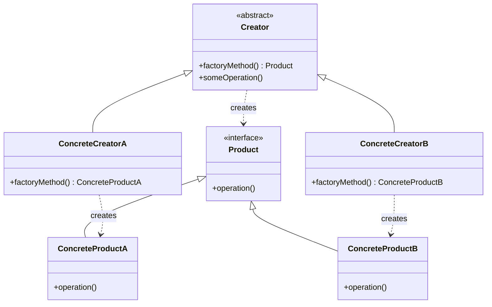

# Factory Method Pattern - Clean Object Creation

In software development, creating objects directly using constructors can lead to tight coupling and violate the principle of "depend on abstractions, not concretions."

**Example:** Creating different types of documents (PDF, Word, Excel), UI components (buttons, dialogs), database connections, etc.

Hard-coding object creation leads to issues such as tight coupling, difficulty in testing, violation of Open/Closed principle, and poor extensibility.

This is where the **Factory Method Design Pattern** comes into play.

It's a fundamental creational pattern that provides clean object creation and is one of the most commonly used patterns in enterprise applications.

## What is Factory Method Pattern?

Factory Method Pattern is a creational design pattern that provides an interface for creating objects, but lets subclasses decide which class to instantiate. The pattern delegates the object creation to subclasses.

It defines a method for creating objects, which subclasses can override to specify the derived type of product that will be created.

The pattern promotes loose coupling by eliminating the need to bind application-specific classes into the code.

## Class Diagram



## Implementation

There are several ways to implement the Factory Method Pattern in Java. Let's explore various approaches with real-world examples.

### 1. Classic Factory Method - Document Creation

```java
// Product interface
interface Document {
    void open();
    void save();
    void close();
    String getType();
}

// Concrete Products
class PDFDocument implements Document {
    private String fileName;

    public PDFDocument(String fileName) {
        this.fileName = fileName;
    }

    @Override
    public void open() {
        System.out.println("Opening PDF document: " + fileName);
    }

    @Override
    public void save() {
        System.out.println("Saving PDF document with compression");
    }

    @Override
    public void close() {
        System.out.println("Closing PDF document");
    }

    @Override
    public String getType() {
        return "PDF";
    }
}

class WordDocument implements Document {
    private String fileName;

    public WordDocument(String fileName) {
        this.fileName = fileName;
    }

    @Override
    public void open() {
        System.out.println("Opening Word document: " + fileName);
    }

    @Override
    public void save() {
        System.out.println("Saving Word document with formatting");
    }

    @Override
    public void close() {
        System.out.println("Closing Word document");
    }

    @Override
    public String getType() {
        return "Word";
    }
}

class ExcelDocument implements Document {
    private String fileName;

    public ExcelDocument(String fileName) {
        this.fileName = fileName;
    }

    @Override
    public void open() {
        System.out.println("Opening Excel document: " + fileName);
    }

    @Override
    public void save() {
        System.out.println("Saving Excel document with formulas");
    }

    @Override
    public void close() {
        System.out.println("Closing Excel document");
    }

    @Override
    public String getType() {
        return "Excel";
    }
}

// Creator abstract class
abstract class DocumentCreator {

    // Factory method - to be implemented by subclasses
    public abstract Document createDocument(String fileName);

    // Template method that uses the factory method
    public Document processDocument(String fileName) {
        Document document = createDocument(fileName);
        document.open();
        // Common processing logic
        System.out.println("Processing " + document.getType() + " document...");
        return document;
    }
}

// Concrete Creators
class PDFDocumentCreator extends DocumentCreator {
    @Override
    public Document createDocument(String fileName) {
        return new PDFDocument(fileName);
    }
}

class WordDocumentCreator extends DocumentCreator {
    @Override
    public Document createDocument(String fileName) {
        return new WordDocument(fileName);
    }
}

class ExcelDocumentCreator extends DocumentCreator {
    @Override
    public Document createDocument(String fileName) {
        return new ExcelDocument(fileName);
    }
}

// Client code
class DocumentProcessor {
    public static void main(String[] args) {
        DocumentCreator creator;

        // Create PDF document
        creator = new PDFDocumentCreator();
        Document pdfDoc = creator.processDocument("report.pdf");
        pdfDoc.save();
        pdfDoc.close();

        // Create Word document
        creator = new WordDocumentCreator();
        Document wordDoc = creator.processDocument("letter.docx");
        wordDoc.save();
        wordDoc.close();

        // Create Excel document
        creator = new ExcelDocumentCreator();
        Document excelDoc = creator.processDocument("budget.xlsx");
        excelDoc.save();
        excelDoc.close();
    }
}
```

### 2. Parameterized Factory Method

```java
import java.util.HashMap;
import java.util.Map;
import java.util.function.Function;

// Enhanced factory with parameter-based creation
class AdvancedDocumentFactory {

    // Registry of document creators
    private static final Map<String, Function<String, Document>> CREATORS = new HashMap<>();

    static {
        CREATORS.put("pdf", PDFDocument::new);
        CREATORS.put("word", WordDocument::new);
        CREATORS.put("excel", ExcelDocument::new);
    }

    public static Document createDocument(String type, String fileName) {
        Function<String, Document> creator = CREATORS.get(type.toLowerCase());
        if (creator == null) {
            throw new IllegalArgumentException("Unknown document type: " + type);
        }
        return creator.apply(fileName);
    }

    // Method to register new document types
    public static void registerDocumentType(String type, Function<String, Document> creator) {
        CREATORS.put(type.toLowerCase(), creator);
    }

    // Method to get all supported types
    public static String[] getSupportedTypes() {
        return CREATORS.keySet().toArray(new String[0]);
    }
}

// Usage example
class ParameterizedFactoryExample {
    public static void main(String[] args) {
        // Create documents using parameterized factory
        Document pdf = AdvancedDocumentFactory.createDocument("pdf", "report.pdf");
        Document word = AdvancedDocumentFactory.createDocument("word", "letter.docx");
        Document excel = AdvancedDocumentFactory.createDocument("excel", "budget.xlsx");

        // Register new document type
        AdvancedDocumentFactory.registerDocumentType("powerpoint", fileName -> new PowerPointDocument(fileName));

        // Use the newly registered type
        Document ppt = AdvancedDocumentFactory.createDocument("powerpoint", "presentation.pptx");
    }
}

class PowerPointDocument implements Document {
    private String fileName;

    public PowerPointDocument(String fileName) {
        this.fileName = fileName;
    }

    @Override
    public void open() {
        System.out.println("Opening PowerPoint presentation: " + fileName);
    }

    @Override
    public void save() {
        System.out.println("Saving PowerPoint presentation with animations");
    }

    @Override
    public void close() {
        System.out.println("Closing PowerPoint presentation");
    }

    @Override
    public String getType() {
        return "PowerPoint";
    }
}
```

### 3. Database Connection Factory

```java
import java.sql.Connection;
import java.sql.DriverManager;
import java.sql.SQLException;
import java.util.Properties;

// Product interface for database connections
interface DatabaseConnection {
    Connection getConnection() throws SQLException;
    String getConnectionType();
    void closeConnection();
    boolean isValid();
}

// Concrete database connection implementations
class MySQLConnection implements DatabaseConnection {
    private Connection connection;
    private final String url;
    private final Properties properties;

    public MySQLConnection(String host, int port, String database, String username, String password) {
        this.url = String.format("jdbc:mysql://%s:%d/%s", host, port, database);
        this.properties = new Properties();
        properties.setProperty("user", username);
        properties.setProperty("password", password);
        properties.setProperty("useSSL", "false");
        properties.setProperty("serverTimezone", "UTC");
    }

    @Override
    public Connection getConnection() throws SQLException {
        if (connection == null || connection.isClosed()) {
            connection = DriverManager.getConnection(url, properties);
        }
        return connection;
    }

    @Override
    public String getConnectionType() {
        return "MySQL";
    }

    @Override
    public void closeConnection() {
        try {
            if (connection != null && !connection.isClosed()) {
                connection.close();
            }
        } catch (SQLException e) {
            System.err.println("Error closing MySQL connection: " + e.getMessage());
        }
    }

    @Override
    public boolean isValid() {
        try {
            return connection != null && !connection.isClosed() && connection.isValid(5);
        } catch (SQLException e) {
            return false;
        }
    }
}

class PostgreSQLConnection implements DatabaseConnection {
    private Connection connection;
    private final String url;
    private final Properties properties;

    public PostgreSQLConnection(String host, int port, String database, String username, String password) {
        this.url = String.format("jdbc:postgresql://%s:%d/%s", host, port, database);
        this.properties = new Properties();
        properties.setProperty("user", username);
        properties.setProperty("password", password);
        properties.setProperty("ssl", "false");
    }

    @Override
    public Connection getConnection() throws SQLException {
        if (connection == null || connection.isClosed()) {
            connection = DriverManager.getConnection(url, properties);
        }
        return connection;
    }

    @Override
    public String getConnectionType() {
        return "PostgreSQL";
    }

    @Override
    public void closeConnection() {
        try {
            if (connection != null && !connection.isClosed()) {
                connection.close();
            }
        } catch (SQLException e) {
            System.err.println("Error closing PostgreSQL connection: " + e.getMessage());
        }
    }

    @Override
    public boolean isValid() {
        try {
            return connection != null && !connection.isClosed() && connection.isValid(5);
        } catch (SQLException e) {
            return false;
        }
    }
}

class OracleConnection implements DatabaseConnection {
    private Connection connection;
    private final String url;
    private final Properties properties;

    public OracleConnection(String host, int port, String serviceName, String username, String password) {
        this.url = String.format("jdbc:oracle:thin:@%s:%d:%s", host, port, serviceName);
        this.properties = new Properties();
        properties.setProperty("user", username);
        properties.setProperty("password", password);
    }

    @Override
    public Connection getConnection() throws SQLException {
        if (connection == null || connection.isClosed()) {
            connection = DriverManager.getConnection(url, properties);
        }
        return connection;
    }

    @Override
    public String getConnectionType() {
        return "Oracle";
    }

    @Override
    public void closeConnection() {
        try {
            if (connection != null && !connection.isClosed()) {
                connection.close();
            }
        } catch (SQLException e) {
            System.err.println("Error closing Oracle connection: " + e.getMessage());
        }
    }

    @Override
    public boolean isValid() {
        try {
            return connection != null && !connection.isClosed() && connection.isValid(5);
        } catch (SQLException e) {
            return false;
        }
    }
}

// Abstract Creator for database connections
abstract class DatabaseConnectionFactory {

    public abstract DatabaseConnection createConnection(ConnectionConfig config);

    // Template method for connection setup
    public DatabaseConnection setupConnection(ConnectionConfig config) {
        DatabaseConnection dbConnection = createConnection(config);
        try {
            Connection conn = dbConnection.getConnection();
            System.out.println("Successfully created " + dbConnection.getConnectionType() + " connection");

            // Common setup operations
            conn.setAutoCommit(false);
            System.out.println("Auto-commit disabled for transaction management");

            return dbConnection;
        } catch (SQLException e) {
            System.err.println("Failed to setup connection: " + e.getMessage());
            throw new RuntimeException("Database connection setup failed", e);
        }
    }
}

// Concrete Creators
class MySQLConnectionFactory extends DatabaseConnectionFactory {
    @Override
    public DatabaseConnection createConnection(ConnectionConfig config) {
        return new MySQLConnection(config.host, config.port, config.database, config.username, config.password);
    }
}

class PostgreSQLConnectionFactory extends DatabaseConnectionFactory {
    @Override
    public DatabaseConnection createConnection(ConnectionConfig config) {
        return new PostgreSQLConnection(config.host, config.port, config.database, config.username, config.password);
    }
}

class OracleConnectionFactory extends DatabaseConnectionFactory {
    @Override
    public DatabaseConnection createConnection(ConnectionConfig config) {
        return new OracleConnection(config.host, config.port, config.database, config.username, config.password);
    }
}

// Configuration class
class ConnectionConfig {
    public final String host;
    public final int port;
    public final String database;
    public final String username;
    public final String password;

    public ConnectionConfig(String host, int port, String database, String username, String password) {
        this.host = host;
        this.port = port;
        this.database = database;
        this.username = username;
        this.password = password;
    }
}

// Factory selector
class DatabaseFactoryProvider {
    public static DatabaseConnectionFactory getFactory(String databaseType) {
        switch (databaseType.toLowerCase()) {
            case "mysql":
                return new MySQLConnectionFactory();
            case "postgresql":
                return new PostgreSQLConnectionFactory();
            case "oracle":
                return new OracleConnectionFactory();
            default:
                throw new IllegalArgumentException("Unsupported database type: " + databaseType);
        }
    }
}
```

### 4. UI Component Factory

```java
// Product interface for UI components
interface UIComponent {
    void render();
    void handleEvent(String event);
    String getComponentType();
}

// Concrete UI Components
class WindowsButton implements UIComponent {
    private String text;

    public WindowsButton(String text) {
        this.text = text;
    }

    @Override
    public void render() {
        System.out.println("Rendering Windows-style button: " + text);
    }

    @Override
    public void handleEvent(String event) {
        System.out.println("Windows button handling " + event + " event");
    }

    @Override
    public String getComponentType() {
        return "Windows Button";
    }
}

class MacButton implements UIComponent {
    private String text;

    public MacButton(String text) {
        this.text = text;
    }

    @Override
    public void render() {
        System.out.println("Rendering Mac-style button: " + text);
    }

    @Override
    public void handleEvent(String event) {
        System.out.println("Mac button handling " + event + " event");
    }

    @Override
    public String getComponentType() {
        return "Mac Button";
    }
}

class LinuxButton implements UIComponent {
    private String text;

    public LinuxButton(String text) {
        this.text = text;
    }

    @Override
    public void render() {
        System.out.println("Rendering Linux-style button: " + text);
    }

    @Override
    public void handleEvent(String event) {
        System.out.println("Linux button handling " + event + " event");
    }

    @Override
    public String getComponentType() {
        return "Linux Button";
    }
}

// Abstract Creator for UI components
abstract class UIComponentFactory {

    public abstract UIComponent createButton(String text);

    // Could have more factory methods for other components
    // public abstract UIComponent createCheckbox(String text);
    // public abstract UIComponent createTextfield(String placeholder);

    // Template method for component creation and setup
    public UIComponent createAndSetupComponent(String componentType, String text) {
        UIComponent component;

        switch (componentType.toLowerCase()) {
            case "button":
                component = createButton(text);
                break;
            default:
                throw new IllegalArgumentException("Unsupported component type: " + componentType);
        }

        // Common setup
        component.render();
        System.out.println("Component setup completed for " + component.getComponentType());

        return component;
    }
}

// Concrete Creators for different platforms
class WindowsUIFactory extends UIComponentFactory {
    @Override
    public UIComponent createButton(String text) {
        return new WindowsButton(text);
    }
}

class MacUIFactory extends UIComponentFactory {
    @Override
    public UIComponent createButton(String text) {
        return new MacButton(text);
    }
}

class LinuxUIFactory extends UIComponentFactory {
    @Override
    public UIComponent createButton(String text) {
        return new LinuxButton(text);
    }
}

// Factory provider based on OS
class UIFactoryProvider {
    public static UIComponentFactory getFactory() {
        String osName = System.getProperty("os.name").toLowerCase();

        if (osName.contains("windows")) {
            return new WindowsUIFactory();
        } else if (osName.contains("mac")) {
            return new MacUIFactory();
        } else if (osName.contains("linux")) {
            return new LinuxUIFactory();
        } else {
            // Default to Linux for other Unix-like systems
            return new LinuxUIFactory();
        }
    }

    public static UIComponentFactory getFactory(String platform) {
        switch (platform.toLowerCase()) {
            case "windows":
                return new WindowsUIFactory();
            case "mac":
                return new MacUIFactory();
            case "linux":
                return new LinuxUIFactory();
            default:
                throw new IllegalArgumentException("Unsupported platform: " + platform);
        }
    }
}
```

## Test Code

```java
import org.junit.jupiter.api.Test;
import org.junit.jupiter.api.BeforeEach;
import static org.junit.jupiter.api.Assertions.*;

class FactoryMethodPatternTest {

    @Test
    void testDocumentCreation() {
        DocumentCreator pdfCreator = new PDFDocumentCreator();
        Document pdfDoc = pdfCreator.createDocument("test.pdf");

        assertNotNull(pdfDoc);
        assertEquals("PDF", pdfDoc.getType());

        DocumentCreator wordCreator = new WordDocumentCreator();
        Document wordDoc = wordCreator.createDocument("test.docx");

        assertNotNull(wordDoc);
        assertEquals("Word", wordDoc.getType());
    }

    @Test
    void testParameterizedFactory() {
        Document pdf = AdvancedDocumentFactory.createDocument("pdf", "report.pdf");
        Document word = AdvancedDocumentFactory.createDocument("word", "letter.docx");
        Document excel = AdvancedDocumentFactory.createDocument("excel", "budget.xlsx");

        assertEquals("PDF", pdf.getType());
        assertEquals("Word", word.getType());
        assertEquals("Excel", excel.getType());
    }

    @Test
    void testInvalidDocumentType() {
        assertThrows(IllegalArgumentException.class, () -> {
            AdvancedDocumentFactory.createDocument("invalid", "test.txt");
        });
    }

    @Test
    void testDocumentRegistration() {
        // Register a new document type
        AdvancedDocumentFactory.registerDocumentType("text", fileName -> new TextDocument(fileName));

        // Test that the new type can be created
        Document textDoc = AdvancedDocumentFactory.createDocument("text", "readme.txt");
        assertNotNull(textDoc);
        assertEquals("Text", textDoc.getType());
    }

    @Test
    void testUIComponentFactory() {
        UIComponentFactory windowsFactory = new WindowsUIFactory();
        UIComponent windowsButton = windowsFactory.createButton("OK");

        assertNotNull(windowsButton);
        assertEquals("Windows Button", windowsButton.getComponentType());

        UIComponentFactory macFactory = new MacUIFactory();
        UIComponent macButton = macFactory.createButton("Cancel");

        assertNotNull(macButton);
        assertEquals("Mac Button", macButton.getComponentType());
    }

    @Test
    void testFactoryProvider() {
        UIComponentFactory factory = UIFactoryProvider.getFactory("windows");
        UIComponent component = factory.createButton("Test");

        assertEquals("Windows Button", component.getComponentType());

        factory = UIFactoryProvider.getFactory("mac");
        component = factory.createButton("Test");

        assertEquals("Mac Button", component.getComponentType());
    }

    @Test
    void testDatabaseFactory() {
        DatabaseConnectionFactory mysqlFactory = DatabaseFactoryProvider.getFactory("mysql");
        assertNotNull(mysqlFactory);
        assertTrue(mysqlFactory instanceof MySQLConnectionFactory);

        DatabaseConnectionFactory postgresFactory = DatabaseFactoryProvider.getFactory("postgresql");
        assertNotNull(postgresFactory);
        assertTrue(postgresFactory instanceof PostgreSQLConnectionFactory);
    }

    @Test
    void testInvalidDatabaseType() {
        assertThrows(IllegalArgumentException.class, () -> {
            DatabaseFactoryProvider.getFactory("invaliddb");
        });
    }
}

// Additional test class for new document type
class TextDocument implements Document {
    private String fileName;

    public TextDocument(String fileName) {
        this.fileName = fileName;
    }

    @Override
    public void open() {
        System.out.println("Opening text file: " + fileName);
    }

    @Override
    public void save() {
        System.out.println("Saving text file");
    }

    @Override
    public void close() {
        System.out.println("Closing text file");
    }

    @Override
    public String getType() {
        return "Text";
    }
}
```

## Real-World Examples of Factory Method Pattern

### 1. **Framework Development**

- **Java Collections**: `Collections.synchronizedList()`, `Collections.unmodifiableSet()`
- **JDBC**: `DriverManager.getConnection()` for different database drivers
- **Log4j**: Different appender creation based on configuration
- **Spring Framework**: Bean factory for dependency injection

### 2. **GUI Frameworks**

- **Swing**: `UIManager.getLookAndFeel()` for different UI themes
- **Android**: `LayoutInflater.from()` for creating UI components
- **JavaFX**: Platform-specific control creation
- **Web Frameworks**: Component factories in Angular, React

### 3. **Enterprise Applications**

- **ORM Frameworks**: Hibernate session factory, JPA entity manager factory
- **Message Queues**: ActiveMQ, RabbitMQ connection factories
- **Cloud SDKs**: AWS, Azure, GCP client factories
- **Microservices**: Service discovery and client creation

### 4. **Gaming and Media**

- **Game Engines**: Unity prefab instantiation, Unreal Blueprint creation
- **Graphics Libraries**: OpenGL context creation, DirectX device factory
- **Audio Processing**: Different codec factories for audio formats
- **Streaming**: Netflix, YouTube player factory for different platforms

## Specific Examples:

**javax.xml.parsers.DocumentBuilderFactory**: Creates XML document builders for different parsers.

**java.util.Calendar.getInstance()**: Creates calendar instances based on locale and timezone.

**Spring's BeanFactory**: Core interface for accessing Spring container and creating beans.

**Apache Commons Pool**: Object pool factories for managing expensive objects.

**Jackson ObjectMapper**: Factory methods for creating JSON parsers and generators.

## Pros and Cons of Factory Method Pattern

| **Pros**                                                                               | **Cons**                                                                                  |
| -------------------------------------------------------------------------------------- | ----------------------------------------------------------------------------------------- |
| ✅ **Loose Coupling**: Eliminates tight coupling between creator and concrete products | ❌ **Code Complexity**: Additional classes and inheritance hierarchy                      |
| ✅ **Open/Closed Principle**: Easy to add new products without modifying existing code | ❌ **Subclass Proliferation**: May lead to many small subclasses                          |
| ✅ **Single Responsibility**: Creation logic is separated from business logic          | ❌ **Indirect Object Creation**: Less straightforward than direct instantiation           |
| ✅ **Flexibility**: Can return different product implementations based on parameters   | ❌ **Runtime Overhead**: Additional method calls and object creation                      |
| ✅ **Testability**: Easy to mock factory methods for unit testing                      | ❌ **Configuration Complexity**: Managing different factory configurations can be complex |

## Best Practices

### ⚠️ **Warnings & Considerations**

1. **Over-engineering**: Don't use factory method for simple object creation
2. **Parameter Explosion**: Avoid too many parameters in factory methods
3. **Error Handling**: Provide clear error messages for invalid product types
4. **Performance**: Consider caching expensive objects created by factories
5. **Thread Safety**: Ensure factory methods are thread-safe in concurrent environments

### 🏆 **Modern Alternatives & Enhancements**

- **Dependency Injection**: Use Spring, Guice, or CDI for object creation
- **Builder Pattern**: For complex objects with many optional parameters
- **Enum Factories**: Type-safe factory methods using enums
- **Functional Factories**: Using Java 8+ functional interfaces and method references
- **Configuration-based Factories**: Using annotations and reflection

### 💡 **When to Use Factory Method Pattern**

✅ **Use When:**

- You don't know the exact types of objects your code should work with
- You want to provide a library/framework for others to extend
- You need to save system resources by reusing existing objects
- You want to separate object construction from object use

❌ **Avoid When:**

- Object creation is simple and doesn't vary
- You need very high performance and want to avoid method call overhead
- The number of product types is fixed and unlikely to change
- Direct instantiation provides better code clarity

### 🔧 **Implementation Tips**

1. **Use Abstract Factory** when you need to create families of related objects
2. **Combine with Singleton** when you need a single factory instance
3. **Use Reflection** for dynamic factory implementation with configuration
4. **Implement Caching** when created objects are expensive
5. **Provide Default Implementations** to handle edge cases gracefully

The Factory Method pattern is essential for creating flexible, extensible applications where object creation needs to be decoupled from object usage, making it a cornerstone pattern in enterprise software development.
