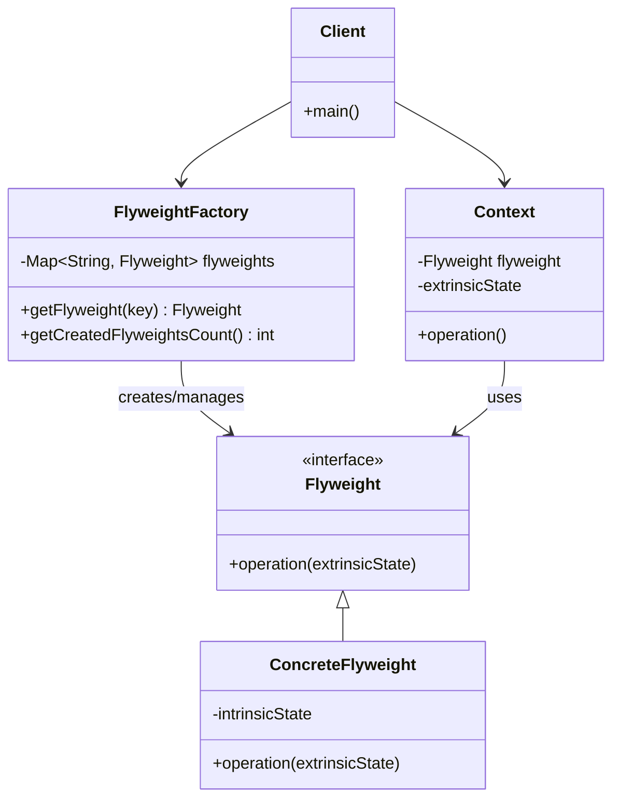

# Flyweight Pattern - Memory Optimization for Large Datasets

In software development, we often need to create large numbers of similar objects, which can consume significant memory and impact performance.

**Example:** Game objects (bullets, particles), text formatting (characters, fonts), UI elements (icons, buttons), graphical elements, etc.

Creating individual objects for each instance leads to memory bloat and poor performance when dealing with thousands or millions of similar objects.

This is where the **Flyweight Design Pattern** comes into play.

It's a fundamental structural pattern that minimizes memory usage by sharing common object state and is essential for performance-critical applications.

## What is Flyweight Pattern?

Flyweight Pattern is a structural design pattern that minimizes memory usage by sharing efficiently the common state among multiple objects. It separates intrinsic state (shared) from extrinsic state (unique to each object).

The intrinsic state is stored in flyweight objects and shared among multiple contexts, while extrinsic state is passed as parameters when operations are performed.

The pattern promotes memory efficiency by eliminating redundancy in object storage while maintaining the appearance of having many distinct objects.

## Class Diagram



## Implementation

### 1. Text Editor Flyweight Example

```java
import java.util.*;
import java.util.concurrent.ConcurrentHashMap;

// Flyweight interface
interface CharacterFlyweight {
    void render(int x, int y, String font, int size, String color);
    char getCharacter(); // Intrinsic state
}

// Concrete Flyweight - stores intrinsic state
class ConcreteCharacter implements CharacterFlyweight {
    private final char character; // Intrinsic state - shared among all instances

    public ConcreteCharacter(char character) {
        this.character = character;
        System.out.println("Creating flyweight for character: '" + character + "'");
    }

    @Override
    public void render(int x, int y, String font, int size, String color) {
        // Extrinsic state (x, y, font, size, color) is passed as parameters
        System.out.printf("Rendering '%c' at (%d,%d) with font=%s, size=%d, color=%s%n",
                         character, x, y, font, size, color);
    }

    @Override
    public char getCharacter() {
        return character;
    }

    @Override
    public String toString() {
        return "CharacterFlyweight{'" + character + "'}";
    }
}

// Flyweight Factory - manages flyweight instances
class CharacterFactory {
    private static final Map<Character, CharacterFlyweight> flyweights = new ConcurrentHashMap<>();
    private static int creationCount = 0;

    public static CharacterFlyweight getCharacter(char c) {
        CharacterFlyweight flyweight = flyweights.get(c);

        if (flyweight == null) {
            flyweight = new ConcreteCharacter(c);
            flyweights.put(c, flyweight);
            creationCount++;
        }

        return flyweight;
    }

    public static int getCreatedFlyweightsCount() {
        return creationCount;
    }

    public static int getPoolSize() {
        return flyweights.size();
    }

    public static void printStatistics() {
        System.out.println("=== Character Factory Statistics ===");
        System.out.println("Unique characters (flyweights): " + flyweights.size());
        System.out.println("Total flyweight objects created: " + creationCount);
        System.out.println("Memory saved: " + (getEstimatedObjectsWithoutFlyweight() - creationCount) + " objects");
    }

    private static int getEstimatedObjectsWithoutFlyweight() {
        // This would be calculated based on actual usage
        return 10000; // Placeholder for demonstration
    }

    public static void clearPool() {
        flyweights.clear();
        creationCount = 0;
        System.out.println("Character factory pool cleared");
    }
}

// Context - contains extrinsic state
class CharacterContext {
    private final CharacterFlyweight flyweight;
    private final int x, y;
    private final String font;
    private final int size;
    private final String color;

    public CharacterContext(char character, int x, int y, String font, int size, String color) {
        this.flyweight = CharacterFactory.getCharacter(character); // Get shared flyweight
        this.x = x;
        this.y = y;
        this.font = font;
        this.size = size;
        this.color = color;
    }

    public void render() {
        flyweight.render(x, y, font, size, color);
    }

    public char getCharacter() {
        return flyweight.getCharacter();
    }

    // Getters for extrinsic state
    public int getX() { return x; }
    public int getY() { return y; }
    public String getFont() { return font; }
    public int getSize() { return size; }
    public String getColor() { return color; }
}

// Document class that uses flyweights
class Document {
    private final List<CharacterContext> characters = new ArrayList<>();
    private String documentName;

    public Document(String documentName) {
        this.documentName = documentName;
    }

    public void addCharacter(char character, int x, int y, String font, int size, String color) {
        CharacterContext context = new CharacterContext(character, x, y, font, size, color);
        characters.add(context);
    }

    public void addText(String text, int startX, int startY, String font, int size, String color) {
        int currentX = startX;
        for (char c : text.toCharArray()) {
            if (c == ' ') {
                currentX += size / 2; // Space width
                continue;
            } else if (c == '\n') {
                startY += size + 2; // Line height
                currentX = startX;
                continue;
            }

            addCharacter(c, currentX, startY, font, size, color);
            currentX += size; // Advance position
        }
    }

    public void render() {
        System.out.println("\n=== Rendering Document: " + documentName + " ===");
        for (CharacterContext context : characters) {
            context.render();
        }
    }

    public void renderSection(int startIndex, int endIndex) {
        System.out.println("\n=== Rendering Section [" + startIndex + "-" + endIndex + "] ===");
        for (int i = startIndex; i <= endIndex && i < characters.size(); i++) {
            characters.get(i).render();
        }
    }

    public int getCharacterCount() {
        return characters.size();
    }

    public Map<Character, Integer> getCharacterFrequency() {
        Map<Character, Integer> frequency = new HashMap<>();
        for (CharacterContext context : characters) {
            char c = context.getCharacter();
            frequency.put(c, frequency.getOrDefault(c, 0) + 1);
        }
        return frequency;
    }

    public long getEstimatedMemoryUsage() {
        // Estimate memory usage with flyweight pattern
        int uniqueChars = CharacterFactory.getPoolSize();
        int contexts = characters.size();

        // Simplified calculation
        // Each flyweight: ~32 bytes (object overhead + char)
        // Each context: ~48 bytes (object overhead + references + primitives)
        return (uniqueChars * 32L) + (contexts * 48L);
    }

    public long getMemoryUsageWithoutFlyweight() {
        // Estimate memory usage without flyweight pattern
        // Each character object: ~64 bytes (object overhead + all data)
        return characters.size() * 64L;
    }

    public void printStatistics() {
        System.out.println("\n=== Document Statistics ===");
        System.out.println("Document: " + documentName);
        System.out.println("Total characters: " + getCharacterCount());
        System.out.println("Unique characters: " + getCharacterFrequency().size());
        System.out.println("Estimated memory with flyweight: " + getEstimatedMemoryUsage() + " bytes");
        System.out.println("Estimated memory without flyweight: " + getMemoryUsageWithoutFlyweight() + " bytes");
        System.out.println("Memory saved: " + (getMemoryUsageWithoutFlyweight() - getEstimatedMemoryUsage()) + " bytes");

        System.out.println("Character frequency:");
        getCharacterFrequency().entrySet().stream()
                .sorted(Map.Entry.<Character, Integer>comparingByValue().reversed())
                .limit(10)
                .forEach(entry -> System.out.println("  '" + entry.getKey() + "': " + entry.getValue()));
    }
}

// Usage Example
class TextEditorExample {
    public static void main(String[] args) {
        System.out.println("=== Flyweight Pattern - Text Editor Example ===");

        Document document = new Document("Sample Document");

        // Add text with different formatting
        document.addText("Hello World!", 10, 10, "Arial", 12, "Black");
        document.addText("This is a flyweight pattern demonstration.", 10, 30, "Arial", 12, "Blue");
        document.addText("FLYWEIGHT SAVES MEMORY", 10, 50, "Times", 14, "Red");
        document.addText("abcdefghijklmnopqrstuvwxyz", 10, 70, "Courier", 10, "Green");

        // Add more text to demonstrate memory savings
        for (int i = 0; i < 50; i++) {
            document.addText("Repeated text line " + i, 10, 90 + (i * 15), "Arial", 11, "Black");
        }

        // Render a small section
        document.renderSection(0, 20);

        // Print statistics
        document.printStatistics();
        CharacterFactory.printStatistics();

        System.out.println("\n=== Memory Efficiency Demonstration ===");
        demonstrateMemoryEfficiency();
    }

    private static void demonstrateMemoryEfficiency() {
        CharacterFactory.clearPool();

        Document largeDocument = new Document("Large Document");

        // Simulate a large document with repeated characters
        String sampleText = "The quick brown fox jumps over the lazy dog. ";
        for (int i = 0; i < 1000; i++) {
            largeDocument.addText(sampleText, 0, i * 15, "Arial", 12, "Black");
        }

        largeDocument.printStatistics();
        CharacterFactory.printStatistics();

        // Demonstrate the memory savings
        long memoryWithFlyweight = largeDocument.getEstimatedMemoryUsage();
        long memoryWithoutFlyweight = largeDocument.getMemoryUsageWithoutFlyweight();
        double savingsPercentage = ((double)(memoryWithoutFlyweight - memoryWithFlyweight) / memoryWithoutFlyweight) * 100;

        System.out.println("\n=== Memory Savings Analysis ===");
        System.out.printf("Memory with flyweight: %,d bytes%n", memoryWithFlyweight);
        System.out.printf("Memory without flyweight: %,d bytes%n", memoryWithoutFlyweight);
        System.out.printf("Memory saved: %,d bytes (%.1f%%)%n",
                         memoryWithoutFlyweight - memoryWithFlyweight, savingsPercentage);
    }
}
```

### 2. Game Objects Flyweight Example

```java
// Game object flyweight for bullets, particles, etc.
interface GameObjectFlyweight {
    void render(int x, int y, int velocityX, int velocityY, String playerColor);
    void update(GameContext context);
    String getType(); // Intrinsic state
}

// Concrete flyweight for bullet objects
class BulletFlyweight implements GameObjectFlyweight {
    private final String bulletType;
    private final int damage;
    private final int speed;
    private final String sprite; // Intrinsic state - shared

    public BulletFlyweight(String bulletType, int damage, int speed, String sprite) {
        this.bulletType = bulletType;
        this.damage = damage;
        this.speed = speed;
        this.sprite = sprite;
        System.out.println("Created flyweight for bullet type: " + bulletType);
    }

    @Override
    public void render(int x, int y, int velocityX, int velocityY, String playerColor) {
        // Render bullet using intrinsic state and extrinsic parameters
        System.out.printf("Rendering %s bullet [%s] at (%d,%d) velocity=(%d,%d) color=%s%n",
                         bulletType, sprite, x, y, velocityX, velocityY, playerColor);
    }

    @Override
    public void update(GameContext context) {
        // Update logic using both intrinsic and extrinsic state
        context.setX(context.getX() + context.getVelocityX());
        context.setY(context.getY() + context.getVelocityY());

        // Apply bullet-specific behavior
        if (bulletType.equals("PIERCING")) {
            // Piercing bullets don't get destroyed on hit
        } else if (bulletType.equals("EXPLOSIVE")) {
            // Explosive bullets have area damage
        }
    }

    @Override
    public String getType() {
        return bulletType;
    }

    public int getDamage() { return damage; }
    public int getSpeed() { return speed; }
}

// Concrete flyweight for particle effects
class ParticleFlyweight implements GameObjectFlyweight {
    private final String particleType;
    private final String texture;
    private final int lifetime;
    private final String blendMode;

    public ParticleFlyweight(String particleType, String texture, int lifetime, String blendMode) {
        this.particleType = particleType;
        this.texture = texture;
        this.lifetime = lifetime;
        this.blendMode = blendMode;
        System.out.println("Created flyweight for particle type: " + particleType);
    }

    @Override
    public void render(int x, int y, int velocityX, int velocityY, String playerColor) {
        System.out.printf("Rendering %s particle [%s] at (%d,%d) blend=%s%n",
                         particleType, texture, x, y, blendMode);
    }

    @Override
    public void update(GameContext context) {
        context.setX(context.getX() + context.getVelocityX());
        context.setY(context.getY() + context.getVelocityY());
        context.setAge(context.getAge() + 1);

        // Apply gravity or other effects based on particle type
        if (particleType.equals("SMOKE")) {
            context.setVelocityY(context.getVelocityY() - 1); // Rise up
        } else if (particleType.equals("DEBRIS")) {
            context.setVelocityY(context.getVelocityY() + 1); // Fall down
        }
    }

    @Override
    public String getType() {
        return particleType;
    }

    public int getLifetime() { return lifetime; }
}

// Game context containing extrinsic state
class GameContext {
    private int x, y;
    private int velocityX, velocityY;
    private String playerColor;
    private int age;
    private boolean active;
    private final GameObjectFlyweight flyweight;

    public GameContext(GameObjectFlyweight flyweight, int x, int y, int velocityX, int velocityY, String playerColor) {
        this.flyweight = flyweight;
        this.x = x;
        this.y = y;
        this.velocityX = velocityX;
        this.velocityY = velocityY;
        this.playerColor = playerColor;
        this.age = 0;
        this.active = true;
    }

    public void render() {
        if (active) {
            flyweight.render(x, y, velocityX, velocityY, playerColor);
        }
    }

    public void update() {
        if (active) {
            flyweight.update(this);

            // Check boundaries or lifetime
            if (x < 0 || x > 800 || y < 0 || y > 600) {
                active = false;
            }

            // Check particle lifetime
            if (flyweight instanceof ParticleFlyweight) {
                ParticleFlyweight particle = (ParticleFlyweight) flyweight;
                if (age > particle.getLifetime()) {
                    active = false;
                }
            }
        }
    }

    public boolean isActive() { return active; }
    public void setActive(boolean active) { this.active = active; }

    // Getters and setters
    public int getX() { return x; }
    public void setX(int x) { this.x = x; }
    public int getY() { return y; }
    public void setY(int y) { this.y = y; }
    public int getVelocityX() { return velocityX; }
    public void setVelocityX(int velocityX) { this.velocityX = velocityX; }
    public int getVelocityY() { return velocityY; }
    public void setVelocityY(int velocityY) { this.velocityY = velocityY; }
    public String getPlayerColor() { return playerColor; }
    public int getAge() { return age; }
    public void setAge(int age) { this.age = age; }
    public GameObjectFlyweight getFlyweight() { return flyweight; }
}

// Game object factory
class GameObjectFactory {
    private static final Map<String, GameObjectFlyweight> bulletFlyweights = new ConcurrentHashMap<>();
    private static final Map<String, GameObjectFlyweight> particleFlyweights = new ConcurrentHashMap<>();
    private static int totalCreatedFlyweights = 0;

    public static GameObjectFlyweight getBulletFlyweight(String bulletType) {
        return bulletFlyweights.computeIfAbsent(bulletType, type -> {
            totalCreatedFlyweights++;
            switch (type) {
                case "NORMAL":
                    return new BulletFlyweight("NORMAL", 10, 5, "bullet_normal.png");
                case "PIERCING":
                    return new BulletFlyweight("PIERCING", 8, 7, "bullet_piercing.png");
                case "EXPLOSIVE":
                    return new BulletFlyweight("EXPLOSIVE", 15, 3, "bullet_explosive.png");
                default:
                    return new BulletFlyweight("NORMAL", 10, 5, "bullet_default.png");
            }
        });
    }

    public static GameObjectFlyweight getParticleFlyweight(String particleType) {
        return particleFlyweights.computeIfAbsent(particleType, type -> {
            totalCreatedFlyweights++;
            switch (type) {
                case "SMOKE":
                    return new ParticleFlyweight("SMOKE", "smoke_texture.png", 120, "ALPHA");
                case "FIRE":
                    return new ParticleFlyweight("FIRE", "fire_texture.png", 60, "ADDITIVE");
                case "DEBRIS":
                    return new ParticleFlyweight("DEBRIS", "debris_texture.png", 180, "NORMAL");
                case "SPARK":
                    return new ParticleFlyweight("SPARK", "spark_texture.png", 30, "ADDITIVE");
                default:
                    return new ParticleFlyweight("GENERIC", "particle_texture.png", 90, "ALPHA");
            }
        });
    }

    public static void printStatistics() {
        System.out.println("\n=== Game Object Factory Statistics ===");
        System.out.println("Bullet flyweight types: " + bulletFlyweights.size());
        System.out.println("Particle flyweight types: " + particleFlyweights.size());
        System.out.println("Total flyweights created: " + totalCreatedFlyweights);

        System.out.println("Bullet types: " + bulletFlyweights.keySet());
        System.out.println("Particle types: " + particleFlyweights.keySet());
    }

    public static void reset() {
        bulletFlyweights.clear();
        particleFlyweights.clear();
        totalCreatedFlyweights = 0;
    }
}

// Game simulation
class GameSimulation {
    private final List<GameContext> gameObjects = new ArrayList<>();
    private final Random random = new Random();
    private int frameCount = 0;

    public void spawnBullet(String type, int x, int y, int velocityX, int velocityY, String playerColor) {
        GameObjectFlyweight flyweight = GameObjectFactory.getBulletFlyweight(type);
        GameContext context = new GameContext(flyweight, x, y, velocityX, velocityY, playerColor);
        gameObjects.add(context);
    }

    public void spawnParticle(String type, int x, int y, int velocityX, int velocityY) {
        GameObjectFlyweight flyweight = GameObjectFactory.getParticleFlyweight(type);
        GameContext context = new GameContext(flyweight, x, y, velocityX, velocityY, "WHITE");
        gameObjects.add(context);
    }

    public void spawnExplosion(int x, int y) {
        // Spawn multiple particles for explosion effect
        for (int i = 0; i < 20; i++) {
            int vx = random.nextInt(21) - 10; // -10 to +10
            int vy = random.nextInt(21) - 10;
            spawnParticle("FIRE", x, y, vx, vy);
            spawnParticle("SMOKE", x, y, vx/2, vy/2);

            if (i < 5) {
                spawnParticle("DEBRIS", x, y, vx, vy);
            }
        }
    }

    public void update() {
        frameCount++;

        // Update all game objects
        Iterator<GameContext> iterator = gameObjects.iterator();
        while (iterator.hasNext()) {
            GameContext context = iterator.next();
            context.update();

            if (!context.isActive()) {
                iterator.remove();
            }
        }

        // Spawn random objects for demonstration
        if (frameCount % 10 == 0) { // Every 10 frames
            spawnRandomObjects();
        }
    }

    private void spawnRandomObjects() {
        // Spawn random bullets
        String[] bulletTypes = {"NORMAL", "PIERCING", "EXPLOSIVE"};
        String bulletType = bulletTypes[random.nextInt(bulletTypes.length)];
        spawnBullet(bulletType, random.nextInt(800), random.nextInt(600),
                   random.nextInt(21) - 10, random.nextInt(21) - 10, "BLUE");

        // Spawn random particles
        String[] particleTypes = {"SMOKE", "FIRE", "SPARK"};
        String particleType = particleTypes[random.nextInt(particleTypes.length)];
        spawnParticle(particleType, random.nextInt(800), random.nextInt(600),
                     random.nextInt(11) - 5, random.nextInt(11) - 5);
    }

    public void render() {
        if (frameCount % 30 == 0) { // Render every 30 frames
            System.out.println("\n=== Frame " + frameCount + " ===");
            System.out.println("Active objects: " + gameObjects.size());

            // Group by type for rendering summary
            Map<String, Integer> typeCounts = new HashMap<>();
            for (GameContext context : gameObjects) {
                String type = context.getFlyweight().getType();
                typeCounts.put(type, typeCounts.getOrDefault(type, 0) + 1);
            }

            typeCounts.forEach((type, count) ->
                System.out.println("  " + type + ": " + count + " objects"));
        }
    }

    public void simulate(int frames) {
        System.out.println("Starting game simulation for " + frames + " frames...");

        // Initial objects
        spawnExplosion(400, 300);

        for (int i = 0; i < frames; i++) {
            update();
            render();

            // Brief pause to simulate frame rate
            try {
                Thread.sleep(50);
            } catch (InterruptedException e) {
                Thread.currentThread().interrupt();
                break;
            }
        }

        printSimulationStatistics();
    }

    private void printSimulationStatistics() {
        System.out.println("\n=== Simulation Statistics ===");
        System.out.println("Total frames: " + frameCount);
        System.out.println("Final active objects: " + gameObjects.size());

        // Calculate memory usage
        int totalContexts = gameObjects.size();
        int uniqueFlyweights = GameObjectFactory.bulletFlyweights.size() +
                             GameObjectFactory.particleFlyweights.size();

        long memoryWithFlyweight = (uniqueFlyweights * 128L) + (totalContexts * 64L);
        long memoryWithoutFlyweight = totalContexts * 192L; // Estimate without flyweight

        System.out.printf("Estimated memory with flyweight: %,d bytes%n", memoryWithFlyweight);
        System.out.printf("Estimated memory without flyweight: %,d bytes%n", memoryWithoutFlyweight);
        System.out.printf("Memory saved: %,d bytes%n", memoryWithoutFlyweight - memoryWithFlyweight);

        GameObjectFactory.printStatistics();
    }
}

// Game example
class GameFlyweightExample {
    public static void main(String[] args) {
        System.out.println("=== Flyweight Pattern - Game Objects Example ===");

        GameSimulation game = new GameSimulation();

        // Simulate a short game session
        game.simulate(50);

        System.out.println("\n=== Intensive Object Creation Test ===");
        testIntensiveObjectCreation();
    }

    private static void testIntensiveObjectCreation() {
        GameObjectFactory.reset();

        List<GameContext> objects = new ArrayList<>();
        Random random = new Random();

        // Create thousands of game objects
        String[] bulletTypes = {"NORMAL", "PIERCING", "EXPLOSIVE"};
        String[] particleTypes = {"SMOKE", "FIRE", "DEBRIS", "SPARK"};

        for (int i = 0; i < 10000; i++) {
            if (i % 2 == 0) {
                // Create bullet
                String type = bulletTypes[random.nextInt(bulletTypes.length)];
                GameObjectFlyweight flyweight = GameObjectFactory.getBulletFlyweight(type);
                objects.add(new GameContext(flyweight, random.nextInt(800), random.nextInt(600),
                                          random.nextInt(21) - 10, random.nextInt(21) - 10, "RED"));
            } else {
                // Create particle
                String type = particleTypes[random.nextInt(particleTypes.length)];
                GameObjectFlyweight flyweight = GameObjectFactory.getParticleFlyweight(type);
                objects.add(new GameContext(flyweight, random.nextInt(800), random.nextInt(600),
                                          random.nextInt(11) - 5, random.nextInt(11) - 5, "WHITE"));
            }
        }

        System.out.println("Created " + objects.size() + " game objects");
        GameObjectFactory.printStatistics();

        // Memory efficiency analysis
        int uniqueFlyweights = GameObjectFactory.bulletFlyweights.size() +
                             GameObjectFactory.particleFlyweights.size();
        long memoryWithFlyweight = (uniqueFlyweights * 128L) + (objects.size() * 64L);
        long memoryWithoutFlyweight = objects.size() * 192L;
        double savingsPercentage = ((double)(memoryWithoutFlyweight - memoryWithFlyweight) / memoryWithoutFlyweight) * 100;

        System.out.println("\n=== Memory Efficiency Analysis ===");
        System.out.printf("Objects created: %,d%n", objects.size());
        System.out.printf("Unique flyweights: %d%n", uniqueFlyweights);
        System.out.printf("Memory with flyweight: %,d bytes%n", memoryWithFlyweight);
        System.out.printf("Memory without flyweight: %,d bytes%n", memoryWithoutFlyweight);
        System.out.printf("Memory saved: %,d bytes (%.1f%%)%n",
                         memoryWithoutFlyweight - memoryWithFlyweight, savingsPercentage);
    }
}
```

## Test Code

```java
import org.junit.jupiter.api.Test;
import org.junit.jupiter.api.BeforeEach;
import static org.junit.jupiter.api.Assertions.*;

class FlyweightPatternTest {

    @BeforeEach
    void setUp() {
        CharacterFactory.clearPool();
        GameObjectFactory.reset();
    }

    @Test
    void testCharacterFlyweightCreation() {
        // Test that same characters return same flyweight instance
        CharacterFlyweight char1 = CharacterFactory.getCharacter('A');
        CharacterFlyweight char2 = CharacterFactory.getCharacter('A');
        CharacterFlyweight char3 = CharacterFactory.getCharacter('B');

        assertSame(char1, char2, "Same character should return same flyweight instance");
        assertNotSame(char1, char3, "Different characters should return different flyweight instances");

        assertEquals('A', char1.getCharacter());
        assertEquals('B', char3.getCharacter());

        assertEquals(2, CharacterFactory.getCreatedFlyweightsCount());
        assertEquals(2, CharacterFactory.getPoolSize());
    }

    @Test
    void testCharacterRendering() {
        CharacterFlyweight flyweight = CharacterFactory.getCharacter('X');

        // Test that flyweight can render with different extrinsic states
        assertDoesNotThrow(() -> {
            flyweight.render(10, 20, "Arial", 12, "Black");
            flyweight.render(30, 40, "Times", 14, "Red");
        });

        assertEquals('X', flyweight.getCharacter());
    }

    @Test
    void testDocumentMemoryEfficiency() {
        Document document = new Document("Test Document");

        // Add repeated text
        String repeatedText = "Hello World! ";
        for (int i = 0; i < 100; i++) {
            document.addText(repeatedText, 0, i * 15, "Arial", 12, "Black");
        }

        // Verify memory efficiency
        long memoryWithFlyweight = document.getEstimatedMemoryUsage();
        long memoryWithoutFlyweight = document.getMemoryUsageWithoutFlyweight();

        assertTrue(memoryWithFlyweight < memoryWithoutFlyweight,
                  "Flyweight should use less memory than non-flyweight approach");

        // Should have many characters but few unique flyweights
        assertTrue(document.getCharacterCount() > 100);
        assertTrue(CharacterFactory.getPoolSize() < 20); // Limited unique characters
    }

    @Test
    void testCharacterFrequency() {
        Document document = new Document("Frequency Test");
        document.addText("aaa bbb aaa", 0, 0, "Arial", 12, "Black");

        Map<Character, Integer> frequency = document.getCharacterFrequency();

        assertEquals(3, frequency.get('a').intValue());
        assertEquals(3, frequency.get('b').intValue());
        assertEquals(2, frequency.get(' ').intValue());
    }

    @Test
    void testGameObjectFlyweights() {
        // Test bullet flyweight sharing
        GameObjectFlyweight bullet1 = GameObjectFactory.getBulletFlyweight("NORMAL");
        GameObjectFlyweight bullet2 = GameObjectFactory.getBulletFlyweight("NORMAL");
        GameObjectFlyweight bullet3 = GameObjectFactory.getBulletFlyweight("PIERCING");

        assertSame(bullet1, bullet2, "Same bullet type should return same flyweight");
        assertNotSame(bullet1, bullet3, "Different bullet types should return different flyweights");

        assertEquals("NORMAL", bullet1.getType());
        assertEquals("PIERCING", bullet3.getType());

        // Test particle flyweight sharing
        GameObjectFlyweight particle1 = GameObjectFactory.getParticleFlyweight("FIRE");
        GameObjectFlyweight particle2 = GameObjectFactory.getParticleFlyweight("FIRE");

        assertSame(particle1, particle2, "Same particle type should return same flyweight");
        assertEquals("FIRE", particle1.getType());
    }

    @Test
    void testGameContextExtrinsicState() {
        GameObjectFlyweight bulletFlyweight = GameObjectFactory.getBulletFlyweight("NORMAL");

        GameContext context1 = new GameContext(bulletFlyweight, 10, 20, 5, 3, "RED");
        GameContext context2 = new GameContext(bulletFlyweight, 50, 60, -2, 4, "BLUE");

        // Same flyweight, different extrinsic state
        assertSame(context1.getFlyweight(), context2.getFlyweight());

        assertNotEquals(context1.getX(), context2.getX());
        assertNotEquals(context1.getY(), context2.getY());
        assertNotEquals(context1.getPlayerColor(), context2.getPlayerColor());

        assertTrue(context1.isActive());
        assertTrue(context2.isActive());
    }

    @Test
    void testGameContextUpdate() {
        GameObjectFlyweight bulletFlyweight = GameObjectFactory.getBulletFlyweight("NORMAL");
        GameContext context = new GameContext(bulletFlyweight, 100, 100, 5, -3, "GREEN");

        int originalX = context.getX();
        int originalY = context.getY();

        context.update();

        assertEquals(originalX + 5, context.getX());
        assertEquals(originalY - 3, context.getY());
        assertTrue(context.isActive());

        // Test boundary detection
        context.setX(900); // Outside boundary
        context.update();
        assertFalse(context.isActive());
    }

    @Test
    void testParticleLifetime() {
        GameObjectFlyweight particleFlyweight = GameObjectFactory.getParticleFlyweight("SPARK");
        GameContext context = new GameContext(particleFlyweight, 100, 100, 0, 0, "WHITE");

        assertTrue(context.isActive());

        // Simulate aging beyond lifetime
        ParticleFlyweight particle = (ParticleFlyweight) particleFlyweight;
        context.setAge(particle.getLifetime() + 1);
        context.update();

        assertFalse(context.isActive(), "Particle should become inactive after lifetime expires");
    }

    @Test
    void testGameSimulation() {
        GameSimulation simulation = new GameSimulation();

        // Spawn some objects
        simulation.spawnBullet("NORMAL", 100, 100, 5, 0, "RED");
        simulation.spawnParticle("FIRE", 200, 200, 0, 1);
        simulation.spawnExplosion(300, 300);

        // Run a few simulation steps
        assertDoesNotThrow(() -> {
            for (int i = 0; i < 5; i++) {
                simulation.update();
            }
        });
    }

    @Test
    void testFlyweightFactoryStatistics() {
        // Create various flyweights
        CharacterFactory.getCharacter('A');
        CharacterFactory.getCharacter('B');
        CharacterFactory.getCharacter('A'); // Should reuse existing

        GameObjectFactory.getBulletFlyweight("NORMAL");
        GameObjectFactory.getBulletFlyweight("PIERCING");
        GameObjectFactory.getParticleFlyweight("FIRE");

        assertEquals(2, CharacterFactory.getCreatedFlyweightsCount());
        assertEquals(2, CharacterFactory.getPoolSize());

        // Verify factory statistics don't throw exceptions
        assertDoesNotThrow(() -> {
            CharacterFactory.printStatistics();
            GameObjectFactory.printStatistics();
        });
    }

    @Test
    void testMemoryUsageCalculations() {
        Document document = new Document("Memory Test");

        // Initially empty
        assertEquals(0, document.getCharacterCount());

        // Add some text
        document.addText("ABC", 0, 0, "Arial", 12, "Black");

        assertEquals(3, document.getCharacterCount());
        assertTrue(document.getEstimatedMemoryUsage() > 0);
        assertTrue(document.getMemoryUsageWithoutFlyweight() > document.getEstimatedMemoryUsage());

        // Adding more of the same characters should increase contexts but not flyweights significantly
        document.addText("ABCABC", 0, 15, "Arial", 12, "Black");

        assertEquals(9, document.getCharacterCount());
        assertEquals(3, CharacterFactory.getPoolSize()); // Still only A, B, C flyweights
    }

    @Test
    void testDocumentSectionRendering() {
        Document document = new Document("Section Test");
        document.addText("0123456789", 0, 0, "Arial", 12, "Black");

        assertEquals(10, document.getCharacterCount());

        // Test section rendering doesn't throw exceptions
        assertDoesNotThrow(() -> {
            document.render();
            document.renderSection(0, 4);
            document.renderSection(5, 9);
            document.renderSection(0, 20); // Beyond bounds should be handled gracefully
        });
    }

    @Test
    void testBulletFlyweightProperties() {
        BulletFlyweight normalBullet = (BulletFlyweight) GameObjectFactory.getBulletFlyweight("NORMAL");
        BulletFlyweight piercingBullet = (BulletFlyweight) GameObjectFactory.getBulletFlyweight("PIERCING");
        BulletFlyweight explosiveBullet = (BulletFlyweight) GameObjectFactory.getBulletFlyweight("EXPLOSIVE");

        assertEquals("NORMAL", normalBullet.getType());
        assertEquals("PIERCING", piercingBullet.getType());
        assertEquals("EXPLOSIVE", explosiveBullet.getType());

        assertTrue(normalBullet.getDamage() > 0);
        assertTrue(normalBullet.getSpeed() > 0);

        // Different bullet types should have different properties
        assertNotEquals(normalBullet.getDamage(), explosiveBullet.getDamage());
    }
}
```

## Real-World Examples of Flyweight Pattern

### 1. **Text Processing Systems**

- **Microsoft Word**: Character formatting flyweights for documents
- **Adobe InDesign**: Font and style flyweights for page layout
- **Web Browsers**: CSS style flyweights for DOM elements
- **IDEs**: Syntax highlighting token flyweights

### 2. **Game Development**

- **Unity**: Sprite renderers and particle systems
- **Unreal Engine**: Mesh and material instance flyweights
- **Minecraft**: Block type flyweights for world generation
- **Strategy Games**: Unit type flyweights for armies

### 3. **Graphics and UI**

- **Swing/AWT**: Border and icon flyweights
- **Android**: Drawable and resource flyweights
- **Web Frameworks**: Component and style flyweights
- **CAD Systems**: Geometric primitive flyweights

### 4. **Data Processing**

- **Database Systems**: Query plan flyweights
- **Compilers**: Symbol table flyweights
- **Network Systems**: Protocol handler flyweights
- **Caching Systems**: Cache key flyweights

## Specific Examples:

**java.lang.String**: String interning is a form of flyweight pattern.

**java.lang.Integer.valueOf()**: Integer caching for values -128 to 127.

**javax.swing.border.Border**: Swing border flyweights.

**java.awt.Font**: Font objects are often shared flyweights.

**CSS Styles**: Web browsers use flyweights for CSS style objects.

## Pros and Cons of Flyweight Pattern

| **Pros**                                                                          | **Cons**                                                                   |
| --------------------------------------------------------------------------------- | -------------------------------------------------------------------------- |
| ✅ **Memory Efficiency**: Dramatically reduces memory usage for large object sets | ❌ **Complexity**: Adds complexity by separating intrinsic/extrinsic state |
| ✅ **Performance**: Reduces object creation overhead                              | ❌ **CPU Trade-off**: May increase CPU usage for state management          |
| ✅ **Scalability**: Enables handling of massive numbers of objects                | ❌ **Design Constraints**: Restricts object design to be stateless         |
| ✅ **Cache Benefits**: Improves cache locality for shared objects                 | ❌ **Thread Safety**: Shared flyweights must be thread-safe                |
| ✅ **Resource Management**: Better control over system resource usage             | ❌ **Debugging**: Harder to debug due to state separation                  |

## Best Practices

### ⚠️ **Warnings & Considerations**

1. **State Separation**: Carefully identify intrinsic vs extrinsic state
2. **Thread Safety**: Ensure flyweights are immutable or thread-safe
3. **Factory Management**: Use proper factory patterns for flyweight creation
4. **Memory Monitoring**: Monitor actual memory usage to verify benefits
5. **Context Management**: Keep extrinsic state management efficient

### 🏆 **Modern Alternatives & Enhancements**

- **Object Pooling**: For mutable objects that can be reused
- **Prototype Pattern**: For objects that need to be cloned
- **Value Objects**: Immutable objects with natural sharing
- **String Interning**: Language-level string flyweight support
- **Data-Oriented Design**: Structure-of-arrays approach for game objects

### 💡 **When to Use Flyweight Pattern**

✅ **Use When:**

- You need to create large numbers of similar objects
- Memory usage is a critical concern
- Objects have separable intrinsic and extrinsic state
- Objects are used in large quantities with shared characteristics
- Storage costs outweigh computation costs

❌ **Avoid When:**

- Memory usage is not a concern
- Objects have mostly unique state
- The complexity of state separation outweighs benefits
- Objects are frequently modified (need mutability)
- You're dealing with small numbers of objects

The Flyweight pattern is essential for building memory-efficient applications that handle large numbers of similar objects, making it particularly valuable in gaming, graphics, and text processing systems.
