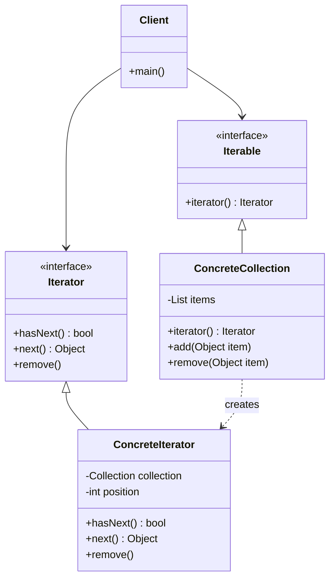

# Iterator Pattern - Collection Traversal

In software development, we often need to access elements of a collection sequentially without exposing the underlying structure.

**Example:** Traversing arrays, lists, trees, graphs, database results, file systems, etc.

Direct access to collection internals violates encapsulation and makes client code dependent on specific collection implementations.

This is where the **Iterator Design Pattern** comes into play.

It's a fundamental behavioral pattern that enables collection traversal and is a core concept in most programming languages.

## What is Iterator Pattern?

Iterator Pattern is a behavioral design pattern that provides a way to access elements of a collection sequentially without exposing its underlying representation.

It separates the traversal algorithm from the collection structure, allowing different iteration strategies without changing the collection.

The pattern follows the Single Responsibility Principle by extracting traversal behavior into separate iterator objects.

## Class Diagram



## Implementation

### 1. Custom Collection with Iterator

```java
import java.util.*;

// Iterator interface
interface Iterator<T> {
    boolean hasNext();
    T next();
    void remove();
}

// Iterable interface
interface Iterable<T> {
    Iterator<T> iterator();
}

// Custom Book class for demonstration
class Book {
    private String title;
    private String author;
    private String isbn;
    private int year;

    public Book(String title, String author, String isbn, int year) {
        this.title = title;
        this.author = author;
        this.isbn = isbn;
        this.year = year;
    }

    // Getters
    public String getTitle() { return title; }
    public String getAuthor() { return author; }
    public String getIsbn() { return isbn; }
    public int getYear() { return year; }

    @Override
    public String toString() {
        return String.format("Book{title='%s', author='%s', year=%d}", title, author, year);
    }

    @Override
    public boolean equals(Object obj) {
        if (this == obj) return true;
        if (obj == null || getClass() != obj.getClass()) return false;
        Book book = (Book) obj;
        return Objects.equals(isbn, book.isbn);
    }

    @Override
    public int hashCode() {
        return Objects.hash(isbn);
    }
}

// Custom collection implementation
class BookCollection implements Iterable<Book> {
    private List<Book> books;

    public BookCollection() {
        this.books = new ArrayList<>();
    }

    public void addBook(Book book) {
        if (!books.contains(book)) {
            books.add(book);
            System.out.println("Added: " + book.getTitle());
        }
    }

    public void removeBook(Book book) {
        if (books.remove(book)) {
            System.out.println("Removed: " + book.getTitle());
        }
    }

    public int size() {
        return books.size();
    }

    public Book getBook(int index) {
        return books.get(index);
    }

    // Iterator implementation
    @Override
    public Iterator<Book> iterator() {
        return new BookIterator();
    }

    // Forward iterator
    public Iterator<Book> forwardIterator() {
        return new BookIterator();
    }

    // Reverse iterator
    public Iterator<Book> reverseIterator() {
        return new ReverseBookIterator();
    }

    // Author-filtered iterator
    public Iterator<Book> authorIterator(String author) {
        return new AuthorFilterIterator(author);
    }

    // Year-filtered iterator
    public Iterator<Book> yearIterator(int year) {
        return new YearFilterIterator(year);
    }

    // Inner class - Forward Iterator
    private class BookIterator implements Iterator<Book> {
        private int currentIndex = 0;
        private int lastReturnedIndex = -1;

        @Override
        public boolean hasNext() {
            return currentIndex < books.size();
        }

        @Override
        public Book next() {
            if (!hasNext()) {
                throw new NoSuchElementException("No more books in collection");
            }
            lastReturnedIndex = currentIndex;
            return books.get(currentIndex++);
        }

        @Override
        public void remove() {
            if (lastReturnedIndex < 0) {
                throw new IllegalStateException("Cannot remove before calling next()");
            }
            books.remove(lastReturnedIndex);
            currentIndex = lastReturnedIndex;
            lastReturnedIndex = -1;
            System.out.println("Book removed via iterator");
        }
    }

    // Inner class - Reverse Iterator
    private class ReverseBookIterator implements Iterator<Book> {
        private int currentIndex;
        private int lastReturnedIndex = -1;

        public ReverseBookIterator() {
            this.currentIndex = books.size() - 1;
        }

        @Override
        public boolean hasNext() {
            return currentIndex >= 0;
        }

        @Override
        public Book next() {
            if (!hasNext()) {
                throw new NoSuchElementException("No more books in reverse collection");
            }
            lastReturnedIndex = currentIndex;
            return books.get(currentIndex--);
        }

        @Override
        public void remove() {
            if (lastReturnedIndex < 0) {
                throw new IllegalStateException("Cannot remove before calling next()");
            }
            books.remove(lastReturnedIndex);
            currentIndex = lastReturnedIndex - 1;
            lastReturnedIndex = -1;
            System.out.println("Book removed via reverse iterator");
        }
    }

    // Inner class - Author Filter Iterator
    private class AuthorFilterIterator implements Iterator<Book> {
        private String targetAuthor;
        private int currentIndex = 0;
        private int lastReturnedIndex = -1;

        public AuthorFilterIterator(String author) {
            this.targetAuthor = author;
        }

        @Override
        public boolean hasNext() {
            while (currentIndex < books.size()) {
                if (books.get(currentIndex).getAuthor().equalsIgnoreCase(targetAuthor)) {
                    return true;
                }
                currentIndex++;
            }
            return false;
        }

        @Override
        public Book next() {
            if (!hasNext()) {
                throw new NoSuchElementException("No more books by " + targetAuthor);
            }
            lastReturnedIndex = currentIndex;
            return books.get(currentIndex++);
        }

        @Override
        public void remove() {
            if (lastReturnedIndex < 0) {
                throw new IllegalStateException("Cannot remove before calling next()");
            }
            books.remove(lastReturnedIndex);
            currentIndex = lastReturnedIndex;
            lastReturnedIndex = -1;
        }
    }

    // Inner class - Year Filter Iterator
    private class YearFilterIterator implements Iterator<Book> {
        private int targetYear;
        private int currentIndex = 0;
        private int lastReturnedIndex = -1;

        public YearFilterIterator(int year) {
            this.targetYear = year;
        }

        @Override
        public boolean hasNext() {
            while (currentIndex < books.size()) {
                if (books.get(currentIndex).getYear() == targetYear) {
                    return true;
                }
                currentIndex++;
            }
            return false;
        }

        @Override
        public Book next() {
            if (!hasNext()) {
                throw new NoSuchElementException("No more books from " + targetYear);
            }
            lastReturnedIndex = currentIndex;
            return books.get(currentIndex++);
        }

        @Override
        public void remove() {
            if (lastReturnedIndex < 0) {
                throw new IllegalStateException("Cannot remove before calling next()");
            }
            books.remove(lastReturnedIndex);
            currentIndex = lastReturnedIndex;
            lastReturnedIndex = -1;
        }
    }
}

// Usage Example
class BookCollectionExample {
    public static void main(String[] args) {
        BookCollection library = new BookCollection();

        // Add books
        library.addBook(new Book("1984", "George Orwell", "978-0-452-28423-4", 1949));
        library.addBook(new Book("Animal Farm", "George Orwell", "978-0-452-28424-1", 1945));
        library.addBook(new Book("Brave New World", "Aldous Huxley", "978-0-06-085052-4", 1932));
        library.addBook(new Book("Fahrenheit 451", "Ray Bradbury", "978-1-4516-7331-9", 1953));
        library.addBook(new Book("The Martian Chronicles", "Ray Bradbury", "978-0-380-97383-7", 1950));

        // Forward iteration
        System.out.println("\n=== Forward Iteration ===");
        Iterator<Book> forward = library.forwardIterator();
        while (forward.hasNext()) {
            System.out.println(forward.next());
        }

        // Reverse iteration
        System.out.println("\n=== Reverse Iteration ===");
        Iterator<Book> reverse = library.reverseIterator();
        while (reverse.hasNext()) {
            System.out.println(reverse.next());
        }

        // Author-specific iteration
        System.out.println("\n=== Books by George Orwell ===");
        Iterator<Book> orwellBooks = library.authorIterator("George Orwell");
        while (orwellBooks.hasNext()) {
            System.out.println(orwellBooks.next());
        }

        // Year-specific iteration
        System.out.println("\n=== Books from 1950 ===");
        Iterator<Book> books1950 = library.yearIterator(1950);
        while (books1950.hasNext()) {
            System.out.println(books1950.next());
        }

        // Enhanced for-loop (uses default iterator)
        System.out.println("\n=== Enhanced For-Loop ===");
        for (Book book : library) {
            System.out.println(book.getTitle() + " by " + book.getAuthor());
        }

        // Iterator removal
        System.out.println("\n=== Removing books via iterator ===");
        Iterator<Book> iterator = library.iterator();
        while (iterator.hasNext()) {
            Book book = iterator.next();
            if (book.getYear() < 1950) {
                iterator.remove();
            }
        }

        System.out.println("\nRemaining books: " + library.size());
        for (Book book : library) {
            System.out.println(book);
        }
    }
}
```

### 2. Tree Traversal Iterators

```java
// Tree node class
class TreeNode<T> {
    private T data;
    private List<TreeNode<T>> children;
    private TreeNode<T> parent;

    public TreeNode(T data) {
        this.data = data;
        this.children = new ArrayList<>();
        this.parent = null;
    }

    public void addChild(TreeNode<T> child) {
        children.add(child);
        child.parent = this;
    }

    public void removeChild(TreeNode<T> child) {
        children.remove(child);
        child.parent = null;
    }

    // Getters
    public T getData() { return data; }
    public List<TreeNode<T>> getChildren() { return new ArrayList<>(children); }
    public TreeNode<T> getParent() { return parent; }
    public boolean isLeaf() { return children.isEmpty(); }
    public boolean isRoot() { return parent == null; }

    @Override
    public String toString() {
        return String.valueOf(data);
    }
}

// Tree collection with multiple traversal strategies
class Tree<T> implements Iterable<T> {
    private TreeNode<T> root;

    public Tree(TreeNode<T> root) {
        this.root = root;
    }

    public TreeNode<T> getRoot() {
        return root;
    }

    // Default iterator (breadth-first)
    @Override
    public Iterator<T> iterator() {
        return breadthFirstIterator();
    }

    // Breadth-first traversal iterator
    public Iterator<T> breadthFirstIterator() {
        return new BreadthFirstIterator();
    }

    // Depth-first traversal iterator
    public Iterator<T> depthFirstIterator() {
        return new DepthFirstIterator();
    }

    // Pre-order traversal iterator
    public Iterator<T> preOrderIterator() {
        return new PreOrderIterator();
    }

    // Post-order traversal iterator
    public Iterator<T> postOrderIterator() {
        return new PostOrderIterator();
    }

    // Breadth-First Iterator
    private class BreadthFirstIterator implements Iterator<T> {
        private Queue<TreeNode<T>> queue = new LinkedList<>();

        public BreadthFirstIterator() {
            if (root != null) {
                queue.offer(root);
            }
        }

        @Override
        public boolean hasNext() {
            return !queue.isEmpty();
        }

        @Override
        public T next() {
            if (!hasNext()) {
                throw new NoSuchElementException("No more elements in breadth-first traversal");
            }

            TreeNode<T> current = queue.poll();

            // Add children to queue
            for (TreeNode<T> child : current.getChildren()) {
                queue.offer(child);
            }

            return current.getData();
        }

        @Override
        public void remove() {
            throw new UnsupportedOperationException("Remove not supported for tree traversal");
        }
    }

    // Depth-First Iterator (using stack)
    private class DepthFirstIterator implements Iterator<T> {
        private Stack<TreeNode<T>> stack = new Stack<>();

        public DepthFirstIterator() {
            if (root != null) {
                stack.push(root);
            }
        }

        @Override
        public boolean hasNext() {
            return !stack.isEmpty();
        }

        @Override
        public T next() {
            if (!hasNext()) {
                throw new NoSuchElementException("No more elements in depth-first traversal");
            }

            TreeNode<T> current = stack.pop();

            // Add children to stack in reverse order (so leftmost is processed first)
            List<TreeNode<T>> children = current.getChildren();
            for (int i = children.size() - 1; i >= 0; i--) {
                stack.push(children.get(i));
            }

            return current.getData();
        }

        @Override
        public void remove() {
            throw new UnsupportedOperationException("Remove not supported for tree traversal");
        }
    }

    // Pre-order Iterator (recursive approach using stack)
    private class PreOrderIterator implements Iterator<T> {
        private Stack<TreeNode<T>> stack = new Stack<>();

        public PreOrderIterator() {
            if (root != null) {
                stack.push(root);
            }
        }

        @Override
        public boolean hasNext() {
            return !stack.isEmpty();
        }

        @Override
        public T next() {
            if (!hasNext()) {
                throw new NoSuchElementException("No more elements in pre-order traversal");
            }

            TreeNode<T> current = stack.pop();

            // Push children in reverse order
            List<TreeNode<T>> children = current.getChildren();
            for (int i = children.size() - 1; i >= 0; i--) {
                stack.push(children.get(i));
            }

            return current.getData();
        }

        @Override
        public void remove() {
            throw new UnsupportedOperationException("Remove not supported for tree traversal");
        }
    }

    // Post-order Iterator (more complex - need to track visited nodes)
    private class PostOrderIterator implements Iterator<T> {
        private Stack<TreeNode<T>> stack = new Stack<>();
        private Set<TreeNode<T>> visited = new HashSet<>();
        private TreeNode<T> lastReturned = null;

        public PostOrderIterator() {
            if (root != null) {
                pushLeftmostPath(root);
            }
        }

        private void pushLeftmostPath(TreeNode<T> node) {
            while (node != null) {
                stack.push(node);
                if (!node.getChildren().isEmpty()) {
                    node = node.getChildren().get(0); // Go to first child
                } else {
                    break;
                }
            }
        }

        @Override
        public boolean hasNext() {
            return !stack.isEmpty();
        }

        @Override
        public T next() {
            if (!hasNext()) {
                throw new NoSuchElementException("No more elements in post-order traversal");
            }

            TreeNode<T> current = stack.peek();

            // Check if all children have been visited
            boolean allChildrenVisited = current.getChildren().stream()
                    .allMatch(child -> visited.contains(child));

            if (current.isLeaf() || allChildrenVisited) {
                // All children processed, return this node
                stack.pop();
                visited.add(current);
                lastReturned = current;
                return current.getData();
            } else {
                // Need to process children first
                List<TreeNode<T>> children = current.getChildren();
                for (TreeNode<T> child : children) {
                    if (!visited.contains(child)) {
                        pushLeftmostPath(child);
                        break;
                    }
                }
                return next(); // Recursive call
            }
        }

        @Override
        public void remove() {
            throw new UnsupportedOperationException("Remove not supported for tree traversal");
        }
    }
}

// Tree traversal example
class TreeTraversalExample {
    public static void main(String[] args) {
        // Create tree structure
        //       A
        //     / | \
        //    B  C  D
        //   /|  |  |\
        //  E F  G  H I

        TreeNode<String> root = new TreeNode<>("A");
        TreeNode<String> nodeB = new TreeNode<>("B");
        TreeNode<String> nodeC = new TreeNode<>("C");
        TreeNode<String> nodeD = new TreeNode<>("D");
        TreeNode<String> nodeE = new TreeNode<>("E");
        TreeNode<String> nodeF = new TreeNode<>("F");
        TreeNode<String> nodeG = new TreeNode<>("G");
        TreeNode<String> nodeH = new TreeNode<>("H");
        TreeNode<String> nodeI = new TreeNode<>("I");

        root.addChild(nodeB);
        root.addChild(nodeC);
        root.addChild(nodeD);

        nodeB.addChild(nodeE);
        nodeB.addChild(nodeF);

        nodeC.addChild(nodeG);

        nodeD.addChild(nodeH);
        nodeD.addChild(nodeI);

        Tree<String> tree = new Tree<>(root);

        // Breadth-first traversal
        System.out.println("Breadth-First Traversal:");
        Iterator<String> bfs = tree.breadthFirstIterator();
        while (bfs.hasNext()) {
            System.out.print(bfs.next() + " ");
        }
        System.out.println();

        // Depth-first traversal
        System.out.println("\nDepth-First Traversal:");
        Iterator<String> dfs = tree.depthFirstIterator();
        while (dfs.hasNext()) {
            System.out.print(dfs.next() + " ");
        }
        System.out.println();

        // Pre-order traversal
        System.out.println("\nPre-Order Traversal:");
        Iterator<String> preOrder = tree.preOrderIterator();
        while (preOrder.hasNext()) {
            System.out.print(preOrder.next() + " ");
        }
        System.out.println();

        // Enhanced for-loop (uses default iterator)
        System.out.println("\nDefault Iterator (Breadth-First):");
        for (String node : tree) {
            System.out.print(node + " ");
        }
        System.out.println();
    }
}
```

### 3. Database Result Iterator

```java
import java.util.*;

// Simulated database record
class DatabaseRecord {
    private Map<String, Object> fields;

    public DatabaseRecord() {
        this.fields = new HashMap<>();
    }

    public void setField(String name, Object value) {
        fields.put(name, value);
    }

    public Object getField(String name) {
        return fields.get(name);
    }

    public Set<String> getFieldNames() {
        return fields.keySet();
    }

    @Override
    public String toString() {
        return fields.toString();
    }
}

// Database result set with iterator support
class DatabaseResultSet implements Iterable<DatabaseRecord> {
    private List<DatabaseRecord> records;
    private String[] columnNames;
    private int currentPosition = -1;

    public DatabaseResultSet(String[] columnNames) {
        this.columnNames = columnNames.clone();
        this.records = new ArrayList<>();
    }

    public void addRecord(Object... values) {
        if (values.length != columnNames.length) {
            throw new IllegalArgumentException("Number of values must match number of columns");
        }

        DatabaseRecord record = new DatabaseRecord();
        for (int i = 0; i < columnNames.length; i++) {
            record.setField(columnNames[i], values[i]);
        }
        records.add(record);
    }

    public int getRecordCount() {
        return records.size();
    }

    public String[] getColumnNames() {
        return columnNames.clone();
    }

    // Default iterator
    @Override
    public Iterator<DatabaseRecord> iterator() {
        return new DatabaseIterator();
    }

    // Filtered iterator
    public Iterator<DatabaseRecord> filteredIterator(String columnName, Object value) {
        return new FilteredDatabaseIterator(columnName, value);
    }

    // Sorted iterator
    public Iterator<DatabaseRecord> sortedIterator(String columnName, boolean ascending) {
        return new SortedDatabaseIterator(columnName, ascending);
    }

    // Paginated iterator
    public Iterator<DatabaseRecord> paginatedIterator(int pageSize, int pageNumber) {
        return new PaginatedDatabaseIterator(pageSize, pageNumber);
    }

    // Basic Database Iterator
    private class DatabaseIterator implements Iterator<DatabaseRecord> {
        private int currentIndex = 0;
        private int lastReturnedIndex = -1;

        @Override
        public boolean hasNext() {
            return currentIndex < records.size();
        }

        @Override
        public DatabaseRecord next() {
            if (!hasNext()) {
                throw new NoSuchElementException("No more records");
            }
            lastReturnedIndex = currentIndex;
            return records.get(currentIndex++);
        }

        @Override
        public void remove() {
            if (lastReturnedIndex < 0) {
                throw new IllegalStateException("Cannot remove before calling next()");
            }
            records.remove(lastReturnedIndex);
            currentIndex = lastReturnedIndex;
            lastReturnedIndex = -1;
        }
    }

    // Filtered Database Iterator
    private class FilteredDatabaseIterator implements Iterator<DatabaseRecord> {
        private String filterColumn;
        private Object filterValue;
        private int currentIndex = 0;
        private DatabaseRecord nextRecord = null;
        private boolean nextRecordFound = false;

        public FilteredDatabaseIterator(String columnName, Object value) {
            this.filterColumn = columnName;
            this.filterValue = value;
            findNextRecord();
        }

        private void findNextRecord() {
            nextRecordFound = false;
            while (currentIndex < records.size()) {
                DatabaseRecord record = records.get(currentIndex);
                Object fieldValue = record.getField(filterColumn);

                if (Objects.equals(fieldValue, filterValue)) {
                    nextRecord = record;
                    nextRecordFound = true;
                    break;
                }
                currentIndex++;
            }
        }

        @Override
        public boolean hasNext() {
            return nextRecordFound;
        }

        @Override
        public DatabaseRecord next() {
            if (!hasNext()) {
                throw new NoSuchElementException("No more filtered records");
            }

            DatabaseRecord result = nextRecord;
            currentIndex++;
            findNextRecord();
            return result;
        }

        @Override
        public void remove() {
            throw new UnsupportedOperationException("Remove not supported for filtered iterator");
        }
    }

    // Sorted Database Iterator
    private class SortedDatabaseIterator implements Iterator<DatabaseRecord> {
        private List<DatabaseRecord> sortedRecords;
        private int currentIndex = 0;

        public SortedDatabaseIterator(String columnName, boolean ascending) {
            this.sortedRecords = new ArrayList<>(records);

            sortedRecords.sort((r1, r2) -> {
                Object v1 = r1.getField(columnName);
                Object v2 = r2.getField(columnName);

                int comparison = 0;
                if (v1 instanceof Comparable && v2 instanceof Comparable) {
                    comparison = ((Comparable) v1).compareTo(v2);
                } else {
                    comparison = String.valueOf(v1).compareTo(String.valueOf(v2));
                }

                return ascending ? comparison : -comparison;
            });
        }

        @Override
        public boolean hasNext() {
            return currentIndex < sortedRecords.size();
        }

        @Override
        public DatabaseRecord next() {
            if (!hasNext()) {
                throw new NoSuchElementException("No more sorted records");
            }
            return sortedRecords.get(currentIndex++);
        }

        @Override
        public void remove() {
            throw new UnsupportedOperationException("Remove not supported for sorted iterator");
        }
    }

    // Paginated Database Iterator
    private class PaginatedDatabaseIterator implements Iterator<DatabaseRecord> {
        private int startIndex;
        private int endIndex;
        private int currentIndex;

        public PaginatedDatabaseIterator(int pageSize, int pageNumber) {
            this.startIndex = pageNumber * pageSize;
            this.endIndex = Math.min(startIndex + pageSize, records.size());
            this.currentIndex = startIndex;
        }

        @Override
        public boolean hasNext() {
            return currentIndex < endIndex;
        }

        @Override
        public DatabaseRecord next() {
            if (!hasNext()) {
                throw new NoSuchElementException("No more records in this page");
            }
            return records.get(currentIndex++);
        }

        @Override
        public void remove() {
            throw new UnsupportedOperationException("Remove not supported for paginated iterator");
        }
    }
}

// Database example
class DatabaseExample {
    public static void main(String[] args) {
        // Create result set
        DatabaseResultSet resultSet = new DatabaseResultSet(
            new String[]{"id", "name", "department", "salary", "age"}
        );

        // Add sample data
        resultSet.addRecord(1, "John Doe", "Engineering", 75000, 30);
        resultSet.addRecord(2, "Jane Smith", "Marketing", 65000, 28);
        resultSet.addRecord(3, "Bob Johnson", "Engineering", 80000, 35);
        resultSet.addRecord(4, "Alice Brown", "Sales", 70000, 32);
        resultSet.addRecord(5, "Charlie Wilson", "Engineering", 85000, 40);
        resultSet.addRecord(6, "Diana Davis", "Marketing", 60000, 26);

        // Basic iteration
        System.out.println("=== All Records ===");
        for (DatabaseRecord record : resultSet) {
            System.out.println(record);
        }

        // Filtered iteration
        System.out.println("\n=== Engineering Department ===");
        Iterator<DatabaseRecord> engineeringIter = resultSet.filteredIterator("department", "Engineering");
        while (engineeringIter.hasNext()) {
            DatabaseRecord record = engineeringIter.next();
            System.out.println(record.getField("name") + " - $" + record.getField("salary"));
        }

        // Sorted iteration
        System.out.println("\n=== Sorted by Salary (Descending) ===");
        Iterator<DatabaseRecord> salaryIter = resultSet.sortedIterator("salary", false);
        while (salaryIter.hasNext()) {
            DatabaseRecord record = salaryIter.next();
            System.out.println(record.getField("name") + " - $" + record.getField("salary"));
        }

        // Paginated iteration
        System.out.println("\n=== Page 1 (Page Size: 3) ===");
        Iterator<DatabaseRecord> page1Iter = resultSet.paginatedIterator(3, 0);
        while (page1Iter.hasNext()) {
            DatabaseRecord record = page1Iter.next();
            System.out.println(record.getField("name"));
        }

        System.out.println("\n=== Page 2 (Page Size: 3) ===");
        Iterator<DatabaseRecord> page2Iter = resultSet.paginatedIterator(3, 1);
        while (page2Iter.hasNext()) {
            DatabaseRecord record = page2Iter.next();
            System.out.println(record.getField("name"));
        }
    }
}
```

## Test Code

```java
import org.junit.jupiter.api.Test;
import org.junit.jupiter.api.BeforeEach;
import static org.junit.jupiter.api.Assertions.*;
import java.util.*;

class IteratorPatternTest {
    private BookCollection library;

    @BeforeEach
    void setUp() {
        library = new BookCollection();
        library.addBook(new Book("1984", "George Orwell", "978-0-452-28423-4", 1949));
        library.addBook(new Book("Animal Farm", "George Orwell", "978-0-452-28424-1", 1945));
        library.addBook(new Book("Brave New World", "Aldous Huxley", "978-0-06-085052-4", 1932));
        library.addBook(new Book("Fahrenheit 451", "Ray Bradbury", "978-1-4516-7331-9", 1953));
    }

    @Test
    void testBasicIteration() {
        Iterator<Book> iterator = library.iterator();
        List<String> titles = new ArrayList<>();

        while (iterator.hasNext()) {
            titles.add(iterator.next().getTitle());
        }

        assertEquals(4, titles.size());
        assertTrue(titles.contains("1984"));
        assertTrue(titles.contains("Animal Farm"));
        assertTrue(titles.contains("Brave New World"));
        assertTrue(titles.contains("Fahrenheit 451"));
    }

    @Test
    void testReverseIteration() {
        Iterator<Book> reverseIterator = library.reverseIterator();
        List<String> titles = new ArrayList<>();

        while (reverseIterator.hasNext()) {
            titles.add(reverseIterator.next().getTitle());
        }

        assertEquals(4, titles.size());
        // Should be in reverse order of addition
        assertEquals("Fahrenheit 451", titles.get(0));
        assertEquals("Brave New World", titles.get(1));
        assertEquals("Animal Farm", titles.get(2));
        assertEquals("1984", titles.get(3));
    }

    @Test
    void testAuthorFiltering() {
        Iterator<Book> orwellIterator = library.authorIterator("George Orwell");
        List<String> orwellBooks = new ArrayList<>();

        while (orwellIterator.hasNext()) {
            orwellBooks.add(orwellIterator.next().getTitle());
        }

        assertEquals(2, orwellBooks.size());
        assertTrue(orwellBooks.contains("1984"));
        assertTrue(orwellBooks.contains("Animal Farm"));
    }

    @Test
    void testYearFiltering() {
        Iterator<Book> books1949 = library.yearIterator(1949);
        assertTrue(books1949.hasNext());
        assertEquals("1984", books1949.next().getTitle());
        assertFalse(books1949.hasNext());

        Iterator<Book> books2000 = library.yearIterator(2000);
        assertFalse(books2000.hasNext());
    }

    @Test
    void testIteratorRemoval() {
        Iterator<Book> iterator = library.iterator();

        // Remove first book
        assertTrue(iterator.hasNext());
        Book firstBook = iterator.next();
        iterator.remove();

        assertEquals(3, library.size());

        // Verify the book was actually removed
        Iterator<Book> verifyIterator = library.iterator();
        List<String> remainingTitles = new ArrayList<>();
        while (verifyIterator.hasNext()) {
            remainingTitles.add(verifyIterator.next().getTitle());
        }
        assertFalse(remainingTitles.contains(firstBook.getTitle()));
    }

    @Test
    void testEnhancedForLoop() {
        List<String> titles = new ArrayList<>();

        for (Book book : library) {
            titles.add(book.getTitle());
        }

        assertEquals(4, titles.size());
    }

    @Test
    void testIteratorExceptions() {
        Iterator<Book> iterator = library.iterator();

        // Test remove before next
        assertThrows(IllegalStateException.class, () -> iterator.remove());

        // Consume all elements
        while (iterator.hasNext()) {
            iterator.next();
        }

        // Test next when no more elements
        assertThrows(NoSuchElementException.class, () -> iterator.next());
    }

    @Test
    void testTreeTraversal() {
        // Create simple tree: A -> B, C
        TreeNode<String> root = new TreeNode<>("A");
        TreeNode<String> nodeB = new TreeNode<>("B");
        TreeNode<String> nodeC = new TreeNode<>("C");

        root.addChild(nodeB);
        root.addChild(nodeC);

        Tree<String> tree = new Tree<>(root);

        // Test breadth-first traversal
        Iterator<String> bfsIterator = tree.breadthFirstIterator();
        assertEquals("A", bfsIterator.next());
        assertEquals("B", bfsIterator.next());
        assertEquals("C", bfsIterator.next());
        assertFalse(bfsIterator.hasNext());

        // Test depth-first traversal
        Iterator<String> dfsIterator = tree.depthFirstIterator();
        assertEquals("A", dfsIterator.next());
        assertEquals("B", dfsIterator.next());
        assertEquals("C", dfsIterator.next());
        assertFalse(dfsIterator.hasNext());
    }

    @Test
    void testDatabaseResultSet() {
        DatabaseResultSet resultSet = new DatabaseResultSet(new String[]{"id", "name", "age"});
        resultSet.addRecord(1, "John", 30);
        resultSet.addRecord(2, "Jane", 25);
        resultSet.addRecord(3, "Bob", 35);

        // Test basic iteration
        Iterator<DatabaseRecord> iterator = resultSet.iterator();
        int count = 0;
        while (iterator.hasNext()) {
            DatabaseRecord record = iterator.next();
            assertNotNull(record);
            count++;
        }
        assertEquals(3, count);

        // Test filtered iteration
        Iterator<DatabaseRecord> filteredIter = resultSet.filteredIterator("name", "Jane");
        assertTrue(filteredIter.hasNext());
        DatabaseRecord janeRecord = filteredIter.next();
        assertEquals("Jane", janeRecord.getField("name"));
        assertEquals(25, janeRecord.getField("age"));
        assertFalse(filteredIter.hasNext());

        // Test sorted iteration
        Iterator<DatabaseRecord> sortedIter = resultSet.sortedIterator("age", true);
        DatabaseRecord first = sortedIter.next();
        DatabaseRecord second = sortedIter.next();
        DatabaseRecord third = sortedIter.next();

        assertEquals(25, first.getField("age"));
        assertEquals(30, second.getField("age"));
        assertEquals(35, third.getField("age"));

        // Test pagination
        Iterator<DatabaseRecord> page1 = resultSet.paginatedIterator(2, 0);
        assertTrue(page1.hasNext());
        page1.next();
        assertTrue(page1.hasNext());
        page1.next();
        assertFalse(page1.hasNext());

        Iterator<DatabaseRecord> page2 = resultSet.paginatedIterator(2, 1);
        assertTrue(page2.hasNext());
        page2.next();
        assertFalse(page2.hasNext());
    }

    @Test
    void testMultipleIteratorsIndependence() {
        Iterator<Book> iterator1 = library.iterator();
        Iterator<Book> iterator2 = library.iterator();

        // Advance first iterator
        iterator1.next();
        iterator1.next();

        // Second iterator should start from beginning
        Book firstFromIterator2 = iterator2.next();
        assertEquals("1984", firstFromIterator2.getTitle()); // First book added

        // Both iterators should be independent
        assertTrue(iterator1.hasNext());
        assertTrue(iterator2.hasNext());
    }
}
```

## Real-World Examples of Iterator Pattern

### 1. **Java Collections Framework**

- **List.iterator()**: ArrayList, LinkedList, Vector iterators
- **Set.iterator()**: HashSet, TreeSet, LinkedHashSet iterators
- **Map.entrySet().iterator()**: HashMap entry iteration
- **Stream API**: Java 8+ streams use iterator-like patterns

### 2. **Database Access**

- **JDBC ResultSet**: Forward-only cursor for database results
- **JPA Query Results**: Entity iteration with lazy loading
- **NoSQL Cursors**: MongoDB, Redis scan operations
- **ORM Frameworks**: Hibernate, MyBatis result iteration

### 3. **File System Operations**

- **Directory Iteration**: Files.walk(), DirectoryStream
- **File Reading**: BufferedReader line iteration, Scanner
- **Archive Processing**: ZIP, TAR file entry iteration
- **Log File Processing**: Line-by-line log analysis

### 4. **UI and Graphics**

- **DOM Traversal**: HTML element iteration in browsers
- **Scene Graphs**: 3D graphics object traversal
- **Component Trees**: Swing, JavaFX component hierarchy
- **Event Processing**: UI event queue iteration

## Specific Examples:

**java.util.Iterator**: Core Java iterator interface used throughout collections framework.

**java.sql.ResultSet**: Database result iteration with next(), previous() methods.

**java.util.stream.Stream**: Functional-style iteration with map, filter, reduce operations.

**javax.xml.stream.XMLStreamReader**: XML document element-by-element parsing.

**java.nio.file.DirectoryStream**: Modern file system directory traversal.

## Pros and Cons of Iterator Pattern

| **Pros**                                                                      | **Cons**                                                                |
| ----------------------------------------------------------------------------- | ----------------------------------------------------------------------- |
| ✅ **Encapsulation**: Hides internal collection structure from clients        | ❌ **Memory Overhead**: Each iterator maintains its own state           |
| ✅ **Uniform Interface**: Same traversal interface for different collections  | ❌ **Modification Issues**: Collection changes can invalidate iterators |
| ✅ **Multiple Traversals**: Can have multiple active iterators simultaneously | ❌ **Performance**: Slower than direct access for simple collections    |
| ✅ **Flexible Traversal**: Support different traversal strategies             | ❌ **Complexity**: Can be overkill for simple iteration needs           |
| ✅ **Single Responsibility**: Separates traversal logic from collection logic | ❌ **State Management**: Iterator state can become complex              |

## Best Practices

### ⚠️ **Warnings & Considerations**

1. **Concurrent Modification**: Handle collection changes during iteration properly
2. **Resource Cleanup**: Ensure iterators release resources when done
3. **Exception Handling**: Provide clear error messages for invalid operations
4. **Performance**: Consider direct access for simple, small collections
5. **Thread Safety**: Make iterators thread-safe if collections are accessed concurrently

### 🏆 **Modern Alternatives & Enhancements**

- **Stream API**: Java 8+ functional-style iteration and processing
- **Enhanced For-Loop**: Simplified syntax for basic iteration
- **Reactive Streams**: Asynchronous iteration with backpressure
- **Parallel Streams**: Concurrent iteration for performance
- **Spliterator**: Java 8 splitting iterator for parallel processing

### 💡 **When to Use Iterator Pattern**

✅ **Use When:**

- You need to traverse a collection without exposing its structure
- You want to support multiple simultaneous traversals
- You need different traversal algorithms for the same collection
- You want to provide a uniform interface for different collection types

❌ **Avoid When:**

- Collection structure is simple and unlikely to change
- Performance is critical and direct access is sufficient
- You only need simple forward iteration
- Memory usage is constrained and iterator overhead matters

The Iterator pattern is fundamental to collection processing and provides the foundation for clean, maintainable code that works with data structures in a uniform way, making it essential for any application that processes collections of data.
