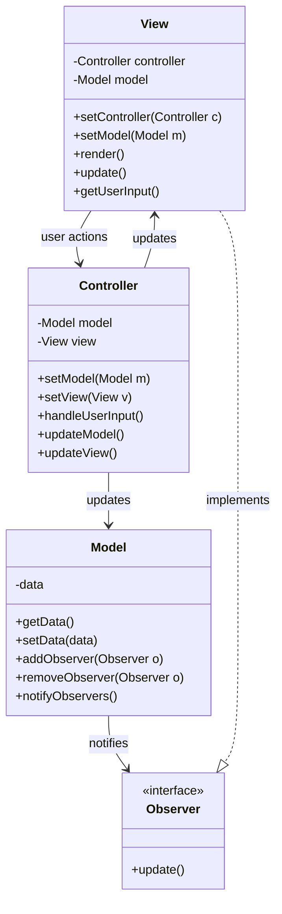

# MVC Pattern - UI Architecture Separation

In software development, we often need to build user interfaces that are maintainable, testable, and allow for separation of concerns between data, presentation, and user interaction logic.

**Example:** Web applications, desktop GUIs, mobile apps, game interfaces, etc.

Mixing business logic with presentation code creates tightly coupled, hard-to-test, and difficult-to-maintain applications.

This is where the **Model-View-Controller (MVC) Design Pattern** comes into play.

It's a fundamental architectural pattern that separates application concerns and is essential for building scalable user interfaces.

## What is MVC Pattern?

MVC Pattern is an architectural design pattern that separates an application into three interconnected components: Model (data/business logic), View (presentation), and Controller (user input handling).

It promotes separation of concerns, making applications more organized, testable, and maintainable by isolating business logic from presentation logic.

The pattern follows the Single Responsibility Principle where each component has a distinct role in the application architecture.

## Class Diagram



## Implementation

### 1. Web Application MVC

```java
import java.util.*;
import java.util.concurrent.CopyOnWriteArrayList;

// Observer pattern for Model-View communication
interface Observer {
    void update();
}

interface Observable {
    void addObserver(Observer observer);
    void removeObserver(Observer observer);
    void notifyObservers();
}

// Model Layer - Data and Business Logic
class User {
    private String id;
    private String username;
    private String email;
    private boolean active;
    private Date createdAt;

    public User(String id, String username, String email) {
        this.id = id;
        this.username = username;
        this.email = email;
        this.active = true;
        this.createdAt = new Date();
    }

    // Getters and setters
    public String getId() { return id; }
    public String getUsername() { return username; }
    public void setUsername(String username) { this.username = username; }
    public String getEmail() { return email; }
    public void setEmail(String email) { this.email = email; }
    public boolean isActive() { return active; }
    public void setActive(boolean active) { this.active = active; }
    public Date getCreatedAt() { return createdAt; }

    @Override
    public String toString() {
        return String.format("User{id='%s', username='%s', email='%s', active=%s}",
                            id, username, email, active);
    }
}

// Model class with business logic
class UserModel implements Observable {
    private List<User> users;
    private List<Observer> observers;
    private User selectedUser;
    private String lastError;

    public UserModel() {
        this.users = new ArrayList<>();
        this.observers = new CopyOnWriteArrayList<>();
        initializeData();
    }

    private void initializeData() {
        users.add(new User("1", "john_doe", "john@example.com"));
        users.add(new User("2", "jane_smith", "jane@example.com"));
        users.add(new User("3", "bob_wilson", "bob@example.com"));
    }

    // Business logic methods
    public boolean addUser(String username, String email) {
        // Validation
        if (username == null || username.trim().isEmpty()) {
            lastError = "Username cannot be empty";
            notifyObservers();
            return false;
        }

        if (email == null || !email.contains("@")) {
            lastError = "Invalid email format";
            notifyObservers();
            return false;
        }

        // Check for duplicates
        for (User user : users) {
            if (user.getUsername().equals(username)) {
                lastError = "Username already exists";
                notifyObservers();
                return false;
            }
        }

        // Create new user
        String id = String.valueOf(users.size() + 1);
        User newUser = new User(id, username, email);
        users.add(newUser);
        lastError = null;

        System.out.println("Model: User added - " + newUser);
        notifyObservers();
        return true;
    }

    public boolean updateUser(String id, String username, String email) {
        User user = findUserById(id);
        if (user == null) {
            lastError = "User not found";
            notifyObservers();
            return false;
        }

        if (username != null && !username.trim().isEmpty()) {
            user.setUsername(username);
        }

        if (email != null && email.contains("@")) {
            user.setEmail(email);
        }

        lastError = null;
        System.out.println("Model: User updated - " + user);
        notifyObservers();
        return true;
    }

    public boolean deleteUser(String id) {
        User user = findUserById(id);
        if (user == null) {
            lastError = "User not found";
            notifyObservers();
            return false;
        }

        users.remove(user);
        if (selectedUser != null && selectedUser.getId().equals(id)) {
            selectedUser = null;
        }

        lastError = null;
        System.out.println("Model: User deleted with ID - " + id);
        notifyObservers();
        return true;
    }

    public User findUserById(String id) {
        return users.stream()
                .filter(user -> user.getId().equals(id))
                .findFirst()
                .orElse(null);
    }

    public List<User> searchUsers(String query) {
        if (query == null || query.trim().isEmpty()) {
            return new ArrayList<>(users);
        }

        String searchTerm = query.toLowerCase();
        return users.stream()
                .filter(user -> user.getUsername().toLowerCase().contains(searchTerm) ||
                               user.getEmail().toLowerCase().contains(searchTerm))
                .collect(ArrayList::new, ArrayList::add, ArrayList::addAll);
    }

    // Getters for view
    public List<User> getAllUsers() {
        return new ArrayList<>(users);
    }

    public User getSelectedUser() {
        return selectedUser;
    }

    public void setSelectedUser(User user) {
        this.selectedUser = user;
        notifyObservers();
    }

    public String getLastError() {
        return lastError;
    }

    public void clearError() {
        lastError = null;
        notifyObservers();
    }

    // Observer pattern implementation
    @Override
    public void addObserver(Observer observer) {
        observers.add(observer);
        System.out.println("Observer added to UserModel");
    }

    @Override
    public void removeObserver(Observer observer) {
        observers.remove(observer);
        System.out.println("Observer removed from UserModel");
    }

    @Override
    public void notifyObservers() {
        for (Observer observer : observers) {
            observer.update();
        }
    }
}

// View Layer - Presentation Logic
abstract class View implements Observer {
    protected UserModel model;
    protected Controller controller;

    public void setModel(UserModel model) {
        if (this.model != null) {
            this.model.removeObserver(this);
        }
        this.model = model;
        if (this.model != null) {
            this.model.addObserver(this);
        }
    }

    public void setController(Controller controller) {
        this.controller = controller;
    }

    public abstract void render();
    public abstract void showError(String error);
    public abstract void showSuccess(String message);
}

// Console View Implementation
class ConsoleView extends View {
    private Scanner scanner = new Scanner(System.in);

    @Override
    public void render() {
        clearScreen();
        displayHeader();
        displayMenu();
        displayUsers();
        displaySelectedUser();
        displayError();
    }

    private void clearScreen() {
        // In a real console app, this would clear the screen
        System.out.println("\n" + "=".repeat(60));
    }

    private void displayHeader() {
        System.out.println("🎯 USER MANAGEMENT SYSTEM - CONSOLE VIEW");
        System.out.println("=".repeat(60));
    }

    private void displayMenu() {
        System.out.println("\n📋 MENU:");
        System.out.println("1. Add User    2. Update User    3. Delete User");
        System.out.println("4. Search      5. Select User    6. Refresh");
        System.out.println("0. Exit");
        System.out.println("-".repeat(40));
    }

    private void displayUsers() {
        System.out.println("\n👥 USERS:");
        List<User> users = model.getAllUsers();
        if (users.isEmpty()) {
            System.out.println("  No users found.");
        } else {
            for (User user : users) {
                String marker = (model.getSelectedUser() != null &&
                               model.getSelectedUser().getId().equals(user.getId())) ? "➤ " : "  ";
                System.out.println(marker + user);
            }
        }
    }

    private void displaySelectedUser() {
        User selected = model.getSelectedUser();
        if (selected != null) {
            System.out.println("\n🎯 SELECTED USER:");
            System.out.println("  " + selected);
            System.out.println("  Created: " + selected.getCreatedAt());
            System.out.println("  Status: " + (selected.isActive() ? "Active" : "Inactive"));
        }
    }

    private void displayError() {
        String error = model.getLastError();
        if (error != null) {
            System.out.println("\n❌ ERROR: " + error);
        }
    }

    @Override
    public void showError(String error) {
        System.out.println("\n❌ " + error);
    }

    @Override
    public void showSuccess(String message) {
        System.out.println("\n✅ " + message);
    }

    @Override
    public void update() {
        // Model has changed, re-render the view
        render();
    }

    // User input methods
    public String getMenuChoice() {
        System.out.print("\nEnter choice: ");
        return scanner.nextLine().trim();
    }

    public String getUserInput(String prompt) {
        System.out.print(prompt + ": ");
        return scanner.nextLine().trim();
    }

    public void waitForUser() {
        System.out.print("\nPress Enter to continue...");
        scanner.nextLine();
    }
}

// Web View Implementation (simulated)
class WebView extends View {
    private Map<String, String> formData = new HashMap<>();

    @Override
    public void render() {
        generateHTML();
    }

    private void generateHTML() {
        StringBuilder html = new StringBuilder();
        html.append("<!DOCTYPE html>\n<html>\n<head>\n");
        html.append("<title>User Management System</title>\n");
        html.append("<style>\n");
        html.append("body { font-family: Arial, sans-serif; margin: 20px; }\n");
        html.append(".user { border: 1px solid #ccc; margin: 5px; padding: 10px; }\n");
        html.append(".selected { background-color: #e6f3ff; }\n");
        html.append(".error { color: red; font-weight: bold; }\n");
        html.append(".success { color: green; font-weight: bold; }\n");
        html.append("</style>\n</head>\n<body>\n");

        // Header
        html.append("<h1>🎯 User Management System</h1>\n");

        // Error display
        String error = model.getLastError();
        if (error != null) {
            html.append("<div class='error'>❌ ").append(error).append("</div>\n");
        }

        // User form
        html.append("<form>\n");
        html.append("<h2>Add/Update User</h2>\n");
        html.append("Username: <input type='text' name='username' value='")
            .append(formData.getOrDefault("username", "")).append("'><br><br>\n");
        html.append("Email: <input type='email' name='email' value='")
            .append(formData.getOrDefault("email", "")).append("'><br><br>\n");
        html.append("<button type='button' onclick='addUser()'>Add User</button>\n");
        html.append("<button type='button' onclick='updateUser()'>Update Selected</button>\n");
        html.append("</form>\n");

        // User list
        html.append("<h2>👥 Users</h2>\n");
        List<User> users = model.getAllUsers();
        for (User user : users) {
            String cssClass = (model.getSelectedUser() != null &&
                             model.getSelectedUser().getId().equals(user.getId())) ?
                             "user selected" : "user";
            html.append("<div class='").append(cssClass).append("'>\n");
            html.append("<strong>").append(user.getUsername()).append("</strong> - ");
            html.append(user.getEmail()).append("<br>\n");
            html.append("ID: ").append(user.getId()).append(" | ");
            html.append("Status: ").append(user.isActive() ? "Active" : "Inactive").append("<br>\n");
            html.append("<button onclick='selectUser(\"").append(user.getId()).append("\")'>Select</button> ");
            html.append("<button onclick='deleteUser(\"").append(user.getId()).append("\")'>Delete</button>\n");
            html.append("</div>\n");
        }

        // JavaScript (simulated)
        html.append("<script>\n");
        html.append("function addUser() { /* call controller.addUser() */ }\n");
        html.append("function updateUser() { /* call controller.updateUser() */ }\n");
        html.append("function selectUser(id) { /* call controller.selectUser(id) */ }\n");
        html.append("function deleteUser(id) { /* call controller.deleteUser(id) */ }\n");
        html.append("</script>\n");

        html.append("</body>\n</html>");

        System.out.println("\n🌐 WEB VIEW RENDERED:");
        System.out.println("HTML Length: " + html.length() + " characters");
        System.out.println("Users displayed: " + users.size());
        if (model.getSelectedUser() != null) {
            System.out.println("Selected user: " + model.getSelectedUser().getUsername());
        }
    }

    @Override
    public void showError(String error) {
        System.out.println("🌐 Web Error: " + error);
    }

    @Override
    public void showSuccess(String message) {
        System.out.println("🌐 Web Success: " + message);
    }

    @Override
    public void update() {
        System.out.println("🌐 Web view updating due to model change...");
        render();
    }

    // Simulate form data
    public void setFormData(String username, String email) {
        formData.put("username", username);
        formData.put("email", email);
    }

    public Map<String, String> getFormData() {
        return new HashMap<>(formData);
    }
}

// Controller Layer - User Input Handling
class UserController {
    private UserModel model;
    private List<View> views;

    public UserController() {
        this.views = new ArrayList<>();
    }

    public void setModel(UserModel model) {
        this.model = model;
        // Update all views with new model
        for (View view : views) {
            view.setModel(model);
        }
    }

    public void addView(View view) {
        views.add(view);
        view.setController(this);
        if (model != null) {
            view.setModel(model);
        }
        System.out.println("View added to controller: " + view.getClass().getSimpleName());
    }

    public void removeView(View view) {
        views.remove(view);
        if (model != null) {
            model.removeObserver(view);
        }
    }

    // Controller action methods
    public boolean addUser(String username, String email) {
        System.out.println("Controller: Adding user - " + username + ", " + email);
        boolean success = model.addUser(username, email);

        if (success) {
            notifyViewsSuccess("User added successfully!");
        } else {
            notifyViewsError(model.getLastError());
        }

        return success;
    }

    public boolean updateUser(String id, String username, String email) {
        System.out.println("Controller: Updating user - " + id);
        boolean success = model.updateUser(id, username, email);

        if (success) {
            notifyViewsSuccess("User updated successfully!");
        } else {
            notifyViewsError(model.getLastError());
        }

        return success;
    }

    public boolean deleteUser(String id) {
        System.out.println("Controller: Deleting user - " + id);
        boolean success = model.deleteUser(id);

        if (success) {
            notifyViewsSuccess("User deleted successfully!");
        } else {
            notifyViewsError(model.getLastError());
        }

        return success;
    }

    public void selectUser(String id) {
        System.out.println("Controller: Selecting user - " + id);
        User user = model.findUserById(id);
        model.setSelectedUser(user);

        if (user != null) {
            notifyViewsSuccess("User selected: " + user.getUsername());
        } else {
            notifyViewsError("User not found: " + id);
        }
    }

    public List<User> searchUsers(String query) {
        System.out.println("Controller: Searching users - " + query);
        return model.searchUsers(query);
    }

    public void refreshView() {
        System.out.println("Controller: Refreshing views");
        model.clearError();
        // Views will be notified automatically through observer pattern
    }

    // View notification helpers
    private void notifyViewsSuccess(String message) {
        for (View view : views) {
            view.showSuccess(message);
        }
    }

    private void notifyViewsError(String error) {
        for (View view : views) {
            view.showError(error);
        }
    }

    // Get model data for views
    public List<User> getAllUsers() {
        return model.getAllUsers();
    }

    public User getSelectedUser() {
        return model.getSelectedUser();
    }
}

// Application class to wire everything together
class MVCApplication {
    private UserModel model;
    private UserController controller;
    private ConsoleView consoleView;
    private WebView webView;

    public void initialize() {
        System.out.println("🚀 Initializing MVC Application...");

        // Create Model
        model = new UserModel();

        // Create Controller
        controller = new UserController();
        controller.setModel(model);

        // Create Views
        consoleView = new ConsoleView();
        webView = new WebView();

        // Wire Views to Controller
        controller.addView(consoleView);
        controller.addView(webView);

        System.out.println("✅ MVC Application initialized successfully!");
    }

    public void runConsoleInterface() {
        System.out.println("\n🎮 Starting Console Interface...");

        boolean running = true;
        while (running) {
            consoleView.render();
            String choice = consoleView.getMenuChoice();

            switch (choice) {
                case "1": // Add User
                    String username = consoleView.getUserInput("Enter username");
                    String email = consoleView.getUserInput("Enter email");
                    controller.addUser(username, email);
                    break;

                case "2": // Update User
                    User selected = controller.getSelectedUser();
                    if (selected == null) {
                        consoleView.showError("No user selected");
                        consoleView.waitForUser();
                        break;
                    }
                    String newUsername = consoleView.getUserInput("Enter new username (current: " + selected.getUsername() + ")");
                    String newEmail = consoleView.getUserInput("Enter new email (current: " + selected.getEmail() + ")");
                    controller.updateUser(selected.getId(), newUsername, newEmail);
                    break;

                case "3": // Delete User
                    String deleteId = consoleView.getUserInput("Enter user ID to delete");
                    controller.deleteUser(deleteId);
                    break;

                case "4": // Search
                    String query = consoleView.getUserInput("Enter search query");
                    List<User> results = controller.searchUsers(query);
                    System.out.println("\n🔍 Search Results:");
                    results.forEach(user -> System.out.println("  " + user));
                    consoleView.waitForUser();
                    break;

                case "5": // Select User
                    String selectId = consoleView.getUserInput("Enter user ID to select");
                    controller.selectUser(selectId);
                    break;

                case "6": // Refresh
                    controller.refreshView();
                    break;

                case "0": // Exit
                    running = false;
                    System.out.println("👋 Goodbye!");
                    break;

                default:
                    consoleView.showError("Invalid choice: " + choice);
                    consoleView.waitForUser();
            }
        }
    }

    public void simulateWebInterface() {
        System.out.println("\n🌐 Simulating Web Interface...");

        // Simulate web interactions
        webView.setFormData("web_user", "web@example.com");
        controller.addUser("web_user", "web@example.com");

        controller.selectUser("1");

        webView.setFormData("updated_user", "updated@example.com");
        controller.updateUser("1", "updated_user", "updated@example.com");

        controller.searchUsers("web");

        System.out.println("🌐 Web interface simulation completed");
    }

    // Getters for testing
    public UserModel getModel() { return model; }
    public UserController getController() { return controller; }
    public ConsoleView getConsoleView() { return consoleView; }
    public WebView getWebView() { return webView; }
}

// Usage Example and Demo
class MVCPatternExample {
    public static void main(String[] args) {
        System.out.println("=== MVC Pattern Example ===");

        MVCApplication app = new MVCApplication();
        app.initialize();

        // Demonstrate programmatic usage
        System.out.println("\n" + "=".repeat(50));
        System.out.println("PROGRAMMATIC DEMONSTRATION");
        System.out.println("=".repeat(50));

        UserController controller = app.getController();

        // Add some users
        controller.addUser("alice_wonder", "alice@wonderland.com");
        controller.addUser("bob_builder", "bob@construction.com");

        // Select a user
        controller.selectUser("1");

        // Update selected user
        controller.updateUser("1", "alice_updated", "alice.updated@wonderland.com");

        // Search users
        List<User> searchResults = controller.searchUsers("alice");
        System.out.println("\n🔍 Search results for 'alice': " + searchResults.size() + " users found");

        // Simulate web interface
        app.simulateWebInterface();

        // Show that both views received updates
        System.out.println("\n📊 Final State:");
        System.out.println("Total users: " + controller.getAllUsers().size());
        System.out.println("Selected user: " +
                          (controller.getSelectedUser() != null ?
                           controller.getSelectedUser().getUsername() : "None"));

        // Uncomment to run interactive console interface
        // app.runConsoleInterface();
    }
}
```

### 2. Desktop GUI MVC (Swing-style)

```java
import javax.swing.*;
import java.awt.*;
import java.awt.event.ActionEvent;
import java.awt.event.ActionListener;
import java.util.List;

// Model for Calculator
class CalculatorModel implements Observable {
    private double result;
    private String lastOperation;
    private double lastOperand;
    private List<Observer> observers;

    public CalculatorModel() {
        this.result = 0.0;
        this.lastOperation = "";
        this.lastOperand = 0.0;
        this.observers = new ArrayList<>();
    }

    public void add(double value) {
        result += value;
        lastOperation = "+" + value;
        notifyObservers();
    }

    public void subtract(double value) {
        result -= value;
        lastOperation = "-" + value;
        notifyObservers();
    }

    public void multiply(double value) {
        result *= value;
        lastOperation = "*" + value;
        notifyObservers();
    }

    public void divide(double value) {
        if (value != 0) {
            result /= value;
            lastOperation = "/" + value;
        } else {
            lastOperation = "Error: Division by zero";
        }
        notifyObservers();
    }

    public void clear() {
        result = 0.0;
        lastOperation = "Clear";
        lastOperand = 0.0;
        notifyObservers();
    }

    public void setValue(double value) {
        result = value;
        lastOperation = "Set to " + value;
        notifyObservers();
    }

    // Getters
    public double getResult() { return result; }
    public String getLastOperation() { return lastOperation; }

    @Override
    public void addObserver(Observer observer) {
        observers.add(observer);
    }

    @Override
    public void removeObserver(Observer observer) {
        observers.remove(observer);
    }

    @Override
    public void notifyObservers() {
        for (Observer observer : observers) {
            observer.update();
        }
    }
}

// View for Calculator (Swing GUI simulation)
class CalculatorView extends View {
    private JFrame frame;
    private JTextField displayField;
    private JTextField operationField;
    private JPanel buttonPanel;
    private String currentInput = "";

    public CalculatorView() {
        initializeGUI();
    }

    private void initializeGUI() {
        // Simulate Swing components creation
        System.out.println("🖥️ Creating Calculator GUI components...");

        // Main frame
        frame = new JFrame("Calculator - MVC Pattern");

        // Display area
        displayField = new JTextField();
        displayField.setEditable(false);
        displayField.setText("0");

        operationField = new JTextField();
        operationField.setEditable(false);
        operationField.setText("Ready");

        // Button panel
        buttonPanel = new JPanel();

        System.out.println("✅ Calculator GUI components created");
    }

    @Override
    public void render() {
        System.out.println("\n🖥️ CALCULATOR VIEW RENDER:");
        System.out.println("┌─────────────────────┐");
        System.out.printf("│ Result: %11.2f │%n", model != null ? ((CalculatorModel)model).getResult() : 0.0);
        System.out.printf("│ Op: %-15s │%n", model != null ? ((CalculatorModel)model).getLastOperation() : "");
        System.out.printf("│ Input: %-12s │%n", currentInput);
        System.out.println("├─────────────────────┤");
        System.out.println("│ [7] [8] [9] [÷]     │");
        System.out.println("│ [4] [5] [6] [×]     │");
        System.out.println("│ [1] [2] [3] [-]     │");
        System.out.println("│ [0] [.] [=] [+]     │");
        System.out.println("│ [Clear]             │");
        System.out.println("└─────────────────────┘");
    }

    public void setCurrentInput(String input) {
        currentInput = input;
        updateDisplay();
    }

    public String getCurrentInput() {
        return currentInput;
    }

    private void updateDisplay() {
        if (displayField != null) {
            displayField.setText(currentInput.isEmpty() ? "0" : currentInput);
        }
    }

    @Override
    public void showError(String error) {
        System.out.println("🖥️ Calculator Error: " + error);
        if (operationField != null) {
            operationField.setText("Error: " + error);
        }
    }

    @Override
    public void showSuccess(String message) {
        System.out.println("🖥️ Calculator Success: " + message);
        if (operationField != null) {
            operationField.setText(message);
        }
    }

    @Override
    public void update() {
        System.out.println("🖥️ Calculator view updating...");
        if (model != null) {
            CalculatorModel calcModel = (CalculatorModel) model;
            displayField.setText(String.valueOf(calcModel.getResult()));
            operationField.setText(calcModel.getLastOperation());
        }
        render();
    }

    // Simulate button creation with action listeners
    public void addButtonListener(String buttonText, ActionListener listener) {
        System.out.println("🖥️ Added listener for button: " + buttonText);
        // In real Swing: JButton button = new JButton(buttonText);
        // button.addActionListener(listener);
    }
}

// Controller for Calculator
class CalculatorController {
    private CalculatorModel model;
    private CalculatorView view;
    private String currentOperation = "";
    private boolean waitingForOperand = false;

    public CalculatorController(CalculatorModel model, CalculatorView view) {
        this.model = model;
        this.view = view;

        view.setModel(model);
        view.setController(this);

        setupEventHandlers();
    }

    private void setupEventHandlers() {
        System.out.println("🎮 Setting up calculator event handlers...");

        // Number buttons
        for (int i = 0; i <= 9; i++) {
            final String number = String.valueOf(i);
            view.addButtonListener(number, e -> handleNumber(number));
        }

        // Operation buttons
        view.addButtonListener("+", e -> handleOperation("add"));
        view.addButtonListener("-", e -> handleOperation("subtract"));
        view.addButtonListener("×", e -> handleOperation("multiply"));
        view.addButtonListener("÷", e -> handleOperation("divide"));
        view.addButtonListener("=", e -> handleEquals());
        view.addButtonListener("Clear", e -> handleClear());
        view.addButtonListener(".", e -> handleDecimal());

        System.out.println("✅ Calculator event handlers setup complete");
    }

    public void handleNumber(String digit) {
        System.out.println("🎮 Controller: Number pressed - " + digit);

        if (waitingForOperand) {
            view.setCurrentInput(digit);
            waitingForOperand = false;
        } else {
            String current = view.getCurrentInput();
            view.setCurrentInput(current.equals("0") ? digit : current + digit);
        }
    }

    public void handleOperation(String operation) {
        System.out.println("🎮 Controller: Operation pressed - " + operation);

        String inputText = view.getCurrentInput();
        if (!inputText.isEmpty()) {
            double inputValue = Double.parseDouble(inputText);

            if (!currentOperation.isEmpty() && !waitingForOperand) {
                performCalculation(inputValue);
            } else {
                model.setValue(inputValue);
            }
        }

        currentOperation = operation;
        waitingForOperand = true;
    }

    public void handleEquals() {
        System.out.println("🎮 Controller: Equals pressed");

        String inputText = view.getCurrentInput();
        if (!inputText.isEmpty() && !currentOperation.isEmpty()) {
            double inputValue = Double.parseDouble(inputText);
            performCalculation(inputValue);
            currentOperation = "";
            waitingForOperand = true;
        }
    }

    public void handleClear() {
        System.out.println("🎮 Controller: Clear pressed");
        model.clear();
        view.setCurrentInput("");
        currentOperation = "";
        waitingForOperand = false;
    }

    public void handleDecimal() {
        System.out.println("🎮 Controller: Decimal pressed");
        String current = view.getCurrentInput();
        if (!current.contains(".")) {
            view.setCurrentInput(current.isEmpty() ? "0." : current + ".");
        }
    }

    private void performCalculation(double value) {
        switch (currentOperation) {
            case "add":
                model.add(value);
                break;
            case "subtract":
                model.subtract(value);
                break;
            case "multiply":
                model.multiply(value);
                break;
            case "divide":
                model.divide(value);
                break;
        }
    }

    // Simulate user interactions for testing
    public void simulateUserInput(String sequence) {
        System.out.println("\n🤖 Simulating user input: " + sequence);

        for (char c : sequence.toCharArray()) {
            switch (c) {
                case '0': case '1': case '2': case '3': case '4':
                case '5': case '6': case '7': case '8': case '9':
                    handleNumber(String.valueOf(c));
                    break;
                case '+':
                    handleOperation("add");
                    break;
                case '-':
                    handleOperation("subtract");
                    break;
                case '*':
                    handleOperation("multiply");
                    break;
                case '/':
                    handleOperation("divide");
                    break;
                case '=':
                    handleEquals();
                    break;
                case 'C':
                    handleClear();
                    break;
                case '.':
                    handleDecimal();
                    break;
                case ' ':
                    // Space - pause/delay simulation
                    try { Thread.sleep(100); } catch (InterruptedException e) {}
                    break;
            }
        }
    }
}

// Calculator Application
class CalculatorApp {
    private CalculatorModel model;
    private CalculatorView view;
    private CalculatorController controller;

    public void initialize() {
        System.out.println("🚀 Initializing Calculator MVC Application...");

        model = new CalculatorModel();
        view = new CalculatorView();
        controller = new CalculatorController(model, view);

        System.out.println("✅ Calculator MVC Application initialized!");
    }

    public void demonstrate() {
        System.out.println("\n📱 Calculator Demonstration:");

        // Show initial state
        view.render();

        // Simulate calculations
        controller.simulateUserInput("123+456=");

        System.out.println("\nAfter 123 + 456:");
        view.render();

        controller.simulateUserInput("*2=");

        System.out.println("\nAfter * 2:");
        view.render();

        controller.simulateUserInput("/4=");

        System.out.println("\nAfter / 4:");
        view.render();

        controller.simulateUserInput("C");

        System.out.println("\nAfter Clear:");
        view.render();

        // Test decimal operations
        controller.simulateUserInput("3.14*2=");

        System.out.println("\nAfter 3.14 * 2:");
        view.render();
    }

    public CalculatorModel getModel() { return model; }
    public CalculatorView getView() { return view; }
    public CalculatorController getController() { return controller; }
}

// Desktop MVC Example
class DesktopMVCExample {
    public static void main(String[] args) {
        System.out.println("=== Desktop GUI MVC Pattern Example ===");

        CalculatorApp app = new CalculatorApp();
        app.initialize();
        app.demonstrate();

        System.out.println("\n🎯 MVC Pattern Benefits Demonstrated:");
        System.out.println("✅ Model contains business logic (calculations)");
        System.out.println("✅ View handles presentation (GUI rendering)");
        System.out.println("✅ Controller manages user interactions");
        System.out.println("✅ Observer pattern keeps View synchronized with Model");
        System.out.println("✅ Separation of concerns makes code maintainable");
    }
}
```

## Test Code

```java
import org.junit.jupiter.api.Test;
import org.junit.jupiter.api.BeforeEach;
import static org.junit.jupiter.api.Assertions.*;

class MVCPatternTest {
    private UserModel model;
    private UserController controller;
    private ConsoleView consoleView;
    private WebView webView;

    @BeforeEach
    void setUp() {
        model = new UserModel();
        controller = new UserController();
        controller.setModel(model);

        consoleView = new ConsoleView();
        webView = new WebView();

        controller.addView(consoleView);
        controller.addView(webView);
    }

    @Test
    void testModelBusinessLogic() {
        // Test adding users
        assertTrue(model.addUser("testuser", "test@example.com"));
        assertEquals(4, model.getAllUsers().size()); // 3 initial + 1 new

        // Test validation
        assertFalse(model.addUser("", "test@example.com")); // Empty username
        assertFalse(model.addUser("testuser2", "invalid-email")); // Invalid email
        assertFalse(model.addUser("testuser", "another@example.com")); // Duplicate username

        // Test user retrieval
        User user = model.findUserById("1");
        assertNotNull(user);
        assertEquals("john_doe", user.getUsername());

        // Test user update
        assertTrue(model.updateUser("1", "john_updated", "john.updated@example.com"));
        user = model.findUserById("1");
        assertEquals("john_updated", user.getUsername());
        assertEquals("john.updated@example.com", user.getEmail());

        // Test user deletion
        assertTrue(model.deleteUser("1"));
        assertNull(model.findUserById("1"));
    }

    @Test
    void testSearchFunctionality() {
        model.addUser("alice", "alice@wonderland.com");
        model.addUser("bob", "bob@builder.com");

        // Test search by username
        List<User> results = model.searchUsers("alice");
        assertEquals(1, results.size());
        assertEquals("alice", results.get(0).getUsername());

        // Test search by email
        results = model.searchUsers("builder");
        assertEquals(1, results.size());
        assertEquals("bob", results.get(0).getUsername());

        // Test empty search (should return all)
        results = model.searchUsers("");
        assertEquals(5, results.size()); // 3 initial + 2 added

        // Test no results
        results = model.searchUsers("nonexistent");
        assertEquals(0, results.size());
    }

    @Test
    void testObserverPattern() {
        // Create a test observer
        boolean[] updated = {false};
        Observer testObserver = () -> updated[0] = true;

        model.addObserver(testObserver);

        // Trigger model change
        model.addUser("observer_test", "observer@test.com");

        assertTrue(updated[0], "Observer should be notified of model changes");
    }

    @Test
    void testControllerActions() {
        // Test add user through controller
        assertTrue(controller.addUser("controller_user", "controller@test.com"));
        User user = model.findUserById("4"); // Should be 4th user
        assertNotNull(user);
        assertEquals("controller_user", user.getUsername());

        // Test controller validation
        assertFalse(controller.addUser("", "invalid@test.com"));
        assertNotNull(model.getLastError());

        // Test user selection
        controller.selectUser("1");
        assertNotNull(controller.getSelectedUser());
        assertEquals("1", controller.getSelectedUser().getId());

        // Test update through controller
        assertTrue(controller.updateUser("1", "updated_via_controller", "updated@test.com"));
        user = model.findUserById("1");
        assertEquals("updated_via_controller", user.getUsername());

        // Test deletion through controller
        assertTrue(controller.deleteUser("1"));
        assertNull(model.findUserById("1"));
    }

    @Test
    void testViewModelSynchronization() {
        // Test that views are updated when model changes
        int initialUserCount = model.getAllUsers().size();

        // Add user through controller
        controller.addUser("sync_test", "sync@test.com");

        // Verify model has new user
        assertEquals(initialUserCount + 1, model.getAllUsers().size());

        // Both views should have been notified (tested through observer pattern)
        assertNotNull(consoleView.model);
        assertNotNull(webView.model);
        assertSame(model, consoleView.model);
        assertSame(model, webView.model);
    }

    @Test
    void testCalculatorMVC() {
        CalculatorModel calcModel = new CalculatorModel();
        CalculatorView calcView = new CalculatorView();
        CalculatorController calcController = new CalculatorController(calcModel, calcView);

        // Test basic calculation
        calcController.handleNumber("5");
        calcController.handleOperation("add");
        calcController.handleNumber("3");
        calcController.handleEquals();

        assertEquals(8.0, calcModel.getResult(), 0.001);

        // Test multiplication
        calcController.handleOperation("multiply");
        calcController.handleNumber("2");
        calcController.handleEquals();

        assertEquals(16.0, calcModel.getResult(), 0.001);

        // Test clear
        calcController.handleClear();
        assertEquals(0.0, calcModel.getResult(), 0.001);
    }

    @Test
    void testCalculatorValidation() {
        CalculatorModel model = new CalculatorModel();

        // Test division by zero
        model.setValue(10);
        model.divide(0);
        assertEquals("Error: Division by zero", model.getLastOperation());
        assertEquals(10.0, model.getResult()); // Result should remain unchanged
    }

    @Test
    void testMVCApplicationIntegration() {
        MVCApplication app = new MVCApplication();
        app.initialize();

        // Test that all components are properly wired
        assertNotNull(app.getModel());
        assertNotNull(app.getController());
        assertNotNull(app.getConsoleView());
        assertNotNull(app.getWebView());

        // Test that controller is connected to model
        UserController controller = app.getController();
        controller.addUser("integration_test", "integration@test.com");

        List<User> users = app.getModel().getAllUsers();
        assertTrue(users.stream().anyMatch(u -> u.getUsername().equals("integration_test")));
    }

    @Test
    void testMultipleViewsUpdates() {
        // Add another view to test multiple view updates
        WebView additionalWebView = new WebView();
        controller.addView(additionalWebView);

        // Verify all three views are registered
        controller.addUser("multi_view_test", "multiview@test.com");

        // All views should have the same model reference
        assertSame(model, consoleView.model);
        assertSame(model, webView.model);
        assertSame(model, additionalWebView.model);
    }

    @Test
    void testErrorHandling() {
        // Test model error handling
        assertFalse(model.addUser(null, "test@example.com"));
        assertNotNull(model.getLastError());

        assertFalse(model.updateUser("999", "test", "test@example.com"));
        assertNotNull(model.getLastError());

        assertFalse(model.deleteUser("999"));
        assertNotNull(model.getLastError());

        // Test error clearing
        model.clearError();
        assertNull(model.getLastError());
    }
}
```

## Real-World Examples of MVC Pattern

### 1. **Web Frameworks**

- **Spring MVC**: Java web framework with @Controller, @Service, @Repository
- **Ruby on Rails**: Convention-over-configuration MVC framework
- **Django**: Python web framework with models, views, templates
- **ASP.NET MVC**: Microsoft's MVC framework for .NET

### 2. **Frontend Frameworks**

- **Angular**: TypeScript MVC/MVVM framework with services and components
- **Backbone.js**: JavaScript MVC library with models, views, collections
- **Ember.js**: Convention-based MVC framework
- **Vue.js**: Progressive framework with MVC-like patterns

### 3. **Desktop Applications**

- **Swing/JavaFX**: Java desktop GUI with MVC separation
- **WPF**: Windows Presentation Foundation with MVVM pattern
- **Cocoa**: macOS development with MVC architecture
- **Qt**: Cross-platform GUI framework with MVC support

### 4. **Mobile Development**

- **iOS**: UIKit with Model-View-Controller architecture
- **Android**: Activity/Fragment with MVP/MVVM patterns
- **React Native**: Component-based architecture with MVC principles
- **Flutter**: Widget-based architecture with state management

## Specific Examples:

**javax.servlet.http.HttpServlet**: Base class for web MVC controllers.

**javax.swing.table.TableModel**: Swing table MVC model interface.

**org.springframework.web.servlet.mvc.Controller**: Spring MVC controller interface.

**android.app.Activity**: Android activity as MVC controller.

**javax.faces.component.UIComponent**: JSF component with MVC separation.

## Pros and Cons of MVC Pattern

| **Pros**                                                                  | **Cons**                                                                |
| ------------------------------------------------------------------------- | ----------------------------------------------------------------------- |
| ✅ **Separation of Concerns**: Clear division of responsibilities         | ❌ **Complexity**: Can be overkill for simple applications              |
| ✅ **Testability**: Easy to unit test individual components               | ❌ **Learning Curve**: Requires understanding of pattern concepts       |
| ✅ **Maintainability**: Changes in one layer don't affect others          | ❌ **Boilerplate**: More code structure and setup required              |
| ✅ **Reusability**: Models and controllers can be reused                  | ❌ **Performance**: Additional layers can impact performance            |
| ✅ **Parallel Development**: Different teams can work on different layers | ❌ **Tight Coupling**: Views and controllers can become tightly coupled |

## Best Practices

### ⚠️ **Warnings & Considerations**

1. **Fat Controllers**: Avoid putting business logic in controllers
2. **View Logic**: Keep views focused on presentation, not business logic
3. **Model Purity**: Keep models independent of UI concerns
4. **Observer Overuse**: Don't overuse observer pattern for performance
5. **Circular Dependencies**: Avoid circular references between components

### 🏆 **Modern Alternatives & Enhancements**

- **MVP (Model-View-Presenter)**: Presenter handles all UI logic
- **MVVM (Model-View-ViewModel)**: Data binding with view models
- **Component-Based Architecture**: React/Vue component patterns
- **Flux/Redux**: Unidirectional data flow architectures
- **Clean Architecture**: Layered architecture with dependency inversion

### 💡 **When to Use MVC Pattern**

✅ **Use When:**

- Building complex user interfaces with multiple screens
- You need to support multiple views for the same data
- Testing UI components is important
- Multiple developers are working on the same application
- Business logic is complex and needs separation

❌ **Avoid When:**

- Building simple, static applications
- UI is very simple with minimal user interaction
- Performance is critical and extra layers add overhead
- Team is small and overhead isn't justified
- Application has very simple business logic

The MVC pattern is essential for building maintainable, testable user interfaces and provides the foundation for most modern application architectures.
