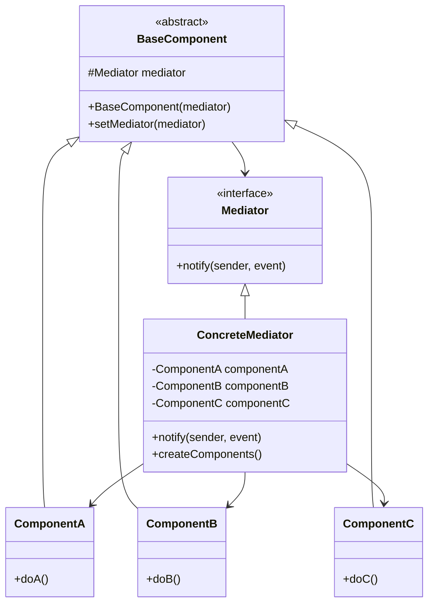

# Mediator Pattern - Reducing Object Coupling

In software development, we often have complex systems where many objects need to communicate with each other, leading to tight coupling and difficult-to-maintain code.

**Example:** GUI components, chat systems, workflow coordination, air traffic control, auction systems, etc.

Direct communication between objects creates a web of dependencies that makes the system fragile and hard to modify.

This is where the **Mediator Design Pattern** comes into play.

It's a fundamental behavioral pattern that promotes loose coupling by preventing objects from referring to each other explicitly and is essential for maintainable complex systems.

## What is Mediator Pattern?

Mediator Pattern is a behavioral design pattern that defines how a set of objects interact with each other. Instead of objects communicating directly, they communicate through a central mediator object.

It encapsulates the interaction logic in a separate mediator class, promoting loose coupling and making the interaction easier to understand and maintain.

The pattern follows the principle of "don't call us, we'll call you" by centralizing complex communications and control logic.

## Class Diagram



## Implementation

### 1. Chat Room Mediator Example

```java
import java.util.*;
import java.util.concurrent.CopyOnWriteArrayList;
import java.time.LocalDateTime;
import java.time.format.DateTimeFormatter;

// Mediator interface
interface ChatMediator {
    void sendMessage(String message, User user);
    void addUser(User user);
    void removeUser(User user);
    void sendPrivateMessage(String message, User sender, User receiver);
    void broadcastSystemMessage(String message);
    List<User> getActiveUsers();
}

// Abstract User (Colleague)
abstract class User {
    protected ChatMediator mediator;
    protected String name;
    protected boolean online;
    protected LocalDateTime joinTime;

    public User(ChatMediator mediator, String name) {
        this.mediator = mediator;
        this.name = name;
        this.online = true;
        this.joinTime = LocalDateTime.now();
    }

    public abstract void send(String message);
    public abstract void receive(String message, User sender);
    public abstract void receivePrivateMessage(String message, User sender);
    public abstract void receiveSystemMessage(String message);

    public String getName() { return name; }
    public boolean isOnline() { return online; }
    public void setOnline(boolean online) { this.online = online; }
    public LocalDateTime getJoinTime() { return joinTime; }

    @Override
    public boolean equals(Object obj) {
        if (this == obj) return true;
        if (obj == null || getClass() != obj.getClass()) return false;
        User user = (User) obj;
        return Objects.equals(name, user.name);
    }

    @Override
    public int hashCode() {
        return Objects.hash(name);
    }
}

// Concrete User implementations
class RegularUser extends User {
    private List<String> messageHistory = new ArrayList<>();

    public RegularUser(ChatMediator mediator, String name) {
        super(mediator, name);
    }

    @Override
    public void send(String message) {
        System.out.println("[" + name + "] Sending: " + message);
        mediator.sendMessage(message, this);
        messageHistory.add("SENT: " + message);
    }

    @Override
    public void receive(String message, User sender) {
        String formattedMessage = "[" + sender.getName() + "]: " + message;
        System.out.println("[" + name + "] Received: " + formattedMessage);
        messageHistory.add("RECEIVED: " + formattedMessage);
    }

    @Override
    public void receivePrivateMessage(String message, User sender) {
        String formattedMessage = "[PRIVATE from " + sender.getName() + "]: " + message;
        System.out.println("[" + name + "] " + formattedMessage);
        messageHistory.add("PRIVATE: " + formattedMessage);
    }

    @Override
    public void receiveSystemMessage(String message) {
        String formattedMessage = "[SYSTEM]: " + message;
        System.out.println("[" + name + "] " + formattedMessage);
        messageHistory.add("SYSTEM: " + formattedMessage);
    }

    public List<String> getMessageHistory() {
        return new ArrayList<>(messageHistory);
    }
}

class ModeratorUser extends User {
    private List<String> moderationLog = new ArrayList<>();

    public ModeratorUser(ChatMediator mediator, String name) {
        super(mediator, name);
    }

    @Override
    public void send(String message) {
        System.out.println("[MOD " + name + "] Sending: " + message);
        mediator.sendMessage("[MOD] " + message, this);
    }

    @Override
    public void receive(String message, User sender) {
        String formattedMessage = "[" + sender.getName() + "]: " + message;
        System.out.println("[MOD " + name + "] Received: " + formattedMessage);

        // Moderate content
        if (containsInappropriateContent(message)) {
            moderateMessage(sender, message);
        }
    }

    @Override
    public void receivePrivateMessage(String message, User sender) {
        String formattedMessage = "[PRIVATE from " + sender.getName() + "]: " + message;
        System.out.println("[MOD " + name + "] " + formattedMessage);
    }

    @Override
    public void receiveSystemMessage(String message) {
        String formattedMessage = "[SYSTEM]: " + message;
        System.out.println("[MOD " + name + "] " + formattedMessage);
    }

    private boolean containsInappropriateContent(String message) {
        String[] bannedWords = {"spam", "inappropriate", "banned"};
        String lowerMessage = message.toLowerCase();
        return Arrays.stream(bannedWords).anyMatch(lowerMessage::contains);
    }

    private void moderateMessage(User sender, String message) {
        String logEntry = "MODERATED: " + sender.getName() + " - " + message;
        moderationLog.add(logEntry);
        System.out.println("[MOD " + name + "] " + logEntry);

        // Send warning to sender
        mediator.sendPrivateMessage("Warning: Your message contained inappropriate content.", this, sender);
    }

    public void kickUser(User user, String reason) {
        String logEntry = "KICKED: " + user.getName() + " - Reason: " + reason;
        moderationLog.add(logEntry);
        System.out.println("[MOD " + name + "] " + logEntry);

        mediator.broadcastSystemMessage(user.getName() + " has been kicked by " + name + ". Reason: " + reason);
        mediator.removeUser(user);
    }

    public List<String> getModerationLog() {
        return new ArrayList<>(moderationLog);
    }
}

class BotUser extends User {
    private Map<String, String> responses = new HashMap<>();
    private int messageCount = 0;

    public BotUser(ChatMediator mediator, String name) {
        super(mediator, name);
        initializeResponses();
    }

    private void initializeResponses() {
        responses.put("help", "Available commands: !time, !users, !help");
        responses.put("time", "Current time: " + LocalDateTime.now().format(DateTimeFormatter.ofPattern("HH:mm:ss")));
        responses.put("users", "Use !users to see active users");
    }

    @Override
    public void send(String message) {
        // Bots don't send regular messages, they respond
    }

    @Override
    public void receive(String message, User sender) {
        messageCount++;

        // Respond to commands
        if (message.startsWith("!")) {
            handleCommand(message.substring(1).toLowerCase(), sender);
        }

        // Periodic announcements
        if (messageCount % 10 == 0) {
            mediator.broadcastSystemMessage("Reminder: Please keep the chat friendly and respectful!");
        }
    }

    @Override
    public void receivePrivateMessage(String message, User sender) {
        if (message.startsWith("!")) {
            handleCommand(message.substring(1).toLowerCase(), sender);
        } else {
            mediator.sendPrivateMessage("I'm a bot. Use !help for available commands.", this, sender);
        }
    }

    @Override
    public void receiveSystemMessage(String message) {
        // Bots can react to system messages
        if (message.contains("joined")) {
            // Wait a bit then send welcome message
            Timer timer = new Timer();
            timer.schedule(new TimerTask() {
                @Override
                public void run() {
                    mediator.broadcastSystemMessage("Welcome new users! Type !help for assistance.");
                }
            }, 2000);
        }
    }

    private void handleCommand(String command, User sender) {
        switch (command) {
            case "help":
                mediator.sendPrivateMessage(responses.get("help"), this, sender);
                break;
            case "time":
                String timeResponse = "Current time: " + LocalDateTime.now().format(DateTimeFormatter.ofPattern("HH:mm:ss"));
                mediator.sendPrivateMessage(timeResponse, this, sender);
                break;
            case "users":
                List<User> users = mediator.getActiveUsers();
                String userList = "Active users (" + users.size() + "): " +
                               users.stream().map(User::getName).reduce((a, b) -> a + ", " + b).orElse("None");
                mediator.sendPrivateMessage(userList, this, sender);
                break;
            default:
                mediator.sendPrivateMessage("Unknown command. Type !help for available commands.", this, sender);
        }
    }
}

// Concrete Mediator - Chat Room
class ChatRoom implements ChatMediator {
    private final List<User> users = new CopyOnWriteArrayList<>();
    private final List<String> chatLog = new ArrayList<>();
    private final String roomName;
    private final int maxUsers;

    public ChatRoom(String roomName, int maxUsers) {
        this.roomName = roomName;
        this.maxUsers = maxUsers;
        System.out.println("Chat room '" + roomName + "' created (max users: " + maxUsers + ")");
    }

    @Override
    public void sendMessage(String message, User sender) {
        if (!sender.isOnline()) {
            System.out.println("Cannot send message: " + sender.getName() + " is offline");
            return;
        }

        String timestamp = LocalDateTime.now().format(DateTimeFormatter.ofPattern("HH:mm:ss"));
        String logEntry = "[" + timestamp + "] " + sender.getName() + ": " + message;
        chatLog.add(logEntry);

        // Send to all users except sender
        for (User user : users) {
            if (user != sender && user.isOnline()) {
                user.receive(message, sender);
            }
        }
    }

    @Override
    public void addUser(User user) {
        if (users.size() >= maxUsers) {
            System.out.println("Cannot add " + user.getName() + ": Chat room is full");
            return;
        }

        if (users.contains(user)) {
            System.out.println(user.getName() + " is already in the chat room");
            return;
        }

        users.add(user);
        String joinMessage = user.getName() + " joined the chat room";
        System.out.println(joinMessage);

        // Notify all existing users
        broadcastSystemMessage(joinMessage);

        // Send welcome message to new user
        user.receiveSystemMessage("Welcome to " + roomName + "! There are " + users.size() + " users online.");
    }

    @Override
    public void removeUser(User user) {
        if (users.remove(user)) {
            user.setOnline(false);
            String leaveMessage = user.getName() + " left the chat room";
            System.out.println(leaveMessage);
            broadcastSystemMessage(leaveMessage);
        }
    }

    @Override
    public void sendPrivateMessage(String message, User sender, User receiver) {
        if (!sender.isOnline() || !receiver.isOnline()) {
            System.out.println("Cannot send private message: One or both users are offline");
            return;
        }

        if (!users.contains(receiver)) {
            sender.receiveSystemMessage("User " + receiver.getName() + " is not in this chat room");
            return;
        }

        receiver.receivePrivateMessage(message, sender);

        // Log private message
        String timestamp = LocalDateTime.now().format(DateTimeFormatter.ofPattern("HH:mm:ss"));
        String logEntry = "[" + timestamp + "] PRIVATE " + sender.getName() + " -> " + receiver.getName() + ": " + message;
        chatLog.add(logEntry);
    }

    @Override
    public void broadcastSystemMessage(String message) {
        String timestamp = LocalDateTime.now().format(DateTimeFormatter.ofPattern("HH:mm:ss"));
        String logEntry = "[" + timestamp + "] SYSTEM: " + message;
        chatLog.add(logEntry);

        for (User user : users) {
            if (user.isOnline()) {
                user.receiveSystemMessage(message);
            }
        }
    }

    @Override
    public List<User> getActiveUsers() {
        return users.stream()
                .filter(User::isOnline)
                .collect(ArrayList::new, ArrayList::add, ArrayList::addAll);
    }

    public String getRoomName() {
        return roomName;
    }

    public int getUserCount() {
        return users.size();
    }

    public List<String> getChatLog() {
        return new ArrayList<>(chatLog);
    }

    public void printChatStatistics() {
        System.out.println("\n=== Chat Room Statistics ===");
        System.out.println("Room: " + roomName);
        System.out.println("Active users: " + getActiveUsers().size() + "/" + maxUsers);
        System.out.println("Total messages: " + chatLog.size());

        Map<String, Long> userMessageCounts = new HashMap<>();
        for (String logEntry : chatLog) {
            if (logEntry.contains(":") && !logEntry.contains("SYSTEM")) {
                String[] parts = logEntry.split("]", 2);
                if (parts.length > 1) {
                    String[] nameParts = parts[1].trim().split(":", 2);
                    if (nameParts.length > 1) {
                        String userName = nameParts[0].trim();
                        userMessageCounts.put(userName, userMessageCounts.getOrDefault(userName, 0L) + 1);
                    }
                }
            }
        }

        System.out.println("User activity:");
        userMessageCounts.entrySet().stream()
                .sorted(Map.Entry.<String, Long>comparingByValue().reversed())
                .forEach(entry -> System.out.println("  " + entry.getKey() + ": " + entry.getValue() + " messages"));
    }
}

// Usage Example
class ChatRoomExample {
    public static void main(String[] args) throws InterruptedException {
        System.out.println("=== Mediator Pattern - Chat Room Example ===");

        // Create chat room
        ChatRoom chatRoom = new ChatRoom("General Chat", 10);

        // Create users
        RegularUser alice = new RegularUser(chatRoom, "Alice");
        RegularUser bob = new RegularUser(chatRoom, "Bob");
        RegularUser charlie = new RegularUser(chatRoom, "Charlie");
        ModeratorUser admin = new ModeratorUser(chatRoom, "Admin");
        BotUser helpBot = new BotUser(chatRoom, "HelpBot");

        // Add users to chat room
        chatRoom.addUser(alice);
        Thread.sleep(100);
        chatRoom.addUser(bob);
        Thread.sleep(100);
        chatRoom.addUser(charlie);
        Thread.sleep(100);
        chatRoom.addUser(admin);
        Thread.sleep(100);
        chatRoom.addUser(helpBot);

        Thread.sleep(500);

        // Chat interactions
        System.out.println("\n=== Chat Interactions ===");
        alice.send("Hello everyone!");
        Thread.sleep(200);

        bob.send("Hi Alice! How are you?");
        Thread.sleep(200);

        charlie.send("Hey there! This spam message should be inappropriate");
        Thread.sleep(200);

        admin.send("Welcome to the chat room! Please follow the rules.");
        Thread.sleep(200);

        // Private message
        System.out.println("\n=== Private Messages ===");
        chatRoom.sendPrivateMessage("How's the moderation going?", alice, admin);
        Thread.sleep(200);

        // Bot commands
        System.out.println("\n=== Bot Commands ===");
        alice.send("!help");
        Thread.sleep(200);

        bob.send("!time");
        Thread.sleep(200);

        charlie.send("!users");
        Thread.sleep(200);

        // Moderation action
        System.out.println("\n=== Moderation Action ===");
        if (admin instanceof ModeratorUser) {
            ((ModeratorUser) admin).kickUser(charlie, "Inappropriate content");
        }

        Thread.sleep(500);

        // Final statistics
        chatRoom.printChatStatistics();

        // Print individual user histories
        System.out.println("\n=== Alice's Message History ===");
        alice.getMessageHistory().forEach(System.out::println);

        System.out.println("\n=== Admin's Moderation Log ===");
        ((ModeratorUser) admin).getModerationLog().forEach(System.out::println);
    }
}
```

### 2. Air Traffic Control Mediator

```java
// Air Traffic Control Mediator Example
interface AirTrafficMediator {
    void requestLanding(Aircraft aircraft);
    void requestTakeoff(Aircraft aircraft);
    void reportPosition(Aircraft aircraft, String position);
    void emergencyLanding(Aircraft aircraft);
    List<Aircraft> getActiveAircraft();
}

// Aircraft base class
abstract class Aircraft {
    protected AirTrafficMediator mediator;
    protected String flightNumber;
    protected String aircraftType;
    protected AircraftState state;
    protected String currentPosition;
    protected int altitude;
    protected String destination;

    public enum AircraftState {
        APPROACHING, LANDING, LANDED, TAXIING, TAKING_OFF, AIRBORNE, EMERGENCY
    }

    public Aircraft(AirTrafficMediator mediator, String flightNumber, String aircraftType, String destination) {
        this.mediator = mediator;
        this.flightNumber = flightNumber;
        this.aircraftType = aircraftType;
        this.destination = destination;
        this.state = AircraftState.APPROACHING;
        this.altitude = 10000;
        this.currentPosition = "Unknown";
    }

    public abstract void receiveInstruction(String instruction);
    public abstract void notifyStateChange();

    // Getters and setters
    public String getFlightNumber() { return flightNumber; }
    public String getAircraftType() { return aircraftType; }
    public AircraftState getState() { return state; }
    public void setState(AircraftState state) {
        this.state = state;
        notifyStateChange();
    }
    public String getCurrentPosition() { return currentPosition; }
    public void setCurrentPosition(String position) {
        this.currentPosition = position;
        mediator.reportPosition(this, position);
    }
    public int getAltitude() { return altitude; }
    public void setAltitude(int altitude) { this.altitude = altitude; }
    public String getDestination() { return destination; }

    @Override
    public String toString() {
        return String.format("%s (%s) - %s - %s - %dft",
                           flightNumber, aircraftType, state, currentPosition, altitude);
    }
}

// Concrete Aircraft types
class CommercialAircraft extends Aircraft {
    private int passengerCount;
    private String airline;

    public CommercialAircraft(AirTrafficMediator mediator, String flightNumber,
                            String aircraftType, String destination, String airline, int passengerCount) {
        super(mediator, flightNumber, aircraftType, destination);
        this.airline = airline;
        this.passengerCount = passengerCount;
    }

    @Override
    public void receiveInstruction(String instruction) {
        System.out.println("[" + flightNumber + " Commercial] Received: " + instruction);

        // Process instruction
        if (instruction.contains("cleared for landing")) {
            setState(AircraftState.LANDING);
            setAltitude(0);
        } else if (instruction.contains("cleared for takeoff")) {
            setState(AircraftState.TAKING_OFF);
        } else if (instruction.contains("hold")) {
            System.out.println("[" + flightNumber + "] Entering holding pattern");
        }
    }

    @Override
    public void notifyStateChange() {
        System.out.println("[" + flightNumber + " Commercial] State changed to: " + state);

        if (state == AircraftState.LANDING) {
            System.out.println("[" + flightNumber + "] Landing with " + passengerCount + " passengers");
        }
    }

    public void requestLanding() {
        System.out.println("[" + flightNumber + " Commercial] Requesting landing clearance");
        mediator.requestLanding(this);
    }

    public void requestTakeoff() {
        System.out.println("[" + flightNumber + " Commercial] Requesting takeoff clearance");
        mediator.requestTakeoff(this);
    }
}

class CargoAircraft extends Aircraft {
    private double cargoWeight;
    private String cargoType;

    public CargoAircraft(AirTrafficMediator mediator, String flightNumber,
                        String aircraftType, String destination, String cargoType, double cargoWeight) {
        super(mediator, flightNumber, aircraftType, destination);
        this.cargoType = cargoType;
        this.cargoWeight = cargoWeight;
    }

    @Override
    public void receiveInstruction(String instruction) {
        System.out.println("[" + flightNumber + " Cargo] Received: " + instruction);

        if (instruction.contains("priority landing")) {
            setState(AircraftState.LANDING);
            setAltitude(0);
            System.out.println("[" + flightNumber + "] Priority landing for " + cargoType + " cargo");
        } else if (instruction.contains("cleared for takeoff")) {
            setState(AircraftState.TAKING_OFF);
        }
    }

    @Override
    public void notifyStateChange() {
        System.out.println("[" + flightNumber + " Cargo] State changed to: " + state);
    }

    public void requestLanding() {
        System.out.println("[" + flightNumber + " Cargo] Requesting landing clearance (" + cargoWeight + "kg " + cargoType + ")");
        mediator.requestLanding(this);
    }
}

class PrivateJet extends Aircraft {
    private String owner;
    private boolean vipStatus;

    public PrivateJet(AirTrafficMediator mediator, String flightNumber,
                     String aircraftType, String destination, String owner, boolean vipStatus) {
        super(mediator, flightNumber, aircraftType, destination);
        this.owner = owner;
        this.vipStatus = vipStatus;
    }

    @Override
    public void receiveInstruction(String instruction) {
        System.out.println("[" + flightNumber + " Private] Received: " + instruction);

        if (instruction.contains("expedited")) {
            System.out.println("[" + flightNumber + "] VIP expedited service");
        }
    }

    @Override
    public void notifyStateChange() {
        System.out.println("[" + flightNumber + " Private] State changed to: " + state);
    }

    public void requestPriorityService() {
        if (vipStatus) {
            System.out.println("[" + flightNumber + " Private] Requesting VIP priority service");
            mediator.requestLanding(this);
        }
    }
}

// Air Traffic Control Tower - Concrete Mediator
class AirTrafficControlTower implements AirTrafficMediator {
    private final List<Aircraft> activeAircraft = new ArrayList<>();
    private final Queue<Aircraft> landingQueue = new LinkedList<>();
    private final Queue<Aircraft> takeoffQueue = new LinkedList<>();
    private final List<String> runways = Arrays.asList("Runway 1", "Runway 2", "Runway 3");
    private final Map<String, Aircraft> runwayAssignments = new HashMap<>();
    private final String towerName;

    public AirTrafficControlTower(String towerName) {
        this.towerName = towerName;
        System.out.println("Air Traffic Control Tower '" + towerName + "' is operational");
    }

    @Override
    public void requestLanding(Aircraft aircraft) {
        if (!activeAircraft.contains(aircraft)) {
            activeAircraft.add(aircraft);
        }

        System.out.println("[ATC " + towerName + "] Landing request from " + aircraft.getFlightNumber());

        // Check for VIP or emergency priority
        if (aircraft instanceof PrivateJet && ((PrivateJet) aircraft).vipStatus) {
            // VIP gets priority
            landingQueue.add(aircraft);
            processLandingQueue();
        } else if (aircraft.getState() == Aircraft.AircraftState.EMERGENCY) {
            // Emergency gets highest priority
            ((LinkedList<Aircraft>) landingQueue).addFirst(aircraft);
            processLandingQueue();
        } else {
            landingQueue.add(aircraft);
            aircraft.receiveInstruction("Hold at current position. You are #" + landingQueue.size() + " in landing queue");

            if (landingQueue.size() == 1) {
                processLandingQueue();
            }
        }
    }

    @Override
    public void requestTakeoff(Aircraft aircraft) {
        System.out.println("[ATC " + towerName + "] Takeoff request from " + aircraft.getFlightNumber());

        takeoffQueue.add(aircraft);
        aircraft.receiveInstruction("Hold at gate. You are #" + takeoffQueue.size() + " in takeoff queue");

        if (takeoffQueue.size() == 1) {
            processTakeoffQueue();
        }
    }

    @Override
    public void reportPosition(Aircraft aircraft, String position) {
        System.out.println("[ATC " + towerName + "] " + aircraft.getFlightNumber() + " reports position: " + position);

        // Update tracking
        if (position.contains("final approach")) {
            aircraft.receiveInstruction("Maintain current heading, prepare for landing");
        } else if (position.contains("taxi")) {
            aircraft.setState(Aircraft.AircraftState.TAXIING);
        }
    }

    @Override
    public void emergencyLanding(Aircraft aircraft) {
        System.out.println("[ATC " + towerName + "] EMERGENCY LANDING REQUEST from " + aircraft.getFlightNumber());

        aircraft.setState(Aircraft.AircraftState.EMERGENCY);

        // Clear the runway immediately
        String assignedRunway = assignRunway(aircraft);
        if (assignedRunway != null) {
            aircraft.receiveInstruction("EMERGENCY CLEARANCE: " + assignedRunway + " cleared for immediate landing");

            // Notify other aircraft
            for (Aircraft other : activeAircraft) {
                if (other != aircraft) {
                    other.receiveInstruction("Emergency in progress, maintain safe distance");
                }
            }
        }
    }

    @Override
    public List<Aircraft> getActiveAircraft() {
        return new ArrayList<>(activeAircraft);
    }

    private void processLandingQueue() {
        if (!landingQueue.isEmpty()) {
            Aircraft aircraft = landingQueue.poll();
            String runway = assignRunway(aircraft);

            if (runway != null) {
                aircraft.receiveInstruction("Cleared for landing on " + runway);
                aircraft.setState(Aircraft.AircraftState.LANDING);

                // Schedule runway clearance
                Timer timer = new Timer();
                timer.schedule(new TimerTask() {
                    @Override
                    public void run() {
                        clearRunway(runway);
                        aircraft.setState(Aircraft.AircraftState.LANDED);
                        aircraft.setCurrentPosition("Gate");

                        // Process next in queue
                        if (!landingQueue.isEmpty()) {
                            processLandingQueue();
                        }
                    }
                }, 3000); // 3 seconds to land
            } else {
                // Put back in queue if no runway available
                landingQueue.add(aircraft);
                aircraft.receiveInstruction("Hold pattern, no runway available");
            }
        }
    }

    private void processTakeoffQueue() {
        if (!takeoffQueue.isEmpty()) {
            Aircraft aircraft = takeoffQueue.poll();
            String runway = assignRunway(aircraft);

            if (runway != null) {
                aircraft.receiveInstruction("Cleared for takeoff on " + runway);
                aircraft.setState(Aircraft.AircraftState.TAKING_OFF);

                // Schedule takeoff completion
                Timer timer = new Timer();
                timer.schedule(new TimerTask() {
                    @Override
                    public void run() {
                        clearRunway(runway);
                        aircraft.setState(Aircraft.AircraftState.AIRBORNE);
                        aircraft.setCurrentPosition("Departed");
                        aircraft.setAltitude(5000);

                        // Remove from active list
                        activeAircraft.remove(aircraft);

                        // Process next in queue
                        if (!takeoffQueue.isEmpty()) {
                            processTakeoffQueue();
                        }
                    }
                }, 2000); // 2 seconds to takeoff
            } else {
                // Put back in queue if no runway available
                takeoffQueue.add(aircraft);
                aircraft.receiveInstruction("Hold at gate, runway not available");
            }
        }
    }

    private String assignRunway(Aircraft aircraft) {
        for (String runway : runways) {
            if (!runwayAssignments.containsKey(runway)) {
                runwayAssignments.put(runway, aircraft);
                System.out.println("[ATC " + towerName + "] Assigned " + runway + " to " + aircraft.getFlightNumber());
                return runway;
            }
        }
        return null; // No runway available
    }

    private void clearRunway(String runway) {
        Aircraft aircraft = runwayAssignments.remove(runway);
        if (aircraft != null) {
            System.out.println("[ATC " + towerName + "] " + runway + " cleared, " + aircraft.getFlightNumber() + " operation complete");
        }
    }

    public void printStatus() {
        System.out.println("\n=== Air Traffic Control Status ===");
        System.out.println("Tower: " + towerName);
        System.out.println("Active aircraft: " + activeAircraft.size());
        System.out.println("Landing queue: " + landingQueue.size());
        System.out.println("Takeoff queue: " + takeoffQueue.size());
        System.out.println("Runway assignments: " + runwayAssignments.size() + "/" + runways.size());

        System.out.println("\nActive Aircraft:");
        for (Aircraft aircraft : activeAircraft) {
            System.out.println("  " + aircraft);
        }

        if (!runwayAssignments.isEmpty()) {
            System.out.println("\nRunway Assignments:");
            runwayAssignments.forEach((runway, aircraft) ->
                System.out.println("  " + runway + ": " + aircraft.getFlightNumber()));
        }
    }
}

// Air Traffic Control Example
class AirTrafficControlExample {
    public static void main(String[] args) throws InterruptedException {
        System.out.println("=== Mediator Pattern - Air Traffic Control Example ===");

        AirTrafficControlTower tower = new AirTrafficControlTower("Central Tower");

        // Create different types of aircraft
        CommercialAircraft flight101 = new CommercialAircraft(tower, "AA101", "Boeing 737", "New York", "American Airlines", 150);
        CommercialAircraft flight202 = new CommercialAircraft(tower, "UA202", "Airbus A320", "Chicago", "United Airlines", 180);
        CargoAircraft cargo303 = new CargoAircraft(tower, "FX303", "Boeing 747F", "Memphis", "Electronics", 50000);
        PrivateJet jet404 = new PrivateJet(tower, "PJ404", "Gulfstream G650", "Miami", "VIP Client", true);

        // Landing requests
        System.out.println("\n=== Landing Requests ===");
        flight101.requestLanding();
        Thread.sleep(500);

        flight202.requestLanding();
        Thread.sleep(500);

        cargo303.requestLanding();
        Thread.sleep(500);

        jet404.requestPriorityService();
        Thread.sleep(500);

        // Check status
        tower.printStatus();

        // Wait for some operations to complete
        Thread.sleep(4000);

        // Emergency situation
        System.out.println("\n=== Emergency Situation ===");
        CommercialAircraft emergency = new CommercialAircraft(tower, "EM999", "Boeing 777",
                                                             "Emergency Landing", "Emergency Air", 250);
        tower.emergencyLanding(emergency);

        Thread.sleep(1000);

        // Takeoff requests
        System.out.println("\n=== Takeoff Requests ===");
        flight101.requestTakeoff();
        flight202.requestTakeoff();

        Thread.sleep(3000);

        // Final status
        tower.printStatus();
    }
}
```

## Test Code

```java
import org.junit.jupiter.api.Test;
import org.junit.jupiter.api.BeforeEach;
import static org.junit.jupiter.api.Assertions.*;

class MediatorPatternTest {
    private ChatRoom chatRoom;
    private RegularUser alice;
    private RegularUser bob;
    private ModeratorUser admin;

    @BeforeEach
    void setUp() {
        chatRoom = new ChatRoom("Test Room", 5);
        alice = new RegularUser(chatRoom, "Alice");
        bob = new RegularUser(chatRoom, "Bob");
        admin = new ModeratorUser(chatRoom, "Admin");
    }

    @Test
    void testChatRoomUserManagement() {
        assertEquals(0, chatRoom.getUserCount());

        chatRoom.addUser(alice);
        assertEquals(1, chatRoom.getUserCount());
        assertTrue(chatRoom.getActiveUsers().contains(alice));

        chatRoom.addUser(bob);
        assertEquals(2, chatRoom.getUserCount());

        // Test duplicate user
        chatRoom.addUser(alice);
        assertEquals(2, chatRoom.getUserCount()); // Should not increase

        chatRoom.removeUser(alice);
        assertEquals(1, chatRoom.getUserCount());
        assertFalse(alice.isOnline());
    }

    @Test
    void testMessageSending() {
        chatRoom.addUser(alice);
        chatRoom.addUser(bob);
        chatRoom.addUser(admin);

        alice.send("Hello everyone!");

        // Check that message appears in chat log
        List<String> chatLog = chatRoom.getChatLog();
        assertTrue(chatLog.stream().anyMatch(log -> log.contains("Alice: Hello everyone!")));

        // Check that alice has the message in her history
        assertTrue(alice.getMessageHistory().stream()
                   .anyMatch(msg -> msg.contains("SENT: Hello everyone!")));
    }

    @Test
    void testPrivateMessages() {
        chatRoom.addUser(alice);
        chatRoom.addUser(bob);

        chatRoom.sendPrivateMessage("Secret message", alice, bob);

        // Check that private message appears in chat log
        List<String> chatLog = chatRoom.getChatLog();
        assertTrue(chatLog.stream().anyMatch(log ->
            log.contains("PRIVATE Alice -> Bob: Secret message")));
    }

    @Test
    void testModeratorFunctionality() {
        chatRoom.addUser(alice);
        chatRoom.addUser(bob);
        chatRoom.addUser(admin);

        // Send inappropriate message
        bob.send("This is spam content");

        // Check moderation log
        List<String> moderationLog = admin.getModerationLog();
        assertTrue(moderationLog.stream()
                   .anyMatch(log -> log.contains("MODERATED: Bob")));

        // Test kicking user
        admin.kickUser(bob, "Spamming");
        assertFalse(bob.isOnline());
        assertTrue(moderationLog.stream()
                   .anyMatch(log -> log.contains("KICKED: Bob")));
    }

    @Test
    void testBotCommands() {
        BotUser bot = new BotUser(chatRoom, "TestBot");
        chatRoom.addUser(alice);
        chatRoom.addUser(bot);

        // Simulate bot command
        bot.receive("!help", alice);
        bot.receivePrivateMessage("!time", alice);
        bot.receivePrivateMessage("!users", alice);
        bot.receivePrivateMessage("!unknown", alice);

        // Bot should handle commands without throwing exceptions
        assertDoesNotThrow(() -> bot.handleCommand("help", alice));
    }

    @Test
    void testChatRoomCapacity() {
        // Fill the chat room to capacity
        for (int i = 0; i < 5; i++) {
            RegularUser user = new RegularUser(chatRoom, "User" + i);
            chatRoom.addUser(user);
        }

        assertEquals(5, chatRoom.getUserCount());

        // Try to add one more user (should fail)
        RegularUser extraUser = new RegularUser(chatRoom, "ExtraUser");
        chatRoom.addUser(extraUser);

        assertEquals(5, chatRoom.getUserCount()); // Should not increase
        assertFalse(chatRoom.getActiveUsers().contains(extraUser));
    }

    @Test
    void testAirTrafficControlMediator() {
        AirTrafficControlTower tower = new AirTrafficControlTower("Test Tower");

        CommercialAircraft flight1 = new CommercialAircraft(tower, "TEST001", "Boeing 737",
                                                           "Test Destination", "Test Airlines", 100);

        assertEquals(0, tower.getActiveAircraft().size());

        flight1.requestLanding();

        // Aircraft should be added to active list
        assertTrue(tower.getActiveAircraft().contains(flight1));

        // Test state changes
        flight1.setState(Aircraft.AircraftState.LANDING);
        assertEquals(Aircraft.AircraftState.LANDING, flight1.getState());
    }

    @Test
    void testAircraftInstructions() {
        AirTrafficControlTower tower = new AirTrafficControlTower("Test Tower");
        CommercialAircraft aircraft = new CommercialAircraft(tower, "TEST002", "Airbus A320",
                                                            "Test City", "Test Air", 150);

        // Test instruction processing
        assertDoesNotThrow(() -> {
            aircraft.receiveInstruction("cleared for landing");
            aircraft.receiveInstruction("cleared for takeoff");
            aircraft.receiveInstruction("hold at current position");
        });

        // Test state notifications
        assertDoesNotThrow(() -> {
            aircraft.setState(Aircraft.AircraftState.LANDING);
            aircraft.setState(Aircraft.AircraftState.AIRBORNE);
        });
    }

    @Test
    void testEmergencyLanding() {
        AirTrafficControlTower tower = new AirTrafficControlTower("Emergency Tower");
        CommercialAircraft emergency = new CommercialAircraft(tower, "EMERGENCY", "Boeing 777",
                                                             "Emergency Landing", "Emergency Airlines", 200);

        assertDoesNotThrow(() -> {
            tower.emergencyLanding(emergency);
        });

        assertEquals(Aircraft.AircraftState.EMERGENCY, emergency.getState());
        assertTrue(tower.getActiveAircraft().contains(emergency));
    }

    @Test
    void testPositionReporting() {
        AirTrafficControlTower tower = new AirTrafficControlTower("Position Tower");
        CommercialAircraft aircraft = new CommercialAircraft(tower, "POS001", "Test Aircraft",
                                                            "Test Dest", "Test Airlines", 100);

        String initialPosition = aircraft.getCurrentPosition();
        aircraft.setCurrentPosition("Final Approach");

        assertNotEquals(initialPosition, aircraft.getCurrentPosition());
        assertEquals("Final Approach", aircraft.getCurrentPosition());
    }

    @Test
    void testMultipleAircraftCoordination() {
        AirTrafficControlTower tower = new AirTrafficControlTower("Busy Tower");

        CommercialAircraft flight1 = new CommercialAircraft(tower, "AA001", "Boeing 737", "NYC", "AA", 150);
        CommercialAircraft flight2 = new CommercialAircraft(tower, "UA002", "Airbus A320", "LAX", "UA", 180);
        CargoAircraft cargo = new CargoAircraft(tower, "FX003", "Boeing 747F", "MEM", "Electronics", 50000);

        // Request landings
        flight1.requestLanding();
        flight2.requestLanding();
        cargo.requestLanding();

        assertEquals(3, tower.getActiveAircraft().size());
        assertTrue(tower.getActiveAircraft().contains(flight1));
        assertTrue(tower.getActiveAircraft().contains(flight2));
        assertTrue(tower.getActiveAircraft().contains(cargo));
    }

    @Test
    void testUserEquality() {
        RegularUser user1 = new RegularUser(chatRoom, "TestUser");
        RegularUser user2 = new RegularUser(chatRoom, "TestUser");
        RegularUser user3 = new RegularUser(chatRoom, "DifferentUser");

        assertEquals(user1, user2); // Same name
        assertNotEquals(user1, user3); // Different name
        assertEquals(user1.hashCode(), user2.hashCode());
    }

    @Test
    void testChatRoomStatistics() {
        chatRoom.addUser(alice);
        chatRoom.addUser(bob);

        alice.send("Message 1");
        alice.send("Message 2");
        bob.send("Message 3");

        // Should not throw exception
        assertDoesNotThrow(() -> chatRoom.printChatStatistics());

        // Check chat log contains messages
        List<String> chatLog = chatRoom.getChatLog();
        assertEquals(3, chatLog.stream()
                          .filter(log -> !log.contains("SYSTEM"))
                          .count());
    }
}
```

## Real-World Examples of Mediator Pattern

### 1. **User Interface Frameworks**

- **Swing/AWT**: Event dispatch and component coordination
- **Android**: Activity and Fragment communication through ViewModels
- **React**: Redux for state management and component communication
- **Angular**: Services as mediators between components

### 2. **Enterprise Applications**

- **Spring Framework**: ApplicationContext as mediator for bean management
- **Message Brokers**: RabbitMQ, Apache Kafka for service communication
- **Workflow Engines**: Activiti, Camunda for process orchestration
- **ESB (Enterprise Service Bus)**: Integration pattern for service coordination

### 3. **Communication Systems**

- **Chat Applications**: Discord, Slack channel management
- **Video Conferencing**: Zoom, Teams session coordination
- **Email Systems**: SMTP servers coordinating message delivery
- **VoIP Systems**: SIP servers managing call routing

### 4. **Game Development**

- **Game Engines**: Unity, Unreal Engine event systems
- **Multiplayer Games**: Server-side player coordination
- **AI Systems**: Behavior tree coordination
- **Physics Engines**: Collision detection and response coordination

## Specific Examples:

**javax.swing.ButtonModel**: Mediates between UI components and their state.

**java.util.concurrent.Executor**: Mediates task execution between submitters and workers.

**javax.servlet.ServletContext**: Mediates communication between servlets.

**Spring ApplicationContext**: Mediates bean lifecycle and dependencies.

**Apache Camel**: Enterprise integration patterns with mediation.

## Pros and Cons of Mediator Pattern

| **Pros**                                                                  | **Cons**                                                                        |
| ------------------------------------------------------------------------- | ------------------------------------------------------------------------------- |
| ✅ **Loose Coupling**: Reduces dependencies between communicating objects | ❌ **Centralized Complexity**: Mediator can become complex and hard to maintain |
| ✅ **Reusability**: Components can be reused in different contexts        | ❌ **Single Point of Failure**: Mediator failure affects entire system          |
| ✅ **Maintainability**: Centralized interaction logic is easier to modify | ❌ **Performance**: Additional indirection can impact performance               |
| ✅ **Flexibility**: Easy to change interaction patterns                   | ❌ **God Object**: Mediator can become too large and violate SRP                |
| ✅ **Testability**: Components can be tested independently                | ❌ **Learning Curve**: Pattern adds conceptual complexity                       |

## Best Practices

### ⚠️ **Warnings & Considerations**

1. **Mediator Scope**: Keep mediators focused on specific domains or contexts
2. **Avoid God Objects**: Split large mediators into smaller, specialized ones
3. **Interface Design**: Define clear interfaces for mediator communication
4. **Error Handling**: Implement robust error handling in mediation logic
5. **Performance**: Monitor performance impact of mediation layers

### 🏆 **Modern Alternatives & Enhancements**

- **Event-Driven Architecture**: Publish-subscribe patterns for loose coupling
- **Message Queues**: Asynchronous mediation with persistent queues
- **Reactive Programming**: RxJava, Project Reactor for reactive mediation
- **Microservices**: Service mesh patterns for service-to-service communication
- **Actor Model**: Akka, Orleans for message-passing mediation

### 💡 **When to Use Mediator Pattern**

✅ **Use When:**

- You have a set of objects that communicate in complex ways
- Direct object references create tight coupling
- You want to centralize complex interaction logic
- You need to reuse components in different contexts
- Communication patterns change frequently

❌ **Avoid When:**

- Object interactions are simple and unlikely to change
- Performance overhead of mediation is unacceptable
- You have only two objects communicating
- Direct communication is more natural and maintainable
- The mediator would have no clear responsibilities

The Mediator pattern is essential for building maintainable systems with complex object interactions, providing a central point of control that promotes loose coupling and flexible communication patterns.
