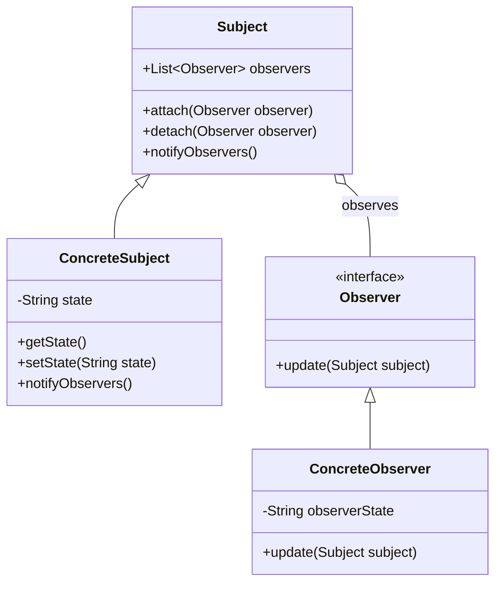

# Observer Pattern - Event-Driven Systems & Pub-Sub

In software development, we often need objects to stay synchronized and react to changes in other objects without tight coupling.

**Example:** GUI components updating when data changes, news subscriptions, stock price monitors, etc.

Creating direct dependencies between objects leads to issues such as tight coupling, difficult maintenance, and reduced reusability.

This is where the **Observer Design Pattern** comes into play.

It's a fundamental behavioral pattern that enables event-driven architectures and is critical for distributed systems.

## What is Observer Pattern?

Observer Pattern is a behavioral design pattern that defines a one-to-many dependency between objects. When one object (subject) changes state, all its dependents (observers) are notified and updated automatically.

It establishes a subscription mechanism to allow multiple objects to listen and react to events or changes happening to another object.

The pattern promotes loose coupling by ensuring that the subject doesn't need to know the concrete classes of its observers.

## Class Diagram



## Implementation

There are several ways to implement the Observer Pattern in Java. Let's explore the most common and effective methods.

### 1. Classic Observer Implementation

```java
import java.util.ArrayList;
import java.util.List;

// Subject interface
interface Subject {
    void attach(Observer observer);
    void detach(Observer observer);
    void notifyObservers();
}

// Observer interface
interface Observer {
    void update(Subject subject);
}

// Concrete Subject
class NewsAgency implements Subject {
    private List<Observer> observers = new ArrayList<>();
    private String news;

    @Override
    public void attach(Observer observer) {
        observers.add(observer);
    }

    @Override
    public void detach(Observer observer) {
        observers.remove(observer);
    }

    @Override
    public void notifyObservers() {
        for (Observer observer : observers) {
            observer.update(this);
        }
    }

    public void setNews(String news) {
        this.news = news;
        notifyObservers();
    }

    public String getNews() {
        return news;
    }
}

// Concrete Observer
class NewsChannel implements Observer {
    private String name;
    private String news;

    public NewsChannel(String name) {
        this.name = name;
    }

    @Override
    public void update(Subject subject) {
        if (subject instanceof NewsAgency) {
            this.news = ((NewsAgency) subject).getNews();
            System.out.println(name + " received news: " + news);
        }
    }

    public String getNews() {
        return news;
    }
}
```

### 2. Lambda-Based Observer (Java 8+)

```java
import java.util.ArrayList;
import java.util.List;
import java.util.function.Consumer;

class ModernNewsAgency {
    private List<Consumer<String>> observers = new ArrayList<>();
    private String news;

    public void subscribe(Consumer<String> observer) {
        observers.add(observer);
    }

    public void unsubscribe(Consumer<String> observer) {
        observers.remove(observer);
    }

    public void setNews(String news) {
        this.news = news;
        observers.forEach(observer -> observer.accept(news));
    }

    public String getNews() {
        return news;
    }
}

// Usage with lambdas
public class LambdaObserverExample {
    public static void main(String[] args) {
        ModernNewsAgency agency = new ModernNewsAgency();

        // Subscribe with lambda expressions
        agency.subscribe(news -> System.out.println("CNN: " + news));
        agency.subscribe(news -> System.out.println("BBC: " + news));
        agency.subscribe(news -> System.out.println("FOX: " + news));

        agency.setNews("Breaking: New Java version released!");
    }
}
```

### 3. Event-Based Observer with Generic Types

```java
import java.util.ArrayList;
import java.util.List;
import java.util.concurrent.CopyOnWriteArrayList;

// Generic Event interface
interface Event<T> {
    T getData();
    long getTimestamp();
}

// Concrete Event
class StockPriceEvent implements Event<Double> {
    private final String symbol;
    private final Double price;
    private final long timestamp;

    public StockPriceEvent(String symbol, Double price) {
        this.symbol = symbol;
        this.price = price;
        this.timestamp = System.currentTimeMillis();
    }

    @Override
    public Double getData() {
        return price;
    }

    @Override
    public long getTimestamp() {
        return timestamp;
    }

    public String getSymbol() {
        return symbol;
    }
}

// Generic Event Listener
interface EventListener<T extends Event<?>> {
    void onEvent(T event);
}

// Thread-safe Event Publisher
class EventPublisher<T extends Event<?>> {
    private final List<EventListener<T>> listeners = new CopyOnWriteArrayList<>();

    public void subscribe(EventListener<T> listener) {
        listeners.add(listener);
    }

    public void unsubscribe(EventListener<T> listener) {
        listeners.remove(listener);
    }

    public void publish(T event) {
        listeners.forEach(listener -> listener.onEvent(event));
    }
}

// Stock Market implementation
class StockMarket {
    private final EventPublisher<StockPriceEvent> publisher = new EventPublisher<>();

    public void subscribeToStock(EventListener<StockPriceEvent> listener) {
        publisher.subscribe(listener);
    }

    public void updateStockPrice(String symbol, double price) {
        StockPriceEvent event = new StockPriceEvent(symbol, price);
        publisher.publish(event);
    }
}

// Concrete Observers
class Portfolio implements EventListener<StockPriceEvent> {
    private final String name;

    public Portfolio(String name) {
        this.name = name;
    }

    @Override
    public void onEvent(StockPriceEvent event) {
        System.out.printf("Portfolio %s: %s price updated to $%.2f%n",
            name, event.getSymbol(), event.getData());
    }
}

class TradingBot implements EventListener<StockPriceEvent> {
    @Override
    public void onEvent(StockPriceEvent event) {
        if (event.getData() > 100.0) {
            System.out.printf("TradingBot: SELL signal for %s at $%.2f%n",
                event.getSymbol(), event.getData());
        } else {
            System.out.printf("TradingBot: BUY signal for %s at $%.2f%n",
                event.getSymbol(), event.getData());
        }
    }
}
```

### 4. Asynchronous Observer Pattern

```java
import java.util.concurrent.CompletableFuture;
import java.util.concurrent.CopyOnWriteArrayList;
import java.util.concurrent.ExecutorService;
import java.util.concurrent.Executors;

class AsyncEventPublisher<T> {
    private final List<AsyncEventListener<T>> listeners = new CopyOnWriteArrayList<>();
    private final ExecutorService executor = Executors.newCachedThreadPool();

    public void subscribe(AsyncEventListener<T> listener) {
        listeners.add(listener);
    }

    public void unsubscribe(AsyncEventListener<T> listener) {
        listeners.remove(listener);
    }

    public CompletableFuture<Void> publishAsync(T event) {
        CompletableFuture<?>[] futures = listeners.stream()
            .map(listener -> CompletableFuture.runAsync(() -> listener.onEvent(event), executor))
            .toArray(CompletableFuture[]::new);

        return CompletableFuture.allOf(futures);
    }

    public void shutdown() {
        executor.shutdown();
    }
}

interface AsyncEventListener<T> {
    void onEvent(T event);
}

// Usage example
class AsyncNewsService {
    private final AsyncEventPublisher<String> publisher = new AsyncEventPublisher<>();

    public void subscribe(AsyncEventListener<String> listener) {
        publisher.subscribe(listener);
    }

    public CompletableFuture<Void> broadcastNews(String news) {
        return publisher.publishAsync(news);
    }
}
```

## Test Code

```java
import org.junit.jupiter.api.Test;
import org.junit.jupiter.api.BeforeEach;
import static org.junit.jupiter.api.Assertions.*;
import java.util.ArrayList;
import java.util.List;

class ObserverPatternTest {
    private NewsAgency newsAgency;
    private NewsChannel cnn;
    private NewsChannel bbc;

    @BeforeEach
    void setUp() {
        newsAgency = new NewsAgency();
        cnn = new NewsChannel("CNN");
        bbc = new NewsChannel("BBC");
    }

    @Test
    void testBasicObserverFunctionality() {
        // Attach observers
        newsAgency.attach(cnn);
        newsAgency.attach(bbc);

        // Set news and verify observers are notified
        String testNews = "Test breaking news";
        newsAgency.setNews(testNews);

        assertEquals(testNews, cnn.getNews());
        assertEquals(testNews, bbc.getNews());
    }

    @Test
    void testObserverDetachment() {
        newsAgency.attach(cnn);
        newsAgency.attach(bbc);

        // Detach one observer
        newsAgency.detach(cnn);

        String testNews = "Second news update";
        newsAgency.setNews(testNews);

        // Only BBC should receive the update
        assertNull(cnn.getNews());
        assertEquals(testNews, bbc.getNews());
    }

    @Test
    void testMultipleUpdates() {
        newsAgency.attach(cnn);

        newsAgency.setNews("News 1");
        assertEquals("News 1", cnn.getNews());

        newsAgency.setNews("News 2");
        assertEquals("News 2", cnn.getNews());
    }

    @Test
    void testStockMarketObserver() {
        StockMarket market = new StockMarket();
        Portfolio portfolio = new Portfolio("Tech Portfolio");
        TradingBot bot = new TradingBot();

        market.subscribeToStock(portfolio);
        market.subscribeToStock(bot);

        // Test that observers receive stock updates
        assertDoesNotThrow(() -> {
            market.updateStockPrice("AAPL", 150.0);
            market.updateStockPrice("GOOGL", 95.0);
        });
    }
}
```

## Real-World Examples of Observer Pattern

### 1. **Event-Driven Systems**

- **GUI Frameworks**: Swing, JavaFX button clicks, window events
- **Web Development**: DOM events, React state changes
- **Message Queues**: Apache Kafka, RabbitMQ publish-subscribe

### 2. **Distributed Systems**

- **Microservices**: Service discovery, configuration changes
- **Caching**: Redis pub/sub, cache invalidation
- **Monitoring**: Log aggregation, metrics collection

### 3. **Business Applications**

- **E-commerce**: Inventory updates, price changes
- **Banking**: Account balance changes, transaction notifications
- **Social Media**: Follow/unfollow, post notifications

### 4. **System Integration**

- **ETL Pipelines**: Data transformation events
- **Workflow Engines**: Task completion notifications
- **IoT Systems**: Sensor data updates

## Specific Examples:

**MVC Architecture**: In Model-View-Controller, the View observes the Model for changes.

**Spring Framework**: ApplicationEvent and ApplicationListener provide observer pattern implementation.

**Android Development**: Activity lifecycle callbacks, broadcast receivers.

**Stock Trading Systems**: Real-time price feeds updating multiple trading algorithms.

**Game Development**: Player state changes triggering UI updates, achievement systems.

## Pros and Cons of Observer Pattern

| **Pros**                                                                           | **Cons**                                                                      |
| ---------------------------------------------------------------------------------- | ----------------------------------------------------------------------------- |
| ✅ **Loose Coupling**: Subject and observers are loosely coupled                   | ❌ **Memory Leaks**: Observers might not be properly detached                 |
| ✅ **Dynamic Subscription**: Observers can be added/removed at runtime             | ❌ **Notification Overhead**: Many observers can impact performance           |
| ✅ **Open/Closed Principle**: New observers can be added without modifying subject | ❌ **Unpredictable Order**: Notification order is not guaranteed              |
| ✅ **Broadcast Communication**: One subject can notify multiple observers          | ❌ **Complex Debugging**: Event chains can be hard to trace                   |
| ✅ **Event-Driven Architecture**: Enables reactive programming                     | ❌ **Circular Dependencies**: Observers observing each other can cause issues |

## Best Practices

### ⚠️ **Warnings & Considerations**

1. **Memory Management**: Always detach observers to prevent memory leaks
2. **Thread Safety**: Use thread-safe collections for multi-threaded environments
3. **Exception Handling**: One observer's exception shouldn't affect others
4. **Performance**: Consider async notifications for expensive observers
5. **Circular References**: Avoid observers that modify the subject during notification

### 🏆 **Modern Alternatives**

- **Reactive Streams**: RxJava, Project Reactor for complex event handling
- **Event Buses**: Google Guava EventBus, Spring ApplicationEventPublisher
- **Message Brokers**: For distributed observer patterns across services

The Observer pattern is fundamental to modern software architecture and forms the backbone of event-driven systems, making it essential knowledge for any developer working on scalable applications.
