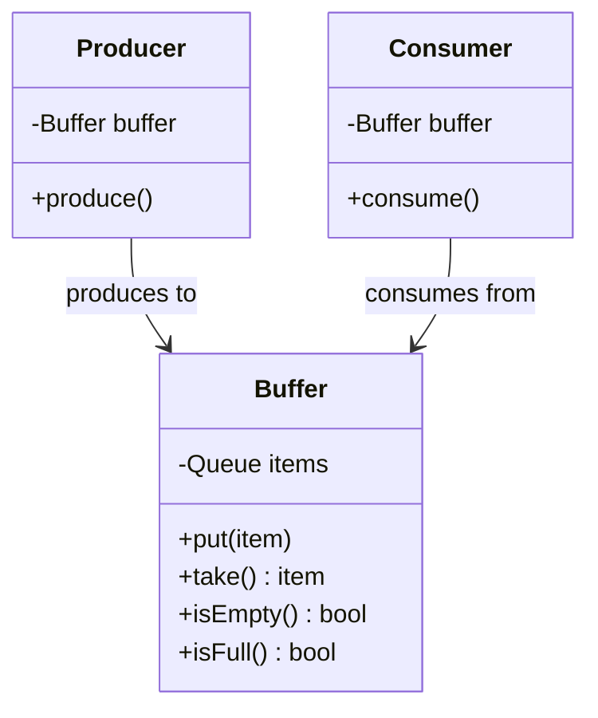

# Producer-Consumer Pattern - Multi-threading Coordination

In software development, we often need to coordinate between threads that produce data and threads that consume data.

**Example:** Message queues, data pipelines, task processing systems, streaming applications, etc.

Direct communication between producer and consumer threads leads to tight coupling and synchronization issues.

This is where the **Producer-Consumer Design Pattern** comes into play.

## What is Producer-Consumer Pattern?

Producer-Consumer Pattern is a concurrency design pattern that decouples producers (data generators) from consumers (data processors) using a shared buffer or queue.

It allows multiple threads to produce and consume data safely, with proper synchronization and load balancing.

## Class Diagram



## Implementation

### 1. Basic Producer-Consumer with BlockingQueue

```java
import java.util.concurrent.*;
import java.util.concurrent.atomic.AtomicInteger;
import java.util.Random;

// Product class
class Task {
    private final int id;
    private final String data;
    private final long createdTime;

    public Task(int id, String data) {
        this.id = id;
        this.data = data;
        this.createdTime = System.currentTimeMillis();
    }

    public int getId() { return id; }
    public String getData() { return data; }
    public long getCreatedTime() { return createdTime; }

    @Override
    public String toString() {
        return String.format("Task{id=%d, data='%s'}", id, data);
    }
}

// Producer
class TaskProducer implements Runnable {
    private final BlockingQueue<Task> buffer;
    private final String producerName;
    private final AtomicInteger taskCounter = new AtomicInteger(0);
    private final Random random = new Random();
    private volatile boolean running = true;

    public TaskProducer(BlockingQueue<Task> buffer, String producerName) {
        this.buffer = buffer;
        this.producerName = producerName;
    }

    @Override
    public void run() {
        try {
            while (running) {
                Task task = createTask();
                buffer.put(task); // Blocks if buffer is full
                System.out.println(producerName + " produced: " + task);

                // Simulate work
                Thread.sleep(random.nextInt(1000) + 500);
            }
        } catch (InterruptedException e) {
            Thread.currentThread().interrupt();
            System.out.println(producerName + " was interrupted");
        }
        System.out.println(producerName + " stopped producing");
    }

    private Task createTask() {
        int taskId = taskCounter.incrementAndGet();
        String data = producerName + "-task-" + taskId;
        return new Task(taskId, data);
    }

    public void stop() {
        running = false;
    }
}

// Consumer
class TaskConsumer implements Runnable {
    private final BlockingQueue<Task> buffer;
    private final String consumerName;
    private final Random random = new Random();
    private volatile boolean running = true;
    private int processedCount = 0;

    public TaskConsumer(BlockingQueue<Task> buffer, String consumerName) {
        this.buffer = buffer;
        this.consumerName = consumerName;
    }

    @Override
    public void run() {
        try {
            while (running || !buffer.isEmpty()) {
                Task task = buffer.poll(1, TimeUnit.SECONDS); // Wait with timeout
                if (task != null) {
                    processTask(task);
                    processedCount++;
                    System.out.println(consumerName + " processed: " + task +
                                     " (queue size: " + buffer.size() + ")");
                }
            }
        } catch (InterruptedException e) {
            Thread.currentThread().interrupt();
            System.out.println(consumerName + " was interrupted");
        }
        System.out.println(consumerName + " stopped consuming. Processed: " + processedCount);
    }

    private void processTask(Task task) throws InterruptedException {
        // Simulate processing time
        Thread.sleep(random.nextInt(800) + 200);

        long processingTime = System.currentTimeMillis() - task.getCreatedTime();
        System.out.println("  " + consumerName + " processing time: " + processingTime + "ms");
    }

    public void stop() {
        running = false;
    }

    public int getProcessedCount() {
        return processedCount;
    }
}

// Usage Example
class BasicProducerConsumerExample {
    public static void main(String[] args) throws InterruptedException {
        // Create shared buffer
        BlockingQueue<Task> buffer = new ArrayBlockingQueue<>(10);

        // Create producers and consumers
        TaskProducer producer1 = new TaskProducer(buffer, "Producer-1");
        TaskProducer producer2 = new TaskProducer(buffer, "Producer-2");
        TaskConsumer consumer1 = new TaskConsumer(buffer, "Consumer-1");
        TaskConsumer consumer2 = new TaskConsumer(buffer, "Consumer-2");
        TaskConsumer consumer3 = new TaskConsumer(buffer, "Consumer-3");

        // Start threads
        ExecutorService executor = Executors.newFixedThreadPool(5);
        executor.submit(producer1);
        executor.submit(producer2);
        executor.submit(consumer1);
        executor.submit(consumer2);
        executor.submit(consumer3);

        // Run for 10 seconds
        Thread.sleep(10000);

        // Stop producers
        producer1.stop();
        producer2.stop();

        // Wait a bit for remaining tasks to be processed
        Thread.sleep(3000);

        // Stop consumers
        consumer1.stop();
        consumer2.stop();
        consumer3.stop();

        executor.shutdown();
        executor.awaitTermination(5, TimeUnit.SECONDS);

        System.out.println("Final buffer size: " + buffer.size());
    }
}
```

### 2. Custom Buffer with Synchronization

```java
import java.util.LinkedList;
import java.util.Queue;

// Custom synchronized buffer
class SynchronizedBuffer<T> {
    private final Queue<T> queue = new LinkedList<>();
    private final int capacity;
    private final Object lock = new Object();

    public SynchronizedBuffer(int capacity) {
        this.capacity = capacity;
    }

    public void put(T item) throws InterruptedException {
        synchronized (lock) {
            while (queue.size() >= capacity) {
                lock.wait(); // Wait until space is available
            }
            queue.offer(item);
            lock.notifyAll(); // Notify waiting consumers
        }
    }

    public T take() throws InterruptedException {
        synchronized (lock) {
            while (queue.isEmpty()) {
                lock.wait(); // Wait until item is available
            }
            T item = queue.poll();
            lock.notifyAll(); // Notify waiting producers
            return item;
        }
    }

    public T poll(long timeoutMs) throws InterruptedException {
        synchronized (lock) {
            long startTime = System.currentTimeMillis();
            while (queue.isEmpty()) {
                long elapsed = System.currentTimeMillis() - startTime;
                if (elapsed >= timeoutMs) {
                    return null; // Timeout
                }
                lock.wait(timeoutMs - elapsed);
            }
            T item = queue.poll();
            lock.notifyAll();
            return item;
        }
    }

    public int size() {
        synchronized (lock) {
            return queue.size();
        }
    }

    public boolean isEmpty() {
        synchronized (lock) {
            return queue.isEmpty();
        }
    }

    public boolean isFull() {
        synchronized (lock) {
            return queue.size() >= capacity;
        }
    }
}

// Producer using custom buffer
class CustomProducer implements Runnable {
    private final SynchronizedBuffer<String> buffer;
    private final String name;
    private volatile boolean running = true;

    public CustomProducer(SynchronizedBuffer<String> buffer, String name) {
        this.buffer = buffer;
        this.name = name;
    }

    @Override
    public void run() {
        int count = 0;
        try {
            while (running) {
                String item = name + "-item-" + (++count);
                buffer.put(item);
                System.out.println(name + " produced: " + item + " (buffer size: " + buffer.size() + ")");
                Thread.sleep(500);
            }
        } catch (InterruptedException e) {
            Thread.currentThread().interrupt();
        }
        System.out.println(name + " stopped");
    }

    public void stop() {
        running = false;
    }
}

// Consumer using custom buffer
class CustomConsumer implements Runnable {
    private final SynchronizedBuffer<String> buffer;
    private final String name;
    private volatile boolean running = true;

    public CustomConsumer(SynchronizedBuffer<String> buffer, String name) {
        this.buffer = buffer;
        this.name = name;
    }

    @Override
    public void run() {
        try {
            while (running || !buffer.isEmpty()) {
                String item = buffer.poll(1000); // 1 second timeout
                if (item != null) {
                    System.out.println(name + " consumed: " + item + " (buffer size: " + buffer.size() + ")");
                    Thread.sleep(700); // Simulate processing
                }
            }
        } catch (InterruptedException e) {
            Thread.currentThread().interrupt();
        }
        System.out.println(name + " stopped");
    }

    public void stop() {
        running = false;
    }
}
```

### 3. Batch Processing System

```java
import java.util.ArrayList;
import java.util.List;
import java.util.concurrent.atomic.AtomicLong;

// Batch processor
class BatchProcessor<T> {
    private final List<T> batch = new ArrayList<>();
    private final int batchSize;
    private final BatchHandler<T> handler;
    private final Object lock = new Object();
    private final AtomicLong batchCount = new AtomicLong(0);

    public BatchProcessor(int batchSize, BatchHandler<T> handler) {
        this.batchSize = batchSize;
        this.handler = handler;
    }

    public void add(T item) {
        synchronized (lock) {
            batch.add(item);
            if (batch.size() >= batchSize) {
                processBatch();
            }
        }
    }

    public void flush() {
        synchronized (lock) {
            if (!batch.isEmpty()) {
                processBatch();
            }
        }
    }

    private void processBatch() {
        List<T> currentBatch = new ArrayList<>(batch);
        batch.clear();

        long batchId = batchCount.incrementAndGet();
        System.out.println("Processing batch " + batchId + " with " + currentBatch.size() + " items");

        // Process in separate thread to avoid blocking
        new Thread(() -> handler.handle(batchId, currentBatch)).start();
    }
}

// Batch handler interface
interface BatchHandler<T> {
    void handle(long batchId, List<T> items);
}

// Log entry class
class LogEntry {
    private final String level;
    private final String message;
    private final long timestamp;
    private final String source;

    public LogEntry(String level, String message, String source) {
        this.level = level;
        this.message = message;
        this.source = source;
        this.timestamp = System.currentTimeMillis();
    }

    // Getters
    public String getLevel() { return level; }
    public String getMessage() { return message; }
    public String getSource() { return source; }
    public long getTimestamp() { return timestamp; }

    @Override
    public String toString() {
        return String.format("[%s] %s - %s (%s)", level, source, message, timestamp);
    }
}

// Log batch handler
class LogBatchHandler implements BatchHandler<LogEntry> {
    @Override
    public void handle(long batchId, List<LogEntry> entries) {
        try {
            // Simulate writing to file/database
            Thread.sleep(200);

            System.out.println("Batch " + batchId + " written to storage:");
            for (LogEntry entry : entries) {
                System.out.println("  " + entry);
            }
            System.out.println("Batch " + batchId + " completed\n");

        } catch (InterruptedException e) {
            Thread.currentThread().interrupt();
        }
    }
}

// Log producer
class LogProducer implements Runnable {
    private final BatchProcessor<LogEntry> processor;
    private final String source;
    private final String[] levels = {"INFO", "WARN", "ERROR", "DEBUG"};
    private final String[] messages = {
        "User logged in", "Database query executed", "Cache miss occurred",
        "File uploaded", "API request processed", "Configuration loaded"
    };
    private final Random random = new Random();
    private volatile boolean running = true;

    public LogProducer(BatchProcessor<LogEntry> processor, String source) {
        this.processor = processor;
        this.source = source;
    }

    @Override
    public void run() {
        try {
            while (running) {
                LogEntry entry = createLogEntry();
                processor.add(entry);
                System.out.println("Produced: " + entry);

                Thread.sleep(random.nextInt(300) + 100);
            }
        } catch (InterruptedException e) {
            Thread.currentThread().interrupt();
        }
        System.out.println(source + " producer stopped");
    }

    private LogEntry createLogEntry() {
        String level = levels[random.nextInt(levels.length)];
        String message = messages[random.nextInt(messages.length)];
        return new LogEntry(level, message, source);
    }

    public void stop() {
        running = false;
    }
}

// Batch processing example
class BatchProcessingExample {
    public static void main(String[] args) throws InterruptedException {
        // Create batch processor
        BatchProcessor<LogEntry> processor = new BatchProcessor<>(5, new LogBatchHandler());

        // Create log producers
        LogProducer webProducer = new LogProducer(processor, "WebServer");
        LogProducer apiProducer = new LogProducer(processor, "APIServer");
        LogProducer dbProducer = new LogProducer(processor, "Database");

        // Start producers
        ExecutorService executor = Executors.newFixedThreadPool(3);
        executor.submit(webProducer);
        executor.submit(apiProducer);
        executor.submit(dbProducer);

        // Run for 8 seconds
        Thread.sleep(8000);

        // Stop producers
        webProducer.stop();
        apiProducer.stop();
        dbProducer.stop();

        // Flush remaining items
        Thread.sleep(1000);
        processor.flush();

        executor.shutdown();
        executor.awaitTermination(3, TimeUnit.SECONDS);
    }
}
```

### 4. Priority Queue Producer-Consumer

```java
import java.util.concurrent.PriorityBlockingQueue;
import java.util.Comparator;

// Priority task
class PriorityTask implements Comparable<PriorityTask> {
    private final int priority;
    private final String taskId;
    private final String description;
    private final long createdTime;

    public PriorityTask(int priority, String taskId, String description) {
        this.priority = priority;
        this.taskId = taskId;
        this.description = description;
        this.createdTime = System.currentTimeMillis();
    }

    @Override
    public int compareTo(PriorityTask other) {
        // Higher priority number = higher priority (processed first)
        return Integer.compare(other.priority, this.priority);
    }

    // Getters
    public int getPriority() { return priority; }
    public String getTaskId() { return taskId; }
    public String getDescription() { return description; }
    public long getCreatedTime() { return createdTime; }

    @Override
    public String toString() {
        return String.format("PriorityTask{priority=%d, id='%s', desc='%s'}",
                           priority, taskId, description);
    }
}

// Priority task producer
class PriorityTaskProducer implements Runnable {
    private final PriorityBlockingQueue<PriorityTask> queue;
    private final String producerName;
    private final Random random = new Random();
    private volatile boolean running = true;
    private int taskCounter = 0;

    public PriorityTaskProducer(PriorityBlockingQueue<PriorityTask> queue, String producerName) {
        this.queue = queue;
        this.producerName = producerName;
    }

    @Override
    public void run() {
        try {
            while (running) {
                PriorityTask task = createRandomTask();
                queue.put(task);
                System.out.println(producerName + " produced: " + task);

                Thread.sleep(random.nextInt(800) + 200);
            }
        } catch (InterruptedException e) {
            Thread.currentThread().interrupt();
        }
        System.out.println(producerName + " stopped");
    }

    private PriorityTask createRandomTask() {
        int priority = random.nextInt(5) + 1; // Priority 1-5
        String taskId = producerName + "-" + (++taskCounter);
        String description = "Task from " + producerName + " with priority " + priority;
        return new PriorityTask(priority, taskId, description);
    }

    public void stop() {
        running = false;
    }
}

// Priority task consumer
class PriorityTaskConsumer implements Runnable {
    private final PriorityBlockingQueue<PriorityTask> queue;
    private final String consumerName;
    private volatile boolean running = true;

    public PriorityTaskConsumer(PriorityBlockingQueue<PriorityTask> queue, String consumerName) {
        this.queue = queue;
        this.consumerName = consumerName;
    }

    @Override
    public void run() {
        try {
            while (running || !queue.isEmpty()) {
                PriorityTask task = queue.poll(1, TimeUnit.SECONDS);
                if (task != null) {
                    processTask(task);
                }
            }
        } catch (InterruptedException e) {
            Thread.currentThread().interrupt();
        }
        System.out.println(consumerName + " stopped");
    }

    private void processTask(PriorityTask task) throws InterruptedException {
        long waitTime = System.currentTimeMillis() - task.getCreatedTime();
        System.out.println(consumerName + " processing: " + task +
                          " (waited: " + waitTime + "ms)");

        // Higher priority tasks process faster
        int processingTime = 1000 - (task.getPriority() * 150);
        Thread.sleep(Math.max(100, processingTime));

        System.out.println("  " + consumerName + " completed: " + task.getTaskId());
    }

    public void stop() {
        running = false;
    }
}

// Priority queue example
class PriorityQueueExample {
    public static void main(String[] args) throws InterruptedException {
        // Create priority queue
        PriorityBlockingQueue<PriorityTask> queue = new PriorityBlockingQueue<>();

        // Create producers and consumers
        PriorityTaskProducer producer1 = new PriorityTaskProducer(queue, "Producer-1");
        PriorityTaskProducer producer2 = new PriorityTaskProducer(queue, "Producer-2");
        PriorityTaskConsumer consumer1 = new PriorityTaskConsumer(queue, "Consumer-1");
        PriorityTaskConsumer consumer2 = new PriorityTaskConsumer(queue, "Consumer-2");

        // Start threads
        ExecutorService executor = Executors.newFixedThreadPool(4);
        executor.submit(producer1);
        executor.submit(producer2);
        executor.submit(consumer1);
        executor.submit(consumer2);

        // Run for 10 seconds
        Thread.sleep(10000);

        // Stop producers
        producer1.stop();
        producer2.stop();

        // Wait for remaining tasks
        Thread.sleep(5000);

        // Stop consumers
        consumer1.stop();
        consumer2.stop();

        executor.shutdown();
        executor.awaitTermination(3, TimeUnit.SECONDS);
    }
}
```

## Test Code

```java
import org.junit.jupiter.api.Test;
import static org.junit.jupiter.api.Assertions.*;
import java.util.concurrent.*;
import java.util.concurrent.atomic.AtomicInteger;

class ProducerConsumerPatternTest {

    @Test
    void testBasicProducerConsumer() throws InterruptedException {
        BlockingQueue<String> queue = new ArrayBlockingQueue<>(5);
        AtomicInteger producedCount = new AtomicInteger(0);
        AtomicInteger consumedCount = new AtomicInteger(0);

        // Producer
        Thread producer = new Thread(() -> {
            try {
                for (int i = 0; i < 10; i++) {
                    queue.put("item-" + i);
                    producedCount.incrementAndGet();
                }
            } catch (InterruptedException e) {
                Thread.currentThread().interrupt();
            }
        });

        // Consumer
        Thread consumer = new Thread(() -> {
            try {
                while (consumedCount.get() < 10) {
                    String item = queue.poll(1, TimeUnit.SECONDS);
                    if (item != null) {
                        consumedCount.incrementAndGet();
                    }
                }
            } catch (InterruptedException e) {
                Thread.currentThread().interrupt();
            }
        });

        producer.start();
        consumer.start();

        producer.join(5000);
        consumer.join(5000);

        assertEquals(10, producedCount.get());
        assertEquals(10, consumedCount.get());
        assertTrue(queue.isEmpty());
    }

    @Test
    void testSynchronizedBuffer() throws InterruptedException {
        SynchronizedBuffer<Integer> buffer = new SynchronizedBuffer<>(3);

        // Test basic operations
        buffer.put(1);
        buffer.put(2);
        assertEquals(2, buffer.size());

        Integer item = buffer.take();
        assertEquals(1, item.intValue());
        assertEquals(1, buffer.size());

        item = buffer.take();
        assertEquals(2, item.intValue());
        assertTrue(buffer.isEmpty());

        // Test timeout
        Integer timeoutItem = buffer.poll(100);
        assertNull(timeoutItem);
    }

    @Test
    void testPriorityQueue() throws InterruptedException {
        PriorityBlockingQueue<PriorityTask> queue = new PriorityBlockingQueue<>();

        // Add tasks with different priorities
        queue.put(new PriorityTask(1, "low", "Low priority task"));
        queue.put(new PriorityTask(5, "high", "High priority task"));
        queue.put(new PriorityTask(3, "medium", "Medium priority task"));

        // Tasks should come out in priority order (high to low)
        PriorityTask task1 = queue.take();
        assertEquals(5, task1.getPriority());

        PriorityTask task2 = queue.take();
        assertEquals(3, task2.getPriority());

        PriorityTask task3 = queue.take();
        assertEquals(1, task3.getPriority());
    }

    @Test
    void testBatchProcessor() throws InterruptedException {
        CountDownLatch latch = new CountDownLatch(2); // Expect 2 batches
        List<List<String>> processedBatches = new ArrayList<>();

        BatchHandler<String> handler = (batchId, items) -> {
            processedBatches.add(new ArrayList<>(items));
            latch.countDown();
        };

        BatchProcessor<String> processor = new BatchProcessor<>(3, handler);

        // Add items
        processor.add("item1");
        processor.add("item2");
        processor.add("item3"); // Should trigger first batch
        processor.add("item4");
        processor.add("item5");
        processor.flush(); // Should trigger second batch

        // Wait for batches to be processed
        assertTrue(latch.await(2, TimeUnit.SECONDS));

        assertEquals(2, processedBatches.size());
        assertEquals(3, processedBatches.get(0).size());
        assertEquals(2, processedBatches.get(1).size());
    }

    @Test
    void testMultipleProducersConsumers() throws InterruptedException {
        BlockingQueue<String> queue = new ArrayBlockingQueue<>(10);
        int numProducers = 2;
        int numConsumers = 3;
        int itemsPerProducer = 5;

        CountDownLatch producerLatch = new CountDownLatch(numProducers);
        CountDownLatch consumerLatch = new CountDownLatch(numProducers * itemsPerProducer);

        // Start producers
        for (int i = 0; i < numProducers; i++) {
            final int producerId = i;
            new Thread(() -> {
                try {
                    for (int j = 0; j < itemsPerProducer; j++) {
                        queue.put("P" + producerId + "-item" + j);
                    }
                } catch (InterruptedException e) {
                    Thread.currentThread().interrupt();
                } finally {
                    producerLatch.countDown();
                }
            }).start();
        }

        // Start consumers
        for (int i = 0; i < numConsumers; i++) {
            new Thread(() -> {
                try {
                    while (true) {
                        String item = queue.poll(100, TimeUnit.MILLISECONDS);
                        if (item != null) {
                            consumerLatch.countDown();
                        } else if (producerLatch.getCount() == 0 && queue.isEmpty()) {
                            break;
                        }
                    }
                } catch (InterruptedException e) {
                    Thread.currentThread().interrupt();
                }
            }).start();
        }

        assertTrue(producerLatch.await(2, TimeUnit.SECONDS));
        assertTrue(consumerLatch.await(3, TimeUnit.SECONDS));
    }
}
```

## Real-World Examples

### 1. **Message Queues**

- **Apache Kafka**: High-throughput distributed streaming
- **RabbitMQ**: Message broker with various patterns
- **Amazon SQS**: Cloud-based message queuing
- **Redis Pub/Sub**: In-memory message publishing

### 2. **Data Processing**

- **ETL Pipelines**: Extract, transform, load operations
- **Stream Processing**: Real-time data processing
- **Batch Processing**: Large-scale data processing
- **Log Processing**: Centralized logging systems

### 3. **Web Applications**

- **Task Queues**: Background job processing
- **Request Processing**: Web server request handling
- **Cache Updates**: Asynchronous cache invalidation
- **Event Processing**: Event-driven architectures

### 4. **System Applications**

- **Thread Pools**: Worker thread management
- **I/O Operations**: Asynchronous file/network operations
- **Database Connections**: Connection pool management
- **Resource Management**: Shared resource allocation

## Pros and Cons

| **Pros**                                                               | **Cons**                                                           |
| ---------------------------------------------------------------------- | ------------------------------------------------------------------ |
| ✅ **Decoupling**: Producers and consumers are independent             | ❌ **Complexity**: Synchronization and threading complexity        |
| ✅ **Scalability**: Can scale producers and consumers independently    | ❌ **Memory Usage**: Buffer storage requirements                   |
| ✅ **Load Balancing**: Multiple consumers can process tasks            | ❌ **Latency**: Buffering introduces processing delays             |
| ✅ **Fault Tolerance**: Failure of one component doesn't affect others | ❌ **Debugging**: Concurrent issues are hard to debug              |
| ✅ **Throughput**: Better resource utilization and throughput          | ❌ **Deadlock Risk**: Potential for deadlocks in complex scenarios |

## Best Practices

### ⚠️ **Warnings & Considerations**

1. **Buffer Size**: Choose appropriate buffer size to balance memory and performance
2. **Thread Safety**: Ensure all shared data structures are thread-safe
3. **Graceful Shutdown**: Implement proper shutdown mechanisms
4. **Error Handling**: Handle exceptions in both producers and consumers
5. **Resource Management**: Properly manage thread lifecycle and cleanup

### 💡 **When to Use Producer-Consumer Pattern**

✅ **Use When:**

- Different rates of production and consumption
- Need to decouple data generation from processing
- Multiple producers or consumers are involved
- Buffering and load balancing are required
- Asynchronous processing is beneficial

❌ **Avoid When:**

- Simple sequential processing is sufficient
- Tight coupling between producer and consumer is needed
- Memory usage is critically constrained
- Real-time processing with minimal latency is required
- Complexity outweighs benefits

The Producer-Consumer pattern is essential for building scalable, concurrent applications where data production and consumption need to be decoupled and balanced.
