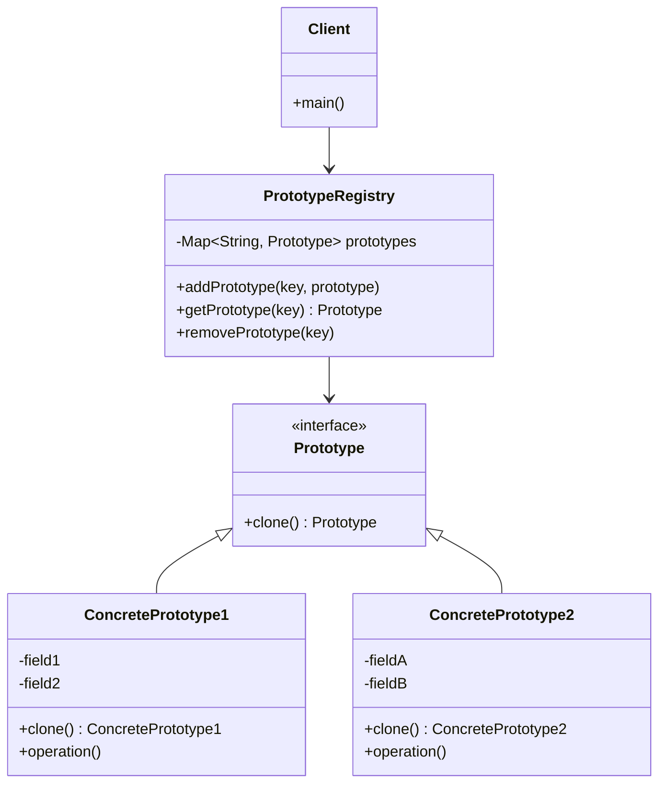

# Prototype Pattern - Object Cloning for Expensive Creation

In software development, we often need to create objects that are expensive to instantiate or configure, especially when we need similar objects with slight variations.

**Example:** Complex graphics objects, database records, network connections, heavy computational objects, etc.

Creating objects from scratch every time can be expensive in terms of time and resources, especially for complex initialization processes.

This is where the **Prototype Design Pattern** comes into play.

It's a fundamental creational pattern that creates objects by cloning existing instances and is essential for performance-critical applications.

## What is Prototype Pattern?

Prototype Pattern is a creational design pattern that creates new objects by cloning existing objects (prototypes) rather than creating them from scratch. It specifies the kinds of objects to create using a prototypical instance.

The pattern promotes object creation through copying (cloning) rather than instantiation, allowing for efficient creation of complex objects.

It follows the principle of "composition over instantiation" by reusing and modifying existing object instances.

## Class Diagram



## Implementation

### 1. Document System with Prototype Pattern

```java
import java.util.*;
import java.util.concurrent.ConcurrentHashMap;
import java.time.LocalDateTime;
import java.io.Serializable;
import java.io.ByteArrayInputStream;
import java.io.ByteArrayOutputStream;
import java.io.ObjectInputStream;
import java.io.ObjectOutputStream;

// Prototype interface
interface DocumentPrototype extends Cloneable {
    DocumentPrototype clone();
    void customize(Map<String, Object> customizations);
    String getDocumentType();
    void display();
}

// Complex nested class for document content
class DocumentContent implements Serializable, Cloneable {
    private String title;
    private String body;
    private List<String> sections;
    private Map<String, String> metadata;
    private List<Attachment> attachments;

    public DocumentContent(String title, String body) {
        this.title = title;
        this.body = body;
        this.sections = new ArrayList<>();
        this.metadata = new HashMap<>();
        this.attachments = new ArrayList<>();
    }

    // Deep copy constructor
    private DocumentContent(DocumentContent other) {
        this.title = other.title;
        this.body = other.body;
        this.sections = new ArrayList<>(other.sections);
        this.metadata = new HashMap<>(other.metadata);
        this.attachments = new ArrayList<>();
        for (Attachment attachment : other.attachments) {
            this.attachments.add(attachment.clone());
        }
    }

    @Override
    public DocumentContent clone() {
        return new DocumentContent(this);
    }

    // Getters and setters
    public String getTitle() { return title; }
    public void setTitle(String title) { this.title = title; }
    public String getBody() { return body; }
    public void setBody(String body) { this.body = body; }
    public List<String> getSections() { return sections; }
    public void addSection(String section) { sections.add(section); }
    public Map<String, String> getMetadata() { return metadata; }
    public void addMetadata(String key, String value) { metadata.put(key, value); }
    public List<Attachment> getAttachments() { return attachments; }
    public void addAttachment(Attachment attachment) { attachments.add(attachment); }

    @Override
    public String toString() {
        return String.format("Content{title='%s', sections=%d, attachments=%d}",
                           title, sections.size(), attachments.size());
    }
}

// Attachment class
class Attachment implements Serializable, Cloneable {
    private String fileName;
    private String fileType;
    private long fileSize;
    private byte[] data;

    public Attachment(String fileName, String fileType, long fileSize) {
        this.fileName = fileName;
        this.fileType = fileType;
        this.fileSize = fileSize;
        this.data = new byte[(int) fileSize]; // Simulate file data
        Arrays.fill(data, (byte) 1); // Fill with dummy data
    }

    private Attachment(Attachment other) {
        this.fileName = other.fileName;
        this.fileType = other.fileType;
        this.fileSize = other.fileSize;
        this.data = Arrays.copyOf(other.data, other.data.length);
    }

    @Override
    public Attachment clone() {
        return new Attachment(this);
    }

    // Getters
    public String getFileName() { return fileName; }
    public String getFileType() { return fileType; }
    public long getFileSize() { return fileSize; }

    @Override
    public String toString() {
        return String.format("Attachment{name='%s', type='%s', size=%d}", fileName, fileType, fileSize);
    }
}

// Abstract Document base class
abstract class Document implements DocumentPrototype {
    protected String documentId;
    protected String documentType;
    protected DocumentContent content;
    protected String author;
    protected LocalDateTime createdDate;
    protected LocalDateTime modifiedDate;
    protected String version;
    protected Map<String, Object> properties;

    protected Document(String documentType) {
        this.documentId = UUID.randomUUID().toString();
        this.documentType = documentType;
        this.createdDate = LocalDateTime.now();
        this.modifiedDate = LocalDateTime.now();
        this.version = "1.0";
        this.properties = new HashMap<>();
    }

    // Copy constructor for cloning
    protected Document(Document other) {
        this.documentId = UUID.randomUUID().toString(); // New ID for clone
        this.documentType = other.documentType;
        this.content = other.content != null ? other.content.clone() : null;
        this.author = other.author;
        this.createdDate = LocalDateTime.now(); // New creation date
        this.modifiedDate = LocalDateTime.now();
        this.version = other.version;
        this.properties = new HashMap<>(other.properties);
    }

    @Override
    public void customize(Map<String, Object> customizations) {
        for (Map.Entry<String, Object> entry : customizations.entrySet()) {
            String key = entry.getKey();
            Object value = entry.getValue();

            switch (key) {
                case "title":
                    if (content != null) content.setTitle((String) value);
                    break;
                case "body":
                    if (content != null) content.setBody((String) value);
                    break;
                case "author":
                    this.author = (String) value;
                    break;
                case "version":
                    this.version = (String) value;
                    break;
                default:
                    properties.put(key, value);
            }
        }
        this.modifiedDate = LocalDateTime.now();
    }

    @Override
    public String getDocumentType() {
        return documentType;
    }

    @Override
    public void display() {
        System.out.println("=== " + documentType + " Document ===");
        System.out.println("ID: " + documentId);
        System.out.println("Author: " + author);
        System.out.println("Version: " + version);
        System.out.println("Created: " + createdDate);
        System.out.println("Modified: " + modifiedDate);
        if (content != null) {
            System.out.println("Content: " + content);
        }
        if (!properties.isEmpty()) {
            System.out.println("Properties: " + properties);
        }
    }

    // Getters
    public String getDocumentId() { return documentId; }
    public DocumentContent getContent() { return content; }
    public String getAuthor() { return author; }
    public String getVersion() { return version; }
    public Map<String, Object> getProperties() { return properties; }
}

// Concrete Prototype - Report Document
class ReportDocument extends Document {
    private String reportType;
    private List<String> charts;
    private Map<String, Double> metrics;

    public ReportDocument() {
        super("Report");
        this.reportType = "Standard";
        this.charts = new ArrayList<>();
        this.metrics = new HashMap<>();
        initializeReportTemplate();
    }

    // Copy constructor
    private ReportDocument(ReportDocument other) {
        super(other);
        this.reportType = other.reportType;
        this.charts = new ArrayList<>(other.charts);
        this.metrics = new HashMap<>(other.metrics);
    }

    private void initializeReportTemplate() {
        content = new DocumentContent("Monthly Report", "This is a standard monthly report template.");
        content.addSection("Executive Summary");
        content.addSection("Financial Overview");
        content.addSection("Performance Metrics");
        content.addSection("Recommendations");
        content.addMetadata("template", "monthly_report");
        content.addMetadata("category", "business");

        charts.add("Revenue Chart");
        charts.add("Expense Chart");
        metrics.put("revenue", 0.0);
        metrics.put("expenses", 0.0);
        metrics.put("profit", 0.0);
    }

    @Override
    public ReportDocument clone() {
        System.out.println("Cloning Report Document...");
        return new ReportDocument(this);
    }

    @Override
    public void customize(Map<String, Object> customizations) {
        super.customize(customizations);

        if (customizations.containsKey("reportType")) {
            this.reportType = (String) customizations.get("reportType");
        }
        if (customizations.containsKey("metrics")) {
            @SuppressWarnings("unchecked")
            Map<String, Double> newMetrics = (Map<String, Double>) customizations.get("metrics");
            this.metrics.putAll(newMetrics);
        }
    }

    @Override
    public void display() {
        super.display();
        System.out.println("Report Type: " + reportType);
        System.out.println("Charts: " + charts);
        System.out.println("Metrics: " + metrics);
    }

    // Report-specific methods
    public void addChart(String chartName) {
        charts.add(chartName);
        modifiedDate = LocalDateTime.now();
    }

    public void updateMetric(String metric, double value) {
        metrics.put(metric, value);
        modifiedDate = LocalDateTime.now();
    }
}

// Concrete Prototype - Contract Document
class ContractDocument extends Document {
    private String contractType;
    private List<String> clauses;
    private Map<String, String> parties;
    private LocalDateTime expiryDate;

    public ContractDocument() {
        super("Contract");
        this.contractType = "Standard";
        this.clauses = new ArrayList<>();
        this.parties = new HashMap<>();
        initializeContractTemplate();
    }

    // Copy constructor
    private ContractDocument(ContractDocument other) {
        super(other);
        this.contractType = other.contractType;
        this.clauses = new ArrayList<>(other.clauses);
        this.parties = new HashMap<>(other.parties);
        this.expiryDate = other.expiryDate;
    }

    private void initializeContractTemplate() {
        content = new DocumentContent("Service Agreement", "This is a standard service agreement template.");
        content.addSection("Terms and Conditions");
        content.addSection("Payment Terms");
        content.addSection("Liability Clauses");
        content.addSection("Termination Conditions");
        content.addMetadata("template", "service_agreement");
        content.addMetadata("category", "legal");

        clauses.add("Force Majeure");
        clauses.add("Confidentiality");
        clauses.add("Intellectual Property");

        this.expiryDate = LocalDateTime.now().plusYears(1);
    }

    @Override
    public ContractDocument clone() {
        System.out.println("Cloning Contract Document...");
        return new ContractDocument(this);
    }

    @Override
    public void customize(Map<String, Object> customizations) {
        super.customize(customizations);

        if (customizations.containsKey("contractType")) {
            this.contractType = (String) customizations.get("contractType");
        }
        if (customizations.containsKey("parties")) {
            @SuppressWarnings("unchecked")
            Map<String, String> newParties = (Map<String, String>) customizations.get("parties");
            this.parties.putAll(newParties);
        }
        if (customizations.containsKey("expiryDate")) {
            this.expiryDate = (LocalDateTime) customizations.get("expiryDate");
        }
    }

    @Override
    public void display() {
        super.display();
        System.out.println("Contract Type: " + contractType);
        System.out.println("Parties: " + parties);
        System.out.println("Clauses: " + clauses);
        System.out.println("Expiry Date: " + expiryDate);
    }

    // Contract-specific methods
    public void addParty(String role, String name) {
        parties.put(role, name);
        modifiedDate = LocalDateTime.now();
    }

    public void addClause(String clause) {
        clauses.add(clause);
        modifiedDate = LocalDateTime.now();
    }
}

// Concrete Prototype - Proposal Document
class ProposalDocument extends Document {
    private String proposalType;
    private double estimatedCost;
    private int estimatedDuration;
    private List<String> deliverables;
    private Map<String, String> requirements;

    public ProposalDocument() {
        super("Proposal");
        this.proposalType = "Project";
        this.estimatedCost = 0.0;
        this.estimatedDuration = 0;
        this.deliverables = new ArrayList<>();
        this.requirements = new HashMap<>();
        initializeProposalTemplate();
    }

    // Copy constructor
    private ProposalDocument(ProposalDocument other) {
        super(other);
        this.proposalType = other.proposalType;
        this.estimatedCost = other.estimatedCost;
        this.estimatedDuration = other.estimatedDuration;
        this.deliverables = new ArrayList<>(other.deliverables);
        this.requirements = new HashMap<>(other.requirements);
    }

    private void initializeProposalTemplate() {
        content = new DocumentContent("Project Proposal", "This is a standard project proposal template.");
        content.addSection("Executive Summary");
        content.addSection("Project Overview");
        content.addSection("Scope of Work");
        content.addSection("Timeline and Budget");
        content.addSection("Team and Resources");
        content.addMetadata("template", "project_proposal");
        content.addMetadata("category", "business");

        deliverables.add("Project Documentation");
        deliverables.add("Software Implementation");
        deliverables.add("Training Materials");

        requirements.put("technical", "TBD");
        requirements.put("functional", "TBD");
        requirements.put("non-functional", "TBD");
    }

    @Override
    public ProposalDocument clone() {
        System.out.println("Cloning Proposal Document...");
        return new ProposalDocument(this);
    }

    @Override
    public void customize(Map<String, Object> customizations) {
        super.customize(customizations);

        if (customizations.containsKey("proposalType")) {
            this.proposalType = (String) customizations.get("proposalType");
        }
        if (customizations.containsKey("estimatedCost")) {
            this.estimatedCost = ((Number) customizations.get("estimatedCost")).doubleValue();
        }
        if (customizations.containsKey("estimatedDuration")) {
            this.estimatedDuration = ((Number) customizations.get("estimatedDuration")).intValue();
        }
    }

    @Override
    public void display() {
        super.display();
        System.out.println("Proposal Type: " + proposalType);
        System.out.println("Estimated Cost: $" + String.format("%.2f", estimatedCost));
        System.out.println("Estimated Duration: " + estimatedDuration + " days");
        System.out.println("Deliverables: " + deliverables);
        System.out.println("Requirements: " + requirements);
    }

    // Proposal-specific methods
    public void addDeliverable(String deliverable) {
        deliverables.add(deliverable);
        modifiedDate = LocalDateTime.now();
    }

    public void updateRequirement(String type, String requirement) {
        requirements.put(type, requirement);
        modifiedDate = LocalDateTime.now();
    }
}

// Prototype Registry
class DocumentPrototypeRegistry {
    private final Map<String, DocumentPrototype> prototypes = new ConcurrentHashMap<>();
    private static DocumentPrototypeRegistry instance;

    private DocumentPrototypeRegistry() {
        initializeDefaultPrototypes();
    }

    public static DocumentPrototypeRegistry getInstance() {
        if (instance == null) {
            synchronized (DocumentPrototypeRegistry.class) {
                if (instance == null) {
                    instance = new DocumentPrototypeRegistry();
                }
            }
        }
        return instance;
    }

    private void initializeDefaultPrototypes() {
        // Register default prototypes
        registerPrototype("report", new ReportDocument());
        registerPrototype("contract", new ContractDocument());
        registerPrototype("proposal", new ProposalDocument());

        System.out.println("Initialized document prototype registry with default templates");
    }

    public void registerPrototype(String key, DocumentPrototype prototype) {
        prototypes.put(key, prototype);
        System.out.println("Registered prototype: " + key + " (" + prototype.getDocumentType() + ")");
    }

    public DocumentPrototype getPrototype(String key) {
        DocumentPrototype prototype = prototypes.get(key);
        if (prototype == null) {
            throw new IllegalArgumentException("No prototype found for key: " + key);
        }
        return prototype.clone();
    }

    public DocumentPrototype createDocument(String key, Map<String, Object> customizations) {
        DocumentPrototype document = getPrototype(key);
        if (customizations != null && !customizations.isEmpty()) {
            document.customize(customizations);
        }
        return document;
    }

    public Set<String> getAvailablePrototypes() {
        return new HashSet<>(prototypes.keySet());
    }

    public void removePrototype(String key) {
        DocumentPrototype removed = prototypes.remove(key);
        if (removed != null) {
            System.out.println("Removed prototype: " + key);
        }
    }

    public void clear() {
        prototypes.clear();
        System.out.println("Cleared all prototypes");
    }

    public void printRegistry() {
        System.out.println("\n=== Prototype Registry ===");
        System.out.println("Available prototypes: " + prototypes.size());
        for (Map.Entry<String, DocumentPrototype> entry : prototypes.entrySet()) {
            System.out.println("  " + entry.getKey() + " -> " + entry.getValue().getDocumentType());
        }
    }
}

// Document Factory using Prototype Pattern
class DocumentFactory {
    private final DocumentPrototypeRegistry registry;

    public DocumentFactory() {
        this.registry = DocumentPrototypeRegistry.getInstance();
    }

    public DocumentPrototype createDocument(String type) {
        return registry.getPrototype(type);
    }

    public DocumentPrototype createCustomDocument(String type, Map<String, Object> customizations) {
        return registry.createDocument(type, customizations);
    }

    public ReportDocument createQuarterlyReport(String quarter, String author) {
        Map<String, Object> customizations = new HashMap<>();
        customizations.put("title", "Q" + quarter + " Report");
        customizations.put("author", author);
        customizations.put("reportType", "Quarterly");
        customizations.put("version", "2.0");

        Map<String, Double> metrics = new HashMap<>();
        metrics.put("quarterly_revenue", 0.0);
        metrics.put("quarterly_growth", 0.0);
        customizations.put("metrics", metrics);

        return (ReportDocument) createCustomDocument("report", customizations);
    }

    public ContractDocument createServiceContract(String clientName, String providerName) {
        Map<String, Object> customizations = new HashMap<>();
        customizations.put("title", "Service Agreement - " + clientName);
        customizations.put("author", "Legal Department");
        customizations.put("contractType", "Service");

        Map<String, String> parties = new HashMap<>();
        parties.put("client", clientName);
        parties.put("provider", providerName);
        customizations.put("parties", parties);

        customizations.put("expiryDate", LocalDateTime.now().plusYears(2));

        return (ContractDocument) createCustomDocument("contract", customizations);
    }

    public ProposalDocument createProjectProposal(String projectName, double cost, int duration) {
        Map<String, Object> customizations = new HashMap<>();
        customizations.put("title", projectName + " - Project Proposal");
        customizations.put("author", "Business Development");
        customizations.put("proposalType", "Software Development");
        customizations.put("estimatedCost", cost);
        customizations.put("estimatedDuration", duration);

        return (ProposalDocument) createCustomDocument("proposal", customizations);
    }
}

// Usage Example
class DocumentPrototypeExample {
    public static void main(String[] args) {
        System.out.println("=== Prototype Pattern - Document System Example ===");

        DocumentFactory factory = new DocumentFactory();
        DocumentPrototypeRegistry registry = DocumentPrototypeRegistry.getInstance();

        // Show available prototypes
        registry.printRegistry();

        // Create documents using prototypes
        System.out.println("\n=== Creating Documents from Prototypes ===");

        // 1. Basic document creation
        DocumentPrototype basicReport = factory.createDocument("report");
        basicReport.display();

        System.out.println("\n" + "=".repeat(50));

        // 2. Customized document creation
        ReportDocument quarterlyReport = factory.createQuarterlyReport("3", "John Smith");
        quarterlyReport.addChart("Market Analysis Chart");
        quarterlyReport.updateMetric("quarterly_revenue", 150000.0);
        quarterlyReport.updateMetric("quarterly_growth", 12.5);
        quarterlyReport.display();

        System.out.println("\n" + "=".repeat(50));

        // 3. Service contract creation
        ContractDocument serviceContract = factory.createServiceContract("ABC Corp", "XYZ Services");
        serviceContract.addClause("Data Protection");
        serviceContract.addClause("Service Level Agreement");
        serviceContract.display();

        System.out.println("\n" + "=".repeat(50));

        // 4. Project proposal creation
        ProposalDocument projectProposal = factory.createProjectProposal("E-commerce Platform", 75000.0, 120);
        projectProposal.addDeliverable("Mobile Application");
        projectProposal.addDeliverable("Admin Dashboard");
        projectProposal.updateRequirement("technical", "React.js, Node.js, MongoDB");
        projectProposal.display();

        // Demonstrate cloning performance
        System.out.println("\n=== Performance Demonstration ===");
        demonstratePerformance(factory);

        // Demonstrate deep cloning
        System.out.println("\n=== Deep Cloning Demonstration ===");
        demonstrateDeepCloning(factory);
    }

    private static void demonstratePerformance(DocumentFactory factory) {
        int numDocuments = 1000;

        // Test prototype creation performance
        long startTime = System.currentTimeMillis();
        List<DocumentPrototype> prototypeDocuments = new ArrayList<>();

        for (int i = 0; i < numDocuments; i++) {
            DocumentPrototype doc = factory.createDocument("report");
            prototypeDocuments.add(doc);
        }

        long prototypeTime = System.currentTimeMillis() - startTime;

        // Test direct instantiation performance
        startTime = System.currentTimeMillis();
        List<ReportDocument> directDocuments = new ArrayList<>();

        for (int i = 0; i < numDocuments; i++) {
            ReportDocument doc = new ReportDocument();
            directDocuments.add(doc);
        }

        long directTime = System.currentTimeMillis() - startTime;

        System.out.println("Performance comparison for " + numDocuments + " documents:");
        System.out.println("Prototype pattern: " + prototypeTime + " ms");
        System.out.println("Direct instantiation: " + directTime + " ms");
        System.out.println("Prototype is " + (directTime > prototypeTime ? "faster" : "slower") +
                          " by " + Math.abs(directTime - prototypeTime) + " ms");
    }

    private static void demonstrateDeepCloning(DocumentFactory factory) {
        // Create a complex document with attachments
        ReportDocument original = factory.createQuarterlyReport("4", "Jane Doe");

        // Add attachments to original
        original.getContent().addAttachment(new Attachment("chart1.png", "image/png", 1024));
        original.getContent().addAttachment(new Attachment("data.xlsx", "application/excel", 2048));

        System.out.println("Original document:");
        original.display();

        // Clone the document
        ReportDocument cloned = original.clone();

        // Modify the clone
        Map<String, Object> modifications = new HashMap<>();
        modifications.put("title", "Modified Q4 Report");
        modifications.put("author", "Jane Doe (Modified)");
        cloned.customize(modifications);

        // Add attachment to clone
        cloned.getContent().addAttachment(new Attachment("summary.pdf", "application/pdf", 3072));

        System.out.println("\nCloned and modified document:");
        cloned.display();

        System.out.println("\nOriginal document after clone modification:");
        original.display();

        // Verify deep cloning
        boolean isDeepClone = original.getContent().getAttachments().size() !=
                             cloned.getContent().getAttachments().size();
        System.out.println("\nDeep cloning verified: " + isDeepClone);
        System.out.println("Original attachments: " + original.getContent().getAttachments().size());
        System.out.println("Cloned attachments: " + cloned.getContent().getAttachments().size());
    }
}
```

### 2. Game Objects Prototype System

```java
// Game object prototype system
interface GameObjectPrototype extends Cloneable {
    GameObjectPrototype clone();
    void initialize(Map<String, Object> properties);
    String getObjectType();
    void update(float deltaTime);
    void render();
}

// Base game object
abstract class GameObject implements GameObjectPrototype {
    protected String objectId;
    protected String objectType;
    protected float x, y, z;
    protected float velocityX, velocityY, velocityZ;
    protected float rotation;
    protected float scale;
    protected boolean active;
    protected Map<String, Object> attributes;

    protected GameObject(String objectType) {
        this.objectId = UUID.randomUUID().toString();
        this.objectType = objectType;
        this.scale = 1.0f;
        this.active = true;
        this.attributes = new HashMap<>();
    }

    // Copy constructor
    protected GameObject(GameObject other) {
        this.objectId = UUID.randomUUID().toString(); // New unique ID
        this.objectType = other.objectType;
        this.x = other.x;
        this.y = other.y;
        this.z = other.z;
        this.velocityX = other.velocityX;
        this.velocityY = other.velocityY;
        this.velocityZ = other.velocityZ;
        this.rotation = other.rotation;
        this.scale = other.scale;
        this.active = other.active;
        this.attributes = new HashMap<>(other.attributes);
    }

    @Override
    public void initialize(Map<String, Object> properties) {
        if (properties != null) {
            properties.forEach((key, value) -> {
                switch (key) {
                    case "x": this.x = ((Number) value).floatValue(); break;
                    case "y": this.y = ((Number) value).floatValue(); break;
                    case "z": this.z = ((Number) value).floatValue(); break;
                    case "rotation": this.rotation = ((Number) value).floatValue(); break;
                    case "scale": this.scale = ((Number) value).floatValue(); break;
                    case "active": this.active = (Boolean) value; break;
                    default: this.attributes.put(key, value);
                }
            });
        }
    }

    @Override
    public String getObjectType() {
        return objectType;
    }

    // Getters and setters
    public String getObjectId() { return objectId; }
    public float getX() { return x; }
    public float getY() { return y; }
    public float getZ() { return z; }
    public void setPosition(float x, float y, float z) { this.x = x; this.y = y; this.z = z; }
    public boolean isActive() { return active; }
    public void setActive(boolean active) { this.active = active; }

    @Override
    public String toString() {
        return String.format("%s{id='%s', pos=(%.1f,%.1f,%.1f), scale=%.1f}",
                           objectType, objectId.substring(0, 8), x, y, z, scale);
    }
}

// Enemy prototype
class Enemy extends GameObject {
    private int health;
    private int maxHealth;
    private float attackPower;
    private float moveSpeed;
    private String aiType;
    private List<String> abilities;

    public Enemy() {
        super("Enemy");
        this.health = 100;
        this.maxHealth = 100;
        this.attackPower = 10.0f;
        this.moveSpeed = 2.0f;
        this.aiType = "aggressive";
        this.abilities = new ArrayList<>();
        this.abilities.add("basic_attack");
    }

    // Copy constructor
    private Enemy(Enemy other) {
        super(other);
        this.health = other.health;
        this.maxHealth = other.maxHealth;
        this.attackPower = other.attackPower;
        this.moveSpeed = other.moveSpeed;
        this.aiType = other.aiType;
        this.abilities = new ArrayList<>(other.abilities);
    }

    @Override
    public Enemy clone() {
        return new Enemy(this);
    }

    @Override
    public void initialize(Map<String, Object> properties) {
        super.initialize(properties);
        if (properties != null) {
            if (properties.containsKey("health")) {
                this.health = ((Number) properties.get("health")).intValue();
                this.maxHealth = this.health;
            }
            if (properties.containsKey("attackPower")) {
                this.attackPower = ((Number) properties.get("attackPower")).floatValue();
            }
            if (properties.containsKey("moveSpeed")) {
                this.moveSpeed = ((Number) properties.get("moveSpeed")).floatValue();
            }
            if (properties.containsKey("aiType")) {
                this.aiType = (String) properties.get("aiType");
            }
        }
    }

    @Override
    public void update(float deltaTime) {
        if (!active) return;

        // Simple AI movement
        switch (aiType) {
            case "aggressive":
                // Move towards target (simplified)
                velocityX = moveSpeed * deltaTime;
                break;
            case "defensive":
                // Slower, more cautious movement
                velocityX = moveSpeed * 0.5f * deltaTime;
                break;
            case "patrol":
                // Back and forth movement
                velocityX = (float) Math.sin(System.currentTimeMillis() * 0.001) * moveSpeed * deltaTime;
                break;
        }

        // Update position
        x += velocityX;
        y += velocityY;
        z += velocityZ;
    }

    @Override
    public void render() {
        System.out.printf("Rendering Enemy [%s] at (%.1f,%.1f) - HP:%d/%d, AI:%s%n",
                         objectId.substring(0, 8), x, y, health, maxHealth, aiType);
    }

    public void takeDamage(int damage) {
        health = Math.max(0, health - damage);
        if (health == 0) {
            active = false;
        }
    }

    public void addAbility(String ability) {
        if (!abilities.contains(ability)) {
            abilities.add(ability);
        }
    }

    // Getters
    public int getHealth() { return health; }
    public int getMaxHealth() { return maxHealth; }
    public float getAttackPower() { return attackPower; }
    public String getAiType() { return aiType; }
    public List<String> getAbilities() { return new ArrayList<>(abilities); }
}

// Weapon prototype
class Weapon extends GameObject {
    private String weaponType;
    private float damage;
    private float range;
    private float fireRate;
    private int ammoCapacity;
    private int currentAmmo;
    private List<String> attachments;

    public Weapon() {
        super("Weapon");
        this.weaponType = "rifle";
        this.damage = 25.0f;
        this.range = 100.0f;
        this.fireRate = 1.0f;
        this.ammoCapacity = 30;
        this.currentAmmo = 30;
        this.attachments = new ArrayList<>();
    }

    // Copy constructor
    private Weapon(Weapon other) {
        super(other);
        this.weaponType = other.weaponType;
        this.damage = other.damage;
        this.range = other.range;
        this.fireRate = other.fireRate;
        this.ammoCapacity = other.ammoCapacity;
        this.currentAmmo = other.currentAmmo;
        this.attachments = new ArrayList<>(other.attachments);
    }

    @Override
    public Weapon clone() {
        return new Weapon(this);
    }

    @Override
    public void initialize(Map<String, Object> properties) {
        super.initialize(properties);
        if (properties != null) {
            if (properties.containsKey("weaponType")) {
                this.weaponType = (String) properties.get("weaponType");
            }
            if (properties.containsKey("damage")) {
                this.damage = ((Number) properties.get("damage")).floatValue();
            }
            if (properties.containsKey("range")) {
                this.range = ((Number) properties.get("range")).floatValue();
            }
            if (properties.containsKey("fireRate")) {
                this.fireRate = ((Number) properties.get("fireRate")).floatValue();
            }
            if (properties.containsKey("ammoCapacity")) {
                this.ammoCapacity = ((Number) properties.get("ammoCapacity")).intValue();
                this.currentAmmo = this.ammoCapacity;
            }
        }
    }

    @Override
    public void update(float deltaTime) {
        // Weapon-specific updates (e.g., cooling down, reloading)
    }

    @Override
    public void render() {
        System.out.printf("Rendering Weapon [%s] - Type:%s, Damage:%.1f, Ammo:%d/%d%n",
                         objectId.substring(0, 8), weaponType, damage, currentAmmo, ammoCapacity);
    }

    public boolean canFire() {
        return currentAmmo > 0 && active;
    }

    public boolean fire() {
        if (canFire()) {
            currentAmmo--;
            return true;
        }
        return false;
    }

    public void reload() {
        currentAmmo = ammoCapacity;
    }

    public void addAttachment(String attachment) {
        if (!attachments.contains(attachment)) {
            attachments.add(attachment);
            // Modify weapon stats based on attachment
            applyAttachmentEffects(attachment);
        }
    }

    private void applyAttachmentEffects(String attachment) {
        switch (attachment) {
            case "scope":
                range *= 1.5f;
                break;
            case "silencer":
                damage *= 0.9f; // Slight damage reduction
                break;
            case "extended_mag":
                ammoCapacity = (int) (ammoCapacity * 1.5);
                break;
            case "laser_sight":
                // Improve accuracy (not implemented in this example)
                break;
        }
    }

    // Getters
    public String getWeaponType() { return weaponType; }
    public float getDamage() { return damage; }
    public float getRange() { return range; }
    public int getCurrentAmmo() { return currentAmmo; }
    public int getAmmoCapacity() { return ammoCapacity; }
    public List<String> getAttachments() { return new ArrayList<>(attachments); }
}

// Powerup prototype
class Powerup extends GameObject {
    private String powerupType;
    private float effectValue;
    private float duration;
    private boolean consumed;

    public Powerup() {
        super("Powerup");
        this.powerupType = "health";
        this.effectValue = 25.0f;
        this.duration = 0.0f; // Instant effect
        this.consumed = false;
    }

    // Copy constructor
    private Powerup(Powerup other) {
        super(other);
        this.powerupType = other.powerupType;
        this.effectValue = other.effectValue;
        this.duration = other.duration;
        this.consumed = false; // New powerup starts unconsumed
    }

    @Override
    public Powerup clone() {
        return new Powerup(this);
    }

    @Override
    public void initialize(Map<String, Object> properties) {
        super.initialize(properties);
        if (properties != null) {
            if (properties.containsKey("powerupType")) {
                this.powerupType = (String) properties.get("powerupType");
            }
            if (properties.containsKey("effectValue")) {
                this.effectValue = ((Number) properties.get("effectValue")).floatValue();
            }
            if (properties.containsKey("duration")) {
                this.duration = ((Number) properties.get("duration")).floatValue();
            }
        }
    }

    @Override
    public void update(float deltaTime) {
        if (consumed) {
            active = false;
        } else {
            // Floating animation
            y += (float) Math.sin(System.currentTimeMillis() * 0.005) * 0.1f;
            rotation += 45.0f * deltaTime; // Rotate
        }
    }

    @Override
    public void render() {
        if (!consumed) {
            System.out.printf("Rendering Powerup [%s] - Type:%s, Value:%.1f at (%.1f,%.1f)%n",
                             objectId.substring(0, 8), powerupType, effectValue, x, y);
        }
    }

    public void consume() {
        consumed = true;
        System.out.printf("Powerup consumed: %s (+%.1f)%n", powerupType, effectValue);
    }

    // Getters
    public String getPowerupType() { return powerupType; }
    public float getEffectValue() { return effectValue; }
    public float getDuration() { return duration; }
    public boolean isConsumed() { return consumed; }
}

// Game Object Registry
class GameObjectRegistry {
    private final Map<String, GameObjectPrototype> prototypes = new HashMap<>();
    private static GameObjectRegistry instance;

    private GameObjectRegistry() {
        initializePrototypes();
    }

    public static GameObjectRegistry getInstance() {
        if (instance == null) {
            instance = new GameObjectRegistry();
        }
        return instance;
    }

    private void initializePrototypes() {
        // Register base prototypes
        registerPrototype("enemy", new Enemy());
        registerPrototype("weapon", new Weapon());
        registerPrototype("powerup", new Powerup());

        // Register specialized enemy variants
        Enemy bossEnemy = new Enemy();
        Map<String, Object> bossProps = new HashMap<>();
        bossProps.put("health", 500);
        bossProps.put("attackPower", 50.0f);
        bossProps.put("moveSpeed", 1.0f);
        bossProps.put("aiType", "aggressive");
        bossEnemy.initialize(bossProps);
        bossEnemy.addAbility("charge_attack");
        bossEnemy.addAbility("area_damage");
        registerPrototype("boss_enemy", bossEnemy);

        // Register weapon variants
        Weapon sniper = new Weapon();
        Map<String, Object> sniperProps = new HashMap<>();
        sniperProps.put("weaponType", "sniper");
        sniperProps.put("damage", 100.0f);
        sniperProps.put("range", 300.0f);
        sniperProps.put("fireRate", 0.3f);
        sniperProps.put("ammoCapacity", 5);
        sniper.initialize(sniperProps);
        registerPrototype("sniper_rifle", sniper);

        // Register powerup variants
        Powerup shieldPowerup = new Powerup();
        Map<String, Object> shieldProps = new HashMap<>();
        shieldProps.put("powerupType", "shield");
        shieldProps.put("effectValue", 100.0f);
        shieldProps.put("duration", 10.0f);
        shieldPowerup.initialize(shieldProps);
        registerPrototype("shield_powerup", shieldPowerup);
    }

    public void registerPrototype(String name, GameObjectPrototype prototype) {
        prototypes.put(name, prototype);
        System.out.println("Registered game object prototype: " + name);
    }

    public GameObjectPrototype createGameObject(String name) {
        GameObjectPrototype prototype = prototypes.get(name);
        if (prototype == null) {
            throw new IllegalArgumentException("Unknown prototype: " + name);
        }
        return prototype.clone();
    }

    public GameObjectPrototype createGameObject(String name, Map<String, Object> properties) {
        GameObjectPrototype gameObject = createGameObject(name);
        gameObject.initialize(properties);
        return gameObject;
    }

    public Set<String> getAvailablePrototypes() {
        return new HashSet<>(prototypes.keySet());
    }
}

// Game Object Factory
class GameObjectFactory {
    private final GameObjectRegistry registry;

    public GameObjectFactory() {
        this.registry = GameObjectRegistry.getInstance();
    }

    public Enemy createBasicEnemy(float x, float y) {
        Map<String, Object> props = new HashMap<>();
        props.put("x", x);
        props.put("y", y);
        return (Enemy) registry.createGameObject("enemy", props);
    }

    public Enemy createBossEnemy(float x, float y) {
        Map<String, Object> props = new HashMap<>();
        props.put("x", x);
        props.put("y", y);
        return (Enemy) registry.createGameObject("boss_enemy", props);
    }

    public Weapon createAssaultRifle() {
        Map<String, Object> props = new HashMap<>();
        props.put("weaponType", "assault_rifle");
        props.put("damage", 30.0f);
        props.put("fireRate", 2.0f);
        props.put("ammoCapacity", 40);

        Weapon weapon = (Weapon) registry.createGameObject("weapon", props);
        weapon.addAttachment("scope");
        return weapon;
    }

    public Powerup createHealthPack(float x, float y) {
        Map<String, Object> props = new HashMap<>();
        props.put("x", x);
        props.put("y", y);
        props.put("powerupType", "health");
        props.put("effectValue", 50.0f);
        return (Powerup) registry.createGameObject("powerup", props);
    }
}

// Game Prototype Example
class GamePrototypeExample {
    public static void main(String[] args) {
        System.out.println("=== Prototype Pattern - Game Objects Example ===");

        GameObjectFactory factory = new GameObjectFactory();
        GameObjectRegistry registry = GameObjectRegistry.getInstance();

        // Show available prototypes
        System.out.println("Available prototypes: " + registry.getAvailablePrototypes());

        // Create game objects
        System.out.println("\n=== Creating Game Objects ===");

        // Create enemies
        Enemy basicEnemy1 = factory.createBasicEnemy(10, 20);
        Enemy basicEnemy2 = factory.createBasicEnemy(50, 60);
        Enemy boss = factory.createBossEnemy(100, 100);

        // Create weapons
        Weapon rifle = factory.createAssaultRifle();
        Weapon sniper = (Weapon) registry.createGameObject("sniper_rifle");

        // Create powerups
        Powerup healthPack = factory.createHealthPack(30, 40);
        Powerup shield = (Powerup) registry.createGameObject("shield_powerup");

        // Demonstrate game loop
        System.out.println("\n=== Game Simulation ===");
        List<GameObject> gameObjects = Arrays.asList(
            basicEnemy1, basicEnemy2, boss, rifle, sniper, healthPack, shield
        );

        // Simulate several frames
        for (int frame = 0; frame < 3; frame++) {
            System.out.println("\n--- Frame " + (frame + 1) + " ---");
            float deltaTime = 0.016f; // ~60 FPS

            for (GameObject obj : gameObjects) {
                if (obj.isActive()) {
                    obj.update(deltaTime);
                    obj.render();
                }
            }
        }

        // Demonstrate performance
        System.out.println("\n=== Performance Test ===");
        testPerformance(registry);
    }

    private static void testPerformance(GameObjectRegistry registry) {
        int numObjects = 10000;

        // Test prototype cloning
        long startTime = System.currentTimeMillis();
        List<GameObjectPrototype> prototypeObjects = new ArrayList<>();

        for (int i = 0; i < numObjects; i++) {
            GameObjectPrototype obj = registry.createGameObject("enemy");
            prototypeObjects.add(obj);
        }

        long prototypeTime = System.currentTimeMillis() - startTime;

        // Test direct instantiation
        startTime = System.currentTimeMillis();
        List<Enemy> directObjects = new ArrayList<>();

        for (int i = 0; i < numObjects; i++) {
            Enemy obj = new Enemy();
            directObjects.add(obj);
        }

        long directTime = System.currentTimeMillis() - startTime;

        System.out.println("Performance comparison for " + numObjects + " objects:");
        System.out.println("Prototype cloning: " + prototypeTime + " ms");
        System.out.println("Direct instantiation: " + directTime + " ms");

        if (prototypeTime < directTime) {
            System.out.println("Prototype is faster by " + (directTime - prototypeTime) + " ms");
        } else {
            System.out.println("Direct instantiation is faster by " + (prototypeTime - directTime) + " ms");
        }
    }
}
```

## Test Code

```java
import org.junit.jupiter.api.Test;
import org.junit.jupiter.api.BeforeEach;
import static org.junit.jupiter.api.Assertions.*;

class PrototypePatternTest {
    private DocumentPrototypeRegistry registry;
    private DocumentFactory factory;

    @BeforeEach
    void setUp() {
        registry = DocumentPrototypeRegistry.getInstance();
        registry.clear();
        registry.initializeDefaultPrototypes();
        factory = new DocumentFactory();
    }

    @Test
    void testBasicDocumentCloning() {
        DocumentPrototype original = factory.createDocument("report");
        DocumentPrototype cloned = original.clone();

        assertNotNull(cloned);
        assertNotSame(original, cloned);
        assertEquals(original.getDocumentType(), cloned.getDocumentType());

        // Should have different IDs
        Document originalDoc = (Document) original;
        Document clonedDoc = (Document) cloned;
        assertNotEquals(originalDoc.getDocumentId(), clonedDoc.getDocumentId());
    }

    @Test
    void testDocumentCustomization() {
        ReportDocument report = factory.createQuarterlyReport("2", "John Doe");

        assertEquals("Q2 Report", report.getContent().getTitle());
        assertEquals("John Doe", report.getAuthor());
        assertEquals("Quarterly", report.getProperties().get("reportType"));
        assertEquals("2.0", report.getVersion());
    }

    @Test
    void testDeepCloning() {
        // Create original with attachments
        ReportDocument original = factory.createQuarterlyReport("1", "Jane Smith");
        original.getContent().addAttachment(new Attachment("test.pdf", "application/pdf", 1024));

        // Clone the document
        ReportDocument cloned = original.clone();

        // Modify clone's attachments
        cloned.getContent().addAttachment(new Attachment("extra.docx", "application/word", 2048));

        // Original should not be affected
        assertEquals(1, original.getContent().getAttachments().size());
        assertEquals(2, cloned.getContent().getAttachments().size());

        // Verify attachment independence
        assertNotSame(original.getContent().getAttachments(), cloned.getContent().getAttachments());
    }

    @Test
    void testPrototypeRegistry() {
        // Test getting available prototypes
        Set<String> prototypes = registry.getAvailablePrototypes();
        assertTrue(prototypes.contains("report"));
        assertTrue(prototypes.contains("contract"));
        assertTrue(prototypes.contains("proposal"));

        // Test custom prototype registration
        ProposalDocument customProposal = new ProposalDocument();
        Map<String, Object> customProps = new HashMap<>();
        customProps.put("proposalType", "Custom");
        customProps.put("estimatedCost", 99999.0);
        customProposal.customize(customProps);

        registry.registerPrototype("custom_proposal", customProposal);
        assertTrue(registry.getAvailablePrototypes().contains("custom_proposal"));

        // Test retrieval of custom prototype
        DocumentPrototype retrieved = registry.getPrototype("custom_proposal");
        assertNotNull(retrieved);
        assertTrue(retrieved instanceof ProposalDocument);
    }

    @Test
    void testInvalidPrototype() {
        assertThrows(IllegalArgumentException.class, () -> {
            registry.getPrototype("nonexistent");
        });
    }

    @Test
    void testDocumentContentCloning() {
        DocumentContent original = new DocumentContent("Original Title", "Original Body");
        original.addSection("Section 1");
        original.addSection("Section 2");
        original.addMetadata("key", "value");
        original.addAttachment(new Attachment("file.txt", "text/plain", 100));

        DocumentContent cloned = original.clone();

        // Verify basic properties
        assertEquals(original.getTitle(), cloned.getTitle());
        assertEquals(original.getBody(), cloned.getBody());

        // Verify deep copying of collections
        assertNotSame(original.getSections(), cloned.getSections());
        assertNotSame(original.getMetadata(), cloned.getMetadata());
        assertNotSame(original.getAttachments(), cloned.getAttachments());

        // Verify content equality
        assertEquals(original.getSections(), cloned.getSections());
        assertEquals(original.getMetadata(), cloned.getMetadata());
        assertEquals(original.getAttachments().size(), cloned.getAttachments().size());

        // Modify cloned content
        cloned.addSection("New Section");
        assertEquals(2, original.getSections().size());
        assertEquals(3, cloned.getSections().size());
    }

    @Test
    void testAttachmentCloning() {
        Attachment original = new Attachment("test.pdf", "application/pdf", 1024);
        Attachment cloned = original.clone();

        assertNotSame(original, cloned);
        assertEquals(original.getFileName(), cloned.getFileName());
        assertEquals(original.getFileType(), cloned.getFileType());
        assertEquals(original.getFileSize(), cloned.getFileSize());
    }

    @Test
    void testGameObjectPrototypes() {
        GameObjectRegistry gameRegistry = GameObjectRegistry.getInstance();

        // Test enemy cloning
        GameObjectPrototype enemy = gameRegistry.createGameObject("enemy");
        assertNotNull(enemy);
        assertTrue(enemy instanceof Enemy);

        GameObjectPrototype clonedEnemy = enemy.clone();
        assertNotSame(enemy, clonedEnemy);
        assertEquals(enemy.getObjectType(), clonedEnemy.getObjectType());

        // Should have different IDs
        assertNotEquals(((GameObject) enemy).getObjectId(), ((GameObject) clonedEnemy).getObjectId());
    }

    @Test
    void testGameObjectCustomization() {
        GameObjectRegistry gameRegistry = GameObjectRegistry.getInstance();

        Map<String, Object> properties = new HashMap<>();
        properties.put("x", 100.0f);
        properties.put("y", 200.0f);
        properties.put("health", 150);
        properties.put("attackPower", 25.0f);

        Enemy customEnemy = (Enemy) gameRegistry.createGameObject("enemy", properties);

        assertEquals(100.0f, customEnemy.getX(), 0.01f);
        assertEquals(200.0f, customEnemy.getY(), 0.01f);
        assertEquals(150, customEnemy.getHealth());
        assertEquals(25.0f, customEnemy.getAttackPower(), 0.01f);
    }

    @Test
    void testWeaponPrototype() {
        GameObjectFactory gameFactory = new GameObjectFactory();

        Weapon rifle = gameFactory.createAssaultRifle();
        assertEquals("assault_rifle", rifle.getWeaponType());
        assertEquals(30.0f, rifle.getDamage(), 0.01f);
        assertEquals(40, rifle.getAmmoCapacity());
        assertTrue(rifle.getAttachments().contains("scope"));

        // Test cloning
        Weapon clonedRifle = rifle.clone();
        assertNotSame(rifle, clonedRifle);
        assertEquals(rifle.getWeaponType(), clonedRifle.getWeaponType());
        assertEquals(rifle.getDamage(), clonedRifle.getDamage(), 0.01f);
        assertNotSame(rifle.getAttachments(), clonedRifle.getAttachments());
    }

    @Test
    void testPowerupPrototype() {
        GameObjectFactory gameFactory = new GameObjectFactory();

        Powerup healthPack = gameFactory.createHealthPack(50, 60);
        assertEquals(50.0f, healthPack.getX(), 0.01f);
        assertEquals(60.0f, healthPack.getY(), 0.01f);
        assertEquals("health", healthPack.getPowerupType());
        assertEquals(50.0f, healthPack.getEffectValue(), 0.01f);
        assertFalse(healthPack.isConsumed());

        // Test consumption
        healthPack.consume();
        assertTrue(healthPack.isConsumed());

        // Test cloning preserves state correctly
        Powerup cloned = healthPack.clone();
        assertFalse(cloned.isConsumed()); // Clone should start unconsumed
    }

    @Test
    void testWeaponAttachments() {
        Weapon weapon = new Weapon();
        float originalDamage = weapon.getDamage();
        float originalRange = weapon.getRange();
        int originalCapacity = weapon.getAmmoCapacity();

        // Test attachment effects
        weapon.addAttachment("scope");
        assertTrue(weapon.getRange() > originalRange);

        weapon.addAttachment("silencer");
        assertTrue(weapon.getDamage() < originalDamage);

        weapon.addAttachment("extended_mag");
        assertTrue(weapon.getAmmoCapacity() > originalCapacity);

        // Test attachment list
        List<String> attachments = weapon.getAttachments();
        assertTrue(attachments.contains("scope"));
        assertTrue(attachments.contains("silencer"));
        assertTrue(attachments.contains("extended_mag"));
    }

    @Test
    void testEnemyAbilities() {
        Enemy enemy = new Enemy();

        // Test initial abilities
        List<String> abilities = enemy.getAbilities();
        assertTrue(abilities.contains("basic_attack"));

        // Test adding abilities
        enemy.addAbility("special_attack");
        assertTrue(enemy.getAbilities().contains("special_attack"));

        // Test clone preserves abilities
        Enemy cloned = enemy.clone();
        assertEquals(enemy.getAbilities(), cloned.getAbilities());
        assertNotSame(enemy.getAbilities(), cloned.getAbilities());
    }

    @Test
    void testGameObjectUpdate() {
        Enemy enemy = new Enemy();
        Map<String, Object> props = new HashMap<>();
        props.put("aiType", "patrol");
        enemy.initialize(props);

        float originalX = enemy.getX();
        enemy.update(0.1f);

        // Position should change based on AI type
        assertTrue(Math.abs(enemy.getX() - originalX) > 0.001f);
    }

    @Test
    void testPrototypePerformance() {
        DocumentPrototypeRegistry docRegistry = DocumentPrototypeRegistry.getInstance();

        // Measure prototype creation time
        long startTime = System.currentTimeMillis();
        for (int i = 0; i < 1000; i++) {
            DocumentPrototype doc = docRegistry.getPrototype("report");
        }
        long prototypeTime = System.currentTimeMillis() - startTime;

        // Measure direct instantiation time
        startTime = System.currentTimeMillis();
        for (int i = 0; i < 1000; i++) {
            new ReportDocument();
        }
        long directTime = System.currentTimeMillis() - startTime;

        // Both should complete within reasonable time
        assertTrue(prototypeTime < 5000); // Less than 5 seconds
        assertTrue(directTime < 5000);

        System.out.println("Prototype: " + prototypeTime + "ms, Direct: " + directTime + "ms");
    }
}
```

## Real-World Examples of Prototype Pattern

### 1. **Software Development Tools**

- **IDEs**: Code templates and project templates
- **Graphics Software**: Shape and brush presets
- **CAD Systems**: Component libraries and templates
- **Game Engines**: Prefab systems (Unity, Unreal)

### 2. **Database Systems**

- **Record Templates**: Default record structures
- **Schema Cloning**: Database structure replication
- **Configuration Templates**: Server setup templates
- **Query Templates**: Parameterized query patterns

### 3. **Web Development**

- **Component Libraries**: React/Vue component templates
- **CSS Frameworks**: Style presets and themes
- **CMS Templates**: Page and content templates
- **Email Templates**: Newsletter and notification templates

### 4. **Enterprise Applications**

- **Document Management**: Template-based document creation
- **Workflow Systems**: Process template cloning
- **Configuration Management**: Environment templates
- **Data Migration**: Record structure templates

## Specific Examples:

**Object.clone()**: Java's built-in cloning mechanism.

**java.util.Calendar.getInstance()**: Returns a calendar prototype.

**javax.swing.Action**: Action templates for UI components.

**Spring @Prototype**: Bean scope for prototype instances.

**JavaScript Object.create()**: Prototype-based object creation.

## Pros and Cons of Prototype Pattern

| **Pros**                                                            | **Cons**                                                             |
| ------------------------------------------------------------------- | -------------------------------------------------------------------- |
| ✅ **Performance**: Faster than creating objects from scratch       | ❌ **Complex Cloning**: Deep cloning can be complex to implement     |
| ✅ **Flexibility**: Dynamic object creation and configuration       | ❌ **Circular References**: Can cause issues with deep cloning       |
| ✅ **Reduced Subclassing**: Avoids creating many factory subclasses | ❌ **Clone Implementation**: Requires careful clone() implementation |
| ✅ **Runtime Configuration**: Can create objects with runtime state | ❌ **Memory Usage**: May use more memory storing prototypes          |
| ✅ **Simplified Creation**: Hides complex initialization logic      | ❌ **Shallow vs Deep**: Deciding between shallow and deep cloning    |

## Best Practices

### ⚠️ **Warnings & Considerations**

1. **Clone Implementation**: Ensure proper deep vs shallow cloning
2. **Circular References**: Handle circular references in object graphs
3. **Immutable Objects**: Consider using immutable objects where possible
4. **Registry Management**: Keep prototype registries organized and documented
5. **Performance Monitoring**: Monitor cloning performance vs direct instantiation

### 🏆 **Modern Alternatives & Enhancements**

- **Builder Pattern**: For complex object construction
- **Factory Method**: When object creation logic is more important than copying
- **Serialization**: JSON/XML-based object templates
- **Dependency Injection**: Container-managed object creation
- **Copy Constructors**: Language-specific copying mechanisms

### 💡 **When to Use Prototype Pattern**

✅ **Use When:**

- Object creation is expensive (network calls, database queries, heavy computation)
- You need objects with similar configurations but slight variations
- System should be independent of how objects are created and represented
- You want to avoid creating a hierarchy of factory classes
- Objects are configured at runtime

❌ **Avoid When:**

- Object creation is cheap and simple
- Objects don't have complex initialization requirements
- Deep cloning is too complex or risky
- Objects have many circular references
- Immutable objects can serve the same purpose

The Prototype pattern is essential for efficient object creation in scenarios where cloning is more efficient than construction, particularly in performance-critical applications with complex object initialization.
