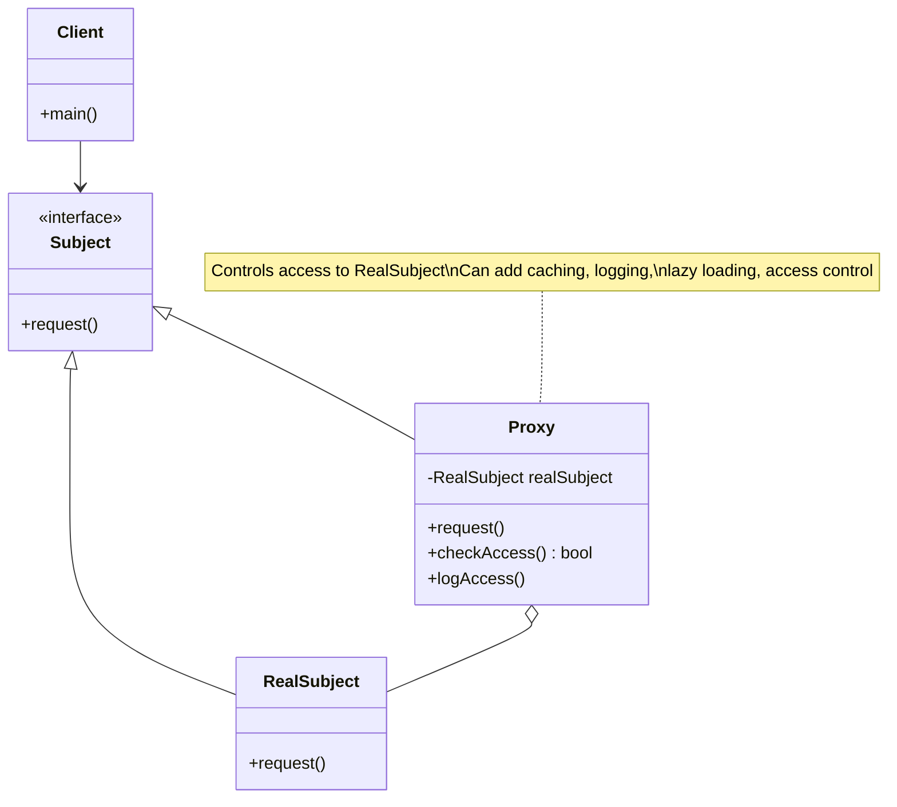

# Proxy Pattern - Lazy Loading, Caching & Access Control

In software development, we often need to control access to objects, add functionality transparently, or defer expensive operations until absolutely necessary.

**Example:** Lazy loading of resources, caching expensive operations, access control and security, logging and monitoring, etc.

Direct access to objects doesn't allow for preprocessing, access control, or optimization techniques like lazy loading and caching.

This is where the **Proxy Design Pattern** comes into play.

It's a fundamental structural pattern that provides lazy loading, caching, and access control capabilities essential for enterprise applications.

## What is Proxy Pattern?

Proxy Pattern is a structural design pattern that provides a placeholder or surrogate for another object to control access to it. The proxy acts as an intermediary between the client and the real object.

It allows you to perform something either before or after the request gets through to the original object, such as access control, caching, logging, or lazy initialization.

The proxy implements the same interface as the original object, making it transparent to clients.

## Class Diagram



## Implementation

### 1. Virtual Proxy - Lazy Loading Images

```java
import java.util.HashMap;
import java.util.Map;

// Subject interface
interface Image {
    void display();
    String getFileName();
    long getFileSize();
}

// Real Subject - Heavy object
class RealImage implements Image {
    private String fileName;
    private byte[] imageData;
    private long fileSize;

    public RealImage(String fileName) {
        this.fileName = fileName;
        loadImageFromDisk();
    }

    private void loadImageFromDisk() {
        System.out.println("Loading image from disk: " + fileName);
        // Simulate expensive loading operation
        try {
            Thread.sleep(1000); // Simulate loading time
        } catch (InterruptedException e) {
            Thread.currentThread().interrupt();
        }

        // Simulate image data
        this.imageData = new byte[1024 * 1024]; // 1MB
        this.fileSize = imageData.length;
        System.out.println("Image loaded: " + fileName + " (" + fileSize + " bytes)");
    }

    @Override
    public void display() {
        System.out.println("Displaying image: " + fileName);
    }

    @Override
    public String getFileName() {
        return fileName;
    }

    @Override
    public long getFileSize() {
        return fileSize;
    }
}

// Virtual Proxy for lazy loading
class ImageProxy implements Image {
    private String fileName;
    private RealImage realImage;

    public ImageProxy(String fileName) {
        this.fileName = fileName;
    }

    @Override
    public void display() {
        if (realImage == null) {
            realImage = new RealImage(fileName);
        }
        realImage.display();
    }

    @Override
    public String getFileName() {
        return fileName;
    }

    @Override
    public long getFileSize() {
        if (realImage == null) {
            // Return estimated size without loading
            return 1024 * 1024; // Estimated 1MB
        }
        return realImage.getFileSize();
    }
}

// Usage Example
class ImageLoadingExample {
    public static void main(String[] args) {
        System.out.println("Creating image proxies...");
        Image image1 = new ImageProxy("photo1.jpg");
        Image image2 = new ImageProxy("photo2.jpg");
        Image image3 = new ImageProxy("photo3.jpg");

        System.out.println("Images created (not loaded yet)");
        System.out.println("File sizes: " + image1.getFileSize() + ", " +
                          image2.getFileSize() + ", " + image3.getFileSize());

        System.out.println("\nDisplaying first image:");
        image1.display(); // This will trigger loading

        System.out.println("\nDisplaying first image again:");
        image1.display(); // This will not trigger loading

        System.out.println("\nDisplaying second image:");
        image2.display(); // This will trigger loading
    }
}
```

### 2. Caching Proxy - Database Access

```java
import java.util.*;
import java.util.concurrent.ConcurrentHashMap;

// Subject interface
interface UserRepository {
    User findById(Long id);
    List<User> findByDepartment(String department);
    void save(User user);
    void delete(Long id);
}

// Domain object
class User {
    private Long id;
    private String name;
    private String email;
    private String department;

    public User(Long id, String name, String email, String department) {
        this.id = id;
        this.name = name;
        this.email = email;
        this.department = department;
    }

    // Getters and setters
    public Long getId() { return id; }
    public String getName() { return name; }
    public String getEmail() { return email; }
    public String getDepartment() { return department; }

    @Override
    public String toString() {
        return String.format("User{id=%d, name='%s', email='%s', department='%s'}",
                           id, name, email, department);
    }

    @Override
    public boolean equals(Object obj) {
        if (this == obj) return true;
        if (obj == null || getClass() != obj.getClass()) return false;
        User user = (User) obj;
        return Objects.equals(id, user.id);
    }

    @Override
    public int hashCode() {
        return Objects.hash(id);
    }
}

// Real Subject - Database Repository
class DatabaseUserRepository implements UserRepository {
    private Map<Long, User> database = new HashMap<>();

    public DatabaseUserRepository() {
        // Initialize with some test data
        database.put(1L, new User(1L, "Alice Johnson", "alice@company.com", "Engineering"));
        database.put(2L, new User(2L, "Bob Smith", "bob@company.com", "Marketing"));
        database.put(3L, new User(3L, "Carol Davis", "carol@company.com", "Engineering"));
        database.put(4L, new User(4L, "David Wilson", "david@company.com", "Sales"));
    }

    @Override
    public User findById(Long id) {
        System.out.println("Database query: Finding user by ID " + id);
        // Simulate database delay
        simulateDelay(100);
        return database.get(id);
    }

    @Override
    public List<User> findByDepartment(String department) {
        System.out.println("Database query: Finding users by department " + department);
        simulateDelay(200);

        return database.values().stream()
                .filter(user -> user.getDepartment().equals(department))
                .collect(ArrayList::new, ArrayList::add, ArrayList::addAll);
    }

    @Override
    public void save(User user) {
        System.out.println("Database operation: Saving user " + user.getId());
        simulateDelay(150);
        database.put(user.getId(), user);
    }

    @Override
    public void delete(Long id) {
        System.out.println("Database operation: Deleting user " + id);
        simulateDelay(100);
        database.remove(id);
    }

    private void simulateDelay(int milliseconds) {
        try {
            Thread.sleep(milliseconds);
        } catch (InterruptedException e) {
            Thread.currentThread().interrupt();
        }
    }
}

// Caching Proxy
class CachingUserRepository implements UserRepository {
    private UserRepository realRepository;
    private Map<Long, User> userCache = new ConcurrentHashMap<>();
    private Map<String, List<User>> departmentCache = new ConcurrentHashMap<>();
    private Map<String, Long> cacheTimestamps = new ConcurrentHashMap<>();
    private static final long CACHE_TTL = 5000; // 5 seconds TTL

    public CachingUserRepository(UserRepository realRepository) {
        this.realRepository = realRepository;
    }

    @Override
    public User findById(Long id) {
        String cacheKey = "user_" + id;

        if (isCacheValid(cacheKey) && userCache.containsKey(id)) {
            System.out.println("Cache hit: User " + id);
            return userCache.get(id);
        }

        System.out.println("Cache miss: User " + id);
        User user = realRepository.findById(id);
        if (user != null) {
            userCache.put(id, user);
            cacheTimestamps.put(cacheKey, System.currentTimeMillis());
        }
        return user;
    }

    @Override
    public List<User> findByDepartment(String department) {
        String cacheKey = "dept_" + department;

        if (isCacheValid(cacheKey) && departmentCache.containsKey(department)) {
            System.out.println("Cache hit: Department " + department);
            return new ArrayList<>(departmentCache.get(department));
        }

        System.out.println("Cache miss: Department " + department);
        List<User> users = realRepository.findByDepartment(department);
        departmentCache.put(department, new ArrayList<>(users));
        cacheTimestamps.put(cacheKey, System.currentTimeMillis());
        return users;
    }

    @Override
    public void save(User user) {
        realRepository.save(user);
        // Update cache
        userCache.put(user.getId(), user);
        // Invalidate department cache as it might be affected
        invalidateDepartmentCache();
    }

    @Override
    public void delete(Long id) {
        realRepository.delete(id);
        // Remove from cache
        userCache.remove(id);
        cacheTimestamps.remove("user_" + id);
        // Invalidate department cache as it might be affected
        invalidateDepartmentCache();
    }

    private boolean isCacheValid(String cacheKey) {
        Long timestamp = cacheTimestamps.get(cacheKey);
        return timestamp != null && (System.currentTimeMillis() - timestamp) < CACHE_TTL;
    }

    private void invalidateDepartmentCache() {
        departmentCache.clear();
        cacheTimestamps.entrySet().removeIf(entry -> entry.getKey().startsWith("dept_"));
    }

    public void clearCache() {
        userCache.clear();
        departmentCache.clear();
        cacheTimestamps.clear();
        System.out.println("Cache cleared");
    }

    public Map<String, Object> getCacheStats() {
        Map<String, Object> stats = new HashMap<>();
        stats.put("userCacheSize", userCache.size());
        stats.put("departmentCacheSize", departmentCache.size());
        stats.put("totalCacheEntries", cacheTimestamps.size());
        return stats;
    }
}

// Usage Example
class CachingExample {
    public static void main(String[] args) {
        UserRepository repository = new CachingUserRepository(new DatabaseUserRepository());

        System.out.println("=== First access (cache miss) ===");
        User user1 = repository.findById(1L);
        System.out.println("Found: " + user1);

        System.out.println("\n=== Second access (cache hit) ===");
        User user1Again = repository.findById(1L);
        System.out.println("Found: " + user1Again);

        System.out.println("\n=== Department query (cache miss) ===");
        List<User> engineers = repository.findByDepartment("Engineering");
        System.out.println("Engineers: " + engineers.size());

        System.out.println("\n=== Same department query (cache hit) ===");
        List<User> engineersAgain = repository.findByDepartment("Engineering");
        System.out.println("Engineers: " + engineersAgain.size());

        // Wait for cache to expire
        System.out.println("\n=== Waiting for cache to expire ===");
        try {
            Thread.sleep(6000);
        } catch (InterruptedException e) {
            Thread.currentThread().interrupt();
        }

        System.out.println("\n=== After cache expiry (cache miss) ===");
        User user1Expired = repository.findById(1L);
        System.out.println("Found: " + user1Expired);
    }
}
```

### 3. Protection Proxy - Access Control

```java
import java.util.*;

// Subject interface
interface DocumentService {
    String readDocument(String documentId);
    void writeDocument(String documentId, String content);
    void deleteDocument(String documentId);
    List<String> listDocuments();
}

// Domain objects
class User {
    private String username;
    private Set<String> roles;

    public User(String username, String... roles) {
        this.username = username;
        this.roles = new HashSet<>(Arrays.asList(roles));
    }

    public String getUsername() { return username; }
    public Set<String> getRoles() { return roles; }
    public boolean hasRole(String role) { return roles.contains(role); }
}

// Simple authentication context
class SecurityContext {
    private static ThreadLocal<User> currentUser = new ThreadLocal<>();

    public static void setCurrentUser(User user) {
        currentUser.set(user);
    }

    public static User getCurrentUser() {
        return currentUser.get();
    }

    public static void clear() {
        currentUser.remove();
    }
}

// Real Subject
class RealDocumentService implements DocumentService {
    private Map<String, String> documents = new HashMap<>();

    public RealDocumentService() {
        // Initialize with some documents
        documents.put("doc1", "Public document content");
        documents.put("doc2", "Confidential document content");
        documents.put("doc3", "Top secret document content");
    }

    @Override
    public String readDocument(String documentId) {
        System.out.println("Reading document: " + documentId);
        return documents.get(documentId);
    }

    @Override
    public void writeDocument(String documentId, String content) {
        System.out.println("Writing document: " + documentId);
        documents.put(documentId, content);
    }

    @Override
    public void deleteDocument(String documentId) {
        System.out.println("Deleting document: " + documentId);
        documents.remove(documentId);
    }

    @Override
    public List<String> listDocuments() {
        System.out.println("Listing all documents");
        return new ArrayList<>(documents.keySet());
    }
}

// Protection Proxy
class SecureDocumentService implements DocumentService {
    private DocumentService realService;
    private Map<String, Set<String>> documentPermissions;

    public SecureDocumentService(DocumentService realService) {
        this.realService = realService;
        this.documentPermissions = new HashMap<>();

        // Set up document permissions
        documentPermissions.put("doc1", Set.of("USER", "ADMIN"));
        documentPermissions.put("doc2", Set.of("ADMIN"));
        documentPermissions.put("doc3", Set.of("ADMIN"));
    }

    @Override
    public String readDocument(String documentId) {
        if (!hasReadPermission(documentId)) {
            throw new SecurityException("Access denied: Insufficient permissions to read " + documentId);
        }

        logAccess("READ", documentId);
        return realService.readDocument(documentId);
    }

    @Override
    public void writeDocument(String documentId, String content) {
        if (!hasWritePermission(documentId)) {
            throw new SecurityException("Access denied: Insufficient permissions to write " + documentId);
        }

        logAccess("WRITE", documentId);
        realService.writeDocument(documentId, content);
    }

    @Override
    public void deleteDocument(String documentId) {
        if (!hasDeletePermission(documentId)) {
            throw new SecurityException("Access denied: Insufficient permissions to delete " + documentId);
        }

        logAccess("DELETE", documentId);
        realService.deleteDocument(documentId);
    }

    @Override
    public List<String> listDocuments() {
        User currentUser = SecurityContext.getCurrentUser();
        if (currentUser == null) {
            throw new SecurityException("Access denied: User not authenticated");
        }

        logAccess("LIST", "ALL");
        List<String> allDocuments = realService.listDocuments();

        // Filter documents based on permissions
        return allDocuments.stream()
                .filter(this::hasReadPermission)
                .collect(ArrayList::new, ArrayList::add, ArrayList::addAll);
    }

    private boolean hasReadPermission(String documentId) {
        return hasPermission(documentId, "READ");
    }

    private boolean hasWritePermission(String documentId) {
        return hasPermission(documentId, "WRITE");
    }

    private boolean hasDeletePermission(String documentId) {
        return hasPermission(documentId, "DELETE");
    }

    private boolean hasPermission(String documentId, String operation) {
        User currentUser = SecurityContext.getCurrentUser();
        if (currentUser == null) {
            return false;
        }

        // Admin can do everything
        if (currentUser.hasRole("ADMIN")) {
            return true;
        }

        // Check specific document permissions
        Set<String> requiredRoles = documentPermissions.get(documentId);
        if (requiredRoles == null) {
            return false; // Document doesn't exist or no permissions set
        }

        return requiredRoles.stream().anyMatch(currentUser::hasRole);
    }

    private void logAccess(String operation, String documentId) {
        User currentUser = SecurityContext.getCurrentUser();
        String username = currentUser != null ? currentUser.getUsername() : "ANONYMOUS";
        System.out.println("SECURITY LOG: " + username + " performed " + operation + " on " + documentId);
    }
}

// Usage Example
class SecurityProxyExample {
    public static void main(String[] args) {
        DocumentService documentService = new SecureDocumentService(new RealDocumentService());

        // Create users with different roles
        User regularUser = new User("john", "USER");
        User adminUser = new User("admin", "ADMIN", "USER");

        // Test with regular user
        System.out.println("=== Testing with regular user ===");
        SecurityContext.setCurrentUser(regularUser);

        try {
            String content = documentService.readDocument("doc1");
            System.out.println("Content: " + content);
        } catch (SecurityException e) {
            System.out.println("Error: " + e.getMessage());
        }

        try {
            String content = documentService.readDocument("doc2");
            System.out.println("Content: " + content);
        } catch (SecurityException e) {
            System.out.println("Error: " + e.getMessage());
        }

        // Test listing documents
        List<String> userDocs = documentService.listDocuments();
        System.out.println("Accessible documents: " + userDocs);

        // Test with admin user
        System.out.println("\n=== Testing with admin user ===");
        SecurityContext.setCurrentUser(adminUser);

        try {
            String content = documentService.readDocument("doc2");
            System.out.println("Content: " + content);
        } catch (SecurityException e) {
            System.out.println("Error: " + e.getMessage());
        }

        try {
            String content = documentService.readDocument("doc3");
            System.out.println("Content: " + content);
        } catch (SecurityException e) {
            System.out.println("Error: " + e.getMessage());
        }

        List<String> adminDocs = documentService.listDocuments();
        System.out.println("Accessible documents: " + adminDocs);

        // Test without authentication
        System.out.println("\n=== Testing without authentication ===");
        SecurityContext.clear();

        try {
            documentService.readDocument("doc1");
        } catch (SecurityException e) {
            System.out.println("Error: " + e.getMessage());
        }
    }
}
```

### 4. Remote Proxy - Distributed Services

```java
import java.util.*;
import java.util.concurrent.*;

// Service interface
interface WeatherService {
    WeatherData getCurrentWeather(String city);
    List<WeatherData> getWeatherForecast(String city, int days);
    boolean isServiceAvailable();
}

// Data transfer object
class WeatherData {
    private String city;
    private double temperature;
    private String condition;
    private int humidity;
    private double windSpeed;
    private long timestamp;

    public WeatherData(String city, double temperature, String condition, int humidity, double windSpeed) {
        this.city = city;
        this.temperature = temperature;
        this.condition = condition;
        this.humidity = humidity;
        this.windSpeed = windSpeed;
        this.timestamp = System.currentTimeMillis();
    }

    // Getters
    public String getCity() { return city; }
    public double getTemperature() { return temperature; }
    public String getCondition() { return condition; }
    public int getHumidity() { return humidity; }
    public double getWindSpeed() { return windSpeed; }
    public long getTimestamp() { return timestamp; }

    @Override
    public String toString() {
        return String.format("Weather{city='%s', temp=%.1f°C, condition='%s', humidity=%d%%, wind=%.1f m/s}",
                           city, temperature, condition, humidity, windSpeed);
    }
}

// Real Subject - Remote Weather Service
class RemoteWeatherService implements WeatherService {
    private Random random = new Random();
    private Map<String, WeatherData> weatherCache = new HashMap<>();

    @Override
    public WeatherData getCurrentWeather(String city) {
        System.out.println("Making remote API call for current weather: " + city);
        simulateNetworkDelay();

        // Simulate API response
        WeatherData weather = new WeatherData(
            city,
            15 + random.nextDouble() * 20, // 15-35°C
            getRandomCondition(),
            30 + random.nextInt(70), // 30-100%
            random.nextDouble() * 15 // 0-15 m/s
        );

        weatherCache.put(city, weather);
        return weather;
    }

    @Override
    public List<WeatherData> getWeatherForecast(String city, int days) {
        System.out.println("Making remote API call for " + days + "-day forecast: " + city);
        simulateNetworkDelay();

        List<WeatherData> forecast = new ArrayList<>();
        for (int i = 0; i < days; i++) {
            WeatherData dailyWeather = new WeatherData(
                city,
                10 + random.nextDouble() * 25,
                getRandomCondition(),
                20 + random.nextInt(80),
                random.nextDouble() * 20
            );
            forecast.add(dailyWeather);
        }

        return forecast;
    }

    @Override
    public boolean isServiceAvailable() {
        // Simulate occasional service unavailability
        return random.nextDouble() > 0.1; // 90% availability
    }

    private void simulateNetworkDelay() {
        try {
            Thread.sleep(500 + random.nextInt(1000)); // 500-1500ms delay
        } catch (InterruptedException e) {
            Thread.currentThread().interrupt();
        }
    }

    private String getRandomCondition() {
        String[] conditions = {"Sunny", "Cloudy", "Rainy", "Snowy", "Windy", "Foggy"};
        return conditions[random.nextInt(conditions.length)];
    }
}

// Remote Proxy with caching, retry, and circuit breaker
class WeatherServiceProxy implements WeatherService {
    private WeatherService remoteService;
    private Map<String, WeatherData> cache = new ConcurrentHashMap<>();
    private Map<String, Long> cacheTimestamps = new ConcurrentHashMap<>();
    private static final long CACHE_TTL = 10000; // 10 seconds

    // Circuit breaker state
    private volatile boolean circuitOpen = false;
    private volatile long lastFailureTime = 0;
    private static final long CIRCUIT_TIMEOUT = 30000; // 30 seconds
    private volatile int failureCount = 0;
    private static final int FAILURE_THRESHOLD = 3;

    public WeatherServiceProxy(WeatherService remoteService) {
        this.remoteService = remoteService;
    }

    @Override
    public WeatherData getCurrentWeather(String city) {
        // Check cache first
        String cacheKey = "current_" + city;
        if (isCacheValid(cacheKey)) {
            System.out.println("Cache hit for current weather: " + city);
            return cache.get(cacheKey);
        }

        // Check circuit breaker
        if (isCircuitOpen()) {
            System.out.println("Circuit breaker is open, using cached data or throwing exception");
            WeatherData cachedData = cache.get(cacheKey);
            if (cachedData != null) {
                return cachedData;
            }
            throw new RuntimeException("Service unavailable and no cached data available");
        }

        try {
            WeatherData weather = executeWithRetry(() -> remoteService.getCurrentWeather(city));
            cache.put(cacheKey, weather);
            cacheTimestamps.put(cacheKey, System.currentTimeMillis());
            onSuccess();
            return weather;
        } catch (Exception e) {
            onFailure();
            throw new RuntimeException("Failed to get weather data: " + e.getMessage(), e);
        }
    }

    @Override
    public List<WeatherData> getWeatherForecast(String city, int days) {
        String cacheKey = "forecast_" + city + "_" + days;

        // For simplicity, not implementing caching for forecast in this example
        if (isCircuitOpen()) {
            throw new RuntimeException("Service unavailable");
        }

        try {
            List<WeatherData> forecast = executeWithRetry(() -> remoteService.getWeatherForecast(city, days));
            onSuccess();
            return forecast;
        } catch (Exception e) {
            onFailure();
            throw new RuntimeException("Failed to get forecast data: " + e.getMessage(), e);
        }
    }

    @Override
    public boolean isServiceAvailable() {
        if (isCircuitOpen()) {
            return false;
        }

        try {
            boolean available = executeWithRetry(() -> remoteService.isServiceAvailable());
            if (available) {
                onSuccess();
            } else {
                onFailure();
            }
            return available;
        } catch (Exception e) {
            onFailure();
            return false;
        }
    }

    private <T> T executeWithRetry(Callable<T> operation) throws Exception {
        int maxRetries = 3;
        int delay = 1000;

        for (int i = 0; i < maxRetries; i++) {
            try {
                return operation.call();
            } catch (Exception e) {
                if (i == maxRetries - 1) {
                    throw e;
                }
                System.out.println("Retry " + (i + 1) + " after " + delay + "ms");
                try {
                    Thread.sleep(delay);
                } catch (InterruptedException ie) {
                    Thread.currentThread().interrupt();
                    throw new RuntimeException(ie);
                }
                delay *= 2; // Exponential backoff
            }
        }

        throw new RuntimeException("Should not reach here");
    }

    private boolean isCacheValid(String cacheKey) {
        Long timestamp = cacheTimestamps.get(cacheKey);
        return timestamp != null &&
               cache.containsKey(cacheKey) &&
               (System.currentTimeMillis() - timestamp) < CACHE_TTL;
    }

    private boolean isCircuitOpen() {
        if (!circuitOpen) {
            return false;
        }

        // Check if circuit should be closed (timeout expired)
        if (System.currentTimeMillis() - lastFailureTime > CIRCUIT_TIMEOUT) {
            System.out.println("Circuit breaker timeout expired, attempting to close circuit");
            circuitOpen = false;
            failureCount = 0;
        }

        return circuitOpen;
    }

    private void onSuccess() {
        failureCount = 0;
        if (circuitOpen) {
            System.out.println("Circuit breaker closed - service recovered");
            circuitOpen = false;
        }
    }

    private void onFailure() {
        failureCount++;
        lastFailureTime = System.currentTimeMillis();

        if (failureCount >= FAILURE_THRESHOLD && !circuitOpen) {
            System.out.println("Circuit breaker opened due to repeated failures");
            circuitOpen = true;
        }
    }

    public void clearCache() {
        cache.clear();
        cacheTimestamps.clear();
        System.out.println("Cache cleared");
    }

    public Map<String, Object> getProxyStats() {
        Map<String, Object> stats = new HashMap<>();
        stats.put("cacheSize", cache.size());
        stats.put("circuitOpen", circuitOpen);
        stats.put("failureCount", failureCount);
        return stats;
    }
}
```

## Test Code

```java
import org.junit.jupiter.api.Test;
import org.junit.jupiter.api.BeforeEach;
import static org.junit.jupiter.api.Assertions.*;

class ProxyPatternTest {

    @Test
    void testImageProxy() {
        Image image = new ImageProxy("test.jpg");

        // Image should not be loaded yet
        assertEquals("test.jpg", image.getFileName());
        assertEquals(1024 * 1024, image.getFileSize()); // Estimated size

        // First display should trigger loading
        assertDoesNotThrow(() -> image.display());

        // Second display should not trigger loading
        assertDoesNotThrow(() -> image.display());
    }

    @Test
    void testCachingProxy() {
        UserRepository realRepo = new DatabaseUserRepository();
        CachingUserRepository cachingRepo = new CachingUserRepository(realRepo);

        // First access - should hit database
        User user1 = cachingRepo.findById(1L);
        assertNotNull(user1);
        assertEquals("Alice Johnson", user1.getName());

        // Second access - should hit cache
        User user1Cached = cachingRepo.findById(1L);
        assertNotNull(user1Cached);
        assertEquals(user1.getName(), user1Cached.getName());

        // Test department caching
        List<User> engineers1 = cachingRepo.findByDepartment("Engineering");
        List<User> engineers2 = cachingRepo.findByDepartment("Engineering");
        assertEquals(engineers1.size(), engineers2.size());

        // Test cache stats
        Map<String, Object> stats = cachingRepo.getCacheStats();
        assertTrue((Integer) stats.get("userCacheSize") > 0);
    }

    @Test
    void testSecurityProxy() {
        DocumentService secureService = new SecureDocumentService(new RealDocumentService());

        // Test with admin user
        User admin = new User("admin", "ADMIN");
        SecurityContext.setCurrentUser(admin);

        // Admin should be able to read all documents
        assertDoesNotThrow(() -> {
            String content = secureService.readDocument("doc1");
            assertNotNull(content);
        });

        assertDoesNotThrow(() -> {
            String content = secureService.readDocument("doc2");
            assertNotNull(content);
        });

        // Test with regular user
        User user = new User("user", "USER");
        SecurityContext.setCurrentUser(user);

        // User should be able to read doc1 but not doc2
        assertDoesNotThrow(() -> {
            String content = secureService.readDocument("doc1");
            assertNotNull(content);
        });

        assertThrows(SecurityException.class, () -> {
            secureService.readDocument("doc2");
        });

        // Test without authentication
        SecurityContext.clear();
        assertThrows(SecurityException.class, () -> {
            secureService.readDocument("doc1");
        });
    }

    @Test
    void testWeatherServiceProxy() {
        WeatherService remoteService = new RemoteWeatherService();
        WeatherServiceProxy proxy = new WeatherServiceProxy(remoteService);

        // Test basic functionality
        assertDoesNotThrow(() -> {
            WeatherData weather = proxy.getCurrentWeather("London");
            assertNotNull(weather);
            assertEquals("London", weather.getCity());
        });

        // Test caching - second call should be faster (from cache)
        long startTime = System.currentTimeMillis();
        WeatherData cachedWeather = proxy.getCurrentWeather("London");
        long duration = System.currentTimeMillis() - startTime;

        assertNotNull(cachedWeather);
        assertTrue(duration < 100); // Should be very fast (cached)

        // Test service availability
        boolean available = proxy.isServiceAvailable();
        // Service should be available most of the time
        assertTrue(available || !available); // Just test it doesn't throw
    }

    @Test
    void testProxyTransparency() {
        // Test that proxy implements the same interface as real object
        UserRepository realRepo = new DatabaseUserRepository();
        UserRepository proxyRepo = new CachingUserRepository(realRepo);

        // Both should implement the same interface
        assertTrue(realRepo instanceof UserRepository);
        assertTrue(proxyRepo instanceof UserRepository);

        // Both should support the same operations
        assertDoesNotThrow(() -> {
            realRepo.findById(1L);
            proxyRepo.findById(1L);
        });
    }

    @Test
    void testProxyCacheInvalidation() {
        CachingUserRepository cachingRepo = new CachingUserRepository(new DatabaseUserRepository());

        // Load user into cache
        User user = cachingRepo.findById(1L);
        assertNotNull(user);

        // Modify user (should invalidate cache)
        User modifiedUser = new User(1L, "Modified Name", user.getEmail(), user.getDepartment());
        cachingRepo.save(modifiedUser);

        // Clear cache manually
        cachingRepo.clearCache();

        // Verify cache is cleared
        Map<String, Object> stats = cachingRepo.getCacheStats();
        assertEquals(0, (Integer) stats.get("userCacheSize"));
    }

    @Test
    void testSecurityContextIsolation() {
        DocumentService secureService = new SecureDocumentService(new RealDocumentService());

        // Test that security context is properly isolated
        User user1 = new User("user1", "USER");
        User user2 = new User("user2", "ADMIN");

        SecurityContext.setCurrentUser(user1);
        assertThrows(SecurityException.class, () -> {
            secureService.readDocument("doc2");
        });

        SecurityContext.setCurrentUser(user2);
        assertDoesNotThrow(() -> {
            secureService.readDocument("doc2");
        });

        SecurityContext.clear();
    }
}
```

## Real-World Examples of Proxy Pattern

### 1. **Enterprise Applications**

- **Hibernate Lazy Loading**: Proxy objects for database entities
- **Spring AOP**: Method interception and aspect-oriented programming
- **EJB Proxies**: Remote and local business interface proxies
- **Web Service Proxies**: SOAP and REST client proxies

### 2. **Caching Systems**

- **CDN (Content Delivery Networks)**: Geographic content proxies
- **Redis/Memcached**: Caching layer proxies
- **HTTP Proxy Servers**: Web caching and access control
- **Database Connection Pools**: Connection proxy management

### 3. **Security and Access Control**

- **API Gateways**: Authentication and authorization proxies
- **Firewall Proxies**: Network security and filtering
- **OAuth Proxies**: Token validation and refresh
- **RBAC Systems**: Role-based access control proxies

### 4. **Distributed Systems**

- **RPC (Remote Procedure Call)**: Network communication proxies
- **Microservice Proxies**: Service mesh and load balancing
- **Message Queue Proxies**: Asynchronous communication
- **Circuit Breakers**: Fault tolerance and resilience

## Specific Examples:

**java.lang.reflect.Proxy**: Java's built-in dynamic proxy for interfaces.

**Spring Security**: Method-level security using proxy-based AOP.

**Hibernate/JPA**: Lazy loading proxies for entity relationships.

**Apache HTTP Client**: Connection pooling and proxy support.

**Netflix Hystrix**: Circuit breaker pattern implementation.

## Pros and Cons of Proxy Pattern

| **Pros**                                                        | **Cons**                                                          |
| --------------------------------------------------------------- | ----------------------------------------------------------------- |
| ✅ **Lazy Loading**: Defer expensive operations until needed    | ❌ **Code Complexity**: Additional layer of abstraction           |
| ✅ **Access Control**: Control and monitor access to objects    | ❌ **Performance Overhead**: Extra method calls and checks        |
| ✅ **Caching**: Improve performance through intelligent caching | ❌ **Memory Usage**: Proxy objects consume additional memory      |
| ✅ **Remote Access**: Transparent access to remote objects      | ❌ **Network Latency**: Remote proxies introduce network delays   |
| ✅ **Transparency**: Clients unaware they're using a proxy      | ❌ **Debugging Difficulty**: Harder to trace through proxy layers |

## Best Practices

### ⚠️ **Warnings & Considerations**

1. **Thread Safety**: Ensure proxies are thread-safe in concurrent environments
2. **Cache Management**: Implement proper cache eviction and TTL strategies
3. **Error Handling**: Handle remote service failures gracefully
4. **Performance**: Monitor proxy overhead and optimize hot paths
5. **Memory Leaks**: Properly manage proxy lifecycle and cleanup

### 🏆 **Modern Alternatives & Enhancements**

- **Aspect-Oriented Programming**: Spring AOP, AspectJ for cross-cutting concerns
- **Interceptors**: JEE interceptors, method interception frameworks
- **Decorator Pattern**: For adding behavior without inheritance
- **Dynamic Proxies**: Runtime proxy generation for interfaces
- **Bytecode Manipulation**: CGLIB, Javassist for class proxies

### 💡 **When to Use Proxy Pattern**

✅ **Use When:**

- You need lazy loading of expensive objects
- Access control and security are required
- Caching can improve performance significantly
- You're accessing remote objects or services
- You want to add functionality transparently

❌ **Avoid When:**

- Simple direct access is sufficient
- Performance overhead is unacceptable
- The proxy logic becomes more complex than the real object
- You don't need the additional proxy features
- Memory usage is a critical constraint

### 🔧 **Implementation Tips**

1. **Interface-Based Design**: Use interfaces to ensure proxy transparency
2. **Composition Over Inheritance**: Prefer composition for proxy implementation
3. **Smart Caching**: Implement intelligent cache invalidation strategies
4. **Circuit Breakers**: Add fault tolerance for remote proxies
5. **Monitoring**: Add metrics and logging for proxy operations

The Proxy pattern is essential for building scalable, secure, and efficient applications where object access needs to be controlled, optimized, or enhanced, making it a cornerstone pattern in enterprise and distributed systems.
