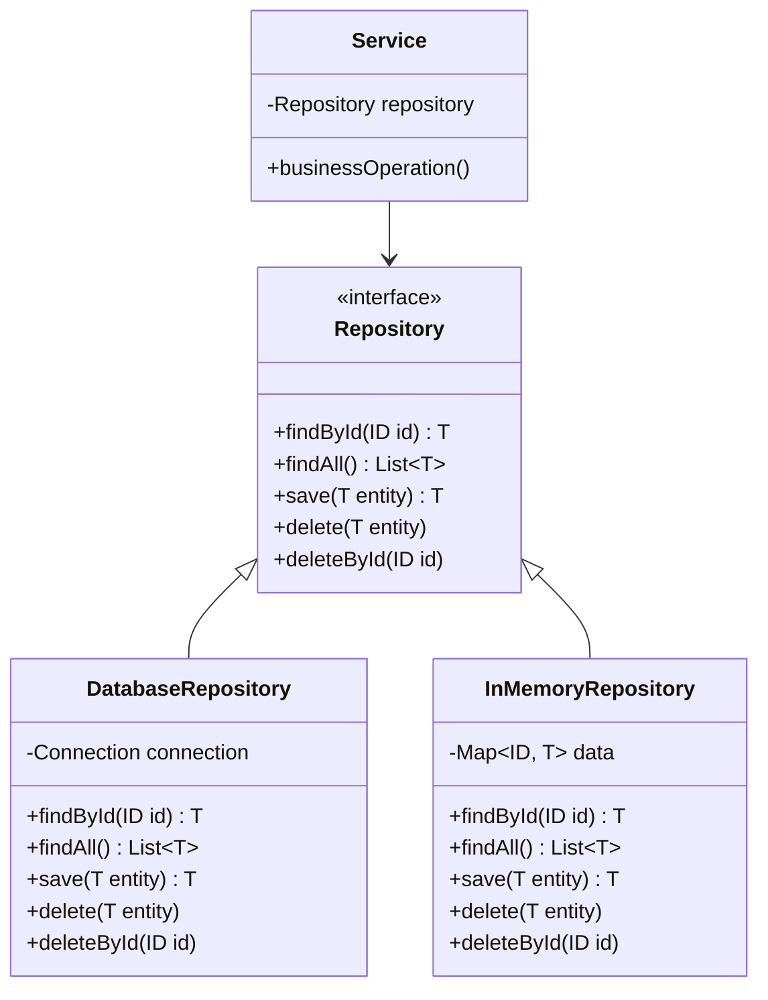

# Repository Pattern - Data Access Abstraction

In software development, we often need to access data from various sources (databases, files, web services) while keeping business logic independent of data access implementation details.

**Example:** Database queries, file operations, REST API calls, caching layers, etc.

Direct data access in business logic creates tight coupling, makes testing difficult, and violates the Single Responsibility Principle.

This is where the **Repository Design Pattern** comes into play.

It's a fundamental enterprise pattern that encapsulates data access logic and is essential for building maintainable, testable applications.

## What is Repository Pattern?

Repository Pattern is a design pattern that encapsulates the logic needed to access data sources. It centralizes common data access functionality, providing better maintainability and decoupling business logic from data access.

It acts as an in-memory collection of domain objects, abstracting away the underlying persistence mechanism.

The pattern promotes the separation of concerns principle by isolating data access code from business logic.

## Class Diagram



## Implementation

### 1. Basic Repository Implementation

```java
import java.util.*;
import java.util.concurrent.ConcurrentHashMap;
import java.util.stream.Collectors;

// Generic Repository Interface
interface Repository<T, ID> {
    Optional<T> findById(ID id);
    List<T> findAll();
    T save(T entity);
    void delete(T entity);
    void deleteById(ID id);
    boolean existsById(ID id);
    long count();
}

// Domain Entity
class Product {
    private String id;
    private String name;
    private String category;
    private double price;
    private int quantity;
    private Date createdAt;
    private Date updatedAt;

    public Product(String id, String name, String category, double price, int quantity) {
        this.id = id;
        this.name = name;
        this.category = category;
        this.price = price;
        this.quantity = quantity;
        this.createdAt = new Date();
        this.updatedAt = new Date();
    }

    // Getters and setters
    public String getId() { return id; }
    public void setId(String id) { this.id = id; }
    public String getName() { return name; }
    public void setName(String name) { this.name = name; this.updatedAt = new Date(); }
    public String getCategory() { return category; }
    public void setCategory(String category) { this.category = category; this.updatedAt = new Date(); }
    public double getPrice() { return price; }
    public void setPrice(double price) { this.price = price; this.updatedAt = new Date(); }
    public int getQuantity() { return quantity; }
    public void setQuantity(int quantity) { this.quantity = quantity; this.updatedAt = new Date(); }
    public Date getCreatedAt() { return createdAt; }
    public Date getUpdatedAt() { return updatedAt; }

    @Override
    public String toString() {
        return String.format("Product{id='%s', name='%s', category='%s', price=%.2f, quantity=%d}",
                            id, name, category, price, quantity);
    }

    @Override
    public boolean equals(Object obj) {
        if (this == obj) return true;
        if (obj == null || getClass() != obj.getClass()) return false;
        Product product = (Product) obj;
        return Objects.equals(id, product.id);
    }

    @Override
    public int hashCode() {
        return Objects.hash(id);
    }
}

// Specific Repository Interface
interface ProductRepository extends Repository<Product, String> {
    List<Product> findByCategory(String category);
    List<Product> findByPriceRange(double minPrice, double maxPrice);
    List<Product> findByNameContaining(String name);
    List<Product> findLowStockProducts(int threshold);
}

// In-Memory Repository Implementation
class InMemoryProductRepository implements ProductRepository {
    private final Map<String, Product> products = new ConcurrentHashMap<>();

    @Override
    public Optional<Product> findById(String id) {
        Product product = products.get(id);
        System.out.println("InMemory: Finding product by ID: " + id + " -> " + (product != null ? "Found" : "Not found"));
        return Optional.ofNullable(product);
    }

    @Override
    public List<Product> findAll() {
        System.out.println("InMemory: Finding all products -> " + products.size() + " products");
        return new ArrayList<>(products.values());
    }

    @Override
    public Product save(Product product) {
        if (product.getId() == null) {
            product.setId(generateId());
        }
        products.put(product.getId(), product);
        System.out.println("InMemory: Saved product: " + product);
        return product;
    }

    @Override
    public void delete(Product product) {
        products.remove(product.getId());
        System.out.println("InMemory: Deleted product: " + product.getId());
    }

    @Override
    public void deleteById(String id) {
        Product removed = products.remove(id);
        System.out.println("InMemory: Deleted product by ID: " + id + " -> " + (removed != null ? "Success" : "Not found"));
    }

    @Override
    public boolean existsById(String id) {
        boolean exists = products.containsKey(id);
        System.out.println("InMemory: Checking existence of product: " + id + " -> " + exists);
        return exists;
    }

    @Override
    public long count() {
        long count = products.size();
        System.out.println("InMemory: Counting products -> " + count);
        return count;
    }

    @Override
    public List<Product> findByCategory(String category) {
        List<Product> result = products.values().stream()
                .filter(p -> p.getCategory().equalsIgnoreCase(category))
                .collect(Collectors.toList());
        System.out.println("InMemory: Finding products by category '" + category + "' -> " + result.size() + " found");
        return result;
    }

    @Override
    public List<Product> findByPriceRange(double minPrice, double maxPrice) {
        List<Product> result = products.values().stream()
                .filter(p -> p.getPrice() >= minPrice && p.getPrice() <= maxPrice)
                .collect(Collectors.toList());
        System.out.println("InMemory: Finding products in price range $" + minPrice + "-$" + maxPrice + " -> " + result.size() + " found");
        return result;
    }

    @Override
    public List<Product> findByNameContaining(String name) {
        List<Product> result = products.values().stream()
                .filter(p -> p.getName().toLowerCase().contains(name.toLowerCase()))
                .collect(Collectors.toList());
        System.out.println("InMemory: Finding products containing name '" + name + "' -> " + result.size() + " found");
        return result;
    }

    @Override
    public List<Product> findLowStockProducts(int threshold) {
        List<Product> result = products.values().stream()
                .filter(p -> p.getQuantity() <= threshold)
                .collect(Collectors.toList());
        System.out.println("InMemory: Finding low stock products (threshold: " + threshold + ") -> " + result.size() + " found");
        return result;
    }

    private String generateId() {
        return "PROD" + System.currentTimeMillis() + "_" + (int)(Math.random() * 1000);
    }
}

// Database Repository Implementation (Simulated)
class DatabaseProductRepository implements ProductRepository {
    private final Map<String, Product> mockDatabase = new ConcurrentHashMap<>();
    private boolean connected = true;

    public DatabaseProductRepository() {
        initializeDatabase();
    }

    private void initializeDatabase() {
        System.out.println("Database: Initializing connection and schema...");
        // Simulate database initialization
        mockDatabase.put("DB1", new Product("DB1", "Database Product 1", "Electronics", 299.99, 50));
        mockDatabase.put("DB2", new Product("DB2", "Database Product 2", "Books", 19.99, 100));
        System.out.println("Database: Initialized with " + mockDatabase.size() + " products");
    }

    private void checkConnection() {
        if (!connected) {
            throw new RuntimeException("Database connection lost");
        }
    }

    @Override
    public Optional<Product> findById(String id) {
        checkConnection();
        System.out.println("Database: Executing SQL - SELECT * FROM products WHERE id = '" + id + "'");
        Product product = mockDatabase.get(id);
        return Optional.ofNullable(product);
    }

    @Override
    public List<Product> findAll() {
        checkConnection();
        System.out.println("Database: Executing SQL - SELECT * FROM products");
        return new ArrayList<>(mockDatabase.values());
    }

    @Override
    public Product save(Product product) {
        checkConnection();
        if (product.getId() == null) {
            product.setId("DB" + System.currentTimeMillis());
            System.out.println("Database: Executing SQL - INSERT INTO products VALUES (...)");
        } else {
            System.out.println("Database: Executing SQL - UPDATE products SET ... WHERE id = '" + product.getId() + "'");
        }
        mockDatabase.put(product.getId(), product);
        System.out.println("Database: Saved product: " + product);
        return product;
    }

    @Override
    public void delete(Product product) {
        checkConnection();
        System.out.println("Database: Executing SQL - DELETE FROM products WHERE id = '" + product.getId() + "'");
        mockDatabase.remove(product.getId());
    }

    @Override
    public void deleteById(String id) {
        checkConnection();
        System.out.println("Database: Executing SQL - DELETE FROM products WHERE id = '" + id + "'");
        mockDatabase.remove(id);
    }

    @Override
    public boolean existsById(String id) {
        checkConnection();
        System.out.println("Database: Executing SQL - SELECT COUNT(*) FROM products WHERE id = '" + id + "'");
        return mockDatabase.containsKey(id);
    }

    @Override
    public long count() {
        checkConnection();
        System.out.println("Database: Executing SQL - SELECT COUNT(*) FROM products");
        return mockDatabase.size();
    }

    @Override
    public List<Product> findByCategory(String category) {
        checkConnection();
        System.out.println("Database: Executing SQL - SELECT * FROM products WHERE category = '" + category + "'");
        return mockDatabase.values().stream()
                .filter(p -> p.getCategory().equalsIgnoreCase(category))
                .collect(Collectors.toList());
    }

    @Override
    public List<Product> findByPriceRange(double minPrice, double maxPrice) {
        checkConnection();
        System.out.println("Database: Executing SQL - SELECT * FROM products WHERE price BETWEEN " + minPrice + " AND " + maxPrice);
        return mockDatabase.values().stream()
                .filter(p -> p.getPrice() >= minPrice && p.getPrice() <= maxPrice)
                .collect(Collectors.toList());
    }

    @Override
    public List<Product> findByNameContaining(String name) {
        checkConnection();
        System.out.println("Database: Executing SQL - SELECT * FROM products WHERE name LIKE '%" + name + "%'");
        return mockDatabase.values().stream()
                .filter(p -> p.getName().toLowerCase().contains(name.toLowerCase()))
                .collect(Collectors.toList());
    }

    @Override
    public List<Product> findLowStockProducts(int threshold) {
        checkConnection();
        System.out.println("Database: Executing SQL - SELECT * FROM products WHERE quantity <= " + threshold);
        return mockDatabase.values().stream()
                .filter(p -> p.getQuantity() <= threshold)
                .collect(Collectors.toList());
    }

    public void disconnect() {
        connected = false;
        System.out.println("Database: Connection closed");
    }

    public void reconnect() {
        connected = true;
        System.out.println("Database: Connection restored");
    }
}

// Business Service Layer
class ProductService {
    private final ProductRepository repository;

    public ProductService(ProductRepository repository) {
        this.repository = repository;
        System.out.println("ProductService initialized with " + repository.getClass().getSimpleName());
    }

    public Product createProduct(String name, String category, double price, int quantity) {
        System.out.println("Service: Creating new product - " + name);

        // Business validation
        if (name == null || name.trim().isEmpty()) {
            throw new IllegalArgumentException("Product name cannot be empty");
        }
        if (price < 0) {
            throw new IllegalArgumentException("Product price cannot be negative");
        }
        if (quantity < 0) {
            throw new IllegalArgumentException("Product quantity cannot be negative");
        }

        Product product = new Product(null, name, category, price, quantity);
        return repository.save(product);
    }

    public Optional<Product> getProduct(String id) {
        System.out.println("Service: Getting product by ID - " + id);
        return repository.findById(id);
    }

    public List<Product> getAllProducts() {
        System.out.println("Service: Getting all products");
        return repository.findAll();
    }

    public Product updateProduct(String id, String name, String category, Double price, Integer quantity) {
        System.out.println("Service: Updating product - " + id);

        Optional<Product> existingProduct = repository.findById(id);
        if (!existingProduct.isPresent()) {
            throw new IllegalArgumentException("Product not found: " + id);
        }

        Product product = existingProduct.get();

        if (name != null && !name.trim().isEmpty()) {
            product.setName(name);
        }
        if (category != null) {
            product.setCategory(category);
        }
        if (price != null && price >= 0) {
            product.setPrice(price);
        }
        if (quantity != null && quantity >= 0) {
            product.setQuantity(quantity);
        }

        return repository.save(product);
    }

    public boolean deleteProduct(String id) {
        System.out.println("Service: Deleting product - " + id);

        if (!repository.existsById(id)) {
            return false;
        }

        repository.deleteById(id);
        return true;
    }

    public List<Product> searchProducts(String query) {
        System.out.println("Service: Searching products - " + query);
        return repository.findByNameContaining(query);
    }

    public List<Product> getProductsByCategory(String category) {
        System.out.println("Service: Getting products by category - " + category);
        return repository.findByCategory(category);
    }

    public List<Product> getProductsByPriceRange(double minPrice, double maxPrice) {
        System.out.println("Service: Getting products by price range - $" + minPrice + " to $" + maxPrice);
        return repository.findByPriceRange(minPrice, maxPrice);
    }

    public List<Product> getLowStockProducts(int threshold) {
        System.out.println("Service: Getting low stock products - threshold: " + threshold);
        return repository.findLowStockProducts(threshold);
    }

    public boolean restockProduct(String id, int additionalQuantity) {
        System.out.println("Service: Restocking product - " + id + " (+" + additionalQuantity + ")");

        Optional<Product> productOpt = repository.findById(id);
        if (!productOpt.isPresent()) {
            return false;
        }

        Product product = productOpt.get();
        product.setQuantity(product.getQuantity() + additionalQuantity);
        repository.save(product);

        System.out.println("Service: Product restocked - new quantity: " + product.getQuantity());
        return true;
    }

    public double calculateTotalInventoryValue() {
        System.out.println("Service: Calculating total inventory value");

        return repository.findAll().stream()
                .mapToDouble(p -> p.getPrice() * p.getQuantity())
                .sum();
    }

    public Map<String, Long> getCategoryStatistics() {
        System.out.println("Service: Generating category statistics");

        return repository.findAll().stream()
                .collect(Collectors.groupingBy(
                    Product::getCategory,
                    Collectors.counting()
                ));
    }

    public void generateInventoryReport() {
        System.out.println("\n=== INVENTORY REPORT ===");

        List<Product> allProducts = repository.findAll();
        double totalValue = calculateTotalInventoryValue();
        Map<String, Long> categoryStats = getCategoryStatistics();
        List<Product> lowStock = getLowStockProducts(10);

        System.out.println("Total Products: " + allProducts.size());
        System.out.println("Total Inventory Value: $" + String.format("%.2f", totalValue));
        System.out.println("Low Stock Products: " + lowStock.size());
        System.out.println("\nCategory Distribution:");
        categoryStats.forEach((category, count) ->
            System.out.println("  " + category + ": " + count + " products"));

        if (!lowStock.isEmpty()) {
            System.out.println("\nLow Stock Alert:");
            lowStock.forEach(p ->
                System.out.println("  " + p.getName() + " (Qty: " + p.getQuantity() + ")"));
        }
    }
}

// Repository Factory
class RepositoryFactory {
    public enum RepositoryType {
        IN_MEMORY, DATABASE
    }

    public static ProductRepository createProductRepository(RepositoryType type) {
        switch (type) {
            case IN_MEMORY:
                System.out.println("Factory: Creating InMemoryProductRepository");
                return new InMemoryProductRepository();
            case DATABASE:
                System.out.println("Factory: Creating DatabaseProductRepository");
                return new DatabaseProductRepository();
            default:
                throw new IllegalArgumentException("Unknown repository type: " + type);
        }
    }
}

// Usage Example
class RepositoryPatternExample {
    public static void main(String[] args) {
        System.out.println("=== Repository Pattern Example ===");

        // Test with In-Memory Repository
        System.out.println("\n" + "=".repeat(50));
        System.out.println("TESTING WITH IN-MEMORY REPOSITORY");
        System.out.println("=".repeat(50));

        testRepositoryPattern(RepositoryFactory.createProductRepository(RepositoryFactory.RepositoryType.IN_MEMORY));

        // Test with Database Repository
        System.out.println("\n" + "=".repeat(50));
        System.out.println("TESTING WITH DATABASE REPOSITORY");
        System.out.println("=".repeat(50));

        testRepositoryPattern(RepositoryFactory.createProductRepository(RepositoryFactory.RepositoryType.DATABASE));
    }

    private static void testRepositoryPattern(ProductRepository repository) {
        ProductService service = new ProductService(repository);

        // Create products
        service.createProduct("Laptop", "Electronics", 999.99, 25);
        service.createProduct("Book", "Books", 29.99, 100);
        service.createProduct("Headphones", "Electronics", 199.99, 5);
        service.createProduct("Tablet", "Electronics", 599.99, 15);

        // Test various operations
        System.out.println("\n--- Repository Operations Test ---");

        // Search and filter
        List<Product> electronics = service.getProductsByCategory("Electronics");
        System.out.println("Electronics products: " + electronics.size());

        List<Product> affordable = service.getProductsByPriceRange(0, 200);
        System.out.println("Affordable products (under $200): " + affordable.size());

        List<Product> lowStock = service.getLowStockProducts(10);
        System.out.println("Low stock products: " + lowStock.size());

        // Business operations
        service.restockProduct(electronics.get(0).getId(), 20);

        // Generate report
        service.generateInventoryReport();
    }
}
```

### 2. Advanced Repository with Specifications

```java
import java.util.function.Predicate;

// Specification Pattern for complex queries
interface Specification<T> {
    boolean isSatisfiedBy(T candidate);

    default Specification<T> and(Specification<T> other) {
        return candidate -> this.isSatisfiedBy(candidate) && other.isSatisfiedBy(candidate);
    }

    default Specification<T> or(Specification<T> other) {
        return candidate -> this.isSatisfiedBy(candidate) || other.isSatisfiedBy(candidate);
    }

    default Specification<T> not() {
        return candidate -> !this.isSatisfiedBy(candidate);
    }
}

// Enhanced Repository with Specifications
interface SpecificationRepository<T, ID> extends Repository<T, ID> {
    List<T> findBySpecification(Specification<T> specification);
    Optional<T> findOneBySpecification(Specification<T> specification);
    long countBySpecification(Specification<T> specification);
    boolean existsBySpecification(Specification<T> specification);
}

// Product Specifications
class ProductSpecifications {

    public static Specification<Product> hasCategory(String category) {
        return product -> product.getCategory().equalsIgnoreCase(category);
    }

    public static Specification<Product> priceGreaterThan(double price) {
        return product -> product.getPrice() > price;
    }

    public static Specification<Product> priceLessThan(double price) {
        return product -> product.getPrice() < price;
    }

    public static Specification<Product> quantityLessThan(int quantity) {
        return product -> product.getQuantity() < quantity;
    }

    public static Specification<Product> nameContains(String name) {
        return product -> product.getName().toLowerCase().contains(name.toLowerCase());
    }

    public static Specification<Product> isExpensive() {
        return priceGreaterThan(500.0);
    }

    public static Specification<Product> isLowStock() {
        return quantityLessThan(10);
    }

    public static Specification<Product> isElectronics() {
        return hasCategory("Electronics");
    }

    public static Specification<Product> isAffordableElectronics() {
        return isElectronics().and(priceLessThan(300.0));
    }

    public static Specification<Product> needsRestock() {
        return isExpensive().and(isLowStock());
    }
}

// Enhanced Repository Implementation
class EnhancedProductRepository extends InMemoryProductRepository implements SpecificationRepository<Product, String> {

    @Override
    public List<Product> findBySpecification(Specification<Product> specification) {
        System.out.println("Enhanced: Finding products by specification");
        return findAll().stream()
                .filter(specification::isSatisfiedBy)
                .collect(Collectors.toList());
    }

    @Override
    public Optional<Product> findOneBySpecification(Specification<Product> specification) {
        System.out.println("Enhanced: Finding one product by specification");
        return findAll().stream()
                .filter(specification::isSatisfiedBy)
                .findFirst();
    }

    @Override
    public long countBySpecification(Specification<Product> specification) {
        System.out.println("Enhanced: Counting products by specification");
        return findAll().stream()
                .filter(specification::isSatisfiedBy)
                .count();
    }

    @Override
    public boolean existsBySpecification(Specification<Product> specification) {
        System.out.println("Enhanced: Checking existence by specification");
        return findAll().stream()
                .anyMatch(specification::isSatisfiedBy);
    }
}

// Enhanced Service with Specifications
class EnhancedProductService extends ProductService {
    private final SpecificationRepository<Product, String> specRepository;

    public EnhancedProductService(SpecificationRepository<Product, String> repository) {
        super(repository);
        this.specRepository = repository;
    }

    public List<Product> findExpensiveElectronics() {
        return specRepository.findBySpecification(
            ProductSpecifications.isElectronics()
                .and(ProductSpecifications.isExpensive())
        );
    }

    public List<Product> findAffordableElectronics() {
        return specRepository.findBySpecification(
            ProductSpecifications.isAffordableElectronics()
        );
    }

    public List<Product> findProductsNeedingRestock() {
        return specRepository.findBySpecification(
            ProductSpecifications.needsRestock()
        );
    }

    public boolean hasExpensiveLowStockProducts() {
        return specRepository.existsBySpecification(
            ProductSpecifications.isExpensive()
                .and(ProductSpecifications.isLowStock())
        );
    }

    public long countAffordableProducts() {
        return specRepository.countBySpecification(
            ProductSpecifications.priceLessThan(100.0)
        );
    }

    public void demonstrateSpecifications() {
        System.out.println("\n=== SPECIFICATION QUERIES ===");

        System.out.println("Expensive Electronics: " + findExpensiveElectronics().size());
        System.out.println("Affordable Electronics: " + findAffordableElectronics().size());
        System.out.println("Products Needing Restock: " + findProductsNeedingRestock().size());
        System.out.println("Has Expensive Low Stock: " + hasExpensiveLowStockProducts());
        System.out.println("Affordable Products Count: " + countAffordableProducts());

        // Complex specification
        Specification<Product> complexSpec = ProductSpecifications.hasCategory("Books")
                .or(ProductSpecifications.priceGreaterThan(100.0)
                    .and(ProductSpecifications.quantityLessThan(20)));

        List<Product> complexResults = specRepository.findBySpecification(complexSpec);
        System.out.println("Complex Query Results: " + complexResults.size());
    }
}

// Repository Pattern with Caching
class CachedProductRepository implements ProductRepository {
    private final ProductRepository delegate;
    private final Map<String, Product> cache = new ConcurrentHashMap<>();
    private final Map<String, List<Product>> queryCache = new ConcurrentHashMap<>();
    private long cacheHits = 0;
    private long cacheMisses = 0;

    public CachedProductRepository(ProductRepository delegate) {
        this.delegate = delegate;
        System.out.println("CachedRepository: Initialized with " + delegate.getClass().getSimpleName());
    }

    @Override
    public Optional<Product> findById(String id) {
        Product cached = cache.get(id);
        if (cached != null) {
            cacheHits++;
            System.out.println("Cache: HIT for product ID: " + id);
            return Optional.of(cached);
        }

        cacheMisses++;
        System.out.println("Cache: MISS for product ID: " + id);
        Optional<Product> result = delegate.findById(id);
        result.ifPresent(product -> cache.put(id, product));
        return result;
    }

    @Override
    public List<Product> findAll() {
        String cacheKey = "ALL_PRODUCTS";
        List<Product> cached = queryCache.get(cacheKey);
        if (cached != null) {
            cacheHits++;
            System.out.println("Cache: HIT for findAll query");
            return new ArrayList<>(cached);
        }

        cacheMisses++;
        System.out.println("Cache: MISS for findAll query");
        List<Product> result = delegate.findAll();
        queryCache.put(cacheKey, new ArrayList<>(result));
        return result;
    }

    @Override
    public Product save(Product product) {
        Product saved = delegate.save(product);
        cache.put(saved.getId(), saved);
        clearQueryCache(); // Invalidate query cache
        System.out.println("Cache: Updated cache after save");
        return saved;
    }

    @Override
    public void delete(Product product) {
        delegate.delete(product);
        cache.remove(product.getId());
        clearQueryCache();
        System.out.println("Cache: Removed from cache after delete");
    }

    @Override
    public void deleteById(String id) {
        delegate.deleteById(id);
        cache.remove(id);
        clearQueryCache();
        System.out.println("Cache: Removed from cache after deleteById");
    }

    private void clearQueryCache() {
        queryCache.clear();
        System.out.println("Cache: Query cache cleared");
    }

    public void printCacheStatistics() {
        long total = cacheHits + cacheMisses;
        double hitRate = total > 0 ? (double) cacheHits / total * 100 : 0;

        System.out.println("\n=== CACHE STATISTICS ===");
        System.out.println("Cache Hits: " + cacheHits);
        System.out.println("Cache Misses: " + cacheMisses);
        System.out.println("Hit Rate: " + String.format("%.2f%%", hitRate));
        System.out.println("Cached Items: " + cache.size());
        System.out.println("Cached Queries: " + queryCache.size());
    }

    // Delegate remaining methods
    @Override
    public boolean existsById(String id) { return delegate.existsById(id); }

    @Override
    public long count() { return delegate.count(); }

    @Override
    public List<Product> findByCategory(String category) { return delegate.findByCategory(category); }

    @Override
    public List<Product> findByPriceRange(double minPrice, double maxPrice) {
        return delegate.findByPriceRange(minPrice, maxPrice);
    }

    @Override
    public List<Product> findByNameContaining(String name) { return delegate.findByNameContaining(name); }

    @Override
    public List<Product> findLowStockProducts(int threshold) { return delegate.findLowStockProducts(threshold); }
}

// Advanced Repository Example
class AdvancedRepositoryExample {
    public static void main(String[] args) {
        System.out.println("=== Advanced Repository Pattern Example ===");

        // Test Enhanced Repository with Specifications
        System.out.println("\n" + "=".repeat(50));
        System.out.println("TESTING SPECIFICATION REPOSITORY");
        System.out.println("=".repeat(50));

        EnhancedProductRepository enhancedRepo = new EnhancedProductRepository();
        EnhancedProductService enhancedService = new EnhancedProductService(enhancedRepo);

        // Add test data
        enhancedService.createProduct("Gaming Laptop", "Electronics", 1299.99, 3);
        enhancedService.createProduct("Wireless Mouse", "Electronics", 49.99, 25);
        enhancedService.createProduct("Programming Book", "Books", 39.99, 50);
        enhancedService.createProduct("4K Monitor", "Electronics", 799.99, 8);

        enhancedService.demonstrateSpecifications();

        // Test Cached Repository
        System.out.println("\n" + "=".repeat(50));
        System.out.println("TESTING CACHED REPOSITORY");
        System.out.println("=".repeat(50));

        ProductRepository baseRepo = new InMemoryProductRepository();
        CachedProductRepository cachedRepo = new CachedProductRepository(baseRepo);
        ProductService cachedService = new ProductService(cachedRepo);

        // Add test data
        cachedService.createProduct("Test Product 1", "Test", 99.99, 10);
        cachedService.createProduct("Test Product 2", "Test", 199.99, 20);

        // Demonstrate caching
        System.out.println("\nFirst access (cache miss expected):");
        cachedService.getProduct("1");
        cachedService.getAllProducts();

        System.out.println("\nSecond access (cache hit expected):");
        cachedService.getProduct("1");
        cachedService.getAllProducts();

        cachedRepo.printCacheStatistics();
    }
}
```

## Test Code

```java
import org.junit.jupiter.api.Test;
import org.junit.jupiter.api.BeforeEach;
import static org.junit.jupiter.api.Assertions.*;

class RepositoryPatternTest {
    private ProductRepository repository;
    private ProductService service;

    @BeforeEach
    void setUp() {
        repository = new InMemoryProductRepository();
        service = new ProductService(repository);
    }

    @Test
    void testBasicRepositoryOperations() {
        // Test save
        Product product = service.createProduct("Test Product", "Test", 99.99, 10);
        assertNotNull(product.getId());
        assertEquals("Test Product", product.getName());

        // Test findById
        Optional<Product> found = repository.findById(product.getId());
        assertTrue(found.isPresent());
        assertEquals("Test Product", found.get().getName());

        // Test findAll
        List<Product> allProducts = repository.findAll();
        assertTrue(allProducts.size() > 0);

        // Test exists
        assertTrue(repository.existsById(product.getId()));
        assertFalse(repository.existsById("nonexistent"));

        // Test count
        long count = repository.count();
        assertTrue(count > 0);

        // Test delete
        repository.deleteById(product.getId());
        assertFalse(repository.existsById(product.getId()));
    }

    @Test
    void testRepositoryQueries() {
        // Setup test data
        service.createProduct("Laptop", "Electronics", 999.99, 5);
        service.createProduct("Book", "Books", 29.99, 50);
        service.createProduct("Phone", "Electronics", 699.99, 15);

        // Test category search
        List<Product> electronics = repository.findByCategory("Electronics");
        assertEquals(2, electronics.size());

        // Test price range search
        List<Product> affordable = repository.findByPriceRange(0, 100);
        assertEquals(1, affordable.size());
        assertEquals("Book", affordable.get(0).getName());

        // Test name search
        List<Product> laptops = repository.findByNameContaining("Laptop");
        assertEquals(1, laptops.size());

        // Test low stock
        List<Product> lowStock = repository.findLowStockProducts(10);
        assertEquals(1, lowStock.size());
        assertEquals("Laptop", lowStock.get(0).getName());
    }

    @Test
    void testServiceBusinessLogic() {
        // Test validation
        assertThrows(IllegalArgumentException.class, () ->
            service.createProduct("", "Test", 99.99, 10));

        assertThrows(IllegalArgumentException.class, () ->
            service.createProduct("Test", "Test", -10, 10));

        // Test update
        Product product = service.createProduct("Original", "Test", 100.0, 10);
        Product updated = service.updateProduct(product.getId(), "Updated", "NewCategory", 200.0, 20);

        assertEquals("Updated", updated.getName());
        assertEquals("NewCategory", updated.getCategory());
        assertEquals(200.0, updated.getPrice());
        assertEquals(20, updated.getQuantity());

        // Test restock
        assertTrue(service.restockProduct(product.getId(), 30));
        Product restocked = service.getProduct(product.getId()).get();
        assertEquals(50, restocked.getQuantity()); // 20 + 30
    }

    @Test
    void testSpecificationRepository() {
        EnhancedProductRepository specRepo = new EnhancedProductRepository();

        // Add test data
        specRepo.save(new Product("1", "Gaming Laptop", "Electronics", 1500.0, 3));
        specRepo.save(new Product("2", "Wireless Mouse", "Electronics", 50.0, 25));
        specRepo.save(new Product("3", "Programming Book", "Books", 40.0, 50));

        // Test specifications
        List<Product> expensive = specRepo.findBySpecification(
            ProductSpecifications.priceGreaterThan(100.0));
        assertEquals(1, expensive.size());

        List<Product> electronics = specRepo.findBySpecification(
            ProductSpecifications.isElectronics());
        assertEquals(2, electronics.size());

        List<Product> affordableElectronics = specRepo.findBySpecification(
            ProductSpecifications.isAffordableElectronics());
        assertEquals(1, affordableElectronics.size());
        assertEquals("Wireless Mouse", affordableElectronics.get(0).getName());

        // Test combined specifications
        boolean hasExpensiveLowStock = specRepo.existsBySpecification(
            ProductSpecifications.isExpensive().and(ProductSpecifications.isLowStock()));
        assertTrue(hasExpensiveLowStock);

        // Test count
        long affordableCount = specRepo.countBySpecification(
            ProductSpecifications.priceLessThan(100.0));
        assertEquals(2, affordableCount);
    }

    @Test
    void testCachedRepository() {
        ProductRepository baseRepo = new InMemoryProductRepository();
        CachedProductRepository cachedRepo = new CachedProductRepository(baseRepo);

        // Add product
        Product product = new Product("1", "Test", "Test", 100.0, 10);
        cachedRepo.save(product);

        // First access - should be cache miss
        Optional<Product> first = cachedRepo.findById("1");
        assertTrue(first.isPresent());

        // Second access - should be cache hit
        Optional<Product> second = cachedRepo.findById("1");
        assertTrue(second.isPresent());

        // Verify cache statistics
        cachedRepo.printCacheStatistics();

        // Test cache invalidation
        cachedRepo.deleteById("1");
        Optional<Product> afterDelete = cachedRepo.findById("1");
        assertFalse(afterDelete.isPresent());
    }

    @Test
    void testRepositoryFactory() {
        ProductRepository inMemoryRepo = RepositoryFactory.createProductRepository(
            RepositoryFactory.RepositoryType.IN_MEMORY);
        assertTrue(inMemoryRepo instanceof InMemoryProductRepository);

        ProductRepository dbRepo = RepositoryFactory.createProductRepository(
            RepositoryFactory.RepositoryType.DATABASE);
        assertTrue(dbRepo instanceof DatabaseProductRepository);

        assertThrows(IllegalArgumentException.class, () ->
            RepositoryFactory.createProductRepository(null));
    }

    @Test
    void testServiceCalculations() {
        // Add test products
        service.createProduct("Product1", "Electronics", 100.0, 5);
        service.createProduct("Product2", "Books", 20.0, 10);
        service.createProduct("Product3", "Electronics", 200.0, 3);

        // Test total inventory value
        double totalValue = service.calculateTotalInventoryValue();
        assertEquals(1300.0, totalValue, 0.01); // (100*5) + (20*10) + (200*3)

        // Test category statistics
        Map<String, Long> stats = service.getCategoryStatistics();
        assertEquals(2L, stats.get("Electronics").longValue());
        assertEquals(1L, stats.get("Books").longValue());

        // Test low stock
        List<Product> lowStock = service.getLowStockProducts(5);
        assertEquals(2, lowStock.size()); // Products with quantity <= 5
    }

    @Test
    void testDatabaseRepository() {
        DatabaseProductRepository dbRepo = new DatabaseProductRepository();

        // Test connection dependency
        Product product = new Product("TEST1", "DB Test", "Test", 50.0, 5);
        dbRepo.save(product);

        Optional<Product> found = dbRepo.findById("TEST1");
        assertTrue(found.isPresent());

        // Test connection failure simulation
        dbRepo.disconnect();
        assertThrows(RuntimeException.class, () -> dbRepo.findById("TEST1"));

        // Test reconnection
        dbRepo.reconnect();
        Optional<Product> afterReconnect = dbRepo.findById("TEST1");
        assertTrue(afterReconnect.isPresent());
    }
}
```

## Real-World Examples of Repository Pattern

### 1. **Spring Data JPA**

- **JpaRepository**: Generic repository with CRUD operations
- **Custom Repositories**: Domain-specific query methods
- **Specifications**: Dynamic query building
- **Auditing**: Automatic entity auditing

### 2. **Entity Framework (.NET)**

- **DbContext**: Repository-like context for entity access
- **Generic Repository**: Reusable repository implementations
- **Unit of Work**: Transaction management across repositories
- **LINQ Queries**: Type-safe query expressions

### 3. **Django ORM**

- **Model Managers**: Custom query methods
- **QuerySets**: Lazy-loaded query results
- **Model Repositories**: Domain object access patterns
- **Database Routing**: Multiple database support

### 4. **Enterprise Applications**

- **Clean Architecture**: Repository as data access abstraction
- **Domain-Driven Design**: Aggregate repositories
- **Microservices**: Service-specific data access
- **Event Sourcing**: Event store repositories

## Specific Examples:

**org.springframework.data.repository.Repository**: Spring Data repository interface.

**javax.persistence.EntityManager**: JPA entity manager for data access.

**org.hibernate.Session**: Hibernate session as repository-like interface.

**java.util.concurrent.ConcurrentHashMap**: In-memory repository implementation.

**org.springframework.data.jpa.repository.JpaRepository**: Extended repository with JPA operations.

## Pros and Cons of Repository Pattern

| **Pros**                                                                 | **Cons**                                                                |
| ------------------------------------------------------------------------ | ----------------------------------------------------------------------- |
| ✅ **Separation of Concerns**: Business logic separated from data access | ❌ **Abstraction Overhead**: Additional layer can impact performance    |
| ✅ **Testability**: Easy to mock repositories for unit testing           | ❌ **Complexity**: Can be overkill for simple CRUD applications         |
| ✅ **Flexibility**: Easy to switch data sources                          | ❌ **Query Limitations**: Generic interface may not support all queries |
| ✅ **Maintainability**: Centralized data access logic                    | ❌ **Leaky Abstraction**: Database-specific features may leak through   |
| ✅ **Code Reusability**: Common operations reused across entities        | ❌ **Learning Curve**: Developers need to understand pattern concepts   |

## Best Practices

### ⚠️ **Warnings & Considerations**

1. **Keep Repositories Focused**: Don't make repositories too generic or too specific
2. **Avoid Business Logic**: Keep business rules in services, not repositories
3. **Transaction Management**: Handle transactions at service layer, not repository
4. **Query Performance**: Be mindful of N+1 queries and lazy loading
5. **Interface Design**: Design interfaces based on business needs, not database schema

### 🏆 **Modern Alternatives & Enhancements**

- **CQRS**: Separate read and write models with different repositories
- **Event Sourcing**: Repository for event streams instead of current state
- **Document Stores**: NoSQL document-based repositories
- **GraphQL**: Query-based data fetching patterns
- **Reactive Repositories**: Non-blocking, stream-based data access

### 💡 **When to Use Repository Pattern**

✅ **Use When:**

- You need to abstract data access from business logic
- Supporting multiple data sources is important
- Unit testing with mocked data access is required
- You want to centralize data access logic
- Domain-driven design principles are being followed

❌ **Avoid When:**

- Building simple CRUD applications with minimal business logic
- Performance overhead of abstraction layer is unacceptable
- Data access patterns are very simple and unlikely to change
- Team lacks experience with layered architecture patterns
- Direct ORM usage provides sufficient abstraction

The Repository pattern is essential for building maintainable, testable applications with clean separation between business logic and data access concerns.
