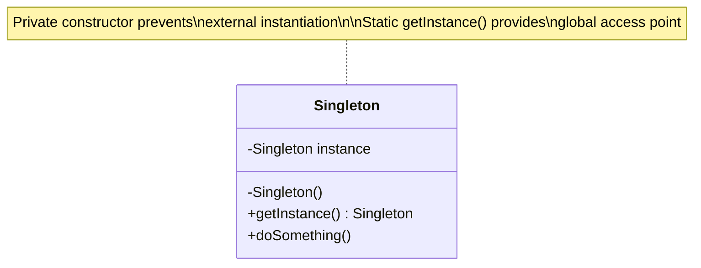

# Singleton Pattern - Single Instance

In software development, we often require classes that can only have one object.

**Example:** Thread pools, caches, loggers, configuration managers, database connections, etc.

Creating more than one objects of these could lead to issues such as incorrect program behavior, overuse of resources, or inconsistent results.

This is where the **Singleton Design Pattern** comes into play.

It is one of the simplest design patterns, yet challenging to implement correctly. It's controversial but still frequently asked in technical interviews.

## What is Singleton Pattern?

Singleton Pattern is a creational design pattern that guarantees a class has only one instance and provides a global point of access to it.

It involves only one class which is responsible for instantiating itself, making sure it creates not more than one instance.

To implement the singleton pattern, we must prevent external objects from creating instances of the singleton class. Only the singleton class should be permitted to create its own objects.

Additionally, we need to provide a method for external objects to access the singleton object.

## Class Diagram



## Implementation

There are several ways to implement the Singleton Pattern in Java, each with its own advantages and disadvantages. Let's explore 7 of the most common methods.

### 1. Lazy Initialization

This approach creates the singleton instance only when it is needed, saving resources if the singleton is never used in the application.

```java
class LazySingleton {
    // The single instance, initially null
    private static LazySingleton instance;

    // Private constructor to prevent instantiation
    private LazySingleton() {}

    // Public method to get the instance
    public static LazySingleton getInstance() {
        if (instance == null) {
            instance = new LazySingleton();
        }
        return instance;
    }

    public void doSomething() {
        System.out.println("Lazy Singleton is doing something...");
    }
}
```

1. Checks if an instance already exists (`instance == null`).
2. If not, it creates a new instance.
3. If an instance already exists, it skips the creation step.

⚠️ **Warning**  
This implementation is **not thread-safe**. If multiple threads call `getInstance()` simultaneously when instance is null, it's possible to create multiple instances.

### 2. Thread-Safe Singleton

This approach is similar to lazy initialization but also ensures that the singleton is thread-safe.

This is achieved by making the `getInstance()` method synchronized ensuring only one thread can execute this method at a time.

When a thread enters the synchronized method, it acquires a lock on the class object. Other threads must wait until the method is executed.

```java
class ThreadSafeSingleton {
    private static ThreadSafeSingleton instance;

    private ThreadSafeSingleton() {}

    public static synchronized ThreadSafeSingleton getInstance() {
        if (instance == null) {
            instance = new ThreadSafeSingleton();
        }
        return instance;
    }

    public void doSomething() {
        System.out.println("Thread-Safe Singleton is doing something...");
    }
}
```

The `synchronized` keyword ensures that only one thread can perform the `(instance == null)` check and create the object.

⚠️ **Warning**  
Although this approach is straightforward, using `synchronized` can cause substantial overhead and reduce performance, which can be a bottleneck if called frequently.

### 3. Double-Checked Locking

This approach minimizes performance overhead from synchronization by only synchronizing when the object is first created.

It uses the `volatile` keyword to ensure that changes to the instance variable are immediately visible to other threads.

```java
class DoubleCheckedSingleton {
    // The single instance, initially null, marked as volatile
    private static volatile DoubleCheckedSingleton instance;

    private DoubleCheckedSingleton() {}

    public static DoubleCheckedSingleton getInstance() {
        // First check (not synchronized)
        if (instance == null) {
            // Synchronize on the class object
            synchronized (DoubleCheckedSingleton.class) {
                // Second check (synchronized)
                if (instance == null) {
                    instance = new DoubleCheckedSingleton();
                }
            }
        }
        // Return the instance (either newly created or existing)
        return instance;
    }

    public void doSomething() {
        System.out.println("Double-Checked Singleton is doing something...");
    }
}
```

1. If the first check (`instance == null`) passes, we synchronize on the class object.
2. We check the same condition one more time because multiple threads may have passed the first check.
3. The instance is created only if both checks pass.

Although this method is a bit complex to implement, it can drastically reduce the performance overhead.

### 4. Eager Initialization

In this method, we rely on the JVM to create the singleton instance when the class is loaded. The JVM guarantees that the instance will be created before any thread access the instance variable.

This implementation is one of the simplest and inherently thread-safe without needing explicit synchronization.

```java
class EagerSingleton {
    // The single instance, created immediately
    private static final EagerSingleton instance = new EagerSingleton();

    private EagerSingleton() {}

    public static EagerSingleton getInstance() {
        return instance;
    }

    public void doSomething() {
        System.out.println("Eager Singleton is doing something...");
    }
}
```

- `static` variable ensures there's only one instance shared across all instances of the class.
- `final` prevents the instance from being reassigned after initialization.

This approach is suitable if your application always creates and uses the singleton instance, or the overhead of creating it is minimal.

⚠️ **Warning**  
While it is inherently thread-safe, it could potentially waste resources if the singleton instance is never used by the client application.

### 5. Bill Pugh Singleton

This implementation uses a static inner helper class to hold the singleton instance. The inner class is not loaded into memory until it's referenced for the first time in the `getInstance()` method.

It is thread-safe without requiring explicit synchronization.

```java
class BillPughSingleton {
    private BillPughSingleton() {}

    // Static inner class that holds the instance
    private static class SingletonHelper {
        private static final BillPughSingleton INSTANCE = new BillPughSingleton();
    }

    public static BillPughSingleton getInstance() {
        return SingletonHelper.INSTANCE;
    }

    public void doSomething() {
        System.out.println("Bill Pugh Singleton is doing something...");
    }
}
```

1. When the `getInstance()` method is called for the first time, it triggers the loading of the `SingletonHelper` class.
2. When the inner class is loaded, it creates the `INSTANCE` of `BillPughSingleton`.
3. The `final` keyword ensures that the `INSTANCE` cannot be reassigned.

The Bill Pugh Singleton implementation, while more complex than Eager Initialization provides a perfect balance of lazy initialization, thread safety, and performance, without the complexities of some other patterns like double-checked locking.

### 6. Static Block Initialization

This is similar to eager initialization, but the instance is created in a static block.

It provides the ability to handle exceptions during instance creation, which is not possible with simple eager initialization.

```java
class StaticBlockSingleton {
    private static StaticBlockSingleton instance;

    private StaticBlockSingleton() {}

    // Static block for initialization
    static {
        try {
            instance = new StaticBlockSingleton();
        } catch (Exception e) {
            throw new RuntimeException("Exception occurred in creating singleton instance");
        }
    }

    // Public method to get the instance
    public static StaticBlockSingleton getInstance() {
        return instance;
    }

    public void doSomething() {
        System.out.println("Static Block Singleton is doing something...");
    }
}
```

1. The static block is executed when the class is loaded by the JVM.
2. If an exception occurs, it's wrapped in a `RuntimeException`.

⚠️ **Warning**  
It is thread safe but not lazy-loaded, which might be a drawback if the initialization is resource-intensive or time-consuming.

### 7. Enum Singleton

In this method, the singleton is declared as an enum rather than a class.

Java ensures that only one instance of an enum value is created, even in a multithreaded environment.

The Enum Singleton pattern is the most robust and concise way to implement a singleton in Java.

```java
public enum EnumSingleton {
    INSTANCE;

    // Public method
    public void doSomething() {
        System.out.println("Enum Singleton is doing something...");
    }

    // You can add fields and methods as needed
    private String value = "Singleton Value";

    public String getValue() {
        return value;
    }

    public void setValue(String value) {
        this.value = value;
    }
}
```

Many Java experts, including Joshua Bloch, recommend Enum Singleton as the best singleton implementation in Java.

⚠️ **Warning**  
It may not always be suitable especially if you need to extend a class or if lazy initialization is a strict requirement.

### 8. Modern Functional Singleton (Java 8+)

```java
import java.util.function.Supplier;

class FunctionalSingleton {
    private static final Supplier<FunctionalSingleton> INSTANCE_SUPPLIER =
        () -> new FunctionalSingleton();

    private static final FunctionalSingleton INSTANCE = INSTANCE_SUPPLIER.get();

    private FunctionalSingleton() {}

    public static FunctionalSingleton getInstance() {
        return INSTANCE;
    }

    public void doSomething() {
        System.out.println("Functional Singleton is doing something...");
    }
}
```

## Test Code

```java
import org.junit.jupiter.api.Test;
import org.junit.jupiter.api.RepeatedTest;
import static org.junit.jupiter.api.Assertions.*;
import java.util.HashSet;
import java.util.Set;
import java.util.concurrent.CountDownLatch;
import java.util.concurrent.ExecutorService;
import java.util.concurrent.Executors;

class SingletonPatternTest {

    @Test
    void testLazySingleton() {
        LazySingleton instance1 = LazySingleton.getInstance();
        LazySingleton instance2 = LazySingleton.getInstance();

        assertSame(instance1, instance2, "Both instances should be the same");
        assertNotNull(instance1, "Instance should not be null");
    }

    @Test
    void testThreadSafeSingleton() {
        ThreadSafeSingleton instance1 = ThreadSafeSingleton.getInstance();
        ThreadSafeSingleton instance2 = ThreadSafeSingleton.getInstance();

        assertSame(instance1, instance2, "Both instances should be the same");
        assertNotNull(instance1, "Instance should not be null");
    }

    @Test
    void testDoubleCheckedSingleton() {
        DoubleCheckedSingleton instance1 = DoubleCheckedSingleton.getInstance();
        DoubleCheckedSingleton instance2 = DoubleCheckedSingleton.getInstance();

        assertSame(instance1, instance2, "Both instances should be the same");
        assertNotNull(instance1, "Instance should not be null");
    }

    @Test
    void testEagerSingleton() {
        EagerSingleton instance1 = EagerSingleton.getInstance();
        EagerSingleton instance2 = EagerSingleton.getInstance();

        assertSame(instance1, instance2, "Both instances should be the same");
        assertNotNull(instance1, "Instance should not be null");
    }

    @Test
    void testBillPughSingleton() {
        BillPughSingleton instance1 = BillPughSingleton.getInstance();
        BillPughSingleton instance2 = BillPughSingleton.getInstance();

        assertSame(instance1, instance2, "Both instances should be the same");
        assertNotNull(instance1, "Instance should not be null");
    }

    @Test
    void testStaticBlockSingleton() {
        StaticBlockSingleton instance1 = StaticBlockSingleton.getInstance();
        StaticBlockSingleton instance2 = StaticBlockSingleton.getInstance();

        assertSame(instance1, instance2, "Both instances should be the same");
        assertNotNull(instance1, "Instance should not be null");
    }

    @Test
    void testEnumSingleton() {
        EnumSingleton instance1 = EnumSingleton.INSTANCE;
        EnumSingleton instance2 = EnumSingleton.INSTANCE;

        assertSame(instance1, instance2, "Both instances should be the same");
        assertNotNull(instance1, "Instance should not be null");

        // Test enum-specific functionality
        instance1.setValue("Test Value");
        assertEquals("Test Value", instance2.getValue(), "Both instances should share state");
    }

    @Test
    void testConcurrentAccess() throws InterruptedException {
        final int threadCount = 100;
        final Set<BillPughSingleton> instances = new HashSet<>();
        final CountDownLatch latch = new CountDownLatch(threadCount);
        final ExecutorService executorService = Executors.newFixedThreadPool(threadCount);

        for (int i = 0; i < threadCount; i++) {
            executorService.submit(() -> {
                try {
                    instances.add(BillPughSingleton.getInstance());
                } finally {
                    latch.countDown();
                }
            });
        }

        latch.await();
        executorService.shutdown();

        assertEquals(1, instances.size(), "Only one unique instance should exist");
    }

    @RepeatedTest(10)
    void testRepeatedSingletonAccess() {
        DoubleCheckedSingleton instance1 = DoubleCheckedSingleton.getInstance();
        DoubleCheckedSingleton instance2 = DoubleCheckedSingleton.getInstance();

        assertSame(instance1, instance2, "Instances should be same across repeated tests");
    }
}
```

## Real-World Examples of Singleton

Singleton is useful in scenarios like:

### 1. **Managing Shared Resources**

- **Database Connections**: Connection pools, entity managers
- **Thread Pools**: Executor services, worker thread management
- **Caches**: In-memory caches, distributed cache managers
- **Configuration Settings**: Application properties, environment settings

### 2. **Coordinating System-Wide Actions**

- **Logging**: Log4j Logger, application-wide logging
- **Print Spoolers**: Print job management in operating systems
- **File Managers**: File system operations, temporary file cleanup
- **Event Buses**: Application-wide event notification systems

### 3. **Managing State**

- **User Sessions**: Web application session management
- **Application State**: Global application configuration
- **Security Context**: Authentication and authorization state
- **Metrics Collection**: Performance monitoring, statistics gathering

## Specific Examples:

**Logger Classes**: Many logging frameworks use the Singleton pattern to provide a global logging object. This ensures that log messages are consistently handled and written to the same output stream.

**Database Connection Pools**: Connection pools help manage and reuse database connections efficiently. A Singleton can ensure that only one pool is created and used throughout the application.

**Cache Objects**: In-memory caches are often implemented as Singletons to provide a single point of access for cached data across the application.

**Thread Pools**: Thread pools manage a collection of worker threads. A Singleton ensures that the same pool is used throughout the application, preventing resource overuse.

**File System**: File systems often use Singleton objects to represent the file system and provide a unified interface for file operations.

**Print Spooler**: In operating systems, print spoolers manage printing tasks. A single instance coordinates all print jobs to prevent conflicts.

## Pros and Cons of Singleton Pattern

| **Pros**                                                               | **Cons**                                                                          |
| ---------------------------------------------------------------------- | --------------------------------------------------------------------------------- |
| ✅ **Controlled Access**: Ensures only one instance exists             | ❌ **Global State**: Introduces global state which can be problematic             |
| ✅ **Resource Conservation**: Saves memory and system resources        | ❌ **Testing Difficulties**: Hard to mock and unit test                           |
| ✅ **Lazy Initialization**: Can defer creation until needed            | ❌ **Hidden Dependencies**: Makes dependencies less explicit                      |
| ✅ **Global Access**: Provides a global point of access                | ❌ **Thread Safety Complexity**: Requires careful thread-safe implementation      |
| ✅ **Consistent State**: Maintains consistent state across application | ❌ **Scalability Issues**: Can become a bottleneck in multi-threaded applications |

## Best Practices

### ⚠️ **Warnings & Considerations**

1. **Thread Safety**: Always consider thread safety in multi-threaded environments
2. **Serialization**: Implement `readResolve()` method to maintain singleton property during deserialization
3. **Reflection**: Consider security measures to prevent reflection-based attacks
4. **Cloning**: Override `clone()` method to prevent cloning
5. **Memory Leaks**: Be careful with static references that might prevent garbage collection

### 🏆 **Modern Alternatives**

- **Dependency Injection**: Use Spring, Guice, or CDI containers instead of singletons
- **Enum Singletons**: Preferred approach for most use cases
- **Static Utility Classes**: For stateless utility functions
- **Service Locator Pattern**: For service discovery and management

### 💡 **When to Use Singleton Pattern**

✅ **Use When:**

- You need exactly one instance of a class
- The instance needs to be accessible from multiple parts of the application
- You want to control access to shared resources
- You need to maintain global state

❌ **Avoid When:**

- You can use dependency injection instead
- The class doesn't maintain state
- You need multiple instances in different contexts
- Testing and mocking are critical requirements

### 🔧 **Implementation Recommendations**

1. **Prefer Enum Singleton** for most use cases due to serialization safety and thread safety
2. **Use Bill Pugh Singleton** when you need lazy initialization with thread safety
3. **Avoid Lazy Singleton** in multi-threaded environments
4. **Consider Double-Checked Locking** only when performance is critical
5. **Use Dependency Injection** frameworks instead of singletons when possible

It's important to note that the Singleton pattern should be used judiciously, as it introduces global state and can make testing and maintenance more challenging. Consider alternative approaches like dependency injection when possible to promote loose coupling and testability.
