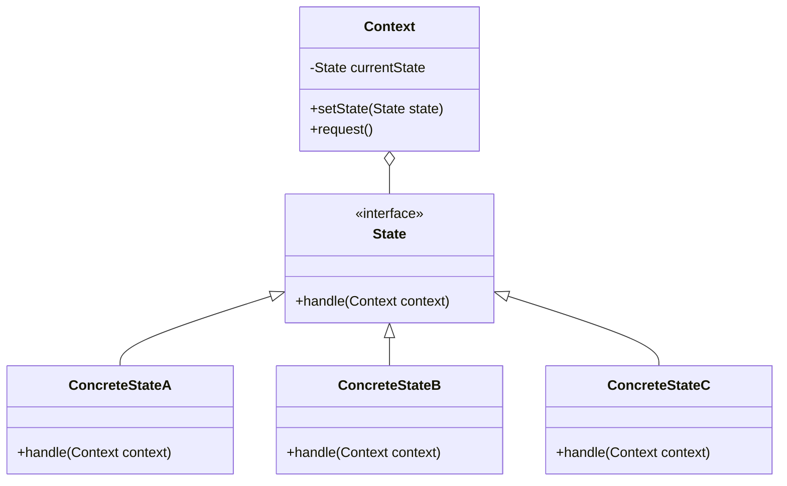

# State Pattern - State Machines & Workflow Management

In software development, we often need objects to change their behavior based on their internal state, especially in workflow systems and state machines.

**Example:** Order processing workflows, game character states, document approval processes, network connection states, etc.

Using conditional statements to handle different states leads to complex, hard-to-maintain code with many if-else blocks.

This is where the **State Design Pattern** comes into play.

It's a fundamental behavioral pattern that enables state machines and workflow management, commonly used in system design.

## What is State Pattern?

State Pattern is a behavioral design pattern that allows an object to alter its behavior when its internal state changes. The object will appear to change its class.

It encapsulates state-specific behavior into separate state classes and delegates behavior to the current state object.

The pattern promotes the Open/Closed principle by making it easy to add new states without modifying existing code.

## Class Diagram



## Implementation

### 1. Document Workflow System

```java
// State interface
interface DocumentState {
    void edit(DocumentContext document);
    void review(DocumentContext document);
    void approve(DocumentContext document);
    void reject(DocumentContext document);
    void publish(DocumentContext document);
    String getStateName();
}

// Context class
class DocumentContext {
    private DocumentState currentState;
    private String title;
    private String content;
    private String author;
    private List<String> comments;

    public DocumentContext(String title, String author) {
        this.title = title;
        this.author = author;
        this.comments = new ArrayList<>();
        this.currentState = new DraftState();
        System.out.println("Document created in DRAFT state");
    }

    public void setState(DocumentState state) {
        this.currentState = state;
        System.out.println("Document state changed to: " + state.getStateName());
    }

    // Delegate operations to current state
    public void edit() {
        currentState.edit(this);
    }

    public void review() {
        currentState.review(this);
    }

    public void approve() {
        currentState.approve(this);
    }

    public void reject() {
        currentState.reject(this);
    }

    public void publish() {
        currentState.publish(this);
    }

    // Getters and setters
    public String getTitle() { return title; }
    public String getContent() { return content; }
    public String getAuthor() { return author; }
    public String getCurrentStateName() { return currentState.getStateName(); }
    public void setContent(String content) { this.content = content; }
    public void addComment(String comment) { comments.add(comment); }
    public List<String> getComments() { return new ArrayList<>(comments); }
}

// Concrete States
class DraftState implements DocumentState {
    @Override
    public void edit(DocumentContext document) {
        System.out.println("Editing document in DRAFT state");
        document.setContent("Updated content for: " + document.getTitle());
    }

    @Override
    public void review(DocumentContext document) {
        System.out.println("Submitting document for review");
        document.setState(new UnderReviewState());
    }

    @Override
    public void approve(DocumentContext document) {
        System.out.println("Cannot approve document in DRAFT state");
    }

    @Override
    public void reject(DocumentContext document) {
        System.out.println("Cannot reject document in DRAFT state");
    }

    @Override
    public void publish(DocumentContext document) {
        System.out.println("Cannot publish document in DRAFT state");
    }

    @Override
    public String getStateName() {
        return "DRAFT";
    }
}

class UnderReviewState implements DocumentState {
    @Override
    public void edit(DocumentContext document) {
        System.out.println("Cannot edit document while under review");
    }

    @Override
    public void review(DocumentContext document) {
        System.out.println("Document is already under review");
    }

    @Override
    public void approve(DocumentContext document) {
        System.out.println("Document approved!");
        document.setState(new ApprovedState());
    }

    @Override
    public void reject(DocumentContext document) {
        System.out.println("Document rejected, returning to DRAFT");
        document.addComment("Document needs revision");
        document.setState(new DraftState());
    }

    @Override
    public void publish(DocumentContext document) {
        System.out.println("Cannot publish document while under review");
    }

    @Override
    public String getStateName() {
        return "UNDER_REVIEW";
    }
}

class ApprovedState implements DocumentState {
    @Override
    public void edit(DocumentContext document) {
        System.out.println("Cannot edit approved document. Creating new draft version.");
        document.setState(new DraftState());
    }

    @Override
    public void review(DocumentContext document) {
        System.out.println("Document is already approved");
    }

    @Override
    public void approve(DocumentContext document) {
        System.out.println("Document is already approved");
    }

    @Override
    public void reject(DocumentContext document) {
        System.out.println("Rejecting approved document, returning to DRAFT");
        document.setState(new DraftState());
    }

    @Override
    public void publish(DocumentContext document) {
        System.out.println("Publishing approved document");
        document.setState(new PublishedState());
    }

    @Override
    public String getStateName() {
        return "APPROVED";
    }
}

class PublishedState implements DocumentState {
    @Override
    public void edit(DocumentContext document) {
        System.out.println("Cannot edit published document. Creating new draft version.");
        document.setState(new DraftState());
    }

    @Override
    public void review(DocumentContext document) {
        System.out.println("Cannot review published document");
    }

    @Override
    public void approve(DocumentContext document) {
        System.out.println("Document is already published");
    }

    @Override
    public void reject(DocumentContext document) {
        System.out.println("Cannot reject published document");
    }

    @Override
    public void publish(DocumentContext document) {
        System.out.println("Document is already published");
    }

    @Override
    public String getStateName() {
        return "PUBLISHED";
    }
}

// Usage Example
class DocumentWorkflowExample {
    public static void main(String[] args) {
        DocumentContext document = new DocumentContext("Design Patterns Guide", "John Doe");

        // Edit in draft
        document.edit();

        // Submit for review
        document.review();

        // Try to edit while under review
        document.edit();

        // Approve document
        document.approve();

        // Publish document
        document.publish();

        // Try to edit published document
        document.edit();

        System.out.println("Final state: " + document.getCurrentStateName());
    }
}
```

### 2. Order Processing State Machine

```java
// Order state interface
interface OrderState {
    void payOrder(OrderContext order);
    void shipOrder(OrderContext order);
    void deliverOrder(OrderContext order);
    void cancelOrder(OrderContext order);
    void returnOrder(OrderContext order);
    String getStateName();
    boolean canTransitionTo(String stateName);
}

// Order context
class OrderContext {
    private OrderState currentState;
    private String orderId;
    private double amount;
    private String customerEmail;
    private List<String> items;
    private long createdTime;

    public OrderContext(String orderId, double amount, String customerEmail, List<String> items) {
        this.orderId = orderId;
        this.amount = amount;
        this.customerEmail = customerEmail;
        this.items = new ArrayList<>(items);
        this.createdTime = System.currentTimeMillis();
        this.currentState = new PendingState();
        System.out.println("Order " + orderId + " created in PENDING state");
    }

    public void setState(OrderState state) {
        String oldState = this.currentState.getStateName();
        this.currentState = state;
        System.out.println("Order " + orderId + " transitioned from " + oldState + " to " + state.getStateName());
    }

    // Delegate operations to current state
    public void pay() { currentState.payOrder(this); }
    public void ship() { currentState.shipOrder(this); }
    public void deliver() { currentState.deliverOrder(this); }
    public void cancel() { currentState.cancelOrder(this); }
    public void returnOrder() { currentState.returnOrder(this); }

    // Getters
    public String getOrderId() { return orderId; }
    public double getAmount() { return amount; }
    public String getCustomerEmail() { return customerEmail; }
    public List<String> getItems() { return items; }
    public String getCurrentStateName() { return currentState.getStateName(); }
    public long getCreatedTime() { return createdTime; }
    public boolean canTransitionTo(String stateName) { return currentState.canTransitionTo(stateName); }
}

// Base state with common functionality
abstract class BaseOrderState implements OrderState {
    protected void logInvalidTransition(String operation, String currentState) {
        System.out.println("Cannot " + operation + " order in " + currentState + " state");
    }

    @Override
    public boolean canTransitionTo(String stateName) {
        return false; // Override in specific states
    }
}

// Concrete order states
class PendingState extends BaseOrderState {
    @Override
    public void payOrder(OrderContext order) {
        System.out.println("Processing payment for order: " + order.getOrderId());
        order.setState(new PaidState());
    }

    @Override
    public void shipOrder(OrderContext order) {
        logInvalidTransition("ship", "PENDING");
    }

    @Override
    public void deliverOrder(OrderContext order) {
        logInvalidTransition("deliver", "PENDING");
    }

    @Override
    public void cancelOrder(OrderContext order) {
        System.out.println("Cancelling pending order: " + order.getOrderId());
        order.setState(new CancelledState());
    }

    @Override
    public void returnOrder(OrderContext order) {
        logInvalidTransition("return", "PENDING");
    }

    @Override
    public String getStateName() {
        return "PENDING";
    }

    @Override
    public boolean canTransitionTo(String stateName) {
        return "PAID".equals(stateName) || "CANCELLED".equals(stateName);
    }
}

class PaidState extends BaseOrderState {
    @Override
    public void payOrder(OrderContext order) {
        System.out.println("Order already paid: " + order.getOrderId());
    }

    @Override
    public void shipOrder(OrderContext order) {
        System.out.println("Shipping order: " + order.getOrderId());
        order.setState(new ShippedState());
    }

    @Override
    public void deliverOrder(OrderContext order) {
        logInvalidTransition("deliver", "PAID");
    }

    @Override
    public void cancelOrder(OrderContext order) {
        System.out.println("Cancelling paid order: " + order.getOrderId() + " (refund required)");
        order.setState(new CancelledState());
    }

    @Override
    public void returnOrder(OrderContext order) {
        logInvalidTransition("return", "PAID");
    }

    @Override
    public String getStateName() {
        return "PAID";
    }

    @Override
    public boolean canTransitionTo(String stateName) {
        return "SHIPPED".equals(stateName) || "CANCELLED".equals(stateName);
    }
}

class ShippedState extends BaseOrderState {
    @Override
    public void payOrder(OrderContext order) {
        System.out.println("Order already paid and shipped: " + order.getOrderId());
    }

    @Override
    public void shipOrder(OrderContext order) {
        System.out.println("Order already shipped: " + order.getOrderId());
    }

    @Override
    public void deliverOrder(OrderContext order) {
        System.out.println("Delivering order: " + order.getOrderId());
        order.setState(new DeliveredState());
    }

    @Override
    public void cancelOrder(OrderContext order) {
        System.out.println("Cannot cancel shipped order: " + order.getOrderId());
    }

    @Override
    public void returnOrder(OrderContext order) {
        logInvalidTransition("return", "SHIPPED");
    }

    @Override
    public String getStateName() {
        return "SHIPPED";
    }

    @Override
    public boolean canTransitionTo(String stateName) {
        return "DELIVERED".equals(stateName);
    }
}

class DeliveredState extends BaseOrderState {
    @Override
    public void payOrder(OrderContext order) {
        System.out.println("Order already completed: " + order.getOrderId());
    }

    @Override
    public void shipOrder(OrderContext order) {
        System.out.println("Order already delivered: " + order.getOrderId());
    }

    @Override
    public void deliverOrder(OrderContext order) {
        System.out.println("Order already delivered: " + order.getOrderId());
    }

    @Override
    public void cancelOrder(OrderContext order) {
        System.out.println("Cannot cancel delivered order: " + order.getOrderId());
    }

    @Override
    public void returnOrder(OrderContext order) {
        System.out.println("Processing return for order: " + order.getOrderId());
        order.setState(new ReturnedState());
    }

    @Override
    public String getStateName() {
        return "DELIVERED";
    }

    @Override
    public boolean canTransitionTo(String stateName) {
        return "RETURNED".equals(stateName);
    }
}

class CancelledState extends BaseOrderState {
    @Override
    public void payOrder(OrderContext order) {
        logInvalidTransition("pay", "CANCELLED");
    }

    @Override
    public void shipOrder(OrderContext order) {
        logInvalidTransition("ship", "CANCELLED");
    }

    @Override
    public void deliverOrder(OrderContext order) {
        logInvalidTransition("deliver", "CANCELLED");
    }

    @Override
    public void cancelOrder(OrderContext order) {
        System.out.println("Order already cancelled: " + order.getOrderId());
    }

    @Override
    public void returnOrder(OrderContext order) {
        logInvalidTransition("return", "CANCELLED");
    }

    @Override
    public String getStateName() {
        return "CANCELLED";
    }
}

class ReturnedState extends BaseOrderState {
    @Override
    public void payOrder(OrderContext order) {
        logInvalidTransition("pay", "RETURNED");
    }

    @Override
    public void shipOrder(OrderContext order) {
        logInvalidTransition("ship", "RETURNED");
    }

    @Override
    public void deliverOrder(OrderContext order) {
        logInvalidTransition("deliver", "RETURNED");
    }

    @Override
    public void cancelOrder(OrderContext order) {
        System.out.println("Order already returned: " + order.getOrderId());
    }

    @Override
    public void returnOrder(OrderContext order) {
        System.out.println("Order already returned: " + order.getOrderId());
    }

    @Override
    public String getStateName() {
        return "RETURNED";
    }
}

// Order management system
class OrderManagementSystem {
    private Map<String, OrderContext> orders = new HashMap<>();

    public OrderContext createOrder(String orderId, double amount, String customerEmail, List<String> items) {
        OrderContext order = new OrderContext(orderId, amount, customerEmail, items);
        orders.put(orderId, order);
        return order;
    }

    public OrderContext getOrder(String orderId) {
        return orders.get(orderId);
    }

    public void processPayment(String orderId) {
        OrderContext order = orders.get(orderId);
        if (order != null) {
            order.pay();
        }
    }

    public void shipOrder(String orderId) {
        OrderContext order = orders.get(orderId);
        if (order != null) {
            order.ship();
        }
    }

    public void deliverOrder(String orderId) {
        OrderContext order = orders.get(orderId);
        if (order != null) {
            order.deliver();
        }
    }

    public void cancelOrder(String orderId) {
        OrderContext order = orders.get(orderId);
        if (order != null) {
            order.cancel();
        }
    }

    public List<OrderContext> getOrdersByState(String stateName) {
        return orders.values().stream()
                .filter(order -> order.getCurrentStateName().equals(stateName))
                .collect(ArrayList::new, ArrayList::add, ArrayList::addAll);
    }
}

// Usage Example
class OrderProcessingExample {
    public static void main(String[] args) {
        OrderManagementSystem orderSystem = new OrderManagementSystem();

        // Create orders
        OrderContext order1 = orderSystem.createOrder("ORD-001", 99.99, "customer1@email.com",
                List.of("Laptop", "Mouse"));
        OrderContext order2 = orderSystem.createOrder("ORD-002", 29.99, "customer2@email.com",
                List.of("Book"));

        // Process order1 through complete workflow
        System.out.println("\n=== Processing Order 1 ===");
        orderSystem.processPayment("ORD-001");
        orderSystem.shipOrder("ORD-001");
        orderSystem.deliverOrder("ORD-001");

        // Try to return order1
        order1.returnOrder();

        // Process order2 partially and cancel
        System.out.println("\n=== Processing Order 2 ===");
        orderSystem.processPayment("ORD-002");
        orderSystem.cancelOrder("ORD-002");

        // Print final states
        System.out.println("\n=== Final States ===");
        System.out.println("Order 1 state: " + order1.getCurrentStateName());
        System.out.println("Order 2 state: " + order2.getCurrentStateName());
    }
}
```

### 3. Game Character State Machine

```java
// Character state interface
interface CharacterState {
    void move(GameCharacter character);
    void attack(GameCharacter character);
    void defend(GameCharacter character);
    void rest(GameCharacter character);
    void takeDamage(GameCharacter character, int damage);
    String getStateName();
}

// Game character context
class GameCharacter {
    private CharacterState currentState;
    private String name;
    private int health;
    private int maxHealth;
    private int mana;
    private int maxMana;
    private int energy;
    private int maxEnergy;

    public GameCharacter(String name) {
        this.name = name;
        this.maxHealth = 100;
        this.health = maxHealth;
        this.maxMana = 50;
        this.mana = maxMana;
        this.maxEnergy = 100;
        this.energy = maxEnergy;
        this.currentState = new IdleState();
        System.out.println(name + " created in IDLE state");
    }

    public void setState(CharacterState state) {
        this.currentState = state;
        System.out.println(name + " entered " + state.getStateName() + " state");
    }

    // Delegate operations to current state
    public void move() { currentState.move(this); }
    public void attack() { currentState.attack(this); }
    public void defend() { currentState.defend(this); }
    public void rest() { currentState.rest(this); }
    public void takeDamage(int damage) { currentState.takeDamage(this, damage); }

    // State-dependent properties
    public void consumeEnergy(int amount) {
        energy = Math.max(0, energy - amount);
        if (energy == 0) {
            setState(new TiredState());
        }
    }

    public void consumeMana(int amount) {
        mana = Math.max(0, mana - amount);
    }

    public void restoreHealth(int amount) {
        health = Math.min(maxHealth, health + amount);
    }

    public void restoreEnergy(int amount) {
        energy = Math.min(maxEnergy, energy + amount);
        if (energy > 30 && currentState instanceof TiredState) {
            setState(new IdleState());
        }
    }

    public void restoreMana(int amount) {
        mana = Math.min(maxMana, mana + amount);
    }

    // Getters
    public String getName() { return name; }
    public int getHealth() { return health; }
    public int getMana() { return mana; }
    public int getEnergy() { return energy; }
    public String getCurrentStateName() { return currentState.getStateName(); }

    public void setHealth(int health) {
        this.health = Math.max(0, Math.min(maxHealth, health));
        if (this.health == 0) {
            setState(new DeadState());
        }
    }

    public boolean isAlive() { return health > 0; }
    public boolean hasEnergy() { return energy > 0; }
    public boolean hasMana(int required) { return mana >= required; }
}

// Character states
class IdleState implements CharacterState {
    @Override
    public void move(GameCharacter character) {
        System.out.println(character.getName() + " starts moving");
        character.consumeEnergy(5);
        character.setState(new MovingState());
    }

    @Override
    public void attack(GameCharacter character) {
        if (character.hasEnergy()) {
            System.out.println(character.getName() + " attacks!");
            character.consumeEnergy(15);
            character.setState(new AttackingState());
        } else {
            System.out.println(character.getName() + " too tired to attack");
        }
    }

    @Override
    public void defend(GameCharacter character) {
        System.out.println(character.getName() + " takes defensive stance");
        character.setState(new DefendingState());
    }

    @Override
    public void rest(GameCharacter character) {
        System.out.println(character.getName() + " starts resting");
        character.setState(new RestingState());
    }

    @Override
    public void takeDamage(GameCharacter character, int damage) {
        System.out.println(character.getName() + " takes " + damage + " damage!");
        character.setHealth(character.getHealth() - damage);
    }

    @Override
    public String getStateName() {
        return "IDLE";
    }
}

class MovingState implements CharacterState {
    @Override
    public void move(GameCharacter character) {
        System.out.println(character.getName() + " continues moving");
        character.consumeEnergy(3);
    }

    @Override
    public void attack(GameCharacter character) {
        System.out.println(character.getName() + " stops and attacks!");
        character.consumeEnergy(20);
        character.setState(new AttackingState());
    }

    @Override
    public void defend(GameCharacter character) {
        System.out.println(character.getName() + " stops and defends");
        character.setState(new DefendingState());
    }

    @Override
    public void rest(GameCharacter character) {
        System.out.println(character.getName() + " stops moving and rests");
        character.setState(new RestingState());
    }

    @Override
    public void takeDamage(GameCharacter character, int damage) {
        System.out.println(character.getName() + " takes " + damage + " damage while moving!");
        character.setHealth(character.getHealth() - damage);
        character.setState(new IdleState());
    }

    @Override
    public String getStateName() {
        return "MOVING";
    }
}

class AttackingState implements CharacterState {
    @Override
    public void move(GameCharacter character) {
        System.out.println(character.getName() + " finishes attack and starts moving");
        character.setState(new MovingState());
    }

    @Override
    public void attack(GameCharacter character) {
        if (character.hasEnergy()) {
            System.out.println(character.getName() + " continues attacking!");
            character.consumeEnergy(15);
        } else {
            System.out.println(character.getName() + " too tired to continue attacking");
            character.setState(new IdleState());
        }
    }

    @Override
    public void defend(GameCharacter character) {
        System.out.println(character.getName() + " switches to defense");
        character.setState(new DefendingState());
    }

    @Override
    public void rest(GameCharacter character) {
        System.out.println(character.getName() + " stops attacking and rests");
        character.setState(new RestingState());
    }

    @Override
    public void takeDamage(GameCharacter character, int damage) {
        System.out.println(character.getName() + " takes " + damage + " damage during attack!");
        character.setHealth(character.getHealth() - damage);
        character.setState(new IdleState());
    }

    @Override
    public String getStateName() {
        return "ATTACKING";
    }
}

class DefendingState implements CharacterState {
    @Override
    public void move(GameCharacter character) {
        System.out.println(character.getName() + " stops defending and moves");
        character.setState(new MovingState());
    }

    @Override
    public void attack(GameCharacter character) {
        System.out.println(character.getName() + " counter-attacks!");
        character.setState(new AttackingState());
    }

    @Override
    public void defend(GameCharacter character) {
        System.out.println(character.getName() + " maintains defensive stance");
    }

    @Override
    public void rest(GameCharacter character) {
        System.out.println(character.getName() + " stops defending and rests");
        character.setState(new RestingState());
    }

    @Override
    public void takeDamage(GameCharacter character, int damage) {
        int reducedDamage = damage / 2; // Defense reduces damage
        System.out.println(character.getName() + " blocks! Takes only " + reducedDamage + " damage");
        character.setHealth(character.getHealth() - reducedDamage);
    }

    @Override
    public String getStateName() {
        return "DEFENDING";
    }
}

class RestingState implements CharacterState {
    @Override
    public void move(GameCharacter character) {
        System.out.println(character.getName() + " stops resting and moves");
        character.setState(new MovingState());
    }

    @Override
    public void attack(GameCharacter character) {
        System.out.println(character.getName() + " stops resting and attacks!");
        character.setState(new AttackingState());
    }

    @Override
    public void defend(GameCharacter character) {
        System.out.println(character.getName() + " stops resting and defends");
        character.setState(new DefendingState());
    }

    @Override
    public void rest(GameCharacter character) {
        System.out.println(character.getName() + " continues resting");
        character.restoreHealth(5);
        character.restoreEnergy(10);
        character.restoreMana(5);
    }

    @Override
    public void takeDamage(GameCharacter character, int damage) {
        System.out.println(character.getName() + " surprised while resting! Takes " + (damage + 5) + " damage");
        character.setHealth(character.getHealth() - (damage + 5));
        character.setState(new IdleState());
    }

    @Override
    public String getStateName() {
        return "RESTING";
    }
}

class TiredState implements CharacterState {
    @Override
    public void move(GameCharacter character) {
        System.out.println(character.getName() + " is too tired to move effectively");
    }

    @Override
    public void attack(GameCharacter character) {
        System.out.println(character.getName() + " is too tired to attack");
    }

    @Override
    public void defend(GameCharacter character) {
        System.out.println(character.getName() + " weakly defends");
        character.setState(new DefendingState());
    }

    @Override
    public void rest(GameCharacter character) {
        System.out.println(character.getName() + " rests to recover energy");
        character.setState(new RestingState());
    }

    @Override
    public void takeDamage(GameCharacter character, int damage) {
        System.out.println(character.getName() + " takes full damage while tired: " + damage);
        character.setHealth(character.getHealth() - damage);
    }

    @Override
    public String getStateName() {
        return "TIRED";
    }
}

class DeadState implements CharacterState {
    @Override
    public void move(GameCharacter character) {
        System.out.println(character.getName() + " cannot move - DEAD");
    }

    @Override
    public void attack(GameCharacter character) {
        System.out.println(character.getName() + " cannot attack - DEAD");
    }

    @Override
    public void defend(GameCharacter character) {
        System.out.println(character.getName() + " cannot defend - DEAD");
    }

    @Override
    public void rest(GameCharacter character) {
        System.out.println(character.getName() + " rests in peace");
    }

    @Override
    public void takeDamage(GameCharacter character, int damage) {
        System.out.println(character.getName() + " is already dead");
    }

    @Override
    public String getStateName() {
        return "DEAD";
    }
}

// Game example
class GameExample {
    public static void main(String[] args) {
        GameCharacter warrior = new GameCharacter("Warrior");

        System.out.println("\n=== Combat Simulation ===");
        warrior.move();
        warrior.attack();
        warrior.takeDamage(20);
        warrior.defend();
        warrior.takeDamage(15);
        warrior.rest();
        warrior.rest(); // Continue resting
        warrior.attack();

        // Exhaust the character
        System.out.println("\n=== Exhaustion Test ===");
        for (int i = 0; i < 10; i++) {
            warrior.attack();
            if ("TIRED".equals(warrior.getCurrentStateName())) {
                break;
            }
        }

        warrior.move(); // Should fail
        warrior.rest(); // Should work

        System.out.println("\nFinal state: " + warrior.getCurrentStateName());
        System.out.println("Health: " + warrior.getHealth() + ", Energy: " + warrior.getEnergy());
    }
}
```

## Test Code

```java
import org.junit.jupiter.api.Test;
import org.junit.jupiter.api.BeforeEach;
import static org.junit.jupiter.api.Assertions.*;
import java.util.List;

class StatePatternTest {

    @Test
    void testDocumentWorkflow() {
        DocumentContext document = new DocumentContext("Test Doc", "Author");

        // Initial state should be DRAFT
        assertEquals("DRAFT", document.getCurrentStateName());

        // Edit document
        document.edit();
        assertEquals("DRAFT", document.getCurrentStateName());

        // Submit for review
        document.review();
        assertEquals("UNDER_REVIEW", document.getCurrentStateName());

        // Approve document
        document.approve();
        assertEquals("APPROVED", document.getCurrentStateName());

        // Publish document
        document.publish();
        assertEquals("PUBLISHED", document.getCurrentStateName());
    }

    @Test
    void testDocumentRejection() {
        DocumentContext document = new DocumentContext("Test Doc", "Author");

        document.review(); // DRAFT -> UNDER_REVIEW
        document.reject(); // UNDER_REVIEW -> DRAFT

        assertEquals("DRAFT", document.getCurrentStateName());
        assertFalse(document.getComments().isEmpty());
    }

    @Test
    void testOrderWorkflow() {
        OrderContext order = new OrderContext("ORD-001", 100.0, "test@email.com",
                List.of("Item1", "Item2"));

        assertEquals("PENDING", order.getCurrentStateName());

        // Complete workflow
        order.pay();
        assertEquals("PAID", order.getCurrentStateName());

        order.ship();
        assertEquals("SHIPPED", order.getCurrentStateName());

        order.deliver();
        assertEquals("DELIVERED", order.getCurrentStateName());

        order.returnOrder();
        assertEquals("RETURNED", order.getCurrentStateName());
    }

    @Test
    void testOrderCancellation() {
        OrderContext order = new OrderContext("ORD-002", 50.0, "test@email.com",
                List.of("Item"));

        // Cancel from PENDING
        order.cancel();
        assertEquals("CANCELLED", order.getCurrentStateName());

        // Try to pay cancelled order (should fail)
        order.pay();
        assertEquals("CANCELLED", order.getCurrentStateName());
    }

    @Test
    void testInvalidTransitions() {
        OrderContext order = new OrderContext("ORD-003", 75.0, "test@email.com",
                List.of("Item"));

        // Try to ship without paying
        order.ship();
        assertEquals("PENDING", order.getCurrentStateName());

        // Try to deliver without shipping
        order.pay();
        order.deliver();
        assertEquals("PAID", order.getCurrentStateName());
    }

    @Test
    void testGameCharacterStates() {
        GameCharacter character = new GameCharacter("TestCharacter");

        assertEquals("IDLE", character.getCurrentStateName());
        assertEquals(100, character.getHealth());
        assertEquals(100, character.getEnergy());

        // Test movement
        character.move();
        assertEquals("MOVING", character.getCurrentStateName());
        assertEquals(95, character.getEnergy());

        // Test attack
        character.attack();
        assertEquals("ATTACKING", character.getCurrentStateName());
        assertEquals(75, character.getEnergy());

        // Test rest
        character.rest();
        assertEquals("RESTING", character.getCurrentStateName());

        character.rest(); // Continue resting
        assertEquals("RESTING", character.getCurrentStateName());
        assertTrue(character.getHealth() >= 100); // Should be restored
        assertTrue(character.getEnergy() > 75); // Should be restored
    }

    @Test
    void testCharacterExhaustion() {
        GameCharacter character = new GameCharacter("TiredCharacter");

        // Exhaust the character
        while (character.hasEnergy() && !"TIRED".equals(character.getCurrentStateName())) {
            character.attack();
        }

        assertEquals("TIRED", character.getCurrentStateName());
        assertEquals(0, character.getEnergy());

        // Tired character should rest
        character.rest();
        assertEquals("RESTING", character.getCurrentStateName());
    }

    @Test
    void testCharacterDeath() {
        GameCharacter character = new GameCharacter("TestCharacter");

        // Deal fatal damage
        character.takeDamage(100);
        assertEquals("DEAD", character.getCurrentStateName());
        assertEquals(0, character.getHealth());
        assertFalse(character.isAlive());

        // Dead character cannot perform actions
        character.move();
        character.attack();
        assertEquals("DEAD", character.getCurrentStateName());
    }

    @Test
    void testStateTransitionValidation() {
        OrderContext order = new OrderContext("ORD-004", 25.0, "test@email.com",
                List.of("Item"));

        // Test transition validation
        assertTrue(order.canTransitionTo("PAID"));
        assertTrue(order.canTransitionTo("CANCELLED"));
        assertFalse(order.canTransitionTo("SHIPPED"));
        assertFalse(order.canTransitionTo("DELIVERED"));

        order.pay();
        assertTrue(order.canTransitionTo("SHIPPED"));
        assertFalse(order.canTransitionTo("DELIVERED"));
    }

    @Test
    void testOrderManagementSystem() {
        OrderManagementSystem system = new OrderManagementSystem();

        system.createOrder("ORD-001", 100.0, "customer1@email.com", List.of("Item1"));
        system.createOrder("ORD-002", 200.0, "customer2@email.com", List.of("Item2"));

        system.processPayment("ORD-001");
        system.shipOrder("ORD-001");

        // Test filtering by state
        List<OrderContext> paidOrders = system.getOrdersByState("PENDING");
        assertEquals(1, paidOrders.size());
        assertEquals("ORD-002", paidOrders.get(0).getOrderId());

        List<OrderContext> shippedOrders = system.getOrdersByState("SHIPPED");
        assertEquals(1, shippedOrders.size());
        assertEquals("ORD-001", shippedOrders.get(0).getOrderId());
    }
}
```

## Real-World Examples of State Pattern

### 1. **Workflow Management**

- **Document Approval**: Draft → Review → Approved → Published
- **Order Processing**: Pending → Paid → Shipped → Delivered
- **Employee Hiring**: Applied → Interview → Offer → Hired
- **Project Management**: Planning → Development → Testing → Deployed

### 2. **User Interface**

- **Button States**: Normal → Hover → Pressed → Disabled
- **Form Validation**: Invalid → Valid → Submitting → Submitted
- **Media Players**: Stopped → Playing → Paused → Buffering
- **Download States**: Queued → Downloading → Paused → Completed

### 3. **Network & Communication**

- **TCP Connections**: Closed → Listen → Established → Closing
- **HTTP Requests**: Pending → Sent → Receiving → Completed
- **WebSocket States**: Connecting → Open → Closing → Closed
- **Authentication**: Anonymous → Authenticating → Authenticated → Expired

### 4. **Game Development**

- **Character States**: Idle → Moving → Attacking → Dead
- **Game States**: Menu → Playing → Paused → GameOver
- **AI Behavior**: Patrol → Chase → Attack → Retreat
- **Vehicle States**: Parked → Driving → Braking → Crashed

## Specific Examples:

**javax.servlet.http.HttpSession**: Web session state management.

**java.lang.Thread.State**: Thread lifecycle states (NEW, RUNNABLE, BLOCKED, etc.).

**Spring State Machine**: Enterprise workflow and business process management.

**Akka FSM**: Actor-based finite state machines in distributed systems.

**Redux/Vuex**: Frontend application state management.

## Pros and Cons of State Pattern

| **Pros**                                                              | **Cons**                                                           |
| --------------------------------------------------------------------- | ------------------------------------------------------------------ |
| ✅ **Single Responsibility**: Each state class has one responsibility | ❌ **Class Proliferation**: Many state classes can be overwhelming |
| ✅ **Open/Closed Principle**: Easy to add new states                  | ❌ **State Explosion**: Complex systems can have too many states   |
| ✅ **Eliminates Conditionals**: No complex if-else chains             | ❌ **State Sharing**: Difficult to share state between objects     |
| ✅ **Clear State Transitions**: Explicit state transition logic       | ❌ **Context Dependency**: States are tightly coupled to context   |
| ✅ **Maintainable**: Easy to understand and modify state behavior     | ❌ **Overhead**: Object creation and method call overhead          |

## Best Practices

### ⚠️ **Warnings & Considerations**

1. **State Explosion**: Don't create too many fine-grained states
2. **Shared State**: Be careful with shared data between states
3. **State Transitions**: Validate state transitions to prevent invalid states
4. **Memory Management**: Consider state object lifecycle and cleanup
5. **Error Handling**: Handle invalid operations gracefully

### 🏆 **Modern Alternatives & Enhancements**

- **State Machines Libraries**: SCXML, XState for complex state management
- **Event Sourcing**: Store state changes as events
- **Finite State Machines**: Mathematical FSM implementations
- **Actor Model**: Akka, Orleans for distributed state management
- **Reactive Programming**: RxJava, Project Reactor for state streams

### 💡 **When to Use State Pattern**

✅ **Use When:**

- Object behavior depends significantly on its state
- Complex conditional logic based on state exists
- State transitions are well-defined and frequent
- You need to eliminate large conditional statements

❌ **Avoid When:**

- Object has few states or simple behavior
- State changes are rare or trivial
- Performance is critical and state objects are expensive
- State logic is simple enough for conditionals

The State pattern is essential for building robust workflow systems, state machines, and any application where object behavior changes significantly based on internal state.
