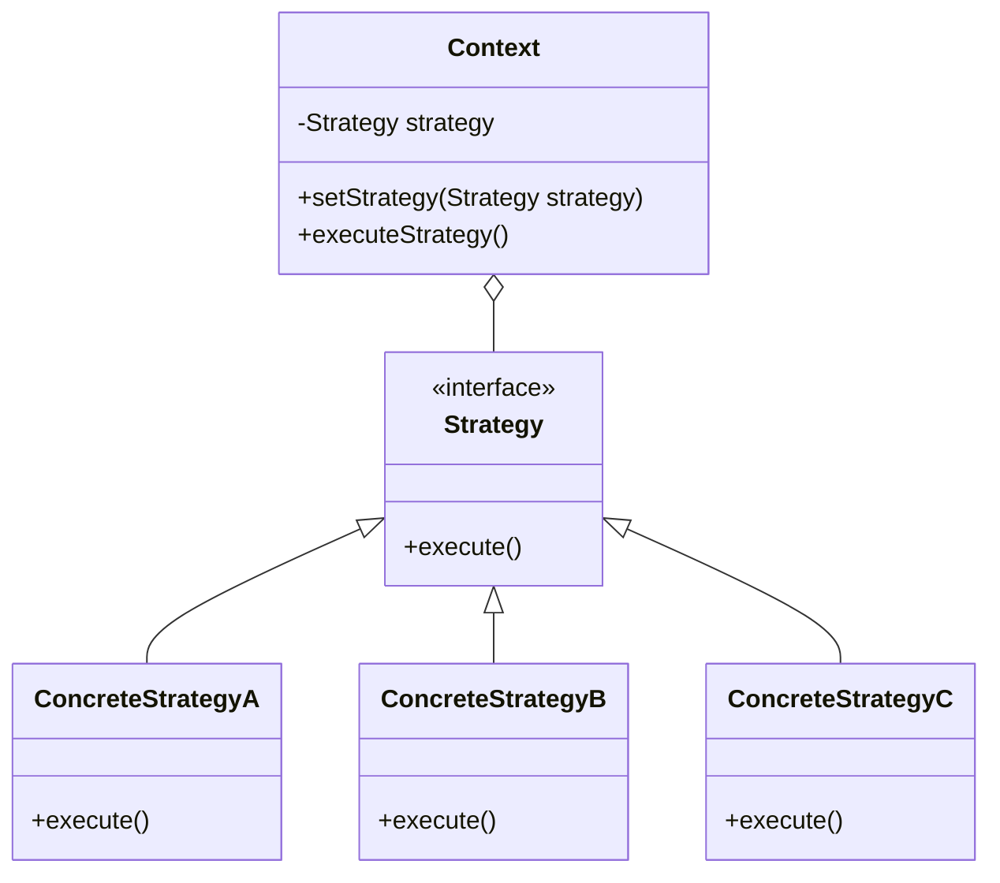

# Strategy Pattern - Algorithm Flexibility

In software development, we often need to use different algorithms or approaches to solve the same problem based on varying conditions or requirements.

**Example:** Payment processing (credit card, PayPal, crypto), sorting algorithms, compression techniques, route planning, etc.

Hard-coding different algorithms into a single class leads to issues such as tight coupling, violation of Open/Closed principle, and difficulty in testing individual algorithms.

This is where the **Strategy Design Pattern** comes into play.

It's a fundamental behavioral pattern that enables algorithm flexibility and is very commonly asked in technical interviews.

## What is Strategy Pattern?

Strategy Pattern is a behavioral design pattern that defines a family of algorithms, encapsulates each one, and makes them interchangeable. The pattern lets the algorithm vary independently from clients that use it.

It enables selecting algorithms at runtime rather than compile time, promoting loose coupling between client code and specific implementations.

The pattern follows the composition over inheritance principle and adheres to the Open/Closed principle.

## Class Diagram



## Implementation

There are several ways to implement the Strategy Pattern in Java. Let's explore various approaches with real-world examples.

### 1. Classic Strategy Implementation - Payment Processing

```java
// Strategy interface
interface PaymentStrategy {
    boolean pay(double amount);
    String getPaymentType();
}

// Concrete Strategies
class CreditCardStrategy implements PaymentStrategy {
    private String name;
    private String cardNumber;
    private String cvv;
    private String expiryDate;

    public CreditCardStrategy(String name, String cardNumber, String cvv, String expiryDate) {
        this.name = name;
        this.cardNumber = cardNumber;
        this.cvv = cvv;
        this.expiryDate = expiryDate;
    }

    @Override
    public boolean pay(double amount) {
        System.out.printf("Paid $%.2f using Credit Card ending in %s%n",
            amount, cardNumber.substring(cardNumber.length() - 4));
        // Simulate payment processing
        return amount > 0;
    }

    @Override
    public String getPaymentType() {
        return "Credit Card";
    }
}

class PayPalStrategy implements PaymentStrategy {
    private String email;
    private String password;

    public PayPalStrategy(String email, String password) {
        this.email = email;
        this.password = password;
    }

    @Override
    public boolean pay(double amount) {
        System.out.printf("Paid $%.2f using PayPal account %s%n", amount, email);
        // Simulate PayPal payment processing
        return amount > 0;
    }

    @Override
    public String getPaymentType() {
        return "PayPal";
    }
}

class CryptocurrencyStrategy implements PaymentStrategy {
    private String walletAddress;
    private String privateKey;

    public CryptocurrencyStrategy(String walletAddress, String privateKey) {
        this.walletAddress = walletAddress;
        this.privateKey = privateKey;
    }

    @Override
    public boolean pay(double amount) {
        System.out.printf("Paid $%.2f using Cryptocurrency to wallet %s%n",
            amount, walletAddress.substring(0, 8) + "...");
        // Simulate crypto payment processing
        return amount > 0;
    }

    @Override
    public String getPaymentType() {
        return "Cryptocurrency";
    }
}

// Context class
class ShoppingCart {
    private PaymentStrategy paymentStrategy;
    private double totalAmount;

    public void setPaymentStrategy(PaymentStrategy paymentStrategy) {
        this.paymentStrategy = paymentStrategy;
    }

    public void addItem(String item, double price) {
        totalAmount += price;
        System.out.printf("Added %s ($%.2f) to cart%n", item, price);
    }

    public boolean checkout() {
        if (paymentStrategy == null) {
            System.out.println("Please select a payment method");
            return false;
        }

        System.out.printf("Total amount: $%.2f%n", totalAmount);
        boolean paymentSuccessful = paymentStrategy.pay(totalAmount);

        if (paymentSuccessful) {
            System.out.println("Payment successful! Order confirmed.");
            totalAmount = 0; // Reset cart
        } else {
            System.out.println("Payment failed! Please try again.");
        }

        return paymentSuccessful;
    }

    public String getCurrentPaymentMethod() {
        return paymentStrategy != null ? paymentStrategy.getPaymentType() : "None";
    }
}
```

### 2. Functional Strategy Pattern (Java 8+)

```java
import java.util.function.Function;
import java.util.Map;
import java.util.HashMap;

// Functional approach using lambda expressions
public class DiscountCalculator {

    // Strategy interface as functional interface
    @FunctionalInterface
    interface DiscountStrategy extends Function<Double, Double> {
    }

    // Predefined strategies
    public static final DiscountStrategy NO_DISCOUNT = price -> price;
    public static final DiscountStrategy STUDENT_DISCOUNT = price -> price * 0.9; // 10% off
    public static final DiscountStrategy SENIOR_DISCOUNT = price -> price * 0.85; // 15% off
    public static final DiscountStrategy VIP_DISCOUNT = price -> price * 0.8; // 20% off
    public static final DiscountStrategy BULK_DISCOUNT = price -> price > 100 ? price * 0.85 : price;

    // Strategy registry
    private static final Map<String, DiscountStrategy> STRATEGIES = Map.of(
        "NONE", NO_DISCOUNT,
        "STUDENT", STUDENT_DISCOUNT,
        "SENIOR", SENIOR_DISCOUNT,
        "VIP", VIP_DISCOUNT,
        "BULK", BULK_DISCOUNT
    );

    private DiscountStrategy strategy = NO_DISCOUNT;

    public void setDiscountStrategy(String strategyName) {
        this.strategy = STRATEGIES.getOrDefault(strategyName.toUpperCase(), NO_DISCOUNT);
    }

    public void setDiscountStrategy(DiscountStrategy strategy) {
        this.strategy = strategy;
    }

    public double calculateFinalPrice(double originalPrice) {
        return strategy.apply(originalPrice);
    }

    // Method to create custom strategies on the fly
    public static DiscountStrategy createPercentageDiscount(double percentage) {
        return price -> price * (1 - percentage / 100);
    }

    public static DiscountStrategy createFixedAmountDiscount(double amount) {
        return price -> Math.max(0, price - amount);
    }
}

// Usage example
class DiscountExample {
    public static void main(String[] args) {
        DiscountCalculator calculator = new DiscountCalculator();
        double originalPrice = 150.0;

        // Using predefined strategies
        calculator.setDiscountStrategy("STUDENT");
        System.out.printf("Student price: $%.2f%n", calculator.calculateFinalPrice(originalPrice));

        // Using custom strategies
        calculator.setDiscountStrategy(DiscountCalculator.createPercentageDiscount(25));
        System.out.printf("Custom 25%% discount: $%.2f%n", calculator.calculateFinalPrice(originalPrice));

        // Using lambda directly
        calculator.setDiscountStrategy(price -> price > 200 ? price * 0.75 : price * 0.95);
        System.out.printf("Dynamic discount: $%.2f%n", calculator.calculateFinalPrice(originalPrice));
    }
}
```

### 3. Sorting Strategy Pattern

```java
import java.util.List;
import java.util.ArrayList;
import java.util.Collections;
import java.util.Comparator;

// Strategy for different sorting algorithms
interface SortStrategy<T extends Comparable<T>> {
    void sort(List<T> data);
    String getAlgorithmName();
}

class BubbleSortStrategy<T extends Comparable<T>> implements SortStrategy<T> {
    @Override
    public void sort(List<T> data) {
        int n = data.size();
        for (int i = 0; i < n - 1; i++) {
            for (int j = 0; j < n - i - 1; j++) {
                if (data.get(j).compareTo(data.get(j + 1)) > 0) {
                    Collections.swap(data, j, j + 1);
                }
            }
        }
    }

    @Override
    public String getAlgorithmName() {
        return "Bubble Sort";
    }
}

class QuickSortStrategy<T extends Comparable<T>> implements SortStrategy<T> {
    @Override
    public void sort(List<T> data) {
        quickSort(data, 0, data.size() - 1);
    }

    private void quickSort(List<T> data, int low, int high) {
        if (low < high) {
            int pi = partition(data, low, high);
            quickSort(data, low, pi - 1);
            quickSort(data, pi + 1, high);
        }
    }

    private int partition(List<T> data, int low, int high) {
        T pivot = data.get(high);
        int i = (low - 1);

        for (int j = low; j < high; j++) {
            if (data.get(j).compareTo(pivot) <= 0) {
                i++;
                Collections.swap(data, i, j);
            }
        }
        Collections.swap(data, i + 1, high);
        return i + 1;
    }

    @Override
    public String getAlgorithmName() {
        return "Quick Sort";
    }
}

class MergeSortStrategy<T extends Comparable<T>> implements SortStrategy<T> {
    @Override
    public void sort(List<T> data) {
        if (data.size() > 1) {
            mergeSort(data, 0, data.size() - 1);
        }
    }

    private void mergeSort(List<T> data, int left, int right) {
        if (left < right) {
            int mid = left + (right - left) / 2;
            mergeSort(data, left, mid);
            mergeSort(data, mid + 1, right);
            merge(data, left, mid, right);
        }
    }

    private void merge(List<T> data, int left, int mid, int right) {
        List<T> leftList = new ArrayList<>(data.subList(left, mid + 1));
        List<T> rightList = new ArrayList<>(data.subList(mid + 1, right + 1));

        int i = 0, j = 0, k = left;

        while (i < leftList.size() && j < rightList.size()) {
            if (leftList.get(i).compareTo(rightList.get(j)) <= 0) {
                data.set(k++, leftList.get(i++));
            } else {
                data.set(k++, rightList.get(j++));
            }
        }

        while (i < leftList.size()) {
            data.set(k++, leftList.get(i++));
        }

        while (j < rightList.size()) {
            data.set(k++, rightList.get(j++));
        }
    }

    @Override
    public String getAlgorithmName() {
        return "Merge Sort";
    }
}

// Context class for sorting
class DataSorter<T extends Comparable<T>> {
    private SortStrategy<T> strategy;

    public void setSortStrategy(SortStrategy<T> strategy) {
        this.strategy = strategy;
    }

    public void sort(List<T> data) {
        if (strategy == null) {
            throw new IllegalStateException("Sort strategy not set");
        }

        long startTime = System.nanoTime();
        strategy.sort(data);
        long endTime = System.nanoTime();

        System.out.printf("%s completed in %.2f ms%n",
            strategy.getAlgorithmName(), (endTime - startTime) / 1_000_000.0);
    }

    // Strategy selection based on data size
    public void setSortStrategyByDataSize(int dataSize) {
        if (dataSize < 10) {
            strategy = new BubbleSortStrategy<>();
        } else if (dataSize < 1000) {
            strategy = new QuickSortStrategy<>();
        } else {
            strategy = new MergeSortStrategy<>();
        }
    }
}
```

### 4. Compression Strategy Pattern

```java
import java.io.ByteArrayOutputStream;
import java.io.IOException;
import java.util.zip.GZIPOutputStream;
import java.util.zip.Deflater;
import java.util.zip.DeflaterOutputStream;

// Strategy for different compression algorithms
interface CompressionStrategy {
    byte[] compress(byte[] data) throws IOException;
    String getCompressionType();
    double getCompressionRatio(int originalSize, int compressedSize);
}

class GZipCompressionStrategy implements CompressionStrategy {
    @Override
    public byte[] compress(byte[] data) throws IOException {
        ByteArrayOutputStream bos = new ByteArrayOutputStream();
        try (GZIPOutputStream gzipOut = new GZIPOutputStream(bos)) {
            gzipOut.write(data);
        }
        return bos.toByteArray();
    }

    @Override
    public String getCompressionType() {
        return "GZIP";
    }

    @Override
    public double getCompressionRatio(int originalSize, int compressedSize) {
        return (double) compressedSize / originalSize * 100;
    }
}

class DeflateCompressionStrategy implements CompressionStrategy {
    @Override
    public byte[] compress(byte[] data) throws IOException {
        Deflater deflater = new Deflater();
        deflater.setInput(data);
        deflater.finish();

        ByteArrayOutputStream bos = new ByteArrayOutputStream();
        byte[] buffer = new byte[1024];

        while (!deflater.finished()) {
            int count = deflater.deflate(buffer);
            bos.write(buffer, 0, count);
        }

        deflater.end();
        return bos.toByteArray();
    }

    @Override
    public String getCompressionType() {
        return "Deflate";
    }

    @Override
    public double getCompressionRatio(int originalSize, int compressedSize) {
        return (double) compressedSize / originalSize * 100;
    }
}

class NoCompressionStrategy implements CompressionStrategy {
    @Override
    public byte[] compress(byte[] data) {
        return data.clone(); // Return a copy without compression
    }

    @Override
    public String getCompressionType() {
        return "None";
    }

    @Override
    public double getCompressionRatio(int originalSize, int compressedSize) {
        return 100.0; // No compression means 100% ratio
    }
}

// Context for compression
class FileCompressor {
    private CompressionStrategy strategy;

    public void setCompressionStrategy(CompressionStrategy strategy) {
        this.strategy = strategy;
    }

    public CompressorResult compressData(byte[] data) throws IOException {
        if (strategy == null) {
            throw new IllegalStateException("Compression strategy not set");
        }

        long startTime = System.nanoTime();
        byte[] compressedData = strategy.compress(data);
        long endTime = System.nanoTime();

        double compressionTime = (endTime - startTime) / 1_000_000.0;
        double ratio = strategy.getCompressionRatio(data.length, compressedData.length);

        return new CompressorResult(
            compressedData,
            strategy.getCompressionType(),
            compressionTime,
            ratio
        );
    }

    // Auto-select strategy based on data characteristics
    public void selectOptimalStrategy(byte[] data) {
        if (data.length < 100) {
            strategy = new NoCompressionStrategy();
        } else if (isTextData(data)) {
            strategy = new GZipCompressionStrategy();
        } else {
            strategy = new DeflateCompressionStrategy();
        }
    }

    private boolean isTextData(byte[] data) {
        // Simple heuristic: check if most bytes are printable ASCII
        int printableCount = 0;
        for (byte b : data) {
            if (b >= 32 && b <= 126) {
                printableCount++;
            }
        }
        return (double) printableCount / data.length > 0.7;
    }
}

// Result class
class CompressorResult {
    private final byte[] compressedData;
    private final String compressionType;
    private final double compressionTime;
    private final double compressionRatio;

    public CompressorResult(byte[] compressedData, String compressionType,
                           double compressionTime, double compressionRatio) {
        this.compressedData = compressedData;
        this.compressionType = compressionType;
        this.compressionTime = compressionTime;
        this.compressionRatio = compressionRatio;
    }

    // Getters
    public byte[] getCompressedData() { return compressedData; }
    public String getCompressionType() { return compressionType; }
    public double getCompressionTime() { return compressionTime; }
    public double getCompressionRatio() { return compressionRatio; }

    @Override
    public String toString() {
        return String.format("Compression: %s, Time: %.2f ms, Ratio: %.1f%%",
            compressionType, compressionTime, compressionRatio);
    }
}
```

## Test Code

```java
import org.junit.jupiter.api.Test;
import org.junit.jupiter.api.BeforeEach;
import static org.junit.jupiter.api.Assertions.*;
import java.util.List;
import java.util.ArrayList;
import java.util.Arrays;

class StrategyPatternTest {

    @Test
    void testPaymentStrategies() {
        ShoppingCart cart = new ShoppingCart();
        cart.addItem("Laptop", 999.99);
        cart.addItem("Mouse", 29.99);

        // Test Credit Card payment
        PaymentStrategy creditCard = new CreditCardStrategy("John Doe", "1234567890123456", "123", "12/25");
        cart.setPaymentStrategy(creditCard);
        assertEquals("Credit Card", cart.getCurrentPaymentMethod());
        assertTrue(cart.checkout());

        // Test PayPal payment
        cart.addItem("Keyboard", 79.99);
        PaymentStrategy paypal = new PayPalStrategy("john@example.com", "password");
        cart.setPaymentStrategy(paypal);
        assertEquals("PayPal", cart.getCurrentPaymentMethod());
        assertTrue(cart.checkout());
    }

    @Test
    void testDiscountStrategies() {
        DiscountCalculator calculator = new DiscountCalculator();
        double originalPrice = 100.0;

        // Test no discount
        calculator.setDiscountStrategy("NONE");
        assertEquals(100.0, calculator.calculateFinalPrice(originalPrice), 0.01);

        // Test student discount
        calculator.setDiscountStrategy("STUDENT");
        assertEquals(90.0, calculator.calculateFinalPrice(originalPrice), 0.01);

        // Test custom percentage discount
        calculator.setDiscountStrategy(DiscountCalculator.createPercentageDiscount(25));
        assertEquals(75.0, calculator.calculateFinalPrice(originalPrice), 0.01);

        // Test fixed amount discount
        calculator.setDiscountStrategy(DiscountCalculator.createFixedAmountDiscount(15));
        assertEquals(85.0, calculator.calculateFinalPrice(originalPrice), 0.01);
    }

    @Test
    void testSortingStrategies() {
        DataSorter<Integer> sorter = new DataSorter<>();
        List<Integer> testData = new ArrayList<>(Arrays.asList(64, 34, 25, 12, 22, 11, 90));
        List<Integer> expected = new ArrayList<>(Arrays.asList(11, 12, 22, 25, 34, 64, 90));

        // Test Bubble Sort
        List<Integer> bubbleData = new ArrayList<>(testData);
        sorter.setSortStrategy(new BubbleSortStrategy<>());
        sorter.sort(bubbleData);
        assertEquals(expected, bubbleData);

        // Test Quick Sort
        List<Integer> quickData = new ArrayList<>(testData);
        sorter.setSortStrategy(new QuickSortStrategy<>());
        sorter.sort(quickData);
        assertEquals(expected, quickData);

        // Test Merge Sort
        List<Integer> mergeData = new ArrayList<>(testData);
        sorter.setSortStrategy(new MergeSortStrategy<>());
        sorter.sort(mergeData);
        assertEquals(expected, mergeData);
    }

    @Test
    void testCompressionStrategies() throws Exception {
        FileCompressor compressor = new FileCompressor();
        String testData = "Hello World! This is a test string for compression.";
        byte[] data = testData.getBytes();

        // Test GZIP compression
        compressor.setCompressionStrategy(new GZipCompressionStrategy());
        CompressorResult gzipResult = compressor.compressData(data);
        assertEquals("GZIP", gzipResult.getCompressionType());
        assertNotNull(gzipResult.getCompressedData());

        // Test Deflate compression
        compressor.setCompressionStrategy(new DeflateCompressionStrategy());
        CompressorResult deflateResult = compressor.compressData(data);
        assertEquals("Deflate", deflateResult.getCompressionType());
        assertNotNull(deflateResult.getCompressedData());

        // Test No compression
        compressor.setCompressionStrategy(new NoCompressionStrategy());
        CompressorResult noCompResult = compressor.compressData(data);
        assertEquals("None", noCompResult.getCompressionType());
        assertEquals(100.0, noCompResult.getCompressionRatio(), 0.01);
    }

    @Test
    void testStrategySelection() {
        DataSorter<Integer> sorter = new DataSorter<>();

        // Test automatic strategy selection based on data size
        assertDoesNotThrow(() -> {
            sorter.setSortStrategyByDataSize(5);  // Should select Bubble Sort
            sorter.setSortStrategyByDataSize(500); // Should select Quick Sort
            sorter.setSortStrategyByDataSize(5000); // Should select Merge Sort
        });
    }
}
```

## Real-World Examples of Strategy Pattern

### 1. **Algorithm Selection**

- **Payment Processing**: Credit cards, digital wallets, bank transfers
- **Sorting/Searching**: Different algorithms based on data size and type
- **Compression**: GZIP, ZIP, BZIP2 based on file type and size
- **Encryption**: AES, RSA, DES based on security requirements

### 2. **Business Logic Variations**

- **Pricing Strategies**: Regular, discount, bulk, membership pricing
- **Tax Calculation**: Different tax rates by region/country
- **Shipping**: Standard, express, overnight delivery
- **Validation**: Different validation rules for different user types

### 3. **Framework Applications**

- **Spring Security**: Authentication strategies (LDAP, OAuth, JWT)
- **Java Collections**: Comparator strategies for sorting
- **Log4j**: Different appender strategies for logging
- **Jackson**: Serialization strategies for JSON processing

### 4. **Game Development**

- **AI Behavior**: Aggressive, defensive, neutral AI strategies
- **Movement**: Walking, running, flying movement strategies
- **Combat**: Different attack patterns and strategies
- **Difficulty**: Easy, medium, hard difficulty implementations

## Specific Examples:

**Java Collections Framework**: `Comparator` interface allows different sorting strategies.

**Spring Framework**: Strategy pattern in `PasswordEncoder`, `AuthenticationProvider`, and `MessageConverter`.

**Apache Commons**: Various utility classes use strategy pattern for different implementations.

**Game Engines**: Unity and Unreal Engine use strategy pattern for different rendering techniques.

**E-commerce Platforms**: Amazon, eBay use strategy pattern for pricing, shipping, and payment processing.

## Pros and Cons of Strategy Pattern

| **Pros**                                                                                 | **Cons**                                                                            |
| ---------------------------------------------------------------------------------------- | ----------------------------------------------------------------------------------- |
| ✅ **Algorithm Flexibility**: Easy to switch between different algorithms                | ❌ **Increased Complexity**: More classes and interfaces to manage                  |
| ✅ **Open/Closed Principle**: Easy to add new strategies without modifying existing code | ❌ **Strategy Explosion**: Too many strategies can become overwhelming              |
| ✅ **Runtime Selection**: Algorithms can be selected dynamically at runtime              | ❌ **Client Awareness**: Clients must be aware of different strategies              |
| ✅ **Testability**: Each strategy can be tested independently                            | ❌ **Object Overhead**: Additional objects created for each strategy                |
| ✅ **Single Responsibility**: Each strategy focuses on one algorithm                     | ❌ **Communication Overhead**: Context and strategy need to communicate effectively |

## Best Practices

### ⚠️ **Warnings & Considerations**

1. **Strategy Selection Logic**: Avoid complex strategy selection logic in client code
2. **Performance**: Consider the overhead of strategy switching for performance-critical applications
3. **Strategy State**: Be careful with stateful strategies in multi-threaded environments
4. **Parameter Passing**: Design clean interfaces for passing data between context and strategy
5. **Default Strategy**: Always provide a sensible default strategy

### 🏆 **Modern Alternatives & Enhancements**

- **Functional Interfaces**: Use Java 8+ functional interfaces for simple strategies
- **Enum Strategies**: For finite, well-known strategies, consider using enums
- **Strategy Factories**: Use factory pattern to manage strategy creation and selection
- **Spring Configuration**: Use dependency injection to configure strategies
- **Strategy Registry**: Maintain a registry of strategies for dynamic selection

### 💡 **When to Use Strategy Pattern**

✅ **Use When:**

- You have multiple ways to perform a task
- You want to choose algorithms at runtime
- You have conditional statements that select algorithms
- You want to isolate algorithm-specific data

❌ **Avoid When:**

- You have only one algorithm (use simple method)
- Algorithms are unlikely to change
- The overhead of additional classes is not justified
- You need very high performance and object creation is expensive

The Strategy pattern is essential for creating flexible, maintainable applications where algorithms need to be interchangeable, making it one of the most practical and frequently used design patterns in software development.
