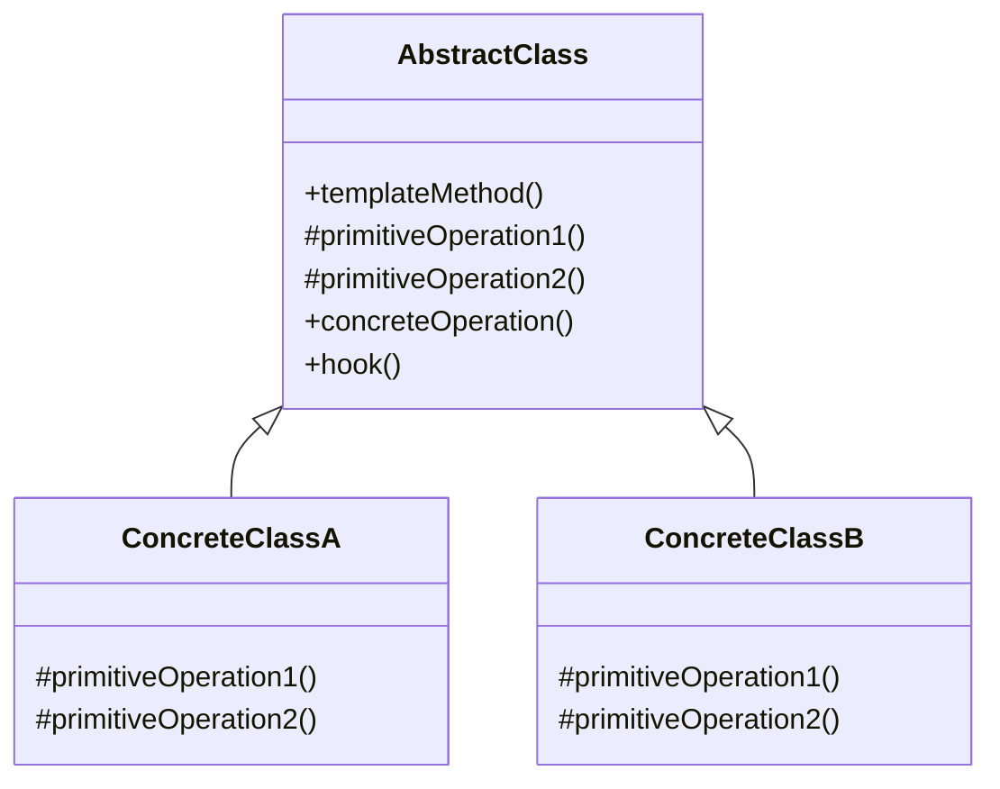

# Template Method Pattern - Algorithm Skeleton Definition

In software development, we often have algorithms with the same overall structure but different implementations for specific steps.

**Example:** Data processing pipelines, framework initialization, testing workflows, cooking recipes, etc.

Duplicating the algorithm structure across multiple classes leads to code duplication and maintenance issues.

This is where the **Template Method Design Pattern** comes into play.

## What is Template Method Pattern?

Template Method Pattern is a behavioral design pattern that defines the skeleton of an algorithm in a base class and lets subclasses override specific steps without changing the algorithm's structure.

It uses inheritance to let subclasses customize certain steps while keeping the overall algorithm structure intact.

## Class Diagram



## Implementation

### 1. Data Processing Pipeline

```java
// Abstract template class
abstract class DataProcessor {

    // Template method - defines the algorithm skeleton
    public final void processData() {
        validateInput();
        loadData();
        processCore();
        saveResults();
        cleanup();
    }

    // Common implementation
    private void validateInput() {
        System.out.println("Validating input data...");
    }

    // Abstract methods - must be implemented by subclasses
    protected abstract void loadData();
    protected abstract void processCore();
    protected abstract void saveResults();

    // Hook method - can be overridden by subclasses
    protected void cleanup() {
        System.out.println("Default cleanup completed");
    }
}

// Concrete implementations
class CSVProcessor extends DataProcessor {
    @Override
    protected void loadData() {
        System.out.println("Loading data from CSV file");
    }

    @Override
    protected void processCore() {
        System.out.println("Processing CSV data with custom logic");
    }

    @Override
    protected void saveResults() {
        System.out.println("Saving results to CSV file");
    }
}

class JSONProcessor extends DataProcessor {
    @Override
    protected void loadData() {
        System.out.println("Loading data from JSON file");
    }

    @Override
    protected void processCore() {
        System.out.println("Processing JSON data with transformation");
    }

    @Override
    protected void saveResults() {
        System.out.println("Saving results to database");
    }

    @Override
    protected void cleanup() {
        System.out.println("Closing database connections");
        super.cleanup();
    }
}

// Usage
class DataProcessingExample {
    public static void main(String[] args) {
        DataProcessor csvProcessor = new CSVProcessor();
        csvProcessor.processData();

        System.out.println();

        DataProcessor jsonProcessor = new JSONProcessor();
        jsonProcessor.processData();
    }
}
```

### 2. Game Development - Character Creation

```java
// Abstract character creation template
abstract class CharacterCreator {

    // Template method
    public final Character createCharacter(String name) {
        Character character = new Character(name);

        setBasicAttributes(character);
        setSpecialAbilities(character);
        setEquipment(character);

        if (shouldAddBonus()) {
            addStarterBonus(character);
        }

        finalizeCharacter(character);
        return character;
    }

    // Common method
    private void setBasicAttributes(Character character) {
        character.setHealth(100);
        character.setMana(50);
        System.out.println("Basic attributes set for " + character.getName());
    }

    // Abstract methods
    protected abstract void setSpecialAbilities(Character character);
    protected abstract void setEquipment(Character character);

    // Hook methods
    protected boolean shouldAddBonus() {
        return true; // Default implementation
    }

    protected void addStarterBonus(Character character) {
        character.addExperience(10);
        System.out.println("Starter bonus added");
    }

    protected void finalizeCharacter(Character character) {
        System.out.println("Character " + character.getName() + " created successfully");
    }
}

// Character class
class Character {
    private String name;
    private int health;
    private int mana;
    private int experience;
    private List<String> abilities = new ArrayList<>();
    private List<String> equipment = new ArrayList<>();

    public Character(String name) {
        this.name = name;
    }

    // Getters and setters
    public String getName() { return name; }
    public void setHealth(int health) { this.health = health; }
    public void setMana(int mana) { this.mana = mana; }
    public void addExperience(int exp) { this.experience += exp; }
    public void addAbility(String ability) { abilities.add(ability); }
    public void addEquipment(String item) { equipment.add(item); }

    @Override
    public String toString() {
        return String.format("Character{name='%s', health=%d, mana=%d, exp=%d, abilities=%s, equipment=%s}",
                           name, health, mana, experience, abilities, equipment);
    }
}

// Concrete character creators
class WarriorCreator extends CharacterCreator {
    @Override
    protected void setSpecialAbilities(Character character) {
        character.addAbility("Sword Strike");
        character.addAbility("Shield Block");
        System.out.println("Warrior abilities set");
    }

    @Override
    protected void setEquipment(Character character) {
        character.addEquipment("Iron Sword");
        character.addEquipment("Leather Armor");
        character.addEquipment("Wooden Shield");
        System.out.println("Warrior equipment set");
    }
}

class MageCreator extends CharacterCreator {
    @Override
    protected void setSpecialAbilities(Character character) {
        character.addAbility("Fireball");
        character.addAbility("Heal");
        character.addAbility("Teleport");
        System.out.println("Mage abilities set");
    }

    @Override
    protected void setEquipment(Character character) {
        character.addEquipment("Magic Staff");
        character.addEquipment("Robe");
        character.addEquipment("Spell Book");
        System.out.println("Mage equipment set");
    }

    @Override
    protected void addStarterBonus(Character character) {
        character.addExperience(20); // Mages get more starting experience
        character.setMana(character.getMana() + 30);
        System.out.println("Mage starter bonus added");
    }
}

class RogueCreator extends CharacterCreator {
    @Override
    protected void setSpecialAbilities(Character character) {
        character.addAbility("Stealth");
        character.addAbility("Backstab");
        character.addAbility("Lockpicking");
        System.out.println("Rogue abilities set");
    }

    @Override
    protected void setEquipment(Character character) {
        character.addEquipment("Dagger");
        character.addEquipment("Leather Armor");
        character.addEquipment("Lockpicks");
        System.out.println("Rogue equipment set");
    }

    @Override
    protected boolean shouldAddBonus() {
        return false; // Rogues don't get starter bonus
    }
}
```

### 3. Testing Framework

```java
// Abstract test template
abstract class TestCase {

    // Template method
    public final void runTest() {
        setUp();
        try {
            executeTest();
            System.out.println("✓ Test passed: " + getTestName());
        } catch (AssertionError e) {
            System.out.println("✗ Test failed: " + getTestName() + " - " + e.getMessage());
        } catch (Exception e) {
            System.out.println("✗ Test error: " + getTestName() + " - " + e.getMessage());
        } finally {
            tearDown();
        }
    }

    // Hook methods with default implementations
    protected void setUp() {
        System.out.println("Setting up test: " + getTestName());
    }

    protected void tearDown() {
        System.out.println("Tearing down test: " + getTestName());
    }

    // Abstract methods
    protected abstract void executeTest();
    protected abstract String getTestName();

    // Utility assertion methods
    protected void assertEquals(Object expected, Object actual) {
        if (!Objects.equals(expected, actual)) {
            throw new AssertionError("Expected: " + expected + ", but was: " + actual);
        }
    }

    protected void assertTrue(boolean condition) {
        if (!condition) {
            throw new AssertionError("Expected condition to be true");
        }
    }

    protected void assertNotNull(Object object) {
        if (object == null) {
            throw new AssertionError("Expected object to be not null");
        }
    }
}

// Concrete test cases
class DatabaseConnectionTest extends TestCase {
    private Database database;

    @Override
    protected void setUp() {
        super.setUp();
        database = new Database();
        database.connect();
    }

    @Override
    protected void executeTest() {
        assertTrue(database.isConnected());
        assertNotNull(database.getConnection());
    }

    @Override
    protected void tearDown() {
        if (database != null) {
            database.disconnect();
        }
        super.tearDown();
    }

    @Override
    protected String getTestName() {
        return "Database Connection Test";
    }
}

class CalculatorTest extends TestCase {
    private Calculator calculator;

    @Override
    protected void setUp() {
        super.setUp();
        calculator = new Calculator();
    }

    @Override
    protected void executeTest() {
        assertEquals(5, calculator.add(2, 3));
        assertEquals(1, calculator.subtract(3, 2));
        assertEquals(6, calculator.multiply(2, 3));
        assertEquals(2, calculator.divide(6, 3));
    }

    @Override
    protected String getTestName() {
        return "Calculator Test";
    }
}

// Mock classes for demonstration
class Database {
    private boolean connected = false;

    public void connect() {
        connected = true;
        System.out.println("Database connected");
    }

    public void disconnect() {
        connected = false;
        System.out.println("Database disconnected");
    }

    public boolean isConnected() {
        return connected;
    }

    public String getConnection() {
        return connected ? "mock-connection" : null;
    }
}

class Calculator {
    public int add(int a, int b) { return a + b; }
    public int subtract(int a, int b) { return a - b; }
    public int multiply(int a, int b) { return a * b; }
    public int divide(int a, int b) { return a / b; }
}
```

## Test Code

```java
import org.junit.jupiter.api.Test;
import static org.junit.jupiter.api.Assertions.*;

class TemplateMethodPatternTest {

    @Test
    void testDataProcessors() {
        // Test CSV processor
        DataProcessor csvProcessor = new CSVProcessor();
        assertDoesNotThrow(() -> csvProcessor.processData());

        // Test JSON processor
        DataProcessor jsonProcessor = new JSONProcessor();
        assertDoesNotThrow(() -> jsonProcessor.processData());
    }

    @Test
    void testCharacterCreation() {
        CharacterCreator warriorCreator = new WarriorCreator();
        Character warrior = warriorCreator.createCharacter("Conan");

        assertNotNull(warrior);
        assertEquals("Conan", warrior.getName());
        assertTrue(warrior.toString().contains("Sword Strike"));
        assertTrue(warrior.toString().contains("Iron Sword"));

        CharacterCreator mageCreator = new MageCreator();
        Character mage = mageCreator.createCharacter("Gandalf");

        assertNotNull(mage);
        assertEquals("Gandalf", mage.getName());
        assertTrue(mage.toString().contains("Fireball"));
        assertTrue(mage.toString().contains("Magic Staff"));
    }

    @Test
    void testRogueSpecialBehavior() {
        CharacterCreator rogueCreator = new RogueCreator();
        Character rogue = rogueCreator.createCharacter("Assassin");

        assertNotNull(rogue);
        // Rogues don't get starter bonus, so experience should be 0
        assertTrue(rogue.toString().contains("exp=0"));
    }

    @Test
    void testTestFramework() {
        // This would normally be run by a test runner
        TestCase dbTest = new DatabaseConnectionTest();
        assertDoesNotThrow(() -> dbTest.runTest());

        TestCase calcTest = new CalculatorTest();
        assertDoesNotThrow(() -> calcTest.runTest());
    }
}
```

## Real-World Examples

### 1. **Framework Development**

- **Spring Framework**: ApplicationContext initialization
- **JUnit**: Test execution lifecycle
- **Servlet**: HTTP request processing
- **Android Activities**: Activity lifecycle methods

### 2. **Data Processing**

- **ETL Pipelines**: Extract, Transform, Load operations
- **Report Generation**: Template-based report creation
- **Batch Processing**: Job execution frameworks
- **Stream Processing**: Data pipeline templates

### 3. **Game Development**

- **Game Loops**: Render, update, input handling
- **AI Behavior**: Decision-making algorithms
- **Level Generation**: Procedural content creation
- **Character Progression**: Leveling up systems

### 4. **Enterprise Applications**

- **Workflow Engines**: Business process templates
- **Authentication**: Login process flows
- **Transaction Processing**: Financial transaction templates
- **Audit Logging**: Compliance and tracking

## Pros and Cons

| **Pros**                                                                  | **Cons**                                                         |
| ------------------------------------------------------------------------- | ---------------------------------------------------------------- |
| ✅ **Code Reuse**: Common algorithm structure shared                      | ❌ **Inheritance Coupling**: Tight coupling through inheritance  |
| ✅ **Consistent Interface**: Uniform way to execute algorithms            | ❌ **Limited Flexibility**: Hard to change algorithm structure   |
| ✅ **Easy to Extend**: New implementations by subclassing                 | ❌ **Liskov Substitution**: Must maintain behavioral contracts   |
| ✅ **Open/Closed Principle**: Open for extension, closed for modification | ❌ **Class Hierarchy**: Can lead to deep inheritance hierarchies |

## Best Practices

### ⚠️ **Warnings & Considerations**

1. **Don't Override Template Method**: Make it final to prevent modification
2. **Minimal Abstract Methods**: Keep the number of abstract methods small
3. **Clear Documentation**: Document the contract and expected behavior
4. **Hook Methods**: Use hooks for optional steps, not required ones
5. **Inheritance vs Composition**: Consider Strategy pattern for more flexibility

### 💡 **When to Use Template Method Pattern**

✅ **Use When:**

- Multiple classes have similar algorithms with different implementations
- You want to control the algorithm structure centrally
- Code duplication exists in similar algorithms
- You're building frameworks or libraries

❌ **Avoid When:**

- Algorithm structure varies significantly
- You need runtime algorithm switching
- Composition would be more appropriate
- Inheritance hierarchies would become too complex

The Template Method pattern is essential for framework development and scenarios where you need to maintain consistent algorithm structure while allowing customization of specific steps.
