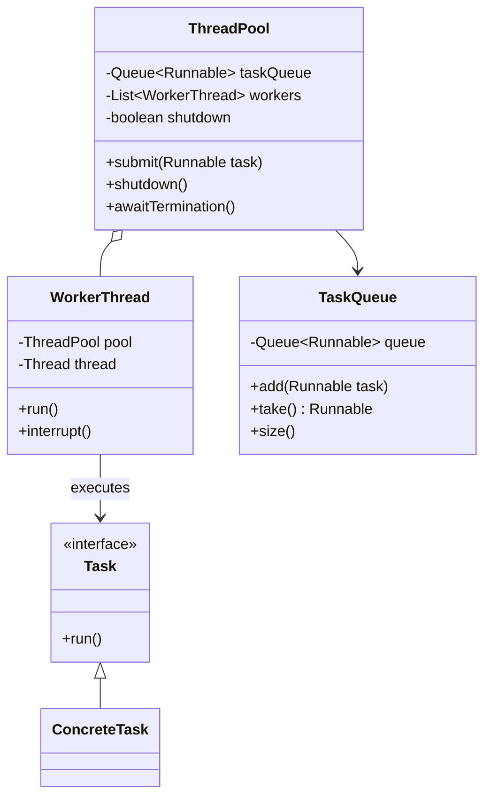

# Thread Pool Pattern - Managing Worker Threads Efficiently

In concurrent programming, we often need to execute multiple tasks simultaneously while managing system resources efficiently and avoiding the overhead of constantly creating and destroying threads.

**Example:** Web server request handling, batch processing, parallel computation, background task processing, etc.

Creating a new thread for each task leads to high memory overhead, poor performance, and potential resource exhaustion.

This is where the **Thread Pool Design Pattern** comes into play.

It's a fundamental concurrency pattern that manages worker threads efficiently and is essential for scalable multi-threaded applications.

## What is Thread Pool Pattern?

Thread Pool Pattern is a concurrency design pattern that maintains a pool of pre-created worker threads that can be reused to execute multiple tasks. Instead of creating new threads for each task, tasks are queued and executed by available worker threads.

It promotes efficient resource utilization by reusing threads and controlling the maximum number of concurrent executions.

The pattern follows the principle of separating task creation from task execution, providing better control over system resources.

## Class Diagram



## Implementation

### 1. Basic Thread Pool Implementation

```java
import java.util.concurrent.*;
import java.util.concurrent.atomic.*;
import java.util.*;

// Basic Thread Pool Implementation
class SimpleThreadPool {
    private final BlockingQueue<Runnable> taskQueue;
    private final List<WorkerThread> workers;
    private volatile boolean shutdown = false;
    private final int poolSize;
    private final AtomicInteger activeThreads = new AtomicInteger(0);

    public SimpleThreadPool(int poolSize) {
        this.poolSize = poolSize;
        this.taskQueue = new LinkedBlockingQueue<>();
        this.workers = new ArrayList<>(poolSize);

        // Create and start worker threads
        for (int i = 0; i < poolSize; i++) {
            WorkerThread worker = new WorkerThread("Worker-" + i);
            workers.add(worker);
            worker.start();
        }

        System.out.println("ThreadPool initialized with " + poolSize + " threads");
    }

    public void submit(Runnable task) {
        if (shutdown) {
            throw new IllegalStateException("ThreadPool is shutdown");
        }

        try {
            taskQueue.put(task);
            System.out.println("Task submitted. Queue size: " + taskQueue.size());
        } catch (InterruptedException e) {
            Thread.currentThread().interrupt();
            throw new RuntimeException("Failed to submit task", e);
        }
    }

    public <T> Future<T> submit(Callable<T> task) {
        if (shutdown) {
            throw new IllegalStateException("ThreadPool is shutdown");
        }

        CompletableFuture<T> future = new CompletableFuture<>();

        submit(() -> {
            try {
                T result = task.call();
                future.complete(result);
            } catch (Exception e) {
                future.completeExceptionally(e);
            }
        });

        return future;
    }

    public void shutdown() {
        shutdown = true;
        System.out.println("ThreadPool shutdown initiated");

        // Interrupt all worker threads
        for (WorkerThread worker : workers) {
            worker.interrupt();
        }
    }

    public boolean awaitTermination(long timeout, TimeUnit unit) throws InterruptedException {
        long deadline = System.currentTimeMillis() + unit.toMillis(timeout);

        for (WorkerThread worker : workers) {
            long remaining = deadline - System.currentTimeMillis();
            if (remaining <= 0) {
                return false;
            }
            worker.join(remaining);
            if (worker.isAlive()) {
                return false;
            }
        }

        System.out.println("ThreadPool terminated successfully");
        return true;
    }

    // Statistics
    public int getPoolSize() {
        return poolSize;
    }

    public int getActiveThreads() {
        return activeThreads.get();
    }

    public int getQueueSize() {
        return taskQueue.size();
    }

    public boolean isShutdown() {
        return shutdown;
    }

    // Worker Thread Implementation
    private class WorkerThread extends Thread {
        public WorkerThread(String name) {
            super(name);
        }

        @Override
        public void run() {
            System.out.println(getName() + " started");

            while (!shutdown && !Thread.currentThread().isInterrupted()) {
                try {
                    Runnable task = taskQueue.take(); // Blocks until task available
                    activeThreads.incrementAndGet();

                    try {
                        System.out.println(getName() + " executing task");
                        task.run();
                    } catch (Exception e) {
                        System.err.println(getName() + " task execution failed: " + e.getMessage());
                    } finally {
                        activeThreads.decrementAndGet();
                    }

                } catch (InterruptedException e) {
                    Thread.currentThread().interrupt();
                    break;
                }
            }

            System.out.println(getName() + " terminated");
        }
    }
}

// Enhanced Thread Pool with different policies
class EnhancedThreadPool {
    public enum RejectionPolicy {
        ABORT,           // Throw exception
        DISCARD,         // Silently discard
        DISCARD_OLDEST,  // Discard oldest task
        CALLER_RUNS      // Execute in caller thread
    }

    private final BlockingQueue<Runnable> taskQueue;
    private final List<WorkerThread> workers;
    private volatile boolean shutdown = false;
    private final int corePoolSize;
    private final int maximumPoolSize;
    private final long keepAliveTime;
    private final RejectionPolicy rejectionPolicy;
    private final AtomicInteger activeThreads = new AtomicInteger(0);
    private final AtomicLong completedTasks = new AtomicLong(0);
    private final AtomicLong submittedTasks = new AtomicLong(0);

    public EnhancedThreadPool(int corePoolSize, int maximumPoolSize,
                             long keepAliveTime, int queueCapacity,
                             RejectionPolicy rejectionPolicy) {
        this.corePoolSize = corePoolSize;
        this.maximumPoolSize = maximumPoolSize;
        this.keepAliveTime = keepAliveTime;
        this.rejectionPolicy = rejectionPolicy;
        this.taskQueue = new ArrayBlockingQueue<>(queueCapacity);
        this.workers = new ArrayList<>(maximumPoolSize);

        // Create core threads
        for (int i = 0; i < corePoolSize; i++) {
            WorkerThread worker = new WorkerThread("Core-Worker-" + i, true);
            workers.add(worker);
            worker.start();
        }

        System.out.println("EnhancedThreadPool initialized: core=" + corePoolSize +
                          ", max=" + maximumPoolSize + ", policy=" + rejectionPolicy);
    }

    public void submit(Runnable task) {
        if (shutdown) {
            throw new IllegalStateException("ThreadPool is shutdown");
        }

        submittedTasks.incrementAndGet();

        // Try to add to queue
        if (taskQueue.offer(task)) {
            // Task added to queue successfully
            ensureWorkerCapacity();
            return;
        }

        // Queue is full, apply rejection policy
        handleRejection(task);
    }

    private void ensureWorkerCapacity() {
        // Create additional workers if needed and allowed
        if (workers.size() < maximumPoolSize && !taskQueue.isEmpty()) {
            synchronized (workers) {
                if (workers.size() < maximumPoolSize) {
                    WorkerThread worker = new WorkerThread("Extra-Worker-" + workers.size(), false);
                    workers.add(worker);
                    worker.start();
                    System.out.println("Created additional worker. Pool size: " + workers.size());
                }
            }
        }
    }

    private void handleRejection(Runnable task) {
        switch (rejectionPolicy) {
            case ABORT:
                throw new RuntimeException("Task rejected: queue is full");
            case DISCARD:
                System.out.println("Task discarded due to full queue");
                break;
            case DISCARD_OLDEST:
                Runnable discarded = taskQueue.poll();
                if (discarded != null) {
                    System.out.println("Discarded oldest task");
                }
                taskQueue.offer(task);
                break;
            case CALLER_RUNS:
                System.out.println("Executing task in caller thread");
                task.run();
                break;
        }
    }

    public void shutdown() {
        shutdown = true;
        System.out.println("EnhancedThreadPool shutdown initiated");

        synchronized (workers) {
            for (WorkerThread worker : workers) {
                worker.interrupt();
            }
        }
    }

    public ThreadPoolStatistics getStatistics() {
        return new ThreadPoolStatistics(
            workers.size(),
            activeThreads.get(),
            taskQueue.size(),
            completedTasks.get(),
            submittedTasks.get()
        );
    }

    // Enhanced Worker Thread
    private class WorkerThread extends Thread {
        private final boolean isCoreThread;
        private long lastTaskTime = System.currentTimeMillis();

        public WorkerThread(String name, boolean isCoreThread) {
            super(name);
            this.isCoreThread = isCoreThread;
        }

        @Override
        public void run() {
            System.out.println(getName() + " started (core=" + isCoreThread + ")");

            while (!shutdown && !Thread.currentThread().isInterrupted()) {
                try {
                    Runnable task;

                    if (isCoreThread) {
                        task = taskQueue.take(); // Core threads wait indefinitely
                    } else {
                        task = taskQueue.poll(keepAliveTime, TimeUnit.MILLISECONDS);
                        if (task == null) {
                            // Non-core thread timed out
                            if (shouldTerminate()) {
                                break;
                            }
                            continue;
                        }
                    }

                    lastTaskTime = System.currentTimeMillis();
                    activeThreads.incrementAndGet();

                    try {
                        task.run();
                        completedTasks.incrementAndGet();
                    } catch (Exception e) {
                        System.err.println(getName() + " task execution failed: " + e.getMessage());
                    } finally {
                        activeThreads.decrementAndGet();
                    }

                } catch (InterruptedException e) {
                    Thread.currentThread().interrupt();
                    break;
                }
            }

            // Remove from workers list
            synchronized (workers) {
                workers.remove(this);
            }

            System.out.println(getName() + " terminated. Pool size: " + workers.size());
        }

        private boolean shouldTerminate() {
            // Non-core threads can terminate if idle too long
            return !isCoreThread && workers.size() > corePoolSize;
        }
    }
}

// Thread Pool Statistics
class ThreadPoolStatistics {
    private final int poolSize;
    private final int activeThreads;
    private final int queueSize;
    private final long completedTasks;
    private final long submittedTasks;
    private final long timestamp;

    public ThreadPoolStatistics(int poolSize, int activeThreads, int queueSize,
                               long completedTasks, long submittedTasks) {
        this.poolSize = poolSize;
        this.activeThreads = activeThreads;
        this.queueSize = queueSize;
        this.completedTasks = completedTasks;
        this.submittedTasks = submittedTasks;
        this.timestamp = System.currentTimeMillis();
    }

    public double getCompletionRate() {
        return submittedTasks > 0 ? (double) completedTasks / submittedTasks * 100.0 : 0.0;
    }

    public double getUtilization() {
        return poolSize > 0 ? (double) activeThreads / poolSize * 100.0 : 0.0;
    }

    @Override
    public String toString() {
        return String.format(
            "ThreadPoolStats[poolSize=%d, active=%d, queued=%d, completed=%d/%d (%.1f%%), utilization=%.1f%%]",
            poolSize, activeThreads, queueSize, completedTasks, submittedTasks,
            getCompletionRate(), getUtilization()
        );
    }

    // Getters
    public int getPoolSize() { return poolSize; }
    public int getActiveThreads() { return activeThreads; }
    public int getQueueSize() { return queueSize; }
    public long getCompletedTasks() { return completedTasks; }
    public long getSubmittedTasks() { return submittedTasks; }
    public long getTimestamp() { return timestamp; }
}

// Different types of tasks for demonstration
abstract class Task implements Runnable {
    protected final String taskId;
    protected final long creationTime;

    public Task(String taskId) {
        this.taskId = taskId;
        this.creationTime = System.currentTimeMillis();
    }

    public String getTaskId() { return taskId; }
    public long getCreationTime() { return creationTime; }
    public long getWaitTime() { return System.currentTimeMillis() - creationTime; }
}

class CPUIntensiveTask extends Task {
    private final int iterations;

    public CPUIntensiveTask(String taskId, int iterations) {
        super(taskId);
        this.iterations = iterations;
    }

    @Override
    public void run() {
        long start = System.currentTimeMillis();
        System.out.println("Starting CPU task " + taskId + " (waited " + getWaitTime() + "ms)");

        // Simulate CPU-intensive work
        long sum = 0;
        for (int i = 0; i < iterations; i++) {
            sum += Math.sqrt(i) * Math.sin(i);
        }

        long duration = System.currentTimeMillis() - start;
        System.out.println("Completed CPU task " + taskId + " in " + duration + "ms (result=" + sum + ")");
    }
}

class IOIntensiveTask extends Task {
    private final int sleepTime;

    public IOIntensiveTask(String taskId, int sleepTime) {
        super(taskId);
        this.sleepTime = sleepTime;
    }

    @Override
    public void run() {
        long start = System.currentTimeMillis();
        System.out.println("Starting IO task " + taskId + " (waited " + getWaitTime() + "ms)");

        try {
            // Simulate I/O operation
            Thread.sleep(sleepTime);

            long duration = System.currentTimeMillis() - start;
            System.out.println("Completed IO task " + taskId + " in " + duration + "ms");
        } catch (InterruptedException e) {
            Thread.currentThread().interrupt();
            System.out.println("IO task " + taskId + " was interrupted");
        }
    }
}

class BatchTask extends Task {
    private final List<String> items;

    public BatchTask(String taskId, List<String> items) {
        super(taskId);
        this.items = new ArrayList<>(items);
    }

    @Override
    public void run() {
        long start = System.currentTimeMillis();
        System.out.println("Starting batch task " + taskId + " with " + items.size() + " items");

        for (String item : items) {
            // Simulate processing each item
            try {
                Thread.sleep(10); // Small delay per item
            } catch (InterruptedException e) {
                Thread.currentThread().interrupt();
                break;
            }
        }

        long duration = System.currentTimeMillis() - start;
        System.out.println("Completed batch task " + taskId + " in " + duration + "ms");
    }
}

// Thread Pool Manager for different workload types
class ThreadPoolManager {
    private final Map<String, EnhancedThreadPool> threadPools = new HashMap<>();

    public ThreadPoolManager() {
        // Create specialized thread pools
        createThreadPools();
    }

    private void createThreadPools() {
        // CPU-intensive task pool
        threadPools.put("cpu", new EnhancedThreadPool(
            Runtime.getRuntime().availableProcessors(), // Core threads = CPU cores
            Runtime.getRuntime().availableProcessors() * 2, // Max threads
            60000, // 1 minute keep-alive
            50,    // Queue capacity
            EnhancedThreadPool.RejectionPolicy.CALLER_RUNS
        ));

        // I/O-intensive task pool
        threadPools.put("io", new EnhancedThreadPool(
            10,  // More core threads for I/O
            50,  // Much higher max for I/O
            30000, // 30 seconds keep-alive
            200,   // Larger queue
            EnhancedThreadPool.RejectionPolicy.DISCARD_OLDEST
        ));

        // Batch processing pool
        threadPools.put("batch", new EnhancedThreadPool(
            2,   // Few core threads
            5,   // Limited max threads
            120000, // 2 minutes keep-alive
            1000,   // Large queue for batches
            EnhancedThreadPool.RejectionPolicy.ABORT
        ));

        System.out.println("ThreadPoolManager initialized with " + threadPools.size() + " pools");
    }

    public void submitCPUTask(CPUIntensiveTask task) {
        threadPools.get("cpu").submit(task);
    }

    public void submitIOTask(IOIntensiveTask task) {
        threadPools.get("io").submit(task);
    }

    public void submitBatchTask(BatchTask task) {
        threadPools.get("batch").submit(task);
    }

    public void printStatistics() {
        System.out.println("\n=== Thread Pool Statistics ===");
        threadPools.forEach((name, pool) -> {
            ThreadPoolStatistics stats = pool.getStatistics();
            System.out.println(name.toUpperCase() + " Pool: " + stats);
        });
    }

    public void shutdown() {
        System.out.println("Shutting down all thread pools...");
        threadPools.values().forEach(EnhancedThreadPool::shutdown);
    }

    public void awaitTermination(long timeout, TimeUnit unit) throws InterruptedException {
        long deadline = System.currentTimeMillis() + unit.toMillis(timeout);

        for (Map.Entry<String, EnhancedThreadPool> entry : threadPools.entrySet()) {
            long remaining = deadline - System.currentTimeMillis();
            if (remaining > 0) {
                // Note: In real implementation, EnhancedThreadPool would have awaitTermination
                Thread.sleep(Math.min(remaining, 1000));
            }
        }
    }
}

// Usage Examples
class ThreadPoolExample {
    public static void main(String[] args) throws InterruptedException {
        System.out.println("=== Thread Pool Pattern Example ===");

        // Test basic thread pool
        testBasicThreadPool();

        Thread.sleep(2000);

        // Test enhanced thread pool manager
        testThreadPoolManager();
    }

    private static void testBasicThreadPool() throws InterruptedException {
        System.out.println("\n=== Basic Thread Pool Test ===");

        SimpleThreadPool threadPool = new SimpleThreadPool(3);

        // Submit various tasks
        for (int i = 1; i <= 8; i++) {
            final int taskId = i;
            threadPool.submit(() -> {
                try {
                    System.out.println("Task " + taskId + " executing in " + Thread.currentThread().getName());
                    Thread.sleep(1000); // Simulate work
                    System.out.println("Task " + taskId + " completed");
                } catch (InterruptedException e) {
                    Thread.currentThread().interrupt();
                }
            });
        }

        // Test callable submission
        Future<String> future = threadPool.submit(() -> {
            Thread.sleep(500);
            return "Callable result from " + Thread.currentThread().getName();
        });

        try {
            String result = future.get(2, TimeUnit.SECONDS);
            System.out.println("Future result: " + result);
        } catch (Exception e) {
            System.err.println("Future failed: " + e.getMessage());
        }

        Thread.sleep(3000); // Let tasks complete

        System.out.println("Basic ThreadPool stats: active=" + threadPool.getActiveThreads() +
                          ", queue=" + threadPool.getQueueSize());

        threadPool.shutdown();
        threadPool.awaitTermination(5, TimeUnit.SECONDS);
    }

    private static void testThreadPoolManager() throws InterruptedException {
        System.out.println("\n=== Thread Pool Manager Test ===");

        ThreadPoolManager manager = new ThreadPoolManager();

        // Submit different types of tasks
        System.out.println("Submitting mixed workload...");

        // CPU-intensive tasks
        for (int i = 1; i <= 5; i++) {
            manager.submitCPUTask(new CPUIntensiveTask("CPU-" + i, 1000000));
        }

        // I/O-intensive tasks
        for (int i = 1; i <= 10; i++) {
            manager.submitIOTask(new IOIntensiveTask("IO-" + i, 500));
        }

        // Batch tasks
        for (int i = 1; i <= 3; i++) {
            List<String> items = new ArrayList<>();
            for (int j = 1; j <= 20; j++) {
                items.add("Item-" + j);
            }
            manager.submitBatchTask(new BatchTask("BATCH-" + i, items));
        }

        // Monitor progress
        for (int i = 0; i < 5; i++) {
            Thread.sleep(2000);
            manager.printStatistics();
        }

        manager.shutdown();
        manager.awaitTermination(10, TimeUnit.SECONDS);

        System.out.println("All thread pools terminated");
    }
}
```

### 2. Specialized Thread Pools

```java
// Work-stealing thread pool implementation
class WorkStealingThreadPool {
    private final int parallelism;
    private final List<WorkStealingThread> workers;
    private final Random random = new Random();
    private volatile boolean shutdown = false;

    public WorkStealingThreadPool(int parallelism) {
        this.parallelism = parallelism;
        this.workers = new ArrayList<>(parallelism);

        // Create worker threads with individual queues
        for (int i = 0; i < parallelism; i++) {
            WorkStealingThread worker = new WorkStealingThread("WorkStealer-" + i, this);
            workers.add(worker);
            worker.start();
        }

        System.out.println("WorkStealingThreadPool created with " + parallelism + " workers");
    }

    public void submit(Runnable task) {
        if (shutdown) {
            throw new IllegalStateException("Pool is shutdown");
        }

        // Submit to a random worker's queue
        WorkStealingThread randomWorker = workers.get(random.nextInt(workers.size()));
        randomWorker.addTask(task);
    }

    public void submit(ForkJoinTask task) {
        if (shutdown) {
            throw new IllegalStateException("Pool is shutdown");
        }

        WorkStealingThread randomWorker = workers.get(random.nextInt(workers.size()));
        randomWorker.addTask(task);
    }

    // Work stealing logic
    Runnable stealTask(WorkStealingThread thief) {
        for (WorkStealingThread victim : workers) {
            if (victim != thief) {
                Runnable stolen = victim.stealTask();
                if (stolen != null) {
                    System.out.println(thief.getName() + " stole task from " + victim.getName());
                    return stolen;
                }
            }
        }
        return null;
    }

    public void shutdown() {
        shutdown = true;
        workers.forEach(Thread::interrupt);
    }

    private static class WorkStealingThread extends Thread {
        private final Deque<Runnable> taskQueue = new ArrayDeque<>();
        private final WorkStealingThreadPool pool;

        public WorkStealingThread(String name, WorkStealingThreadPool pool) {
            super(name);
            this.pool = pool;
        }

        public void addTask(Runnable task) {
            synchronized (taskQueue) {
                taskQueue.addFirst(task); // Add to front (LIFO for own tasks)
                taskQueue.notify();
            }
        }

        public Runnable stealTask() {
            synchronized (taskQueue) {
                return taskQueue.pollLast(); // Steal from back (FIFO for stolen tasks)
            }
        }

        @Override
        public void run() {
            while (!pool.shutdown && !Thread.currentThread().isInterrupted()) {
                Runnable task = getNextTask();

                if (task != null) {
                    try {
                        task.run();
                    } catch (Exception e) {
                        System.err.println(getName() + " task failed: " + e.getMessage());
                    }
                } else {
                    // No local task, try to steal
                    task = pool.stealTask(this);
                    if (task != null) {
                        try {
                            task.run();
                        } catch (Exception e) {
                            System.err.println(getName() + " stolen task failed: " + e.getMessage());
                        }
                    } else {
                        // No work available, wait briefly
                        try {
                            synchronized (taskQueue) {
                                taskQueue.wait(100);
                            }
                        } catch (InterruptedException e) {
                            Thread.currentThread().interrupt();
                            break;
                        }
                    }
                }
            }
            System.out.println(getName() + " terminated");
        }

        private Runnable getNextTask() {
            synchronized (taskQueue) {
                return taskQueue.pollFirst();
            }
        }
    }
}

// Fork-Join task for recursive algorithms
abstract class ForkJoinTask implements Runnable {
    private final int threshold;

    public ForkJoinTask(int threshold) {
        this.threshold = threshold;
    }

    protected abstract void compute();
    protected abstract boolean shouldFork();
    protected abstract ForkJoinTask[] fork();
    protected abstract void join(ForkJoinTask[] subtasks);

    @Override
    public void run() {
        if (shouldFork()) {
            ForkJoinTask[] subtasks = fork();

            // Execute subtasks
            for (ForkJoinTask subtask : subtasks) {
                subtask.run();
            }

            join(subtasks);
        } else {
            compute();
        }
    }

    protected int getThreshold() {
        return threshold;
    }
}

// Example: Parallel sum calculation
class ParallelSumTask extends ForkJoinTask {
    private final int[] array;
    private final int start;
    private final int end;
    private int result = 0;

    public ParallelSumTask(int[] array, int start, int end, int threshold) {
        super(threshold);
        this.array = array;
        this.start = start;
        this.end = end;
    }

    @Override
    protected void compute() {
        int sum = 0;
        for (int i = start; i < end; i++) {
            sum += array[i];
        }
        this.result = sum;
        System.out.println("Computed sum[" + start + ".." + end + "] = " + sum +
                          " in " + Thread.currentThread().getName());
    }

    @Override
    protected boolean shouldFork() {
        return (end - start) > getThreshold();
    }

    @Override
    protected ForkJoinTask[] fork() {
        int mid = start + (end - start) / 2;
        return new ForkJoinTask[] {
            new ParallelSumTask(array, start, mid, getThreshold()),
            new ParallelSumTask(array, mid, end, getThreshold())
        };
    }

    @Override
    protected void join(ForkJoinTask[] subtasks) {
        this.result = 0;
        for (ForkJoinTask subtask : subtasks) {
            this.result += ((ParallelSumTask) subtask).getResult();
        }
        System.out.println("Joined results for range[" + start + ".." + end + "] = " + result +
                          " in " + Thread.currentThread().getName());
    }

    public int getResult() {
        return result;
    }
}

// Priority Thread Pool
class PriorityThreadPool {
    private final PriorityBlockingQueue<PriorityTask> taskQueue;
    private final List<Thread> workers;
    private volatile boolean shutdown = false;

    public PriorityThreadPool(int poolSize) {
        this.taskQueue = new PriorityBlockingQueue<>();
        this.workers = new ArrayList<>(poolSize);

        for (int i = 0; i < poolSize; i++) {
            Thread worker = new Thread(new PriorityWorker(), "Priority-Worker-" + i);
            workers.add(worker);
            worker.start();
        }

        System.out.println("PriorityThreadPool created with " + poolSize + " workers");
    }

    public void submit(Runnable task, int priority) {
        if (shutdown) {
            throw new IllegalStateException("Pool is shutdown");
        }

        taskQueue.offer(new PriorityTask(task, priority));
    }

    public void shutdown() {
        shutdown = true;
        workers.forEach(Thread::interrupt);
    }

    private static class PriorityTask implements Comparable<PriorityTask> {
        private final Runnable task;
        private final int priority;
        private final long submissionTime;

        public PriorityTask(Runnable task, int priority) {
            this.task = task;
            this.priority = priority;
            this.submissionTime = System.currentTimeMillis();
        }

        @Override
        public int compareTo(PriorityTask other) {
            // Higher priority first, then FIFO for same priority
            int priorityComparison = Integer.compare(other.priority, this.priority);
            if (priorityComparison == 0) {
                return Long.compare(this.submissionTime, other.submissionTime);
            }
            return priorityComparison;
        }

        public Runnable getTask() { return task; }
        public int getPriority() { return priority; }
    }

    private class PriorityWorker implements Runnable {
        @Override
        public void run() {
            while (!shutdown && !Thread.currentThread().isInterrupted()) {
                try {
                    PriorityTask priorityTask = taskQueue.take();
                    System.out.println(Thread.currentThread().getName() +
                                     " executing priority " + priorityTask.getPriority() + " task");
                    priorityTask.getTask().run();
                } catch (InterruptedException e) {
                    Thread.currentThread().interrupt();
                    break;
                } catch (Exception e) {
                    System.err.println(Thread.currentThread().getName() +
                                     " task execution failed: " + e.getMessage());
                }
            }
            System.out.println(Thread.currentThread().getName() + " terminated");
        }
    }
}

// Specialized Thread Pool Examples
class SpecializedThreadPoolExample {
    public static void main(String[] args) throws InterruptedException {
        System.out.println("=== Specialized Thread Pool Examples ===");

        // Test Work-Stealing Pool
        testWorkStealingPool();

        Thread.sleep(2000);

        // Test Priority Pool
        testPriorityPool();
    }

    private static void testWorkStealingPool() throws InterruptedException {
        System.out.println("\n=== Work-Stealing Thread Pool Test ===");

        WorkStealingThreadPool pool = new WorkStealingThreadPool(4);

        // Create a large array for parallel processing
        int[] array = new int[10000];
        for (int i = 0; i < array.length; i++) {
            array[i] = i + 1;
        }

        // Submit parallel sum task
        ParallelSumTask sumTask = new ParallelSumTask(array, 0, array.length, 1000);
        pool.submit(sumTask);

        // Submit regular tasks that create imbalanced workload
        for (int i = 0; i < 10; i++) {
            final int taskId = i;
            final int workAmount = (i % 3 == 0) ? 2000 : 100; // Uneven work distribution

            pool.submit(() -> {
                long start = System.currentTimeMillis();

                // Simulate varying amounts of work
                for (int j = 0; j < workAmount * 1000; j++) {
                    Math.sqrt(j);
                }

                long duration = System.currentTimeMillis() - start;
                System.out.println("Task " + taskId + " completed in " + duration + "ms by " +
                                 Thread.currentThread().getName());
            });
        }

        Thread.sleep(5000);

        System.out.println("Parallel sum result: " + sumTask.getResult());

        pool.shutdown();
    }

    private static void testPriorityPool() throws InterruptedException {
        System.out.println("\n=== Priority Thread Pool Test ===");

        PriorityThreadPool pool = new PriorityThreadPool(2);

        // Submit tasks with different priorities
        for (int i = 1; i <= 10; i++) {
            final int taskId = i;
            final int priority = (i % 3) + 1; // Priorities 1, 2, 3

            pool.submit(() -> {
                try {
                    Thread.sleep(500); // Simulate work
                    System.out.println("Completed task " + taskId + " (priority " + priority + ")");
                } catch (InterruptedException e) {
                    Thread.currentThread().interrupt();
                }
            }, priority);

            Thread.sleep(50); // Small delay between submissions
        }

        Thread.sleep(8000);
        pool.shutdown();
    }
}
```

## Test Code

```java
import org.junit.jupiter.api.Test;
import org.junit.jupiter.api.BeforeEach;
import static org.junit.jupiter.api.Assertions.*;

class ThreadPoolPatternTest {

    @Test
    void testSimpleThreadPool() throws InterruptedException {
        SimpleThreadPool pool = new SimpleThreadPool(3);

        assertEquals(3, pool.getPoolSize());
        assertEquals(0, pool.getActiveThreads());
        assertFalse(pool.isShutdown());

        // Submit tasks
        CountDownLatch latch = new CountDownLatch(5);
        for (int i = 0; i < 5; i++) {
            pool.submit(() -> {
                try {
                    Thread.sleep(100);
                } catch (InterruptedException e) {
                    Thread.currentThread().interrupt();
                } finally {
                    latch.countDown();
                }
            });
        }

        // Wait for tasks to complete
        assertTrue(latch.await(5, TimeUnit.SECONDS));

        pool.shutdown();
        assertTrue(pool.awaitTermination(2, TimeUnit.SECONDS));
        assertTrue(pool.isShutdown());
    }

    @Test
    void testCallableSubmission() throws Exception {
        SimpleThreadPool pool = new SimpleThreadPool(2);

        Future<String> future = pool.submit(() -> {
            Thread.sleep(100);
            return "Test Result";
        });

        String result = future.get(1, TimeUnit.SECONDS);
        assertEquals("Test Result", result);

        pool.shutdown();
        pool.awaitTermination(1, TimeUnit.SECONDS);
    }

    @Test
    void testEnhancedThreadPoolRejectionPolicies() {
        // Test ABORT policy
        EnhancedThreadPool abortPool = new EnhancedThreadPool(1, 1, 1000, 1,
                                        EnhancedThreadPool.RejectionPolicy.ABORT);

        // Fill pool and queue
        abortPool.submit(() -> {
            try { Thread.sleep(1000); } catch (InterruptedException e) {}
        });
        abortPool.submit(() -> {}); // This goes to queue

        // This should be rejected
        assertThrows(RuntimeException.class, () -> {
            abortPool.submit(() -> {});
        });

        abortPool.shutdown();
    }

    @Test
    void testThreadPoolStatistics() throws InterruptedException {
        EnhancedThreadPool pool = new EnhancedThreadPool(2, 4, 1000, 10,
                                   EnhancedThreadPool.RejectionPolicy.DISCARD);

        // Submit some tasks
        CountDownLatch latch = new CountDownLatch(5);
        for (int i = 0; i < 5; i++) {
            pool.submit(() -> {
                try {
                    Thread.sleep(200);
                } catch (InterruptedException e) {
                    Thread.currentThread().interrupt();
                } finally {
                    latch.countDown();
                }
            });
        }

        // Check statistics
        ThreadPoolStatistics stats = pool.getStatistics();
        assertTrue(stats.getSubmittedTasks() >= 5);
        assertTrue(stats.getPoolSize() >= 2);

        latch.await(5, TimeUnit.SECONDS);

        stats = pool.getStatistics();
        assertEquals(stats.getSubmittedTasks(), stats.getCompletedTasks());
        assertEquals(100.0, stats.getCompletionRate(), 0.1);

        pool.shutdown();
    }

    @Test
    void testWorkStealingThreadPool() throws InterruptedException {
        WorkStealingThreadPool pool = new WorkStealingThreadPool(2);

        CountDownLatch latch = new CountDownLatch(6);

        // Submit tasks that will create work imbalance
        for (int i = 0; i < 6; i++) {
            final int taskId = i;
            pool.submit(() -> {
                try {
                    // Vary work duration to create stealing opportunities
                    Thread.sleep(taskId % 2 == 0 ? 100 : 300);
                } catch (InterruptedException e) {
                    Thread.currentThread().interrupt();
                } finally {
                    latch.countDown();
                }
            });
        }

        assertTrue(latch.await(3, TimeUnit.SECONDS));
        pool.shutdown();
    }

    @Test
    void testPriorityThreadPool() throws InterruptedException {
        PriorityThreadPool pool = new PriorityThreadPool(1); // Single thread to test priority order

        List<Integer> executionOrder = Collections.synchronizedList(new ArrayList<>());
        CountDownLatch latch = new CountDownLatch(5);

        // Submit tasks with different priorities
        pool.submit(() -> { executionOrder.add(1); latch.countDown(); }, 1); // Low priority
        pool.submit(() -> { executionOrder.add(3); latch.countDown(); }, 3); // High priority
        pool.submit(() -> { executionOrder.add(2); latch.countDown(); }, 2); // Medium priority
        pool.submit(() -> { executionOrder.add(3); latch.countDown(); }, 3); // High priority
        pool.submit(() -> { executionOrder.add(1); latch.countDown(); }, 1); // Low priority

        assertTrue(latch.await(2, TimeUnit.SECONDS));

        // Verify priority order (high priority tasks should execute first)
        assertEquals(5, executionOrder.size());
        assertTrue(executionOrder.get(0) >= executionOrder.get(executionOrder.size() - 1));

        pool.shutdown();
    }

    @Test
    void testForkJoinTask() {
        int[] array = {1, 2, 3, 4, 5, 6, 7, 8, 9, 10};
        ParallelSumTask task = new ParallelSumTask(array, 0, array.length, 3);

        task.run();

        int expectedSum = Arrays.stream(array).sum();
        assertEquals(expectedSum, task.getResult());
    }

    @Test
    void testThreadPoolManager() throws InterruptedException {
        ThreadPoolManager manager = new ThreadPoolManager();

        CountDownLatch latch = new CountDownLatch(3);

        // Submit different types of tasks
        manager.submitCPUTask(new CPUIntensiveTask("TEST-CPU", 1000) {
            @Override
            public void run() {
                super.run();
                latch.countDown();
            }
        });

        manager.submitIOTask(new IOIntensiveTask("TEST-IO", 100) {
            @Override
            public void run() {
                super.run();
                latch.countDown();
            }
        });

        manager.submitBatchTask(new BatchTask("TEST-BATCH", Arrays.asList("A", "B", "C")) {
            @Override
            public void run() {
                super.run();
                latch.countDown();
            }
        });

        assertTrue(latch.await(5, TimeUnit.SECONDS));

        manager.shutdown();
    }

    @Test
    void testTaskTypes() throws InterruptedException {
        // Test different task types
        CountDownLatch latch = new CountDownLatch(3);

        CPUIntensiveTask cpuTask = new CPUIntensiveTask("CPU-TEST", 1000);
        IOIntensiveTask ioTask = new IOIntensiveTask("IO-TEST", 100);
        BatchTask batchTask = new BatchTask("BATCH-TEST", Arrays.asList("1", "2", "3"));

        // Execute tasks and verify they complete
        new Thread(() -> { cpuTask.run(); latch.countDown(); }).start();
        new Thread(() -> { ioTask.run(); latch.countDown(); }).start();
        new Thread(() -> { batchTask.run(); latch.countDown(); }).start();

        assertTrue(latch.await(3, TimeUnit.SECONDS));

        // Verify task properties
        assertEquals("CPU-TEST", cpuTask.getTaskId());
        assertEquals("IO-TEST", ioTask.getTaskId());
        assertEquals("BATCH-TEST", batchTask.getTaskId());
        assertTrue(cpuTask.getWaitTime() >= 0);
        assertTrue(ioTask.getWaitTime() >= 0);
        assertTrue(batchTask.getWaitTime() >= 0);
    }

    @Test
    void testShutdownBehavior() throws InterruptedException {
        SimpleThreadPool pool = new SimpleThreadPool(2);

        // Submit a long-running task
        pool.submit(() -> {
            try {
                Thread.sleep(5000);
            } catch (InterruptedException e) {
                Thread.currentThread().interrupt();
                System.out.println("Task interrupted during shutdown");
            }
        });

        // Shutdown immediately
        pool.shutdown();
        assertTrue(pool.isShutdown());

        // Verify that new task submission fails
        assertThrows(IllegalStateException.class, () -> {
            pool.submit(() -> {});
        });

        // Await termination
        assertTrue(pool.awaitTermination(2, TimeUnit.SECONDS));
    }
}
```

## Real-World Examples of Thread Pool Pattern

### 1. **Java Standard Library**

- **ExecutorService**: ThreadPoolExecutor, ForkJoinPool, ScheduledThreadPoolExecutor
- **Tomcat**: Web container thread pools for request handling
- **Netty**: NIO event loop thread pools for network operations
- **Spring**: Task execution and scheduling with thread pools

### 2. **Web Servers & Application Servers**

- **Apache HTTP Server**: Worker thread pools for request processing
- **Nginx**: Thread pools for blocking I/O operations
- **Jetty**: Thread pools for servlet request handling
- **Undertow**: XNIO worker thread pools

### 3. **Database Systems**

- **Connection Pools**: Database connection management
- **Query Execution**: Parallel query processing threads
- **Background Tasks**: Maintenance and cleanup operations
- **Replication**: Thread pools for data synchronization

### 4. **Messaging Systems**

- **Apache Kafka**: Thread pools for message processing
- **RabbitMQ**: Worker threads for message delivery
- **ActiveMQ**: Connection and session thread pools
- **Redis**: Thread pools for command processing

## Specific Examples:

**java.util.concurrent.ThreadPoolExecutor**: Core Java thread pool implementation.

**java.util.concurrent.ForkJoinPool**: Work-stealing thread pool for parallel tasks.

**org.springframework.scheduling.concurrent.ThreadPoolTaskExecutor**: Spring's thread pool abstraction.

**io.netty.util.concurrent.EventExecutorGroup**: Netty's event loop thread pools.

**org.apache.tomcat.util.threads.ThreadPoolExecutor**: Tomcat's request processing threads.

## Pros and Cons of Thread Pool Pattern

| **Pros**                                                              | **Cons**                                                                |
| --------------------------------------------------------------------- | ----------------------------------------------------------------------- |
| ✅ **Resource Efficiency**: Reuses threads, reduces creation overhead | ❌ **Memory Usage**: Pool threads consume memory even when idle         |
| ✅ **Performance**: Better throughput than creating threads per task  | ❌ **Complexity**: More complex than simple thread-per-task model       |
| ✅ **Resource Control**: Limits maximum number of concurrent threads  | ❌ **Configuration**: Requires careful tuning of pool parameters        |
| ✅ **Task Queuing**: Built-in task queue management                   | ❌ **Deadlock Risk**: Potential for deadlocks with interdependent tasks |
| ✅ **Scalability**: Handles varying workloads efficiently             | ❌ **Context Switching**: Overhead from task switching between threads  |

## Best Practices

### ⚠️ **Warnings & Considerations**

1. **Pool Sizing**: Size pools based on workload characteristics (CPU vs I/O bound)
2. **Queue Management**: Choose appropriate queue types and sizes
3. **Task Dependencies**: Avoid submitting interdependent tasks to same pool
4. **Exception Handling**: Properly handle task exceptions to prevent thread death
5. **Shutdown Procedures**: Implement graceful shutdown with proper cleanup

### 🏆 **Modern Alternatives & Enhancements**

- **Reactive Streams**: Non-blocking, event-driven processing (RxJava, Project Reactor)
- **Virtual Threads**: Lightweight threads in Java 19+ (Project Loom)
- **Actor Model**: Akka, Orleans for message-passing concurrency
- **Coroutines**: Kotlin coroutines for structured concurrency
- **Async/Await**: Language-level asynchronous programming support

### 💡 **When to Use Thread Pool Pattern**

✅ **Use When:**

- You have multiple independent tasks to execute
- Task creation rate exceeds what individual thread creation can handle
- You need to control resource usage and prevent resource exhaustion
- Tasks have similar execution characteristics
- You want to improve application responsiveness

❌ **Avoid When:**

- Tasks are highly interdependent and require complex coordination
- Task execution time varies dramatically (very short vs very long)
- Memory usage is more critical than performance
- You're building simple, single-threaded applications
- Tasks require specific thread-local state that can't be shared

The Thread Pool pattern is fundamental for building efficient, scalable concurrent applications that can handle high throughput while maintaining resource control and system stability.
