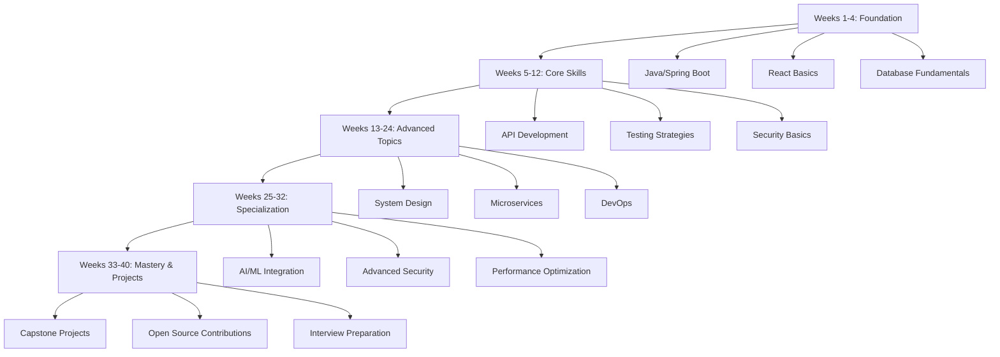

# 📚 SDE2+ Study Guides & Learning Paths

## 🎯 **Overview**

This directory contains comprehensive study guides with structured learning plans for mastering SDE2+ skills. Each guide provides detailed weekly plans, hands-on projects, assessment criteria, and resource mapping.

## 🗺️ **Learning Path Selection**

### **🔥 Quick Start Recommendations**

#### **For Backend Developers**

```
1. Java & Spring Boot Fundamentals (2 weeks)
2. Database Mastery (2 weeks)
3. API Design & Testing (4 weeks)
4. Security & Authentication (3 weeks)
5. System Design (3 weeks)
6. Microservices & DevOps (4 weeks)
```

**Total: 18 weeks** | **Target Role**: Senior Backend Developer

#### **For Frontend Developers**

```
1. React & TypeScript Mastery (3 weeks)
2. Advanced Frontend Architecture (4 weeks)
3. API Integration & Testing (2 weeks)
4. Security Implementation (2 weeks)
5. Performance Optimization (2 weeks)
6. Full-Stack Integration (3 weeks)
```

**Total: 16 weeks** | **Target Role**: Senior Frontend Developer

#### **For Full-Stack Developers**

```
1. Foundation Phase (4 weeks)
   - Java/Spring Boot + React basics
2. Intermediate Phase (8 weeks)
   - Advanced backend + frontend
3. Advanced Phase (8 weeks)
   - System design + security + AI/ML
4. Mastery Phase (4 weeks)
   - Capstone projects + interview prep
```

**Total: 24 weeks** | **Target Role**: Senior Full-Stack Developer

---

## 📖 **Available Study Guides**

### **🏗️ Backend Development Track**

| Guide                                                              | Duration | Difficulty            | Prerequisites              |
| ------------------------------------------------------------------ | -------- | --------------------- | -------------------------- |
| [Java & Spring Boot Fundamentals](./01-backend-learning-guide.md)  | 4 weeks  | Beginner-Intermediate | Basic Java knowledge       |
| [Database Mastery](./02-database-learning-guide.md)                | 3 weeks  | Intermediate          | SQL basics                 |
| [API Design & Testing](./03-api-learning-guide.md)                 | 4 weeks  | Intermediate-Advanced | Spring Boot experience     |
| [Microservices Architecture](./04-microservices-learning-guide.md) | 3 weeks  | Advanced              | API development experience |

### **🎨 Frontend Development Track**

| Guide                                                             | Duration | Difficulty            | Prerequisites     |
| ----------------------------------------------------------------- | -------- | --------------------- | ----------------- |
| [React & TypeScript Mastery](./05-frontend-learning-guide.md)     | 3 weeks  | Intermediate          | JavaScript ES6+   |
| [Advanced Frontend Architecture](./06-advanced-frontend-guide.md) | 4 weeks  | Advanced              | React experience  |
| [Progressive Web Apps](./07-pwa-learning-guide.md)                | 2 weeks  | Intermediate-Advanced | Modern JavaScript |

### **🔐 Security & Infrastructure**

| Guide                                                        | Duration | Difficulty            | Prerequisites              |
| ------------------------------------------------------------ | -------- | --------------------- | -------------------------- |
| [Security & Authentication](./08-security-learning-guide.md) | 3 weeks  | Intermediate-Advanced | Web development basics     |
| [DevOps & Infrastructure](./09-devops-learning-guide.md)     | 3 weeks  | Intermediate-Advanced | Linux basics               |
| [System Design Mastery](./10-system-design-guide.md)         | 4 weeks  | Advanced              | Distributed systems basics |

### **🤖 Emerging Technologies**

| Guide                                                       | Duration | Difficulty            | Prerequisites          |
| ----------------------------------------------------------- | -------- | --------------------- | ---------------------- |
| [AI/ML Integration](./11-ai-ml-learning-guide.md)           | 3 weeks  | Intermediate-Advanced | API development        |
| [Modern Testing Strategies](./12-testing-learning-guide.md) | 2 weeks  | Intermediate          | Development experience |

---

## 🎯 **Learning Path Configurations**

### **📊 Beginner to SDE2+ (40 weeks)**

Perfect for developers with 1-2 years of experience looking to reach senior level.



### **🚀 Accelerated Track (24 weeks)**

For experienced developers (3+ years) looking to quickly upskill to senior level.

**Weeks 1-6: Core Mastery**

- Advanced Spring Boot & React
- Database optimization
- API design excellence

**Weeks 7-12: Architecture & Design**

- Microservices patterns
- System design principles
- Security implementation

**Weeks 13-18: Modern Technologies**

- AI/ML integration
- Advanced testing
- Performance optimization

**Weeks 19-24: Leadership & Projects**

- Technical leadership
- Capstone projects
- Interview preparation

### **🎯 Specialized Tracks**

#### **Backend Specialist (20 weeks)**

Focus on server-side technologies and architecture.

**Phase 1 (Weeks 1-8)**: Foundation

- Java mastery + Spring Boot
- Database design + optimization
- API development + testing

**Phase 2 (Weeks 9-16)**: Advanced Backend

- Microservices architecture
- Event-driven design
- Performance optimization

**Phase 3 (Weeks 17-20)**: Mastery

- System design
- Production deployment
- Technical leadership

#### **Frontend Specialist (18 weeks)**

Focus on modern frontend technologies and user experience.

**Phase 1 (Weeks 1-6)**: Foundation

- React + TypeScript mastery
- State management
- Component architecture

**Phase 2 (Weeks 7-12)**: Advanced Frontend

- Micro-frontends
- Next.js + PWAs
- Performance optimization

**Phase 3 (Weeks 13-18)**: Full-Stack Integration

- API integration
- Security implementation
- Production deployment

#### **DevOps Engineer (16 weeks)**

Focus on infrastructure, deployment, and operational excellence.

**Phase 1 (Weeks 1-4)**: Foundation

- Containerization (Docker)
- CI/CD pipelines
- Cloud platforms

**Phase 2 (Weeks 5-10)**: Advanced Infrastructure

- Kubernetes orchestration
- Infrastructure as Code
- Monitoring & observability

**Phase 3 (Weeks 11-16)**: Production Operations

- Security & compliance
- Disaster recovery
- Cost optimization

---

## 🗓️ **Weekly Study Structure**

### **⏰ Time Allocation (20 hours/week)**

```
Monday-Friday (3 hours/day)
├── Morning (1 hour): Theory & Concepts
├── Afternoon (1 hour): Hands-on Practice
└── Evening (1 hour): Project Work

Weekend (5 hours total)
├── Saturday (3 hours): Major Project Work
└── Sunday (2 hours): Review & Assessment
```

### **📚 Daily Learning Format**

**Hour 1: Theory & Reading**

- Study guide concepts
- Official documentation
- Best practices articles

**Hour 2: Hands-on Practice**

- Code examples from guides
- Small exercises
- Technology exploration

**Hour 3: Project Application**

- Apply concepts to projects
- Build portfolio pieces
- Code review and refactoring

---

## 📊 **Progress Tracking System**

### **🎯 Weekly Assessments**

Each study guide includes weekly checkpoints with:

- [ ] **Technical Skills**: Practical abilities in topic area
- [ ] **Code Quality**: Clean, maintainable, tested code
- [ ] **Project Completion**: Hands-on project delivery
- [ ] **Documentation**: Technical writing and communication
- [ ] **Problem Solving**: Debugging and optimization skills

### **📈 Milestone Achievements**

- **Foundation** (Week 4): Core technologies mastered
- **Intermediate** (Week 12): Complex applications built
- **Advanced** (Week 20): System design capabilities
- **Mastery** (Week 24+): Leadership and mentoring ready

### **🏆 Portfolio Development**

- **Minimum**: 3 major projects per specialization
- **Documentation**: README, architecture diagrams, demos
- **Code Quality**: Tests, CI/CD, production deployment
- **Diversity**: Different technologies and problem domains

---

## 🛠️ **Tools & Environment Setup**

### **💻 Development Environment**

```bash
# Essential tools for all tracks
- IDE: IntelliJ IDEA Ultimate / VS Code
- Java: OpenJDK 17+
- Node.js: 18 LTS+
- Git: Latest version
- Docker: Latest version

# Database tools
- PostgreSQL 15+
- MongoDB 6+
- Redis 7+

# Cloud accounts (free tier)
- AWS / Google Cloud / Azure
- GitHub / GitLab
- Vercel / Netlify
```

### **📚 Learning Resources**

Each study guide references:

- **Primary**: Detailed guides in this repository
- **Secondary**: Official documentation and tutorials
- **Supplementary**: Books, courses, and articles
- **Community**: Forums, Discord servers, study groups

---

## 🤝 **Study Support & Community**

### **👥 Study Groups**

- **Formation**: Find or create study groups by track
- **Schedule**: Weekly check-ins and progress reviews
- **Activities**: Code reviews, project showcases, mock interviews

### **🎯 Mentorship Program**

- **Mentors**: Senior developers for guidance and code review
- **Mentees**: Support others learning similar technologies
- **Structure**: Weekly 1:1 sessions and group activities

### **📅 Event Calendar**

- **Weekly**: Study group meetings
- **Monthly**: Portfolio reviews and technical presentations
- **Quarterly**: Career planning and interview practice

---

## 🎓 **Certification & Career Progression**

### **📜 Study Completion Certificates**

Each completed study guide track provides:

- **Skills Assessment**: Comprehensive evaluation
- **Portfolio Review**: Project quality and complexity
- **Code Review**: Technical proficiency demonstration
- **Presentation**: Communication and leadership skills

### **🚀 Career Transition Support**

- **Resume Review**: Technical resume optimization
- **Interview Prep**: System design and coding practice
- **Network Building**: Industry connections and referrals
- **Job Search**: Strategic approach to SDE2+ positions

---

## 🗺️ **Getting Started**

### **Step 1: Assess Current Skills**

- Take the [Skills Assessment Quiz](./skills-assessment.md)
- Review prerequisites for chosen track
- Identify knowledge gaps and learning priorities

### **Step 2: Choose Learning Path**

- Select track based on career goals
- Adjust timeline for available study time
- Join relevant study groups and communities

### **Step 3: Set Up Environment**

- Install required development tools
- Create GitHub repository for projects
- Set up learning tracking system

### **Step 4: Begin First Study Guide**

- Follow week-by-week structure
- Complete all hands-on projects
- Participate in assessments and reviews

---

**🎯 Ready to start your SDE2+ journey? Choose your track and begin with the appropriate study guide!**

## 📞 **Support & Questions**

- **Technical Issues**: Create GitHub issues for guide improvements
- **Study Questions**: Join our Discord community for peer support
- **Career Advice**: Connect with mentors through our mentorship program
- **Content Updates**: Follow repository for new guides and improvements
